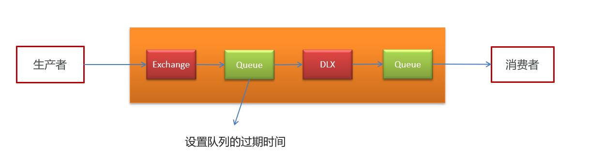
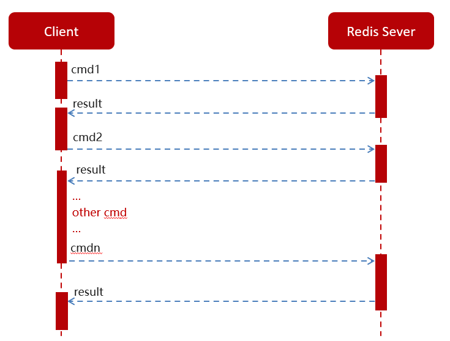

# 自我介绍

面试官您好，我叫朱敏欣，本硕都就读于武汉理工大学，目前研二，本硕都是电子信息专业，修过**数据结构与算法、数据库设计与应用、现代软件工程与实践、算法设计与分析、信息安全技术、模式识别**等课程，然后研究生期间主要研究的方向是自然语言处理。

在校期间，我也参与过老师接过的一些校企合作的计算机 CV 和 NLP 算法相关的系统开发项目，然后我主要就是做后台的开发以及算法的调用这部分，**研一**的时候做过一个**武汉林业局的绿化考核管理系统**，我在项目中主要负责项目后台的搭建，完成相应的功能模块，主要有**人员管理、考核打分、申诉整改**等方面，还设计了算法后台与 Java 后台的交互。

还有一个是校内勤工助学的时候做的一个武理校园微课堂的项目，这个项目中我主要是参与开发 **课程发布，课程计划制定，课程文件上传，课程搜索，和用户行为**等模块功能。然后，我前段时间在网上看到贵司的招聘信息，加上我个人也是学 Java 一段时间了，也做过一些后台开发的工作，因此希望能够通过这次机会找到一个**Java 后台开发方向**的工作。

# ==林发项目==

## Spring Security

继承**WebSecurityConfigurerAdapter 类**：重写 configure（）方法 添加 http.cors()允许跨域

Spring Security 在执行认证时，会根据用户提交的用户名，自动调用**userDetailService 类**中的 loadUserByUsername() 方法，当**得到返回的`UserDetails`后，会自动处理后续的细节**，**例如验证密码是否正确、将认证信息（登录成功后的用户信息）保存下来，便于后续识别用户身份等**

因为 Spring Security 会自动应用密码编码器（在 Security 配置类中使用`@Bean`方法配置的**PasswordEncoder**），数据库中的密码值必须是**BCrypt 编码**结果！

​ 核心是过滤器链，配置好三个类，其中的**获取用户信息的方式**，**密码校验的加密方式**以及**接口权限的配置**。

​ 原理就是将用户信息封装成**authentication**类，默认放到 session 中，每次访问通过 cookie 将 sessionId 带过来，如果存在对应 session 就说明已登录，然后过滤器会对每个请求访问的接口做权限的校验，从用户信息中取权限信息对比。有相应的权限就放行。是一种 RBAC 的权限控制方式。

​ 权限控制是简单给用户一个标识然后根据标识判断是否有访问权限。缺点是给要给用户赋新权限很麻烦

优化：这是一种 RBAC（role-based-access-controller）的权限控制方式，区别于 ACL 模型，围绕资源设置权限，直接判断某个权限面向那些用户开放。RBAC 模型做到用户和权限解耦，用角色去关联用户和权限，用户对应角色，角色拥有权限，这么做不仅结构上清晰，而且操作灵活（指增删改权限）。

实现会话的方式：

单体：cookie---session 方式，将 sessionId 写入 cookie 每次访问带过来，session 但是要注意 session 过期时间，以及一定要开启 cookie。

多服务器节点：1.可以通过特性的哈希策略分配给同一个服务器处理，缺点是一台服务器宕机则 session 信息全部丢失

2.每个服务器保存的 session 信息互相同步，但是成本太大

3.使用 redis 缓存存放 session 信息，同时 redis 服务器也要集群部署保证高可用

session 是基于 cookie 的，但是没有 cookie 也可以将 sessionId 请求的 url 中，安全性降低，当然也可以加密后传输

## JWT


JWT 本质上就是一组字串，通过（`.`）切分成三个为 Base64 编码的部分：

- **Header** : 描述 JWT 的元数据，定义了生成签名的算法以及 `Token` 的类型。
- **Payload** : 用来存放实际需要传递的数据
- **Signature（签名）** ：服务器通过 Payload、Header 和**一个密钥(Secret)**使用 Header 里面指定的签名算法（默认是 HMAC SHA256）生成。

JWT 通常是这样的：`xxxxx.yyyyy.zzzzz`。

**如何基于 JWT 进行身份验证？**

在基于 JWT 进行身份验证的的应用程序中，服务器通过 Payload、Header 和 Secret(密钥)创建 JWT 并将 JWT 发送给客户端。客户端接收到 JWT 之后，会将其保存在 Cookie 或者 localStorage 里面，以后客户端发出的所有请求都会携带这个令牌

两点建议：

1. 建议将 JWT 存放在 localStorage 中，放在 Cookie 中会有 CSRF 风险。
2. 请求服务端并携带 JWT 的常见做法是将其放在 HTTP Header 的 `Authorization` 字段中（`Authorization: Bearer Token`）。

**如何加强 JWT 的安全性？**

1. 使用安全系数高的加密算法。
2. 使用成熟的开源库，没必要造轮子。
3. JWT 存放在 localStorage 中而不是 Cookie 中，避免 CSRF**跨站请求伪造** 风险。
4. 一定不要将隐私信息存放在 Payload 当中。
5. 密钥一定保管好，一定不要泄露出去。JWT 安全的核心在于签名，签名安全的核心在密钥。
6. Payload 要加入 `exp` （JWT 的过期时间），永久有效的 JWT 不合理。并且，JWT 的过期时间不易过长。
7. .....

## RabbitMQ

- **异步处理提高系统性能（减少响应所需时间）**：==用 RabbitMQ 实现图片上传后与 Django 后台算法的异步调用==
- **流量削峰**：==因为 python 算法对每张图片的自动打分时间在 3~5s 左右，所以使用 mq 还可以对多个突发的打分任务进行缓冲。==
- **降低系统耦合性：** 消息发送者（生产者）发布消息，一个或多个消息接受者（消费者）订阅消息。==图片上传（生产者）和考核打分（消费者）之间没有直接耦合==

==**没用 xxl-job 任务调度的原因**==是 xxl-job 不好做到实时更新任务处理，可能会造成任务堆积（和任务的扫描时间有关，时间越短，堆积的可能性就越小），而后台算法识别本来就慢，最怕的就是图片处理任务堆积，而 MQ 的消费者是一直等待的，来了一个图片任务就直接消费处理。

在每次图片上传到后端时，后端会把图片保存到本地，生成本地图片的路径，再把图片基本信息和图片路径插入到图片基本信息表里，生成唯一的图片 ID，同时发送图片 ID 到打分交换机，打分交换机路由到打分队列，消费者监听打分队列拿到图片 ID，根据图片 ID 优先查 redis（查不到再查数据库）拿到该图片的本地路径，然后与 django 后台通信进行打分，打分结果保存到打分信息表。


### 消息堆积问题

**消息发送速度超过了消费者消息处理速度**。解决方案以下三点：

- **提高消费者处理速度**
- **增加更多消费者**
- **增加队列消息存储上限**

==我们使用的是增加消费者方案，一个队列绑定多个消费者，共同争抢任务，能者多劳，通过设置**prefetch**来控制消费者**预取的消息数量**。但是**一张图片的打分模型需要占 2 个多 G 的显存，服务器的显存是 12G 的，为防止会爆显存，最终是开启 5 个打分消费者同时对打分队列进行消费**==。

### 重复消费

**消费者端入手**，只要能**保证消息处理的幂等性**就可以确保消息不被重复消费。

而**幂等性的保证**又有很多方案：

- 给每一条消息都添加一个**唯一 id**，在本地记录消息表及消息状态，处理消息时==**基于数据库表的 id 唯一性**==做判断
- 同样是**记录消息表**，**利用消息状态字段实现基于乐观锁的判断，保证幂等**
- **基于业务本身的幂等性**。比如根据 id 的删除、查询业务天生幂等；新增、修改等业务可以考虑==**基于数据库 id 唯一性**==、或者乐观锁机制确保幂等。本质与消息表方案类似。

==项目中直接判断打分表里有没有图片的**唯一 ID**就可以判断幂等性。==

### 可靠性不丢失

- 开启**生产者确认机制**，确保生产者的消息能到达打分队列。
- 开启**mq 持久化**功能，确保消息未打分前在打分队列中不会丢失。
- 开启**打分确认机制为==auto==**，由 spring 确认消息处理成功后完成 ack。
- 开启**打分失败本地重试机制**，设置**MessageRecoverer**的实现为**RepublishMessageRecoverer(==首次 5s,2 倍,5 次==)**，**5 次**重试还失败后会将消息**==投递到打分异常交换机==**，交由**==人工处理打分==**。

### 生产者消息确认

这种机制必须给每个消息指定一个**唯一 ID(UUID)**，区分不同消息，避免 ack 冲突，封装到**CorrelationData**中：

```java
// 消息ID，需要封装到CorrelationData中
CorrelationData correlationData = new CorrelationData(UUID.randomUUID().toString());
// 发送消息
rabbitTemplate.convertAndSend("ttl.direct", "ttl", message, correlationData);
```

消息发送到 MQ 以后，会返回一个结果给发送者，表示消息是否处理成功。返回结果有两种方式：

- **publisher-confirm，发送者确认**
  - 消息成功投递到交换机，返回 ack
  - 消息未投递到交换机，返回 nack
- **publisher-return，发送者回执**
  - 消息投递到交换机了，但是没有路由到队列。返回 ACK，及路由失败原因。


修改 publisher 服务中的 application.yml 文件，添加下面的内容：

```yaml
spring:
  rabbitmq:
    publisher-confirm-type: correlated
    publisher-returns: true
    template:
      mandatory: true
```

- `publish-confirm-type`：开启 publisher-confirm，这里支持两种类型：
  - `simple`：同步等待 confirm 结果，直到超时
  - `correlated`：异步回调，定义 ConfirmCallback，MQ 返回结果时会回调这个 ConfirmCallback
- `publish-returns`：开启 publish-return 功能，同样是基于 callback 机制，不过是定义 ReturnCallback
- `template.mandatory`：定义消息**路由失败时的策略。true，则调用 ReturnCallback**；false：则直接丢弃消息

#### 定义 ReturnCallback

每个 RabbitTemplate 只能配置一个 ReturnCallback，因此需要在项目加载时配置：

修改 publisher 服务，添加一个：

```java
package cn.itcast.mq.config;
import lombok.extern.slf4j.Slf4j;
import org.springframework.amqp.rabbit.core.RabbitTemplate;
import org.springframework.beans.BeansException;
import org.springframework.context.ApplicationContext;
import org.springframework.context.ApplicationContextAware;
import org.springframework.context.annotation.Configuration;

@Slf4j
@Configuration
public class CommonConfig implements ApplicationContextAware {
    @Override
    public void setApplicationContext(ApplicationContext applicationContext) throws BeansException {
        // 获取RabbitTemplate
        RabbitTemplate rabbitTemplate = applicationContext.getBean(RabbitTemplate.class);
        // 设置ReturnCallback
        rabbitTemplate.setReturnCallback((message, replyCode, replyText, exchange, routingKey) -> {
            // 投递失败，记录日志
            log.info("消息发送失败，应答码{}，原因{}，交换机{}，路由键{},消息{}",
                     replyCode, replyText, exchange, routingKey, message.toString());
            // 如果有业务需要，可以重发消息
        });
    }
}
```

#### 定义 ConfirmCallback

ConfirmCallback 可以在发送消息时指定，因为每个业务处理 confirm 成功或失败的逻辑不一定相同。

在 publisher 服务的 cn.itcast.mq.spring.SpringAmqpTest 类中，定义一个单元测试方法：

```java
public void testSendMessage2SimpleQueue() throws InterruptedException {
    // 1.消息体
    String message = "hello, spring amqp!";
    // 2.全局唯一的消息ID，需要封装到CorrelationData中
    CorrelationData correlationData = new CorrelationData(UUID.randomUUID().toString());
    // 3.添加callback
    correlationData.getFuture().addCallback(
        result -> {
            if(result.isAck()){
                // 3.1.ack，消息成功
                log.debug("消息发送成功, ID:{}", correlationData.getId());
            }else{
                // 3.2.nack，消息失败
                log.error("消息发送失败, ID:{}, 原因{}",correlationData.getId(), result.getReason());
            }
        },
        ex -> log.error("消息发送异常, ID:{}, 原因{}",correlationData.getId(),ex.getMessage())
    );
    // 4.发送消息
    rabbitTemplate.convertAndSend("task.direct", "task", message, correlationData);
    // 休眠一会儿，等待ack回执
    Thread.sleep(2000);
}
```

### 消费者消息确认

SpringAMQP 允许配置三种 ACK 确认模式：

- **manual**：**手动 ack**，需要在**业务代码结束**后，**调用 api 发送 ack**。
- **auto**：**自动 ack**，由 spring 监测 listener 代码是否出现异常，**没有异常则返回 ack，消息正常删除**；**抛出异常则返回 nack，消息重新进队列**
- **none**：**关闭 ack**，MQ 假定消费者获取消息后会成功处理，因此消息投递后立即被删除

**==项目中使用的是 auto==**模式：修改 application.yml 文件：

```yaml
spring:
  rabbitmq:
    listener:
      simple:
        acknowledge-mode: auto # 关闭ack
```

#### 本地重试

**利用 Spring 的 retry 机制**，在消费者出现异常时进行**本地重试**，**而不是无限制的 requeue**到 mq 队列。修改 application.yml 文件：

```yaml
spring:
  rabbitmq:
    listener:
      simple:
        retry:   # 失败重试等待 5s 10s 20s 40s 80s
          enabled: true # 开启消费者失败重试
          initial-interval: 5000 # 初次失败等待时长为5秒
          multiplier: 2 # 失败的等待时长倍数
          max-attempts: 5 # 最大重试次数
          stateless: true # true无状态；false有状态。如果业务中包含事务，这里改为false
```

**==处理失败最大 5 次，每次失败等待时间为 5s 10s 20s 40s 80s，重试达到 5 次后，根据失败策略来处理消息==**

#### 失败策略

在开启重试模式后，重试次数耗尽，如果消息依然失败，则需要有**MessageRecovery**接口来处理，它包含三种不同的实现：

- RejectAndDontRequeueRecoverer：重试耗尽后，**默认直接丢弃**消息。

- ImmediateRequeueMessageRecoverer：重试耗尽后，返回**nack**，**消息重新入队**

- **RepublishMessageRecoverer**：重试耗尽后，将失败消息**投递到指定的交换机**

==项目中使用的是优雅的处理方案是**RepublishMessageRecoverer**，失败后将消息投递到一个**处理失败的死信交换机**中，**交换机再路由到指定的专门存放图片处理失败异常消息的队列，后续由管理员和打分人员进行人工处理打分。**==

### 高可用

要实现 RabbitMQ 的高可用无外乎下面两点：

- 做好**交换机、队列、消息**的**持久化**
- 搭建 RabbitMQ 的**镜像集群**，做好**主从备份**。当然也可以使用**仲裁队列代替镜像集群**。

### 持久化

**交换机持久化**：RabbitMQ 中交换机**默认是非持久化**的，mq**重启后就丢失**。**但由 SpringAMQP 声明的交换机默认都是持久化的。**

SpringAMQP 中可以通过代码 new DirectExchange("simple.direct", **true**, false)指定交换机持久化：

```java
@Bean
public DirectExchange simpleExchange(){
    // 三个参数：交换机名称、是否持久化、当没有queue与其绑定时是否自动删除
    return new DirectExchange("simple.direct", true, false);
}
```

**队列持久化**：RabbitMQ 中队列默认是非持久化的，mq 重启后就丢失。

**但由 SpringAMQP 声明的队列默认都是持久化的。**

SpringAMQP 中可以通过代码**.durable()**指定交队列持久化：

```java
@Bean
public Queue simpleQueue(){
    // 使用QueueBuilder构建队列，durable就是持久化的
    return QueueBuilder.durable("simple.queue").build();
}
```

**消息持久化**：SpringAMQP 发出的**任何消息默认都是持久化**的，不用特意指定。可以设置消息的属性（MessageProperties），指定**delivery-mode**：

- 1：非持久化
- 2：持久化


### 镜像集群

RabbitMQ 的集群有两种模式：

**普通集群**：是一种**分布式集群**，将**队列分散到集群的各个节点**，从而提高整个集群的**并发能力**。

- 会在集群的**各个节点间共享部分数据**，包括：**交换机、队列元信息**。**不包含队列中的消息**。
- 当访问集群某节点时，如**果队列不在该节点，会从数据所在节点传递到当前节点并返回**
- 队列所在**节点宕机**，队列中的**消息就会丢失**

==**项目中使用的是镜像集群**：是一种**主从集群**，普通集群的基础上，**添加了主从备份功能**，提高集群的数据**可用性**。==

- **交换机、队列、队列中的消息**会在各个 mq 的镜像节点之间**同步备份**。
- 创建队列的节点被称为该队列的**主节点，**备份到的其它节点叫做该队列的**镜像**节点。
- 一个队列的主节点可能是另一个队列的镜像节点
- **所有操作都是主节点完成**，然后**同步给镜像节点**
- **主宕机**后，**镜像节点会替代成新的主节点**


**仲裁队列**：**镜像集群主从同步并不是强一致的**，某些情况下**可能有数据丢失**的风险。因此在 RabbitMQ 的 3.8 版本以后，推出了新的功能：**仲裁队列**来**代替镜像集群**，底层采用**Raft 协议**确保主从的**数据一致性**。

```java
@Bean
public Queue quorumQueue() {
    return QueueBuilder
        .durable("quorum.queue") // 持久化
        .quorum() // 仲裁队列
        .build();
}
```

## Elasticsearch

使用 Elasticsearch 实现十万级图片的**区名**，**街道名**，**考核类名**搜索；

### 基础查询

区名 districtName：

街道名 streetName：

考核类名 assessmentName：

审核状态 status：

关键词 key：

### 距离排序

与当前位置距离从近到远排序，以 km 为单位，**排序字段 sort 值就是实际距离**，可以**回显到前端显示**，String location = ”经度，纬度“。

```java
@Override
public PageResult search(RequestParams params) {
    try {
        // 1.准备Request
        SearchRequest request = new SearchRequest("hotel");
        // 2.准备DSL
        // 2.1.query
        buildBasicQuery(params, request);

        // 2.2.分页
        int page = params.getPage();
        int size = params.getSize();
        request.source().from((page - 1) * size).size(size);

        // 2.3.排序
        String location = params.getLocation();
        if (location != null && !location.equals("")) {
            request.source().sort(SortBuilders
                                  .geoDistanceSort("location", new GeoPoint(location))
                                  .order(SortOrder.ASC)
                                  .unit(DistanceUnit.KILOMETERS)
                                 );
        }
        // 3.发送请求
        SearchResponse response = client.search(request, RequestOptions.DEFAULT);
        // 4.解析响应
        return handleResponse(response);
    } catch (IOException e) {
        throw new RuntimeException(e);
    }
}
```

### 分页查询

**page=100，pageSize=10，from=(100-1)\*10=990,size=10，就要查询 990~1000 的数据**，但 elasticsearch 内部分页时，必须**先查询 0~1000**条，然后**截取其中的 990 ~ 1000**的这 10 条

**深度分页问题**：当查询分页深度较大时，汇总数据过多，对**内存和 CPU**会产生非常大的压力，因此 elasticsearch 会**禁止 from+ size 超过 10000**的请求。

分页查询的常见实现方案以及优缺点：

- `from + size`：
  - 优点：**支持随机翻页**
  - 缺点：深度分页问题，默认查询上限（from + size）是**10000**
  - 场景：百度、京东、谷歌、淘宝这样的随机翻页搜索
- `after search`：分页时需要排序，原理是从上一次的排序值开始，查询下一页数据。官方推荐。

  - 优点：没有查询上限（单次查询的 size 不超过 10000）
  - 缺点：只能**向后逐页**查询，不支持随机翻页
  - 场景：**没有随机翻页需求的搜索**，例如**手机向下滚动翻页**

- `scroll`：将排序后的**文档 id 形成快照**，**保存在内存**。官方已经**不推荐**使用。
  - 优点：没有查询上限（单次查询的 size 不超过 10000）
  - 缺点：会有额外内存消耗，并且**搜索结果是非实时的**
  - 场景：**海量数据的获取和迁移**。从 ES7.1 开始**不推荐**，建议用 after search 方案。

### mq 异步数据同步

常见的数据同步方案有三种：

- **同步调用**：实现简单，粗暴，缺点：业务耦合度高
- **异步通知**：低耦合，实现难度一般，缺点：依赖 mq 的可靠性
- **监听 binlog**（用**canal**）：完全解除服务间耦合，缺点：开启 binlog 增加数据库负担、实现复杂度高

**由于前面使用的是 rabbitmq 做图片的算法异步调用，所以这里同样采取 rabbitmq 来实现数据同步**：


- 生产者和消费者两端都要声明 exchange、queue、RoutingKey
- 在 hotel-admin 中的增、删、改业务中完成消息发送
- 在 hotel-demo 中完成消息监听，并更新 elasticsearch 中数据

**声明绑定交换机队列**


**1）引入依赖**

引入 rabbitmq 的 amqp 依赖：

```xml
<!--amqp-->
<dependency>
    <groupId>org.springframework.boot</groupId>
    <artifactId>spring-boot-starter-amqp</artifactId>
</dependency>
```

先起名

```java
package cn.itcast.hotel.constatnts;

    public class MqConstants {
    /**
     * 交换机
     */
    public final static String HOTEL_EXCHANGE = "hotel.topic";
    /**
     * 监听新增和修改的队列
     */
    public final static String HOTEL_INSERT_QUEUE = "hotel.insert.queue";
    /**
     * 监听删除的队列
     */
    public final static String HOTEL_DELETE_QUEUE = "hotel.delete.queue";
    /**
     * 新增或修改的RoutingKey
     */
    public final static String HOTEL_INSERT_KEY = "hotel.insert";
    /**
     * 删除的RoutingKey
     */
    public final static String HOTEL_DELETE_KEY = "hotel.delete";
}
```

**定义配置类，声明绑定**队列、交换机：

```java
package cn.itcast.hotel.config;

import cn.itcast.hotel.constants.MqConstants;
import org.springframework.amqp.core.Binding;
import org.springframework.amqp.core.BindingBuilder;
import org.springframework.amqp.core.Queue;
import org.springframework.amqp.core.TopicExchange;
import org.springframework.context.annotation.Bean;
import org.springframework.context.annotation.Configuration;

@Configuration
public class MqConfig {
    @Bean
    public TopicExchange topicExchange(){
        return new TopicExchange(MqConstants.HOTEL_EXCHANGE, true, false);
    }

    @Bean
    public Queue insertQueue(){
        return new Queue(MqConstants.HOTEL_INSERT_QUEUE, true);
    }

    @Bean
    public Queue deleteQueue(){
        return new Queue(MqConstants.HOTEL_DELETE_QUEUE, true);
    }

    @Bean
    public Binding insertQueueBinding(){
        return BindingBuilder.bind(insertQueue()).to(topicExchange()).with(MqConstants.HOTEL_INSERT_KEY);
    }

    @Bean
    public Binding deleteQueueBinding(){
        return BindingBuilder.bind(deleteQueue()).to(topicExchange()).with(MqConstants.HOTEL_DELETE_KEY);
    }
}
```

**发送 MQ 消息**

在考核图片的增、删、改业务中分别发送 MQ 消息：


**接收 MQ 消息**

图片搜索业务接收到 MQ 消息要做的事情包括：

- 新增消息：根据传递的 pic 的 id 查询 pic 信息，然后新增一条数据到索引库
- 删除消息：根据传递的 pic 的 id 删除索引库中的一条数据

1）在图片搜索业务中的 Service 中实现业务：

```java
@Override
public void deleteById(Long id) {
    try {
        // 1.准备Request
        DeleteRequest request = new DeleteRequest("hotel", id.toString());
        // 2.发送请求
        client.delete(request, RequestOptions.DEFAULT);
    } catch (IOException e) {
        throw new RuntimeException(e);
    }
}

@Override
public void insertById(Long id) {
    try {
        // 0.根据id查询酒店数据
        Hotel hotel = getById(id);
        // 转换为文档类型
        HotelDoc hotelDoc = new HotelDoc(hotel);

        // 1.准备Request对象
        IndexRequest request = new IndexRequest("hotel").id(hotel.getId().toString());
        // 2.准备Json文档
        request.source(JSON.toJSONString(hotelDoc), XContentType.JSON);
        // 3.发送请求
        client.index(request, RequestOptions.DEFAULT);
    } catch (IOException e) {
        throw new RuntimeException(e);
    }
}
```

2）编写 Listener 监听器

```java
package cn.itcast.hotel.mq;

import cn.itcast.hotel.constants.MqConstants;
import cn.itcast.hotel.service.IHotelService;
import org.springframework.amqp.rabbit.annotation.RabbitListener;
import org.springframework.beans.factory.annotation.Autowired;
import org.springframework.stereotype.Component;

@Component
public class HotelListener {

    @Autowired
    private IHotelService hotelService;

    /**
     * 监听酒店新增或修改的业务
     * @param id 酒店id
     */
    @RabbitListener(queues = MqConstants.HOTEL_INSERT_QUEUE)
    public void listenHotelInsertOrUpdate(Long id){
        hotelService.insertById(id);
    }

    /**
     * 监听酒店删除的业务
     * @param id 酒店id
     */
    @RabbitListener(queues = MqConstants.HOTEL_DELETE_QUEUE)
    public void listenHotelDelete(Long id){
        hotelService.deleteById(id);
    }
}
```

### ES 集群

单机的 elasticsearch 做数据存储，必然面临两个问题：

- **海量数据存储**问题：将索引库从**逻辑上**拆分为 N 个**分片**（shard），**存储到多个节点**
- **单点故障**问题：将分片数据**在不同节点备份**（replica ）

数据备份可以保证高可用，但是每个分片备份一份，所需要的节点数量就会翻一倍，成本实在是太高了！**为了在高可用和成本间寻求平衡**：

- ==**首先对数据分片**，存储到不同节点==
- ==然后对每个分片进行**备份，放到不同的节点**，完成互相备份==


### 脑裂问题

**脑裂**是因为集群中的**节点失联导致的**。

**解决脑裂的方案**是，要求选票**超过 ( eligible 节点数量 + 1 ）/ 2** 才能当选为主，因此**eligible 节点数量最好是奇数**。对应配置项是 discovery.zen.minimum_master_nodes，在 es7.0 以后，已经成为默认配置，因此一般不会发生脑裂问题

==**项目中使用的是 3 个节点形成的集群（分别在 3 台不同的服务器）**，选票必须超过 **（3 + 1） / 2 ，也就是 2 票**。==node3 得到 node2 和 node3 的选票，当选为主。node1 只有自己 1 票，没有当选。集群中依然只有 1 个主节点，没有出现脑裂。

### 分片存储原理

elasticsearch 会通过==**hash 算法**==来计算文档应该存储到哪个分片：


- ==**项目中使用的\_routing 默认是文档的 id**==
- **算法与分片数量有关**，因此**索引库一旦创建**，**分片数量不能修改**！

新增文档的流程如下：


- 1）新增一个 id=1 的文档
- 2）对 id 做 hash 运算，假如得到的是 2，则应该存储到 shard-2
- 3）shard-2 的主分片在 node3 节点，将数据路由到 node3
- 4）保存文档
- 5）同步给 shard-2 的副本 replica-2，在 node2 节点
- 6）返回结果给 coordinating-node 节点

### 集群故障转移

集群的**master**节点会监控集群中的节点状态，**如果发现有节点宕机，会立即将宕机节点的分片数据迁移到其它节点**，确保数据安全，这个叫做故障转移。

宕机后的第一件事，需要重新选主，例如选中了 node2：


node2 成为主节点后，会检测集群监控状态，发现：shard-1、shard-0 没有副本节点。因此需要将 node1 上的数据迁移到 node2、node3：


## 全局自定义异常

```java
@ControllerAdvice  //控制器增强类
public class ExceptionCatch {
    /**
     * 处理不可控异常
     * @param e
     * @return
     */
    @ExceptionHandler(Exception.class)
    @ResponseBody
    public ResponseResult exception(Exception e){}
    /**
     * 处理可控异常  自定义异常
     * @param e
     * @return
     */
    @ExceptionHandler(CustomException.class)
    @ResponseBody
    public ResponseResult exception(CustomException e){}
```

# ==微课堂项目==


## 课程发布


### redis 实现延迟

zset 数据类型的去重有序（分数排序）特点进行延迟。例如：时间戳作为 score 进行排序


问题思路

**1.为什么任务需要存储在数据库中？**

延迟任务是一个通用的服务，任何需要延迟得任务都可以调用该服务，需要考虑数据持久化的问题，**存储数据库中是一种数据安全的考虑。**

**2.为什么 redis 中使用两种数据类型，list 和 zset？**

效率问题，算法的时间复杂度：**list 是 O(1)**，**zset 是 O(M\*log(n))**

**3.在添加 zset 数据的时候，为什么不需要预加载？**

任务模块是一个通用的模块，项目中任何需要延迟队列的地方，都可以调用这个接口，要**考虑到数据量的问题，如果数据量特别大，为了防止阻塞，只需要把未来几分钟要执行的数据存入缓存即可**。

**@Scheduled 线程阻塞问题**：上面用 Redis 实现延迟发布的时候有两次定时任务的刷新，**从 DB 刷新到 Redis**，和**从 Redis 里面的 zSet 刷新到 list**。这两个是在用同一个线程去定时刷新执行的，就是说如果。其中有一个刷新任务因为**网络什么问题迟迟没有执行完。就会当前线程就会被阻塞，然后另外一个定时刷新的任务也会被阻塞**。这样可能就会造成需要立即刷新到 list 里面去要发布的课程没有及时的发布。

解决方法就是**给 Scheduled 去 set 一个线程池**。


### fixedRate 和 fixedDelay

**fixedDelay**非常好理解，**它的间隔时间是根据上次的任务结束的时候开始计时的**。比如一个方法上设置了 fixedDelay=5\*1000，那么当该方法某一次执行结束后，开始计算时间，当时间达到 5 秒，就开始再次执行该方法。

**fixedRate**比较麻烦，它的间隔时间是**根据上次任务开始的时候计时的**。比如当方法上设置了 fiexdRate=5\*1000，该执行该方法所花的时间是 2 秒，那么 3 秒后就会再次执行该方法。**当任务执行时长超过设置的间隔时长（网络问题）**，会**产生任务阻塞**。
被阻塞的任务就像排队的人一样，一旦前一个任务没了，它就立马执行。

**@Scheduled(fixedRate)如何避免任务被阻塞**
答案是加上注解**@EnableAsync（spring 启动类上）**和**@Async（方法上）**，就**开启了多线程模式**，当到了下一次任务的执行时机时，**如果上一次任务还没执行完，就会自动创建一个新的线程来执行它**。异步执行也可以理解为**保证了任务以固定速度执行**。

**这种情况下的线程是随着任务一执行完就销毁的，等下次有需要了程序再创建一个**。每次都要重新创建明显是**太影响性能**了，所以需要在代码里给他一个**线程池**。需注意的是，如果线程池里的所有线程都被拿去执行调度任务了，且又到了时间要执行一次任务，那么这个任务又会被阻塞。所以实际开发中如果想要保证任务以速度被执行，**线程池的最大线程数量可要想好**。

### xxl-job 定时扫描任务

**xxl-job 定时 10 秒钟去扫描 message 任务表，默认取出 30 个任务一起执行，去多少条就创建一个多少线程的线程池，CountDownLatch，给一个充裕的超时时间,防止无限等待，到达超时时间还没有处理完成则结束任务**。

```java
// xxl-job定时10秒钟 扫描消息表获取任务清单
List<MqMessage> messageList = mqMessageService.getMessageList(shardIndex, shardTotal,messageType, count);
//任务个数
int size = messageList.size();
log.debug("取出待处理消息"+size+"条");
if(size<=0){
    return ;
}

//创建线程池
ExecutorService threadPool = Executors.newFixedThreadPool(size);
//计数器
CountDownLatch countDownLatch = new CountDownLatch(size);
messageList.forEach(message -> {
    threadPool.execute(() -> {
        log.debug("开始任务:{}",message);
        //处理任务
        try {
            boolean result = execute(message);
            if(result){
                log.debug("任务执行成功:{})",message);
                //更新任务状态,删除消息表记录,添加到历史表
                int completed = mqMessageService.completed(message.getId());
                if (completed>0){
                    log.debug("任务执行成功:{}",message);
                }else{
                    log.debug("任务执行失败:{}",message);
                }
            }
        } catch (Exception e) {
            e.printStackTrace();
            log.debug("任务出现异常:{},任务:{}",e.getMessage(),message);
        }finally {
            //计数
            countDownLatch.countDown();
        }
        log.debug("结束任务:{}",message);
    });
});
//等待,给一个充裕的超时时间,防止无限等待，到达超时时间还没有处理完成则结束任务
countDownLatch.await(timeout,TimeUnit.SECONDS);
System.out.println("结束....");
```

### 延迟任务

#### DelayQueue

JDK 自带 DelayQueue 是一个支持延时获取元素的阻塞队列， 内部采用**优先队列 PriorityQueue** 存储元素；在创建元素时**可以指定多久才可以从队列中获取当前元素**，只有在延迟期满时才能从队列中提取元素


DelayQueue 属于排序队列，它的特殊之处在于队列的元素必须实现**Delayed**接口，该接口需要实现**compareTo**和**getDelay 方法**

**getDelay**方法：获取元素在队列中的剩余时间，只有当剩余时间为 0 时元素才可以出队列。

**compareTo**方法：用于排序，确定元素出队列的顺序。

DelayQueue 实现完成之后思考一个问题：

使用线程池或者原生 DelayQueue 程序**挂掉**之后，**任务都是放在内存**，需要考虑**未处理消息的丢失**带来的影响，如何保证数据不丢失，**需要持久化（磁盘）**

#### RabbitMQ 实现延迟

- **TTL**：Time To Live (消息存活时间)

- **死信队列**：Dead Letter Exchange(死信交换机)，当消息成为 Dead message 后，可以重新发送另一个交换机（死信交换机）



#### redis 实现延迟

zset 数据类型的去重有序（分数排序）特点进行延迟。例如：时间戳作为 score 进行排序


问题思路

**1.为什么任务需要存储在数据库中？**

延迟任务是一个通用的服务，任何需要延迟得任务都可以调用该服务，需要考虑数据持久化的问题，**存储数据库中是一种数据安全的考虑。**

**2.为什么 redis 中使用两种数据类型，list 和 zset？**

效率问题，算法的时间复杂度：**list 是 O(1)**，**zset 是 O(M\*log(n))**

**3.在添加 zset 数据的时候，为什么不需要预加载？**

任务模块是一个通用的模块，项目中任何需要延迟队列的地方，都可以调用这个接口，要**考虑到数据量的问题，如果数据量特别大，为了防止阻塞，只需要把未来几分钟要执行的数据存入缓存即可**。

## 用户行为

![[图集/image-20230801112845697.png|700]]

**热点课程查询**接口 RT 从**300ms**（查数据库）优化到**20ms 以内**（查 Redis）

### Feed 流关注推送

Feed 流实现有两种常见模式：
**Timeline**：不做内容筛选，简单的按照内容发布时间排序，常用于好友或关注。例如朋友圈

- 优点：信息全面，不会有缺失。并且实现也相对简单
- 缺点：信息噪音较多，用户不一定感兴趣，内容获取效率低

**智能算法排序**：利用智能算法屏蔽掉违规的、用户不感兴趣的内容。推送用户感兴趣信息来吸引用户

- 优点：投喂用户感兴趣信息，用户粘度很高，容易沉迷
- 缺点：如果算法不精准，可能起到反作用
  本例中的个人页面，是基于关注的好友来做 Feed 流，因此采用 Timeline 的模式。该模式的实现方案有三种：

我们本次针对好友的操作，采用的就是 Timeline 的方式，只需要拿到我们关注用户的信息，然后按照时间排序即可

，因此采用**Timeline 的模式**。该模式的**实现方案有三种**：

- **拉模式**
- **推模式**
- **推拉结合**

**拉模式**：也叫做读扩散

该模式的核心含义就是：当张三和李四和王五发了消息后，都会保存在自己的邮箱中，假设赵六要读取信息，那么他会从读取他自己的收件箱，此时系统会从他关注的人群中，把他关注人的信息全部都进行拉取，然后在进行排序

优点：比较节约空间，因为赵六在读信息时，并没有重复读取，而且读取完之后可以把他的收件箱进行清楚。

缺点：比较延迟，当用户读取数据时才去关注的人里边去读取数据，假设用户关注了大量的用户，那么此时就会拉取海量的内容，对服务器压力巨大。


**推模式**：也叫做写扩散。

推模式是没有写邮箱的，当张三写了一个内容，此时会主动的把张三写的内容发送到他的粉丝收件箱中去，假设此时李四再来读取，就不用再去临时拉取了

优点：时效快，不用临时拉取

缺点：内存压力大，假设一个大 V 写信息，很多人关注他， 就会写很多分数据到粉丝那边去


**推拉结合模式**：也叫做读写混合，兼具推和拉两种模式的优点。

推拉模式是一个折中的方案，站在发件人这一段，如果是个普通的人，那么我们采用写扩散的方式，直接把数据写入到他的粉丝中去，因为普通的人他的粉丝关注量比较小，所以这样做没有压力，如果是大 V，那么他是直接将数据先写入到一份到发件箱里边去，然后再直接写一份到活跃粉丝收件箱里边去，现在站在收件人这端来看，如果是活跃粉丝，那么大 V 和普通的人发的都会直接写入到自己收件箱里边来，而如果是普通的粉丝，由于他们上线不是很频繁，所以等他们上线时，再从发件箱里边去拉信息。


# 其它

## @Async

@Async 配置有两个，一个是**执行的线程池**，一个是**异常处理**

**执行的线程池**默认情况下找唯一的 org.springframework.core.task.TaskExecutor，或者一个 Bean 的 Name 为 taskExecutor 的 java.util.concurrent.Executor 作为执行任务的线程池。如果都没有的话，会创建 SimpleAsyncTaskExecutor 线程池来处理异步方法调用，当然 @Async 注解支持一个 String 参数，来指定一个 Bean 的 Name，类型是 Executor 或 TaskExecutor，表示使用这个指定的线程池来执行这个异步任务。**实现接口 RejectedExecutionHandler，配置自己的线程拒绝策略。**

**异常处理**，@Async 标记的方法**只能是 void 或者 Future** 返回值，在无返回值的异步调用中，异步处理抛出异常，默认是 SimpleAsyncUncaughtExceptionHandler 的 handleUncaughtException() 会捕获指定异常，只是简单的输出了错误日志(一般需要自定义配置异常处理)，原有任务还会继续运行，直到结束(具有 void 返回类型的方法不能将任何异常发送回调用者，默认情况下此类未捕获异常只会输出错误日志)，而在有返回值的异步调用中，异步处理抛出了异常，会直接返回主线程处理，异步任务结束执行，主线程也会被异步方法中的异常中断结束执行

**Spring boot 异步任务@Async 失效问题**

1、注解的方法必须是**public**方法，不能是 static；

2、**启动类是否开启异步**服务；

3、**在定义异步方法的同一个类中**，调用带有@Async 注解方法，该方法则无法异步执行；

4、**没有走 Spring 的代理类，一定要经过 Spring 容器管理**。因为@Async 和@Transactional 注解的实现都是基于 Spring 的 AOP，而 AOP 的实现是基于动态代理模式实现的。那么注解失效的原因就很明显了，有可能因为调用方法的是对象本身而不是代理对象，因为没有经过 Spring 容器管理。

## ThreadLocal 存 userId

网关负责解析请求头里的有 token 完成认证，再将解析的 userId 存入请求头，并路由到微服务，微服务里定义一个拦截器实现**HandlerInterceptor**这个接口时，重写他的**preHandle**()方法和**postHandle**()方法，其中 preHandle 把请求头里的 userId 取出放到 ThreadLocal 里，postHandle 方法里销毁 ThreadLocal 里的 userId。

**但如果中间出现异常，postHandle 方法是执行不到的**，ThreadLocal 里的 userId 也就没能及时销毁，可能会发生**内存泄漏**，HandlerInterceptor 里还有个**afterCompletion**方法，**就算有异常最后也会执行**，用它来清除 userId 就行。

另外要注意的是：==**用@Async 修饰的异步方法里是拿不到之前 ThreadLocal 里存的 userId 的，因为他是异步另开一个线程去执行**==

## feign 的熔断降级

==feign 的远程调用的时候编写熔断降级的逻辑时，使用**fallback**定义降级类是无法拿到熔断异常，使用**FallbackFactory**可以拿到熔断的异常信息，继承 FallbackFactory，重写 FallbackFactory 里的**create**()方法，方法里写调用函数失败的降级逻辑，**打印拿到的熔断异常信息 throwable**，进行排错。==


## 项目中 MySQL 优化

批量一次性发送到数据库进行批量保存

```java
//批量保存
wmNewsMaterialMapper.saveRelations(idList,newsId,type);
```

```xml
<mapper namespace="com.heima.wemedia.mapper.WmNewsMaterialMapper">
    <insert id="saveRelations">
        insert into wm_news_material (material_id,news_id,type,ord)
        values
        <foreach collection="materialIds" index="ord" item="mid" separator=",">
            (#{mid},#{newsId},#{type},#{ord})
        </foreach>
    </insert>
</mapper>
```

## redis key 值匹配查询

方案 1：**keys 模糊匹配**

keys 的模糊匹配功能很方便也很强大，但是在生产环境需要慎用！开发中使用 keys 的模糊匹配却发现 redis 的**CPU 使用率极高**，所以公司的 redis 生产环境将 keys 命令**禁用**了！**redis 是单线程，会被堵塞**

方案 2：**scan**

SCAN 命令是一个基于游标的迭代器，SCAN 命令每次被调用之后， 都会向用户返回一个新的游标， 用户在下次迭代时需要使用这个新游标作为 SCAN 命令的游标参数， 以此来延续之前的迭代过程。


```java
@Test
public void testKeys(){
    Set<String> keys = cacheService.keys("future_*");
    System.out.println(keys);

    Set<String> scan = cacheService.scan("future_*");
    System.out.println(scan);
}
```

## redis 管道

普通 redis 客户端和服务器交互模式



Pipeline 请求模型


## 分布式锁

分布式锁：控制分布式系统有序的去对共享资源进行操作，通过互斥来保证数据的一致性。解决方案：


1、**基于数据库实现分布锁**

利用数据库主键唯一性的特点，或利用数据库唯一索引的特点，多个线程同时去插入相同的记录，谁插入成功谁就抢到锁。

2、**基于 redis 实现锁**

redis 提供了分布式锁的实现方案，比如：**SETNX**、**redisson**等。

拿 SETNX 举例说明，SETNX 命令的工作过程是去 set 一个不存在的 key，多个线程去设置同一个 key 只会有一个线程设置成功，设置成功的的线程拿到锁。

3、**使用 zookeeper 实现**

zookeeper 是一个分布式协调服务，主要解决分布式程序之间的同步的问题。zookeeper 的结构类似的文件目录，多线程向 zookeeper 创建一个子目录(节点)只会有一个创建成功，利用此特点可以实现分布式锁，谁创建该结点成功谁就获得锁。

### redis 分布式锁

**SETNX ** （SET if Not eXists） 思路是，如果 key 不存在则为 key 设置 value，如果 key 已存在则 SETNX 命令不做任何操作

释放锁分为两种情况：key 到期自动释放，手动删除。**setNX 缺点就是锁的过期时间不好把握**

1）**key 到期自动释放**的方法

因为锁设置了过期时间，key 到期会自动释放，但是会存在一个问题就是 **查询数据库等操作还没有执行完时 key 到期了，此时其它线程就抢到锁了，最终重复查询数据库执行了重复的业务操作**。

怎么解决：可以**将 key 的到期时间设置的长一些**，足以执行完成查询数据库并设置缓存等相关操作。这样效率会低一些，这个**时间值也不好把控。**

2）**手动删除锁**

如果是采用手动删除锁可能和 key 到期自动删除有所冲突，造成删除了别人的锁。

比如：当查询数据库等业务还没有执行完时 key 过期了，此时其它线程占用了锁，当上一个线程执行查询数据库等业务操作完成后手动删除锁就把其它线程的锁给删除了。

解决办法就是：**删除锁之前判断是不是自己设置的锁**，伪代码如下：

```java
if(缓存中有){
  返回缓存中的数据
 }else{
  获取分布式锁: set lock thread1 NX
  if(获取锁成功）{
    try{
     查询数据库
    }finally{    // 下面这2行操作也要是原子性的（lua实现），不然也会删别人的锁
     if(redis.call("get","lock")=="thread1"){
       释放锁: redis.call("del","lock")
     }
```

基于**setnx**实现的分布式锁存在下面的问题：

**重入问题**：重入问题是指 获得锁的线程可以再次进入到相同的锁的代码块中，可重入锁的意义在于防止死锁，比如 HashTable 这样的代码中，他的方法都是使用 synchronized 修饰的，假如他在一个方法内，调用另一个方法，那么此时如果是不可重入的，不就死锁了吗？所以可重入锁他的主要意义是防止死锁，我们的 synchronized 和 Lock 锁都是可重入的。

**不可重试**：是指目前的分布式只能尝试一次，我们认为合理的情况是：当线程在获得锁失败后，他应该能再次尝试获得锁。

**超时释放：**我们在加锁时增加了过期时间，这样的我们可以防止死锁，但是如果卡顿的时间超长，虽然我们采用了 lua 表达式防止删锁的时候，误删别人的锁，但是毕竟没有锁住，有安全隐患

**主从一致性：** 如果 Redis 提供了主从集群，当我们向集群写数据时，主机需要异步的将数据同步给从机，而万一在同步过去之前，主机宕机了，就会出现死锁问题。

**Redisson**相比 SETNX 实现分布式锁要简单的多，工作原理如下：


• **加锁机制**

线程去获取锁，获取成功: 执行 lua 脚本，保存数据到 redis 数据库。

获取失败: **一直通过 while 循环尝试获取锁（自旋）**，获取成功后，执行 lua 脚本，保存数据到 redis

• **WatchDog 自动延期看门狗机制**

第一种情况：在一个分布式环境下，假如一个线程获得锁后，突然服务器宕机了，那么这个时候在一定时间后这个锁会自动释放，你也可以设置锁的有效时间(**当不设置默认 30 秒**），这样的目的主要是**防止死锁**的发生

第二种情况：线程 A 业务**还没有执行完，时间就过了**，线程 A 还想持有锁的话，就会**启动一个 watch dog 后台线程，不断的延长锁 key 的生存时间**。

• **lua 脚本保证原子性操作**

主要是如果你的业务逻辑复杂的话，通过封装在 lua 脚本中发送给 redis，而且 redis 是单线程的，这样就保证这段复杂业务逻辑执行的原子性

具体使用 RLock 操作分布锁，RLock 继承 JDK 的 Lock 接口，所以他有 Lock 接口的所有特性，比如 lock、unlock、trylock 等特性,同时它还有很多新特性：强制锁释放，带有效期的锁,。

```java
//Redisson分布式锁避免 查询课程信息 出现 缓存击穿
 public CoursePublish getCoursePublishCache(Long courseId){
     //查询缓存
     String jsonString = (String) redisTemplate.opsForValue().get("course:" + courseId);
     if(StringUtils.isNotEmpty(jsonString)){
       if(jsonString.equals("null")){
         return null;
       }
       CoursePublish coursePublish = JSON.parseObject(jsonString, CoursePublish.class);
       return coursePublish;
     }else{
       //每门课程设置一个锁
       RLock lock = redissonClient.getLock("coursequerylock:"+courseId);
       //获取锁
       lock.lock();
       try {
         jsonString = (String) redisTemplate.opsForValue().get("course:" + courseId);
         if(StringUtils.isNotEmpty(jsonString)){
           CoursePublish coursePublish = JSON.parseObject(jsonString, CoursePublish.class);
           return coursePublish;
         }
         System.*out*.println("=========从数据库查询==========");
         //从数据库查询
         CoursePublish coursePublish = getCoursePublish(courseId);
         redisTemplate.opsForValue().set("course:"+courseId, JSON.toJSONString(coursePublish),1,TimeUnit.DAYS);
         return coursePublish;
       }finally {
         //释放锁
         lock.unlock();
       }
     }
```

## Canal 数据同步

通过实现**EntryHandler<T>**接口编写监听器，监听 Canal 消息。注意两点：

- 实现类通过**@CanalTable("tb_item")**指定监听的表信息
- EntryHandler 的**泛型是与表对应的实体类**

```java
package com.heima.item.canal;

import com.github.benmanes.caffeine.cache.Cache;
import com.heima.item.config.RedisHandler;
import com.heima.item.pojo.Item;
import org.springframework.beans.factory.annotation.Autowired;
import org.springframework.stereotype.Component;
import top.javatool.canal.client.annotation.CanalTable;
import top.javatool.canal.client.handler.EntryHandler;

@CanalTable("tb_item")
@Component
public class ItemHandler implements EntryHandler<Item> {

    @Autowired
    private RedisHandler redisHandler;
    @Autowired
    private Cache<Long, Item> itemCache;

    @Override
    public void insert(Item item) {
        // 写数据到JVM进程缓存
        itemCache.put(item.getId(), item);
        // 写数据到redis
        redisHandler.saveItem(item);
    }

    @Override
    public void update(Item before, Item after) {
        // 写数据到JVM进程缓存
        itemCache.put(after.getId(), after);
        // 写数据到redis
        redisHandler.saveItem(after);
    }

    @Override
    public void delete(Item item) {
        // 删除数据到JVM进程缓存
        itemCache.invalidate(item.getId());
        // 删除数据到redis
        redisHandler.deleteItemById(item.getId());
    }
}
```

## xxl-job


spring 传统的定时任务@Scheduled，但是这样存在这一些问题 ：

- 做集群任务的重复执行问题

- cron 表达式定义在代码之中，修改不方便

- 定时任务失败了，无法重试也没有统计

- 如果任务量过大，不能有效的分片执行

将任务调度程序分布式构建，这样就可以具有分布式系统的特点，并且提高任务的调度处理能力：

1、并行任务调度

并行任务调度实现靠多线程，如果有大量任务需要调度，此时光靠多线程就会有瓶颈了，因为一台计算机 CPU 的处理能力是有限的。

如果将任务调度程序分布式部署，每个结点还可以部署为集群，这样就可以让多台计算机共同去完成任务调度，我们可以将任务分割为若干个分片，由不同的实例并行执行，来提高任务调度的处理效率。

2、高可用

若某一个实例宕机，不影响其他实例来执行任务。

3、弹性扩容

当集群中增加实例就可以提高并执行任务的处理效率。

4、任务管理与监测

对系统中存在的所有定时任务进行统一的管理及监测。让开发人员及运维人员能够时刻了解任务执行情况，从而做出快速的应急处理响应。

**分布式任务调度面临的问题：**

当任务调度以集群方式部署，同一个任务调度可能会执行多次，例如：电商系统定期发放优惠券，就可能重复发放优惠券，对公司造成损失，信用卡还款提醒就会重复执行多次，给用户造成烦恼，所以我们需要控制相同的任务在多个运行实例上只执行一次。常见解决方案：

- 分布式锁，多个实例在任务执行前首先需要获取锁，如果获取失败那么就证明有其他服务已经在运行，如果获取成功那么证明没有服务在运行定时任务，那么就可以执行。
- ZooKeeper 选举，利用 ZooKeeper 对 Leader 实例执行定时任务，执行定时任务的时候判断自己是否是 Leader，如果不是则不执行，如果是则执行业务逻辑，这样也能达到目的。

# 特长

本人爱好羽毛球，游泳，善于思考，自我要求严格，在校期间做过家教等兼职，做事细心，工作努力负责有条理，上进心强。具备良好的沟通能力，善于交流，能够带动活跃实验室的工作氛围。具备较强的组织能力。曾组织过网球和羽毛球协会的活动比赛，参加过校内的一些活动赛事。学习方面不畏艰苦，抗压能力强，能举一反三，计算机知识扎实知识面广，对新知识充满学习热情，对于一些抽象的书面知识点我会从图书馆借相关的书了解实际工作中的真实使用场景，比如 Redis 最佳实践，JVM 调优案例等。

活泼外向，乐观开朗，对学习工作有浓烈的热情，爱好羽毛球，游泳等，具备良好的沟通能力，善于交流，能够带动活跃实验室的工作氛围。具备较强的组织能力。曾组织过网球和羽毛球协会的活动比赛，参加过校内的一些活动赛事。

同时善于交流，每周组会上能及时完成并汇报导师交代的工作任务。

具备较强的组织能力。曾组织过网球和羽毛球协会的活动比赛，参加过校内的一些活动赛事。

3、具备优秀的业务能力。首先我的特长就是是特别抗压，并有极强的谈判能力及优秀的口头表达，这在工作中，让我的业务得到更好的发展，另外我爱好旅游，也因此，我能够适应不同环境的能力，快速学习的能力。

具有较强的领导能力、业务工作能力、组织与协调能力、沟通能力、计划与执行能力。

具有娴熟的沟通技巧与团队建设和管理能力，极强的谈判能力及优秀的口头表达，能承受压力。

有较强的组织、协调、沟通、领导能力及出色的人际交往和社会活动能力以及敏锐的洞察力；

具有很强的判断与决策能力，计划和执行能力；

良好的团队协作精神，为人诚实可靠、品行端正、具有亲和力，较强的独立工作能力和公关能力。

# 自我评价

本人能吃苦耐劳，抗压能力强，善于思考，学习能力强能举一反三，计算机知识扎实、知识面广。特别是对一些陌生的技术和知识有强烈的好奇心，热爱学习新东西。有较强的实际动手能力和创新能力。具有团队精神和大局观。为人诚恳，沟通协调能力好，能很好的融入群体。
