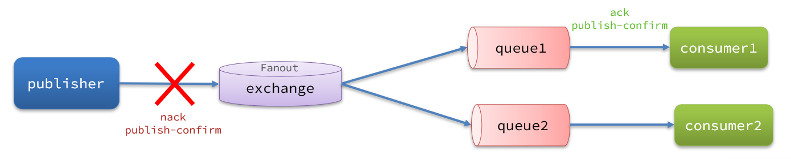
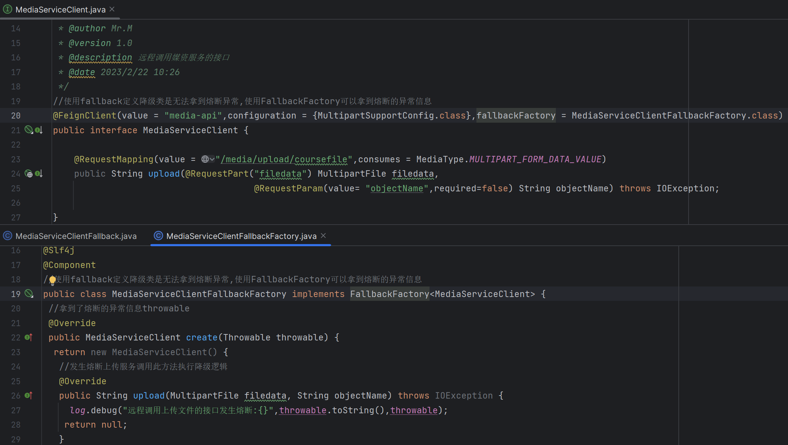

# 							自我介绍

面试官您好，我叫朱敏欣，本硕都就读于武汉理工大学，目前研二，本科期间学的电子信息工程专业，修过Java、数据结构这些课程，研究生期间是电子信息工程专业，然后主要研究的方向是自然语言处理。

在校期间，我也参与过老师接过的一些校企合作的计算机CV和NLP算法相关的系统开发项目，然后我主要就是做后台的开发以及算法的调用这部分，比如之前交付过一个绿化考核管理系统，我在项目中主要负责项目后台的搭建，划分具体的功能模块，主要有人员管理、考核打分、申诉整改等等方面，还设计了算法后台与Java后台的交互。

还有一个目前还没交付的交信北斗公司的一个基于北斗短报文的北斗海事遇险信息压缩传输系统的项目，这个项目中我主要是对海事遇险安全信息的数据搜集功能，数据处理功能，人员管理功能和数据统计功能，还有一些针对海事遇险安全信息NLP算法的优化。然后，我前段时间在网上看到贵司的实习招聘信息，加上我个人也是学Java一段时间了，也做过一些后台开发的工作，因此希望能够通过这次机会获得一个开发方向的实习。

# 林发项目


项目描述：旨在建立一个绿化考核系统，并通过算法识别方式代替人工识别提高对树木病虫害、绿植缺株等的识别效率，包括自动打分，绿化整改，信息查询、数据统计等功能。

项目难点：使用Spring Security实现管理员，打分人员和整改人员的认证与授权；

用RabbitMQ实现图片上传后与Django后台算法的异步调用；

使用Redis实现打分记录缓存；

使用Elasticsearch实现十万级图片的区名，街道名，考核类名搜索；

使用XXXX定时生成打分统计月报；

## Spring Security

继承**WebSecurityConfigurerAdapter类**：重写configure（）方法    添加http.cors()允许跨域

Spring Security在执行认证时，会根据用户提交的用户名，自动调用**userDetailService类**中的loadUserByUsername() 方法，当**得到返回的`UserDetails`后，会自动处理后续的细节**，**例如验证密码是否正确、将认证信息（登录成功后的用户信息）保存下来，便于后续识别用户身份等**  

因为Spring Security会自动应用密码编码器（在Security配置类中使用`@Bean`方法配置的**PasswordEncoder**），数据库中的密码值必须是**BCrypt编码**结果！

​		核心是过滤器链，配置好三个类，其中的**获取用户信息的方式**，**密码校验的加密方式**以及**接口权限的配置**。

​		原理就是将用户信息封装成**authentication**类，默认放到session中，每次访问通过cookie将sessionId带过来，如果存在对应session就说明已登录，然后过滤器会对每个请求访问的接口做权限的校验，从用户信息中取权限信息对比。有相应的权限就放行。是一种RBAC的权限控制方式。

​		权限控制是简单给用户一个标识然后根据标识判断是否有访问权限。缺点是给要给用户赋新权限很麻烦

优化：这是一种RBAC（role-based-access-controller）的权限控制方式，区别于ACL模型，围绕资源设置权限，直接判断某个权限面向那些用户开放。RBAC模型做到用户和权限解耦，用角色去关联用户和权限，用户对应角色，角色拥有权限，这么做不仅结构上清晰，而且操作灵活（指增删改权限）。

实现会话的方式： 

单体：cookie---session方式，将sessionId写入cookie 每次访问带过来，session但是要注意session过期时间，以及一定要开启cookie。

多服务器节点：1.可以通过特性的哈希策略分配给同一个服务器处理，缺点是一台服务器宕机则session信息全部丢失

2.每个服务器保存的session信息互相同步，但是成本太大

3.使用redis缓存存放session信息，同时redis服务器也要集群部署保证高可用

session是基于cookie的，但是没有cookie也可以将sessionId请求的url中，安全性降低，当然也可以加密后传输

## JWT


JWT 本质上就是一组字串，通过（`.`）切分成三个为 Base64 编码的部分：

- **Header** : 描述 JWT 的元数据，定义了生成签名的算法以及 `Token` 的类型。
- **Payload** : 用来存放实际需要传递的数据
- **Signature（签名）** ：服务器通过 Payload、Header 和**一个密钥(Secret)**使用 Header 里面指定的签名算法（默认是 HMAC SHA256）生成。

JWT 通常是这样的：`xxxxx.yyyyy.zzzzz`。

 **如何基于 JWT 进行身份验证？**

在基于 JWT 进行身份验证的的应用程序中，服务器通过 Payload、Header 和 Secret(密钥)创建 JWT 并将 JWT 发送给客户端。客户端接收到 JWT 之后，会将其保存在 Cookie 或者 localStorage 里面，以后客户端发出的所有请求都会携带这个令牌

两点建议：

1. 建议将 JWT 存放在 localStorage 中，放在 Cookie 中会有 CSRF 风险。
2. 请求服务端并携带 JWT 的常见做法是将其放在 HTTP Header 的 `Authorization` 字段中（`Authorization: Bearer Token`）。

**如何加强 JWT 的安全性？**

1. 使用安全系数高的加密算法。
2. 使用成熟的开源库，没必要造轮子。
3. JWT 存放在 localStorage 中而不是 Cookie 中，避免 CSRF**跨站请求伪造** 风险。
4. 一定不要将隐私信息存放在 Payload 当中。
5. 密钥一定保管好，一定不要泄露出去。JWT 安全的核心在于签名，签名安全的核心在密钥。
6. Payload 要加入 `exp` （JWT 的过期时间），永久有效的 JWT 不合理。并且，JWT 的过期时间不易过长。
7. .....

## RabbitMQ

- **异步处理提高系统性能（减少响应所需时间）**：==用RabbitMQ实现图片上传后与Django后台算法的异步调用==
- **流量削峰**：==因为python算法对每张图片的自动打分时间在3~5s左右，所以使用mq还可以对多个突发的打分任务进行缓冲。==
- **降低系统耦合性：**消息发送者（生产者）发布消息，一个或多个消息接受者（消费者）订阅消息。==图片上传（生产者）和考核打分（消费者）之间没有直接耦合==

==**没用xxl-job任务调度的原因**==是xxl-job不好做到实时更新任务处理，可能会造成任务堆积（和任务的扫描时间有关，时间越短，堆积的可能性就越小），而后台算法识别本来就慢，最怕的就是图片处理任务堆积，而MQ的消费者是一直等待的，来了一个图片任务就直接消费处理。

在每次图片上传到后端时，后端会把图片保存到本地，生成本地图片的路径，再把图片基本信息和图片路径插入到图片基本信息表里，生成唯一的图片ID，同时发送图片ID到打分交换机，打分交换机路由到打分队列，消费者监听打分队列拿到图片ID，根据图片ID优先查redis（查不到再查数据库）拿到该图片的本地路径，然后与django后台通信进行打分，打分结果保存到打分信息表。


### 可靠性不丢失

- 开启**生产者确认机制**，确保生产者的消息能到达打分队列
- 开启**mq持久化**功能，确保消息未打分前在打分队列中不会丢失
- 开启**打分确认机制为auto**，由spring确认消息处理成功后完成ack
- 开启**打分失败本地重试机制**，设置**MessageRecoverer**的实现为**RepublishMessageRecoverer(首次5s,2倍,5次)**，**5次**重试还失败后会将消息**投递到打分异常交换机**，交由**人工处理打分**

### 消息堆积问题

**消息发送速度超过了消费者消息处理速度**。解决方案以下三点：

- **提高消费者处理速度**
- **增加更多消费者**
- **增加队列消息存储上限**

==我们使用的是增加消费者方案，一个队列绑定多个消费者，共同争抢任务，能者多劳，通过设置**prefetch**来控制消费者**预取的消息数量**。但是**一张图片的打分模型需要占2个多G的显存，服务器的显存是12G的，为防止会爆显存，最终是开启5个打分消费者同时对打分队列进行消费。**==

### 重复消费

**消费者端入手**，只要能**保证消息处理的幂等性**就可以确保消息不被重复消费。

而**幂等性的保证**又有很多方案：

- 给每一条消息都添加一个**唯一id**，在本地记录消息表及消息状态，处理消息时==**基于数据库表的id唯一性**==做判断
- 同样是**记录消息表**，**利用消息状态字段实现基于乐观锁的判断，保证幂等**
- **基于业务本身的幂等性**。比如根据id的删除、查询业务天生幂等；新增、修改等业务可以考虑==**基于数据库id唯一性**==、或者乐观锁机制确保幂等。本质与消息表方案类似。

==项目中直接判断打分表里有没有图片的**唯一ID**就可以判断幂等性。==

### 生产者消息确认

这种机制必须给每个消息指定一个**唯一ID(UUID)**，区分不同消息，避免ack冲突，封装到**CorrelationData**中：

```java
// 消息ID，需要封装到CorrelationData中
CorrelationData correlationData = new CorrelationData(UUID.randomUUID().toString());
// 发送消息
rabbitTemplate.convertAndSend("ttl.direct", "ttl", message, correlationData);
```

消息发送到MQ以后，会返回一个结果给发送者，表示消息是否处理成功。返回结果有两种方式：

- **publisher-confirm，发送者确认**
  - 消息成功投递到交换机，返回ack
  - 消息未投递到交换机，返回nack
- **publisher-return，发送者回执**
  - 消息投递到交换机了，但是没有路由到队列。返回ACK，及路由失败原因。



修改publisher服务中的application.yml文件，添加下面的内容：

```yaml
spring:
  rabbitmq:
    publisher-confirm-type: correlated
    publisher-returns: true
    template:
      mandatory: true
```

- `publish-confirm-type`：开启publisher-confirm，这里支持两种类型：
  - `simple`：同步等待confirm结果，直到超时
  - `correlated`：异步回调，定义ConfirmCallback，MQ返回结果时会回调这个ConfirmCallback
- `publish-returns`：开启publish-return功能，同样是基于callback机制，不过是定义ReturnCallback
- `template.mandatory`：定义消息**路由失败时的策略。true，则调用ReturnCallback**；false：则直接丢弃消息

#### 定义ReturnCallback

每个RabbitTemplate只能配置一个ReturnCallback，因此需要在项目加载时配置：

修改publisher服务，添加一个：

```java
package cn.itcast.mq.config;
import lombok.extern.slf4j.Slf4j;
import org.springframework.amqp.rabbit.core.RabbitTemplate;
import org.springframework.beans.BeansException;
import org.springframework.context.ApplicationContext;
import org.springframework.context.ApplicationContextAware;
import org.springframework.context.annotation.Configuration;

@Slf4j
@Configuration
public class CommonConfig implements ApplicationContextAware {
    @Override
    public void setApplicationContext(ApplicationContext applicationContext) throws BeansException {
        // 获取RabbitTemplate
        RabbitTemplate rabbitTemplate = applicationContext.getBean(RabbitTemplate.class);
        // 设置ReturnCallback
        rabbitTemplate.setReturnCallback((message, replyCode, replyText, exchange, routingKey) -> {
            // 投递失败，记录日志
            log.info("消息发送失败，应答码{}，原因{}，交换机{}，路由键{},消息{}",
                     replyCode, replyText, exchange, routingKey, message.toString());
            // 如果有业务需要，可以重发消息
        });
    }
}
```

#### 定义ConfirmCallback

ConfirmCallback可以在发送消息时指定，因为每个业务处理confirm成功或失败的逻辑不一定相同。

在publisher服务的cn.itcast.mq.spring.SpringAmqpTest类中，定义一个单元测试方法：

```java
public void testSendMessage2SimpleQueue() throws InterruptedException {
    // 1.消息体
    String message = "hello, spring amqp!";
    // 2.全局唯一的消息ID，需要封装到CorrelationData中
    CorrelationData correlationData = new CorrelationData(UUID.randomUUID().toString());
    // 3.添加callback
    correlationData.getFuture().addCallback(
        result -> {
            if(result.isAck()){
                // 3.1.ack，消息成功
                log.debug("消息发送成功, ID:{}", correlationData.getId());
            }else{
                // 3.2.nack，消息失败
                log.error("消息发送失败, ID:{}, 原因{}",correlationData.getId(), result.getReason());
            }
        },
        ex -> log.error("消息发送异常, ID:{}, 原因{}",correlationData.getId(),ex.getMessage())
    );
    // 4.发送消息
    rabbitTemplate.convertAndSend("task.direct", "task", message, correlationData);
    // 休眠一会儿，等待ack回执
    Thread.sleep(2000);
}
```

### 消费者消息确认

SpringAMQP允许配置三种ACK确认模式：

- **manual**：**手动ack**，需要在**业务代码结束**后，**调用api发送ack**。
- **auto**：**自动ack**，由spring监测listener代码是否出现异常，**没有异常则返回ack，消息正常删除**；**抛出异常则返回nack，消息重新进队列**
- **none**：**关闭ack**，MQ假定消费者获取消息后会成功处理，因此消息投递后立即被删除

**==项目中使用的是auto==** 模式：修改application.yml文件：

```yaml
spring:
  rabbitmq:
    listener:
      simple:
        acknowledge-mode: auto # 关闭ack
```

#### 本地重试

**利用Spring的retry机制**，在消费者出现异常时进行**本地重试**，**而不是无限制的requeue**到mq队列。修改application.yml文件：

```yaml
spring:
  rabbitmq:
    listener:
      simple:
        retry:   # 失败重试等待 5s 10s 20s 40s 80s
          enabled: true # 开启消费者失败重试
          initial-interval: 5000 # 初次失败等待时长为5秒
          multiplier: 2 # 失败的等待时长倍数
          max-attempts: 5 # 最大重试次数
          stateless: true # true无状态；false有状态。如果业务中包含事务，这里改为false
```

**==处理失败最大5次，每次失败等待时间为5s 10s 20s 40s 80s，重试达到5次后，根据失败策略来处理消息==**

#### 失败策略

在开启重试模式后，重试次数耗尽，如果消息依然失败，则需要有**MessageRecovery**接口来处理，它包含三种不同的实现：

- RejectAndDontRequeueRecoverer：重试耗尽后，**默认直接丢弃**消息。

- ImmediateRequeueMessageRecoverer：重试耗尽后，返回**nack**，**消息重新入队**

- **RepublishMessageRecoverer**：重试耗尽后，将失败消息**投递到指定的交换机**

==项目中使用的是优雅的处理方案是**RepublishMessageRecoverer**，失败后将消息投递到一个**处理失败的死信交换机**中，**交换机再路由到指定的专门存放图片处理失败异常消息的队列，后续由管理员和打分人员进行人工处理打分。**==

### 高可用

要实现RabbitMQ的高可用无外乎下面两点：

- 做好**交换机、队列、消息**的**持久化**
- 搭建RabbitMQ的**镜像集群**，做好**主从备份**。当然也可以使用**仲裁队列代替镜像集群**。

### 持久化

**交换机持久化**：RabbitMQ中交换机**默认是非持久化**的，mq**重启后就丢失**。**但由SpringAMQP声明的交换机默认都是持久化的。**

SpringAMQP中可以通过代码new DirectExchange("simple.direct", **true**, false)指定交换机持久化：

```java
@Bean
public DirectExchange simpleExchange(){
    // 三个参数：交换机名称、是否持久化、当没有queue与其绑定时是否自动删除
    return new DirectExchange("simple.direct", true, false);
}
```

**队列持久化**：RabbitMQ中队列默认是非持久化的，mq重启后就丢失。

**但由SpringAMQP声明的队列默认都是持久化的。**

SpringAMQP中可以通过代码**.durable()**指定交队列持久化：

```java
@Bean
public Queue simpleQueue(){
    // 使用QueueBuilder构建队列，durable就是持久化的
    return QueueBuilder.durable("simple.queue").build();
}
```

**消息持久化**：SpringAMQP发出的**任何消息默认都是持久化**的，不用特意指定。可以设置消息的属性（MessageProperties），指定**delivery-mode**：

- 1：非持久化
- 2：持久化


### 镜像集群

RabbitMQ的集群有两种模式：

**普通集群**：是一种**分布式集群**，将**队列分散到集群的各个节点**，从而提高整个集群的**并发能力**。

- 会在集群的**各个节点间共享部分数据**，包括：**交换机、队列元信息**。**不包含队列中的消息**。
- 当访问集群某节点时，如**果队列不在该节点，会从数据所在节点传递到当前节点并返回**
- 队列所在**节点宕机**，队列中的**消息就会丢失**

==**项目中使用的是镜像集群**：是一种**主从集群**，普通集群的基础上，**添加了主从备份功能**，提高集群的数据**可用性**。==

- **交换机、队列、队列中的消息**会在各个mq的镜像节点之间**同步备份**。
- 创建队列的节点被称为该队列的**主节点，**备份到的其它节点叫做该队列的**镜像**节点。
- 一个队列的主节点可能是另一个队列的镜像节点
- **所有操作都是主节点完成**，然后**同步给镜像节点**
- **主宕机**后，**镜像节点会替代成新的主节点**


**仲裁队列**：**镜像集群主从同步并不是强一致的**，某些情况下**可能有数据丢失**的风险。因此在RabbitMQ的3.8版本以后，推出了新的功能：**仲裁队列**来**代替镜像集群**，底层采用**Raft协议**确保主从的**数据一致性**。

```java
@Bean
public Queue quorumQueue() {
    return QueueBuilder
        .durable("quorum.queue") // 持久化
        .quorum() // 仲裁队列
        .build();
}
```

## Elasticsearch

使用Elasticsearch实现十万级图片的区名，街道名，考核类名搜索；

### 基础查询

区名districtName：

街道名streetName：

考核类名assessmentName：

审核状态status：

关键词key：


### 距离排序

与当前位置距离从近到远排序，以km为单位，**排序字段sort值就是实际距离**，可以**回显到前端显示**，String location = ”经度，纬度“。

```java
@Override
public PageResult search(RequestParams params) {
    try {
        // 1.准备Request
        SearchRequest request = new SearchRequest("hotel");
        // 2.准备DSL
        // 2.1.query
        buildBasicQuery(params, request);

        // 2.2.分页
        int page = params.getPage();
        int size = params.getSize();
        request.source().from((page - 1) * size).size(size);

        // 2.3.排序
        String location = params.getLocation();
        if (location != null && !location.equals("")) {
            request.source().sort(SortBuilders
                                  .geoDistanceSort("location", new GeoPoint(location))
                                  .order(SortOrder.ASC)
                                  .unit(DistanceUnit.KILOMETERS)
                                 );
        }
        // 3.发送请求
        SearchResponse response = client.search(request, RequestOptions.DEFAULT);
        // 4.解析响应
        return handleResponse(response);
    } catch (IOException e) {
        throw new RuntimeException(e);
    }
}
```

### 分页查询

**page=100，pageSize=10，from=(100-1)*10=990,size=10，就要查询990~1000的数据**，但elasticsearch内部分页时，必须**先查询 0~1000**条，然后**截取其中的990 ~ 1000**的这10条

**深度分页问题**：当查询分页深度较大时，汇总数据过多，对**内存和CPU**会产生非常大的压力，因此elasticsearch会**禁止from+ size 超过10000**的请求。

分页查询的常见实现方案以及优缺点：

- `from + size`：
  - 优点：**支持随机翻页**
  - 缺点：深度分页问题，默认查询上限（from + size）是**10000**
  - 场景：百度、京东、谷歌、淘宝这样的随机翻页搜索
- `after search`：分页时需要排序，原理是从上一次的排序值开始，查询下一页数据。官方推荐。
  - 优点：没有查询上限（单次查询的size不超过10000）
  - 缺点：只能**向后逐页**查询，不支持随机翻页
  - 场景：**没有随机翻页需求的搜索**，例如**手机向下滚动翻页**

- `scroll`：将排序后的**文档id形成快照**，**保存在内存**。官方已经**不推荐**使用。
  - 优点：没有查询上限（单次查询的size不超过10000）
  - 缺点：会有额外内存消耗，并且**搜索结果是非实时的**
  - 场景：**海量数据的获取和迁移**。从ES7.1开始**不推荐**，建议用 after search方案。

### mq异步数据同步

常见的数据同步方案有三种：

- **同步调用**：实现简单，粗暴，缺点：业务耦合度高
- **异步通知**：低耦合，实现难度一般，缺点：依赖mq的可靠性
- **监听binlog**（用**canal**）：完全解除服务间耦合，缺点：开启binlog增加数据库负担、实现复杂度高

**由于前面使用的是rabbitmq做图片的算法异步调用，所以这里同样采取rabbitmq来实现数据同步**：


- 生产者和消费者两端都要声明exchange、queue、RoutingKey
- 在hotel-admin中的增、删、改业务中完成消息发送
- 在hotel-demo中完成消息监听，并更新elasticsearch中数据

**声明绑定交换机队列**


**1）引入依赖**

引入rabbitmq的amqp依赖：

```xml
<!--amqp-->
<dependency>
    <groupId>org.springframework.boot</groupId>
    <artifactId>spring-boot-starter-amqp</artifactId>
</dependency>
```

先起名

```java
package cn.itcast.hotel.constatnts;

    public class MqConstants {
    /**
     * 交换机
     */
    public final static String HOTEL_EXCHANGE = "hotel.topic";
    /**
     * 监听新增和修改的队列
     */
    public final static String HOTEL_INSERT_QUEUE = "hotel.insert.queue";
    /**
     * 监听删除的队列
     */
    public final static String HOTEL_DELETE_QUEUE = "hotel.delete.queue";
    /**
     * 新增或修改的RoutingKey
     */
    public final static String HOTEL_INSERT_KEY = "hotel.insert";
    /**
     * 删除的RoutingKey
     */
    public final static String HOTEL_DELETE_KEY = "hotel.delete";
}
```

**定义配置类，声明绑定**队列、交换机：

```java
package cn.itcast.hotel.config;

import cn.itcast.hotel.constants.MqConstants;
import org.springframework.amqp.core.Binding;
import org.springframework.amqp.core.BindingBuilder;
import org.springframework.amqp.core.Queue;
import org.springframework.amqp.core.TopicExchange;
import org.springframework.context.annotation.Bean;
import org.springframework.context.annotation.Configuration;

@Configuration
public class MqConfig {
    @Bean
    public TopicExchange topicExchange(){
        return new TopicExchange(MqConstants.HOTEL_EXCHANGE, true, false);
    }

    @Bean
    public Queue insertQueue(){
        return new Queue(MqConstants.HOTEL_INSERT_QUEUE, true);
    }

    @Bean
    public Queue deleteQueue(){
        return new Queue(MqConstants.HOTEL_DELETE_QUEUE, true);
    }

    @Bean
    public Binding insertQueueBinding(){
        return BindingBuilder.bind(insertQueue()).to(topicExchange()).with(MqConstants.HOTEL_INSERT_KEY);
    }

    @Bean
    public Binding deleteQueueBinding(){
        return BindingBuilder.bind(deleteQueue()).to(topicExchange()).with(MqConstants.HOTEL_DELETE_KEY);
    }
}
```

**发送MQ消息**

在考核图片的增、删、改业务中分别发送MQ消息：


**接收MQ消息**

图片搜索业务接收到MQ消息要做的事情包括：

- 新增消息：根据传递的pic的id查询pic信息，然后新增一条数据到索引库
- 删除消息：根据传递的pic的id删除索引库中的一条数据

1）在图片搜索业务中的Service中实现业务：

```java
@Override
public void deleteById(Long id) {
    try {
        // 1.准备Request
        DeleteRequest request = new DeleteRequest("hotel", id.toString());
        // 2.发送请求
        client.delete(request, RequestOptions.DEFAULT);
    } catch (IOException e) {
        throw new RuntimeException(e);
    }
}

@Override
public void insertById(Long id) {
    try {
        // 0.根据id查询酒店数据
        Hotel hotel = getById(id);
        // 转换为文档类型
        HotelDoc hotelDoc = new HotelDoc(hotel);

        // 1.准备Request对象
        IndexRequest request = new IndexRequest("hotel").id(hotel.getId().toString());
        // 2.准备Json文档
        request.source(JSON.toJSONString(hotelDoc), XContentType.JSON);
        // 3.发送请求
        client.index(request, RequestOptions.DEFAULT);
    } catch (IOException e) {
        throw new RuntimeException(e);
    }
}
```

2）编写Listener监听器

```java
package cn.itcast.hotel.mq;

import cn.itcast.hotel.constants.MqConstants;
import cn.itcast.hotel.service.IHotelService;
import org.springframework.amqp.rabbit.annotation.RabbitListener;
import org.springframework.beans.factory.annotation.Autowired;
import org.springframework.stereotype.Component;

@Component
public class HotelListener {

    @Autowired
    private IHotelService hotelService;

    /**
     * 监听酒店新增或修改的业务
     * @param id 酒店id
     */
    @RabbitListener(queues = MqConstants.HOTEL_INSERT_QUEUE)
    public void listenHotelInsertOrUpdate(Long id){
        hotelService.insertById(id);
    }

    /**
     * 监听酒店删除的业务
     * @param id 酒店id
     */
    @RabbitListener(queues = MqConstants.HOTEL_DELETE_QUEUE)
    public void listenHotelDelete(Long id){
        hotelService.deleteById(id);
    }
}
```

### ES集群

单机的elasticsearch做数据存储，必然面临两个问题：

- **海量数据存储**问题：将索引库从**逻辑上**拆分为N个**分片**（shard），**存储到多个节点**
- **单点故障**问题：将分片数据**在不同节点备份**（replica ）

数据备份可以保证高可用，但是每个分片备份一份，所需要的节点数量就会翻一倍，成本实在是太高了！**为了在高可用和成本间寻求平衡**：

- ==**首先对数据分片**，存储到不同节点==
- ==然后对每个分片进行**备份，放到不同的节点**，完成互相备份==


### 脑裂问题

**脑裂**是因为集群中的**节点失联导致的**。

**解决脑裂的方案**是，要求选票**超过 ( eligible节点数量 + 1 ）/ 2** 才能当选为主，因此**eligible节点数量最好是奇数**。对应配置项是discovery.zen.minimum_master_nodes，在es7.0以后，已经成为默认配置，因此一般不会发生脑裂问题

==**项目中使用的是3个节点形成的集群（分别在3台不同的服务器）**，选票必须超过 **（3 + 1） / 2 ，也就是2票**。==node3得到node2和node3的选票，当选为主。node1只有自己1票，没有当选。集群中依然只有1个主节点，没有出现脑裂。

### 分片存储原理

elasticsearch会通过==**hash算法**==来计算文档应该存储到哪个分片：


- ==**项目中使用的_routing默认是文档的id**==
- **算法与分片数量有关**，因此**索引库一旦创建**，**分片数量不能修改**！

新增文档的流程如下：


- 1）新增一个id=1的文档
- 2）对id做hash运算，假如得到的是2，则应该存储到shard-2
- 3）shard-2的主分片在node3节点，将数据路由到node3
- 4）保存文档
- 5）同步给shard-2的副本replica-2，在node2节点
- 6）返回结果给coordinating-node节点

### 集群故障转移

集群的**master**节点会监控集群中的节点状态，**如果发现有节点宕机，会立即将宕机节点的分片数据迁移到其它节点**，确保数据安全，这个叫做故障转移。

宕机后的第一件事，需要重新选主，例如选中了node2：


node2成为主节点后，会检测集群监控状态，发现：shard-1、shard-0没有副本节点。因此需要将node1上的数据迁移到node2、node3：


## xxl-job


spring传统的定时任务@Scheduled，但是这样存在这一些问题 ：

- 做集群任务的重复执行问题

- cron表达式定义在代码之中，修改不方便

- 定时任务失败了，无法重试也没有统计

- 如果任务量过大，不能有效的分片执行

将任务调度程序分布式构建，这样就可以具有分布式系统的特点，并且提高任务的调度处理能力：

1、并行任务调度

并行任务调度实现靠多线程，如果有大量任务需要调度，此时光靠多线程就会有瓶颈了，因为一台计算机CPU的处理能力是有限的。

如果将任务调度程序分布式部署，每个结点还可以部署为集群，这样就可以让多台计算机共同去完成任务调度，我们可以将任务分割为若干个分片，由不同的实例并行执行，来提高任务调度的处理效率。

2、高可用

若某一个实例宕机，不影响其他实例来执行任务。

3、弹性扩容

当集群中增加实例就可以提高并执行任务的处理效率。

4、任务管理与监测

对系统中存在的所有定时任务进行统一的管理及监测。让开发人员及运维人员能够时刻了解任务执行情况，从而做出快速的应急处理响应。

**分布式任务调度面临的问题：**

当任务调度以集群方式部署，同一个任务调度可能会执行多次，例如：电商系统定期发放优惠券，就可能重复发放优惠券，对公司造成损失，信用卡还款提醒就会重复执行多次，给用户造成烦恼，所以我们需要控制相同的任务在多个运行实例上只执行一次。常见解决方案：

- 分布式锁，多个实例在任务执行前首先需要获取锁，如果获取失败那么就证明有其他服务已经在运行，如果获取成功那么证明没有服务在运行定时任务，那么就可以执行。
- ZooKeeper选举，利用ZooKeeper对Leader实例执行定时任务，执行定时任务的时候判断自己是否是Leader，如果不是则不执行，如果是则执行业务逻辑，这样也能达到目的。


## 全局自定义异常

```java
@ControllerAdvice  //控制器增强类
public class ExceptionCatch {
    /**
     * 处理不可控异常
     * @param e
     * @return
     */
    @ExceptionHandler(Exception.class)
    @ResponseBody
    public ResponseResult exception(Exception e){}
    /**
     * 处理可控异常  自定义异常
     * @param e
     * @return
     */
    @ExceptionHandler(CustomException.class)
    @ResponseBody
    public ResponseResult exception(CustomException e){}
```

# 微课堂项目

## 课程发布


**@Scheduled线程阻塞问题**：上面用Redis实现延迟发布的时候有两次定时任务的刷新，**从DB刷新到Redis**，和**从Redis里面的zSet刷新到list**。这两个是在用同一个线程去定时刷新执行的，就是说如果。其中有一个刷新任务因为**网络什么问题迟迟没有执行完。就会当前线程就会被阻塞，然后另外一个定时刷新的任务也会被阻塞**。这样可能就会造成需要立即刷新到list里面去要发布的课程没有及时的发布。

解决方法就是**给Scheduled去set一个线程池**。


**xxl-job定时10秒钟去扫描message任务表，默认取出30个任务一起执行，去多少条就创建一个多少线程的线程池，CountDownLatch，给一个充裕的超时时间,防止无限等待，到达超时时间还没有处理完成则结束任务**

```java
// xxl-job定时10秒钟 扫描消息表获取任务清单
List<MqMessage> messageList = mqMessageService.getMessageList(shardIndex, shardTotal,messageType, count);
//任务个数
int size = messageList.size();
log.debug("取出待处理消息"+size+"条");
if(size<=0){
    return ;
}

//创建线程池
ExecutorService threadPool = Executors.newFixedThreadPool(size);
//计数器
CountDownLatch countDownLatch = new CountDownLatch(size);
messageList.forEach(message -> {
    threadPool.execute(() -> {
        log.debug("开始任务:{}",message);
        //处理任务
        try {
            boolean result = execute(message);
            if(result){
                log.debug("任务执行成功:{})",message);
                //更新任务状态,删除消息表记录,添加到历史表
                int completed = mqMessageService.completed(message.getId());
                if (completed>0){
                    log.debug("任务执行成功:{}",message);
                }else{
                    log.debug("任务执行失败:{}",message);
                }
            }
        } catch (Exception e) {
            e.printStackTrace();
            log.debug("任务出现异常:{},任务:{}",e.getMessage(),message);
        }finally {
            //计数
            countDownLatch.countDown();
        }
        log.debug("结束任务:{}",message);
    });
});
//等待,给一个充裕的超时时间,防止无限等待，到达超时时间还没有处理完成则结束任务
countDownLatch.await(timeout,TimeUnit.SECONDS);
System.out.println("结束....");
```
### fixedRate和fixedDelay

**fixedDelay**非常好理解，**它的间隔时间是根据上次的任务结束的时候开始计时的**。比如一个方法上设置了fixedDelay=5*1000，那么当该方法某一次执行结束后，开始计算时间，当时间达到5秒，就开始再次执行该方法。

**fixedRate**比较麻烦，它的间隔时间是**根据上次任务开始的时候计时的**。比如当方法上设置了fiexdRate=5*1000，该执行该方法所花的时间是2秒，那么3秒后就会再次执行该方法。**当任务执行时长超过设置的间隔时长（网络问题）**，会**产生任务阻塞**。
被阻塞的任务就像排队的人一样，一旦前一个任务没了，它就立马执行。

**@Scheduled(fixedRate)如何避免任务被阻塞**
答案是加上注解**@EnableAsync（spring启动类上）**和**@Async（方法上）**，就**开启了多线程模式**，当到了下一次任务的执行时机时，**如果上一次任务还没执行完，就会自动创建一个新的线程来执行它**。异步执行也可以理解为**保证了任务以固定速度执行**。

**这种情况下的线程是随着任务一执行完就销毁的，等下次有需要了程序再创建一个**。每次都要重新创建明显是**太影响性能**了，所以需要在代码里给他一个**线程池**。需注意的是，如果线程池里的所有线程都被拿去执行调度任务了，且又到了时间要执行一次任务，那么这个任务又会被阻塞。所以实际开发中如果想要保证任务以速度被执行，**线程池的最大线程数量可要想好**。

## 延迟任务

### DelayQueue

JDK自带DelayQueue 是一个支持延时获取元素的阻塞队列， 内部采用**优先队列 PriorityQueue** 存储元素；在创建元素时**可以指定多久才可以从队列中获取当前元素**，只有在延迟期满时才能从队列中提取元素


DelayQueue属于排序队列，它的特殊之处在于队列的元素必须实现**Delayed**接口，该接口需要实现**compareTo**和**getDelay方法**

**getDelay**方法：获取元素在队列中的剩余时间，只有当剩余时间为0时元素才可以出队列。

**compareTo**方法：用于排序，确定元素出队列的顺序。

DelayQueue实现完成之后思考一个问题：

使用线程池或者原生DelayQueue程序**挂掉**之后，**任务都是放在内存**，需要考虑**未处理消息的丢失**带来的影响，如何保证数据不丢失，**需要持久化（磁盘）**

### RabbitMQ实现延迟

- **TTL**：Time To Live (消息存活时间)

- **死信队列**：Dead Letter Exchange(死信交换机)，当消息成为Dead message后，可以重新发送另一个交换机（死信交换机）


### redis实现延迟

zset数据类型的去重有序（分数排序）特点进行延迟。例如：时间戳作为score进行排序


问题思路

**1.为什么任务需要存储在数据库中？**

延迟任务是一个通用的服务，任何需要延迟得任务都可以调用该服务，需要考虑数据持久化的问题，**存储数据库中是一种数据安全的考虑。**

**2.为什么redis中使用两种数据类型，list和zset？**

效率问题，算法的时间复杂度：**list是O(1)**，**zset是O(M*log(n))**

**3.在添加zset数据的时候，为什么不需要预加载？**

任务模块是一个通用的模块，项目中任何需要延迟队列的地方，都可以调用这个接口，要**考虑到数据量的问题，如果数据量特别大，为了防止阻塞，只需要把未来几分钟要执行的数据存入缓存即可**。

## 用户行为


**热点课程查询**接口RT从**300ms**（查数据库）优化到**20ms以内**（查Redis）

## Feed流关注推送

Feed流实现有两种常见模式：
**Timeline**：不做内容筛选，简单的按照内容发布时间排序，常用于好友或关注。例如朋友圈

* 优点：信息全面，不会有缺失。并且实现也相对简单
* 缺点：信息噪音较多，用户不一定感兴趣，内容获取效率低

**智能算法排序**：利用智能算法屏蔽掉违规的、用户不感兴趣的内容。推送用户感兴趣信息来吸引用户

* 优点：投喂用户感兴趣信息，用户粘度很高，容易沉迷
* 缺点：如果算法不精准，可能起到反作用
  本例中的个人页面，是基于关注的好友来做Feed流，因此采用Timeline的模式。该模式的实现方案有三种：

我们本次针对好友的操作，采用的就是Timeline的方式，只需要拿到我们关注用户的信息，然后按照时间排序即可

，因此采用Timeline的模式。该模式的实现方案有三种：

* **拉模式**
* **推模式**
* **推拉结合**

**拉模式**：也叫做读扩散

该模式的核心含义就是：当张三和李四和王五发了消息后，都会保存在自己的邮箱中，假设赵六要读取信息，那么他会从读取他自己的收件箱，此时系统会从他关注的人群中，把他关注人的信息全部都进行拉取，然后在进行排序

优点：比较节约空间，因为赵六在读信息时，并没有重复读取，而且读取完之后可以把他的收件箱进行清楚。

缺点：比较延迟，当用户读取数据时才去关注的人里边去读取数据，假设用户关注了大量的用户，那么此时就会拉取海量的内容，对服务器压力巨大。


**推模式**：也叫做写扩散。

推模式是没有写邮箱的，当张三写了一个内容，此时会主动的把张三写的内容发送到他的粉丝收件箱中去，假设此时李四再来读取，就不用再去临时拉取了

优点：时效快，不用临时拉取

缺点：内存压力大，假设一个大V写信息，很多人关注他， 就会写很多分数据到粉丝那边去


**推拉结合模式**：也叫做读写混合，兼具推和拉两种模式的优点。

推拉模式是一个折中的方案，站在发件人这一段，如果是个普通的人，那么我们采用写扩散的方式，直接把数据写入到他的粉丝中去，因为普通的人他的粉丝关注量比较小，所以这样做没有压力，如果是大V，那么他是直接将数据先写入到一份到发件箱里边去，然后再直接写一份到活跃粉丝收件箱里边去，现在站在收件人这端来看，如果是活跃粉丝，那么大V和普通的人发的都会直接写入到自己收件箱里边来，而如果是普通的粉丝，由于他们上线不是很频繁，所以等他们上线时，再从发件箱里边去拉信息。


# 其它

## @Async

@Async 配置有两个，一个是**执行的线程池**，一个是**异常处理**

**执行的线程池**默认情况下找唯一的 org.springframework.core.task.TaskExecutor，或者一个 Bean 的 Name 为 taskExecutor 的 java.util.concurrent.Executor 作为执行任务的线程池。如果都没有的话，会创建 SimpleAsyncTaskExecutor 线程池来处理异步方法调用，当然 @Async 注解支持一个 String 参数，来指定一个 Bean 的 Name，类型是 Executor 或 TaskExecutor，表示使用这个指定的线程池来执行这个异步任务。**实现接口RejectedExecutionHandler，配置自己的线程拒绝策略。**

**异常处理**，@Async 标记的方法**只能是 void 或者 Future** 返回值，在无返回值的异步调用中，异步处理抛出异常，默认是SimpleAsyncUncaughtExceptionHandler 的 handleUncaughtException() 会捕获指定异常，只是简单的输出了错误日志(一般需要自定义配置异常处理)，原有任务还会继续运行，直到结束(具有 void 返回类型的方法不能将任何异常发送回调用者，默认情况下此类未捕获异常只会输出错误日志)，而在有返回值的异步调用中，异步处理抛出了异常，会直接返回主线程处理，异步任务结束执行，主线程也会被异步方法中的异常中断结束执行

**Spring boot异步任务@Async失效问题**

1、注解的方法必须是**public**方法，不能是static；

2、**启动类是否开启异步**服务；

3、**在定义异步方法的同一个类中**，调用带有@Async注解方法，该方法则无法异步执行；

4、**没有走Spring的代理类，一定要经过Spring容器管理**。因为@Async和@Transactional注解的实现都是基于Spring的AOP，而AOP的实现是基于动态代理模式实现的。那么注解失效的原因就很明显了，有可能因为调用方法的是对象本身而不是代理对象，因为没有经过Spring容器管理。


## ThreadLocal存userId

网关负责解析请求头里的有token完成认证，再将解析的userId存入请求头，并路由到微服务，微服务里定义一个拦截器实现**HandlerInterceptor**这个接口时，重写他的**preHandle**()方法和**postHandle**()方法，其中preHandle把请求头里的userId取出放到ThreadLocal里，postHandle方法里销毁ThreadLocal里的userId。

**但如果中间出现异常，postHandle方法是执行不到的**，ThreadLocal里的userId也就没能及时销毁，可能会发生**内存泄漏**，HandlerInterceptor里还有个**afterCompletion**方法，**就算有异常最后也会执行**，用它来清除userId就行。

另外要注意的是：==**用@Async修饰的异步方法里是拿不到之前ThreadLocal里存的userId的，因为他是异步另开一个线程去执行**==

## feign的熔断降级

==feign的远程调用的时候编写熔断降级的逻辑时，使用**fallback**定义降级类是无法拿到熔断异常，使用**FallbackFactory**可以拿到熔断的异常信息，继承FallbackFactory，重写FallbackFactory里的**create**()方法，方法里写调用函数失败的降级逻辑，**打印拿到的熔断异常信息throwable**，进行排错。==



## 项目中MySQL优化

批量一次性发送到数据库进行批量保存

```java
//批量保存
wmNewsMaterialMapper.saveRelations(idList,newsId,type);
```

```xml
<mapper namespace="com.heima.wemedia.mapper.WmNewsMaterialMapper">
    <insert id="saveRelations">
        insert into wm_news_material (material_id,news_id,type,ord)
        values
        <foreach collection="materialIds" index="ord" item="mid" separator=",">
            (#{mid},#{newsId},#{type},#{ord})
        </foreach>
    </insert>
</mapper>
```


## reids key值匹配查询

方案1：**keys 模糊匹配**

keys的模糊匹配功能很方便也很强大，但是在生产环境需要慎用！开发中使用keys的模糊匹配却发现redis的**CPU使用率极高**，所以公司的redis生产环境将keys命令**禁用**了！**redis是单线程，会被堵塞**

方案2：**scan** 

SCAN 命令是一个基于游标的迭代器，SCAN命令每次被调用之后， 都会向用户返回一个新的游标， 用户在下次迭代时需要使用这个新游标作为SCAN命令的游标参数， 以此来延续之前的迭代过程。


```java
@Test
public void testKeys(){
    Set<String> keys = cacheService.keys("future_*");
    System.out.println(keys);

    Set<String> scan = cacheService.scan("future_*");
    System.out.println(scan);
}
```

## reids管道

普通redis客户端和服务器交互模式


Pipeline请求模型


## 分布式锁

分布式锁：控制分布式系统有序的去对共享资源进行操作，通过互斥来保证数据的一致性。解决方案：


1、**基于数据库实现分布锁**

利用数据库主键唯一性的特点，或利用数据库唯一索引的特点，多个线程同时去插入相同的记录，谁插入成功谁就抢到锁。

2、**基于redis实现锁**

redis提供了分布式锁的实现方案，比如：**SETNX**、**redisson**等。

拿SETNX举例说明，SETNX命令的工作过程是去set一个不存在的key，多个线程去设置同一个key只会有一个线程设置成功，设置成功的的线程拿到锁。

3、**使用zookeeper实现**

zookeeper是一个分布式协调服务，主要解决分布式程序之间的同步的问题。zookeeper的结构类似的文件目录，多线程向zookeeper创建一个子目录(节点)只会有一个创建成功，利用此特点可以实现分布式锁，谁创建该结点成功谁就获得锁。

### redis分布式锁

**SETNX ** （SET if Not eXists） 思路是，如果 key 不存在则为 key 设置 value，如果 key 已存在则 SETNX 命令不做任何操作

释放锁分为两种情况：key到期自动释放，手动删除。**setNX缺点就是锁的过期时间不好把握**

1）**key到期自动释放**的方法

因为锁设置了过期时间，key到期会自动释放，但是会存在一个问题就是 **查询数据库等操作还没有执行完时key到期了，此时其它线程就抢到锁了，最终重复查询数据库执行了重复的业务操作**。

怎么解决：可以**将key的到期时间设置的长一些**，足以执行完成查询数据库并设置缓存等相关操作。这样效率会低一些，这个**时间值也不好把控。**

2）**手动删除锁**

如果是采用手动删除锁可能和key到期自动删除有所冲突，造成删除了别人的锁。

比如：当查询数据库等业务还没有执行完时key过期了，此时其它线程占用了锁，当上一个线程执行查询数据库等业务操作完成后手动删除锁就把其它线程的锁给删除了。

解决办法就是：**删除锁之前判断是不是自己设置的锁**，伪代码如下：

```java
if(缓存中有){
  返回缓存中的数据
 }else{
  获取分布式锁: set lock thread1 NX
  if(获取锁成功）{
    try{
     查询数据库
    }finally{    // 下面这2行操作也要是原子性的（lua实现），不然也会删别人的锁
     if(redis.call("get","lock")=="thread1"){
       释放锁: redis.call("del","lock")
     }
```
基于**setnx**实现的分布式锁存在下面的问题：

**重入问题**：重入问题是指 获得锁的线程可以再次进入到相同的锁的代码块中，可重入锁的意义在于防止死锁，比如HashTable这样的代码中，他的方法都是使用synchronized修饰的，假如他在一个方法内，调用另一个方法，那么此时如果是不可重入的，不就死锁了吗？所以可重入锁他的主要意义是防止死锁，我们的synchronized和Lock锁都是可重入的。

**不可重试**：是指目前的分布式只能尝试一次，我们认为合理的情况是：当线程在获得锁失败后，他应该能再次尝试获得锁。

**超时释放：**我们在加锁时增加了过期时间，这样的我们可以防止死锁，但是如果卡顿的时间超长，虽然我们采用了lua表达式防止删锁的时候，误删别人的锁，但是毕竟没有锁住，有安全隐患

**主从一致性：** 如果Redis提供了主从集群，当我们向集群写数据时，主机需要异步的将数据同步给从机，而万一在同步过去之前，主机宕机了，就会出现死锁问题。

**Redisson**相比SETNX 实现分布式锁要简单的多，工作原理如下：


•     **加锁机制**

线程去获取锁，获取成功: 执行lua脚本，保存数据到redis数据库。

获取失败: **一直通过while循环尝试获取锁（自旋）**，获取成功后，执行lua脚本，保存数据到redis

•     **WatchDog自动延期看门狗机制**

第一种情况：在一个分布式环境下，假如一个线程获得锁后，突然服务器宕机了，那么这个时候在一定时间后这个锁会自动释放，你也可以设置锁的有效时间(**当不设置默认30秒**），这样的目的主要是**防止死锁**的发生

第二种情况：线程A业务**还没有执行完，时间就过了**，线程A 还想持有锁的话，就会**启动一个watch dog后台线程，不断的延长锁key的生存时间**。

•     **lua脚本保证原子性操作**

主要是如果你的业务逻辑复杂的话，通过封装在lua脚本中发送给redis，而且redis是单线程的，这样就保证这段复杂业务逻辑执行的原子性

具体使用RLock操作分布锁，RLock继承JDK的Lock接口，所以他有Lock接口的所有特性，比如lock、unlock、trylock等特性,同时它还有很多新特性：强制锁释放，带有效期的锁,。

```java
//Redisson分布式锁避免 查询课程信息 出现 缓存击穿
 public CoursePublish getCoursePublishCache(Long courseId){
     //查询缓存
     String jsonString = (String) redisTemplate.opsForValue().get("course:" + courseId);
     if(StringUtils.isNotEmpty(jsonString)){
       if(jsonString.equals("null")){
         return null;
       }
       CoursePublish coursePublish = JSON.parseObject(jsonString, CoursePublish.class);
       return coursePublish;
     }else{
       //每门课程设置一个锁
       RLock lock = redissonClient.getLock("coursequerylock:"+courseId);
       //获取锁
       lock.lock();
       try {
         jsonString = (String) redisTemplate.opsForValue().get("course:" + courseId);
         if(StringUtils.isNotEmpty(jsonString)){
           CoursePublish coursePublish = JSON.parseObject(jsonString, CoursePublish.class);
           return coursePublish;
         }
         System.*out*.println("=========从数据库查询==========");
         //从数据库查询
         CoursePublish coursePublish = getCoursePublish(courseId);
         redisTemplate.opsForValue().set("course:"+courseId, JSON.toJSONString(coursePublish),1,TimeUnit.DAYS);
         return coursePublish;
       }finally {
         //释放锁
         lock.unlock();
       }
     }
```

## Canal数据同步

通过实现**EntryHandler< T>**接口编写监听器，监听Canal消息。注意两点：

- 实现类通过**@CanalTable("tb_item")**指定监听的表信息
- EntryHandler的**泛型是与表对应的实体类**

```java
package com.heima.item.canal;

import com.github.benmanes.caffeine.cache.Cache;
import com.heima.item.config.RedisHandler;
import com.heima.item.pojo.Item;
import org.springframework.beans.factory.annotation.Autowired;
import org.springframework.stereotype.Component;
import top.javatool.canal.client.annotation.CanalTable;
import top.javatool.canal.client.handler.EntryHandler;

@CanalTable("tb_item")
@Component
public class ItemHandler implements EntryHandler<Item> {

    @Autowired
    private RedisHandler redisHandler;
    @Autowired
    private Cache<Long, Item> itemCache;

    @Override
    public void insert(Item item) {
        // 写数据到JVM进程缓存
        itemCache.put(item.getId(), item);
        // 写数据到redis
        redisHandler.saveItem(item);
    }

    @Override
    public void update(Item before, Item after) {
        // 写数据到JVM进程缓存
        itemCache.put(after.getId(), after);
        // 写数据到redis
        redisHandler.saveItem(after);
    }

    @Override
    public void delete(Item item) {
        // 删除数据到JVM进程缓存
        itemCache.invalidate(item.getId());
        // 删除数据到redis
        redisHandler.deleteItemById(item.getId());
    }
}
```


# =============================================

| 必修课平均绩点 | 3.405           | 3.109 |
| -------------- | --------------- | ----- |
| CET4           | 481             |       |
| 班级排名       | 15/38           |       |
| 专业排名       | 87/232（37.5%） |       |

# 特长

本人能吃苦耐劳，善于思考，学习能力强能举一反三，计算机知识扎实知识面广!自我要求严格，在校期间做过家教等兼职，做事细心，工作努力负责有条理，上进心强。有较强的实际动手能力和创新能力。具有团队精神和大局观。为人诚恳，沟通协调能力好，能很好的融入群体。

活泼外向，乐观开朗，对学习工作有浓烈的热情，爱好羽毛球，游泳等，具备良好的沟通能力，善于交流，能够带动活跃实验室的工作氛围。具备较强的组织能力。曾组织过网球和羽毛球协会的活动比赛，参加过校内的一些活动赛事。

，同时善于交流，每周组会上能及时完成并汇报导师交代的工作任务。

具备较强的组织能力。曾组织过网球和羽毛球协会的活动比赛，参加过校内的一些活动赛事。

3、具备优秀的业务能力。首先我的特长就是是特别抗压，并有极强的谈判能力及优秀的口头表达，这在工作中，让我的业务得到更好的发展，另外我爱好旅游，也因此，我能够适应不同环境的能力，快速学习的能力。

具有较强的领导能力、业务工作能力、组织与协调能力、沟通能力、计划与执行能力。

具有娴熟的沟通技巧与团队建设和管理能力，极强的谈判能力及优秀的口头表达，能承受压力。

有较强的组织、协调、沟通、领导能力及出色的人际交往和社会活动能力以及敏锐的洞察力；

具有很强的判断与决策能力，计划和执行能力；

良好的团队协作精神，为人诚实可靠、品行端正、具有亲和力，较强的独立工作能力和公关能力。

本人熟悉工程的招投标流程，并能独立完成整个工程的预、结算工作。同时也熟悉工程项目的变更、计量工作等。在参加工作以来，积极向上，得到各单位员工的好评，深受领导的肯定。具有较强的沟通能力和良好的团队合作精神。


# 自我评价

本人能吃苦耐劳，善于思考，学习能力强能举一反三，计算机知识扎实知识面广!自我要求严格，在校期间做过家教等兼职，做事细心，工作努力负责有条理，上进心强。有较强的实际动手能力和创新能力。具有团队精神和大局观。为人诚恳，沟通协调能力好，能很好的融入群体。

本人能吃苦耐劳，抗压能力强，善于思考，学习能力强能举一反三，计算机知识扎实知识面广，特别是对一些陌生的技术和知识有强烈的好奇心，热爱学习新东西。具有团队精神和大局观。为人诚恳，沟通协调能力好，能很好的融入群体。我的座右铭是：学无止境，不进则退。


# 招商银行题目

**英文自我介绍，准备30s回答1min**

Thanks so much for giving me this opportunity to have this job interview. I would like to introduce myself to you briefly. My name is 朱敏欣. I'm twenty-four years old, graduated from **Wuhan University of Technology**. My major is **electronic information engineering**.  I'm a hardworking, responsible **optimistic and cheerful**  person. During my spare time , I like **Badminton**. I'm quite interested in **Banking work**（求职职位）, so I applied for this job. I sincerely hope to get the chance to work for your bank/company, so that I can promote myself and make my contributions to the bank/company. I believe that God helps those who help themselves.（适当的引用一些名言，表明自己的决心）. I'm ready for this challenging job. Thanks for your attention.

首先，我是一个乐观向上的人。无论面临什么困难或挑战，我总是保持积极的态度并寻找解决问题的方法。这种乐观的心态有助于我保持动力和坚持不懈地追求目标。

其次，我具备良好的学习能力和适应能力。我对新知识和技能充满渴望，能够快速理解并吸收新的学习内容。我喜欢接触不同的领域和观点，这使我能够更全面地思考问题并找到创造性的解决方案。

此外，我注重团队合作。我相信在团队中每个成员的贡献都是重要的，我乐于与他人合作，共同完成项目和任务。我善于倾听和理解他人的观点，并积极参与讨论，促进团队的合作与协作。

然而，我也有一些需要改进的地方：

我有时候对细节要求过于追求完美，可能会导致过度耗费时间和精力。在某些情况下，我可能会过度纠结于细节，而忽视了整体目标的重要性。我正在努力学习如何更好地权衡细节和整体，以更高效地完成任务。

另外，我有时候会过于谨慎和犹豫，对于做决策可能需要更多的信心和果断性。我意识到在某些时候需要更勇于决策并承担相应的责任。我正在积极锻炼自己的决策能力，通过经验和反思来提高自己的决策水平。

这就是我个人的自我介绍，包括一些优点和需要改进的地方。我相信通过不断努力和学习，我可以进一步提高自己的能力，并取得更好的成果。非常感谢您给我这个机会介绍自己！

**谈谈你对招商银行的了解，以及为什么选择来海口分行实习**

招商银行是中国领先的商业银行之一，总部位于深圳市。作为全国性银行，招商银行在金融服务领域有着广泛的经验和卓越的声誉。以下是对招商银行的一些了解：
专业性：招商银行致力于提供全面的金融服务，涵盖个人银行业务、企业银行业务、金融市场业务以及投资银行业务等领域。它拥有丰富的产品线和专业的团队，为客户提供全方位的金融解决方案。
创新性：作为一家以创新著称的银行，招商银行始终致力于引领行业发展趋势。它积极探索金融科技和数字化转型，推动金融服务的创新，为客户提供更便捷、高效的金融体验。
客户至上：招商银行一直以客户为中心，注重满足客户的需求并提供个性化的服务。它建立了良好的客户关系，并通过不断改进产品和服务来增强客户的满意度和忠诚度。
关于**为什么想来海口招商银行实习**，这可能是因为以下原因：
发展机会：海口是海南省的省会城市，随着海南自由贸易港政策的推进，金融服务业发展迅速。在海口招商银行实习，你将有机会接触到金融业务的前沿和创新，获得宝贵的实践经验，并了解海南地区金融市场的发展潜力。
行业认可：招商银行作为一家知名的金融机构，在行业内有着良好的声誉和影响力。在海口招商银行实习，你将能够与优秀的团队合作，学习他们的经验和专业知识，提升自己的能力，并为将来在金融行业的职业发展奠定基础。
地域优势：海口作为海南省的中心城市，具有得天独厚的地理和经济优势。在海口招商银行实习，你将有机会深入了解海南的经济环境、商业机会和发展趋势，拓宽自己的眼界，积累宝贵经验。

**我们有实习津贴，免费的工作餐，良好的办公环境和工作氛围，这些是否符合你的实习需求**

**你是否接受实习岗位的统一安排**

我接受实习岗位的统一安排。以下是我接受同意统一安排的几点原因：

统一安排能够提供组织和规范：实习岗位的统一安排意味着有专门的招聘团队或人力资源部门负责协调和安排实习生的入职流程、工作任务和相关事宜。这种组织和规范能够确保实习生能够顺利地融入工作环境，了解岗位职责，并且清楚自己的工作目标和职责。

统一安排提供公平公正的机会：通过统一安排，每个实习生都有平等的机会接受实习岗位，而不会因为人际关系或其他非工作因素而造成偏袒或歧视。这种公平公正的机会使得每个实习生都能在相同的起跑线上开始实习，根据个人能力和表现来展现自己的潜力和发展空间。

统一安排有利于团队协作和学习机会：实习岗位的统一安排通常会将多个实习生安排在同一个团队或部门中。这种团队协作的机会可以促进实习生之间的相互学习、交流和合作。实习生们可以共同面对挑战、解决问题，并通过互相协作提高个人和团队的能力。

统一安排提供专业指导和支持：在统一安排下，实习生通常会得到指导和支持，有专门的导师或负责人对其进行指导和培训。这种专业指导和支持可以帮助实习生更好地适应工作环境，提升技能，并在实习期间获得宝贵的学习和成长机会。

综上所述，我接受实习岗位的统一安排，因为它提供了组织和规范、公平公正的机会、团队协作和学习机会，以及专业指导和支持。我相信这样的安排将为我提供一个良好的实习体验，并有助于我的个人成长和职业发展。

**如果通过面试，你什么时间能到岗实习以及结束实习时间**

**英文题目：你的城市和你喜欢去的地方**

My favorite city is **Wuhan**. It sits by Changjiang River, and it is in the center of China. Wuhan has many natural beauty spots, such as East lake and Moshan Mountain. Its cultural relics are famous too. Yellow crane Tower is my favorite one. I like it not only because of its fame, but also because that the view I had on the top of yellow crane tower is great. Besides, Wuhan has many kind of breakfast. Hot dry noodle is the one that every visiter will taste. It is very delicious indeed.

译文：我最喜欢的城市是武汉。它坐落在长江，和它在中国的中心。武汉拥有众多的自然景点，如东湖和磨山。它的文物也很有名。黄鹤楼是我最喜欢的一个。我喜欢它，不仅因为它的名气，还因为我曾在黄鹤楼顶上的风景很美。此外，武汉有许多种早餐。热干面是每个访问者的味道会。这是非常美味的。

**中文题目：谈谈公司价值和个人价值的关系**

员工的个人价值是建立在企业价值之上的，脱离了企业的成功，自我价值的体现便成为空谈。同时，员工实现个人价值也是推动企业发展的根本动力。它们二者是相互依存相互拉动的关系，良好的企业文化必须兼顾企业与员工的价值观，认识到这一点的企业和老板会更加注重员工的职业发展和个人成长。

在一个公司中，员工和公司之间是一种相互依存、相互促进的关系。公司需要员工为其创造价值，而员工也需要公司为其提供平台和机会，实现自身价值。因此，公司和员工之间的关系应该是双赢的。

**中文问题为外卖小哥为避免罚款在超时前点送达，你怎么看，准备1min回答2min。**

外卖小哥为了避免罚款而在超时之前点送达可能有不同的原因和动机。一方面，他可能是为了保护自己的经济利益，因为罚款可能会对他的薪资或收入产生负面影响。另一方面，他也可能是为了满足客户的期望，因为准时送达是外卖服务的一项基本承诺。

然而，这种做法可能会引发一些问题。首先，外卖小哥可能会为了赶时间而忽视交通安全规则或者骑车过快，这可能会增加交通事故的风险。其次，他可能无法在保证食品质量和安全的情况下加快送餐速度，这可能导致食品的质量下降或者出现错误的订单。

在这种情况下，建议外卖平台和外卖小哥之间建立一种合理的沟通和奖惩机制，以确保外卖送达的质量和客户满意度。外卖平台可以提供适当的培训和支持，帮助外卖小哥提高送餐效率，同时也要保证他们的安全和福利。此外，外卖小哥应该遵守交通规则，并始终将食品安全和顾客满意度放在首位。

最重要的是，作为消费者，如果你发现外卖小哥为了准时送达而出现不安全或质量问题，你应该及时向外卖平台反馈，以便他们采取适当的措施解决问题。

**中文是如何看待硕士送外卖（之前上过热搜的那个）**

理解和尊重个人选择：每个人有不同的背景和情况，可能有各种原因选择从事送外卖这样的工作。这包括经济压力、灵活的工作时间、寻找工作机会等。我们应该尊重个人的选择和决策，不要对从事外卖工作的人进行歧视或贬低。

学历与工作并非完全相关：拥有硕士学位并不意味着一定要从事与该学位相关的工作。有时候，由于各种原因，人们可能会在就业市场上面临挑战，不得不寻找其他工作机会来维持生计。人们可以从各种工作中获得经验和技能，这些经验和技能可能对将来的职业发展有所帮助。

努力和职业发展：尽管从事送外卖工作可能与个人的学术背景存在不匹配，但这并不意味着一个人就会一直停留在这个工作领域。很多人在送外卖的同时也在寻求其他的职业机会和发展途径。他们可能在业余时间进一步提升自己的技能，寻找更适合自己背景和兴趣的职位。

社会认同和支持：对于从事送外卖工作的人来说，我们应该给予理解和支持，鼓励他们不断追求自己的梦想和目标。社会应该提供更多的就业机会和资源，以确保每个人都有机会找到符合自己能力和兴趣的工作。

总的来说，我们应该以开放和包容的态度看待硕士送外卖这样的工作，尊重个人的选择，并为每个人提供平等的就业机会和发展空间。

**网络侵权行为有哪些，如果被侵权，怎么维护自己的权益**

盗用他人作品：未经原作者许可，在互联网上发布、复制、传播他人的文字、图片、音频、视频等作品，侵犯了著作权。

网络诽谤：在网络上发布虚假、诽谤性的言论，损害他人的声誉和名誉权。

盗用他人商标：在互联网上使用他人的商标、标志或商业品牌，引起混淆或误导消费者。

网络侵犯隐私：未经个人同意，公开、泄露他人的私人信息、照片或视频，侵犯了个人隐私权。

数字盗版：在互联网上传播、下载、复制他人的受版权保护的数字内容，如音乐、电影、软件等，侵犯了版权。

**网络侵权下一些维护自己权益的措施**：

收集证据：收集侵权行为的证据，包括截屏、链接、日期和时间等，以便证明侵权事实和确立你的权益。

联系平台或服务提供商：如果侵权行为发生在社交媒体、网站或在线市场等平台上，向平台或服务提供商报告侵权行为，要求他们采取相应的措施，如删除侵权内容或关闭侵权账号。

发出停止侵权通知：根据法律规定，向侵权方发出正式的停止侵权通知，要求其停止侵权行为，并可能要求赔偿损失。

寻求法律帮助：如果侵权行为严重且无法通过上述途径解决，你可以寻求法律帮助，咨询专业律师并采取法律途径维护自己的权益。

重要的是保持冷静、收集证据并与相关方进行有效沟通。对于不同国家和地区的法律规定可能有所不同，因此在维护权益时，最好咨询当地的法律专业人士以获得具体的建议和指导。

**中文：如何看待陈奕迅的《孤勇者》在小学生群体中迅速走红。准备一分钟，回答两分钟**

《孤勇者》是由香港歌手陈奕迅演唱的网络游戏主题歌曲，近期在小学生群体中大火起来，成为热门儿歌。这首歌曲在小学生中间刮起了“病毒式传播”，从各种短视频的bgm，变成了当代小学生的“接头暗号”1。这首歌曲的成功，一方面是因为它的旋律优美，歌词简单易懂，另一方面也是因为它的情感共鸣。

陈奕迅在接受采访时表示：“我觉得这首歌能够被大家喜欢，是因为它有一种情感共鸣。这首歌让人们想起了自己小时候的梦想和勇气。”

**中国制造向中国智造转变的理解**

“中国制造”向“中国智造”的转变，是指中国制造业在数字化、网络化、智能化等方面的转型升级。12 这种转变是由中国制造业的发展阶段和国际市场竞争的需要所决定的。12 中国制造业在数字化转型方面已经取得了一定成效，数字化、集成互联、智能协同水平持续提高，工业互联网应用规模不断扩大。2 但是，距制造强国的要求还有很大差距。

# 建设银行题目

**谈谈你对建设银行的了解，以及为什么选择来湖北省建设银行分行实习**

建设银行是中国的大型商业银行之一，成立于1954年，总部位于北京市。作为中国五大国有商业银行之一，建设银行在全国范围内拥有广泛的网络和客户基础，提供各种金融产品和服务，包括个人银行业务、企业金融、资金运作、资本市场业务等。

以下是关于中国建设银行的一些了解：

1. 业务范围：中国建设银行是一家综合性商业银行，提供包括存款、贷款、信用卡、投资银行、财富管理等多种金融服务。它在零售银行、公司银行和金融市场三个领域都发展了庞大的业务网络。
2. 规模和实力：中国建设银行是全球最大的银行之一，拥有广泛的国内和国际业务。它在中国境内拥有数千个分支机构和自助服务网点，同时在海外也有分行和办事处。
3. 国有背景：作为一家国有银行，中国建设银行由中国政府全资持有，并受到政府的监管和指导。它承担着支持中国经济发展和推动国家重大建设项目的重要职责。
4. 创新和数字化：中国建设银行一直致力于创新和数字化转型。它积极推动金融科技的应用，提供便捷的网上银行和移动银行服务，并探索新技术在支付、智能金融和区块链等领域的应用。
5. 社会责任：作为一家社会责任感强的企业，中国建设银行积极参与社会公益事业，关注环境保护、教育支持和扶贫工作等领域。

这些是关于中国建设银行的一些基本了解，它在中国金融体系中扮演着重要的角色，并持续致力于提供全面的金融服务。

为什么有人希望在湖北省建设银行分行实习的一些可能原因：

专业发展机会：湖北省建设银行分行可能为实习生提供丰富的专业发展机会。通过参与实际业务和项目，实习生可以学习和应用金融知识和技能，提升自己的专业能力。

实践经验：在湖北省建设银行分行实习，可以获得宝贵的实践经验。与理论学习相结合，实习生可以了解银行行业的运作机制、风险管理、客户服务等方面，并通过实际工作锻炼自己的实际操作能力。

职业发展机会：在湖北省建设银行分行实习，实习生有机会展示自己的潜力和才华，建立起与银行内部员工的联系和人脉关系。这有助于实习生在未来找到相关职业发展机会或进一步就业。

综合素质提升：在湖北省建设银行分行实习，实习生将接触到各类业务和客户，培养自己的沟通能力、团队合作能力、解决问题的能力等综合素质，这对个人的职业发展和成长都非常重要。

**见习生暑期实习，您期望收获什么限时2分钟**

作为年度见习生，在暑期实习中，您可以期望收获以下几点：

1. 实践经验：通过实习，您将有机会将学到的理论知识应用到实际工作中，了解工作环境和业务流程。这将有助于您发展实用技能，并了解自己在特定领域的兴趣和潜力。
2. 职业发展：实习是一个重要的职业发展机会。通过与业界专业人士和团队合作，您可以建立有价值的人脉关系，了解行业趋势和最佳实践。此外，实习也是展示您能力和潜力的机会，有可能为将来的就业提供有力的推荐和背书。
3. 自我成长：实习提供了一个学习和成长的平台。您可以通过面对挑战、解决问题和承担责任来发展您的自信心、领导能力和解决问题的技巧。同时，实习也是一个了解自己的机会，您可以发现自己的优点和改进的方向，为未来的发展制定更明确的目标。
4. 实践技能：在现实工作环境中，您将有机会学习和提高一系列的实践技能，例如沟通能力、团队合作、问题解决和时间管理。这些技能对于您未来的职业发展非常重要，并可以在任何领域都有所裨益。

总之，作为见习生，您期望通过暑期实习收获实践经验、职业发展机会、自我成长和实践技能的提升。尽管实习时间有限，但通过积极的态度和专注的学习，您可以在这段经历中获得丰富的收获和体验。


# 长鑫存储

长鑫存储（ChangXin Memory Technologies, Inc.）是中国一家专注于存储器芯片领域的公司。以下是对长鑫存储公司的一些了解：

1. 公司背景：长鑫存储成立于2016年，总部位于中国江苏省无锡市，致力于研发和生产高性能存储器芯片。该公司的目标是成为全球领先的存储芯片供应商之一。
2. 技术领域：长鑫存储专注于非易失性存储器（Non-Volatile Memory，NVM）的研发和制造。NVM是一种能够在断电后保持数据的存储设备，包括闪存、闪存卡和固态硬盘等。该公司的技术涵盖了多种存储器类型，包括NAND闪存和3D XPoint等。
3. 创新驱动：长鑫存储致力于技术创新和研发投入。公司拥有强大的研发团队，以及先进的生产设备和工艺。他们与国内外的科研机构和合作伙伴合作，共同推动存储器技术的发展。
4. 产品应用：长鑫存储的产品主要应用于数据中心、云计算、人工智能、物联网和高性能计算等领域。他们的存储芯片具有高速、高密度和低功耗等特点，可以满足大数据处理和存储需求。
5. 市场地位：长鑫存储是中国境内存储芯片领域的重要参与者之一，在国内市场有一定的影响力。他们还在不断扩大国际市场的份额，与全球存储器芯片制造商竞争。

总体而言，长鑫存储是一家致力于非易失性存储器芯片研发和制造的中国公司，具有强大的技术实力和市场竞争力。随着存储技术的不断发展，长鑫存储有望在存储器领域取得更大的成就，并为广大用户提供高质量的存储解决方案。


**分享为了完成一项任务，所做出的额外的努力的经历付出了哪些具体怎么做的？**

为完成一项任务，我曾经做出了额外的努力。具体来说，我采取了以下措施：

1. 制定详细计划：我首先制定了一份详细的任务计划，包括任务的目标、关键步骤和时间安排。这有助于我明确任务的要求和执行路径，并能够更好地掌握任务的进度。

2. 增加工作时间：为了保证任务的顺利完成，我在工作时间外额外投入了时间。我主动加班或提前到达工作地点，以便有更多的时间来完成任务。

3. 学习新技能：如果完成任务需要掌握新的技能或知识，我愿意主动学习并提升自己。这可能包括阅读相关文献、参加培训课程或寻求专家的指导。

4. 寻求帮助与合作：当任务过于庞大或需要团队协作时，我会主动寻求他人的帮助与合作。我会与同事沟通，寻找他们的建议和支持，并分配任务给合适的人员，以提高整体的工作效率。

5. 调整工作优先级：为了完成任务，我会主动调整其他工作的优先级。我会先完成任务所需要的重要工作，然后再处理其他次要任务，以确保任务的及时完成。

6. 实时监控与反馈：在任务执行过程中，我会实时监控任务的进展，并及时与上级汇报。如果发现任何问题或延迟，我会立即采取措施解决，并向团队成员寻求支持和协助。

总的来说，额外的努力包括制定计划、投入额外时间、学习新技能、寻求帮助与合作、调整工作优先级以及实时监控与反馈。这些努力的目的是确保任务的顺利完成，并以最高质量达到预期目标。


**分享新想法运用于学习或生活中的经历如何想到的具体做了什么？**

我曾经有过一个关于学习和生活的新想法，并成功地运用到了我的日常实践中。以下是我是如何想到这个新想法并具体实施的：

1. 思考现有问题：我首先反思了我在学习和生活中所面临的问题和挑战。我发现自己有时候会因为缺乏动力而拖延学习任务，或者在处理生活琐事时容易感到压力过大。这些问题引发了我思考如何改进和优化我的学习和生活方式的想法。
2. 进行调研与学习：接下来，我主动进行了调研与学习，寻找相关的解决方案和启发灵感。我阅读了相关的书籍、研究报告，还与朋友、同事进行了讨论和交流，广泛搜集了各种观点和思路。
3. 创造性思考与连接：在调研的基础上，我开始进行创造性思考，并尝试将各种想法和方法进行连接和整合。我将来自不同领域的知识和概念相互对比，寻找关联性和相互促进的可能性。
4. 提炼和规划：在思考和连接的过程中，我逐渐提炼出一个新的想法，并进行了详细规划。我明确了这个想法的核心概念和目标，并设定了实现这个想法的具体步骤和时间安排。
5. 实践和评估：我开始将这个新想法真正地应用到我的学习和生活中，并进行实践和不断调整。我不断对这个新想法进行评估和反思，根据实际效果进行调整和改进。

通过以上的步骤，我成功地将新想法应用到了我的学习和生活中，并取得了一些积极的效果。不过需要指出的是，新想法的成功应用需要持续的努力和适应过程，还要根据个人的具体情况进行调整和改进。


**面对突如其来的打击和挫折你的感受是什么？如何应对的？**

面对突如其来的打击和挫折，我的感受通常是震惊、失望和沮丧。这些情绪可能会给我带来压力和困惑，甚至让我怀疑自己的能力和价值。

然而，我已经学会了一些应对策略，帮助我在这种困难时期保持积极和坚持下去：

1. 接受自己的情绪：我首先允许自己感受到失望和沮丧，因为这是正常的反应。我不会否认或忽视这些情绪，而是积极面对它们，并给自己一些时间来适应和处理。
2. 寻求支持：我会主动与家人、朋友或导师进行沟通，并寻求他们的支持和鼓励。他们的理解和鼓励可以帮助我重新找回信心和动力。
3. 分析和反思：在冷静下来后，我会对打击和挫折的原因进行分析和反思。我试图找出导致这种情况发生的原因，并思考如何避免类似问题的发生。这有助于我从困境中吸取教训，并制定改进计划。
4. 转变心态：我努力调整自己的心态，从消极转向积极。我尝试将打击和挫折看作是成长和学习的机会，相信自己可以从中获得经验和智慧。我告诉自己坚持下去，相信自己的能力和潜力。
5. 制定新计划：重新梳理目标和计划，为自己设定新的小目标和里程碑。我将问题拆解成可行的步骤，制定一个清晰的路线图，逐步重建动力和前进的方向。

总的来说，面对打击和挫折时，关键是接受自己的感受，寻求支持，分析反思，调整心态并重新制定计划。这些策略帮助我回复信心，振作起来，并继续前行。


**同事要跟我开会，但那个时间段我有其他事情所以要跟他协调一下。如何协调，用英语给出答案。**

To coordinate with your colleague in rescheduling the meeting, you can respond to them in English by saying:

"I appreciate your interest in having a meeting. However, I have prior commitments during the proposed time slot. Can we please find another suitable time to meet? I suggest we check our calendars and find a time that works for both of us. Please let me know your availability, and we can coordinate accordingly. Thank you for understanding."


**分享学习新知识，解决问题的经历具体做了什么？确保知识技能的有效运用。**

对于分享学习新知识和解决问题而言，以下是一些具体的做法来确保知识技能的有效运用：

1. 学习新知识：采取主动学习的态度，积极主动地寻找与自己所需的知识领域相关的资源。这可以包括在线课程、书籍、文章、教程、视频等。确保从可靠的来源获取信息，并根据自己的学习风格选择适合的学习材料。
2. 创造学习机会：建立一个积极的学习环境，与其他人共同学习和讨论。这可以通过参加研讨会、工作坊、培训班或加入专业组织来实现。与其他人分享学习和解决问题的经验也是一种有效的学习方式。
3. 实践运用所学知识：将新学到的知识应用到实际工作中。这可能包括参加项目、解决问题、完成任务或与其他团队成员合作等。通过实践运用，可以加深对知识的理解，并提高技能水平。
4. 及时反馈和调整：在应用新知识的过程中，不断收集反馈并评估结果。这有助于发现问题并及时调整自己的学习方法和技能运用。接受他人的建议和意见，并将其作为改进的机会。
5. 持续学习和更新：持续学习是确保知识技能有效运用的关键。随着行业的变化和新技术的出现，要保持对新知识的学习和更新。定期查看行业动态、参加培训和研讨会，以保持与时俱进。

总的来说，分享学习新知识和解决问题是一个循环的过程，需要不断学习、实践和反馈，以确保知识技能的有效运用。


**回忆共同一项团队任务的经历。具体做了什么？保证任务的完成。**

当回忆共同一项团队任务的经历时，具体做了以下几个步骤来保证任务的完成：

1. 设定明确的目标：团队在任务开始前明确了任务的目标和期望结果。这确保了团队成员对任务内容和要求有清晰的理解。
2. 分工合作：团队成员根据各自的专长和能力，合理分工并协同合作。每个人知道自己负责的具体任务，并与其他成员进行沟通和协调。
3. 制定详细的计划：团队制定了详细的任务计划，包括确定任务的时间表、里程碑和关键节点。这有助于确保任务按时完成，并能够监测进展情况。
4. 沟通和协作：团队成员之间进行及时的沟通和合作。这包括分享信息、解决问题、协调工作和共享进展情况。通过有效的沟通和协作，团队能够相互支持和帮助，确保任务流畅进行。
5. 解决问题和调整计划：在任务执行过程中，可能会遇到问题和挑战。团队及时进行问题识别和解决，通过调整计划和策略来应对不确定性和变化。
6. 监测和评估进展：团队设定了监测任务进展的方式和指标。这可以包括每日/每周会议、任务跟踪工具或其他协作平台。通过对任务进展的实时监测和评估，团队能够及时调整和改进执行计划。
7. 相互支持和协助：团队成员相互支持，通过分享经验和知识来解决问题。在任务遇到困难或挑战时，团队成员互帮互助，共同克服困难，保证任务的完成。
8. 及时汇报和反馈：团队在任务完成前向相关利益相关方和领导层进行及时的汇报和反馈。这确保了任务的透明度和绩效的评估。

通过执行以上步骤，团队能够保证任务的完成，并达到预期的目标。同时，这种团队协作和问题解决的经历也有助于发展团队成员的技能和能力。


**你不断超越高标准的经历你当时具体做了什么怎么超越的达到了什么样**

复习研究生考试的经历如下：

在复习研究生考试期间，我采取了一系列积极的策略和措施，以超越高标准并达到最佳水平。

首先，我进行了详尽的考试内容分析。我仔细研究了考试大纲和要求，并制定了一个全面的复习计划。我分析了每个科目的考点和重点，并根据自己的实际情况进行了有针对性的安排。这样的分析使我能够更好地理解考试要求，并有针对性地复习相关知识。

其次，我采取了高效的学习方法。我将复习内容划分为小块，并设置了每天的学习目标。我采用了多种学习技巧，例如制作思维导图、整理笔记、解答题库等。我还进行了模拟考试，以提高自己对考试环境和时间管理的适应能力。这些方法帮助我更好地掌握知识，提高了学习效率。

另外，我注重与他人的交流和合作。我组织了小组学习，与同学一起讨论和解答问题。我们相互激励、互相纠正，并共同攻克难题。与他人的交流不仅加深了我对知识的理解，也提高了我的学习动力和自信心。

最后，我保持了良好的心理状态和健康的生活习惯。我确保充足的睡眠时间，合理的饮食规律，并进行适量的运动和放松活动。这些措施使我的大脑和身体处于最佳状态，有助于更好地吸收和理解知识。

通过这些努力，我成功地复习了研究生考试，并在考试中取得了不错的成绩。这一经历不仅提高了我的学术能力，也锻炼了我的自律和组织能力。我相信这些经验将对我未来的学习和职业发展产生积极的影响。


**请回忆一次让你感到压力。山大的经历是什么？带给，你的压力，你如何面对的，做了什么？**

在我回忆中的一次让我感到压力的经历是参加山大的研究生复试。

首先，山大是一所具有严格选拔标准的高校，因此我在收到复试通知后就感受到了巨大的压力。我非常清楚参加山大复试的竞争激烈程度，知道自己需要充分准备才能在众多优秀的考生中脱颖而出。

面对压力，我首先意识到我不能被它压倒，而应该积极面对并寻求应对策略。我制定了一个详细的复习计划，将复试的各个环节和考点进行分析，并设定了合理的时间表。我意识到，只有充分的准备才能让我挑战这个压力。

接着，我进一步加强了复试材料的阅读和整理。我深入研究了山大及相关专业的教学大纲和课程要求，并进行了系统的知识总结和整理。我还通过多次模拟复试，提高自己在口试和面试环节的应对能力，并不断加强对专业知识的掌握。

除了专业知识准备外，我也注重提升自己的综合素质和面试能力。我积极参加各类讲座、研讨会和学术交流活动，提升自己的学术水平和研究能力。我还参与到一些社团和志愿者活动中，锻炼自己的组织、沟通和领导能力。

在面对复试期间，我将焦虑情绪转化为动力，保持积极的心态。我与自己进行深入的对话，坚信自己的能力和努力一定会得到认可和回报。我也向身边的亲友寻求支持和鼓励，这帮助我缓解了部分压力。

最终，我顺利通过了山大的研究生复试，被录取为该校的研究生。这次经历让我更加坚信，在面对压力时，积极的心态与充分准备是应对的关键。我也明白了只有不断提升自己的能力和素质，才能在竞争激烈的环境中取得成功。


**请回忆一次你需要用不熟悉的知识和技能来解决问题的经历你具体做了什么来确保对这些知识技能的有效运用。**

一次需要用不熟悉的知识和技能来解决问题的经历是当我接手一个新的工作项目，需要运用数据库管理和数据分析的技能，而我之前对这些知识和技能并不熟悉。

为了确保对这些知识和技能的有效运用，我采取了以下措施：

1. 研究学习：首先，我花时间研究学习相关的概念和原理，通过阅读教材、参考书籍和网络资源，快速掌握了数据库管理和数据分析的基本知识。我逐步了解了数据建模、查询语言、数据清洗、统计分析等方面的内容。
2. 实践操作：理论知识只有应用到实际中才能真正掌握。为了提高技能，我积极寻找机会参与实际的数据库管理和数据分析工作。我与团队成员合作，利用现有的数据库和数据集进行操作和实验。通过实践，我不断熟悉不同的数据库软件和工具，掌握了数据提取、转换和加载的技巧。
3. 寻求援助：我意识到在新领域中，寻求他人的帮助和指导是非常重要的。我主动向项目组内具有相关经验和技能的成员请教，并向导师或专业人士咨询。他们提供了很多宝贵的建议和指导，并分享了实际工作中的技巧和经验。
4. 持续学习：我没有止步于对基本知识和技能的掌握，而是继续努力学习和提升。我定期参加数据库管理和数据分析相关的培训课程和研讨会，关注最新的行业趋势和技术发展。我还主动参与数据库管理和数据分析社区，与其他从业者交流和分享经验。

通过以上的努力，我逐渐掌握了数据库管理和数据分析的知识和技能，并成功地应用于我的工作项目中。这次经历教会了我，尽管面对不熟悉的知识和技能可能会感到困惑和不安，但只要我积极主动地去学习、实践和寻求帮助，我就能够逐渐克服困难，掌握新的知识和技能，为问题的解决找到有效的方法。


**请回忆一次你作为负责人或。 Leader。共同完成一项团队任务的经历你当时具体做了什么来保证任务的完成。**

作为负责人或领导者来共同完成一项团队任务的经历，我采取了以下措施来保证任务的完成：

1. 设定明确的目标：首先，我与团队成员一起讨论并设定明确的任务目标，确保每个人都清楚任务的重要性、时间要求和所需成果。明确的目标有助于激发团队成员的积极性和协作性。

2. 分配任务和资源：根据团队成员的专长和能力，我合理地分配任务，确保每个人都能够发挥自己的优势。同时，我注意到了资源的分配，包括时间、人力和资金等，以确保任务能够按计划进行。

3. 建立有效的沟通渠道：为了保证团队成员之间的良好沟通，我建立了有效的沟通渠道。我促使团队成员定期开会，分享任务进展、问题和困难，并提供必要的支持和帮助。我鼓励团队成员开放地提出想法和建议，确保所有人都能参与到任务的讨论和决策过程中。

4. 监督和跟进：作为负责人，我负责监督任务的进展并及时跟进。我定期与团队成员进行一对一的沟通，了解他们的工作情况，解决可能出现的问题并提供指导。我对任务的关键节点进行把控，确保任务进展在时间和质量上都能符合预期。

5. 团队协作和激励：为了激发团队成员的积极性和凝聚力，我重视团队合作和激励机制。我鼓励团队成员之间相互合作，分享经验和资源，倡导团队精神。同时，我通过及时给予肯定和认可的方式激励团队成员，鼓励他们持续努力并为达成目标共同奋斗。

通过以上措施，我能够保证团队任务的完成。关键在于明确目标并合理分配任务，建立良好的沟通和监督机制，鼓励团队合作和激励成员的积极性。作为负责人，我不仅是任务的指导者，更是团队成员的支持者和协调者，通过我的努力和指导，团队能够克服各种困难，取得任务的成功完成。


**你准备去预约一个大的会议室。但是仅剩一个。大的会议室被你的朋友。给预定了。你会怎么解决这个场景问题？请用英文说出来。**

Hey, how have you been? I wanted to talk to you about something. Lately, we haven't been able to spend much time together and I miss our hangouts. I understand that you've been busy with work and other commitments, but I was wondering if we could plan something soon, maybe next weekend? Let's catch up and have some fun. We could go hiking or try out that new cafe in town. Let's decide closer to the date. I'll keep you posted. Can't wait to see you soon!


**同事要跟我开会，但那个时间段我有其他事情所以要跟他协调一下。如何协调，用英语给出答案。**

To coordinate with your colleague in rescheduling the meeting, you can respond to them in English by saying:

"I appreciate your interest in having a meeting. However, I have prior commitments during the proposed time slot. Can we please find another suitable time to meet? I suggest we check our calendars and find a time that works for both of us. Please let me know your availability, and we can coordinate accordingly. Thank you for understanding."


