# 计算机网络

# 基础

计算机网络体系可以大致分为一下三种，OSI 七层模型、**TCP/IP 四层模型**和五层模型。

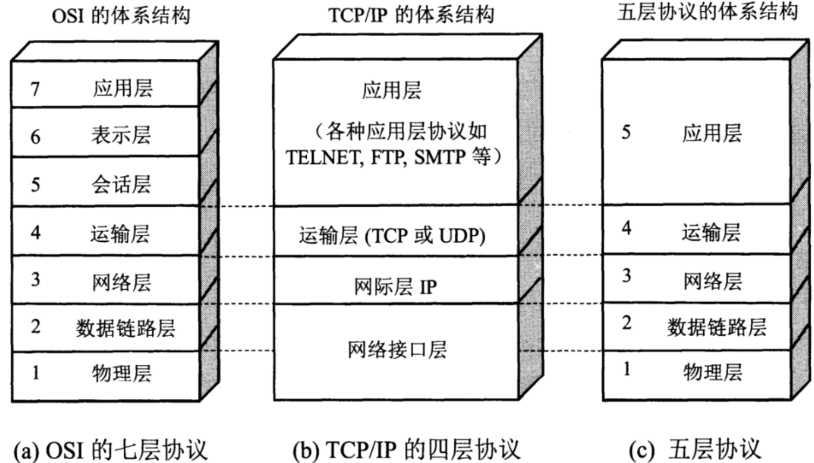

## TCP/IP 网络模型

1. **应用层**专注于为用户提供应用功能，比如 HTTP，FTP 等；
2. **传输层**是在两台终端设备进程之间的通信提供通用的数据传输服务，主要有两个传输协议，TCP 和 UDP；
3. **网络层**负责将数据从一个设备传输到另一个设备，最常使用的是 IP 协议；
4. **网络接口层**主要为网络层提供「链路级别」传输的服务。

## 为什么分层

**各层之间相互独立**：各层之间相互独立，各层之间不需要关心其他层是如何实现的，只需要知道自己如何调用下层提供好的功能就可以了（可以简单理解为接口调用）**。这个和我们对开发时系统进行分层是一个道理。**

**提高了整体灵活性** ：每一层都可以使用最适合的技术来实现，你只需要保证你提供的功能以及暴露的接口的规则没有改变就行了。**这个和我们平时开发系统的时候要求的高内聚、低耦合的原则也是可以对应上的。**

**大问题化小** ： 分层可以将复杂的网络问题分解为许多比较小的、界线比较清晰简单的小问题来处理和解决。这样使得复杂的计算机网络系统变得易于设计，实现和标准化。 **这个和我们平时开发的时候，一般会将系统功能分解，然后将复杂的问题分解为容易理解的更小的问题是相对应的，这些较小的问题具有更好的边界（目标和接口）定义。**

## 键入 URL

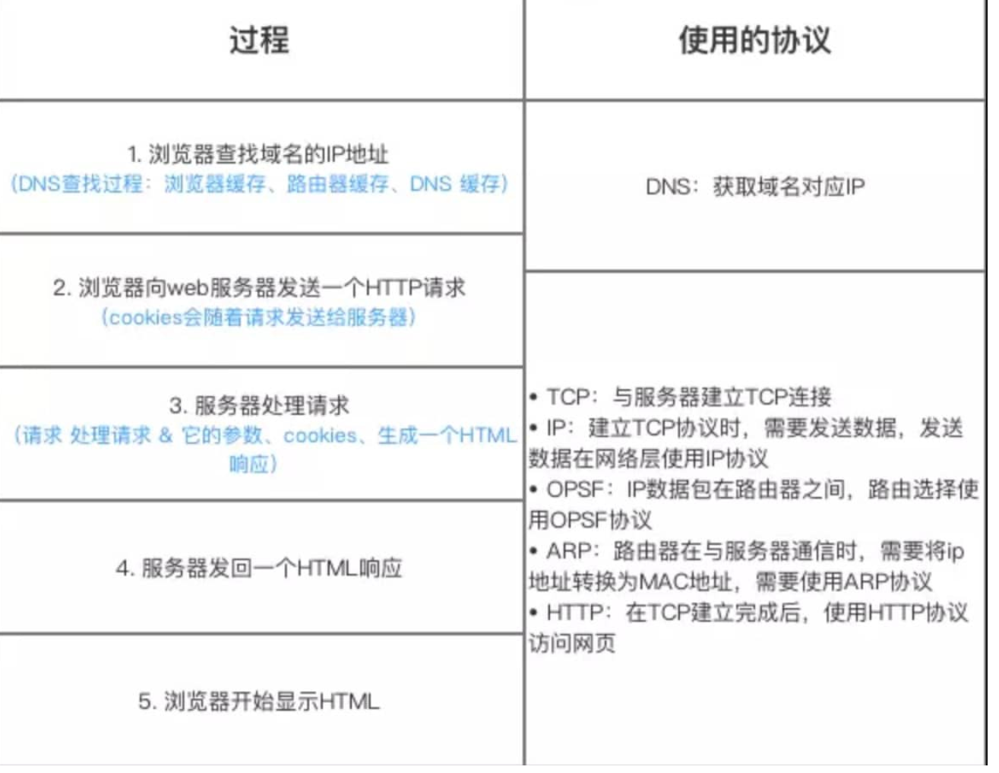

1. 首先浏览器对 URL 进行解析，从而生成发送给 Web 服务器的 ajax 请求信息。
2. **DNS 解析找到 Web 服务器域名对应的 IP 地址**进行访问；
3. 当浏览器获取到服务器的 IP 地址后，**浏览器会用一个随机的端口（1024 < 端口 < 65535）向服务器 80 端口发起 TCP 连接请求**（注：HTTP 默认约定 80 端口，HTTPS 为 443 端口）。这个连接请求到达服务端后，**通过 TCP 三次握手，建立 TCP 的连接**；
4. **发送 HTTP 请求，如果是 HTTPS 请求，还需要进行 TLS 握手；**
5. 服务器响应请求，发回一个 **HTTP 响应报文**；
6. 浏览器**解析渲染页面**；
7. HTTP 请求结束，**TCP 四次挥手断开连接。**

## URI 和 URL

- URI(Uniform Resource Identifier) 是**统一资源标志符，可以唯一标识一个资源。**
- URL(Uniform Resource Locator) 是\*\*统一资源定位符，可以提供该资源的路径。它是一种具体的 URI，即 URL 可以用来标识一个资源，而且还指明了如何 locate 这个资源。

## Cookie 与 Session

**什么是 Cookie**

HTTP Cookie（也叫 Web Cookie 或浏览器 Cookie）是服务器发送到用户浏览器并保存在本地的一小块数据，它会在浏览器下次向同一服务器再发起请求时被携带并发送到服务器上。通常，它用于告知服务端两个请求是否来自同一浏览器，如保持用户的登录状态。Cookie 使基于无状态的 HTTP 协议记录稳定的状态信息成为了可能。

Cookie 主要用于以下三个方面：

- **会话状态管理**（如用户登录状态、购物车、游戏分数或其它需要记录的信息）
- **个性化设置**（如用户自定义设置、主题等）
- **浏览器行为跟踪**（如跟踪分析用户行为等）

**什么是 Session**

Session 代表着服务器和客户端一次会话的过程。Session 对象存储特定用户会话所需的属性及配置信息。这样，当用户在应用程序的 Web 页之间跳转时，存储在 Session 对象中的变量将不会丢失，而是在整个用户会话中一直存在下去。当客户端关闭会话，或者 Session 超时失效时会话结束。

**Cookie 与 Session 的区别：**

- **作用范围不同**，Cookie 保存在客户端(浏览器)，Session 保存在服务器端。
- **存取方式的不同**，Cookie 只能保存 ASCII，Session 可以存任意数据类型，比如 UserId 等。
- **有效期不同**，Cookie 可设置为长时间保持，比如默认登录功能功能，Session 一般有效时间较短，客户端关闭或者 Session 超时都会失效。
- **隐私策略不同**，Cookie 存储在客户端，信息容易被窃取；Session 存储在服务端，相对安全一些。
- **存储大小不同**， 单个 Cookie 保存的数据不能超过 4K，Session 可存储数据远高于 Cookie。

## Cookie/Session 是如何配合的

用户第一次请求服务器的时候，服务器根据用户提交的相关信息，创建对应的 Session ，请求返回时将此 Session 的唯一标识信息 SessionID 返回给浏览器，浏览器接收到服务器返回的 SessionID 信息后，会将此信息存入到 Cookie 中，同时 Cookie 记录此 SessionID 属于哪个域名。

当用户第二次访问服务器的时候，请求会自动判断此域名下是否存在 Cookie 信息，如果存在自动将 Cookie 信息也发送给服务端，服务端会从 Cookie 中获取 SessionID，再根据 SessionID 查找对应的 Session 信息，如果没有找到说明用户没有登录或者登录失效，如果找到 Session 证明用户已经登录可执行后面操作。

根据以上流程可知，SessionID 是连接 Cookie 和 Session 的一道桥梁，大部分系统也是根据此原理来验证用户登录状态。

## 分布式 Session 问题

在互联网公司为了可以支撑更大的流量，后端往往需要多台服务器共同来支撑前端用户请求，那如果用户在 A 服务器登录了，第二次请求跑到服务 B 就会出现登录失效问题。

分布式 Session 一般会有以下几种解决方案：

- **客户端存储**：直接将信息存储在 cookie 中，cookie 是存储在客户端上的一小段数据，客户端通过 http 协议和服务器进行 cookie 交互，通常用来存储一些不敏感信息

* **Nginx ip_hash 策略**：服务端使用 Nginx 代理，每个请求按访问 IP 的 hash 分配，这样来自同一 IP 固定访问一个后台服务器，避免了在服务器 A 创建 Session，第二次分发到服务器 B 的现象。
* **Session 复制**：任何一个服务器上的 Session 发生改变（增删改），该节点会把这个 Session 的所有内容序列化，然后广播给所有其它节点。
* **共享 Session（建议）**：服务端无状态化，将用户的 Session 等信息使用缓存中间件（如 Redis）来统一管理，保障分发到每一个服务器的响应结果都一致。

## Cookie 被禁用

1.每次请求中都携带一个 **SessionID** ，可以以 Post 的方式提交，也可以在请求的地址后面拼接 `xxx?SessionID=123456.`

2.**Token：** 当用户第一次登录后，服务器根据提交的用户信息生成一个 Token，响应时将 Token 返回给客户端，以后客户端只需带上这个 Token 前来请求数据即可，无需再次登录验证。

## PING 工作原理

PING 基于网络层的 **ICMP（Internet Control Message Protocol，互联网控制报文协议）**，其主要原理就是通过在网络上发送和接收 ICMP 报文实现的。

ICMP 报文中包含了类型字段，用于标识 ICMP 报文类型。ICMP 报文的类型有很多种，但大致可以分为两类：

- **查询报文类型** ：向目标主机发送请求并期望得到响应。
- **差错报文类型** ：向源主机发送错误信息，用于报告网络中的错误情况。

PING 用到的 ICMP Echo Request（类型为 8 ） 和 ICMP Echo Reply（类型为 0） 属于查询报文类型 。

- PING 命令会向目标主机发送 ICMP Echo Request。
- 如果两个主机的连通性正常，目标主机会返回一个对应的 ICMP Echo Reply。

## 什么是 DDoS 攻击

DDoS 全称 Distributed Denial of Service，分布式拒绝服务攻击。最基本的 DOS 攻击过程如下：

1. 客户端向服务端发送请求链接数据包。
2. 服务端向客户端发送确认数据包。
3. 客户端不向服务端发送确认数据包，服务器一直等待来自客户端的确认

DDoS 则是采用分布式的方法，通过在网络上占领多台“肉鸡”，用多台计算机发起攻击。

DOS 攻击现在基本没啥作用了，因为服务器的性能都很好，而且是多台服务器共同作用，1V1 的模式黑客无法占上风。对于 DDOS 攻击，预防方法有：

- **减少 SYN timeout 时间**。在握手的第三步，服务器会等待 30 秒-120 秒的时间，减少这个等待时间就能释放更多的资源。
- **限制同时打开的 SYN 半连接数目。**

## 什么是 XSS 攻击

XSS 也称 cross-site scripting，**跨站脚本**。这种攻击是**由于服务器将攻击者存储的数据原原本本地显示给其他用户所致的**。比如一个存在 XSS 漏洞的论坛，用户发帖时就可以引入**带有＜ script ＞标签的代码**，导致恶意代码的执行。

预防措施有：

- 前端：过滤。
- 后端：转义，比如 go 自带的处理器就具有转义功能。

## SQL 注入

SQL 注入就是在用户输入的字符串中加入 SQL 语句，如果在设计不良的程序中忽略了检查，那么这些注入进去的 SQL 语句就会被数据库服务器误认为是正常的 SQL 语句而运行，攻击者就可以执行计划外的命令或访问未被授权的数据。

**SQL 注入的原理主要有以下 4 点**

- **恶意拼接查询**
- **利用注释执行非法命令**
- **传入非法参数**
- **添加额外条件**

**避免 SQL 注入的一些方法**：

- **限制数据库权限**，给用户提供仅仅能够满足其工作的最低权限。
- 对进入数据库的**特殊字符转义处理**。
- **提供参数化查询接口**，不要直接使用原生 SQL。

## 负载均衡算法有哪些

- **轮询法**：将请求按照顺序轮流的分配到服务器上。不能发挥某些高性能服务器的优势。
- **随机法**：随机获取一台，和轮询类似。
- **哈希法**：通过**ip 地址哈希化**来确定要选择的服务器编号。好处是，每次客户端访问的服务器都是同一个服务器，**能很好地利用 session 或者 cookie**。
- **加权轮询**：根据服务器**性能进行加权**。

# 应用层 HTTP

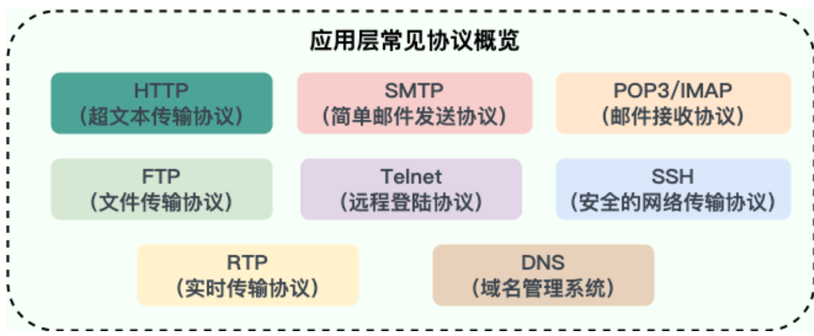

## HTTP 是什么

HTTP，**超文本传输协议**是一个在计算机世界里专门在「两点」之间「传输」文字、图片、音频、视频等「超文本」数据的「**约定和规范**」。

## HTTP 报文内容

### 请求报文内容

```java
GET/sample.jspHTTP/1.1 //请求行
Accept:image/gif.image/jpeg, //请求头部
Accept-Language:zh-cn
Connection:Keep-Alive
Host:localhost
User-Agent:Mozila/4.0(compatible;MSIE5.01;Window NT5.0)
Accept-Encoding:gzip,deflate

username=jinqiao&password=1234 //请求主体
```

**1.请求行：** 请求方法(GET/POST)，请求 URL，HTTP 协议版本号。

**2.请求头**：每个首部都有一个首部名称，以及对应的值。

    Accept-Charset：浏览器能够显示的字符集
    Accept-Encoding：浏览器能够处理的压缩编码
    Accept-Language：浏览器当前设置的语言
    Connection：浏览器与服务器之间连接的类型
    Cookie：当前页面设置的任何Cookie
    Host：发出请求的页面所在的域
    Referer：发出请求的页面的URL
    User-Agent：浏览器的用户代理字符串

**3.请求体**：存放请求的参数。例如 JSON。

### 响应报文内容

```java
HTTP/1.1 200 OK    //响应行
Server:Apache Tomcat/5.0.12  //响应头
Date:Mon,6Oct2003 13:23:42 GMT
Content-Length:112
// 响应体
<html>
    <head>
        <title>HTTP响应示例<title>
    </head>
    <body>
        Hello HTTP!
    </body>
</html>
```

**1.响应行：**（版本+状态码+原因短语）。

**2.响应头：** 各种头部信息。

```java
Cache-Control：控制HTTP缓存
Connection：浏览器与服务器之间连接的类型
Content-Encoding：适用的编码方式
Content-Type：表示后面的文档属于什么MIME类型
Date：表示消息发送的时间，时间的描述格式由rfc822定义
ETag：资源的匹配信息
Expires：提供一个日期和时间，响应在该日期和时间后被认为失效
Last-Modified：资源的最后修改日期时间
server：服务器名字
Set-Cookie
```

**3.响应体：** 服务器返回的 html 之类的资源。

## 如何解决无状态

**Cookie**：（放在请求头里）

1. 客户端发送 HTTP 请求给服务器。
2. 服务器响应，并附带 Set-Cookie 的头部信息。（响应头）
3. 客户端保存 Cookie，之后的请求头会附带 Cookie 信息。
4. 服务器从 Cookie 知道客户端是谁了，返回相应的响应。

**cookie 的问题**：

1. 不可跨域名。
2. 使用 UTF-8 编码保存中文。
3. 使用 BASE64 保存二进制数据（图片等）。

**Session**：

把用户名、密码等重要隐私都存到**服务器上**。服务器把 SessionID 通过 Cookie 发给客户端，之后客户端访问带上 SessionID 就可以。如果浏览器不支持 cookie 则把 sessionID 写在 url 中。（在 Java 中是通过调用 HttpServletRequest 的 getSession 方法（使用 true 作为参数）创建的。Session 在用户第一次访问服务器的时候自动创建。在创建了 Session 的同时，服务器会为该 Session 生成唯一的 SessionID，而这个 SessionID 在随后的请求中会被用来重新获得已经创建的 Session）

**Token**：

Token 就是一段字符串, Token 传递的过程跟 Cookie 类似，只是传递对象变成了 Token。用户使用用户名、密码请求服务器后，服务器就生成 Token，在响应中返给客户端,客户端再次请求时附带上 Token，服务器就用这个 Token 进行认证鉴权。

**JWT**：

JWT 的英文全称是 JSON Web Token。JWT 把所有信息都存在自己身上了，包括用户名密码、加密信息等，且以 JSON 对象存储。包含三部分：**Header**、**Payload**、**Signature**。

## 常见状态码

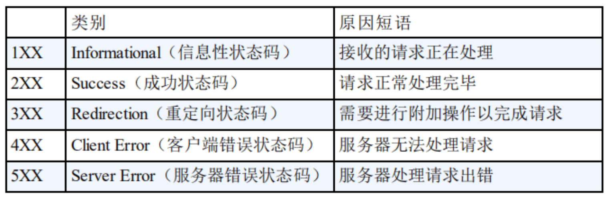

**1 开头**的状态码属于**提示信息**，是协议处理中的一种中间状态，实际用到的比较少。
**2 开头**的状态码表示服务器**成功**处理了客户端的请求。

- 「**200 OK**」是最常见的成功状态码，表示一切正常。
- 「**204 No Content**」 与 200 基本相同，但**响应头没有 body 数据**。
- 「**206 Partial Content**」是应用于 HTTP **分块下载或断点续传**，表示响应返回的 **body 数据只是其中的一部分**。

**3 开头**的状态码表示客户端请求的资源发生了变动，需要客户端用新的 URL 重新发送请求获取资源，也就是**重定向**。

- 「**301 Moved Permanently**」表示**永久重定向**，说明请求的资源已经不存在了，需改用新的 URL 再次访问。
- 「**302 Found**」表示**临时重定向**，说明请求的资源还在，但暂时需要用另一个 URL 来访问。
- 「**304 Not Modified**」不具有跳转的含义，表示资源未修改，重定向已存在的缓冲文件，也称**缓存重定向**，也就是**告诉客户端可以继续使用缓存资源，用于缓存控制**。

**4 开头**的状态码表示客户端发送的**报文有误**，服务器无法处理。

- 「**400 Bad Request**」表示客户端**请求的报文有错误**，但只是个**笼统的错误**。
- 「**403 Forbidden**」表示服务器**禁止访问**资源，并不是客户端的请求出错。
- 「**404 Not Found**」表示请求的资源在服务器上**不存在或未找到**，所以无法提供给客户端。

**5 开头**的状态码表示客户端请求报文正确，但是**服务器处理时内部发生了错误**，属于服务器端的错误码。

- 「**500 Internal Server Error**」与 400 类型，是个**笼统通用的错误码**，服务器发生了什么错误，我们并不知道。
- 「**501 Not Implemented**」表示客户端**请求的功能还不支持**。
- 「**502 Bad Gateway**」通常是服务器作为**网关或代理时返回的错误码**，表示服务器自身工作正常，访问后端服务器发生了错误。
- 「**503 Service Unavailable**」表示服务器当前**很忙，暂时无法响应**客户端。

## 301 和 302 的区别

**共同点**：301 和 302 状态码都表示重定向，就是说浏览器在拿到服务器返回的这个状态码后会自动跳转到一个新的 URL 地址，这个地址可以从响应的**Location 首部**中获取（**用户看到的效果就是他输入的地址 A 瞬间变成了另一个地址 B**）。
**不同点**：301 表示**旧地址 A 的资源已经被永久地移除了**(这个资源不可访问了)，搜索引擎在抓取新内容的同时也将旧的网址交换为重定向之后的网址；302 表示**旧地址 A 的资源还在**（仍然可以访问），这个重定向只是临时地从旧地址 A 跳转到地址 B，搜索引擎会抓取新的内容而保存旧的网址。 SEO 中 302 好于 301。

**重定向原因**：

1. 网站调整（如改变网页目录结构）；
2. 网页被移到一个新地址；
3. 网页扩展名改变(如应用需要把.php 改成.Html 或.shtml)。

## GET 和 POST

**使用上的区别**：

- **GET 使用 URL 或 Cookie 传参**，而**POST 将数据放在 BODY 中**，这个是因为 HTTP 协议用法的约定。
- GET 方式提交的数据有**长度限制**，则 POST 的数据则可以非常大，这个是因为它们使用的操作系统和浏览器设置的不同引起的区别。
- **POST 比 GET 安全**，因为**数据在地址栏上不可见**。

**本质区别：**

- **GET**：从服务器获取指定的资源。**安全、幂等（执行多次相同的操作，结果都是相同的）、可被缓存到浏览器里。**
- **POST**：根据报文对指定的资源做出处理「新增或提交数据」。**不安全、不幂等、不可缓存（除了查询请求）**。

**安全**是指请求方法「**不会破坏**」服务器上的资源；
**幂等**是指多次**执行相同的操作**「**结果都是相同**」的。

从 **RFC 规范**定义的语义来分析是这样的。但是实际过程中，开发者不一定会按照 RFC 规范定义的语义来实现 GET 和 POST 方法。可以用 GET 方法实现新增或删除数据的请求，用 POST 方法实现查询数据的请求。

## HTTP 缓存

**强制缓存**

强制缓存指的是**只要浏览器判断缓存没有过期，就直接使用浏览器的本地缓存**，决定是否使用缓存的**主动权在于浏览器**。（**优先级高于协商缓存**）

强制缓存是利用`Cache-Control`​ 和 ​`Expires`​ 这两个 HTTP 响应头部字段实现的，它们都用来表示资源在客户端缓存的有效期：

- `Cache-Control`​， 是一个相对时间（优先级更高）；
- `Expires`​，是一个绝对时间；

具体流程是这样：

1. 当浏览器第一次请求访问服务器资源时，服务器会在返回这个资源的同时，在 Response 头部加上 Cache-Control，Cache-Control 中设置了过期时间大小；
2. 浏览器再次请求访问服务器中的该资源时，会先**通过请求资源的时间与 Cache-Control 中设置的过期时间，来计算出该资源是否过期**，如果没有，则使用该缓存，否则重新请求服务器；
3. 服务器再次收到请求后，会再次更新 Response 头部的 Cache-Control。

**协商缓存**

协商缓存就是**与服务端协商**判断是否使用本地缓存。（返回响应码**304**）

协商缓存有两种实现方式：

第一种：基于请求头中的 `If-Modified-Since`​ 字段与响应头中的 `Last-Modified`​ 字段实现，是基于**时间**的，这两个字段的意思是：

- 响应头中的 `Last-Modified`​：表示这个响应资源的最后修改时间；
- 请求头部中的 `If-Modified-Since`​：当资源过期了，发现响应头中具有 Last-Modified 声明，那么再次发起请求的时候带上 Last-Modified 的时间，服务器收到请求后发现有 If-Modified-Since 字段，就与被请求资源的 Last-Modified 进行对比，如果最后修改时间较新（大），说明资源又被改过，则返回最新资源，HTTP 200 OK；如果最后修改时间较旧（小），说明资源无新修改，响应 HTTP 304 走缓存。

第二种：基于请求头中的 `If-None-Match`​ 字段与响应头中的 `ETag`​ 字段，是基于**唯一标识**的，优先级比第一种方法高，这两个字段的意思是：

- 响应头中的 `Etag`​ 唯一标识了响应资源；
- 请求头中的 `If-None-Match`​：当资源过期时，浏览器发现响应头里有 Etag，则再次向服务器发起请求时，会将请求头 If-None-Match 值设置为 Etag 的值。服务器收到请求后进行比对，如果资源没有变化返回 304，如果资源变化了返回最新资源。

## HTTP 优缺点

HTTP 最突出的优点是「简单、灵活和易于扩展、应用广泛和跨平台」。
**无状态**的**好处是不需要额外的资源来记录状态信息，这能减轻服务器的负担；坏处是在完成有关联性的操作时会非常麻烦**。比较简单的解决方式是用 **Cookie** 技术。服务器第一次响应时，在响应中添加 Cookie 信息，之后客户端的请求都带上 Cookie，服务器就能认出客户端了。
**明文传输**意味着在传输过程中的信息，是可以方便阅读的，为我们调试工作带了极大的便利性。但是信息也就很容易**被窃取**，不安全。

- **不验证通信方的身份，因此有可能遭遇伪装。**
- **无法证明报文的完整性，所以有可能会遭到篡改。**

## HTTP/1.1 和 1.0

- **使用长连接**的方式改善了 HTTP/1.0 短连接造成的性能开销。只要任意一端没有明确提出断开连接，就会保持 TCP 连接状态。如果长连接超过一定时间没有任何数据交互，服务端就会主动断开这个连接。长连接多用于操作频繁，点对点的通讯
- 支持**管道（pipeline）网络传输**，只要第一个请求发出去了，不必等其回来，就可以发第二个请求出去，可以**减少整体的响应时间**​。但是 ​**服务器必须按照接收请求的顺序发送对这些管道化请求的响应**。如果服务端在处理 A 请求时耗时比较长，那么后续的请求的处理都会被阻塞住，也就是「队头堵塞」。所以，**HTTP/1.1 管道解决了请求的队头阻塞，但是没有解决响应的队头阻塞**。
- 新增了**大量的状态码**。
- 加入了**缓存字段 Cache-Control，Etag**等，引入了更多的缓存控制策略，可供选择的缓存头来控制缓存策略。
- 加入了**范围请求机制**。**请求头引入了 range 头域**，它允许只请求资源的某个部分，**即返回码是 206**（Partial Content），这样就方便了开发者自由的选择以便于充分利用带宽和连接。
- 在**请求头中加入 Host 字段**：域名系统（DNS）允许多个主机名绑定到同一个 IP 地址上，但是 HTTP/1.0 并没有考虑这个问题，在 HTTP1.0 中认为每台服务器都绑定一个唯一的 IP 地址，因此，请求消息中的 URL 并没有传递主机名（hostname）。但随着虚拟主机技术的发展，在一台物理服务器上可以存在多个虚拟主机（Multi-homed Web Servers），并且它们共享一个 IP 地址。HTTP1.1 的请求消息和响应消息都应支持 Host 头域，且请求消息中如果没有 Host 头域会报告一个错误（400 Bad Request）。

但 HTTP/1.1 还是有性能瓶颈：

- **请求 / 响应头部（Header）未经压缩**就发送，首部信息越多延迟越大。只能压缩 Body 的部分；
- 而且会每次都互相发送**相同的首部**，造成的浪费较多；
- 服务器是按请求的顺序响应的，如果服务器响应慢，会招致客户端一直请求不到数据，也就是**响应的队头阻塞**；
- **没有请求优先级控制**；
- 请求只能从客户端开始，**服务器只能被动响应**。

## 如何优化 HTTP/1.1

- 尽量避免发送 HTTP 请求：通过缓存技术来避免发送 HTTP 请求。客户端收到第一个请求的响应后，可以将其缓存在本地磁盘，下次请求的时候，如果缓存没过期，就直接读取本地缓存的响应数据。如果缓存过期，客户端发送请求的时候带上响应数据的摘要，服务器比对后发现资源没有变化，就发出不带包体的 304 响应，告诉客户端缓存的响应仍然有效。
- 在需要发送 HTTP 请求时，考虑如何减少请求次数
  - 减少重定向次数：将原本由客户端处理的重定向请求，交给代理服务器处理，这样可以减少重定向请求的次数；
  - 合并请求：将多个小资源合并成一个大资源再传输，能够减少 HTTP 请求次数以及头部的重复传输，再来减少 TCP 连接数量，进而省去 TCP 握手和慢启动的网络消耗；
  - 延迟发送请求：按需访问资源，只访问当前用户看得到/用得到的资源，当客户往下滑动，再访问接下来的资源，以此达到延迟请求，也就减少了同一时间的 HTTP 请求次数。
- 减少服务器的 HTTP 响应的数据大小：通过压缩响应资源，降低传输资源的大小，从而提高传输效率，所以应当选择更优秀的压缩算法。

## HTTP/2 改进了

HTTP/2 协议是**基于 HTTPS** 的，所以 HTTP/2 的安全性也是有保障的。5 个方面优化：

- **头部压缩**：使用 HPACK 算法：对于常见的 HTTP 头部通过**静态表和 Huffman 编码**的方式，将体积压缩了近一半，而且针对后续的请求头部，还可以建立**动态表**，将体积压缩近 90%，大大提高了编码效率，同时节约了带宽资源。
- **二进制格式**：报文全面采用了**二进制格式**，并且统称为帧（frame）：**头信息帧（Headers Frame）和数据帧（Data Frame）**。二进制帧更加**紧凑和高效**，减少了传输的**数据量和带宽消耗**。
- **数据流并发传输**：引入了 Stream 概念，多个 Stream 复用在一条 TCP 连接上。针对不同的 HTTP 请求用独一无二的 Stream ID 来区分，接收端可以通过 Stream ID 有序组装成 HTTP 消息，不同 Stream 的帧是可以乱序发送的，因此可以并发不同的 Stream，但是同一个 Stream 里的帧必须严格有序。
- **多路复用**：HTTP/2 是可以在**一个连接中并发多个请求或回应，而不用按照顺序一一对应**。**降低了延迟，大幅度提高了连接的利用率**。
- **服务器主动推送资源**：**服务器支持主动推送资源**，可以在客户端请求一个资源时，将其他相关资源一并推送给客户端，从而减少了客户端的请求次数和延迟。而 HTTP/1.1 需要客户端自己发送请求来获取相关资源。

但是 HTTP/2 还是存在**TCP 的队头阻塞**问题，HTTP/2 是基于 TCP 协议来传输数据的，TCP 是字节流协议，TCP 层必须保证收到的字节数据是完整且连续的，这样内核才会将缓冲区里的数据返回给 HTTP 应用，那么当「前 1 个字节数据」没有到达时，后收到的字节数据只能存放在内核缓冲区里，只有等到这 1 个字节数据到达时，HTTP/2 应用层才能从内核中拿到数据，也就是 HTTP/2 队头阻塞问题。

## HTTP/3 改进了

**HTTP/3 把 HTTP 下层的 TCP 协议改成了 UDP**，使用基于 UDP 的 **QUIC 协议**实现了类似 TCP 的可靠性传输。QUIC 有以下 3 个特点：

- **无队头阻塞**：QUIC 连接上的多个流之间并没有依赖，都是独立的，**当某个流发生丢包时，只会阻塞这个流，其他流不会受到影响，也就不存在队头阻塞问题**。

- **更快的连接建立**： 因为 QUIC 内部包含 TLS 1.3，因此**仅需 1 个 RTT** 就可以「同时」完成建立连接与 TLS 密钥协商，甚至在第二次连接的时候，应用数据包可以和 QUIC 握手信息（连接信息 + TLS 信息）一起发送，达到 0-RTT 的效果。HTTP/2.0 需要经过经典的 TCP 三次握手过程（一般是 3 个 RTT）

- **错误恢复** ：HTTP/3.0 具有更好的错误恢复机制，当出现丢包、延迟等网络问题时，可以更快地进行恢复和重传。而 HTTP/2.0 则需要依赖于 TCP 的错误恢复机制。

- **安全性** ：HTTP/2.0 和 HTTP/3.0 在安全性上都有较高的要求，支持加密通信，但在实现上有所不同。HTTP/2.0 使用 TLS 协议进行加密，而 HTTP/3.0 基于 QUIC 协议，包含了内置的**加密和身份验证机制**，可以提供更强的安全性。

## HTTP 和 HTTPS

|              |        HTTP         |                                                                      HTTPS                                                                      |
| :----------: | :-----------------: | :---------------------------------------------------------------------------------------------------------------------------------------------: |
|     端口     |         80          |                                                                       443                                                                       |
|    安全性    | 无加密，安全性较差  | TCP 和 HTTP 网络层之间加入了 **SSL/TLS 安全协议**，使得报文能够加密传输。**加密采用对称加密，对称加密的密钥用服务器方的证书进行了非对称加密。** |
|   资源消耗   | 较少，TCP 三次握手  |                                                  还需进行 **SSL/TLS** 的四次握手，资源消耗更多                                                  |
| 是否需要证书 |       不需要        |                                     需要**向 CA（证书权威机构）申请数字证书**，来保证服务器的身份是可信的。                                     |
|     协议     | 运行在 TCP 协议之上 |                                                  运行在 SSL 协议之上，SSL 运行在 TCP 协议之上                                                   |

## HTTPS 解决 HTTP 的问题

1.HTTPS 采用的是对称加密和非对称加密结合的「混合加密」方式，保证信息的机密性，解决了窃听的风险。在通信建立前采用**非对称加密**的方式交换「会话秘钥」，在通信过程中使用「会话秘钥」来对明文数据进行**对称加密**。

- **对称加密**只使用一个密钥，运算速度快，密钥必须保密，无法做到安全的密钥交换。
- **非对称加密**使用两个密钥：公钥和私钥，公钥可以任意分发而私钥保密，解决了密钥交换问题但速度慢。

  2.**通过摘要算法（哈希函数）来保证消息的完整性，解决了篡改的风险。** 发送方用摘要算法计算出内容的哈希值，和内容一起发出，接收方收到后，也计算出内容的哈希值，并与收到的哈希值比对。**但是并不能保证「内容 + 哈希值」不会被中间人替换**，因为缺少对客户端收到的消息是否来源于服务端的证明。可以通过数字签名来保证消息的来源可靠性（能确认消息是由持有私钥的一方发送的）。通过**私钥加密内容的哈希值**，公钥解密来保证消息不被冒充，因为私钥是不可泄露的，如果公钥能正常解密出私钥加密的内容，就能**证明这个消息是来源于持有私钥身份的人发送的**。  
  3.**通过数字证书的方式保证服务器公钥的身份，解决身份冒充的风险**。这需要通过权威的机构，也就是 CA （数字证书认证机构）来保证。将服务器公钥放在由 CA 颁发的数字证书中，只要证书是可信的，公钥就是可信的。

## HTTPS 的原理过程


加密流程按图中的序号分为：

1. 客户端请求 HTTPS 网址，然后连接到 server 的 443 端口 (HTTPS 默认端口，类似于 HTTP 的 80 端口)。
2. 采用 HTTPS 协议的服务器必须要有一套数字 CA (Certification Authority)证书。**颁发证书的同时会产生一个私钥和公钥。私钥由服务端自己保存，不可泄漏。公钥则是附带在证书的信息中，可以公开的**。证书本身也附带一个证书电子签名，这个签名用来验证证书的完整性和真实性，可以防止证书被篡改。
3. 服务器响应客户端请求，将证书传递给客户端，证书包含公钥和大量其他信息，比如证书颁发机构信息，公司信息和证书有效期等。
4. 客户端解析证书并对其进行验证。如果证书不是可信机构颁布，或者证书中的域名与实际域名不一致，或者证书已经过期，就会向访问者显示一个警告，由其选择是否还要继续通信。
   如果证书没有问题，客户端就会从服务器证书中取出服务器的公钥 A。然后客户端还会生成一个随机码 KEY，并使用公钥 A 将其加密。
5. 客户端把加密后的随机码 KEY 发送给服务器，作为后面对称加密的密钥。
6. 服务器在收到随机码 KEY 之后会使用私钥 B 将其解密。经过以上这些步骤，客户端和服务器终于建立了安全连接，完美解决了对称加密的密钥泄露问题，接下来就可以用对称加密进行通信了。
7. 服务器使用密钥 (随机码 KEY)对数据进行对称加密并发送给客户端，客户端使用相同的密钥 (随机码 KEY)解密数据。
8. 双方使用对称加密传输所有数据。

## 签发校验数字证书流程

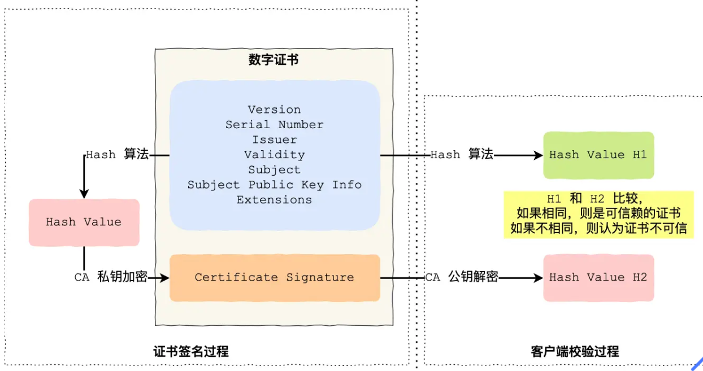

**CA 签发证书**的过程：

- 首先 CA 会把持有者的公钥、用途、颁发者、有效时间等信息打成一个包，然后对这些信息进行 Hash 计算，得到一个 Hash 值；
- 然后 CA 会使用自己的私钥将该 Hash 值加密，生成 Certificate Signature，也就是 CA 对证书做了签名；
- 最后将 Certificate Signature 添加在文件证书上，形成数字证书；

客户端**校验**服务端的数字证书的过程：

- 首先客户端会使用同样的 Hash 算法获取该证书的 Hash 值 H1；
- 通常浏览器和操作系统中集成了 CA 的公钥信息，浏览器收到证书后可以使用 CA 的公钥解密 Certificate Signature 内容，得到一个 Hash 值 H2 ；
- 最后比较 H1 和 H2，如果值相同，则为可信赖的证书，否则则认为证书不可信。

但事实上，证书的验证过程中**还存在一个证书信任链的问题**，因为我们向 CA 申请的证书一般不是根证书签发的，而是由中间证书签发的。

## TLS 四次握手

SSL/TLS 协议**基本流程**（基于 RSA/ECDHE 算法）：

1. 客户端向服务器索要并**验证服务器的公钥**。
2. 双方协商生产「会话秘钥」（四次握手中前三次生成的**随机数生成**）。
3. 双方采用「会话秘钥」进行加密通信。

**RSA 算法四次握手**：

1. 第一次握手：客户端首先会发一个「**Client Hello**」消息，消息里面有客户端使用的 TLS 版本号、支持的密码套件列表，以及生成的**随机数**（​Client Random​），这个随机数会被服务端保留，它是生成对称加密密钥的材料之一。
2. 第二次握手：服务端返回「**Server Hello**」消息，消息里面有服务器确认的 TLS 版本号，也给出了**随机数**（​Server Random），然后从客户端的密码套件列表选择了一个合适的密码套件。密码套件基本的形式是「**密钥交换算法 + 签名算法 + 对称加密算法 + 摘要算法**」。然后，服务端为了证明自己的身份，会发送「**Server Certificate**」给客户端，这个消息里含有**数字证书**。最后服务端发送「**Server Hello Done**」消息，
3. 第三次握手：**客户端验证完证书后**，认为可信则继续往下走。客户端就会生成一个新的**随机数** (pre-master)，用服务器的 **RSA 公钥加密该随机数**，通过「**Client Key Exchange**」消息传给服务端。至此，**客户端和服务端双方都共享了三个随机数，分别是 Client Random、Server Random、pre-master**。于是，双方根据已经得到的三个随机数，生成**会话密钥（Master Secret）**，也就是是对称密钥，用于对后续的 HTTP 请求/响应的数据加解密。然后客户端发一个「**Change Cipher Spec**」，告诉服务端开始使用加密方式发送消息。然后，客户端再发一个「**Encrypted Handshake Message（Finishd）**」消息，把之前所有发送的数据做个**摘要**，再用会话密钥（master secret）加密一下，让服务器做个验证，验证加密通信「是否可用」和「之前握手信息是否有被中途篡改过」。
4. 第四次握手：服务器也是同样的操作，发「**Change Cipher Spec**」和「**Encrypted Handshake Message**」消息，如果双方都验证加密和解密没问题，那么握手正式完成。

**RSA 密钥协商算法的最大问题是不支持前向保密**。一旦服务端的**私钥泄漏**了，过去被第三方截获的**所有 TLS 通讯密文都会被破解**。

ECDHE 算法握手：  
。。。

## HTTPS 优缺点

**优点**：

- 安全性：
  - 使用 HTTPS 协议可认证用户和服务器，确保数据发送到正确的客户机和服务器；
  - HTTPS 协议是由 SSL+HTTP 协议构建的可进行加密传输、身份认证的网络协议，要比 http 协议安全，可防止数据在传输过程中不被窃取、改变，确保数据的完整性。
  - HTTPS 是现行架构下最安全的解决方案，虽然不是绝对安全，但它大幅增加了中间人攻击的成本。
- SEO 方面：谷歌曾在 2014 年 8 月份调整搜索引擎算法，并称“比起同等 HTTP 网站，采用 HTTPS 加密的网站在搜索结果中的排名将会更高”。

**缺点**：

- 在相同网络环境中，HTTPS 相比 HTTP 无论是响应时间还是耗电量都有大幅度上升。
- HTTPS 的安全是有范围的，在黑客攻击、服务器劫持等情况下几乎起不到作用。
- 在现有的证书机制下，中间人攻击依然有可能发生。
- HTTPS 需要更多的服务器资源，也会导致成本的升高。

## HTTPS 优化

对于**硬件优化**的方向：因为 HTTPS 是属于**计算密集型**，应该选择计算力更强的 CPU，而且最好选择**支持 AES-NI 特性的 CPU**，这个特性可以在**硬件级别优化 AES 对称加密算法，加快应用数据的加解密**。  
对于**软件优化**的方向：如果可以，把软件升级成较新的版本，比如将 Linux 内核 2.X 升级成 4.X，将 openssl 1.0.1 升级到 1.1.1，因为新版本的软件不仅会提供新的特性，而且还会修复老版本的问题。
**协议优化**：

- 密钥交换算法应该选择 **ECDHE 算法**，而不用 RSA 算法，因为 ECDHE 算法具备**前向安全性**，而且客户端可以在第**三次握手**之后，就发送加密应用数据，**节省了 1 RTT**。
- 将 TLS1.2 升级 **TLS1.3**，因为 TLS1.3 的握手过程只需要 1 RTT，而且安全性更强。

**证书优化**：

- 服务器应该选用 **ECDSA 证书**，而非 RSA 证书，因为**在相同安全级别下**，**ECC 的密钥长度比 RSA 短很多**，这样可以**提高证书传输效率**；
- 服务器应该开启 **OCSP Stapling** 功能，由服务器预先获得 OCSP 的响应，并**把响应结果缓存起来**，这样 **TLS 握手**的时候就**不用再访问 CA 服务器**，减少了**网络通信开销**，提高了**证书验证效率**；

对于**重连 HTTPS** 时，我们可以使用一些技术让客户端和服务端**使用上一次 HTTPS 连接使用的会话密钥，直接恢复会话**，而不用再重新走完整的 TLS 握手过程。
常见的**会话重用**技术有 **Session ID** 和 **Session Ticket**，用了会话重用技术，当再次重连 HTTPS 时，只需要 1 RTT 就可以恢复会话。对于 TLS1.3 使用 Pre-shared Key 会话重用技术，只需要 0 RTT 就可以恢复会话。
这些会话重用技术虽然好用，但是存在一定的安全风险，它们不仅不具备前向安全，而且有重放攻击的风险，所以**应当对会话密钥设定一个合理的过期时间**。

## HTTP 长连接和短连接

**HTTP 协议的长连接和短连接，实质上是 TCP 协议的长连接和短连接。**

**在 HTTP/1.0 中，默认使用的是短连接**。也就是说，**浏览器和服务器每进行一次 HTTP 操作，就建立一次连接，但任务结束就中断连接**。如果客户端浏览器访问的某个 HTML 或其他类型的 Web 页中包含有其他的 Web 资源，如 JavaScript 文件、图像文件、CSS 文件等；当浏览器每遇到这样一个 Web 资源，就会建立一个 HTTP 会话。

但从 **HTTP/1.1 起，默认使用长连接**，用以保持连接特性。**使用长连接的 HTTP 协议，会在响应头有加入这行代码：`Connection:keep-alive`**

在使用长连接的情况下，当一个网页打开完成后，客户端和服务器之间用于传输 HTTP 数据的 **TCP 连接不会关闭**，如果客户端再次访问这个服务器上的网页，会继续使用这一条已经建立的连接。**Keep-Alive 不会永久保持连接，它有一个保持时间，可以在不同的服务器软件（如 Apache）中设定这个时间**。实现长连接要客户端和服务端都支持长连接。

# 传输层 TCP/UDP

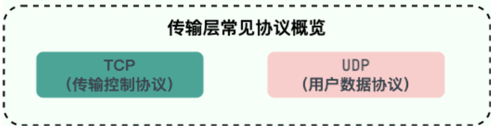

## TCP 是什么

TCP （传输控制协议）是**面向连接的、可靠的、基于字节流的**传输层通信协议。

- **面向连接的**：一定是「一对一」才能连接，不能像 UDP 协议可以一个主机同时向多个主机发送消息，也就是一对多是无法做到的；
- **可靠的**：无论的网络链路中出现了怎样的链路变化，TCP 都可以保证一个报文一定能够到达接收端；
- **基于字节流的**：用户消息通过 TCP 协议传输时，消息可能会被操作系统「分组」成多个的 TCP 报文，如果接收方的程序如果不知道「消息的边界」，是无法读出一个有效的用户消息的。并且 TCP 报文是「有序的」，当「前一个」TCP 报文没有收到的时候，即使它先收到了后面的 TCP 报文，那么也不能扔给应用层去处理，同时对「重复」的 TCP 报文会自动丢弃。

## TCP 头部格式

**序列号**：在建立连接时由计算机生成的随机数作为其初始值，通过 SYN 包传给接收端主机，每发送一次数据，就「累加」一次该「数据字节数」的大小。**用来解决网络包乱序问题。**

**确认应答号**：指下一次「期望」收到的数据的序列号，发送端收到这个确认应答以后可以认为在这个序号以前的数据都已经被正常接收。**用来解决丢包的问题。**

**控制位：**

- _ACK_：该位为 `1`​ 时，「确认应答」的字段变为有效，TCP 规定除了最初建立连接时的 `SYN`​ 包之外该位必须设置为 `1`​ 。
- _RST_：该位为 `1`​ 时，表示 TCP 连接中出现异常必须强制断开连接。
- _SYN_：该位为 `1`​ 时，表示希望建立连接，并在其「序列号」的字段进行序列号初始值的设定。
- _FIN_：该位为 `1`​ 时，表示今后不会再有数据发送，希望断开连接。当通信结束希望断开连接时，通信双方的主机之间就可以相互交换 `FIN`​ 位为 1 的 TCP 段。

**窗口大小**：用作流量控制。

## TCP 三次握手

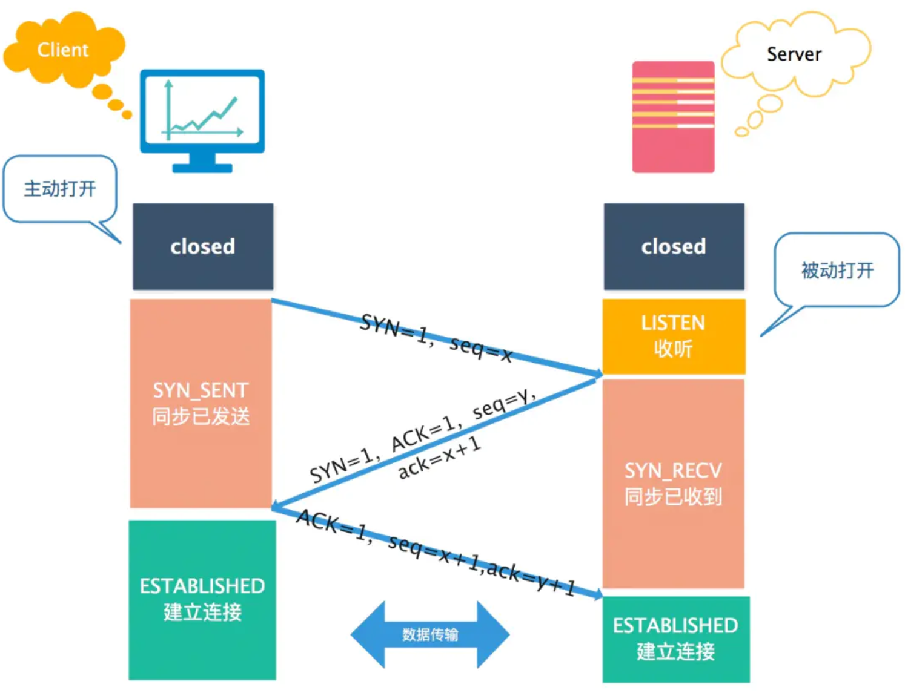

**第三次握手是可以携带数据的，前两次握手是不可以携带数据的**。~~（发 SYN 包时双方会随机初始化一个序列号、ACK 报文不会重传）~~

## 为什么不是 2 次或者 4 次

1. **避免历史连接（主要原因）**：在两次握手的情况下，服务端没有中间状态给客户端来阻止历史连接，就导致服务端可能建立一个历史连接，造成资源浪费。

2. **同步双方初始序列号：** 收到一个 SYN 包时需要回复一个 ACK 应答，**一来一回，才能确保双方的初始序列号能被可靠的同步。** 服务端的回应和发送合成一步就是三次握手。两次握手只能保证一方的初始序列号能被对方成功接收，没办法保证双方的初始序列号都能被成功接收。

3. **避免资源浪费**：由于没有第三次握手，服务端不清楚客户端是否收到了自己回复的 ​ACK​ 报文，所以服务端每收到一个 ​SYN​ 就只能先主动建立一个连接，这样如果客户端发送的 ​SYN​ 报文在网络中阻塞了，重复发送多次 ​SYN​ 报文，那么服务端在收到请求后就会建立多个冗余的无效链接，造成不必要的资源浪费。

**不使用「两次握手」和「四次握手」的原因：**

- 「两次握手」：无法防止历史连接的建立，会造成双方资源的浪费，也无法可靠的同步双方序列号；
- 「四次握手」：三次握手就已经可以建立可靠连接，已经可以确认双方的发送接收能力正常，双方都知道彼此已经准备好，而且也可以完成对双方初始序号值得确认，所以不需要使用更多的通信次数。如果服务端的 ACK 应答和 SYN 包分开就是四次握手，但是没有必要。

## TCP 序列号的作用

- **接收方可以去除重复**的数据；
- 接收方可以根据数据包的序列号**按序接收**；
- **可以标识发送出去的数据包中， 哪些是已经被对方收到的**（通过 ACK 报文中的序列号知道）；

## 初始化序列号要求不一样

如果每次建立连接，客户端和服务端的初始化序列号 ISN 都是一样的话，很容易出现**历史报文**被**下一个相同四元组的连接**接收的问题。从而导致历史报文被新连接成功接收。（序列号要在对方的**接收窗口**范围内才有效）

起始 `ISN`​ 是基于时钟的，每 4 微秒 + 1，另外还加上一个根据源 IP、目的 IP、源端口、目的端口生成的一个随机数值。基本不可能会随机成一样的初始化序列号。

## 全连接和半连接队列

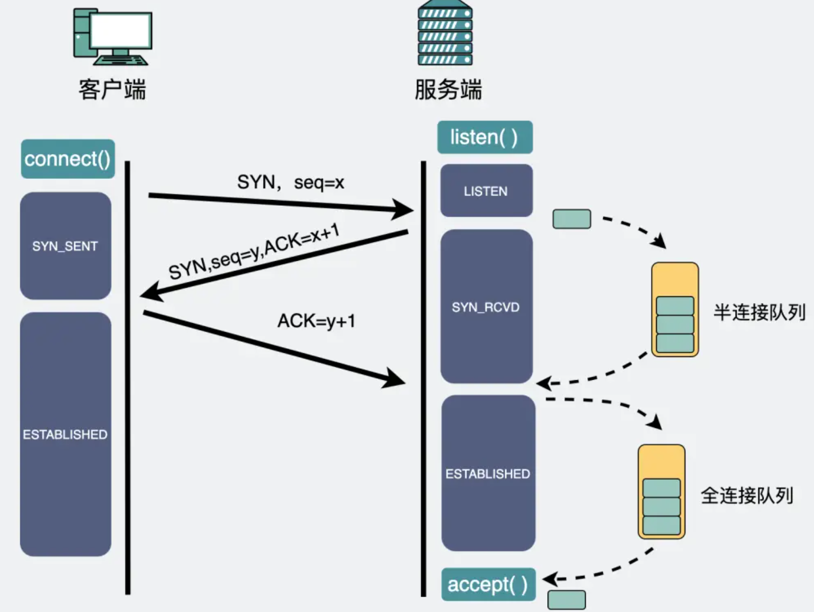

在 TCP 三次握手的时候，Linux 内核会维护两个队列，**半连接队列也称为 SYN 队列**和**全连接队列也称为 accept 队列**。**客户端没有**半连接队列和全连接队列，但有一个**全局 hash**，可以通过它实现**自连接或 TCP 同时打开**

服务端收到客户端发起的 SYN 请求后，**内核会把该连接存储到半连接队列**，并向客户端响应 SYN+ACK，接着客户端会返回 ACK，服务端收到第三次握手的 ACK 后，**内核会把连接从半连接队列移除，然后创建新的完全的连接，并将其添加到全连接队列，等待进程调用 accept 函数时把连接取出来。**

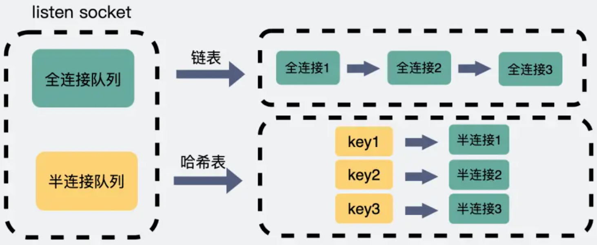

**为什么半连接队列要设计成哈希表**

先对比下**全连接里队列**，他本质是个链表，里面放的都是已经建立完成的连接，这些连接正等待被取走。而服务端取走连接的过程中，并不关心具体是哪个连接，只要是个连接就行，所以直接从队列头取就行了。这个过程**算法复杂度为`O(1)`**。

而**半连接队列**里的都是不完整的连接，嗷嗷等待着第三次握手的到来。那么现在有一个第三次握手来了，则需要从队列里把相应 IP 端口的连接取出，**如果半连接队列还是个链表，那我们就需要依次遍历，才能拿到我们想要的那个连接，算法复杂度就是 O(n)。** 出于效率考虑，半连接队列设计成**哈希表，复杂度就回到 O(1)**

## SYN/ACK 攻击

**SYN 攻击：** 假设攻击者**短时间伪造不同 IP 地址的 `SYN` 报文**，服务端每接收到一个 `SYN` 报文，就进入`SYN_RCVD` 状态，但攻击者不去应答服务端发送的 `ACK + SYN` 报文，久而久之就会**占满服务端的半连接队列**，耗费 CPU 和内存资源，使得服务端不能为正常用户服务。

四种解决方法：

- **增大 TCP 半连接队列**，缩短超时时间；
- **调大 netdev_max_backlog**：当网卡接收数据包的速度大于内核处理的速度时，会有一个队列保存这些数据包
- **减少 SYN+ACK 重传次数**
- 通过防火墙、路由器等过滤网关防护。
- 开启 **tcp_syn_cookies** 功能：直接生成一个`cookies`，这个`cookies`会跟着**第二次握手**，发回客户端。客户端在发**第三次握手**的时候带上这个`cookies`，保存在**TCP 报头**的`seq`里，服务端验证到它就是当初发出去的那个，就会建立连接并放入到全连接队列中，可以绕过半连接来建立连接。但编码解码`cookies`，都是比较**耗 CPU**的，攻击者可以构造大量的**第三次握手包（ACK 包）**，同时带上各种瞎编的`cookies`信息，消耗服务端**CPU 资源**，这就是**ACK 攻击**。

## 没有 accept/listen 能 TCP 连接吗

没有**accept 全连接队列**， **listen 服务端**，**都能建立** TCP 连接

**accpet** 系统调用并不参与 TCP 三次握手过程，它只是负责从 TCP **全连接队列**取出一个已经建立连接的 socket，用户层通过 accpet 系统调用拿到了**已经建立连接的 socket**，就可以对该 socket 进行读写操作了。

客户端可以**自己连自己**形成连接（**TCP 自连接**），也可以两个客户端相互连接（**TCP 同时打开**），这两个都**没有服务端参与，也就是没有 listen，就能 TCP 建立连接。**

## 第三次握手 ACK 包丢失会发生什么？

**服务端：** 会根据 **TCP 的超时重传机制，会等待 3 秒、6 秒、12 秒后重新发送 SYN+ACK 包，以便客户端重新发送 ACK 包**。如果重发指定次数之后，仍然未收到 客户端的 ACK 应答，那么一段时间后，**服务端自动关闭这个连接**。

**客户端：** 认为这个连接已经建立，**如果客户端向服务端发送数据，服务端将以 RST 包**（Reset，标示复位，用于异常的关闭连接）**响应**。此时，客户端知道第三次握手失败。

## 四次挥手


**第一次挥手** ：客户端发送一个 FIN（SEQ=X） 标志的数据包->服务端，用来关闭客户端到服务器的数据传送。然后，客户端进入 **FIN-WAIT-1** 状态。

**第二次挥手** ：服务器收到这个 FIN（SEQ=X） 标志的数据包，它发送一个 ACK （SEQ=X+1）标志的数据包->客户端 。然后，此时服务端进入**CLOSE-WAIT**状态，客户端进入**FIN-WAIT-2**状态。

**第三次挥手** ：服务端关闭与客户端的连接并发送一个 FIN (SEQ=y)标志的数据包->客户端请求关闭连接，然后，服务端进入**LAST-ACK**状态。

**第四次挥手** ：客户端发送 ACK (SEQ=y+1)标志的数据包->服务端并且进入**TIME-WAIT**状态，服务端在收到 ACK (SEQ=y+1)标志的数据包后进入 CLOSE 状态。此时，如果客户端等待 **2MSL** 后依然没有收到回复，就证明服务端已正常关闭，随后，客户端也可以关闭连接了

每个方向都需要**一个 FIN 报文和一个 ACK 报文**。服务端通常需要**等待完成数据的发送和处理**，所以服务端的 `ACK`​ 和 `FIN`​ 一般都会**分开发送**，不像握手可以合并 SYN 和 ACK 。**因此需要四次挥手。**

## 三次挥手

当被动关闭方（上图的服务端）在 TCP 挥手过程中，「**没有数据要发送」并且「开启了 TCP 延迟确认机制」，那么第二和第三次挥手就会合并传输，这样就出现了三次挥手。**

## TIME_WAIT=2MSL?

1. **防止历史连接中的数据，被后面相同四元组的连接接收。**
   TIME_WAIT 状态会持续 `2MSL`​ 时长，这个时间**足以让两个方向上的数据包都被丢弃，使得原来连接的数据包在网络中都自然消失，再出现的数据包一定都是新建立连接所产生的。**

2. **保证被动关闭的一方，能正确关闭连接。**
   TIME-WAIT 作用是**等待足够的时间以确保最后的 ACK 能让被动关闭方接收，从而帮助其正常关闭。**

**2MSL 时长** 其实是相当于**至少允许报文丢失一次**。比如，若 ACK 在一个 MSL 内丢失，这样被动方重发的 FIN 会在第 2 个 MSL 内到达，TIME_WAIT 状态的连接就可以等到重发的 FIN 并重新计时 **2MSL 。**

## TIME_WAIT 是服务器端还是客户端的状态?

TIME_WAIT 是**主动断开连接的一方**会进入的状态，一般情况下都是**客户端所处**的状态;服务器端一般设置不主动关闭连接。

TIME_WAIT 需要等待 2MSL，在大量短连接的情况下，TIME_WAIT 会太多，这也会消耗很多系统资源。对于服务器来说，在 HTTP 协议里指定 KeepAlive（浏览器重用一个 TCP 连接来处理多个 HTTP 请求），由浏览器来主动断开连接，可以一定程度上减少服务器的这个问题。

## TIME-WAIT 状态过多会产生什么后果？怎样处理？

从**服务器**来讲，**短时间内关闭了大量的 Client 连接**，就会造成服务器上出现大量的 TIME_WAIT 连接，严重消耗着服务器的资源，此时部分客户端就会显示连接不上。

从**客户端**来讲，客户端 TIME_WAIT 过多，就会导致端口资源被占用，因为端口就 65536 个，被占满就会导致无法创建新的连接。

**解决办法：**

- 服务器可以设置 SO_REUSEADDR 套接字选项来避免 TIME_WAIT 状态，此套接字选项告诉内核，即使此端口正忙（处于 TIME_WAIT 状态），也请继续并重用它。

- 调整系统内核参数，修/etc/sysctl.conf 文件，即修改`net.ipv4.tcp_tw_reuse 和 tcp_timestamps`

  ```bash
  net.ipv4.tcp_tw_reuse = 1 表示开启重用。允许将TIME-WAIT sockets重新用于新的TCP连接，默认为0，表示关闭；
  net.ipv4.tcp_tw_recycle = 1 表示开启TCP连接中TIME-WAIT sockets的快速回收，默认为0，表示关闭。
  ```

- 强制关闭，发送 RST 包越过 TIME_WAIT 状态，直接进入 CLOSED 状态。

## TCP 延迟确认机制

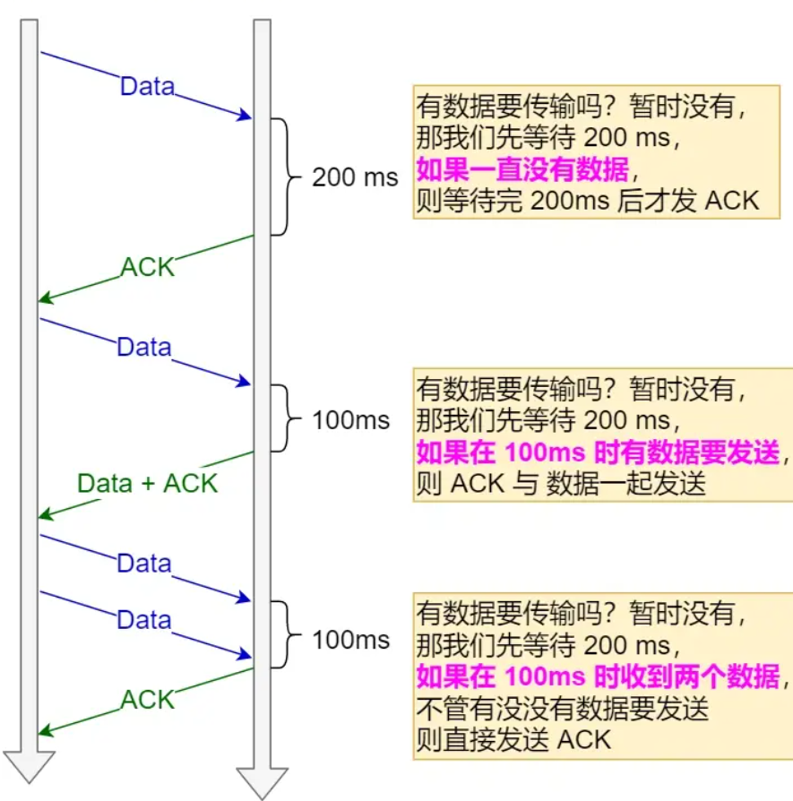

- 当**没有响应数据**要发送时，**ACK 将会延迟一段时间**，以等待是否有响应数据可以一起发送
- 当**有响应数据要发送时**，ACK 会**随着响应数据一起立刻发送**给对方
- 如果在延迟**等待发送 ACK 期间**，对方的**第二个数据报文又到达**了，这时就会**立刻发送 ACK 响应**。

## TCP 心跳/保活机制

TCP 心跳机制（保活机制）：定义一个时间段，**在这个时间段内，如果没有任何连接相关的活动**，TCP 保活机制会开始作用，**每隔一个时间间隔**，发送一个**探测报文**，该探测报文包含的数据非常少，**如果连续几个探测报文都没有得到响应，则认为当前的 TCP 连接已经死亡**，系统内核将错误信息通知给上层应用程序。

## TCP 如何保证可靠性

**TCP 只保证传输层的消息可靠性，并不保证应用层的消息可靠性**。如果我们还想保证应用层的消息可靠性，就需要应用层自己去实现逻辑做保证。

1. **基于数据块传输** ：应用数据被分割成 TCP 认为最适合发送的数据块，再传输给网络层，数据块被称为报文段或段。
2. **对失序数据包重新排序以及去重**：TCP 为了保证不发生丢包，就给每个包一个序列号，有了序列号能够将接收到的数据根据序列号排序，并且去掉重复序列号的数据就可以实现数据包去重。
3. **校验和** : TCP 将**保持它首部和数据的检验和**。这是一个端到端的检验和，目的是检测数据在传输过程中的任何变化。如果收到段的检验和有差错，TCP 将丢弃这个报文段和不确认收到此报文段。
4. **超时重传** : 当发送方发送数据之后，它启动一个定时器，等待目的端确认收到这个报文段。接收端实体对已成功收到的包发回一个相应的确认信息（ACK）。如果发送端实体在合理的往返时延（RTT）内未收到确认消息，那么对应的数据包就被假设为已丢失并进行重传。
5. **流量控制** : TCP 连接的每一方都有固定大小的缓冲空间，TCP 的接收端只允许发送端发送接收端缓冲区能接纳的数据。TCP 使用的流量控制协议是可变大小的滑动窗口协议（**TCP 利用滑动窗口实现流量控制**）。
6. **拥塞控制** : 当网络拥塞时，减少数据的发送。

### 重传机制

**超时重传**：在发送数据时，设定一个定时器，当超过指定的时间后，没有收到对方的 `ACK`​ 确认应答报文，就会重发该数据，也就是我们常说的**超时重传**。没收到可能是因为发送的数据包丢失，也可能是确认应答丢失。超时重传的时间**略大于**报文往返的时间 RTT。

**快速重传**：当收到**三个相同的 ACK 报文**时，会在定时器过期之前，**重传丢失的报文段**。

**SACK（选择性确认），** 在 TCP 头部「选项」字段里加一个 `SACK`​ 字段，它**可以将已收到的数据信息发送给发送方**，这样发送方就可以知道哪些数据收到了，哪些数据没收到，知道了这些信息，就可以**只重传丢失的数据**。

**Duplicate SACK** 又称 ​​ **D-SACK**​，它主要是**使用了 SACK 来告诉「发送方」有哪些数据被重复接收了**。

### 流量控制

**流量控制是为了控制发送方发送速率，保证接收方来得及接收。**

**接收方发送的确认报文中的 TCP 头部 Window 窗口字段可以用来控制发送方窗口大小**，从而影响发送方的发送速率。这个字段是**接收端**告诉发送端自己还有多少缓冲区可以接收数据。

### 拥塞控制

拥塞控制用于避免网路拥塞，**避免「发送方」的数据填满整个网络**。而流量控制是避免「发送方」的数据填满「接收方」的缓存。（当**没有收到 ACK 回复**，也就是**发生了超时重传，就会认为网络出现了拥塞。**）

TCP 定义了一个**拥塞窗口 cwnd，** 它是发送方维护的一个的状态变量，会根据**网络的拥塞程度动态变化**。（发送窗口的值是拥塞窗口和接收窗口中的最小值。）

主要用到四个算法：

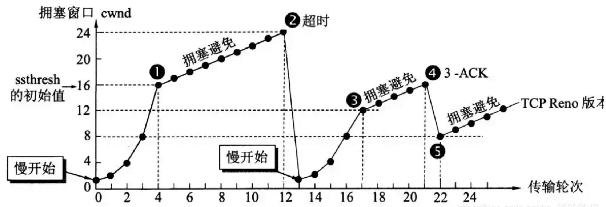

1.**慢启动**：拥塞窗口 cwnd 初始为 1，当发送方**每收到一个 ACK**，cwnd 就会**加 1**。（拥塞窗口呈**指数型增长**）

2.**拥塞避免算法**：当 `cwnd`​ **超过慢启动门限** `ssthresh`​ （65535 字节）就会进入拥塞避免算法。**每当收到一个 ACK 时，cwnd 增加 1/cwnd。**（呈**线性增长**）

3.**超时重传**的恢复算法：发生超时重传时会**重新开始慢启动**，**慢启动门限设为 cwnd 的一半**，cwnd 重置为**1**。

4.**快重传的快速恢复**算法：**慢启动门限和 cwnd 都设为原来 cwnd 的一半。然后 cwnd 会先缓慢增加，尽快将丢失的数据包发给目标，收到丢失的数据包的回应后，cwnd 设为慢启动门限开始拥塞避免算法。**

## 详细讲一下 TCP 的滑动窗口？

在进行数据传输时，如果传输的数据比较大，就需要拆分为多个数据包进行发送。TCP 协议需要对数据进行确认后，才可以发送下一个数据包。这样一来，就会在等待确认应答包环节浪费时间。

为了避免这种情况，TCP 引入了窗口概念。窗口大小指的是不需要等待确认应答包而可以继续发送数据包的最大值。


从上面的图可以看到滑动窗口左边的是已发送并且被确认的分组，滑动窗口右边是还没有轮到的分组。

滑动窗口里面也分为两块，一块是已经发送但是未被确认的分组，另一块是窗口内等待发送的分组。随着已发送的分组不断被确认，窗口内等待发送的分组也会不断被发送。整个窗口就会往右移动，让还没轮到的分组进入窗口内。

可以看到滑动窗口起到了一个**限流的作用**，也就是说当前滑动窗口的大小**决定了当前 TCP 发送包的速率**，而滑动窗口的大小**取决于拥塞控制窗口和流量控制窗口的两者间的最小值**。

## TCP 粘包

当两个消息的某个部分内容被分到同一个 TCP 报文时，这时**接收方不知道消息的边界**的话，是无法读出有效的消息，也就是我们常说的 TCP 粘包问题。

**发送方原因**：客户端与服务器保持⻓连接的状态，双⽅在连接不断开的情况下，可以⼀直传输数据。但当发送的数据包过于的⼩时，那么 TCP 协议默认的会启⽤ Nagle 算法，将较小的数据包进⾏合并发送，这个合并过程是在发送缓冲区中进⾏的，也就是数据发送出来时它已经是粘包的状态了。

**接收方原因**：接收方采⽤ TCP 协议接收数据时的过程是这样的：数据到达接收⽅，传输层的 TCP 协议是将其放置接收缓冲区，然后由应⽤层来主动获取；当我们在程序中调⽤的读取数据函数不能及时的把缓冲区中的数据拿出来，⽽下⼀个数据⼜到来并有⼀部分放⼊的缓冲区末尾，等我们读取数据时就会发生粘包。（放数据的速度 > 应⽤层拿数据速度）

**解决方法**：

1.**固定长度的消息**：每个用户消息都是固定长度的，比如规定一个消息的长度，当接收方接满 这个长度，就认为这个内容是一个完整且有效的消息。

2.**特殊字符作为边界**：我们可以在两个用户消息之间插入一个特殊的字符串，这样接收方在接收数据时，读到了这个特殊字符，就把认为已经读完一个完整的消息。（如果消息内容里有这个特殊字符，我们要对这个特殊字符进行转义）

3.**自定义消息结构**：可以自定义一个消息结构，由包头和数据组成，其中包头包是固定大小的，而且包头里有一个字段来说明紧随其后的数据有多大。

## UDP，头部格式

**用户数据协议 UDP**（User Datagram Protocol），提供**无连接**的，尽最大努力的数据传输服务，**不保证数据传输的可靠性**。

**头部格式**包括：

- **目标和源端口**：主要是告诉 UDP 协议应该把报文发给哪个进程。

- **包长度**：该字段保存了 UDP 首部的长度跟数据的长度之和。

- **校验和**：校验和是为了提供可靠的 UDP 首部和数据而设计，防止收到在网络传输中受损的 UDP 包。

## TCP 和 UDP 区别

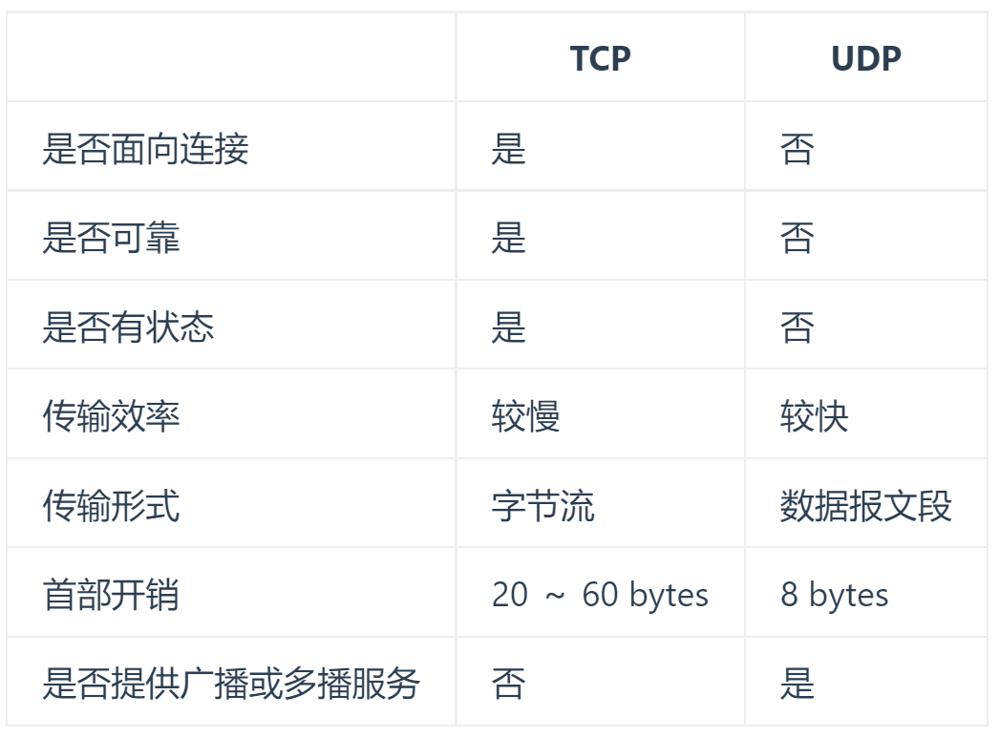

1. **面向连接**：TCP 是面向连接的传输层协议，传输数据前先要建立连接。UDP 是不需要连接，即刻传输数据。
2. **服务对象**：TCP 是一对一的两点服务，即一条连接只有两个端点。UDP 支持一对一、一对多、多对多的交互通信
3. **可靠性**：TCP 是可靠交付数据的，数据可以无差错、不丢失、不重复、按需到达。UDP 是尽最大努力交付，不保证可靠交付数据。
4. **拥塞控制、流量控制**
   - TCP 有拥塞控制和流量控制机制，保证数据传输的安全性。
   - UDP 则没有，即使网络非常拥堵了，也不会影响 UDP 的发送速率。
5. **首部开销**
   - TCP 首部长度较长，会有一定的开销，**首部在没有使用「选项」字段时是 `20`​ 个字节**，如果使用了「选项」字段则会变长的。
   - UDP 首部只有 **8 个字节**，并且是固定不变的，开销较小。
6. **传输方式**
   - **TCP 是流式传输，没有边界**，但保证顺序和可靠。（一个包不能对应一个用户消息）
   - **UDP 是一个包一个包的发送，是有边界的**，但可能会丢包和乱序。（一个包就是一个用户消息）
7. **分片不同**
   - TCP 的数据大小如果大于 MSS 大小，则会在传输层进行分片，目标主机收到后，也同样在传输层组装 TCP 数据包，如果中途丢失了一个分片，只需要传输丢失的这个分片。
   - UDP 的数据大小如果大于 MTU 大小，则会在 IP 层进行分片，目标主机收到后，在 IP 层组装完数据，接着再传给传输层。

## TCP 和 UDP 应用场景

由于 TCP 是**面向连接**，能保证数据的**可靠性交付**，因此经常用于：

- `FTP`​ 文件传输；
- HTTP / HTTPS；
  由于 UDP **面向无连接**，它可以**随时发送数据**，再加上 UDP 本身的处理**既简单又高效**，因此经常用于：
- **包总量较少**的通信，如 `DNS`​ 、`SNMP`​ 等；
- **视频、音频**等多媒体通信；
- **广播通信**；

# 网络层 IP

MAC 的作用则是实现「直连」的**两个设备**之间通信（局域网中），而 IP 则负责在「没有直连」的**两个网络**之间进行通信传输。（**源 IP 地址和目标 IP 地址在传输过程中是不会变化的，只有源 MAC 地址和目标 MAC 一直在变化。**）

## IPv4

IP 地址（IPv4 地址）由 `32`​ 位正整数来表示，IP 地址在计算机是以二进制的方式处理的。而人类为了方便记忆采用了**点分十进制**的标记方式，也就是将 **32 位 IP 地址**以**每 8 位为组**，共分为 `4`​ 组，每组以「`.`​」隔开，再将每组转换成十进制。

IP 地址分类成了 5 种类型。
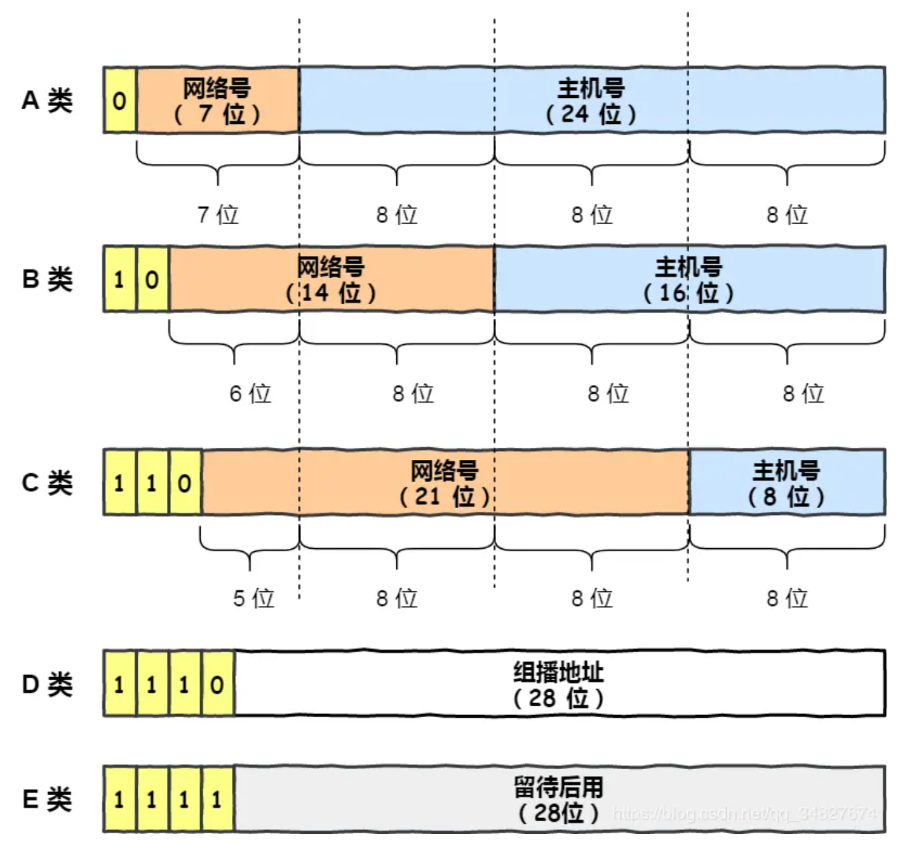

**无分类地址 CIDR**：表示形式 `a.b.c.d/x`​，其中 `/x`​ 表示前 x 位属于**网络号**， x 的范围是 `0 ~ 32`​，这就使得 IP 地址更加具有灵活性。

**公有 IP 和私有 IP**

公有 IP 不能重复，私有 IP 可以重复。

本机 IP 地址：**127.0.0.1**

**路由控制**：在发送 IP 包时，首先要确定 IP 包首部中的目标地址，再从**路由控制表**中（主机和路由器中）找到与该地址具有**相同网络地址**的记录，根据该记录将 IP 包转发给相应的下一个路由器。如果路由控制表中存在多条相同网络地址的记录，就选择相同位数最多的网络地址，也就是最长匹配。

## IPv6

IPv6 是 128 位。是以**每 16 位作为一组**，每组用冒号 「:」 隔开。

IPv6 相比 IPv4 的首部改进：

- **取消了首部校验和字段。** 因为在数据链路层和传输层都会校验，因此 IPv6 直接取消了 IP 的校验。
- **取消了分片/重新组装相关字段。** 分片与重组是耗时的过程，IPv6 不允许在中间路由器进行分片与重组，这种操作只能在源与目标主机，这将大大提高了路由器转发的速度。
- **取消选项字段。** 选项字段不再是标准 IP 首部的一部分了，但它并没有消失，而是可能出现在 IPv6 首部中的「下一个首部」指出的位置上。删除该选项字段使的 IPv6 的首部成为固定长度的 `40`​ 字节。

**接收端如何分辨 IPv4 和 IPv6**

IP 包头中包含**版本号**的字段，通过这个字段分辨。

## IP 协议相关技术

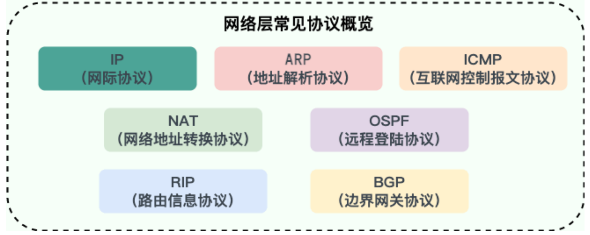

**ARP**（地址解析协议）：由主机的路由表中可以找到下一跳的 IP 地址，所以可以通过 **ARP 协议**，求得下一跳的 MAC 地址。（通过广播发送 ARP 请求实现）

**RARP**则是已知 MAC 地址求 IP 地址。

**DHCP**（动态主机配置协议）：通过 DHCP 可以动态获取 IP 地址，大大省去了配 IP 信息繁琐的过程。

**NAT**（网络地址转换）：对外通信时，把私有 IP 地址转换成公有 IP 地址。不同的私有 IP 都转换成为相同的公有 IP，但是以不同的端口号作为区分。

**ICMP**（互联网控制报文协议）：**确认 IP 包是否成功送达目标地址、报告发送过程中 IP 包被废弃的原因和改善网络设置等。**（ping 命令基于这个协议）

ICMP 大致可以分为两大类：

- 一类是用于诊断的查询消息，也就是「**查询报文类型**」
- 另一类是通知出错原因的错误消息，也就是「**差错报文类型**」

‍
