## Java特点

1. 面向对象（封装，继承，多态）；
2. 平台无关性（ Java 虚拟机实现平台无关性）；实现一次编译，随处运行。
3. 编译与解释并存；
4. 可靠性、安全性；
5. 支持多线程。C++ 语言没有内置的多线程机制，因此必须调用操作系统的多线程功能来进行多线程程序设计，而 Java 语言却提供了多线程支持；
6. 支持网络编程并且很方便。Java 语言诞生本身就是为简化网络编程设计的，因此 Java 语言不仅支持网络编程而且很方便；

## Java和c++区别

- 都是**面向对象**的语言，都支持**封装、继承和多态**；
- Java 是**完全面向对象**的语言，并且还**取消了 C/C++ 中的结构和联合**，使编译程序更加简洁；
- Java 不提供**指针**来直接访问内存，程序内存更加安全
- Java 有**自动内存管理垃圾回收机制(GC)**，不需要程序员手动释放无用内存，而 C++ 中必须由程序释放内存资源。
- C++同时支持**方法重载**和**操作符重载**，但是 **Java 只支持方法重载**。
- Java **不支持缺省参数函数**，而 C++ 支持；
- Java **不支持** C++ 中的**自动强制类型转换**，如果需要，必须由程序**显式进行强制类型转换**。
- C 和 C++ **不支持字符串变量**，在 C 和 C++ 程序中使用“Null”终止符代表字符串的结束。在 Java 中字符串是用类对象（**String 和 StringBuffer**）来实现的；

## JDK、JRE、JVM

**JDK**：Java Development Kit的缩写，它是功能齐全的 Java SDK。它**拥有 JRE 所拥有的一切**，还有**编译器（javac）** 和**工具（如 javadoc 和 jdb）**。它能够**创建和编译程序**。

**JRE**：是Java Runtime Environment缩写，它**是运行已编译 Java 程序所需的所有内容的集合**，包括 **Java 虚拟机（JVM），Java 类库，java 命令和其他的一些基础构件**。但是，它**不能用于创建新程序**。

**JVM**：Java 虚拟机（JVM）是**运行 Java 字节码的虚拟机**。JVM 有针对不同系统的特定实现，目的是使用相同的字节码，它们都会给出相同的结果。字节码和不同系统的 JVM 实现是 Java 语言“一次编译，随处可以运行”的关键所在。

**JDK包含JRE，JRE包含JVM。**
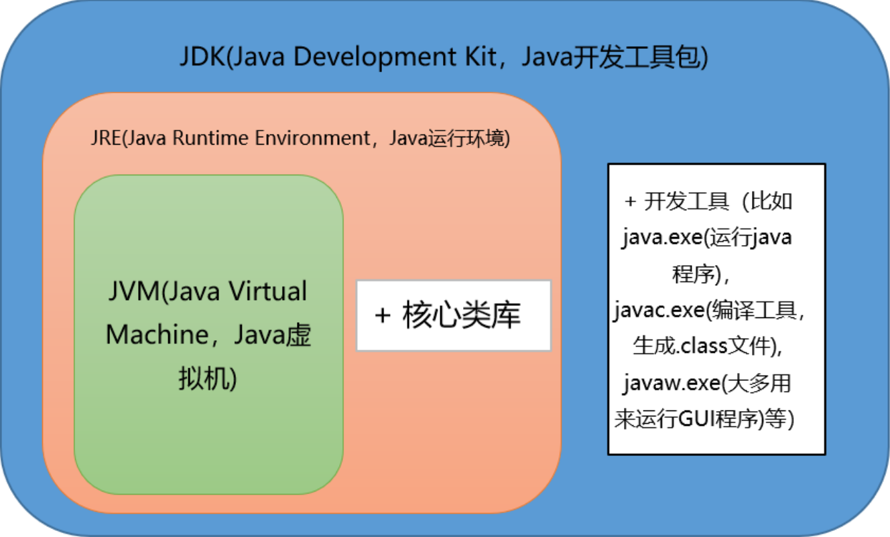
**JIT编译**：运行时编译。编译一些热点代码。当 JIT 编译器完成第一次编译后，其会将字节码对应的机器码保存下来，下次可以直接使用。

**AOT编译**：它是直接将字节码编译成机器码。

## 什么是字节码，Java是编译执行还是解释执行

> 这个问题，面试官可以扩展提问，Java 是**编译执行**的语言，还是**解释执行**的语言?

Java之所以可以“**一次编译，到处运行**”，一是因为JVM针对各种操作系统、平台都进行了定制，二是因为无论在什么平台，都可以编译生成固定格式的字节码（.class文件）供JVM使用。

之所以被称之为字节码，是因为字节码文件由十六进制值组成，而**JVM以两个十六进制值为一组，即以字节为单位进行读取**。在Java中一般是用**javac 命令编译源代码为字节码文件**，一个.java文件从编译到运行的示例如图所示。

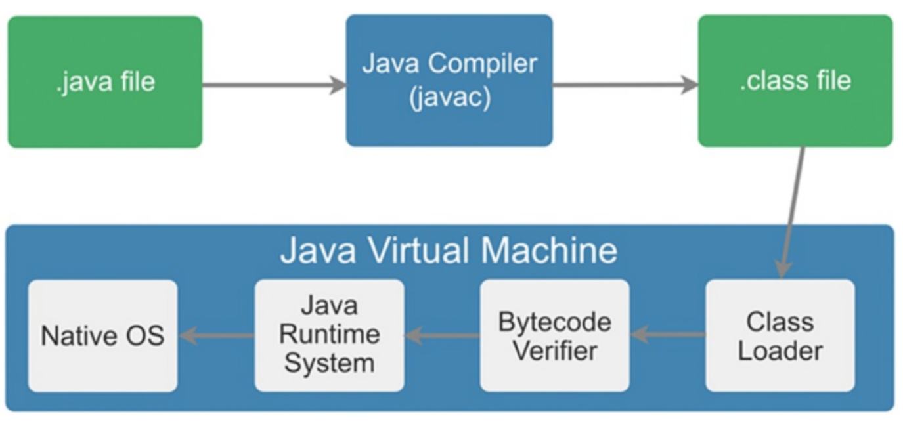

**采用字节码的好处是什么?**

Java语言通过字节码的方式，在一定程度上**解决了传统解释型语言执行效率低的问题，同时又保留了解释型语言可移植的特点**。所以Java程序**运行时比较高效**，而且，由于字节码并不专对一种特定的机器，因此，Java程序**无须重新编译便可在多种不同的计算机上运行**。

## OracleJDK和OpenJDK

* Oracle JDK 版本将**每三年**发布一次，而 OpenJDK 版本**每三个月**发布一次；
* OpenJDK 是一个参考模型并且是**完全开源**的，而 Oracle JDK 是OpenJDK 的一个实现，并**不是完全开源**的；
* **Oracle JDK 比 OpenJDK 更稳定**。OpenJDK 和 Oracle JDK 的代码几乎相同，但 **Oracle JDK 有更多的类和一些错误修复**。
* 在**响应性和 JVM 性能方面**，Oracle JDK 与 OpenJDK 相比提供了**更好的性能**；
* Oracle JDK 不会为即将发布的版本提供长期支持，用户每次都必须通过更新到最新版本获得支持来获取最新版本；
* Oracle JDK 根据**二进制代码许可协议**获得许可，而 OpenJDK 根据 **GPLv2 许可**获得许可。

## 关键字


| 分类         | 关键字        |           |              |           |            |           |        |       |
|:----------:|:----------:|:---------:|:------------:|:---------:|:----------:|:---------:|:------:|:-----:|
| 访问控制       | private    | protected | public       |           |            |           |        |       |
| 类，方法和变量修饰符 | abstract   | class     | extends      | final     | implements | interface | native | new   |
|            | static     | strictfp  | synchronized | transient | volatile   | enum      |        |       |
| 程序控制       | break      | continue  | return       | do        | while      | if        | else   | for   |
|            | instanceof | switch    | case         | default   | assert     |           |        |       |
| 错误处理       | try        | catch     | throw        | throws    | finally    |           |        |       |
| 包相关        | import     | package   |              |           |            |           |        |       |
| 基本类型       | boolean    | byte      | char         | double    | float      | int       | long   | short |
| 变量引用       | super      | this      | void         |           |            |           |        |       |
| 保留字        | goto       | const     |              |           |            |           |        |       |

instanceof：判断一个对象是否为一个类的实例。编译器会检查 obj 是否能转换成右边的class类型，如果不能转换则直接报错，如果不能确定类型，则通过编译，具体看运行时定。

## final、finally、finalize

**final** 用于修饰**变量**、**方法**和**类**。

- **final 变量**：被修饰的变量不可变，不可变分为`引用不可变`和`对象不可变`，final 指的是`引用不可变`，final 修饰的变量必须初始化，通常称被修饰的变量为`常量`。

  - 对于**基本类型**，final保证其**值不变**；
  - 对于**引用类型**，final保证其**引用不变**，但**引用的对象内容可以变**。
  - 要想实现引用的**对象内容不变**，需要**对象本身是不可变的**(如**String**)，或者设计为只能通过特定的方式进行修改。

  ```java
  final int num = 10;
  // num = 20; //编译错误，因为num是final的，不能改变其值
  
  final List<Integer> list = new ArrayList<>();
  // list = new LinkedList<>(); // 导致编译错误，因为list是final的，不能再指向其他对象
  list.add(1); // 但是可以改变list所指向的对象的内容
  
  final String str = "Hello";
  // str = "World"; // 编译错误，因为str是final的，不能再指向其他对象
  // str.concat(" World"); // 此操作并不会改变str所指向的String对象的内容，而是创建了一个新的String对象
  ```
- **final 方法**：被修饰的方法**不允许任何子类重写**，子类可以使用该方法。
- **final 类**：被修饰的类**不能被继承，所有方法不能被重写**。

**finally** 作为异常处理的一部分，它**只能用在 `try/catch` 语句中**，最终一定被执行（无论是否抛出异常），经常被用在需要释放资源的情况下，**`System.exit (0)` 可以阻断 finally 执行。**

**finalize** 是在 **`java.lang.Object`** 里定义的方法，也就是说**每一个对象都有这么个方法**，这个方法**在GC时启动，该对象被回收的时候被调用。**

**一个对象的 finalize 方法只会被调用一次，finalize 被调用不一定会立即回收该对象**，所以有可能调用 finalize 后，该对象又不需要被回收了，然后到了真正要被回收的时候，因为前面调用过一次，所以不会再次调用 finalize 了，进而产生问题，因此**不推荐使用 finalize 方法**。

## static 关键字

### 代码块执行顺序

基本上代码块分为三种：Static静态代码块、构造代码块、普通代码块

代码块执行顺序**静态代码块——> 构造代码块 ——> 构造函数——> 普通代码块** 

继承中代码块执行顺序：**父类静态块——>子类静态块——>父类代码块——>父类构造器——>子类代码块——>子类构造器**
### **为什么要用static关键字？** 

 通常来说，用new创建类的对象时，数据存储空间才被分配，方法才供外界调用。但**有时我们只想为特定域分配单一存储空间，不考虑要创建多少对象或者说根本就不创建任何对象的情况下也想调用方法**，static关键字，满足了我们的需求。

### 不可以覆盖/override一个private/static方法

“static”关键字表明一个成员变量或者是成员方法可以在没有所属的类的实例变量的情况下被访问。

**static方法不能被覆盖**，因为**方法覆盖是基于运行时动态绑定的，而static方法是编译时静态绑定的**。**static方法跟类的任何实例都不相关**。

### 不能在static环境中访问非static变量

**不能**，static变量在Java中是属于类的，它在所有的实例中的值是一样的。当类被Java虚拟机载入的时候，会对static变量进行初始化。如果你的代码尝试不用实例来访问非static的变量，编译器会报错，因为这些变量还没有被创建出来，还没有跟任何实例关联上。

**static方法能不能引用非静态资源？**

**不能**，new的时候才会产生的东西，对于初始化后就存在的静态资源来说，根本不认识它。

static方法可以引用静态资源：因为都是类初始化的时候加载的，大家相互都认识。

## 权限修饰符

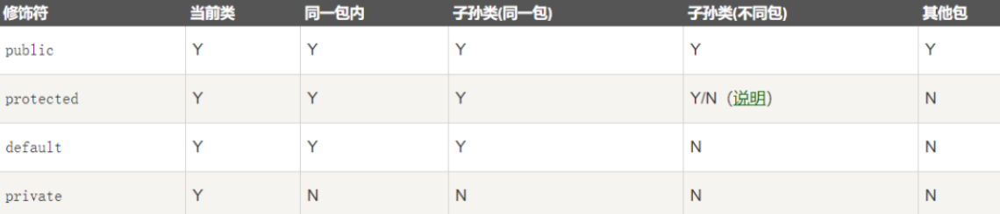

- **default** (即默认，什么也不写）: 在同一包内可见，不使用任何修饰符。使用对象：类、接口、变量、方法。
- **private** : 在同一类内可见。使用对象：变量、方法。 **注意：不能修饰类（外部类）**
- **public** : 对所有类可见。使用对象：类、接口、变量、方法
- **protected** : 对同一包内的类和所有子类可见。使用对象：变量、方法。 **注意：不能修饰类（外部类）**。

## break ,continue ,return

* break 跳出总上一层循环，不再执行循环(**结束当前的循环体**)
* continue 跳出本次循环，继续执行下次循环(**结束正在执行的循环 进入下一个循环条件**)
* return 程序返回，不再执行下面的代码(**结束当前的方法 直接返回**)

## 数据类型

分为两种：**基本数据类型**和**引用数据类型**。
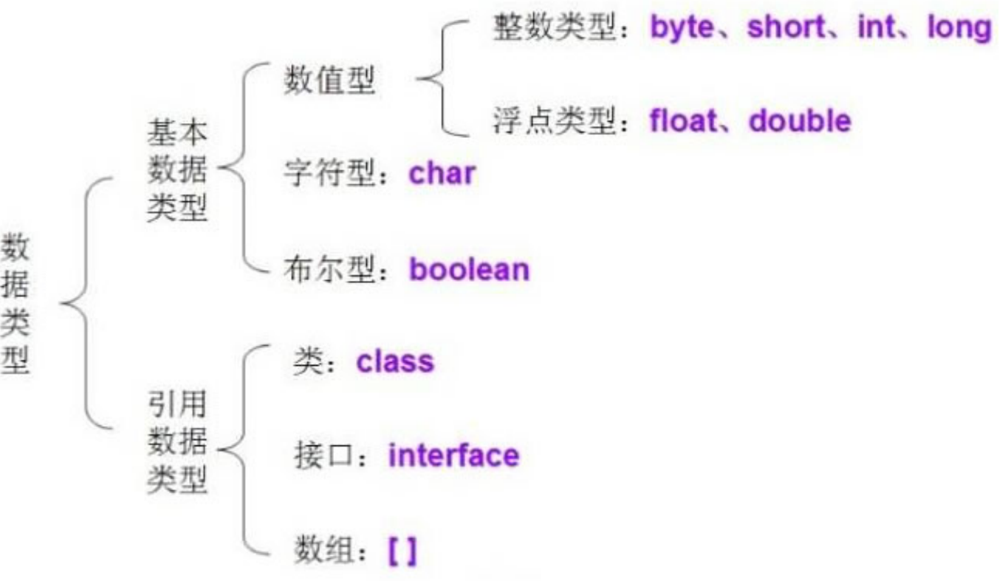


| 8种基本类型 | 位数 | 字节 | 默认值       |
| ----------- | ---- | ---- | :----------- |
| byte        | 8    | 1    | 0            |
| short       | 16   | 2    | 0            |
| int         | 32   | 4    | 0            |
| long        | 64   | 8    | 0L           |
| float       | 32   | 4    | 0f           |
| double      | 64   | 8    | 0d           |
| char        | 16   | 2    | 'u0000' |
| boolean     | 32/8 | 4/1  | false        |

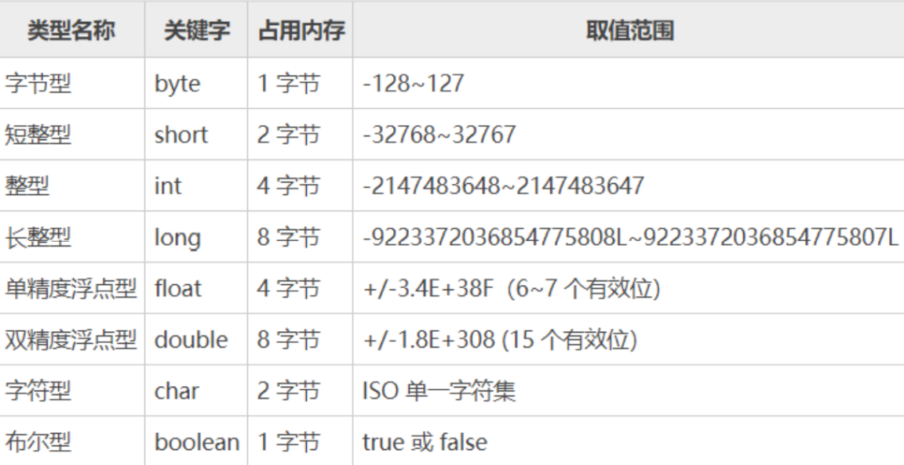

对于 boolean，官方文档未明确定义，它依赖于 JVM 厂商的具体实现。**逻辑上理解是占用 1 位**，但是实际中会考虑计算机高效存储因素。

Java虚拟机规范讲到：在JVM中并没有提供boolean专用的字节码指令，而boolean类型数据在经过**编译后在JVM中会通过int类型**来表示，**占4字节32位**，而**boolean数组**将会被编码成Java虚拟机的**byte数组，1字节占8bit**。

**引用数据类型**建立在基本数据类型的基础上，包括**数组、类和接口**。引用数据类型是由用户自定义，用来限制其他数据的类型。另外，Java 语言中不支持 C++中的指针类型、结构类型、联合类型和枚举类型。

### 包装类型

包装类型：Boolean，Character，Byte，Short，Integer，Long，Float，Double

**基本类型和包装类型的区别主要有以下几点**：

* **包装类型可以为 null，而基本类型不可以**。它使得包装类型可以应用于 POJO 中，而基本类型则不行。那为什么 POJO 的属性必须要用包装类型呢？《阿里巴巴 Java 开发手册》上有详细的说明， 数据库的查询结果可能是 null，如果使用基本类型的话，因为要自动拆箱（将包装类型转为基本类型，比如说把 Integer 对象转换成 int 值），就会抛出 `NullPointerException` 的异常。

* **包装类型可用于泛型，而基本类型不可以**。

  ```java
  List<int> list = new ArrayList<>(); // 会编译出错，提示 Syntax error, insert "Dimensions" to complete ReferenceType
  List<Integer> list = new ArrayList<>();
  ```

  因为泛型在编译时会进行类型擦除，最后只保留原始类型，而原始类型只能是 Object 类及其子类——基本类型是个特例。

* **基本类型比包装类型更高效**。**基本类型在栈中直接存储的具体数值**，而**包装类型则存储的是堆中的引用**。 很显然，相比较于基本类型而言，**包装类型需要占用更多的内存空间**。

### 自动装箱拆箱

- `Integer i = 10` 等价于 `Integer i = Integer.valueOf(10)`
- `int n = i` 等价于 `int n = i.intValue()`;

自动装箱和拆箱发生在**编译期**。

### int和Integer有什么区别?

- Integer是int的包装类；int是基本数据类型；
- Integer变量必须实例化后才能使用；int变量不需要；
- Integer实际是对象的引用，指向此new的Integer对象；int是直接存储数据值 ；
- Integer的默认值是**null**；int的默认值是**0**。

```java
//自动装箱拆箱
int a = 10000;
Integer b = new Integer(10000);
Integer c=10000;
System.out.println(a == b); // true
System.out.println(a == c); // true
```

非new生成的Integer变量和new Integer()生成变量的对比：

```java
Integer b=10000;//常量池中的对象
Integer c = new Integer(10000);//堆中新建的对象
System.out.println(b == c); // false
```

两个非new生成的Integer对象的对比：

```java
Integer i = 100;
Integer j = 100;//-128 ~ 127之间，自动装箱
System.out.print(i == j); //true
Integer i = 128;
Integer j = 128;//-128 ~ 127之外，在堆中new出一个对象来存储
System.out.print(i == j); //false
```

### switch(byte/String/long)？

- 基本数据类型：byte, short, char, int
- 包装数据类型：Byte, Short, Character, Integer
- 枚举类型：Enum(java5开始)
- 字符串类型：String（Jdk 7+ 开始支持）
**长整型(long)在目前所有的版本中都是不可以的**。

## 面向对象和面向过程

主要区别在于**解决问题的方式不同**：

- 面向过程**把解决问题的过程拆成一个个方法**，通过一个个方法的执行解决问题。（注重**步骤**）
- 面向对象会**先抽象出对象，然后用对象执行方法的方式解决问题**。（注重**对象的行为**）

面向对象开发的程序一般更**易维护、易复用、易扩展**。可以设计出**低耦合**的系统。 但是**性能上比面向过程要低**。

## 三大特性/封装/继承/多态

**封装**：把类中的属性声明为private，不允许外部直接访问，而是提供一些方法供外部操作这些属性。

**继承**：是使用已存在的类的定义作为**基础**建立新类的技术，新类的定义可以增加新的数据或新的功能，也可以用父类的功能，但不能选择性地继承父类。通过使用继承，可以快速地创建新的类，可以提高代码的重用，程序的可维护性，节省大量创建新类的时间 ，提高我们的开发效率。
1. 子类拥有父类对象所有的属性和方法（包括私有属性和私有方法），但是父类中的私有属性和方法子类是**无法访问**，**只是拥有**。
2. 子类可以拥有自己属性和方法，即子类可以对父类进行扩展。

**多态**：一个对象具有多种的状态。
**编译时多态**：
	方法的**重载**就是编译时多态的一个例子，编译时多态在编译时就已经确定，运行的时候调用的是确定的方法。
**运行时多态**：
	父类的引用指向子类的实例(向上转型)。然后通过引用调用父类子类中都有的方法。（方法的重写）**我们通常所说的多态指的都是运行时多态，也就是编译时不确定究竟调用哪个具体方法，一直延迟到运行时才能确定。** 这也是为什么有时候**多态方法**又被称为**延迟方法**的原因。
	Java实现多态有3个必要条件：继承、重写和向上转型。只有满足这3个条件，才能够在同一个继承结构中使用统一的逻辑实现代码处理不同的对象，从而执行不同的行为。
	**继承**：在多态中必须存在有继承关系的子类和父类。
	**重写**：子类对父类中某些方法进行重新定义，在调用这些方法时就会调用子类的方法。
	**向上转型**：在多态中需要将子类的引用赋给父类对象，只有这样该引用才既能可以调用父类的方法，又能调用子类的方法。
## 重载，重写

**重载**发生在**编译期**，是一个类中**多态性**的一种表现，发生在**同一个类中**（或者**父子类之间**），**方法名必须相同**，**参数类型**不同、**个数**不同、**顺序**不同，方法返回值（可以同，也可以不同）和访问修饰符可以不同。（会**优先匹配固定参数**的方法**而不是可变长参数**的方法）

**重写**发生在**运行期**，是**子类对父类的允许访问的方法的重新编写**。（逻辑修改，扩展）

1. **方法名、参数列表必须相同**，子类方法**返回值类型**应比父类方法返回值类型**更小或相等**（void和基本数据类型不能改变），抛出的**异常范围小于等于**父类，访问**修饰符范围大于等于**父类。（public>protected>default>private) （两小一大）
2. **不能重写父类private/final/static**修饰符方法，**但是被 `static` 修饰的方法能够被再次声明**。
3. **构造方法无法被重写，但可以被重载**。

## 抽象类和接口的区别

**共同点** ：
- 都不能被实例化。
- 都可以包含抽象方法。
- 都可以有默认实现的方法（Java 8 可以用 `default` 关键字在接口中定义默认方法）。

**接口包含内容：**
- java7 变量（全局常量 可以省略public static final），抽象方法
- java8 默认方法 静态方法
- java9 私有方法

**语法层面**上的区别：
* 抽象类可以提供成员方法的实现细节，而接口中只能存在public abstract 方法；
* 抽象类中的成员变量可以是各种类型的，而接口中的成员变量只能是public static final类型的；
* 接口中不能含有静态代码块以及静态方法，而抽象类可以有静态代码块和静态方法；
* 一个类只能继承一个抽象类，而一个类却可以实现多个接口。

**设计层面**上的区别：
* 抽象类是对一种事物的抽象，即对类抽象，而接口是对行为的抽象。抽象类是对整个类整体进行抽象，包括属性、行为，但是接口却是对类局部（行为）进行抽象。
* 设计层面不同，抽象类作为很多子类的父类，它是一种模板式设计。而接口是一种行为规范，它是一种辐射式设计。

## 抽象类能用final修饰吗？

**不能**，定义抽象类**就是让其他类继承的**，如果定义为 final 该类就不能被继承

## 创建对象的方式

​	1.**new**创建新对象 
​	2.通过**反射**机制 
​	3.采用**clone**机制 ：浅拷贝和深拷贝
​	4.通过**序列化机制**：实现Externalizable或者Serializable来实现。

## 不可变对象?好处是什么?

不可变对象指对象一旦被创建,状态就不能再改变,**任何修改都会创建一个新的对象**， 如 **String、Integer及其它包装类**。不可变对象最大的好处是**线程安全**。

## 包含可变对象的不可变对象

当然可以，比如`final Person[] persons = new Persion[]{}`. `persons`是不可变对象的引用，但其数组中的Person实例却是可变的。这种情况下需要特别谨慎，**不要共享可变对象的引用**。这种情况下，**如果数据需要变化时，就返回原对象的一个拷贝**。

## 浅/深/引用拷贝

- **浅拷贝**：浅拷贝会在**堆上创建一个新的对象**（区别于引用拷贝的一点），不过，如果原对象内部的属性是引用类型的话，浅拷贝会直接复制内部对象的引用地址，也就是说拷贝对象和原对象**共用同一个内部对象**。
- **深拷贝** ：深拷贝会**完全复制整个对象**，包括这个对象所包含的**内部**对象。
- **引用拷贝**：就是**两个不同的引用指向同一个对象**，**不会在堆上创建**一个新的对象。

## 值传递和引用传递/为什么说Java中只有值传递？

**值传递**：指的是在方法调用时，传递的参数是按值的拷贝传递，**传递的是值的拷贝**，也就是说传递后就互不相关了。
**引用传递**：指的是在方法调用时，传递的参数是按引用进行传递，其实**传递的是引用的地址，也就是变量所对应的内存空间的地址**。传递的是值的引用，也就是说传递前和传递后都指向同一个引用（**也就是同一个内存空间**）。
**基本类型**作为参数被传递时肯定**是值传递**；**引用类型作为参数被传递时也是值传递，只不过值为对应的引用**。

## 对象相等判断

### == 和 equals

`==`常用于相同的基本数据类型之间的比较，也可用于相同类型的对象之间的比较；

- **基本数据类型**，比较的是**值**是否相等；
- **对象**，比较的是两个**对象的引用**，也就是判断两个对象是否指向了同一块内存区域；

equals方法主要用于两个对象之间，检测一个对象是否等于另一个对象

看一看Object类中equals方法的源码：

```java
public boolean equals(Object obj) {
        return (this == obj);
    }
```

它的作用也是**判断两个对象是否相等**，般有两种使用情况：

* 情况1，类没有覆盖equals()方法。则通过equals()比较该类的两个对象时，等价于通过“ == ”比较这两个对象。
* 情况2，类覆盖了equals()方法。一般，我们都覆盖equals()方法来两个对象的内容相等；若它们的内容相等，则返回true(即，认为这两个对象相等)。

Java语言规范要求equals方法具有以下特性：

- 自反性：对于任意不为null的引用值x，x.equals(x)一定是true。
- 对称性：对于任意不为null的引用值x和y，当且仅当x.equals(y)是true时，y.equals(x)也是true。
- 传递性：对于任意不为null的引用值x、y和z，如果x.equals(y)是true，同时y.equals(z)是true，那么x.equals(z)一定是true。
- 一致性：对于任意不为null的引用值x和y，如果用于equals比较的对象信息没有被修改的话，多次调用时x.equals(y)要么一致地返回true要么一致地返回false。
- 对于任意不为null的引用值x，x.equals(null)返回false。

### hashCode()

hashCode() 的作用是获取哈希码，也称为散列码；它实际上是返回一个int整数。这个哈希码的作用是确定该对象在哈希表中的索引位置。hashCode() 定义在JDK的Object.java中，这就意味着Java中的任何类都包含有hashCode()函数。

散列表存储的是键值对(key-value)，它的特点是：能根据“键”快速的检索出对应的“值”。这其中就利用到了散列码（可以快速找到所需要的对象）。

### 为什么要有 hashCode

**以“HashSet 如何检查重复”为例子来说明为什么要有 hashCode**：

当你把对象加入 HashSet 时，HashSet 会先计算对象的 hashcode 值来判断对象加入的位置，同时也会与其他已经加入的对象的 hashcode 值作比较，如果没有相符的hashcode，HashSet会假设对象没有重复出现。

但是如果发现有相同 hashcode 值的对象，这时会调用 equals()方法来检查 hashcode 相等的对象是否真的相同。如果两者相同，HashSet 就不会让其加入操作成功。如果不同的话，就会重新散列到其他位置。这样我们就大大减少了 equals 的次数，相应就大大提高了执行速度。

### hashCode(),equals()两种方法是什么关系?

要弄清楚这两种方法的关系，就需要对哈希表有一个基本的认识。其基本的结构如下：

![[图集/Pasted image 20230809125002.png|325]]

对于hashcode方法，会返回一个哈希值，哈希值对数组的长度取余后会确定一个存储的下标位置，如图中用数组括起来的第一列。

不同的哈希值取余之后的结果可能是相同的，用equals方法判断是否为相同的对象，不同则在链表中插入。

则有**hashCode()与equals()的相关规定**：

* 如果两个**对象相等**，则**hashcode一定也是相同的**；
* 两个对象相等，对两个对象分别调用equals方法都返回true；
* 两个对象**有相同的hashcode值也不一定是相等的**；

### 为什么重写 equals 方法必须重写 hashcode 方法 ？

判断的时候先根据hashcode进行的判断，相同的情况下再根据equals()方法进行判断。如果只重写了equals方法，而不重写hashcode的方法，会造成hashcode的值不同，而equals()方法判断出来的结果为true。

 在Java中的一些容器中，不允许有两个完全相同的对象，插入的时候，如果判断相同则会进行覆盖。这时候如果只重写了equals（）的方法，而不重写hashcode的方法，Object中hashcode是根据对象的存储地址转换而形成的一个哈希值。这时候就有可能因为没有重写hashcode方法，造成相同的对象散列到不同的位置而造成对象的不能覆盖的问题。

## String

### String,StringBuffer,StringBuilder

**1.可变与不可变**

String是**不可变**的（**String底层的数组是final修饰的**）。每次对 `String` 类型进行改变的时候，都会生成一个**新的** `String` 对象，然后将**指针指向新的** `String` 对象。
**StringBuilder与StringBuffer都继承自AbstractStringBuilder类**，在AbstractStringBuilder中也是使用字符数组保存字符串，这两种对象都是**可变的**。

**2.是否多线程安全**

String中的对象是**不可变的，为常量，显然线程安全**。
**StringBuilder**是**非线程安全**的。
**StringBuffer对方法加了同步锁**或者对调用的方法加了同步锁，所以是**线程安全**的。

```java
@Override  //源码如下
public synchronized StringBuffer append(String str) {
    toStringCache = null;
    super.append(str);
    return this;
}
```

**3.性能**

 **StringBuilder**：性能**高**(10%~15%)，线程不安全。
 **StringBuffer**：加了同步锁synchronized，性能**低**，线程安全。

### String有哪些特性?

* 不变性：String 是只读字符串，是一个典型的 immutable 对象，对它进行任何操作，其实都是创建一个新的对象，再把引用指向该对象。不变模式的主要作用在于当一个对象需要被多线程共享并频繁访问时，可以保证数据的一致性；
* 常量池优化：String 对象创建之后，会在字符串常量池中进行缓存，如果下次创建同样的对象时，会直接返回缓存的引用；
* final：使用 final 来定义 String 类，表示 String 类不能被继承，提高了系统的安全性。

### String为什么设计成不可变

**1.便于实现字符串池（String pool）**

在Java中，由于会大量的使用String常量，如果每一次声明一个String都创建一个String对象，那将会造成极大的空间资源的浪费。Java提出了String pool的概念，在堆中开辟一块存储空间String pool，当初始化一个String变量时，如果该字符串已经存在了，就不会去创建一个新的字符串变量，而是会返回已经存在了的字符串的引用。

```
String a = "Hello world!";
String b = "Hello world!";
```

如果字符串是可变的，某一个字符串变量改变了其值，那么其指向的变量的值也会改变，String pool将不能够实现！

**2.使多线程安全**

在并发场景下，多个线程同时读一个资源，是安全的，不会引发竞争，但对资源进行写操作时是不安全的，不可变对象不能被写，所以保证了多线程的安全。

**3.避免网络安全问题**

在**网络连接和数据库连接中字符串常常作为参数**，例如，**网络连接地址URL，文件路径path，反射机制所需要的String参数**。其不可变性可以保证连接的安全性。**如果字符串是可变的，黑客就有可能改变字符串指向对象的值**，那么会引起很严重的安全问题。

**4.加快字符串处理速度**

由于String是不可变的，**保证了hashcode的唯一性**，于是在**创建对象时其hashcode就可以放心的缓存了，不需要重新计算**。这也就是**Map喜欢将String作为Key的原因**，处理速度要快过其它的键对象。所以HashMap中的键往往都使用String。

总体来说，String不可变的原因要包括 设计考虑，效率优化，以及安全性这三大方面。

### HashMap为啥用String做key 

HashMap 内部实现是**通过 key 的 hashcode 来确定 value 的存储位置**，因为字符串是不可变的，所以**当创建字符串时，它的 hashcode 被缓存下来，不需要再次计算**，所以相比于其他对象更快。

### 字符串常量池

在**jdk6**中，常量池的位置在**永久代（方法区）** 中，此时常量池中存储的是**对象**。

![[图集/image-20230722171034441.png|400]]
在**jdk7**中，常量池的位置**在堆中**，此时，**常量池存储的就是引用了**。

![[图集/image-20230722171011916.png|450]]
在**jdk8**中，**永久代（方法区）被元空间取代了**。

用 **=** 创建字符串只会在**字符串常量池**（**堆内**）中创建。

用**new**创建**在堆中创建对象，并在常量池中创建指向堆中的引用指针**。

## 异常

![[图集/image-20230320155851990.png|475]]

- **`Exception`** :程序本身可以处理的异常，可以通过 `catch` 来进行捕获。`Exception` 又可以分为 **Checked Exception** (受检查异常，**必须处理，不处理则编译不通过**，**IOException**，**FileNotFoundException**) 和 **Unchecked Exception** (不受检查异常，可以不处理，`RuntimeException` 及其子类都统称为非受检查异常，**NullPointerException**，**IndexOutOfBoundsException**)。
- **`Error`** ：`Error` 属于程序无法处理的错误 ，如系统崩溃，内存不足，堆栈溢出等，这些异常发生时，Java 虚拟机（JVM）一般会选择线程终止。

常用方法：
- `String getMessage()`: 返回异常发生时的简要描述
- `String toString()`: 返回异常发生时的详细信息

### JVM是如何处理异常的？

**JVM底层维护了一个异常表，用来捕获异常。**

**在一个方法中如果发生异常，这个方法会创建一个异常对象，并转交给 JVM**，该异常对象包含异常名称，异常描述以及异常发生时应用程序的状态。创建异常对象并转交给 JVM 的过程称为抛出异常。**可能有一系列的方法调用，最终才进入抛出异常的方法，这一系列方法调用的有序列表叫做调用栈**。

**JVM 会顺着调用栈去查找看是否有可以处理异常的代码，如果有，则调用异常处理代码**。如果 JVM **没有找到**可以处理该异常的代码块，JVM 就会**将该异常转交给默认的异常处理器**（默认处理器为 JVM 的一部分），**默认异常处理器打印出异常信息并终止应用程序**。

**异常使用有哪些需要注意**的地方？

- **不要把异常定义为静态变量**，因为这样会导致**异常栈信息错乱**。每次手动抛出异常，我们都需要**手动 new** 一个异常对象抛出。
- 抛出的**异常信息一定要有意义**。
- 建议抛出**更加具体的异常**比如字符串转换为数字格式错误的时候应该抛出`NumberFormatException`而不是其父类`IllegalArgumentException`。
- 使用**日志打印异常**之后就**不要再抛出异常**了（两者**不要同时存在一段代码逻辑中**）

### throw 和 throws 的区别

* **throw 关键字用在方法内部，只能用于抛出一种异常**，用来抛出方法或代码块中的异常，受查异常和非受查异常都可以被抛出。
* **throws 关键字用在方法声明上，可以抛出多个异常，用来标识该方法可能抛出的异常列表**。一个方法用 throws 标识了可能抛出的异常列表，**调用该方法的方法中必须包含可处理异常的代码，否则也要在方法签名中用 throws 关键字声明相应的异常**。

### NoClassDefFoundError和ClassNotFoundException区别？

**NoClassDefFoundError 是一个 Error 类型的异常，是由 JVM 引起的，不应该尝试捕获这个异常**。引起该异常的原因是 **JVM 或 ClassLoader 尝试加载某类时在内存中找不到该类的定义**，该动作发生在运行期间，即编译时该类存在，但是在运行时却找不到了，**可能是编译后被删除了**等原因导致。

**ClassNotFoundException** 是一个**受检查异常**，需要显式地使用 **try-catch** 对其进行捕获和处理，或在方法签名中用 **throws** 关键字进行声明。当使用 **Class.forName, ClassLoader.loadClass 或 ClassLoader.findSystemClass 动态加载类到内存的时候，通过传入的类路径参数没有找到该类，就会抛出该异常**；另一种抛出该异常的可能原因是某个类已经由一个类加载器加载至内存中，另一个加载器又尝试去加载它。

### try-catch-finally中哪个部分可以省略？

**catch 可以省略**。更为严格的说法其实是：**try只适合处理运行时异常**，**try+catch适合处理运行时异常+普通异常**。也就是说，如果你只用try去处理普通异常却不加以catch处理，编译是通不过的，因为编译器硬性规定，普通异常如果选择捕获，则必须用catch显示声明以便进一步处理。而运行时异常在编译时没有如此规定，所以catch可以省略，你加上catch编译器也觉得无可厚非。

理论上，编译器看任何代码都不顺眼，都觉得可能有潜在的问题，所以你即使对所有代码加上try，代码在运行期时也只不过是在正常运行的基础上加一层皮。但是你一旦对一段代码加上try，就等于显示地承诺编译器，对这段代码可能抛出的异常进行捕获而非向上抛出处理。如果是普通异常，编译器要求必须用catch捕获以便进一步处理；如果运行时异常，捕获然后丢弃并且+finally扫尾处理，或者加上catch捕获以便进一步处理。

至于加上finally，则是在不管有没捕获异常，都要进行的“扫尾”处理。

**当try和finally中都有 return 语句时，try 语句块中的 return 语句会被忽略**。这是因为 try 语句中的 return 返回值会先被**暂存在一个本地变量**中，当执行到 finally 语句中的 return 之后，这个本地变量的值就变为了 finally 语句中的 return 返回值。

**finally 之前虚拟机被终止**运行的话，**finally 中的代码就不会被执行**

## 泛型

编译器可以对泛型参数进行检测，并且通过泛型参数可以指定传入的对象类型，其他类型会报错。（项目中自定义返回结果Result< T>）**可以增强代码的可读性以及稳定性**。

泛型一般有三种使用方式:**泛型类**、**泛型接口**、**泛型方法**。

- **泛型类**，实例化泛型类时，必须指定类型。
- **泛型接口**，实现泛型接口的类，可以指定类型，也可以不指定（那这个类就是一个泛型类）。
- **泛型方法**，使用的时候指定类型。

**使用泛型的好处有以下几点**：
1. 编译时期就可以检查出**因 Java 类型不正确导致的异常**，提高 Java 程序的类型安全
2. **使用时直接得到目标类型，消除许多强制类型转换**，所得即所需，这使得代码更加可读，并且减少了出错机会
3. 潜在的性能收益 
   * 由于泛型的实现方式，支持泛型（几乎）不需要 JVM 或类文件更改
   * 所有工作都在编译器中完成
   * 编译器生成的代码跟不使用泛型（和强制类型转换）时所写的代码几乎一致，只是更能确保类型安全而已

### 泛型原理/什么是类型擦除 

泛型是一种语法糖，泛型这种语法糖的基本原理是类型擦除。Java中的泛型基本上都是在编译器这个层次来实现的，也就是说：**泛型只存在于编译阶段，而不存在于运行阶段。** 在编译后的 class 文件中，是没有泛型这个概念的。

**类型擦除：使用泛型的时候加上的类型参数，编译器在编译的时候去掉类型参数。**

```
public class Caculate<T> {
    private T num;
}
```

我们定义了一个泛型类，定义了一个属性成员，该成员的类型是一个泛型类型，这个 T 具体是什么类型，我们也不知道，它只是用于限定类型的。反编译一下这个 Caculate 类：

```
public class Caculate{
    public Caculate(){}
    private Object num;
}
```

发现编译器擦除 Caculate 类后面的两个尖括号，并且将 num 的类型定义为 Object 类型。

那么是不是所有的泛型类型都以 Object 进行擦除呢？大部分情况下，泛型类型都会以 Object 进行替换，而有一种情况则不是。那就是使用到了extends和super语法的有界类型，如：

```
public class Caculate<T extends String> {
    private T num;
}
```

这种情况的泛型类型，num 会被替换为 String 而不再是 Object。这是一个类型限定的语法，它限定 T 是 String 或者 String 的子类，也就是你构建 Caculate 实例的时候只能限定 T 为 String 或者 String 的子类，所以无论你限定 T 为什么类型，String 都是父类，不会出现类型不匹配的问题，于是可以使用 String 进行类型擦除。

实际上编译器会正常的将使用泛型的地方编译并进行类型擦除，然后返回实例。但是除此之外的是，如果构建泛型实例时使用了泛型语法，那么编译器将标记该实例并关注该实例后续所有方法的调用，每次调用前都进行安全检查，非指定类型的方法都不能调用成功。

实际上编译器不仅关注一个泛型方法的调用，它还会为某些返回值为限定的泛型类型的方法进行强制类型转换，由于类型擦除，返回值为泛型类型的方法都会擦除成 Object 类型，当这些方法被调用后，编译器会额外插入一行 checkcast 指令用于强制类型转换。这一个过程就叫做『泛型翻译』。

### 泛型中的限定通配符和非限定通配符

**限定通配符对类型进行了限制**。

- **< ? extends T>确保类型必须是T的子类来设定类型的上界**；例如List< ? extends Number>可以接受List< Integer>或List< Float>。
- **< ? super T>确保类型必须是T的父类来设定类型的下界**；

**非限定通配符 ？,可以用任意类型来替代**。如`List<?>` 的意思是这个集合是一个可以持有任意类型的集合，它可以是`List<A>`，也可以是`List<B>`,或者`List<C>`等等。

### 可以把List`<String>`传递给一个接受List`<Object>`参数的方法吗？

**不可以**。会导致编译错误。因为List< Object>可以存储任何类型的对象包括String, Integer等等，而List< String>却只能用来存储String。　

```java
List<Object> objectList;
List<String> stringList;
objectList = stringList;  //compilation error incompatible types
```

### Array中可以用泛型吗?

**不可以**。因此建议使用 List 来代替 Array，List 可以提供编译期的类型安全保证，而 Array 却不能。

### `ArrayList<String>`与`ArrayList<Integer>`是否相等

```java
ArrayList<String> a = new ArrayList<String>();
ArrayList<Integer> b = new ArrayList<Integer>();
Class c1 = a.getClass();
Class c2 = b.getClass();
System.out.println(c1 == c2); //true
```

**它们的 Class 类型都是一直都是 ArrayList.class**。

那它们声明时指定的 String 和 Integer **体现在类编译的时候。** 当 JVM 进行类编译时，会进行泛型检查，如果一个集合被声明为 String 类型，那么它**往该集合存取数据的时候就会对数据进行判断，从而避免存入或取出错误的数据。**

### ? 和 T

List< T> , 这个 T 是一个形参，可以理解为一个占位符，被使用时，会在程序运行的时候替换成具体的类型，比如替换成String，Integer之类的。

List< ?>, 这个 ？ 是一个实参，这是Java定义的一种特殊类型，比Object更特殊，就像一个影子。比如List< Object>和List< String>是没有父子关系的，这是两个类型；但是List< ?> 是 List< String>的父类。
对于 `List<?> list` 是不可能进行 `list.add(1)` 的，不能对它进行写操作，除了可以 `list.add(null)` 。而对于 List< T>, 却是可以进行写操作的。

？与 T的三个区别：
1. 不关心List里面的元素，或者只需要用到List里面元素的最顶层父元素的方法的时候，可以用List< ?>来简化代码的书写。
2. 两者都可以通过extends来限定一个类型的子集，但是 T 可以 `List<T extends Number & ExtendInterface>` 即限定为多重继承的，？ 却不可以
3. 使用super限定父集的时候，？ 可以， T 不可以

## 反射

Java反射机制就是在**程序运行时动态加载类并获取类的详细信息**，从而**操作类或对象的属性和方法**。**本质是JVM得到class对象之后，再通过class对象进行反编译，从而获取对象的各种信息。**
使用场景：
框架中大量使用了动态代理，而**动态代理就可以用反射实现**。
**注解的实现也用到了反射**。就是基于反射分析类，然后获取到类/属性/方法/方法的参数上的注解，之后去做进一步的处理。
**优点** ： 可以让**代码更加灵活**、为各种框架提供**开箱即用**的功能，提供了**便利**。可与动态编译结合`Class.forName('com.mysql.jdbc.Driver.class');`，加载MySQL的驱动类。
**缺点** ：在**运行时可以分析操作类**，这就增加了**安全问题**。比如可以**无视泛型参数的安全检查**（泛型参数的安全检查发生在编译时）。另外，反射的**性能也要稍差点**，不过实际**影响不大**。

缺点：使用反射性能较低，需要解析字节码，将内存中的对象进行解析。其解决方案是：通过setAccessible(true)关闭JDK的安全检查来提升反射速度；多次创建一个类的实例时，有缓存会快很多；ReflflectASM工具类，通过字节码生成的方式加快反射速度。

### 如何获取反射中的Class对象

1. **Class.forName(“类的全路径”)**；

   ```java
   Class clz = Class.forName("java.lang.String");
   ```

2. **类名.class**。这种方法只适合在编译前就知道操作的 Class。

   ```java
   Class clz = String.class;
   ```

3. **对象名.getClass()**。

   ```java
   String str = new String("Hello");
   Class clz = str.getClass();
   ```

4. **基本类型的包装类，可以调用包装类的Type属性来获得该包装类的Class对象**。

### Java反射API

反射 API 用来生成 JVM 中的类、接口或则对象的信息。

* **Class** 类：反射的核心类，可以获取类的属性，方法等信息。
* **Field** 类：Java.lang.reflec 包中的类，表示类的成员变量，可以用来获取和设置类之中的属性值。
* **Method** 类：Java.lang.reflec 包中的类，表示类的方法，它可以用来获取类中的方法信息或者执行方法。
* **Constructor** 类：Java.lang.reflec 包中的类，表示类的构造方法。

### 反射使用的步骤

```java
//获取想要操作类的Class对象实例
Class clz = Class.forName("com.chenshuyi.api.Apple");
//根据 Class 对象实例获取 Constructor 对象
Constructor appleConstructor = clz.getConstructor();
//使用 Constructor 对象的 newInstance 方法获取反射类对象
Object appleObj = appleConstructor.newInstance();
//如果要调用某一个方法，获取方法的 Method 对象
Method setPriceMethod = clz.getMethod("setPrice", int.class);
//利用 invoke 方法调用方法
setPriceMethod.invoke(appleObj, 14);
Method getPriceMethod = clz.getMethod("getPrice");
System.out.println("Apple Price:" + getPriceMethod.invoke(appleObj));
```

1. 获取想要操作的类的Class对象，这是反射的核心，通过Class对象我们可以任意调用类的方法。
2. 调用 Class 类中的方法，既就是反射的使用阶段。
3. 使用反射 API 来操作这些信息。

具体可以看下面的例子：

```java
public class Apple {
    private int price;
    public int getPrice() {
        return price;
    }
    public void setPrice(int price) {
        this.price = price;
    }
    public static void main(String[] args) throws Exception{
        //正常的调用
        Apple apple = new Apple();
        apple.setPrice(5);
        System.out.println("Apple Price:" + apple.getPrice());
        //使用反射调用
        Class clz = Class.forName("com.chenshuyi.api.Apple");
        Method setPriceMethod = clz.getMethod("setPrice", int.class);
        Constructor appleConstructor = clz.getConstructor();
        Object appleObj = appleConstructor.newInstance();
        setPriceMethod.invoke(appleObj, 14);
        Method getPriceMethod = clz.getMethod("getPrice");
        System.out.println("Apple Price:" + getPriceMethod.invoke(appleObj));
    }
}
```

从代码中可以看到我们使用反射调用了 setPrice 方法，并传递了 14 的值。之后使用反射调用了 getPrice 方法，输出其价格。上面的代码整个的输出结果是：

```
Apple Price:5
Apple Price:14
```

从这个简单的例子可以看出，一般情况下我们使用反射获取一个对象的步骤：

- **获取类的 Class 对象实例**

```
Class clz = Class.forName("com.zhenai.api.Apple");
```

- **根据 Class 对象实例获取 Constructor 对象**

```
Constructor appleConstructor = clz.getConstructor();
```

- **使用 Constructor 对象的 newInstance 方法获取反射类对象**

```
Object appleObj = appleConstructor.newInstance();
```

而**如果要调用某一个方法**，则需要经过下面的步骤：

- **获取方法的 Method 对象**

```
Method setPriceMethod = clz.getMethod("setPrice", int.class);
```

- **利用 invoke 方法调用方法**

```
setPriceMethod.invoke(appleObj, 14);
```

### 为什么引入反射概念？反射机制的应用有哪些？

从 Oracle 官方文档中可以看出，反射主要应用在以下几方面：
- 反射让开发人员可以通过外部类的全路径名创建对象，并使用这些类，实现一些扩展的功能。
- 反射让开发人员可以枚举出类的全部成员，包括构造函数、属性、方法。以帮助开发者写出正确的代码。
- 测试时可以利用反射 API 访问类的私有成员，以保证测试代码覆盖率。

举两个最常见使用反射的例子，来说明反射机制的强大之处：

第一种：**JDBC 的数据库的连接**

在JDBC 的操作中，如果要想进行数据库的连接，则必须按照以上的几步完成

1. **通过Class.forName()加载数据库的驱动程序** （**通过反射加载**，前提是引入相关了Jar包）；
2. 通过 DriverManager 类进行数据库的连接，连接的时候要输入数据库的连接地址、用户名、密码；
3. 通过Connection 接口接收连接。

```java
public class ConnectionJDBC {  
    /** 
     * @param args 
     */  
    //驱动程序就是之前在classpath中配置的JDBC的驱动程序的JAR 包中  
    public static final String DBDRIVER = "com.mysql.jdbc.Driver";  
    //连接地址是由各个数据库生产商单独提供的，所以需要单独记住  
    public static final String DBURL = "jdbc:mysql://localhost:3306/test";  
    //连接数据库的用户名  
    public static final String DBUSER = "root";  
    //连接数据库的密码  
    public static final String DBPASS = "";  
      
    public static void main(String[] args) throws Exception {  
        Connection con = null; //表示数据库的连接对象  
        Class.forName(DBDRIVER); //1、使用CLASS 类加载驱动程序 ,反射机制的体现 
        con = DriverManager.getConnection(DBURL,DBUSER,DBPASS); //2、连接数据库  
        System.out.println(con);  
        con.close(); // 3、关闭数据库  
    }  
```

第二种：**Spring 框架的使用，最经典的就是xml的配置模式**。

Spring 通过 XML 配置模式装载 Bean 的过程：
1. 将程序内所有 XML 或 Properties 配置文件加载入内存中；
2. Java类里面解析xml或properties里面的内容，得到对应实体类的字节码字符串以及相关的属性信息；
3. **使用反射机制，根据这个字符串获得某个类的Class实例**；
4. 动态配置实例的属性。

Spring这样做的好处是：
- 不用每一次都要在代码里面去new或者做其他的事情；
- 以后要改的话直接改配置文件，代码维护起来就很方便了；
- 有时为了适应某些需求，Java类里面不一定能直接调用另外的方法，可以通过反射机制来实现。

模拟 Spring 加载 XML 配置文件：

```java
public class BeanFactory {
       private Map<String, Object> beanMap = new HashMap<String, Object>();
       /**
       * bean工厂的初始化.
       * @param xml xml配置文件
       */
       public void init(String xml) {
              try {
                     //读取指定的配置文件
                     SAXReader reader = new SAXReader();
                     ClassLoader classLoader = Thread.currentThread().getContextClassLoader();
                     //从class目录下获取指定的xml文件
                     InputStream ins = classLoader.getResourceAsStream(xml);
                     Document doc = reader.read(ins);
                     Element root = doc.getRootElement();  
                     Element foo;
                    
                     //遍历bean
                     for (Iterator i = root.elementIterator("bean"); i.hasNext();) {  
                            foo = (Element) i.next();
                            //获取bean的属性id和class
                            Attribute id = foo.attribute("id");  
                            Attribute cls = foo.attribute("class");
                           
                            //利用Java反射机制，通过class的名称获取Class对象
                            Class bean = Class.forName(cls.getText());
                           
                            //获取对应class的信息
                            java.beans.BeanInfo info = java.beans.Introspector.getBeanInfo(bean);
                            //获取其属性描述
                            java.beans.PropertyDescriptor pd[] = info.getPropertyDescriptors();
                            //设置值的方法
                            Method mSet = null;
                            //创建一个对象
                            Object obj = bean.newInstance();
                           
                            //遍历该bean的property属性
                            for (Iterator ite = foo.elementIterator("property"); ite.hasNext();) {  
                                   Element foo2 = (Element) ite.next();
                                   //获取该property的name属性
                                   Attribute name = foo2.attribute("name");
                                   String value = null;
                                  
                                   //获取该property的子元素value的值
                                   for(Iterator ite1 = foo2.elementIterator("value"); ite1.hasNext();) {
                                          Element node = (Element) ite1.next();
                                          value = node.getText();
                                          break;
                                   }
                                  
                                   for (int k = 0; k < pd.length; k++) {
                                          if (pd[k].getName().equalsIgnoreCase(name.getText())) {
                                                 mSet = pd[k].getWriteMethod();
                                                 //利用Java的反射极致调用对象的某个set方法，并将值设置进去
                                                 mSet.invoke(obj, value);
                                          }
                                   }
                            }
                           
                            //将对象放入beanMap中，其中key为id值，value为对象
                            beanMap.put(id.getText(), obj);
                     }
              } catch (Exception e) {
                     System.out.println(e.toString());
              }
       }
       //other codes
}
```

### 反射机制的原理是什么？

```java
Class actionClass=Class.forName(“MyClass”);
Object action=actionClass.newInstance();
Method method = actionClass.getMethod(“myMethod”,null);
method.invoke(action,null);
```

上面就是最常见的反射使用的例子，前两行实现了类的装载、链接和初始化（newInstance方法实际上也是使用反射调用了< init>方法），后两行实现了从class对象中获取到method对象然后执行反射调用。

因反射原理较复杂，下面简要描述下流程，想要详细了解的小伙伴，可以看[这篇文章](https://www.cnblogs.com/yougewe/p/10125073.html)。

1. 反射获取类实例 Class.forName()，并没有将实现留给了java,而是交给了jvm去加载！主要是先获取 ClassLoader, 然后调用 native 方法，获取信息，加载类则是回调 java.lang.ClassLoader。最后，jvm又会回调 ClassLoader 进类加载
2. newInstance() 主要做了三件事：
   * 权限检测，如果不通过直接抛出异常；
   * 查找无参构造器，并将其缓存起来；
   * 调用具体方法的无参构造方法，生成实例并返回。
3. 获取Method对象
![[图集/image-20230722222225057.png|475]]

上面的Class对象是在加载类时由JVM构造的，JVM为每个类管理一个独一无二的Class对象，这份Class对象里维护着该类的所有Method，Field，Constructor的cache，这份cache也可以被称作根对象。

每次getMethod获取到的Method对象都持有对根对象的引用，因为一些重量级的Method的成员变量（主要是MethodAccessor），我们不希望每次创建Method对象都要重新初始化，于是所有代表同一个方法的Method对象都共享着根对象的MethodAccessor，每一次创建都会调用根对象的copy方法复制一份：

```java
 Method copy() { 

        Method res = new Method(clazz, name, parameterTypes, returnType,
                                exceptionTypes, modifiers, slot, signature,
                                annotations, parameterAnnotations,                                               annotationDefault);

        res.root = this;
        res.methodAccessor = methodAccessor;
        return res;
    }
```

4. 调用invoke()方法。调用invoke方法的流程如下：

![[图集/image-20230722222150068.png|475]]

调用Method.invoke之后，会直接去调MethodAccessor.invoke。MethodAccessor就是上面提到的所有同名method共享的一个实例，由ReflectionFactory创建。

创建机制采用了一种名为inflation的方式（JDK1.4之后）：如果该方法的累计调用次数<=15，会创建出NativeMethodAccessorImpl，它的实现就是直接调用native方法实现反射；如果该方法的累计调用次数>15，会由java代码创建出字节码组装而成的MethodAccessorImpl。（是否采用inflation和15这个数字都可以在jvm参数中调整）
以调用MyClass.myMethod(String s)为例，生成出的MethodAccessorImpl字节码翻译成Java代码大致如下：

```java
public class GeneratedMethodAccessor1 extends MethodAccessorImpl {    
    public Object invoke(Object obj, Object[] args)  throws Exception {
        try {
            MyClass target = (MyClass) obj;
            String arg0 = (String) args[0];
            target.myMethod(arg0);
        } catch (Throwable t) {
            throw new InvocationTargetException(t);
        }
    }
}
```

## 代理模式

代理模式的主要作用是**扩展目标对象的功能**，比如说在目标对象的某个方法执行前后你可以增加一些自定义的操作。（通过**代理对象**来替代真实对象的访问）

**静态代理**：手动完成每个方法的增强，每个目标类都要写一个代理类。（**编译期**就已经生成相应的字节码文件）

1. 定义一个**接口及其实现类**；
2. 创建一个**代理类同样实现**这个接口
3. **将目标对象注入进代理类**，然后在**代理类的对应方法调用目标类中的对应方法**。这样的话，我们就可以通过**代理类屏蔽对目标对象的访问**，并且可以在目标方法执行前后做一些自己想做的事情。

**动态代理**：**运行时**动态生成类字节码文件，不需要为每一个目标类创建代理类。

**JDK动态代理**：（**只能代理实现了接口的类**）

1. 定义一个接口及其实现类；
2. 自定义 `InvocationHandler` 并重写`invoke`方法，在 `invoke` 方法中我们会调用原生方法（被代理类的方法）并自定义一些处理逻辑；
3. 通过 `Proxy.newProxyInstance(ClassLoader loader,Class<?>[] interfaces,InvocationHandler h)` 方法创建代理对象；

```java
public interface InvocationHandler {
	//proxy 动态生成的代理类（接口实现类的对象）  method 要调用的方法
    public Object invoke(Object proxy, Method method, Object[] args)
        throws Throwable;
}
	//loader 类加载器 interfaces 被代理类实现的一些接口  h handler对象
    public static Object newProxyInstance(ClassLoader loader,
                                          Class<?>[] interfaces,
                                          InvocationHandler h)
        throws IllegalArgumentException
    {
        ......
    }
```

**CGLIB动态代理**：（**生成一个被代理类的子类来拦截被代理类的方法**，所以**不能代理final的类和方法**）

1. 定义一个类；
2. 自定义 `MethodInterceptor` 并重写 `intercept` 方法，`intercept` 用于拦截增强被代理类的方法，和 JDK 动态代理中的 `invoke` 方法类似；
3. 通过 `Enhancer` 类的 `create()`创建代理类；

```java
public interface MethodInterceptor
extends Callback{
    // 拦截被代理类中的方法
    //obj 动态生成的代理对象 method 方法 proxy 用于调用原始方法
    public Object intercept(Object obj, java.lang.reflect.Method method, Object[] args,MethodProxy proxy) throws Throwable;
}
```

## 序列化

简要描述：**对内存中的对象进行持久化或网络传输, 这个时候都需要序列化和反序列化**

深入描述：
1. **对象序列化可以实现分布式对象。**
2. **java对象序列化不仅保留一个对象的数据，而且递归保存对象引用的每个对象的数据。**
3. **序列化可以将内存中的类写入文件或数据库中**。
4. **对象、文件、数据，有许多不同的格式，很难统一传输和保存。**

- **序列化**： 将**数据结构或对象**转换成**二进制字节流**的过程（处于**应用层**）
- **反序列化**：将在序列化过程中所生成的二进制字节流转换成数据结构或者对象的过程

**transient**修饰的不会被序列化，**只能修饰变量，不能修饰类和方法**；

**static**修饰变量因为**不属于任何对象**(Object)，所以无论有没有 `transient` 关键字修饰，**均不会被序列化**。

序列化和反序列化常见**应用场景**：

- 将对象**存储到文件、内存、数据库（如 Redis）、网络传输**（比如远程方法调用 RPC 的时候）

像 **JSON** 和 **XML** 这种属于**文本类序列化**方式。虽然**可读性好**，但是**性能较差**，一般不会选择。

几乎**不会直接使用 JDK 自带的序列化**方式：**不支持跨语言调用**，**性能差**，**存在安全问题**

### Serializable接口

**类通过实现 `java.io.Serializable` 接口以启用其序列化功能**。可序列化类的所有子类型本身都是可序列化的。**序列化接口没有方法或字段，仅用于标识可序列化的语义。**
### Externalizable接口

`Externalizable`继承自`Serializable`，该接口中定义了两个抽象方法：`writeExternal()`与`readExternal()`。

需要开发人员重写这两个方法。否则所有变量的值都会变成默认值。

### 两种序列化对比

| 实现Serializable接口                                         | 实现Externalizable接口   |
| ------------------------------------------------------------ | ------------------------ |
| 系统自动存储必要的信息                                       | 程序员决定存储哪些信息   |
| Java内建支持，易于实现，只需要实现该接口即可，无需任何代码支持 | 必须实现接口内的两个方法 |
| 性能略差                                                     | 性能略好                 |

### serialVersionUID

**serialVersionUID 用来表明类的不同版本间的兼容性**

**Java的序列化机制是通过在运行时判断类的serialVersionUID来验证版本一致性的**。在进行反序列化时，JVM会把传来的字节流中的serialVersionUID与本地相应实体（类）的serialVersionUID进行比较，如果相同就认为是一致的，可以进行反序列化，否则就会出现序列化版本不一致的异常。

### 为什么还要显示指定serialVersionUID的值?

如果不显示指定serialVersionUID，类会不断迭代，**一旦类被修改了，在反序列化时，JVM会再根据属性自动生成一个新版serialVersionUID ，两个值不一样，旧对象反序列化就会报错**

### serialVersionUID什么时候修改？

《阿里巴巴Java开发手册》中有以下规定：

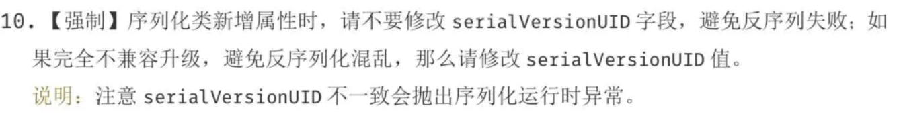

想要深入了解的小伙伴，可以看[这篇文章](https://juejin.cn/post/6844903746682486791)

## I/O

- `InputStream`/`Reader`: 前者是字节输入流（输入到内存），后者是字符输入流。
- `OutputStream`/`Writer`: 前者是字节输出流，后者是字符输出流。

### 字节流如何转为字符流？

字节输入流转字符输入流通过 **InputStreamReader** 实现，该类的构造函数可以传入 InputStream 对象。
字节输出流转字符输出流通过 **OutputStreamWriter** 实现，该类的构造函数可以传入 OutputStream 对象。

### 字符流与字节流的区别？

- 读写的时候字节流是**按字节**读写，字符流**按字符**读写。
- **字节流适合所有类型文件的数据传输**，因为计算机字节（Byte）是电脑中表示信息含义的最小单位。**字符流只能够处理纯文本数据，其他类型数据不行，但是字符流处理文本要比字节流处理文本要方便**。
- 只是读写文件，**和文件内容无关时，一般选择字节流**。
- 在读写文件需要对内容按行处理，比如比较特定字符，**处理某一行数据的时候一般会选择字符流**。

### 三种IO模型BIO/NIO/AIO

**BIO**：**同步阻塞**IO模型。（阻塞是指**线程没有获得CPU资源**）

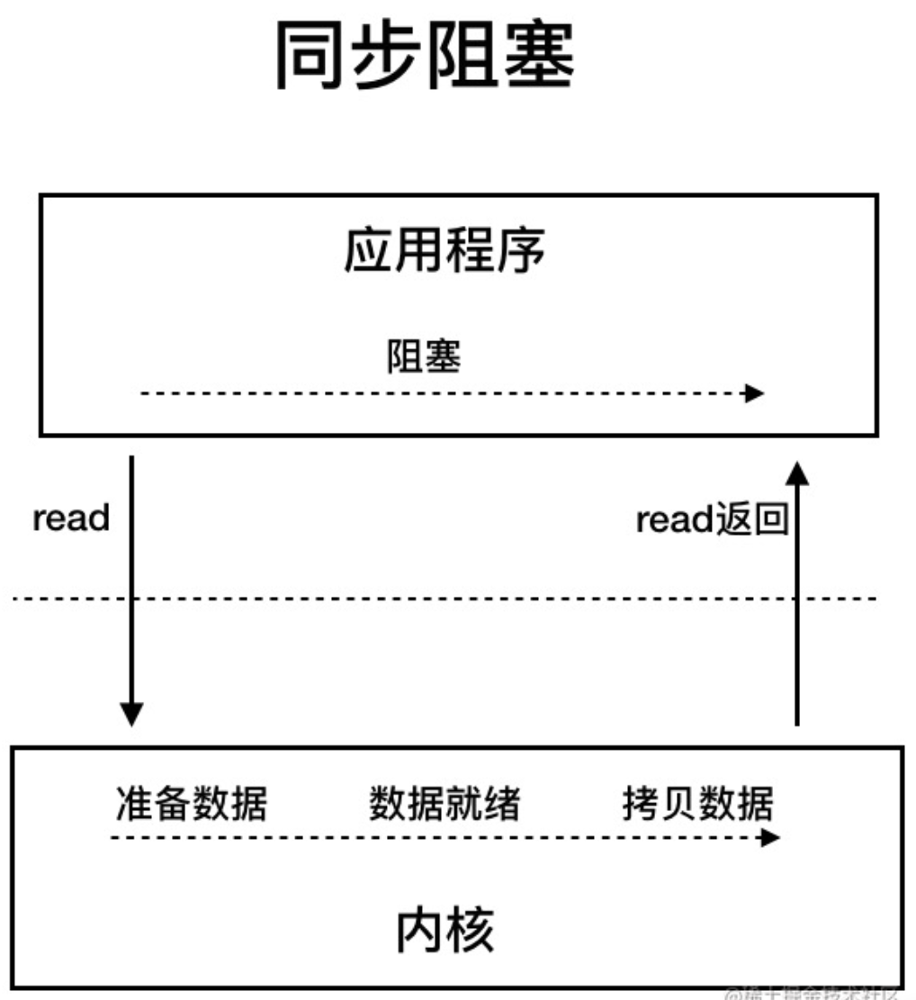
**一个连接一个线程**，BIO**一般适用于连接数目小且固定的架构**，这种方式对于服务器资源要求比较高。

**NIO**：**同步非阻塞**模型。**一个请求一个线程**，也就是说，客户端发送的连接请求都会注册到多路复用器上，多路复用器轮询到有连接IO请求时才会启动一个线程进行处理。**NIO一般适用于连接数目多且连接比较短（轻操作）的架构**。调用**轮询**数据是否已经准备好的过程是十分**消耗 CPU 资源**的。（拷贝数据阶段依然是阻塞的）

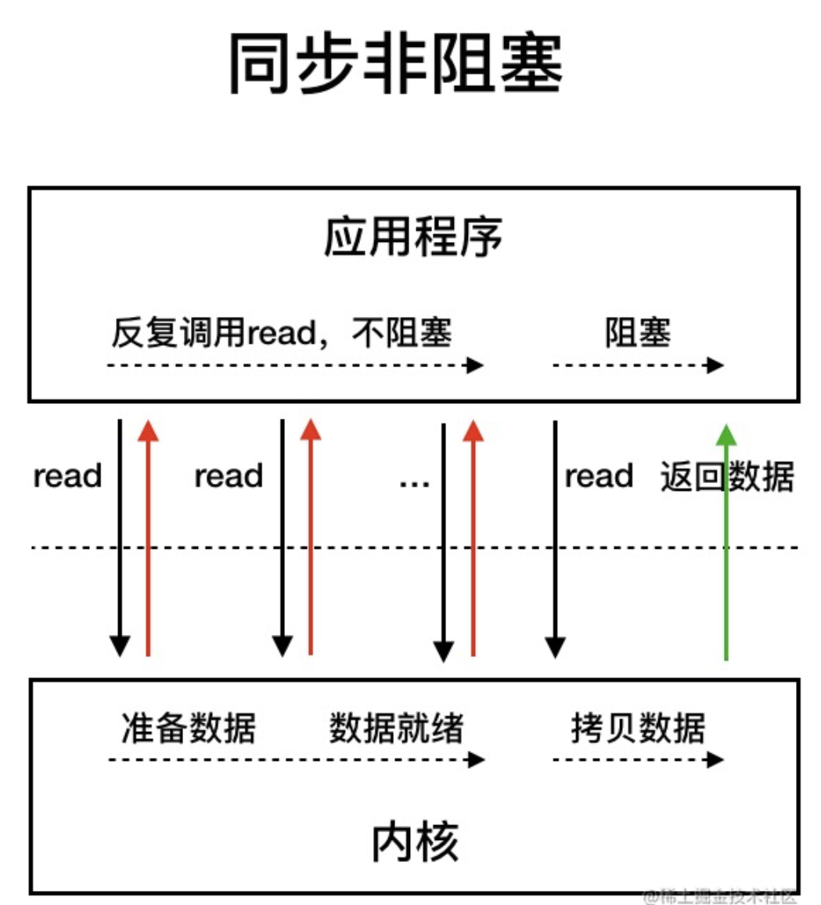

**AIO**：**异步非阻塞**，**一个有效请求一个线程**，也就是说，客户端的IO请求都是通过操作系统先完成之后，再通知服务器应用去启动线程进行处理。**AIO一般适用于连接数目多且连接比较长（重操作）的架构，充分调用操作系统参与并发操作**。
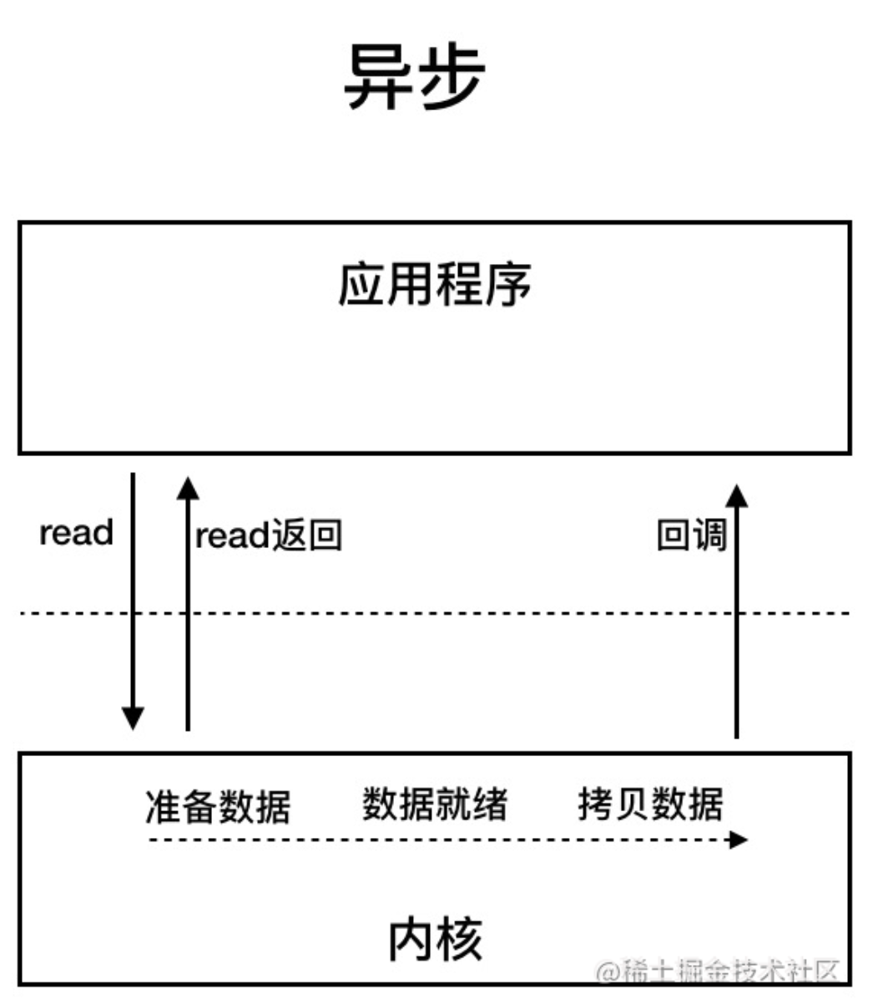
==**IO多路复用**：==
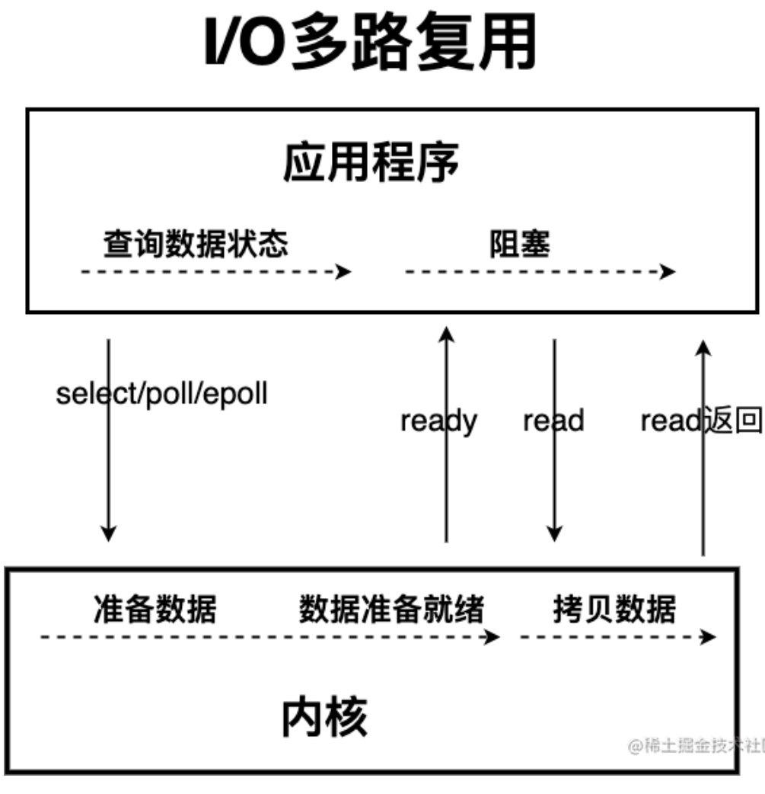

IO 多路复用模型中，线程首先发起 select 调用，询问内核数据是否准备就绪，等内核把数据准备好了，用户线程再发起 read 调用。read 调用的过程（数据从内核空间 -> 用户空间）还是阻塞的。

### Java IO有哪些设计模式

使用了**适配器模式**和**装饰器模式**

**适配器模式**：

```java
Reader reader = new INputStreamReader(inputStream);
```

**把一个类的接口变换成客户端所期待的另一种接口，从而使原本因接口不匹配而无法在一起工作的两个类能够在一起工作**

- **类适配器**：Adapter类（适配器）继承Adaptee类（源角色）实现Target接口（目标角色）
- **对象适配器**：Adapter类（适配器）持有Adaptee类（源角色）对象实例，实现Target接口（目标角色）
  

**装饰器模式**：

```java
new BufferedInputStream(new FileInputStream(inputStream));
```

**一种动态地往一个类中添加新的行为的设计模式。就功能而言，装饰器模式相比生成子类更为灵活，这样可以给某个对象而不是整个类添加一些功能。**

- ConcreteComponent（具体对象）和Decorator（抽象装饰器）实现相同的Conponent（接口）并且Decorator（抽象装饰器）里面持有Conponent（接口）对象，可以传递请求。
- ConcreteComponent（具体装饰器）覆盖Decorator（抽象装饰器）的方法并用super进行调用，传递请求。


## BigDeciaml

`BigDecimal` 可以实现对浮点数的运算，不会造成精度丢失。用a.compareTo(b)，不能用equals和==
## 集合

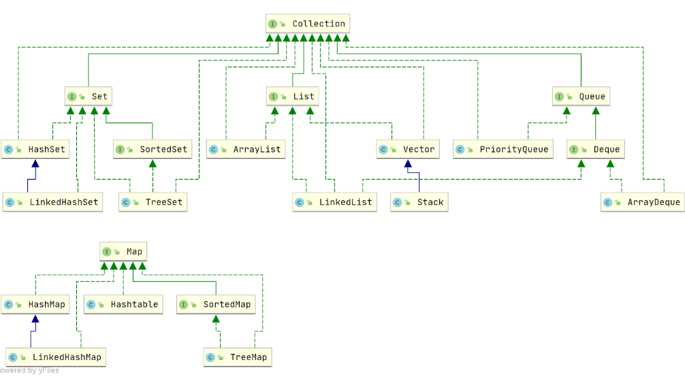

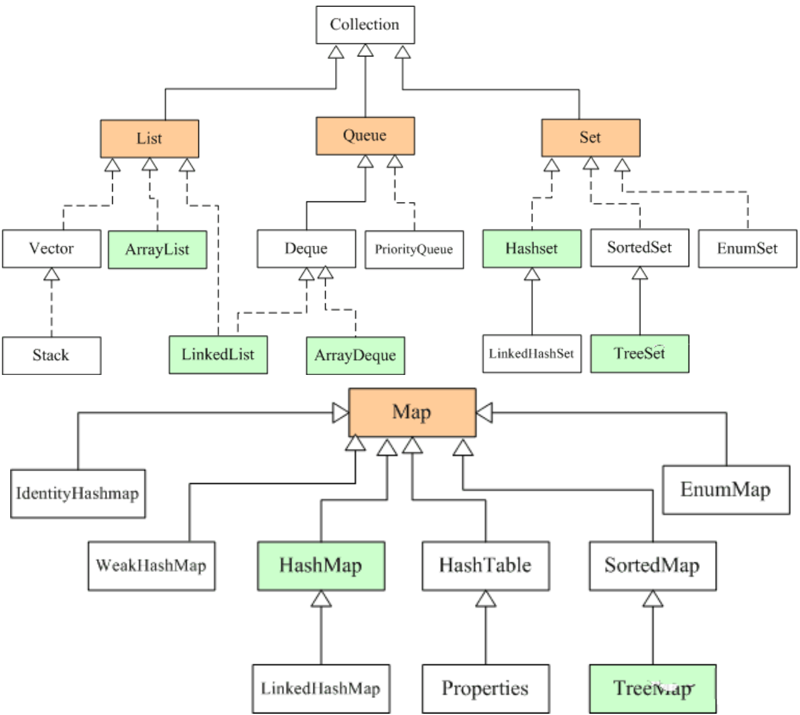

### 线程安全的集合

**线程安全的**：
- **Hashtable**：比HashMap多了个线程安全。
- **ConcurrentHashMap**：是一种高效但是线程安全的集合。
- **Vector**：比Arraylist多了个**同步化机制**。
- **Stack**：栈，也是线程安全的，**继承于Vector**。

线程不安全的：
- Arraylist、LinkedList
- HashSet、TreeSet
- HashMap、TreeMap

### List, Set, Queue, Map

- List: 存储的元素是有序的、可重复的。
- Set: 存储的元素是无序的、不可重复的。
- Queue: 按**特定的规则排序**，存储的元素是有序的、可重复的。
- Map: 使用键值对(key-value)存储，是无序的，键是不可重复得而值可重复，每个键最多映射到一个值。

### Array和ArrayList

* Array 可以包含**基本类型和对象类型**，**ArrayList 只能包含对象类型**。
* **Array 大小是固定**的，ArrayList 的大小是**动态变化**的。
* ArrayList 提供了更多的方法和特性，比如：**addAll()，removeAll()，iterator()** 等等。

### ArrayList 和 Vector

- **Vector是线程安全的**，ArrayList不是。其中，**Vector在关键性的方法前面都加了synchronized关键字**。
- **ArrayList扩容0.5倍，Vector是扩容1倍**，这样ArrayList就有利于节约内存空间。

### ArrayList 和 LinkedList

1. **是否保证线程安全：** **都是不同步**的，也就是**不保证线程安全**；
2. **底层数据结构：** `ArrayList` 底层使用的是 **`Object` 数组**；`LinkedList` 底层使用的是 **双向循环链表** 数据结构（JDK1.6 之前为循环链表，JDK1.7 取消了循环。）
3. **插入和删除是否受元素位置的影响**：
   - `ArrayList`  **add尾插法的时间复杂度就是 O(1)**。**随机位置插入/删除**就是O(n)，**get是O(1)**。
   - `LinkedList` 在**头尾插入或者删除时间复杂度为 O(1)，随机插入删除时间复杂度为 O(n)。**
4. **是否支持快速随机访问：** **`LinkedList` 不支持高效**的随机元素访问，而 **`ArrayList` 支持（实现了RandomAccess接口）**。快速随机访问就是通过元素的序号快速获取元素对象(对应于`get(int index)`方法)。
5. **内存空间占用：** `ArrayList` 的空 间浪费主要体现在在 **list 列表的结尾会预留一定的容量空间（1.5倍扩容）**，而 LinkedList 的空间花费则体现在它的每一个元素都需要消耗比 ArrayList 更多的空间（因为**要存放直接后继和直接前驱以及数据**）。

### ArrayList扩容机制

以**无参数构造方法创建** `ArrayList` 时，实际上初始化赋值的是一个**空数组**。当真正对数组进行添加元素操作时，才真正分配容量。即向数组中添加**第一个元素时数组容量扩为 10**。 每一次扩容为**1.5**倍。（扩容是**复制到另一个大的数组中**）

**有参构造方法**，参数是多少容量就是多少。扩容为**1.5倍**。

### HashSet,LinkedHashSet,TreeSet

**都是 Set 接口的实现类**，**都能保证元素唯一**，并且**都不是线程安全**

- 三者的主要区别在于底层数据结构不同。HashSet 的底层数据结构是哈希表( HashMap )。LinkedHashSet 的底层数据结构是链表和哈希表，元素的插入和取出顺序满足 FIFO。TreeSet 底层数据结构是红黑树，元素是有序的，排序的方式有自然排序和定制排序。
- 底层数据结构不同又导致这三者的应用场景不同。HashSet 用于不需要保证元素插入和取出顺序的场景，LinkedHashSet 用于保证元素的插入和取出顺序满足先进先出(FIFO)的场景，TreeSet 用于需要对元素自定义排序规则的场景。

### Queue 与 Deque 

`Queue` 是**单端**队列，只能从**一端插入**，**另一端删除**，实现上一般遵循 **先进先出（FIFO）** 规则。`Deque` 是**双端**队列，在队列的两端均可插入或删除元素。

### ArrayDeque 和 LinkedList

- `ArrayDeque` 是基于**可变长的数组和双指针**来实现，而 `LinkedList` 则通过**链表**来实现。
- `ArrayDeque` **不支持存储 `NULL`** 数据，但 `LinkedList` 支持。
- `ArrayDeque` 是在 JDK1.6 才被引入的，而`LinkedList` 早在 JDK1.2 时就已经存在。
- `ArrayDeque` **插入时可能存在扩容**过程, 不过均摊后的插入操作依然为 O(1)。虽然 `LinkedList` **不需要扩容**，但是**每次插入需要申请新的堆空间，均摊性能相比更慢**。

### Map

- **HashMap**
- `LinkedHashMap`： `LinkedHashMap` 继承自 `HashMap`，所以它的底层仍然是基于拉链式散列结构即由数组和链表或红黑树组成。另外，`LinkedHashMap` 在上面结构的基础上，**增加了一条双向链表**，使得上面的结构可以**保持键值对的插入顺序**。
- `Hashtable`： **数组+链表**组成的，数组是 `Hashtable` 的主体，链表则是主要为了解决哈希冲突。
- `TreeMap`： 红黑树（**自平衡的排序二叉树**）。默认升序排序。

### HashMap

 JDK1.8 之前 `HashMap` 由**数组+链表**组成的，数组是 `HashMap` 的主体，**链表则是主要为了解决哈希冲突**。JDK1.8 以后在**解决哈希冲突**时有了较大的变化，当**链表长度大于阈值**（**默认为8**）且数据总量超过 64 （将链表转换成红黑树前会判断，如果当前**数组的长度小于 64**，那么会选择**先进行数组扩容到原来的2倍**，而不是转换为红黑树）时，**将链表转化为红黑树**。当链表过长，则会严重影响 HashMap 的性能，**红黑树搜索时间复杂度是 O(logn)**，而**链表是糟糕的 O(n)**

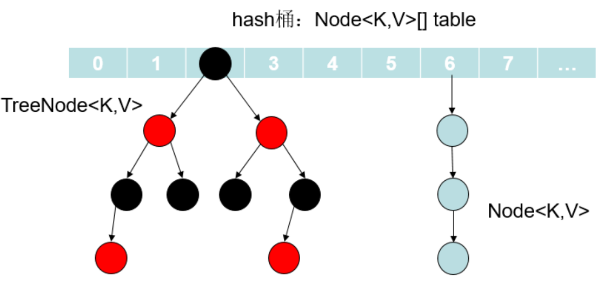

#### 解决hash冲突

解决Hash冲突方法有:开放定址法、再哈希法、链地址法（拉链法）、建立公共溢出区。HashMap中采用的是 链地址法 。

* 开放定址法也称为`再散列法`，基本思想就是，如果`p=H(key)`出现冲突时，则以`p`为基础，再次hash，`p1=H(p)`,如果p1再次出现冲突，则以p1为基础，以此类推，直到找到一个不冲突的哈希地址`pi`。 因此开放定址法所需要的hash表的长度要大于等于所需要存放的元素，而且因为存在再次hash，所以`只能在删除的节点上做标记，而不能真正删除节点。`
* 再哈希法(双重散列，多重散列)，提供多个不同的hash函数，当`R1=H1(key1)`发生冲突时，再计算`R2=H2(key1)`，直到没有冲突为止。 这样做虽然不易产生堆集，但增加了计算的时间。
* 链地址法(拉链法)，将哈希值相同的元素构成一个同义词的单链表,并将单链表的头指针存放在哈希表的第i个单元中，查找、插入和删除主要在同义词链表中进行。链表法适用于经常进行插入和删除的情况。
* 建立公共溢出区，将哈希表分为公共表和溢出表，当溢出发生时，将所有溢出数据统一放到溢出区。

#### 解决 hash 冲突不直接用红黑树？而选择先用链表再转红黑树?

因为红黑树需要进行左旋，右旋，变色这些操作来保持平衡，而单链表不需要。当元素小于 8 个的时候，此时做查询操作，链表结构已经能保证查询性能。**当元素大于 8 个的时候， 红黑树搜索时间复杂度是 O(logn)，而链表是 O(n)，此时需要红黑树来加快查询速度，但是新增节点的效率变慢了**。

因此，**如果一开始就用红黑树结构，元素太少，新增效率又比较慢**，无疑这是**浪费性能**的。

#### HashMap默认加载因子为什么是0.75

HashMap的默认构造函数：

```java
int threshold; // 容纳键值对的最大值
final float loadFactor;// 负载因子
int modCount;  
int size;  
```

Node[] table的初始化长度length(默认值是16)，Load factor为负载因子(默认值是0.75)，threshold是HashMap所能容纳键值对的最大值。threshold = length * Load factor。也就是说，在数组定义好长度之后，负载因子越大，所能容纳的键值对个数越多。

**默认的loadFactor是0.75，0.75是对空间和时间效率的一个平衡选择，一般不要修改，除非在时间和空间比较特殊**的情况下 ：

* 如果**内存空间很多而又对时间效率要求很高**，可以**降低负载因子**Load factor的值 。
* 相反，如果**内存空间紧张而对时间效率要求不高**，可以**增加负载因子**loadFactor的值，这个值可以大于1。

**源码中的注释**：作为一般规则，**默认负载因子（0.75）在时间和空间成本上提供了很好的折衷。较高的值会降低空间开销，但提高查找成本**（体现在大多数的HashMap类的操作，包括get和put）。设置初始大小时，应该考虑预计的entry数在map及其负载系数，并且**尽量减少rehash操作的次数**。**如果初始容量*负载因子大于最大条目数，就不会发生rehash操作**。

#### HashMap的put方法流程

简要流程如下：

1. 首先根据 key 的值计算 hash 值，找到该元素在数组中存储的下标；
2. 如果数组是空的，则调用 resize 进行初始化；
3. 如果没有哈希冲突直接放在对应的数组下标里；
4. 如果冲突了，且 key 已经存在，就覆盖掉 value；
5. 如果冲突后，发现该节点是红黑树，就将这个节点挂在树上；
6. 如果冲突后是链表，判断该链表是否大于 8 ，如果大于 8 并且数组容量小于 64，就进行扩容；如果链表节点大于 8 并且数组的容量大于 64，则将这个结构转换为红黑树；否则，链表插入键值对，若 key 存在，就覆盖掉 value

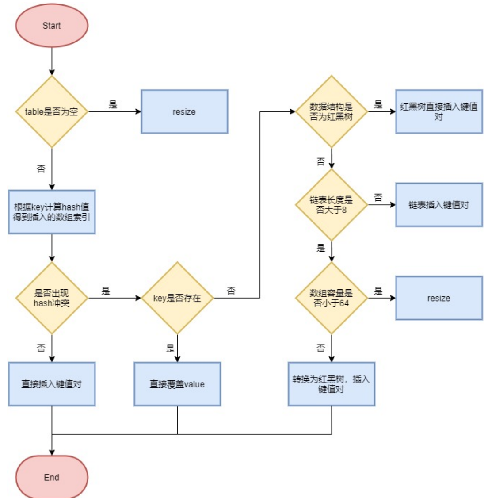

#### HashMap的key

**1.key的存储索引计算**

- h = key.hashCode() ：**取key的 hashCode值**
- hash = h ^ (h >>> 16) ：**高位参与运算计算出hash值**
- 索引下标 = h%length = h & (nums.length-1)：**取模计算下标**

**2.拿String当key**

一般用**Integer**、**String** 这种**不可变类**当 HashMap 当 key，而且 String 最为常用。

- 因为**字符串是不可变的，所以在它创建的时候 hashcode 就被缓存了，不需要重新计算**。这就是 HashMap 中的键往往都使用字符串的原因。
- 因为**获取对象的时候要用到 equals() 和 hashCode() 方法**，那么键对象正确的重写这两个方法是非常重要的,**这些类已经很规范的重写了 hashCode() 以及 equals() 方法**。

#### HashMap为什么线程不安全

![[图集/image-20230723123657439.png|500]]

* **多线程下扩容死循环**。**JDK1.7中使用头插法插入元素**，在**多线程**的环境下，**扩容的时候有可能导致环形链表**的出现，形成**死循环**。因此，**JDK1.8使用尾插法插入元素，在扩容时会保持链表元素原本的顺序，不会出现环形链表**的问题。
* **多线程的put可能导致元素的丢失**。多线程**同时执行 put** 操作，如果**计算出来的索引位置是相同的，那会造成前一个 key 被后一个 key 覆盖，从而导致元素的丢失**。此问题在JDK 1.7和 JDK 1.8 中都存在。
* **put和get并发时，可能导致get为null**。线程1执行put时，因为**元素个数超出threshold而导致rehash**，线程2此时执行get，有可能导致这个问题。此问题在JDK 1.7和 JDK 1.8 中都存在。

####  HashMap和HashSet

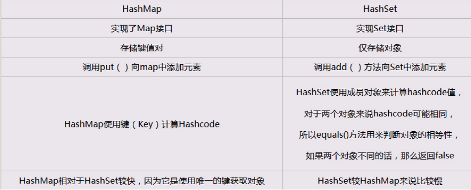

补充HashSet的实现：**HashSet的底层其实就是HashMap**，只不过我们**HashSet是实现了Set接口并且把数据作为K值，而V值一直使用一个相同的虚值来保存**。如源码所示：

```java
public boolean add(E e) {
    return map.put(e, PRESENT)==null;
    // 调用HashMap的put方法,PRESENT是一个至始至终都相同的虚值
}
```

**由于HashMap的K值本身就不允许重复**，并且在HashMap中如果K/V相同时，会用新的V覆盖掉旧的V，然后返回旧的V，**那么在HashSet中如果相同就会插入失败返回false，这样就保证了数据的不可重复性**。

#### HashMap和Hashtable

1. **线程是否安全：** `Hashtable` 是**线程安全**的,因为 `Hashtable` 内部的方法基本都经过 **synchronized** 修饰。
2. **对 Null key 和 Null value 的支持：** `HashMap` 可以存储**一个 null 的 key 和 多个null 的value**；**Hashtable 不允许有 null 键和 null 值**，否则会抛出 **NullPointerException**。
3. **初始容量大小和每次扩充容量大小的不同 ：** 
   - 创建时如果**不指定容量初始值**，**Hashtable 默认的初始大小为 11**，之后每次扩充，容量变为原来的 **2n+1**。**HashMap 默认初始大小为 16**。之后每次扩充（加载因子：loadFactory：**0.75**），容量变为原来的 **2 倍**。
   - 创建时如果**给定了容量初始值**，那么 **Hashtable 会直接使用你给定的大小**，而 **HashMap** 会将其扩充为 **2 的幂次方大小**（`HashMap` 中的`tableSizeFor()`方法保证）。也就是说 `HashMap` 总是使用 2 的幂作为哈希表的大小。
4. **底层数据结构：** JDK1.8 以后的 `HashMap` 在解决哈希冲突时有了较大的变化，当链表长度大于阈值（默认为 8）时，将链表转化为**红黑树**（将链表转换成红黑树前会判断，如果当前数组的长度小于 64，那么会选择先进行数组扩容，而不是转换为红黑树），以减少搜索时间。**Hashtable 没有这样的机制，采用数组+链表的形式。**。

### ConcurrentHashMap

#### JDK1.7与1.8中的区别

- **数据结构**：
  - **1.7中是由 Segment 数组结构和 HashEntry数组**结构组成；
  - **1.8取消了Segment分段锁的数据结构，取而代之的是与HashMap相同的数组+链表+红黑树**的结构。
  - 定位结点的hash算法简化会带来弊端，**Hash冲突加剧**，因此在**链表节点数量大于8时，会将链表转化为红黑树**进行存储。
  - **查询时间复杂度**从原来的**遍历链表O(n)**，变成**遍历红黑树O(logN)**。
- **保证线程安全机制**：
  - **1.7继承自ReentrantLock，采用Segment的分段锁机制实现线程安全**。
  - **1.8** 采用**CAS+Synchronized**保证线程安全。
- **锁的粒度**：
  - **1.7**是对需要进行数据操作的**Segment加锁**；
  - **1.8**调整为**对每个数组元素加锁（Node）**。

#### ConcurrentHashMap的原理

**JDK1.7中：**

JDK1.7中的ConcurrentHashMap  是由 `Segment` 数组结构和 `HashEntry` 数组结构组成，即ConcurrentHashMap 把哈希桶切分成小数组（Segment ），每个小数组有 n 个 HashEntry 组成。**Segment 继承了 ReentrantLock，所以是一种可重入锁，是给每个Segment加锁，其他段的数据也能被其他线程访问，能够实现真正的并发访问。**；**HashEntry 用于存储键值对数据**。

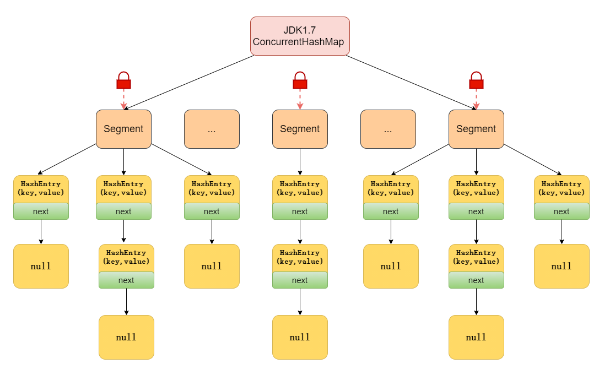

**JDK1.8中：**

在数据结构上， JDK1.8  中的ConcurrentHashMap  选择了与 HashMap 相同的**数组+链表+红黑树**结构；在锁的实现上，**抛弃Segment 分段锁，采用CAS + synchronized实现更加低粒度的锁**。将锁的级别控制在了更细粒度的哈希桶元素级别，也就是说**只需要锁住这个链表头结点（红黑树的根节点）**，就不会影响其他的哈希桶元素的读写，大大提高了并发度。

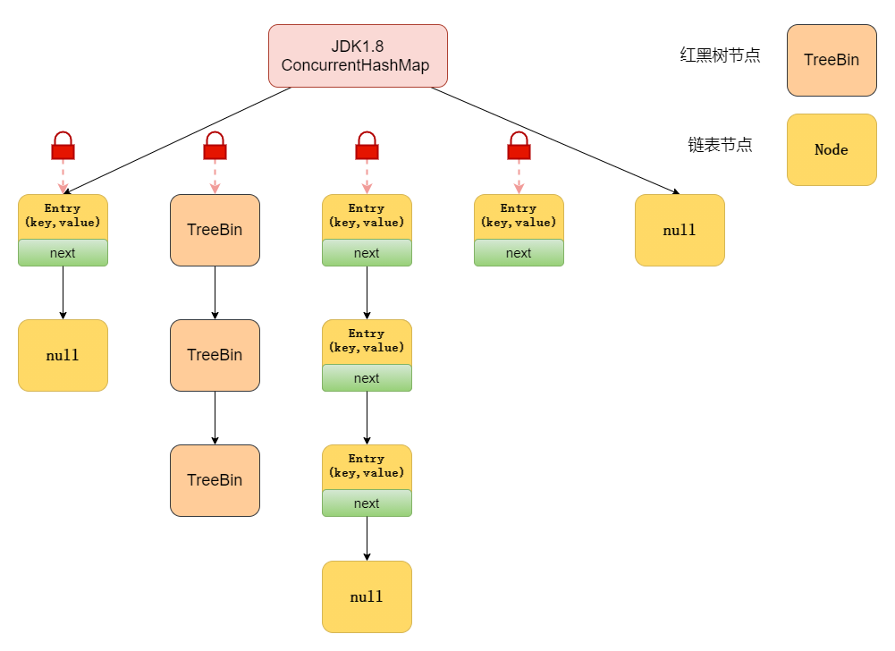

#### put方法执行逻辑

**先来看JDK1.7**

首先，**会尝试获取锁，如果获取失败，利用自旋获取锁**；如果**自旋重试的次数超过 64 次**，则改为**阻塞获取锁**。

**获取到锁后：**

1. 将当前 Segment 中的 table 通过 key 的 hashcode 定位到 HashEntry。
2. 遍历该 HashEntry，如果不为空则判断传入的 key 和当前遍历的 key 是否相等，相等则覆盖旧的 value。
3. 不为空则需要新建一个 HashEntry 并加入到 Segment 中，同时会先判断是否需要扩容。
4. 释放 Segment 的锁。

**再来看JDK1.8**

大致可以分为以下步骤：

1. 根据 **key 计算出 hash值**。
2. 判断**是否需要进行初始化**。
3. **定位到 Node，拿到首节点 f**，判断首节点 f：
   * 如果为  null  ，则通过cas的方式尝试添加。
   * 如果为 `f.hash = MOVED = -1` ，说明其他线程在扩容，参与一起扩容。
   * 如果都不满足 ，synchronized 锁住 f 节点，判断是链表还是红黑树，遍历插入。
4. **当在链表长度达到8的时候，数组扩容或者将链表转换为红黑树**。

源码分析可看这篇文章：[面试 ConcurrentHashMap ，看这一篇就够了！](https://mp.weixin.qq.com/s?__biz=Mzg4MjUxMTI4NA==&mid=2247484715&idx=1&sn=f5c3ad8e66122531a1c77efcb9cb50b7&chksm=cf54d9f0f82350e637a51fa8bc679f6197d15e4c9703aac971150bfcc5437e867c3bcf3f409c&token=1920060057&lang=zh_CN#rd)

#### get方法是否要加锁

**get 方法不需要加锁**。因为 Node 的元素 val 和指针 next 是**用 volatile 修饰**的，在多线程环境下**线程A修改结点的val或者新增节点的时候**是**对线程B可见的**。

**这也是它比其他并发集合比如 Hashtable**、用 Collections.synchronizedMap()包装的 **HashMap** **安全效率高的原因之一**。

```java
static class Node<K,V> implements Map.Entry<K,V> {
    final int hash;
    final K key;
    //可以看到这些都用了volatile修饰
    volatile V val;
    volatile Node<K,V> next;
}
```

**get方法不需要加锁与volatile修饰的哈希桶有关吗？**

**没有关系**。哈希桶`table`用volatile修饰**主要是保证在数组扩容的时候保证可见性**。

```java
static final class Segment<K,V> extends ReentrantLock implements Serializable {
    // 存放数据的桶
    transient volatile HashEntry<K,V>[] table;
```

#### key/value不为null

**value 为什么不能为 null** ，因为`ConcurrentHashMap `是用于**多线程的** ，**如果`map.get(key)`得到了 null ，无法判断，是映射的value是 null ，还是没有找到对应的key而为 null ，这就有了二义性。**

而用于**单线程状态的`HashMap`却可以用`containsKey(key)` 去判断到底是否包含了这个 null 。**

我们用**反证法**来推理：

假设ConcurrentHashMap 允许存放值为 null 的value，这时有A、B两个线程，线程A调用ConcurrentHashMap .get(key)方法，返回为 null ，我们不知道这个 null 是没有映射的 null ，还是存的值就是 null 。

假设此时，返回为 null 的真实情况是没有找到对应的key。那么，我们可以用ConcurrentHashMap .containsKey(key)来验证我们的假设是否成立，我们期望的结果是返回false。

但是在我们调用ConcurrentHashMap .get(key)方法之后，containsKey方法之前，线程B执行了ConcurrentHashMap .put(key, null )的操作。那么我们调用containsKey方法返回的就是true了，这就与我们的假设的真实情况不符合了，这就有了二义性。

至于ConcurrentHashMap 中的**key为什么也不能为 null 的问题**，源码就是这样写的，哈哈。如果面试官不满意，**就回答因为作者Doug不喜欢 null ，所以在设计之初就不允许了 null 的key存在**。想要深入了解的小伙伴，可以看这篇文章[这道面试题我真不知道面试官想要的回答是什么](https://mp.weixin.qq.com/s?__biz=MzIxNTQ4MzE1NA==&mid=2247484354&idx=1&sn=80c92881b47a586eba9c633eb78d36f6&chksm=9796d5bfa0e15ca9713ff9dc6e100593e0ef06ed7ea2f60cb984e492c4ed438d2405fbb2c4ff&scene=21#wechat_redirect)

#### 并发度是多少

在JDK1.7中，**并发度默认是16**，这个值可以在构造函数中设置。**如果自己设置了并发度，ConcurrentHashMap 会使用大于等于该值的最小的2的幂指数作为实际并发度**，也就是比如你设置的值是17，那么实际并发度是32。

#### 强一致性or弱一致性

与**HashMap迭代器是强一致性**不同，**ConcurrentHashMap 迭代器是弱一致性**。

ConcurrentHashMap 的迭代器创建后，就会按照哈希表结构遍历每个元素，但**在遍历过程中，内部元素可能会发生变化，如果变化发生在已遍历过的部分，迭代器就不会反映出来**，而**如果变化发生在未遍历过的部分，迭代器就会发现并反映出来，这就是弱一致性**。

这样迭代器线程可以使用原来老的数据，而写线程也可以并发的完成改变，更重要的，这保证了多个线程并发执行的连续性和扩展性，是性能提升的关键。想要深入了解的小伙伴，可以看这篇文章[为什么ConcurrentHashMap 是弱一致的](http://ifeve.com/ConcurrentHashMap -weakly-consistent/)

#### 多线程下安全的操作map还有其他方法吗？

还可以使用`Collections.synchronizedMap`方法，对方法进行加同步锁

```java
private static class SynchronizedMap<K,V>
        implements Map<K,V>, Serializable {
        private static final long serialVersionUID = 1978198479659022715L;

        private final Map<K,V> m;     // Backing Map
        final Object      mutex;        // Object on which to synchronize

        SynchronizedMap(Map<K,V> m) {
            this.m = Objects.requireNon null (m);
            mutex = this;
        }

        SynchronizedMap(Map<K,V> m, Object mutex) {
            this.m = m;
            this.mutex = mutex;
        }
    // 省略部分代码
    }
```

如果传入的是 HashMap 对象，其实也是对 HashMap 做的方法做了一层包装，里面使用对象锁来保证多线程场景下，线程安全，本质也是对 HashMap 进行全表锁。**在竞争激烈的多线程环境下性能依然也非常差，不推荐使用！**

#### ConcurrentHashMap和Hashtable

- **底层数据结构：** JDK**1.7** 的 `ConcurrentHashMap` 底层采用 **分段的数组+链表** 实现，JDK**1.8** 采用的数据结构跟 `HashMap1.8` 的结构一样，**数组+链表/红黑二叉树**。`Hashtable` 和 JDK1.8 之前的 `HashMap` 的底层数据结构类似都是采用 **数组+链表** 的形式。
- **实现线程安全的方式（重要）：** ① **在 JDK1.7 的时候，`ConcurrentHashMap`（分段锁）** 对整个桶数组进行了分割分段(`Segment`)（segment继承了ReentrantLock），**每一把锁只锁容器其中一部分数据**，多线程访问容器里不同数据段的数据，就不会存在锁竞争，提高并发访问率。 到了 **JDK1.8** 的时候已经摒弃了 `Segment` 的概念，而是**直接用 `Node` 数组+链表+红黑树**的数据结构来实现，**并发控制使用 synchronized和 CAS 来操作**。**Hashtable是使用Synchronized来实现线程安全的，给整个哈希表加了一把大锁**，多线程访问时候，只要有一个线程访问或操作该对象，那其他线程只能阻塞等待需要的锁被释放，在竞争激烈的多线程场景中性能就会非常差！

### Collection框架中实现比较

1. 实现**Comparable接口的compareTo(T t) 方法**，称为**内部比较器**。
2. 创建一个**外部比较器**，这个外部比较器要**实现Comparator接口的 compare(T t1, T t2)方法**。

### Iterator和ListIterator

* 遍历。**使用Iterator，可以遍历所有集合**，如Map，List，Set；**但只能在向前方向上遍历**集合中的元素。

使用**ListIterator**，**只能遍历List实现的对象**，但**可以向前和向后遍历**集合中的元素。

* 添加元素。**Iterator无法向集合中添加元素**；而，ListIteror可以向集合添加元素。

* 修改元素。**Iterator无法修改集合中的元素**；而，ListIterator可以使用set()修改集合中的元素。

* 索引。**Iterator无法获取集合中元素的索引**；而，使用ListIterator，可以获取集合中元素的索引。

### 快速失败 / 安全失败/并发操作的安全异常ConcurrentModifycationException

**快速失败（fail—fast）** 

* 在用迭代器遍历一个集合对象时，如果遍历过程中对集合对象的内容进行了修改（增加、删除、修改），则会**抛出Concurrent Modification Exception**。
* 原理：迭代器在遍历时直接访问集合中的内容，并且**在遍历过程中使用一个        modCount 变量表示版本号，类似乐观锁**。集合在被遍历期间如果内容发生变化，就会改变modCount的值。每当迭代器使用hashNext()/next()遍历下一个元素之前，都会检测modCount变量是否为expectedmodCount值，是的话就返回遍历；否则抛出异常，终止遍历。
* 而**单线程也可能抛这种异常**，当使用**foreach**遍历集合时，实际是使用迭代器遍历，会有一个expectedModCount，而如果此时**直接利用list的remove()方法，会使modCount加一，抛异常**，正确方式是**使用迭代器遍历同时使用迭代器的remove()方法而不是list的remove()方法**，因为迭代器的remove()会在修改后将modCount赋值给expectedModCount，这样下次迭代时比较就不会出错了。
* **有ABA问题**：这里异常的抛出条件是检测到 modCount！=expectedmodCount 这个条件。如果集合发生变化时修改modCount值刚好又设置为了expectedmodCount值，则异常不会抛出。因此，不能依赖于这个异常是否抛出而进行并发操作的编程，这个异常只建议用于检测并发修改的bug。 
* 场景：**java.util包下的集合类都是快速失败的**，**不能在多线程下发生并发修改**（迭代过程中被修改），比如**HashMap、ArrayList** 这些集合类。      

**安全失败（fail—safe）**  

* **采用安全失败机制的集合容器（java.util.concurrent包下比如ConcurrentHashMap）**，在遍历时**不是直接在集合内容上访问**的，而是**先复制原有集合内容，在拷贝的集合上进行遍历**。所以在遍历过程中对原集合所作的修改并不能被迭代器检测到，所以**不会触发Concurrent Modification Exception**。      
* 缺点：基于拷贝内容的优点是避免了Concurrent Modification Exception，但同样地，**迭代器并不能访问到修改后的内容**，即：**迭代器遍历的是开始遍历那一刻拿到的集合拷贝，在遍历期间原集合发生的修改迭代器是不知道的**。      
* 场景：**java.util.concurrent包下的容器都是安全失败，可以在多线程下并发使用，并发修改**，比如：**ConcurrentHashMap**。

### 红黑树

（1）每个节点红或黑
（2）**根节点**是**黑**色。
（3）每个叶子节点（NIL）是黑色。 注意：这里叶子节点，是指为空(NIL或NULL)的叶子节点！
（4）如果一个节点是**红色**的，则它的**子**节点**必须**是**黑色**的。
（5）从一个节点到该节点的子孙节点的所有路径上包含**相同数目**的**黑节点**。这里指到叶子节点的路径

红黑树的**大致平衡**：**根到叶子**的所有路径中，**最长路径不会超过最短路径的2倍。**

红黑树**插入时的不平衡不超过两次旋转**就可以解决；**删除时的不平衡不超过三次**旋转就能解决，

红黑树的**红黑规则**，保证**最坏情况**下，也能在 **logN时间内**完成**查找**操作。

跟**平衡二叉树AVL**相比：

**AVL的左右子树高度差不能超过1**，每次进行插入/删除操作时，几乎都需要通过旋转操作保持平衡，所以**插入删除时性能低**，而**红黑树不是严格平衡，在插入删除的时候，旋转较少，整体性能优于AVL**

## 新特性Java8

### Interface & functional Interface

在 java 8 中专门有一个包放函数式接口`java.util.function`，该包下的所有接口都有 `@FunctionalInterface` 注解，提供函数式编程。

### Lambda

使用 Lambda 表达式可以使代码变的更加简洁紧凑。让 java 也能支持简单的函数式编程。

Lambda 表达式是一个匿名函数，java 8 允许把函数作为参数传递进方法中

```java
strings.forEach((s) -> System.out.println(s));
map.forEach((k,v)->System.out.println(v));
```

### Stream

`Stream`依然不存储数据，不同的是它可以检索(Retrieve)和逻辑处理集合数据、包括筛选、排序、统计、计数等。可以想象成是 Sql 语句。

它的源数据可以是 `Collection`、`Array` 等。由于它的方法参数都是函数式接口类型，所以一般和 Lambda 配合使用。

**流类型**

1. stream 串行流
2. parallelStream 并行流，可多线程执行

### Optional

解决 **NPE**（`java.lang.NullPointerException`）问题，它就是**为 NPE 而生**的

Optional.ofNullable(zoo).map(o -> o.getDog()).map(d -> d.getAge()).filter(v->v==1).orElse(3);

### Date time-api

这是对`java.util.Date`强有力的补充，解决了 Date 类的大部分痛点：

1. 非线程安全
2. 时区处理麻烦
3. 各种格式化、和时间计算繁琐
4. 设计有缺陷，Date 类同时包含日期和时间；还有一个 java.sql.Date，容易混淆。

**java.time 主要类**

`java.util.Date` 既包含日期又包含时间，而 `java.time` 把它们进行了分离

LocalDateTime.class //日期+时间 format: yyyy-MM-ddTHH:mm:ss.SSS
LocalDate.class //日期 format: yyyy-MM-dd
LocalTime.class //时间 format: HH:mm:ss

## JDK新特性

**JDK8**

支持 Lamda 表达式、集合的 stream 操作、提升HashMap性能

**JDK9**

```java
//Stream API中iterate方法的新重载方法，可以指定什么时候结束迭代
IntStream.iterate(1, i -> i < 100, i -> i + 1).forEach(System.out::println);
```

默认G1垃圾回收器

**JDK10** 

其重点在于通过完全GC并行来改善G1最坏情况的等待时间。

**JDK11**

ZGC (并发回收的策略) 4TB

用于 Lambda 参数的局部变量语法

**JDK12**

Shenandoah GC (GC 算法)停顿时间和堆的大小没有任何关系，并行关注停顿响应时间。

**JDK13**

增加ZGC以将未使用的堆内存返回给操作系统，16TB

**JDK14**

删除cms垃圾回收器、弃用ParallelScavenge+SerialOldGC垃圾回收算法组合

将ZGC垃圾回收器应用到macOS和windows平台


