# 并发编程

## 进程、线程、协程

**进程**：**操作系统资源分配的基本单位**。是一个程序运行的一次过程，一个进程可以包含多个线程。**进程之间相互独立，上下文切换花销大。**

**线程**：**CPU调度、执行任务的最小单位**。线程**共享进程的内存空间**。上下文切换**花销小**。

**协程**：**基于线程之上，由用户自己管理的轻量级线程**（对内核不可见）。在大量I/O操作业务的情况下，让协程代替线程，减少上下文切换带来的开销（协程由用户自己调度）。

**总结：线程是进程划分成的更小的运行单位**。线程和进程最大的不同在于基本上**各进程是独立**的，而各线程则不一定，因为同一进程中的线程极有可能会相互影响。**线程执行开销小，但不利于资源的管理和保护**；而进程正相反。

### 线程和进程

线程具有许多传统进程所具有的特征，故又称为轻型进程(Light—Weight Process)或进程元；而把传统的进程称为重型进程(Heavy—Weight Process)，它相当于只有一个线程的任务。在引入了线程的操作系统中，通常一个进程都有若干个线程，至少包含一个线程。

**根本区别**：进程是操作系统资源分配的基本单位，而线程是处理器任务调度和执行的基本单位

**资源开销**：每个进程都有独立的代码和数据空间（程序上下文），程序之间的切换会有较大的开销；线程可以看做轻量级的进程，同一类线程共享代码和数据空间，每个线程都有自己独立的运行栈和程序计数器（PC），线程之间切换的开销小。

**包含关系**：如果一个进程内有多个线程，则执行过程不是一条线的，而是多条线（线程）共同完成的；线程是进程的一部分，所以线程也被称为轻权进程或者轻量级进程。

**内存分配**：同一进程的线程共享本进程的地址空间和资源，而进程之间的地址空间和资源是相互独立的

**影响关系**：一个进程崩溃后，在保护模式下不会对其他进程产生影响，但是一个线程崩溃整个进程都死掉。所以多进程要比多线程健壮。

**执行过程**：每个独立的进程有程序运行的入口. 顺序执行序列和程序出口。但是线程不能独立执行，必须依存在应用程序中，由应用程序提供多个线程执行控制，两者均可并发执行

### 线程和协程

1.一个线程可以多个协程。
2.线程进程都是同步机制，而协程则是异步。
3.协程能保留上一次调用时的状态，每次过程重入时，就相当于进入上一次调用的状态。
4.线程是由CPU调度，而协程是由用户调度。
5.协程需要线程来承载运行，线程是协程的资源，但协程不会直接使用线程，协程直接利用的是执行器(Interceptor)，执行器可以关联并使用任意线程。

协程链接：https://blog.csdn.net/TABE_/article/details/122417359

### 协程为什么叫用户态线程

线程（thread）的调度是由操作系统负责，线程的睡眠、等待、唤醒的时机是由操作系统控制，开发者无法决定。使用协程，开发者可以自行控制程序切换的时机，可以在一个函数执行到一半的时候中断执行，让出CPU，在需要的时候再回到中断点继续执行。简单来说就是用户可以更加直接的控制协程。

### 用户态和内核态

用户程序有**用户态**和**内核态**两种状态。**用户态**就是执行在**用户空间**中，不能直接执行**系统调用**。必须先切换到**内核态**，也就是系统调用的相关数据信息必须存储在**内核空间**中，然后执行系统调用。

涉及到操作硬盘资源、发起线程切换等的敏感操作时，用户程序不能直接在用户态操作，需要发起系统调用，具体操作在内核空间完成；

注：用户程序发起系统调用，异常（如缺页异常）、中断等会进入内核态

### 用户态切换到内核态

（每个线程都对应这一个TCB，TCB中有一个TSS字段，存储着线程对应的内核栈的地址，也就是内核栈的栈顶指针）

1.从用户态切换到内核态时，首先用户态可以直接读写寄存器，用户态操作CPU，将寄存器的状态保存到对应的内存中，然后调用对应的系统函数，传入对应的用户栈的PC地址和寄存器信息，方便后续内核方法调用完毕后，恢复用户方法执行的现场。

2.将CPU的字段改为内核态，将内核段对应的代码地址写入到PC寄存器中，然后开始执行内核方法，相应的方法栈帧时保存在内核栈中。

3.当内核方法执行完毕后，会将CPU的字段改为用户态，然后利用之前写入的信息来恢复用户栈的执行。

从上述流程可以看出用户态切换到内核态的时候，会牵扯到用户态现场信息的保存以及恢复，还要进行一系列的安全检查，比较耗费资源。

### 协程切换不涉及内核态切换，只涉及基本CPU上下文切换

（所谓CPU上下文就是指一堆寄存器保存了CPU运行任务的信息，包括下一条指令从哪里开始、栈顶位置、CPU的中间结果等）协程切换就是把当前协程的CPU信息保存起来，将需要切换的协程CPU寄存器状态加载进来，完全是在用户态进行。

### 进程/线程切换所需要保存的信息

进程调度，切换进程上下文，包括**分配的内存、数据段、堆栈段、代码段**。

线程调度，切换线程上下文，主要**切换堆栈以及各寄存器的值**，因为同一个进程里的线程只有堆栈不同。

###  堆和方法区

堆和方法区是**所有线程共享**的资源，其中堆是进程中最大的一块内存，主要用于存放新创建的**对象** (几乎所有对象都在这里分配内存)，**方法区主要用于存放已被加载的类信息、常量、静态变量、即时编译器编译后的代码等数据**。

### 并发和并行

- **并发**：两个及两个以上的作业在同一 **时间段** 内执行。
- **并行**：两个及两个以上的作业在同一 **时刻** 执行。

最关键的点是：是否是 **同时** 执行。

### 同步和异步

- **同步** ： 发出一个调用之后，在没有得到结果之前， 该调用就不可以返回，一直等待。
- **异步** ：调用在发出之后，不用等待返回结果，该调用直接返回。

### **为什么要使用多线程?**

先从总体上来说：

- **从计算机底层来说：** 线程可以比作是轻量级的进程，**是程序执行的最小单位**,线程间的**切换和调度的成本**远远小于进程。另外，**多核 CPU** 时代意味着多个线程可以同时运行，这**减少了线程上下文切换的开销**。
- **从当代互联网发展趋势来说：** 现在的系统动不动就要求百万级甚至千万级的并发量，而多线程并发编程正是开发**高并发系统**的基础，利用好多线程机制可以大大提高系统整体的**并发能力以及性能**。

再深入到计算机底层来探讨：

- **单核时代**： 在单核时代多线程主要是**为了提高单进程利用 CPU 和 IO 系统的效率**。 假设只运行了一个 Java 进程的情况，当我们请求 IO 的时候，如果 Java 进程中只有一个线程，此线程被 IO 阻塞则整个进程被阻塞。CPU 和 IO 设备只有一个在运行，那么可以简单地说系统整体效率只有 50%。当使用多线程的时候，一个线程被 IO 阻塞，其他线程还可以继续使用 CPU。从而提高了 Java 进程利用系统资源的整体效率。
- **多核时代**: 多核时代多线程主要是**为了提高进程利用多核 CPU利用率** 。

**使用多线程可能带来什么问题?**

并发编程的目的就是为了能提高程序的执行效率提高程序运行速度，但是并发编程并不总是能提高程序运行速度的，而且并发编程可能会遇到很多问题，比如：**内存泄漏、死锁、线程不安全**等等。

### 上下文切换

1. **进程**上下文切换。（**需要切换页表**）

   进程上下文切换指的是不同进程之间发生切换。一般来说，进程被调度有如下几个时机：

   - 某个进程时间片耗尽，会被系统挂起，切换到其他等待 CPU 的进程。
   - 进程所需系统资源不足，需要等到资源满足时才可运行，此时会被挂起，其他进程会被调度。
   - 进程通过 sleep 方法主动挂起，其他进程就有机会被调度。
   - 有更高优先级的进程，当前进程会被挂起，高优先级进程会被调度。
   - 硬件中断时，CPU 上的进程会被中断挂起，转而执行内核中的中断服务程序。

   当发生如上几种情况的时候，就会发生进程调度，进而发生进程上下文切换。

   进程上下文具体包括：

   （1）用户级上下文: 正文、数据、用户堆栈以及共享存储区；

   （2）寄存器上下文: 通用寄存器、程序寄存器(IP)、处理器状态寄存器(EFLAGS)、栈指针(ESP)；

   （3）系统级上下文: 进程控制块task_struct、内存管理信息(mm_struct、vm_area_struct、pgd、pte)、内核栈。

2. **线程**上下文切换。（不需要切换页表）

   我们都知道进程是资源分配的基本单位，线程是调度的基本单位，进程只是给线程提供了虚拟内存等资源。而线程上下文切换，就可以分为两种情况：

   - 进程调度前后的两个线程，属于同一进程。此时因为资源共享，所以在切换的时候虚拟内存等这些资源就不需要变化，只需要切换线程的私有数据、寄存器等不共享的数据。
   - 进程调度前后的两个线程，不属于同一进程。这时候因为资源部共享，所以切换过程和进程上下文切换是一样的。

   所以你会发现同进程内的线程切换，要比多进程间的切换消耗更少的资源，这其实就是多线程比起多进程的一个优势。

3. 中断上下文切换。

   中断上下文切换指的是为了响应硬件的事件，中断处理会打断进程的正常调度和执行，转而调用中断处理程序，响应设备事件。而在打断其他进程时，就需要将当前的状态保存下来。这样在中断结束后，进程仍然可以从原来的状态恢复运行。

   中断上下文切换，并不需要保存和恢复进程的虚拟内存等用户态资源，只需要处理 CPU 寄存器、内核堆栈等内核态的资源即可。

**上下文包含：**

- **CPU的各种寄存器** 

- 程序计数器 

- 用户栈 

- 内核栈 

**各种内核数据结构**：比如**描绘地址空间的页表**，包含有关**当前进程信息的进程表**，以及包含**进程已打开文件的信息的文件表**

## 进程

### 进程5大状态

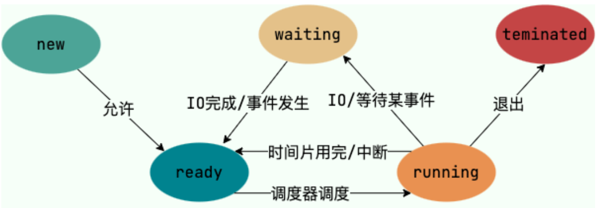

一般把进程大致分为 5 种状态，这一点和线程很像！

- **创建状态(new)** ：进程正在被创建，尚未到就绪状态。
- **就绪状态(ready)** ：进程已处于准备运行状态，即进程获得了除了处理器之外的一切所需资源，一旦得到处理器资源(处理器分配的时间片)即可运行。
- **运行状态(running)** ：进程正在处理器上运行(单核 CPU 下任意时刻只有一个进程处于运行状态)。
- **阻塞状态(waiting)** ：又称为等待状态，进程正在等待某一事件而暂停运行如等待某资源为可用或等待 IO 操作完成。即使处理器空闲，该进程也不能运行。
- **结束状态(terminated)** ：进程正在从系统中消失。可能是进程正常结束或其他原因中断退出运行。

### 进程的控制结构：PCB

PCB（进程控制块）是**进程存在的唯一标识**（实现进程的**上下文切换**，用于**记录CPU的寄存器和程序计数器状态**）。具体包含：

**进程描述信息：**

- 进程标识符：标识各个进程，每个进程都有一个并且唯一的标识符；
- 用户标识符：进程归属的用户，用户标识符主要为共享和保护服务；

**进程控制和管理信息：**

- 进程当前状态，如 new、ready、running、waiting 或 blocked 等；
- 进程优先级：进程抢占 CPU 时的优先级；

**资源分配清单：**

- 有关**内存地址空间**或**虚拟地址空间**信息，所打开**文件列表**和所使用的 **I/O 设备信息**。

**CPU 相关信息：**

- **CPU 中各个寄存器的值**，当进程被切换时，**CPU 的状态信息**都会被保存在相应的 PCB 中，以便进程**重新执行**时，能从**断点处继续执行**。

### 进程间通信方式

**1.管道**（半双工、先进先出、效率低）

- **匿名管道**：**只能用于**具有**父子关系**的进程之间的通信。因为管道没有实体，也就是没有管道文件，只能通过 **fork 来复制父进程文件描述符**，来达到通信的目的。**只存在于内存中的文件**
- **命名管道**（有实体文件）。存在于实际的磁盘介质或者文件系统

**2.消息队列**（消息队列是**保存在内核中的消息链表**）

​	消息队列通信过程中，存在用户态与内核态之间的数据拷贝开销。不一定要以先进先出的次序读取。**消息队列克服了信号承载信息量少，管道只能承载无格式字 节流以及缓冲区大小受限等缺点。**

**3.共享内存**

​	多个进程可以访问同一块内存空间，不同进程可以及时看到对方进程中对共享内存中数据的更新。这种方式需要依靠某种同步操作，如**互斥锁**和**信号量**等。

​	问题：有可能会带来并发问题。

**4.信号量（保护共享资源的机制）**

​	信号量其实是一个**整型的计数器**，主要用于实现**进程间的互斥与同步**，而**不是用于缓存进程间通信的数据**。

​	两种操作（信号量**初始化为1**代表**互斥信号量**、初始化为**0**代表**同步**信号量）：

- 一个是 **P 操作**，这个操作会把信号量**减1**，相减后如果信号量 **< 0**，则表明资源**已被占用**，进程需**阻塞等待**；相减后如果信号量 **>= 0**，则表明还有资源可使用，进程可正常**继续执行**。
- 另一个是 **V 操作**，这个操作会把信号量**加1**，相加后如果信号量 **<= 0**，则表明当前有阻塞中的进程，于是会将该进程**唤醒运行**；相加后如果信号量 **> 0**，则表明当前**没有阻塞中的进程**；

**5.信号（唯一的异步通信机制，用于通知进程）**

用户进程对信号的处理方式：

​	**1）执行默认操作**。Linux 对每种信号都规定了默认操作，例如，上面列表中的 SIGTERM 信号，就是终止进程的意思。

​	**2）捕捉信号**。我们可以为信号定义一个信号处理函数。当信号发生时，我们就执行相应的信号处理函数。

​	**3）忽略信号**。当我们不希望处理某些信号的时候，就可以忽略该信号，不做任何处理。有两个信号是应用进程无法捕捉和忽略的，即 `SIGKILL` 和 `SEGSTOP`，它们用于在任何时候中断或结束某一进程。

**6.Socket**套接字（跨网络、跨主机）

```c
int socket(int domain, int type, int protocal)
```

三个参数分别代表：

- **domain** 参数用来指定**协议族**，比如 AF_INET 用于 IPV4、AF_INET6 用于 IPV6、AF_LOCAL/AF_UNIX 用于本机；
- **type** 参数用来指定**通信特性**，比如 SOCK_STREAM 表示的是字节流，对应 TCP、SOCK_DGRAM 表示的是数据报，对应 UDP、SOCK_RAW 表示的是原始套接字；
- **protocal** 参数原本是用来指定**通信协议**的，但现在基本废弃。因为协议已经通过前面两个参数指定完成，protocol 目前一般写成 0 即可；


### 针对TCP的socket编程


- 服务端和客户端初始化 `socket`，得到文件描述符；
- 服务端调用 `bind`，将绑定在 IP 地址和端口;
- 服务端调用 `listen`，进行监听；
- 服务端调用 `accept`，等待客户端连接；
- 客户端调用 `connect`，向服务器端的地址和端口发起连接请求；
- 服务端 `accept` 返回用于传输的 `socket` 的文件描述符；
- 客户端调用 `write` 写入数据；服务端调用 `read` 读取数据；
- 客户端断开连接时，会调用 `close`，那么服务端 `read` 读取数据的时候，就会读取到了 `EOF`，待处理完数据后，服务端调用 `close`，表示连接关闭。

## 线程

### 线程6大状态

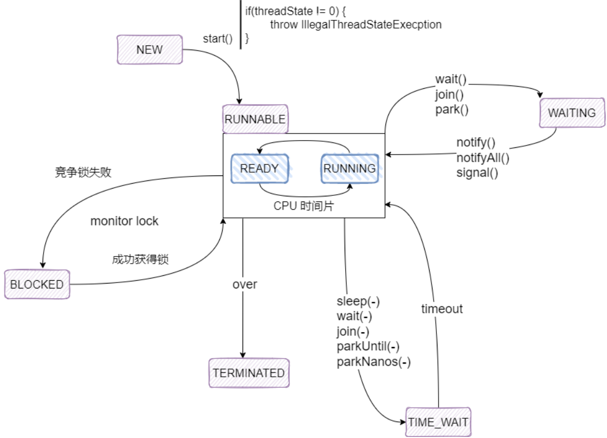

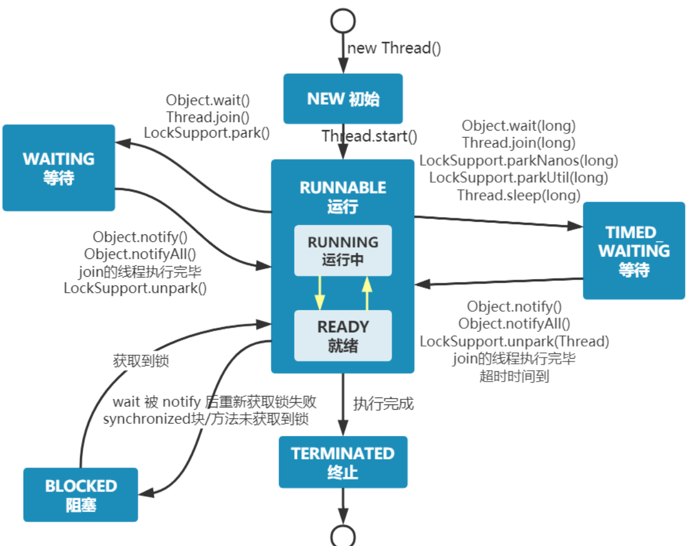

**1.NEW: 初始状态**，线程被创建出来但没有调用 `start()` 。

**2.RUNNABLE: 运行状态**，线程被**调用了start()**等待运行的状态。这整个的状态叫Runnable，内部有两个状态**(1)Ready就绪状态/(2)Running运行状态**。就绪状态是说扔到CPU的等待队列里面去排队等待CPU运行，等真正扔到CPU上去运行的时候才叫Running运行状态。（调用**yiled**时候会从Running状态跑到Ready状态去，线程配调度器选中执行的时候又从Ready状态跑到Running状态去）

**3.BLOCKED ：阻塞状态**，在同步代码块的情况就下**没得到锁**就会**阻塞状态**，获得锁的时候是就绪状态运行。

**4.WAITING：等待状态**，表示该线程需要等待其他线程做出一些特定动作（通知或中断）。

**5.TIME_WAITING：超时等待状态**，可以在指定的时间后自行返回而不是像 WAITING 那样一直等待。

**6.TERMINATED：终止状态**，表示该线程已经运行完毕。

一个线程不能调用两次start（），会抛出异常。

### JVM和操作系统管理

上面这些状态**全是由JVM管理**的，因为**JVM管理也要通过操作系统**，所以呢，那个是操作系统和那个是JVM他俩**分不开**，**JVM是跑在操作系统上的一个普通程序** 

### 线程阻塞的三种情况

当线程因为某种原因放弃 CPU 使用权后，即让出了 CPU 时间片，暂时就会停止运行，知道线程进入可运行状态（`Runnable`），才有机会再次获得 CPU 时间片转入 `RUNNING` 状态。一般来讲，阻塞的情况可以分为如下三种：

1. **等待阻塞（Object.wait -> 等待队列）** 

`RUNNING` 状态的线程执行 `Object.wait()` 方法后，JVM 会将线程放入等待序列（waitting queue）；

2. **同步阻塞（lock -> 锁池）** 

`RUNNING` 状态的线程在获取对象的同步锁时，若该 **同步锁被其他线程占用，则 JVM 将该线程放入锁池（lock pool）中**；

3. **其他阻塞（sleep/join）** 

`RUNNING` 状态的线程执行 `Thread.sleep(long ms)` 或 `Thread.join()` 方法，或发出 I/O 请求时，JVM 会将该线程置为阻塞状态。当 `sleep()` 状态超时，`join()` 等待线程终止或超时. 或者 I/O 处理完毕时，线程重新转入可运行状态（`RUNNABLE`）；

### 线程死亡的三种方式

1. **正常结束** 

`run()` 或者 `call()` 方法执行完成后，线程正常结束；

2. **异常结束** 

线程抛出一个未捕获的 `Exception` 或 `Error`，导致线程异常结束；

3. **调用 stop()** 

直接调用线程的 `stop()` 方法来结束该线程，但是一般不推荐使用该种方式，**因为该方法通常容易导致死锁**；

### 线程挂起？挂起是否也是一个状态？

Running的时候，在一个cpu上会跑很多个线程，cpu会隔一段时间执行这个线程一下，在隔一段时间执行那个线程一下，这个是cpu内部的一个调度，把这个状态线程扔出去，**从running扔回去的ready状态就叫线程被挂起**，cpu控制它。

来看一下ThraedState这段代码

```
package com.mashibing.juc.c_000;
public class T04_ThreadState {
	static class MyThread extends Thread {
		@Override
		public void run() {
			System.out.println(this.getState());
			for(int i=0; i<10; i++) {
				try {
					Thread.sleep(500);
				} catch (InterruptedException e) 
					{ e.printStackTrace();
				}
				System.out.println(i);
			}
		}
	}
	public static void main(String[] args) {
		Thread t = new MyThread();
			//怎么样得到这个线程的状态呢？就是通过getState()这个方法
		System.out.println(t.getState());//他是一个new状态
		t.start();//到这start完了之后呢是Runnable的状态
		try {
			t.join();
		} catch (InterruptedException e) 
			{ e.printStackTrace();
		}
			//然后join之后，结束了是一个Timenated状态
		System.out.println(t.getState());
	} 
}
```

### 创建启动线程的方式

**方式一、继承Thread类**，重写Thread类的**run()**

```java
Thread t = new Thread(()->{System.out.println("Hello");});
t.start();
```

**方式二、实现Runnable接口**

```java
Thread t = new Thread(new Runnable(()->{System.out.println("Hello");}));
t.start();
```

启动线程，调用当前线程的run()–>调用了Runnable类型的target的run()。

**方式三、实现Callable接口（相较于Runnable，有返回值，可以抛出异常）**

```java
Thread t = new Thread(new FutureTask<String>(new MyCall())); 
t.start();
```

通过futureTask.get()获取Callable中call方法的返回值。

步骤：
	1.创建一个实现Callable的实现类。
	2.**实现call方法**，将此线程需要执行的操作声明在call()中。
	3.创建Callable接口实现类的对象。
	4.将此Callable接口实现类的对象作为传递到FutureTask构造器中，创建FutureTask的对象。
	5.将FutureTask的对象作为参数传递到Thread类的构造器中，创建Thread对象，并调用start()。
	6.通过futureTask.get()获取Callable中call方法的返回值。

**方式四、使用线程池（好处：提高任务响应速度（不需要创建线程）、降低资源消耗（不需要重复创建）、便于线程管理）**

```java
ExecutorService pool = Executors.newCachedThreadPool(); 
pool.execute(()->{System.out.println("Hello");});
pool.shutdown();
```

步骤：
	1.以方式二或方式三创建好实现了Runnable接口的类或实现Callable的实现类。
	2.实现run或call方法。
	3.创建线程池。**（推荐通过`ThreadPoolExecutor`构造函数来创建）**
	4.调用线程池的execute方法执行某个线程，参数是之前实现Runnable或Callable接口的对象。

### 直接调Thread的run方法

new 一个 `Thread`，线程进入了新建状态。调用 `start()`方法，会启动一个线程并使线程进入了就绪状态，当分配到时间片后就可以开始运行了。 `start()` 会执行线程的相应准备工作，然后自动执行 `run()` 方法的内容，这是真正的多线程工作。 但是，**直接执行 `run()` 方法**，会把 `run()` 方法当成一个 **main线程**下的**普通方法去执行**，并**不会在某个线程中执行它**，所以这并不是多线程工作。

**总结： 调用 `start()` 方法方可启动线程并使线程进入就绪状态，直接执行的话会把 `run()` 方法当成 main 线程下的普通方法去执行不会以多线程的方式执行**

### sleep  / yield / join

Thread类中的**Yield()**可以**暂停当前正在执行的线程对象，让其它有相同优先级的线程执行**。它是一个静态方法而且只保证当前线程放弃CPU占用而不能保证使其它线程一定能占用CPU，执行yield()的线程有可能在进入到暂停状态后马上又被执行。

```java
package com.mashibing.juc.c_000; 
public class T03_Sleep_Yield_Join { 
	public static void main(String[] args) { 
			//testSleep(); 
			//testYield(); 
		testJoin();
     } 
	/*Sleep,**意思就是睡眠，当前线程暂停一段时间让给别的线程去运行。Sleep是怎么复活的？由你的睡眠时间而定，等睡眠到规定的时间自动复活***/ 
	static void testSleep() { 
		new Thread(()->{ 
			for(int i=0; i<100; i++) { 
				System.out.println("A" + i); 
				try { 
					Thread.sleep(500);
					//TimeUnit.Milliseconds.sleep(500)
				} catch (InterruptedException e) 
					{ e.printStackTrace();
				}
			}
		}).start();
	}
	/*Yield,就是当前线程正在执行的时候停止下来进入等待队列，回到等待队列里在系统的调度算法里头呢还是依然有可能把你刚回去的这个线程拿回来继续执行，当然，更大的可能性是把原来等待的那些拿出一个来执行，所以yield的意思是我让出一下CPU，后面你们能不能抢到那我不管*/
	static void testYield() {
		new Thread(()->{
			for(int i=0; i<100; i++) {
				System.out.println("A" + i);
				if(i%10 == 0) Thread.yield();
			}
		}).start();
		new Thread(()->{
			for(int i=0; i<100; i++) {
				System.out.println("------------B" + i);
				if(i%10 == 0) Thread.yield();
		}
	}).start();
}
	/*join， 意思就是在自己当前线程加入你调用Join的线程（），本线程等待。等调用的线程运行完了，自己再去执行。t1和t2两个线程，在t1的某个点上调用了t2.join,它会跑到t2去运行，t1等待t2运行完毕继续t1运行（自己join自己没有意义） */
	static void testJoin() {
		Thread t1 = new Thread(()->{
			for(int i=0; i<100; i++) {
				System.out.println("A" + i);
				try {
					Thread.sleep(500);
					//TimeUnit.Milliseconds.sleep(500)
				} catch (InterruptedException e) {
					e.printStackTrace();
				}
			}
		});
		Thread t2 = new Thread(()->{
			try {
				t1.join();
			} catch (InterruptedException e) { e.printStackTrace();
		}
		for(int i=0; i<100; i++) {
			System.out.println("A" + i);
			try {
				Thread.sleep(500);
				//TimeUnit.Milliseconds.sleep(500)
			} catch (InterruptedException e) 
				{ e.printStackTrace();
				}
			}
		});
		t1.start();
		t2.start();
	}
}
```

### 停止线程的方式

1. 使用**标志位**终止线程：t.exit = true; //修改标志位，退出线程
2. 使用**stop（）**终止线程。（不安全）
3. 使用**interrupt（）**中断线程。（调用 interrupt() 方法仅仅是在当前线程中打一个停止的标记，并不是真的停止线程。）

​	interrupted() 和 isInterrupted()的主要区别是前者会将中断状态清除而后者不会。

### 线程通信方式

**1.共享内存**：用**volatile**修饰的变量作为信号量来进行通信。

**2.消息传递**：通过wait/notify/join等方法进行阻塞唤醒来进行通信。

**3.管道输入/输出流**

### 守护线程是什么？

守护线程是运行在后台的一种特殊进程。它独立于控制终端并且周期性地执行某种任务或等待处理某些发生的事件。在 Java 中垃圾回收线程就是特殊的守护线程。

### Fork/Join框架

Fork/Join框架是Java7提供的一个用于并行执行任务的框架，是一个把大任务分割成若干个小任务，最终汇总每个小任务结果后得到大任务结果的框架。

Fork/Join框架需要理解两个点，**「分而治之」**和**「工作窃取算法」**。

**「分而治之」**

以上Fork/Join框架的定义，就是分而治之思想的体现啦

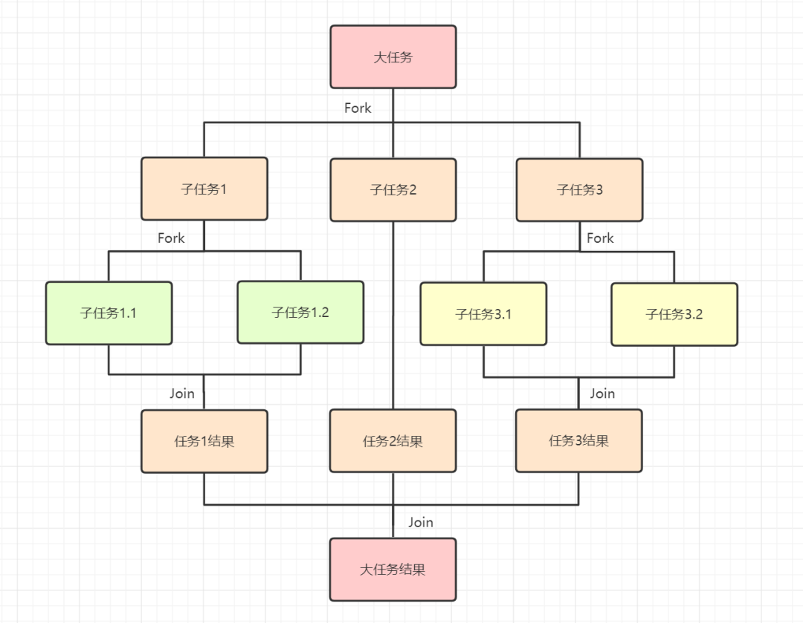

**「工作窃取算法」**

把大任务拆分成小任务，放到不同队列执行，交由不同的线程分别执行时。有的线程优先把自己负责的任务执行完了，其他线程还在慢慢悠悠处理自己的任务，这时候为了充分提高效率，就需要工作盗窃算法啦~

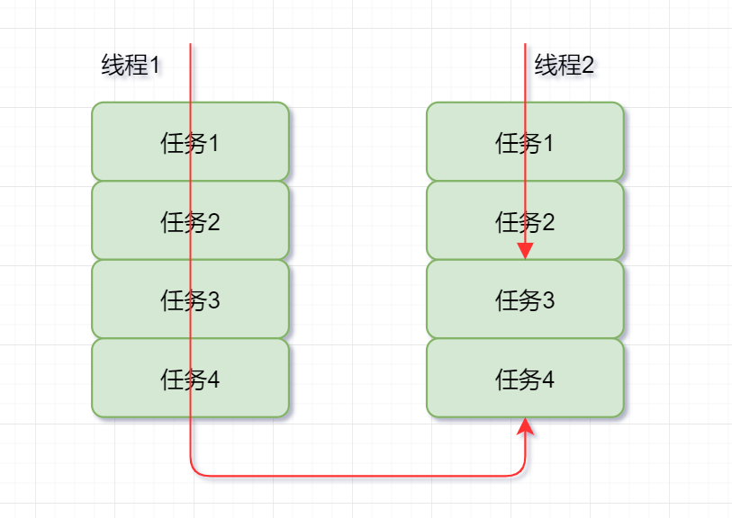


工作盗窃算法就是，**「某个线程从其他队列中窃取任务进行执行的过程」**。一般就是指做得快的线程（盗窃线程）抢慢的线程的任务来做，同时为了减少锁竞争，通常使用双端队列，即快线程和慢线程各在一端。

## 线程池

线程池就是管理一系列线程的资源池。当有任务要处理时，直接从线程池中获取线程来处理，处理完之后**不会立即被销毁**，而是等待下一个任务。

**池化技术**主要是为了减少每次获取**资源消耗**，提高对资源的**利用率**。

**使用线程池的好处**：

- **降低资源消耗**。通过**重复利用已创建**的线程**降低线程创建和销毁造成的消耗**。
- **提高响应速度**。当任务到达时，任务可以不需要等到线程创建就能**立即执行**。
- **提高线程的可管理性**。线程是稀缺资源，如果无限制的创建，不仅会消耗系统资源，还会降低系统的稳定性，使用线程池可以进行**统一的分配，调优和监控**。

### 线程池核心参数

- **`corePoolSize` :** 核心线程数线程数定义了最小可以同时运行的线程数量。
- **`maximumPoolSize` :** 当队列中存放的任务达到队列容量的时候，当前可以同时运行的线程数量变为最大线程数。
- **`workQueue`:** 当新任务来的时候会先判断当前运行的线程数量是否达到核心线程数，如果达到的话，新任务就会被存放在队列中。
- keepAliveTime ：非核心线程的心跳时间。如果非核心线程在keepAliveTime内没有运行任务，非核心线程会消亡。
- defaultHandler ：饱和策略。ThreadPoolExecutor类中一共有4种饱和策略。通过实现**RejectedExecutionHandler**接口。
  - AbortPolicy ： 线程任务丢弃报错。默认饱和策略。
  - DiscardPolicy ： 线程任务直接丢弃不报错。
  - DiscardOldestPolicy ： 将workQueue**队首任务丢弃**，将最新线程任务重新加入队列执行。
  - CallerRunsPolicy ：线程池之外的线程直接调用run方法执行。
- ThreadFactory ：线程工厂。新建线程工厂。


### 线程数的设置

- **CPU 密集型任务(N+1)：** 这种任务消耗的主要是 CPU 资源，可以将线程数设置为 N（CPU 核心数）+1，比 CPU 核心数多出来的一个线程是为了防止线程偶发的缺页中断，或者其它原因导致的任务暂停而带来的影响。一旦任务暂停，CPU 就会处于空闲状态，而在这种情况下多出来的一个线程就可以充分利用 CPU 的空闲时间。
- **I/O 密集型任务(2N)：** 这种任务应用起来，系统会用大部分的时间来处理 I/O 交互，而线程在处理 I/O 的时间段内不会占用 CPU 来处理，这时就可以将 CPU 交出给其它线程使用。因此在 I/O 密集型任务的应用中，我们可以多配置一些线程，具体的计算方法是 2N。（最佳线程数目 = （**线程等待**时间/线程**CPU计算时间** + **1**） X  **CPU数目**）用**jvisualvm**抽样来估计这两个时间。

```java
CPU核数*2
CPU核数/(1-阻塞系数) 阻塞系数在0.8~0.9之间
查看CPU核数：
System.out.println(Runtime.getRuntime().availableProcessors());
```

当以上都不适用时，选用动态化线程池，看美团技术团队的实践：https://tech.meituan.com/2020/04/02/java-pooling-pratice-in-meituan.html

### 常见的线程池

**1. FixedThreadPool**：可重用固定线程数的线程池。核心线程数等于最大线程数（new时指定）

**问题：**`FixedThreadPool` 使用无界队列 `LinkedBlockingQueue`（队列的容量为 Integer.MAX_VALUE）作为线程池的工作队列会对线程池带来如下影响 ：

1. 当线程池中的线程数达到 `corePoolSize` 后，新任务将在无界队列中等待，因此线程池中的线程数不会超过 corePoolSize；
2. 由于使用无界队列时 `maximumPoolSize` 将是一个无效参数，因为不可能存在任务队列满的情况。所以，通过创建 `FixedThreadPool`的源码可以看出创建的 `FixedThreadPool` 的 `corePoolSize` 和 `maximumPoolSize` 被设置为同一个值。
3. 由于 1 和 2，使用无界队列时 `keepAliveTime` 将是一个无效参数；
4. 运行中的 `FixedThreadPool`（未执行 `shutdown()`或 `shutdownNow()`）不会拒绝任务，在任务比较多的时候会导致 OOM（内存溢出）。

**2. SingleThreadExecutor**：只有一个线程的线程池。核心线程数和最大线程数都被设置为 1.其他参数和 `FixedThreadPool` 相同。所有任务按照指定顺序(FIFO, LIFO, 优先级)执行。

问题同上：等待队列不会满，直接OOM。

**3. CachedThreadPool**：一个会根据需要创建新线程的线程池。（`corePoolSize` 被设置为空（0），`maximumPoolSize`被设置为 `Integer.MAX.VALUE`，即它是无界的，这也就意味着如果主线程提交任务的速度高于 `maximumPool` 中线程处理任务的速度时，`CachedThreadPool` 会**不断创建新的线程**。极端情况下，这样会导致耗尽 cpu 和内存资源。）

如果工作线程**空闲了指定的时间(默认为1分钟)**，则该工作线程将**自动终止**。

**4. ScheduledThreadPoolExecutor**：在给定的延迟后运行任务，或者定期执行任务。

### 创建线程池

方式一：通过**ThreadPoolExecutor**构造函数来创建（**推荐**）。

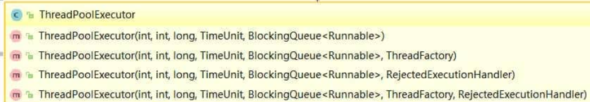

方式二：通过 **Executor**框架的工具类 **Executors**来创建。**为什么不推荐**

阿里巴巴Java开发手册中提到，不要使用 Executors 创建线程池，一方面为了明确线程池的使用规则，另一方面**防止资源耗尽**。

```java
public class Foo {
    public static void main(String[] args) {
        //同步队列，根据实际情况调整线程数量，最大线程数为 Integer.MAX_VALUE，可能导致资源耗尽
        Executors.newCachedThreadPool();
        //固定线程数量，fixed指的是核心线程数和最大线程数相等，阻塞队列无边界，可以放入无限多任务
        Executors.newFixedThreadPool(10);
        //所有任务由一个线程执行，阻塞队列无边界
        Executors.newSingleThreadExecutor();
        //延时队列，在给定的延迟后运行任务或者定期执行任务，最大线程数 Integer.MAX_VALUE
        Executors.newScheduledThreadPool(10);
```

### 线程池状态

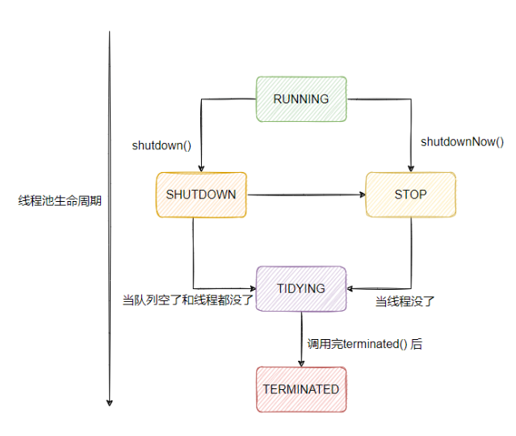 

- 线程池创建后处于**RUNNING**状态。
- 调用**shutdown()**方法后处于**SHUTDOWN**状态，线程池不能接受新的任务，清除一些空闲worker，等待阻塞队列的任务完成。
- 调用shutdownNow()方法后处于**STOP**状态，线程池不能接受新的任务，中断所有线程，阻塞队列中没有被执行的任务全部丢弃。此时，poolsize=0,阻塞队列的size也为0。
- 当所有的任务已终止，ctl记录的”任务数量”为0，线程池会变为**TIDYING**状态。接着会执行terminated()函数。

### 线程池方法

**execute**（）：用于提交**不需要返回值**的任务，无法判断任务是否被线程池执行成功与否。（和**Runnable**一起用）

**submit**（）：会返回一个**Future**对象，通过Future对象的**get（）**获取**返回值**。（和**Callable**一起用）

**addWorker**（）： 这个方法主要用来**创建新的工作线程**，如果返回 **true** 说明创建和启动工作线程成功，否则的话返回的就是 **false**。

**shutdown**（）:关闭线程池，线程池的状态变为 **SHUTDOWN**。线程池不再接受新任务了，但是**队列里的任务得执行完毕**。

**shutdownNow**（） :关闭线程池，线程的状态变为 STOP。线程池会**终止当前正在运行的任务**，并停止处理排队的任务并**返回正在等待执行的 List**。

**isShutDown**当调用 shutdown()方法后返回为 true。

**isTerminated**当调用 shutdown()方法后，并且所有提交的任务完成后返回为 true

###  execute()和submit()

* **`execute()` 方法用于提交不需要返回值的任务，所以无法判断任务是否被线程池执行成功与否；**

* **submit()方法用于提交需要返回值的任务。线程池会返回一个future类型的对象，通过这个future对象可以判断任务是否执行成功**，并且可以通过future的get()方法来获取返回值，get()方法会阻塞当前线程直到任务完成，而使用 `get（long timeout，TimeUnit unit）`方法则会阻塞当前线程一段时间后立即返回，这时候有可能任务没有执行完。

### [如何优雅关闭线程池](https://segmentfault.com/a/1190000038258152)

大量的线程常驻在后台对系统资源的占用是巨大的 ，甚至引发异常

在 `Java` 中和关闭线程池相关的方法主要有如下：

- void shutdown()
- List<Runnable> shutDownNow()
- boolean awaitTermination()
- boolean isShutDown()
- boolean isTerminated()

void **ShutDown**

所有线程会正常执行结束后再关闭线程池，对于 ShutDown() 而言它可以**安全的停止一个线程池**，它有几个关键点

- `ShutDown` 会首先将线程设置成 SHUTDOWN 状态，然后中断所有没有正在运行的线程
- 正在执行的线程和已经在队列中的线程并不会被中断，说白了就是使用 shutDown() 方法其实就是要等待所有任务正常全部结束以后才会关闭线程池
- 调用 shutdown() 方法后如果还有新的任务被提交，线程池则会根据**拒绝策略直接拒绝后续新提交**的任务。

List<Runnable> **ShutDownNow**

- 当执行`shutDownNow` 方法后，会向全部正在运行的队列通知中断，**正在运行的线程接收到中断信号后选择处理**，而在队列中的全部取消执行转移到一个`list`队列中返回，如上述 `List<Runnable> runnables` ，这里记录了所有终止的线程

**boolean awaitTermination_(_long timeout, TimeUnit unit_)_**

- 这个方法的作用是，调用后等待**timeout**时间后，**反馈线程池的状态**
- 等待期间（包括进入等待状态之前）线程池已关闭并且所有已提交的任务（包括正在执行的和队列中等待的）**都执行完毕**，相当于线程池已经“终结”了，方法便会**返回 true**；
- **timeout**时间后，**有线程未执行完**，返回 **false**；
- 等待期间线程**被中断**，方法会抛出 **InterruptedException** 异常。

**isShutDown()** 

一般用于判断是否可以再提交任务

- `isShutDown` 方法正如名字，判断线程池是否停止，返回的是 `Boolean` 类型，如果已经开始停止线程池则返回 `true` 否则放回false
- 当调用了`shutDown` 或`shutDownNow` 时之后，会返回 `true` 不过需要注意，这时候只是代表线程池关闭流程的开始，并不是说线程池已经停止了

**isTerminated()**

一般用于判断所有任务是否全部已完成

- 这个方法与上面的方法的区别就是这是正真检测线程池是否真的终结了
- 这不仅代表线程池已关闭，同时代表线程池中的所有任务都已经都执行完毕了，因为在调用 `shutdown `方法之后，线程池会继续执行里面未完成的任务，包括正在执行的任务和在任务队列中等待的任务。
- 如果调用了 `shutdown` 方法，但是有一个线程依然在执行任务，那么此时调用 `isShutdown `方法返回的是 `true`，而调用 `isTerminated`方法返回的便是 `false`，因为线程池中还有任务正在在被执行，线程池并没有真正“终结”。
- 直到所有任务都执行完毕了，调用 `isTerminated() `方法才会返回 `true`，这表示线程池已关闭并且线程池内部是空的，所有剩余的任务都执行完毕了。

### 饱和拒绝策略

- **ThreadPoolExecutor.AbortPolicy** ：**默认**抛出 RejectedExecutionException来**拒绝新任务**的处理。
- **ThreadPoolExecutor.CallerRunsPolicy** ：**调用执行自己的线程**运行任务。
- **ThreadPoolExecutor.DiscardPolicy** ：不处理新任务，**直接丢弃**掉。
- **ThreadPoolExecutor.DiscardOldestPolicy** ： 此策略将**丢弃最早未处理**的任务请求。


### 阻塞队列

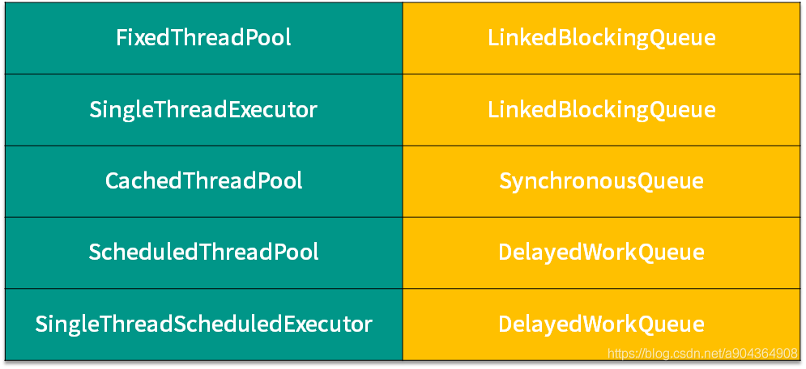

- **ArrayBlockingQueue** 是一个基于数组结构的**有界阻塞队列**，此队列按 FIFO（**先进先出**）原则 对元素进行排序。 
- **LinkedBlockingQueue** 一个基于链表结构的**阻塞队列（无界队列）**，此队列按FIFO （**先进先出**） 排序元素，**吞吐量**通常要**高于 ArrayBlockingQueue** 。 
- **SynchronousQueue同步队列** 一个**不存储元素的阻塞队列 **。
-  **PriorityBlockingQueue** 一个**具有优先级的无限阻塞队列**。 PriorityBlockingQueue 也是基于**最小二叉堆**实现。

- **DelayedWorkQueue（延迟阻塞队列）**：`ScheduledThreadPool` 和 `SingleThreadScheduledExecutor` 。`DelayedWorkQueue` 的内部元素并不是按照放入的时间排序，而是会按照**延迟的时间长短**对任务进行排序，内部采用的是“**堆**”的数据结构，可以保证每次出队的任务都是当前队列中执行时间最靠前的。`DelayedWorkQueue` 添加元素满了之后会**自动扩容原来容量的 1/2**，即**永远不会阻塞**，最大扩容可达 `Integer.MAX_VALUE`，所以**最多只能创建核心线程数**的线程。

### 线程如何被回收

超过 **corePoolSize** 的**空闲线程**由线程池回收，线程池 Worker启动跑第一个任务之后就**一直循环遍历线程池任务队列**，超过**指定超时时间**获取不到任务就 **remove** Worker，最后由**垃圾回收器回收**。

### 工作原理简述

addWork(command, true) ----> offer() ----> addWork(null, false) ----> reject()

 

1. 线程总数量 < corePoolSize，无论线程是否空闲，都会新建一个核心线程执行任务（让核心线程数量快速达到corePoolSize，在核心线程数量 < corePoolSize时）。**注意，这一步需要获得全局锁。**(可以使用preStartAllCoreThreads()预加载所有核心线程)
2. 线程总数量 >= corePoolSize时，新来的线程任务会进入任务队列中等待，然后空闲的核心线程会依次去缓存队列中取任务来执行（体现了**线程复用**）。
3. 当缓存队列满了，需要创建非核心线程去执行这个任务。**注意，这一步需要获得全局锁。**
4. 缓存队列满了， 且总线程数达到了maximumPoolSize，则会采取上面提到的拒绝策略进行处理。

### [源码解析](https://www.cnblogs.com/tomakemyself/p/14018814.html)

核心方法 **execute**()

```java
public void execute(Runnable command) {
    if (command == null)
        throw new NullPointerException();   
    int c = ctl.get();
    // 1.当前线程数小于corePoolSize,则调用addWorker创建核心线程执行任务
    if (workerCountOf(c) < corePoolSize) {
       if (addWorker(command, true))
           return;
       c = ctl.get();
    }
    // 2.如果不小于corePoolSize，则将任务添加到workQueue队列。
    if (isRunning(c) && workQueue.offer(command)) {
        int recheck = ctl.get();
        // 2.1 如果isRunning返回false(状态检查)，则remove这个任务，然后执行拒绝策略。
        if (! isRunning(recheck) && remove(command))
            reject(command);
            // 2.2 线程池处于running状态，但是没有线程，则创建线程
        else if (workerCountOf(recheck) == 0)
            addWorker(null, false);
    }
    // 3.如果放入workQueue失败，则创建非核心线程执行任务，
    // 如果这时创建非核心线程失败(当前线程总数不小于maximumPoolSize时)，就会执行拒绝策略。
    else if (!addWorker(command, false))
         reject(command);
}
```

### [Java线程池是如何保证核心线程不被销毁的](https://blog.csdn.net/smile_from_2015/article/details/105259789)

### 源码中线程池是怎么复用线程的？

源码中ThreadPoolExecutor中有个内置对象Worker，每个worker都是一个线程，worker线程数量和参数有关，每个worker会while死循环从阻塞队列中取数据，**通过置换worker中Runnable对象，运行其run方法起到线程置换的效果**，这样做的好处是避免多线程频繁线程切换，提高程序运行性能。

###  手写线程池

```java
public class ZmxThreadPool {
    BlockingQueue<Runnable> taskQueue;
    List<WorkThread> threads;
    public ZmxThreadPool(BlockingQueue<Runnable> taskQueue, int capacity) {
        this.taskQueue = taskQueue;
        this.threads  = new ArrayList<>();
        for(int i = 0; i < capacity; i++) {
            WorkThread workThread = new WorkThread("Work-" + i);
            workThread.start();
            threads.add(workThread);
        }
    }
    class WorkThread extends Thread{
        public WorkThread(String name) {
            super(name);
        }
        @Override
        public void run() {
            while(true) {
                Runnable task = null;
                try {
                    task = taskQueue.take();
                } catch (InterruptedException e) {
                    e.printStackTrace();
                }
                task.run();
            }
        }
    }
    void execute(Runnable task) throws InterruptedException {
//        taskQueue.put(task); // 队列满时 put方法会被阻塞等待
        taskQueue.add(task); // 队列满时 add方法会直接报错：Queue full
    }
    public static void main(String[] args) throws InterruptedException {
        final int NUM = 10;
        ZmxThreadPool threadPool = new ZmxThreadPool(new ArrayBlockingQueue<>(8), 5);
//        System.out.println("threadPool = " + threadPool);
        for(int i = 0; i < NUM; i++) {
            threadPool.execute(() -> {
                System.out.println(Thread.currentThread().getName() + " execute a task.... ");
                try {
                    Thread.sleep(1000);
                } catch (InterruptedException e) {
                    throw new RuntimeException(e);
                }
            });
        }
    }
}
```

### 使用线程池案例&参数设置

使用多线程的目的：是充分利用多核 CPU 资源，在尽可能减少线程上下文切换的同时，充分利用线程等待的 CPU 空闲时间

线程池大小需要参考的因素：

1. 机器当前 CPU 占用率
2. 当前程序已启动线程数目
3. **当前任务 I/O 执行时间和运算时间占比**

参数设置

> 网上有一个流传的公式：CPU 密集型设置为 CORE_NUM + 1，I/O 密集型 CORE_NUM * 2 + 1，考虑是否 I/O 密集是没错的，但是这样的设置比较绝对，我想一般没有人这么用；一般的后端系统都是伴随着数据处理+网络I/O+数据库I/O，所以重要的是二者的比例，理论上，如果没有 I/O 操作的话，线程数设置为 CORE_NUM 就可以了，这样做使得每个内核同时执行的话都跑满；这时如果 I/O 时间越多，就意味着 CPU 空闲时间越长，就可以开更多的线程提高利用率，所以我觉得如果一定要有一个参考公式的话应该用
>
> Nthreads = Ncores x Ruse x (R(IO / 计算) + 1)

使用经验

> 我做过一个核酸检测结果统计的项目，由于政府提供的接口只能一条一条的查询，即使我们把数据库存储优化到极致，也没办法突破每个查询的200ms 的网络等待，项目最初就是一个一天一次的半夜定时任务，一次执行要3-4个小时，计算时间，也就是内存的操作时间很短，理论上可以开 CORE_NUM 好几倍的线程数，但是考虑到网络超时的问题，最后设置的是 2 * CORE_NUM，时间降低到几分钟，就可以使用一个异步的**观察者模式**手动触发然后统计报表。

### 线程调度算法

1. **先到先服务**(FCFS)调度算法 : 从就绪队列中选择一个最先进入该队列的进程为之分配资源，使它立即执行并一直执行到完成或发生某事件而被阻塞放弃占用 CPU 时再重新调度。

2. **短作业优先**(SJF)的调度算法 : 从就绪队列中选出一个估计运行时间最短的进程为之分配资源，使它立即执行并一直执行到完成或发生某事件而被阻塞放弃占用 CPU 时再重新调度。

3. **时间片轮转**调度算法 : 时间片轮转调度是一种最古老，最简单，最公平且使用最广的算法，又称 RR(Round robin)调度。每个进程被分配一个时间段，称作它的时间片，即该进程允许运行的时间。

4. **多级反馈队列**调度算法 ：前面介绍的几种进程调度的算法都有一定的局限性。如短进程优先的调度算法，仅照顾了短进程而忽略了长进程 。多级反馈队列调度算法既能使高优先级的作业得到响应又能使短作业（进程）迅速完成（综合时间片轮转算法和最高优先级算法）。因而它是目前被公认的一种较好的进程调度算法，UNIX操作系统采取的便是这种调度算法。

   - 「多级」表示有多个队列，每个队列优先级从高到低，同时优先级越高时间片越短。

   - 「反馈」表示如果有新的进程加入优先级高的队列时，立刻停止当前正在运行的进程，转而去运行优先级高的队列；

5. **优先级调度** ： 优先级 = （等待时间+要求服务时间）/要求服务时间，为每个流程分配优先级，首先执行具有最高优先级的进程，依此类推。具有相同优先级的进程以FCFS 方式执行。可以根据内存要求，时间要求或任何其他资源要求来确定优先级。

### Executor和Executors

Executors 工具类的不同方法按照我们的需求创建了不同的线程池，来满足业务的需求。

Executor 接口对象能执行我们的线程任务。ExecutorService接口继承了Executor接口并进行了扩展，提供了更多的方法我们能获得任务执行的状态并且可以获取任务的返回值。

使用ThreadPoolExecutor 可以创建自定义线程池。Future 表示异步计算的结果，他提供了检查计算是否完成的方法，以等待计算的完成，并可以使用get()方法获取计算的结果。

## 堆和栈的区别

**1、堆栈空间分配区别**

栈（操作系统）：由**操作系统（编译器）自动分配释放** ，存放**函数的参数值，局部变量的值**等。其操作方式类似于数据结构中的栈。栈小堆大

堆（操作系统）： 一般由**程序员分配释放**， 若程序员不释放，程序结束时可能由操作系统OS回收。所以有**内存泄露**的风险。**堆存放对象**等，具体存放内容是由程序员来填充的。

**2、堆栈缓存方式区别**

栈使用的是**一级缓存**， 它们通常都是被调用时处于存储空间中，调用完毕立即释放。

堆则是存放在**二级缓存**中，生命周期由虚拟机的垃圾回收算法来决定（并不是一旦成为孤儿对象就能被回收）。所以调用这些对象的速度要相对来得低一些。

**3、堆栈数据结构区别**

堆（数据结构）：堆可以被看成是一棵树，如：堆排序。

栈（数据结构）：一种先进后出的数据结构。


（补充）

生长方向不同。堆的生长方向向上，内存地址由低到高；栈的生长方向向下，内存地址由高到低。

分配方式不同。堆都是动态分配的，没有静态分配的堆。栈有 2 种分配方式：静态分配和动态分配。静态分配是由操作系统完成的，比如局部变量的分配。动态分配由alloca()函数分配，但是栈的动态分配和堆是不同的，它的动态分配是由操作系统进行释放，无需我们手工实现。

分配效率不同。栈由操作系统自动分配，会在硬件层级对栈提供支持：分配专门的寄存器存放栈的地址，压栈出栈都有专门的指令执行，这就决定了栈的效率比较高。堆则是由C/C++提供的库函数或运算符来完成申请与管理，实现机制较为复杂，频繁的内存申请容易产生内存碎片。显然，堆的效率比栈要低得多。

存放内容不同。栈存放的内容，函数返回地址、相关参数、局部变量和寄存器内容等。当主函数调用另外一个函数的时候，要对当前函数执行断点进行保存，需要使用栈来实现，首先入栈的是主函数下一条语句的地址，即扩展指针寄存器的内容（EIP），然后是当前栈帧的底部地址，即扩展基址指针寄存器内容（EBP），再然后是被调函数的实参等，一般情况下是按照从右向左的顺序入栈，之后是被调函数的局部变量，注意静态变量是存放在数据段或者BSS段，是不入栈的。出栈的顺序正好相反，最终栈顶指向主函数下一条语句的地址，主程序又从该地址开始执行。堆，一般情况堆顶使用一个字节的空间来存放堆的大小，而堆中具体存放内容是由程序员来填充的。

## Runnable和Callable

- Callable仅在 Java 1.5 中引入,目的就是为了来处理Runnable不支持的用例。Callable 接口可以返回结果或抛出检查异常
- Runnable 接口不会返回结果或抛出检查异常，
- 如果任务不需要返回结果或抛出异常推荐使用 Runnable接口，这样代码看起来会更加简洁
- 工具类 Executors 可以实现 Runnable 对象和 Callable 对象之间的相互转换。（Executors.callable（Runnable task）或 Executors.callable（Runnable task，Object resule））

## shutdown和shutdownNow

- shutdown() ：关闭线程池，线程池的状态变为 **SHUTDOWN**/此时**isShutdown()返回true**。但是**队列里的任务得执行完毕**/此时**isTerminated()返回true**。

- shutdownNow()：关闭线程池，线程的状态变为 **STOP**。线程池会**终止所有任务**并返回正在等待执行的 List。 原理是遍历线程池中的工作线程，然后逐个调用线程的**interrupt方法来中断线程**，所以**无法响应中断的任务可能永远无法终止**

## sleep和wait

**共同点** ：两者都可以**暂停线程**的执行。

|      0000000       |                            sleep                             |                             wait                             |
| :----------------: | :----------------------------------------------------------: | :----------------------------------------------------------: |
| **所属的类型**不同 |   **Thread类**的静态方法，调用后进入**TIMED_WTING**状态。    |        **Object类**的实例方法 调用后进入**WTING**状态        |
| **对锁的依赖**不同 | **不依赖于任何锁**，没有释放锁，所以在调用后它也会**释放锁**。 | 依赖于**synchronized锁**，它必须通过监视器进行调用，在调用后线程会释放锁 |
| **返回的条件**不同 |                    超时时间到达后自动返回                    | 需要由 **notify()/notify 从而返回**，**notify（）可能造成死锁，notifyAll（）不会。** |
|  **使用范围**不同  |                  必须在**同步代码块**中使用                  |                         **任意地方**                         |
|  **异常**处理不同  |                      **不需要**捕获异常                      |                       **需要**捕获异常                       |

**notify（）可能造成死锁，notifyAll（）不会。**

**补充：在生产环境中，不使用 sleep() 的原因**

[resons](https://stackoverflow.com/questions/9417260/when-is-it-sensible-to-use-thread-sleep)

> 首先在任何情况下不要用 sleep() 完成线程间同步
>
> 不要在 UI 层使用 sleep() 
>
> 不要用 sleep() 做精确定时任务

**实战（记录一次code review）**

[来源](http://www.qat.com/using-waitnotify-instead-thread-sleep-java/)

> 在做代码检查的时候遇到过一次误用 sleep() 的案例
>
> 这个同学要实现的是一个图片处理和上传功能，为了实现异步，开启一个线程完成图片处理的功能，主线程完成其它操作后，等待处理结束，完成上传。
>
> 他的做法是在主线程使用一个 while 循环不断的进行 boolean check，没完成处理的情况下就 sleep，这明显是线程同步的一个误用，等待时间短会频繁的进行 boolean check，时间长可能造成响应变慢。应当使用等待通知机制。

##  wait不定义在Thread

`wait()` 是让**获得对象锁的线程实现等待**，会**自动释放**当前线程占有的**对象锁**。每个对象（`Object`）都拥有对象锁，既然要**释放当前线程占有的对象锁**并让其进入 **WAITING** 状态，自然是要操作对应的对象（`Object`）而非当前的线程（`Thread`）。

类似的问题：**为什么 `sleep()` 方法定义在 `Thread` 中？**

因为 `sleep()` 是让**当前线程暂停**执行，**不涉及到对象类**，也**不需要获得对象锁**。


## 并发编程三个重要特性

- **原子性** : 一次操作或者多次操作，要么所有的操作全部都得到执行并且不会受到任何因素的干扰而中断，要么都不执行。
- **可见性** ：当一个线程对共享变量进行了修改，那么另外的线程都是立即可以看到修改后的最新值。
- **有序性** ：代码在执行的过程中的先后顺序，Java 在编译器以及运行期间的优化，代码的执行顺序未必就是编写代码时候的顺序。

**volatile 能保证数据的可见性和有序性，但不能保证数据的原子性**

**synchronized 能保证可见性和原子性**，**都能保证**，但**无法禁止指令重排和处理器优化**的

## volatile

**可见性** ：将变量声明为 **`volatile`** ，这就指示 JVM，这个变量是**共享且不稳定的**，每次使用它都到**共享主内存**中进行读取。

**有序性** ：在对这个变量进行读写操作的时候，会通过插入特定的 **内存屏障** 的方式来**禁止指令重排序**。

**volatile双重校验锁实现对象单例（线程安全）** 

```java
public class Singleton {
    private volatile static Singleton uniqueInstance;
    private Singleton() {}
    public  static Singleton getUniqueInstance() {
       //先判断对象是否已经实例过，没有实例化过才进入加锁代码
        if (uniqueInstance == null) {
            //类对象加锁
            synchronized (Singleton.class) {
                if (uniqueInstance == null) {
                    uniqueInstance = new Singleton();
                }
            }
        }
        return uniqueInstance;
    }
}
```

`uniqueInstance` 采用 `volatile` 关键字修饰也是很有必要的， `uniqueInstance = new Singleton();` 这段代码其实是分为三步执行：

1. 为 `uniqueInstance` 分配内存空间
2. 初始化 `uniqueInstance`
3. 将 `uniqueInstance` 指向分配的内存地址

但是由于 JVM 具有**指令重排**的特性，执行顺序有可能变成 1->3->2。**指令重排在单线程环境下不会出现问题**，但是在**多线程环境下**会导致一个线程**获得还没有初始化的实例**。例如，线程 T1 执行了 1 和 3，此时 T2 调用 `getUniqueInstance`() 后发现 `uniqueInstance` 不为空，因此返回 `uniqueInstance`，但此时 `uniqueInstance` 还未被初始化。

## synchronized

**`synchronized` 解决的是多个线程之间访问资源的同步性**

**`synchronized`可以保证被它修饰的方法或者代码块在任意时刻只能有一个线程执行。**

三种使用方式：获取的是对象监视器**`monitor`**（**不能修饰构造方法，本身就是线程安全**）

**1.修饰实例方法:** 作用于当前对象实例加锁，进入同步代码前要获得 **当前对象实例的锁**。

**2.修饰静态方法:** 也就是给当前类加锁，进入同步代码前要获得 **当前 class 的锁**。（与第一种不互斥）（ACC_SYNCHRONIZED 修饰）

**3.修饰代码块** ：指定加锁对象，对给定对象/类加锁。`synchronized(this|object)` 表示进入同步代码库前要获得**给定对象的锁**。`synchronized(类.class)` 表示进入同步代码前要获得 **当前 class 的锁**。（通过使用 monitorenter 和 monitorexit 指令实现的）

## ReentrantLock

ReetrantLock是一个**可重入的独占锁**，主要有两个特性，一个是**支持公平锁和非公平锁**，一个是**可重入**。**默认使用非公平锁**
ReetrantLock实现**依赖于AQS**(AbstractQueuedSynchronizer)。

ReetrantLock主要**依靠AQS维护一个阻塞队列**，多个线程对加锁时，**失败则会进入阻塞队列。等待唤醒，重新尝试加锁**。

## ReadWriteLock

ReentrantLock某些时候有局限，本身是为了防止线程A在写数据、线程B在读数据造成的数据不一致，但这样，**如果线程C在读数据、线程D也在读数据，读数据是不会改变数据的，加锁降低了程序的性能**。

因为这个，才诞生了读写锁ReadWriteLock。ReadWriteLock是一个读写锁接口，**ReentrantReadWriteLock**是**ReadWriteLock接口**的一个**具体实现**，实现了**读写的分离，读锁是共享的，写锁是独占的，读和读之间不会互斥，读和写、写和读、写和写之间才会互斥**，提升了读写的性能

## synchronized和volatile

`synchronized` 和 `volatile` 是**互补**的，而不是对立的！

- `volatile` 关键字是**线程同步的轻量级实现**，所以 `volatile`性能肯定比`synchronized`要好 。但是 `volatile` **只能用于变量**而 `synchronized` 可以修饰**变量. 方法. 和类级别**
- `volatile` 能保证数据的**可见性**和**有序性**不能保证**原子性**，**不会被编译器优化**。`synchronized` **都能保证**，但**无法禁止指令重排和处理器优化**的
- `volatile`主要用于解决变量在多个线程之间的**可见性**，而 `synchronized` 解决的是多个线程之间**访问资源的同步性**。

##  synchronized和Lock

-  synchronized 可以给**类. 方法. 代码块**加锁；而 lock **只能给代码块**加锁。 
-  synchronized 不需要手动获取锁和释放锁，使用简单，**发生异常会自动释放锁，不会造成死锁**；而 lock **需要自己加锁和释放锁**，如果使用不当没有 unLock()去释放锁就**会造成死锁**。 
-  通过 **Lock 可以知道有没有成功获取锁**，而 synchronized 却无法办到。

## synchronized和ReentrantLock

synchronized关键字依赖于 **JVM（虚拟机层面**）；

ReentrantLock 依赖于 **API（JDK层面**）依赖于**AQS**需要通过lock（）和unlock（）实现。

ReentrantLock的高级功能：

- **等待可中断**，持有锁的线程长期不释放的时候，正在等待的线程可以**选择放弃等待**（即**中断**），这相当于 Synchronized来说可以**避免出现死锁**的情况。
-  **可以实现公平锁**。

-  **锁可以绑定多个条件**，一个ReentrantLock对象可以同时绑定多个对象。（通过Condition接口与`newCondition()`方法）

## synchronized和ReentrantLock

**1.两者都是可重入锁**

可重入锁：重入锁，也叫做递归锁，可重入锁指的是在一个线程中可以多次获取同一把锁，比如： 
一个线程在执行一个带锁的方法，该方法中又调用了另一个需要相同锁的方法，则该线程可以直接执行调用的方法，而无需重新获得锁， 
两者都是同一个线程每进入一次，锁的计数器都自增1，所以要等到锁的计数器下降为0时才能释放锁。

**2.synchronized 依赖于 JVM 而 ReentrantLock 依赖于 API**

- **synchronized 是依赖于 JVM 实现的**，前面我们也讲到了 虚拟机团队在 JDK1.6 为 synchronized 关键字进行了很多优化，但是这些优化都是在虚拟机层面实现的
- **ReentrantLock 是 JDK 层面实现的**（也就是 API 层面，**需要 lock() 和 unlock() 方法配合 try/finally** 语句块来完成）

**3.ReentrantLock 比 synchronized 增加了一些高级功能**

相比synchronized，ReentrantLock增加了一些高级功能。主要来说主要有三点：①等待可中断；②可实现公平锁；③可实现选择性通知（锁可以绑定多个条件）

- **等待可中断**.通过lock.lockInterruptibly()来实现这个机制。也就是说正在等待的线程可以选择放弃等待，改为处理其他事情。
- **ReentrantLock可以指定是公平锁还是非公平锁**。而**synchronized只能是非公平锁**。所谓的公平锁就是先等待的线程先获得锁。 ReentrantLock默认情况是非公平的，可以通过 ReentrantLock类的ReentrantLock(boolean fair)构造方法来制定是否是公平的。
- ReentrantLock类线程对象可以注册在指定的Condition中，从而可以有选择性的进行线程通知，在调度线程上更加灵活。 在使用notify()/notifyAll()方法进行通知时，被通知的线程是由 JVM 选择的，**用ReentrantLock类结合Condition实例可以实现“选择性通知”**

**4.使用选择**

- 除非需要使用 ReentrantLock 的高级功能，否则优先使用 synchronized。
- synchronized 是 JVM 实现的一种锁机制，JVM 原生地支持它，而 ReentrantLock 不是所有的 JDK 版本都支持。并且使用 synchronized 不用担心没有释放锁而导致死锁问题，因为 JVM 会确保锁的释放

## synchronized用法

- 修饰普通方法:作用于当前对象实例，进入同步代码前要获得当前对象实例的锁
- 修饰静态方法:作用于当前类，进入同步代码前要获得当前类对象的锁,synchronized 关键字加到 static 静态方法和 synchronized(class)代码块上都是是给 Class 类上锁
- 修饰代码块:指定加锁对象，对给定对象加锁，进入同步代码库前要获得给定对象的锁

特别注意：

①如果一个线程A调用一个实例对象的非静态 synchronized 方法，而线程B需要调用这个实例对象所属类的静态 synchronized 方法，是允许的，不会发生互斥现象，因为访问静态 synchronized 方法占用的锁是当前类的锁

②尽量不要使用 synchronized(String s) ,因为JVM中，字符串常量池具有缓冲功能

## synchronized作用

1. **原子性**：确保线程互斥的访问同步代码；
2. **可见性**：保证共享变量的修改能够及时可见，其实是通过Java内存模型中的 “**对一个变量unlock操作之前，必须要同步到主内存中；如果对一个变量进行lock操作，则将会清空工作内存中此变量的值，在执行引擎使用此变量前，需要重新从主内存中load操作或assign操作初始化变量值**” 来保证的；
3. **有序性**：有效解决重排序问题，即 “一个unlock操作先行发生(happen-before)于后面对同一个锁的lock操作”。

## synchronized底层实现原理

synchronized 同步代码块的实现是通过 monitorenter 和 monitorexit 指令，其中 monitorenter 指令指向同步代码块的开始位置，monitorexit 指令则指明同步代码块的结束位置。当执行 monitorenter 指令时，线程试图获取锁也就是获取 monitor(monitor对象存在于每个Java对象的对象头中，synchronized 锁便是通过这种方式获取锁的，也是为什么Java中任意对象可以作为锁的原因) 的持有权。

其内部包含一个计数器，当计数器为0则可以成功获取，获取后将锁计数器设为1也就是加1。相应的在执行 monitorexit 指令后，将锁计数器设为0，表明锁被释放。如果获取对象锁失败，那当前线程就要阻塞等待，直到锁被另外一个线程释放为止

synchronized 修饰的方法并没有 monitorenter 指令和 monitorexit 指令，取得代之的确实是 ACC_SYNCHRONIZED 标识，该标识指明了该方法是一个同步方法，JVM 通过该 ACC_SYNCHRONIZED 访问标志来辨别一个方法是否声明为同步方法，从而执行相应的同步调用。

## synchronized 锁升级的原理

 synchronized **锁升级原理**：在锁对象的对象头里面有一个 threadid 字段，在第一次访问的时候 threadid 为空，jvm 让其持有偏向锁，并将 threadid 设置为其线程 id，再次进入的时候会先判断 threadid 是否与其线程 id 一致，如果一致则可以直接使用此对象，如果不一致，则升级偏向锁为轻量级锁，通过自旋循环一定次数来获取锁，执行一定次数之后，如果还没有正常获取到要使用的对象，此时就会把锁从轻量级升级为重量级锁，此过程就构成了 synchronized 锁的升级。 

 **锁的升级的目的**：锁升级是为了减低了锁带来的性能消耗。在 Java 6 之后优化 synchronized 的实现方式，使用了偏向锁升级为轻量级锁再升级到重量级锁的方式，从而减低了锁带来的性能消耗。

## synchronized 为什么非公平锁

synchronized 的非公平其实在源码中应该有不少地方，因为设计者就没按公平锁来设计，核心有以下几个点：

1）当持有锁的线程释放锁时，该线程会执行以下两个重要操作：

1. **先将锁的持有者 owner 属性赋值为 null**
2. **唤醒等待链表中的一个线程**（假定继承者）。

**在1和2之间**，如果有其他线程**刚好在尝试获取锁**（例如自旋），则**可以马上获取到锁**。

2）当线程尝试获取锁失败，进入阻塞时，放入链表的顺序，和最终被唤醒的顺序是不一致的，也就是说你**先进入链表，不代表你就会先被唤醒**。

## JVM对synchronized的优化

从最近几个jdk版本中可以看出，Java的开发团队一直在对synchronized优化，其中最大的一次优化就是在jdk6的时候，新增了两个锁状态，通过**锁消除、锁粗化、自旋锁**等方法使用各种场景，给synchronized性能带来了很大的提升。

**1. 锁膨胀**

上面讲到锁有四种状态，并且会因实际情况进行膨胀升级，其膨胀方向是：**无锁——>偏向锁——>轻量级锁——>重量级锁**，并且膨胀方向不可逆。

**偏向锁**

一句话总结它的作用：**减少统一线程获取锁的代价**。在大多数情况下，锁不存在多线程竞争，总是由同一线程多次获得，那么此时就是偏向锁。

**核心思想：**

如果一个线程获得了锁，那么锁就进入偏向模式，此时`Mark Word`的结构也就变为偏向锁结构，**当该线程再次请求锁时，无需再做任何同步操作，即获取锁的过程只需要检查**`**Mark Word**`**的锁标记位为偏向锁以及当前线程ID等于**`**Mark Word**`**的ThreadID即可**，这样就省去了大量有关锁申请的操作。

**轻量级锁**

轻量级锁是由偏向锁升级而来，当存在第二个线程申请同一个锁对象时，偏向锁就会立即升级为轻量级锁。注意这里的第二个线程只是申请锁，不存在两个线程同时竞争锁，可以是一前一后地交替执行同步块。

**重量级锁**

重量级锁是由轻量级锁升级而来，当**同一时间**有多个线程竞争锁时，锁就会被升级成重量级锁，此时其申请锁带来的开销也就变大。

重量级锁一般使用场景会在追求吞吐量，同步块或者同步方法执行时间较长的场景。

**2.锁消除**

消除锁是虚拟机另外一种锁的优化，这种优化更彻底，在JIT编译时，对运行上下文进行扫描，去除不可能存在竞争的锁。比如下面代码的method1和method2的执行效率是一样的，因为object锁是私有变量，不存在所得竞争关系。

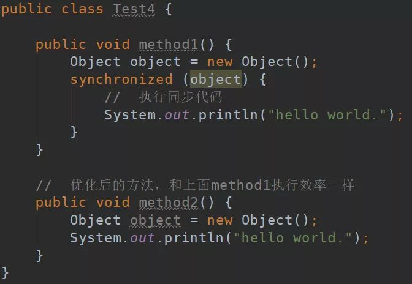

**3. 锁粗化**

锁粗化是虚拟机对另一种极端情况的优化处理，通过扩大锁的范围，避免反复加锁和释放锁。比如下面method3经过锁粗化优化之后就和method4执行效率一样了。

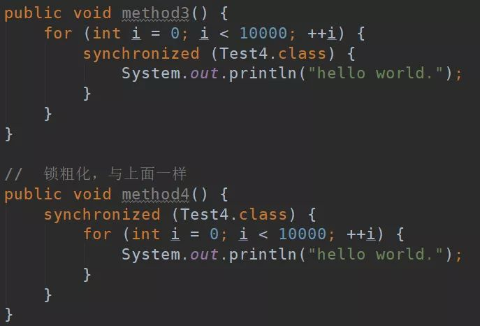

**4. 自旋锁与自适应自旋锁**

轻量级锁失败后，虚拟机为了避免线程真实地在操作系统层面挂起，还会进行一项称为自旋锁的优化手段。

自旋锁：许多情况下，共享数据的锁定状态持续时间较短，切换线程不值得，通过让线程执行循环等待锁的释放，不让出CPU。如果得到锁，就顺利进入临界区。如果还不能获得锁，那就会将线程在操作系统层面挂起，这就是自旋锁的优化方式。但是它也存在缺点：如果锁被其他线程长时间占用，一直不释放CPU，会带来许多的性能开销。

**自适应自旋锁**：这种相当于是对上面自旋锁优化方式的进一步优化，它的自旋的次数不再固定，其自旋的次数由前一次在同一个锁上的自旋时间及锁的拥有者的状态来决定，这就解决了自旋锁带来的缺点。

**为什么要引入偏向锁和轻量级锁？为什么重量级锁开销大？**

重量级锁底层依赖于系统的同步函数来实现，在 linux 中使用 pthread_mutex_t（互斥锁）来实现。

这些底层的同步函数操作会涉及到：操作系统用户态和内核态的切换、进程的上下文切换，而这些操作都是比较耗时的，因此重量级锁操作的开销比较大。

而在很多情况下，可能获取锁时只有一个线程，或者是多个线程交替获取锁，在这种情况下，使用重量级锁就不划算了，因此引入了偏向锁和轻量级锁来降低没有并发竞争时的锁开销。

## synchronized 锁降级

具体的触发时机：在**全局安全点**（safepoint）中，**执行清理任务的时候会触发尝试降级锁**。

当锁降级时，主要进行了以下操作：

1）**恢复锁对象的 markword 对象头**；

2）**重置 ObjectMonitor**，然后将该 ObjectMonitor **放入全局空闲列表**，等待后续使用。


## 公平锁和非公平锁

- **公平锁** : 锁被释放之后，**先申请的线程先得到锁**。**性能较差一些**，因为公平锁为了**保证时间上的绝对顺序**，**上下文切换更频繁**。
- **非公平锁** ：锁被释放之后，后申请的线程可能会先获取到锁，是**随机**或者**按照其他优先级排序**的。**性能更好**，但可能会导致某些线程永远无法获取到锁。

## 可中断锁和不可中断锁

- **可中断锁** ：获取锁的过程中可以被中断，不需要一直等到获取锁之后 才能进行其他逻辑处理。`ReentrantLock` 就属于是可中断锁。
- **不可中断锁** ：一旦线程申请了锁，就只能等到拿到锁以后才能进行其他的逻辑处理。 `synchronized` 就属于是不可中断锁

##  共享锁和独占锁

- **共享锁** （读锁）：一把锁可以被多个线程同时获得。
- **独占锁** （写锁）：一把锁只能被一个线程获得。

## 持读锁还能获取写锁吗

- **在线程持有读锁的情况下，该线程不能取得写锁**(因为获取写锁的时候，如果发现当前的读锁被占用，就马上获取失败，不管读锁是不是被当前线程持有)。
- **在线程持有写锁的情况下，该线程可以继续获取读锁**（获取读锁时如果发现写锁被占用，只有写锁没有被当前线程占用的情况才会获取失败）。

## 悲观锁

悲观锁总是假设最坏的情况，认为共享资源每次被访问的时候就会出现问题(比如共享数据被修改)，所以每次在获取资源操作的时候都会上锁，这样其他线程想拿到这个资源就会阻塞直到锁被上一个持有者释放。也就是说，**共享资源每次只给一个线程使用，其它线程阻塞，用完后再把资源转让给其它线程**。

像 Java 中**synchronized**和**ReentrantLock**等独占锁就是悲观锁思想的实现。

## 乐观锁

乐观锁总是假设最好的情况，认为共享资源每次被访问的时候不会出现问题，线程可以不停地执行，无需加锁也无需等待，只是在**提交修改的时候去验证对应的资源**（也就是数据）**是否被其它线程修改**了（具体方法可以使用**版本号机制**或 **CAS 算法**）。

### CAS算法

CAS叫做CompareAndSwap，比较并交换，主要是通过处理器的指令来**保证操作的原子性**，它包含 三个操作数： 

- **V** ：要更新的变量值(Var)
- **E** ：预期值(Expected)
- **N** ：拟写入的新值(New)

当且仅当 V 的值等于 E 时，CAS 通过原子方式用新值 N 来更新 V 的值。如果不等，说明已经有其它线程更新了 V，则当前线程放弃更新

CAS 并发原语体现在 Java 语言中的 `sum.misc.Unsafe` 类中的各个方法。调用 Unsafe 类中的 CAS 方法， JVM 会帮助我们实现出 CAS 汇编指令。这是一种完全依赖于硬件的功能，通过它实现了原子操作。再次强调，由于 CAS是一种系统原语，**原语属于操作系统用于范畴，是由若干条指令组成的，用于完成某个功能的一个过程，并且原语的执行必须是连续的**，**在执行过程中不允许被中断**，CAS 是一条 CPU 的原子指令，不会造成数据不一致问题。

### 乐观锁存在哪些问题

**1.ABA的问题**

指的是在CAS更新的过程中，当读取到的值是A，然后准备赋值的时候仍然是 A，但是实际上有可能A的值被改成了B，然后又被改回了A，这个CAS更新的漏洞就叫做ABA。（添加一个**版本号或时间戳**来解决）

**解决思路**是在变量前面追加上**版本号或者时间戳**。JDK 1.5 以后的 **AtomicStampedReference**类就是用来**解决 ABA 问题的**，其中的 `compareAndSet()` 方法就是首先**检查当前引用是否等于预期引用**，并且当前标志是否等于预期标志，如果全部相等，则以原子方式将该引用和该标志的值设置为给定的更新值。

**2.循环时间长开销大**

CAS 经常会用到**自旋操作**来进行**重试**，也就是**不成功就一直循环执行直到成功**。如果长时间不成功，会给 CPU 带来非常大的执行开销。是有个自旋次数的，就是为了避开这个耗时问题

如果 JVM 能支持处理器提供的 pause 指令那么效率会有一定的提升，pause 指令有两个作用：

1. 可以延迟流水线执行指令，使 CPU 不会消耗过多的执行资源，延迟的时间取决于具体实现的版本，在一些处理器上延迟时间是零。
2. 可以避免在退出循环的时候因内存顺序冲而引起 CPU 流水线被清空，从而提高 CPU 的执行效率。

**3.只能保证一个共享变量的原子操作**

CAS 只对**单个共享变量有效，当操作涉及跨多个共享变量时 CAS 无法直接保证操作的原子性**。两个方式解决这个问题：

- 使用**互斥锁**来保证原子性；
- 将**多个变量封装成对象**，通过**AtomicReference**来保证原子性。

但是从 JDK 1.5 开始，提供了`AtomicReference`类来保证引用对象之间的原子性，你可以把多个变量放在一个对象里来进行 CAS 操作.所以我们可以使用锁或者利用`AtomicReference`类把多个共享变量合并成一个共享变量来操作。

## 死锁产生条件

- 互斥条件：**多个线程不能同时使用同一个资源**；
- 持有并等待条件：**线程 A 在等待资源 2 的同时并不会释放自己已经持有的资源 1**；
- 不可剥夺条件：**在自己使用完一个资源之前不能被其他线程获取**；
- 环路等待条件：**两个线程获取资源的顺序构成了环形链**；

## 避免死锁

只要破坏产生死锁的四个条件中的其一就可以：

- **破坏互斥条件**：这个条件我们**没有办法破坏**，因为我们用锁本来就是想让他们互斥的（临界资源需要互斥访问）
- **破坏持有并等待条件**：一次性申请**所有**的资源。
- **破坏不剥夺条件**：占用部分资源的线程进一步申请其他资源时，如果**申请不到**，可以**主动释放**它占有的资源。
- **破坏循环等待条件**：靠按序申请资源来预防。按某一顺序申请资源，释放资源则反序释放。破坏循环等待条件。
- **锁排序法**：（**必须回答出来的点**） 
  **通过指定锁的获取顺序，比如规定，只有获得A锁的线程才有资格获取B锁，按顺序获取锁就可以避免死锁**。这通常被认为是解决死锁很好的一种方法。
- 使用**显式锁中**的**ReentrantLock.try(long,TimeUnit)来申请锁**

**从死锁的发生前后来看**：

- **预防** 是采用某种策略，**限制并发进程对资源的请求**，从而使得死锁的必要条件在系统执行的任何时间上都不满足。

​		采用资源的有序分配方法（以相同的顺序申请自己想要的资源）

- **避免**则是系统在分配资源时，根据资源的使用情况**提前做出预测**，从而**避免死锁的发生**。

​		采用银行家算法，当分配资源时判断分配后系统是否处于安全状态。

- **检测**是指系统设有**专门的机构**，当死锁发生时，该机构能够检测死锁的发生，并精确地确定与死锁有关的进程和资源。

​		通过进程-资源分配图

- **解除** 是与检测相配套的一种措施，用于**将进程从死锁状态下解脱出来**。

​		解除死锁的方式：

​			1.**立即结束所有进程的执行，重新启动操作系统** 。

​		    2.**撤销涉及死锁的所有进程，解除死锁后继续运行** 。

​			3.**逐个撤销涉及死锁的进程，回收其资源直至死锁解除。**

​			4.**抢占资源** ：从涉及死锁的一个或几个进程中抢占资源，把夺得的资源再分配给涉及死锁的进程直至死锁解除。


## 锁升级

**偏向锁：用于没有锁竞争的情况（CAS）**

**偏向锁的获取
开启偏向锁模式后，锁第一次被线程获取的时候，虚拟机会把对象头中是否为偏向锁的**标志位设位1,

同时使用CAS操作把获取到这个锁的**线程的ID**记录在对象的**Mark Word**之中。当有另外一个线程去尝试获取这个锁时， 偏向模式就宣告结束。

偏向锁的释放

偏向锁，并没有显式的锁释放过程，主要依靠**锁的批量重偏向机制**实现锁释放。（通过对比时间戳（epoch）实现）

**轻量级锁（CAS）**

**轻量级锁的获取**

- 并将对象头中的 Mark Word 复制到 Lock Reocrd 中。（Displaced Mark Word）
- CAS操作将当锁对象的Mark Word替换为指向 Lock Reocrd 的指针。如果失败则表示其他线程竞争锁，当前线程便尝试使用自旋来获取锁。当竞争线程的自旋次数 达到界限值（`threshold`），轻量级锁将会膨胀为重量级锁。

**轻量级锁的撤销**

如果对象的Mark Word仍然指向着线程的锁记录， 那就用CAS操作把对象当前的Mark Word和线程中复制的Displaced Mark Word替换回来， 如果替换成功， 整个同步过程就完成了。如果替换失败， 说明有其他线程尝试过获取该锁，轻量级锁膨胀为重量级锁,那就要在释放锁的同时， 唤醒被挂起的线程。

**重量级锁（Moniters（管程、监视器））**

管程：是一种程序结构，结构内的多个线程互斥访问共享资源。

在重量级锁中没有竞争到锁的对象会 park 被挂起，退出同步块时 unpark 唤醒后续线程。`ObjectMonitor` 中包含一个同步队列一个等待队列。

**重量级锁的获取**

通过 CAS 尝试把 monitor 的 owner 字段设置为当前线程（可重入（递归锁））（锁对象的Mark Word 替换为指向monitor的指针）。若失败加入wait队列等待唤醒。

**重量级锁的释放**

当某个持有锁的线程执行完同步代码块时，会释放锁并 `unpark` 后续线程（notify（））。


## ThreadLocal

**每个`Thread`中都具备一个`ThreadLocalMap`，而`ThreadLocalMap`可以存储多个以`ThreadLocal`为 key ，ThreadLocal的泛型值为 value 的键值对。**

```java
public class ThreadLocal {
    private static final ThreadLocal<String> threadLocalName = ThreadLocal.withInitial(() -> Thread.currentThread().getName());
    public static void main(String[] args) {
        for (int i = 0; i < 5; i++) {
            new Thread(() -> {
                System.out.println("threadName: " + threadLocalName.get());
            }, "yes-thread-" + i).start();
```

### 作用

- 使用**资源本地化**的方式来**避免线程争抢**的问题，也**避免了锁消耗**（比如用户私有的信息）不同的线程在 get 的时候 get 到的是当前线程的值（多个线程（请求）都会使用同一个变量，但是又不共享，可以设置为每个线程独自的变量，线程间互不干扰；）**实现每一个线程都有自己的专属本地变量**，从而起到**线程隔离**的作用，避免了**线程安全**问题。
- **设置一个线程域的变量，线程内处处可以访问，线程内上下文变量传递**，较少方法的过度封装。

**ThreadLocal的应用场景有**

- 数据库连接池
- 会话管理中使用

#### **为什么一般为static**

一个成员变量是否为 static 修饰决定了它时实例变量还是静态变量，ThreadLocal 的语义和作用是使这个变量成为 per-thread 而不是 per-instance 的。

### **源码实现**

```java
public class Thread implements Runnable {
    // 每个线程内部有一个ThreadLocalMap 类型的 threadLocals 用来存储本地变量
    ThreadLocal.ThreadLocalMap threadLocals = null;
}
```

 

在 Thread 中维护一个 ThreadLocalMap 变量，以ThreadLocal 作为 key，以对应的值作为 value 

如何找到：

通过 ThreadLocal 变量的 get 方法，Thread  ---->   ThreadLocalMap   ---->   getEntry(this)   ---->   return entry.value

 

**ThreadLocal的set()**：首先获取当前线程的ThreadLocals,如果不存在则创建，存在则set，key为ThreadLocal的弱引用，value为本地对象。
**ThreadLocalMap的Hash算法**：类似HashMap，但是ThreadLocalMap中没有链表。threadLocalHashCode & (len-1)确定在数组中的下标位置，至于threadLocalHashCode的计算，从0x61c88647开始每次加0x61c88647，斐波那契数 也叫 黄金分割数。hash增量为 这个数字，带来的好处就是 hash 分布非常均匀。
ThreadLocalMap的Hash冲突：如果发生冲突，并不是用拉链法解决，而是向后查找entry为null的槽位放入或者找到key值相等的槽位更新。
**ThreadLocalMap的set()** ：计算hash之后确定槽位，如果槽位为空则赋值，如果不空且key值相等，则更新，如果key值不等则往后遍历，在遇到entry为空的槽位之前有key值相等的则更新，遇到key值为空的则进行探测式清理，清理过程中，没过期的数据经过rehash重定位后所处的桶位置理论上更接近i= key.hashCode & (tab.len - 1)的位置。这种优化会提高整个散列表查询性能。
**ThreadLocalMap的扩容**：set()之后，如果执行启发式清理工作之后未清理到任何数据，且数组中entry数量达到列表扩容阈值threshold（threshold = len*2/3），开始rehash()，rehash()首先是进行探测式清理工作，清理完成后，如果size>threshlod*3/4，即扩容。扩容后的tab的大小为oldLen * 2，然后遍历老的散列表，重新计算hash位置，然后放到新的tab数组中。
**ThreadLocalMap的get()** : 计算hash，槽位空则返回，不空，如果key相等则返回，不相等向后遍历，在entry为空之前，如果有key为空的，则探测式清理过期数据，找到key相等的返回。

### 解决哈希冲突

ThreadLocalMap 解决哈希冲突的方式是**开放地址法（线性探测）**，如果当前索引发生哈希冲突，则线性的寻找下一个位置

 

这样做**肯定没有 HashMap 的拉链法效率高**，但是ThreadLocalMap **存的数目有限**，再把**加载因子降低一些**(**2/3**)，**冲突的可能性就降低**了，方式**简单**而且**避免使用指针**。

### 弱引用与内存泄漏

 

**原因：**ThreadLocal 变量是作用在一个线程里的，当一个线程销毁，这些变量自然的被回收掉，但是一**般使用线程池的时候，线程是常驻的**，这种情况下如果不做一些附加操作的话，工作线程的 ThreadLocalMap 中的数据可能会保留很多无用的数据，**由于和线程之间有引用链**，因此**可能永远不会被垃圾回收掉**。

**解决方法：**因此 ThreadLocalMap 中的 Entry 继承了 WeakReference<ThreadLocal<?>> 弱引用，在实例化的时候使用 **super(key) 将 key 对threadLocal 变量的引用设为弱引用**，当**不存在其它强引用**的时候，该 key 所对应的 ThreadLocal 对象**将被回收**，在 ThreadLocalMap 后续的 **set() 操作或者是扩容**的过程中**遇到 key 为空的 Entry 会进行清理**，但是 ThreadLocal 的**数据操作较少**，**清理的概率较低**，仍然**有较大可能内存泄漏**，**所以最规范的操作就是在执行完相应的功能后进行手动的 remove() 。**

**为什么不把 value 设为弱引用**：

- 第一，Map 结构是通过 key 查询 value 的，也就是说，**外界引用一般作用在 key 上**，所以通过 **key 的引用更具有”Entry无用“的代表性**；
- 第二点，如果将 **value 设为弱引用**，可能会 **get() 到空值**，**引发空指针异常**。

**InheritableThreadLocal**

这玩意可以理解为就是可以把父线程的 threadlocal 传递给子线程，所以如果要这样传递就用 InheritableThreadLocal ，不要用 threadlocal。

## ReentrantLock

ReetrantLock是一个**可重入的独占锁**，主要有两个特性，一个是**支持公平锁和非公平锁**，一个是**可重入**。
ReetrantLock实现**依赖于AQS**(AbstractQueuedSynchronizer)。

ReetrantLock主要**依靠AQS维护一个阻塞队列**，多个线程对加锁时，**失败则会进入阻塞队列。等待唤醒，重新尝试加锁**。

## AQS/抽象队列同步器


AQS 核心思想是，如果**被请求的共享资源空闲**，则将当前请求资源的线程**设置为有效的工作线程**，并且将共享资源设置为**锁定状态**。如果被请求的共享资源被占用，那么就需要一套线程阻塞等待以及被唤醒时锁分配的机制，这个机制 AQS 是用 **CLH 队列锁** 实现的，即将暂时获取不到锁的线程加入到队列中。

CLH(Craig,Landin,and Hagersten) 队列是一个**虚拟的双向队列**（虚拟的双向队列即**不存在队列实例，仅存在结点之间的关联关系**）。**AQS 是将每条请求共享资源的线程封装成一个 CLH 锁队列的一个结点（Node）来实现锁的分配**。在 CLH 同步队列中，一个节点表示一个线程，它保存着线程的引用（thread）、 当前节点在队列中的状态（waitStatus）、前驱节点（prev）、后继节点（next）。


AQS 使用 **int 成员变量 `state` 表示同步状态**，通过内置的 **线程等待队列** 来完成获取资源线程的排队工作。

`state` 变量由 `volatile` 修饰，用于展示当前临界资源的获锁情况。

**AQS 资源共享方式**

独占（如ReentrantLock）：state == 0 可获取（可重入）

共享（如Semaphore/CountDownLatch）：state > 0 可获取（获取后减一）

读写锁（如ReentrantReadWriteLock）： 高16位为共享锁、低16位位互斥锁。


AQS基于**模板方法设计模式**，将执行的框架步骤定好，用final关键字修饰，子类必须严格按照这个标准执行，但是每一步的具体实现由子类自定义（protected修饰的方法）。比如acquire（）是模板方法，tryAcquire（）是自己实现。

**获取锁的过程：**

## AQS

1. AQS 是一个锁框架，它定义了锁的实现机制，并开放出扩展的地方，让子类去实现，比如我们在 lock 的时候，AQS 开放出 state 字段，让子类可以根据 state 字段来决定是否能够获得锁，对于获取不到锁的线程 AQS 会自动进行管理，无需子类锁关心，这就是 lock 时锁的内部机制，封装的很好，又暴露出子类锁需要扩展的地方；
2. AQS 底层是由同步队列 + 条件队列联手组成，同步队列管理着获取不到锁的线程的排队和释放，条件队列是在一定场景下，对同步队列的补充，比如获得锁的线程从空队列中拿数据，肯定是拿不到数据的，这时候条件队列就会管理该线程，使该线程阻塞；
3. AQS 围绕两个队列，提供了四大场景，分别是：获得锁、释放锁、条件队列的阻塞，条件队列的唤醒，分别对应着 AQS 架构图中的四种颜色的线的走向。

## AQS使用了哪些设计模式

AQS同步器的设计是基于模板方法模式的，如果需要自定义同步器一般的方式是这样（模板方法模式很经典的一个应用）：

1. 使用者继承AbstractQueuedSynchronizer并重写指定的方法。（这些重写方法很简单，无非是对于共享资源state的获取和释放）
2. 将AQS组合在自定义同步组件的实现中，并调用其模板方法，而这些模板方法会调用使用者重写的方法。

这和我们以往通过实现接口的方式有很大区别，这是模板方法模式很经典的一个运用。

**AQS使用了模板方法模式，自定义同步器时需要重写下面几个AQS提供的模板方法：**

```
isHeldExclusively()//该线程是否正在独占资源。只有用到condition才需要去实现它。
tryAcquire(int)//独占方式。尝试获取资源，成功则返回true，失败则返回false。
tryRelease(int)//独占方式。尝试释放资源，成功则返回true，失败则返回false。
tryAcquireShared(int)//共享方式。尝试获取资源。负数表示失败；0表示成功，但没有剩余可用资源；正数表示成功，且有剩余资源。
tryReleaseShared(int)//共享方式。尝试释放资源，成功则返回true，失败则返回false。
```

## AQS中同步队列的数据结构

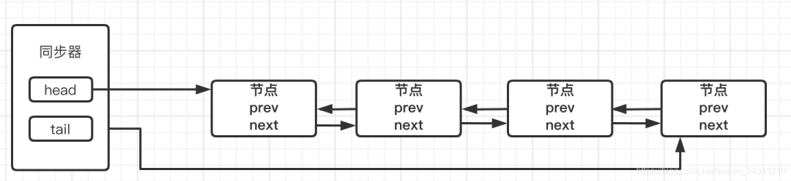

- 当前线程获取同步状态失败，同步器将当前线程机等待状态等信息构造成一个Node节点加入队列，放在队尾，同步器重新设置尾节点
- 加入队列后，会阻塞当前线程
- 同步状态被释放并且同步器重新设置首节点，同步器唤醒等待队列中第一个节点，让其再次获取同步状态

##  AQS 对资源的共享方式

**AQS定义两种资源共享方式**

- Exclusive

  （独占）：只有一个线程能执行，如ReentrantLock。又可分为公平锁和非公平锁：

  - 公平锁：按照线程在队列中的排队顺序，先到者先拿到锁
  - 非公平锁：当线程要获取锁时，无视队列顺序直接去抢锁，谁抢到就是谁的

- **Share**（共享）：多个线程可同时执行，如Semaphore/CountDownLatch。Semaphore、CountDownLatCh、 CyclicBarrier、ReadWriteLock 我们都会在后面讲到。

ReentrantReadWriteLock 可以看成是组合式，因为ReentrantReadWriteLock也就是读写锁允许多个线程同时对某一资源进行读。

不同的自定义同步器争用共享资源的方式也不同。自定义同步器在实现时只需要实现共享资源 state 的获取与释放方式即可，至于具体线程等待队列的维护（如获取资源失败入队/唤醒出队等），AQS已经在顶层实现好了。

## AQS应用组件

**1.Semaphore（信号量）**

synchronized 和 ReentrantLock 都是一次只允许一个线程访问某个资源，Semaphore(信号量)可以指定多个线程同时访问某个资源。

state的值就代表当前所剩余的令牌数量。

获取令牌

​	1、当前线程会尝试去同步队列获取一个令牌，获取令牌的过程也就是使用原子的操作去修改同步队列的state ,获取一个令牌则修改为state=state-1。

​	2、 当计算出来的state<0，则代表令牌数量不足，此时会创建一个Node节点加入阻塞队列，挂起当前线程。

​	3、当计算出来的state>=0，则代表获取令牌成功。

**2.CountDownLatch（倒计时器）**（只能使用一次）

`CountDownLatch` 是共享锁的一种实现,它默认构造 AQS 的 `state` 值为 `count`。当线程使用 `countDown()` 方法时,其实使用了`tryReleaseShared`方法以 CAS 的操作来减少 `state`,直至 `state` 为 0 。当调用 `await()` 方法的时候，如果 `state` 不为 0，那就证明任务还没有执行完毕，`await()` 方法就会一直阻塞，也就是说 `await()` 方法之后的语句不会被执行。然后，`CountDownLatch` 会自旋 CAS 判断 `state == 0`，如果 `state == 0` 的话，就会释放所有等待的线程，`await()` 方法之后的语句得到执行。

 CountDownLatch是一个同步工具类，用来协调多个线程之间的同步。这个工具通常用来控制线程等待，它可以让某一个线程等待直到倒计时结束，再开始执行。

应用场景：

​	**1、某一线程在开始运行前等待 n 个线程执行完毕。**

​	**2、实现多个线程开始执行任务的最大并行性。**：模拟发令枪。

**3.CyclicBarrier（循环栅栏）**（也是count自减计数）

`CyclicBarrier` 的字面意思是可循环使用（Cyclic）的屏障（Barrier）。它要做的事情是：让一组线程到达一个屏障（也可以叫同步点）时被阻塞，直到最后一个线程到达屏障时，屏障才会开门，所有被屏障拦截的线程才会继续干活。

`CyclicBarrier` 默认的构造方法是 `CyclicBarrier(int parties)`，其参数表示屏障拦截的线程数量，每个线程调用 `await()` 方法告诉 `CyclicBarrier` 我已经到达了屏障，然后当前线程被阻塞。

**两者区别：**

​	1.循环栅栏可以多次使用。

​	2.对于 `CountDownLatch` 来说，重点是“一个线程（多个线程）等待”，而其他的 N 个线程在完成“某件事情”之后，可以终止，也可以等待。而对于 `CyclicBarrier`，重点是多个线程，在任意一个线程没有完成，所有的线程都必须等待。

##  Atomic 原子类

Atomic 是指**一个操作是不可中断的**。即使是在多个线程一起执行的时候，**一个操作一旦开始，就不会被其他线程干扰**。

所以，所谓原子类说简单点就是具有**原子 / 原子操作特征的类**。

并发包 java.util.concurrent 的原子类都存放在 java.util.concurrent.atomic 下：


## JUC 包中的原子类是哪4类

**基本类型**
使用原子的方式更新基本类型：

* AtomicInteger ： 整型原子类
* AtomicLong： 长整型原子类
* AtomicBoolean： 布尔型原子类

**数组类型**
使用原子的方式更新数组里的某个元素：

* AtomicIntegerArray： 整型数组原子类
* AtomicLongArray： 长整型数组原子类
* AtomicReferenceArray： 引用类型数组原子类

**引用类型**
使用原子的方式更新引用类型：

* AtomicReference： 引用类型原子类
* AtomicStampedReference： 原子更新带有版本号的引用类型。该类将整型数值与引用关联起来，可用于解决原子的更新数据和数据的版本号，可以解决使用 CAS 进行原子更新时可能出现的 ABA 问题。
* AtomicMarkableReference： 原子更新带有标记位的引用类型。**对象属性修改类型**
* AtomicIntegerFieldUpdater： 原子更新整型字段的更新器
* AtomicLongFieldUpdater： 原子更新长整型字段的更新器
* AtomicMarkableReference： 原子更新带有标记位的引用类型

## AtomicInteger 类的原理 

 AtomicInteger 类主要利用 CAS和 volatile 和 native 方法来保证原子操作，从而避免 synchronized 的高开销，执行效率大为提升。

`AtomicInteger` 类的部分源码：

```JAVA
  // 更新操作时提供“比较并替换”的作用
  private static final Unsafe unsafe = Unsafe.getUnsafe();

  private static final long valueOffset;

  static {
      try{
          valueOffset = unsafe.objectFieldOffset(AutomicInteger.class.getDeclaredField("value"));
      }catch(Exception ex){
          throw new Error(ex);
      }
  }

  private volatile int value;

```


## 并发容器

### ConcurrentHashMap

Java7 中 ConcurrentHashMap 使用的分段锁，也就是每一个 Segment 上同时只有一个线程可以操作，每一个 Segment 都是一个类似 HashMap 数组的结构，它可以扩容，它的冲突会转化为链表。但是 Segment 的个数一但初始化就不能改变。


Java8 中的 ConcurrentHashMap 使用的 Synchronized 锁加 CAS 的机制。结构变成了 **Node 数组 + 链表 / 红黑树**，Node 是类似于一个 HashEntry 的结构。它的冲突再达到一定大小时会转化成红黑树，在冲突小于一定数量时又退回链表。（`synchronized` 只锁定当前链表或红黑二叉树的首节点）

**CopyOnWriteArrayList**

`CopyOnWriteArrayList` 读取是完全不用加锁的，写入也不会阻塞读取操作。只有写入和写入之间需要进行同步等待。

`CopyOnWriteArrayList` 类的所有可变操作（add，set 等等）都是通过创建底层数组的新副本来实现的。（add（）方法在添加集合的时候加了锁）

**ConcurrentLinkedQueue**

主要使用 CAS 非阻塞算法来实现线程安全。（非阻塞队列）、

**BlockingQueue**

**通过加锁来实现**（阻塞队列）


