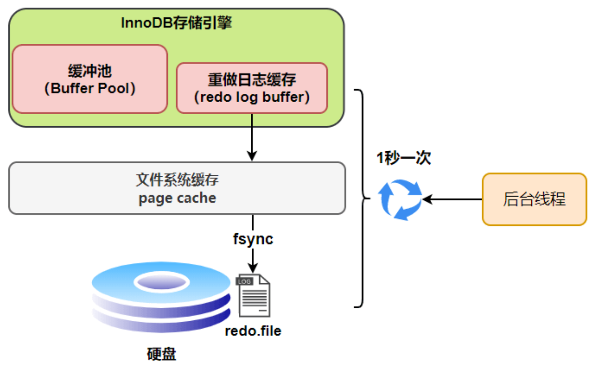

# MySQL

## 基础

### 三范式

**第一范式**：属性（对应于表中的字段）不能再被分割，也就是这个字段只能是一个值，不能再分为多个其他的字段了。**1NF 是所有关系型数据库的最基本要求** ，也就是说关系型数据库中创建的表一定满足第一范式。

**第二范式**：第二范式在第一范式的基础上增加了一个列，这个列称为主键，非主属性都依赖于主键。要求实体的属性完全依赖于主关键字。所谓完全 依赖是指不能存在仅依赖主关键字一部分的属性。

**第三范式**：第三范式是确保每列都和主键列直接相关，而不是间接相关。除了主键以外的其他列都依赖于主键列，列和列之间不存在相互依赖关系，则满足第三范式。

- 第一范式：强调的是列的原子性，即数据库表的每一列都是不可分割的原子数据项。
- 第二范式：要求实体的属性完全依赖于主关键字。所谓完全 依赖是指不能存在仅依赖主关键字一部分的属性。
- 第三范式：任何非主属性不依赖于其它非主属性。

### NoSQL 是什么

NoSQL（Not Only SQL 的缩写）泛指非关系型的数据库，主要针对的是键值、文档以及图形类型数据存储。并且，NoSQL 数据库天生支持分布式，数据冗余和数据分片等特性，旨在提供可扩展的高可用高性能数据存储解决方案。

### SQL 和 NoSQL


### NoSQL 有什么优势

- **灵活性：** NoSQL 数据库通常提供灵活的架构，以实现更快速、更多的迭代开发。灵活的数据模型使 NoSQL 数据库成为半结构化和非结构化数据的理想之选。
- **可扩展性：** NoSQL 数据库通常被设计为通过使用分布式硬件集群来横向扩展，而不是通过添加昂贵和强大的服务器来纵向扩展。
- **高性能：** NoSQL 数据库针对特定的数据模型和访问模式进行了优化，这与尝试使用关系数据库完成类似功能相比可实现更高的性能。
- **强大的功能：** NoSQL 数据库提供功能强大的 API 和数据类型，专门针对其各自的数据模型而构建。

### MySQL 架构


可以看到， MySQL 的架构共分为两层：**Server 层和存储引擎层**，

- **Server 层负责建立连接、分析和执行 SQL**。MySQL 大多数的核心功能模块都在这实现，主要包括连接器，查询缓存、解析器、预处理器、优化器、执行器等。另外，所有的内置函数（如日期、时间、数学和加密函数等）和所有跨存储引擎的功能（如存储过程、触发器、视图等。）都在 Server 层实现。
- **存储引擎层负责数据的存储和提取**。支持 InnoDB、MyISAM、Memory 等多个存储引擎，不同的存储引擎共用一个 Server 层。

### InnoDB 和 MyISAM 的区别

- InnoDB 支持**行级锁和表级锁**，MyISAM 只有表级锁。
- InnoDB 支持**事务**，而 MyISAM 不支持
- InnoDB 支持**外键**，而 MyISAM 不支持
- InnoDB 支持崩溃后的**数据恢复**（redo log）。
- InnoDB 支持**MVCC**。
- 虽然**都是使用 B+Tree** 作为索引结构，**但索引实现不同**，InnoDB 主键索引是聚集索引，二级索引是非聚集索引。MyISAM 都是非聚集索引（叶子节点存储的是数据的**物理地址**）。
- InnoDB 在**多核 CPU 下可以并发读写，性能更强**。
- MyISAM 采用**表级锁**；InnoDB 支持**行级锁(默认)和表级锁**。
- Innodb 不支持全文索引，而 **MyISAM 支持全文索引，查询效率上更高**；
- InnoDB 不保存表的具体行数，MyISAM 用一个变量保存了整个表的行数。

### 超键/候选键/主键/外键

- **超键**：在**关系中能唯一标识元组的属性集称为关系模式**的超键。一个属性可以为作为一个超键，多个属性组合在一起也可以作为一个超键。超键包含候选键和主键。
- **候选键**：是最小超键，即没有冗余元素的超键。
- **主键**：数据库表中对储存数据对象予以唯一和完整标识的数据列或属性的组合。一个数据列只能有一个主键，且主键的取值不能缺失，即不能为空值（Null）。
- **外键**：在一个表中存在的**另一个表的主键称此表的外键**。

### SQL 约束有哪几种

- NOT NULL: 用于控制字段的内容一定不能为空（NULL）。
- UNIQUE: 控件字段内容不能重复，一个表允许有多个 Unique 约束。
- PRIMARY KEY: 也是用于控件字段内容不能重复，但它在一个表只允许出现一个。
- FOREIGN KEY: 用于预防破坏表之间连接的动作，也能防止非法数据插入外键列，因为它必须是它指向的那个表中的值之一。
- CHECK: 用于控制字段的值范围。

### MySQL 执行流程


- **连接器：**

  - 与客户端进行 TCP 三次握手建立连接；
  - 校验客户端的用户名和密码，如果用户名或密码不对，则会报错；
  - 如果用户名和密码都对了，会读取该用户的权限，然后后面的权限逻辑判断都基于此时读取到的权限；

  解决长连接占用内存的问题：

  - **定期断开长连接**。
  - **客户端主动重置连接**。当客户端执行了一个很大的操作后，可以调用 mysql_reset_connection 函数来重置连接，释放内存。这个过程不需要重连和重新做权限验证，但是会将连接恢复到刚刚创建完时的状态。

- **查询缓存：查询语句如果命中查询缓存则直接返回，否则继续往下执行。**因为这个功能不太实用，**MySQL 8.0 已删除该模块；**
- **解析 SQL，**​ 通过解析器对 SQL 查询语句进行**词法分析（关键词识别）**、**语法分析（SQL 语句是否正确）**，然后构建语法树，方便后续模块读取表名、字段、语句类型；
- **执行 SQL，共有三个阶段：**

  - 预处理阶段：**检查表或字段是否存在**；将 `select *`​ 中的 `*`​ 符号扩展为表上的所有列。（若不存在则报错）
  - 优化阶段：基于查询成本的考虑， 选择查询**成本最小的执行计划**；（选择**使用什么索引**）
  - 执行阶段：根据执行计划**执行 SQL** 查询语句，从存储引擎读取记录，返回给客户端。

**查询语句**执行流程：权限校验（如果命中缓存）--->查询缓存--->分析器--->优化器--->权限校验--->执行器--->引擎

**更新语句**执行流程：分析器---->权限校验---->执行器--->引擎---redo log(prepare 状态)--->binlog--->redo log(commit 状态)

### DML 语句和 DDL 语句

- DML 是数据库操作语言（Data Manipulation Language）的缩写，是指对数据库中表记录的操作，主要包括表记录的插入（insert）、更新（update）、删除（delete）和查询（select），是开发人员日常使用最频繁的操作。
- DDL （Data Definition Language）是数据定义语言的缩写，简单来说，就是对数据库内部的对象进行创建、删除、修改的操作语言。它和 DML 语言的最大区别是 DML 只是对表内部数据的操作，而不涉及到**表的定义、结构的修改**，更不会涉及到其他对象。DDL 语句更多的被数据库管理员（DBA）所使用，一般的开发人员很少使用。

### 连接语句

内联接（Inner Join）：匹配 2 张表中相关联的记录。

左外联接（Left Outer Join）：除了匹配 2 张表中相关联的记录外，还会匹配左表中剩余的记录，右表中未匹配到的字段用 NULL 表示。

右外联接（Right Outer Join）：除了匹配 2 张表中相关联的记录外，还会匹配右表中剩余的记录，左表中未匹配到的字段用 NULL 表示。在判定左表和右表时，要根据表名出现在 Outer Join 的左右位置关系。

### 表空间文件的结构

**表空间由段（segment）、区（extent）、页（page）、行（row）组成。**

- **行**

  数据库表中的记录都是按行进行存放的，每行记录根据不同的行格式，有不同的存储结构。

- **页**

  记录是按照行来存储的，但是数据库的读取并不以「行」为单位，否则一次读取（也就是一次 I/O 操作）只能处理一行数据，效率会非常低。

  因此，**多行组成一页，InnoDB 以页为单位来读写**，将其整体读入内存。**默认每个页的大小为 16KB**。

- **区**

  InnoDB 存储引擎是用 B+ 树来组织数据的。为了防止链表中相邻的两个页之间的物理位置不连续，产生随机 I/O 读取，拖慢读取速度，会以**区（extent）为单位分配。**每个区的大小为 1MB，对于 16KB 的页来说，**连续的 64 个页会被划为一个区，这样就使得链表中相邻的页的物理位置也相邻，就能使用顺序 I/O 了**。

- **段**

  表空间是由各个段组成的，段是由多个区（extent）组成的。段一般分为数据段、索引段和回滚段等。

  - 索引段：存放 B + 树的非叶子节点的区的集合；
  - 数据段：存放 B + 树的叶子节点的区的集合；
  - 回滚段：存放的是回滚数据的区的集合，MVCC 就是利用这个回滚段实现了多版本查询数据。

### COMPACT 行格式

InnoDB 提供了 4 种行格式，分别是 Redundant、Compact、Dynamic 和 Compressed 行格式


Compact 行格式包含**记录的额外信息**和**记录的真实数据**两个部分。

**记录的额外信息**包含 3 个部分：

- **变长字段长度列表**：记录了变长字段的长度。**当数据表没有变长字段的时候，表里的行格式就不会有这一部分。**

  其中的信息是**逆序存放**的，因为这样可以**使得位置靠前的记录的真实数据和数据对应的字段长度信息可以同时在一个 CPU Cache Line 中，这样就可以提高 CPU Cache 的命中率**。

- **NULL 值列表：**记录了哪些列的值为 NULL。**当数据表的字段都定义成 NOT NULL 的时候，表里的行格式就不会有 NULL 值列表了**。(1 字节)

  和变长字段长度列表一样，其中的信息也是**逆序存放**的。

  必须用**整数个字节**的位表示（1 字节 8 位），如果使用的二进制位个数不足整数个字节，则在字节的高位补 0。**0 代表不为 null 值，1 代表为 null 值**。

- **记录头信息：**包含的内容比较多，比如有：

  - delete_mask ：标识此条数据是否被删除。执行 detele 删除记录的时候，并不会真正的删除记录，只是将这个记录的 delete_mask 标记为 1。
  - next_record：下一条记录的位置，指向的是下一条记录的「记录头信息」和「真实数据」之间的位置，这样的好处是向左读就是记录头信息，向右读就是真实数据，比较方便。
  - record_type：表示当前记录的类型，0 表示普通记录，1 表示 B+树非叶子节点记录，2 表示最小记录，3 表示最大记录

**记录的真实数据**部分除了我们定义的字段，还有三个隐藏字段，分别为：

- row_id：如果建表的时候既没有指定主键，又没有唯一约束，那么 InnoDB 就会为记录添加 row_id 隐藏字段。(6 字节)
- trx_id：事务 id，表示这个数据是由哪个事务生成的。(6 字节)
- roll_pointer：这条记录上一个版本的指针。(7 字节)

### varchar 和 char

char 是一个定长字段,假如申请了`char(10)`的空间,那么无论实际存储多少内容.该字段都占用 10 个字符,而 varchar 是变长的,也就是说申请的只是最大长度,占用的空间为实际字符长度+1,最后一个字符存储使用了多长的空间.

在检索效率上来讲,char > varchar,因此在使用中,如果确定某个字段的值的长度,可以使用 char,否则应该尽量使用 varchar.例如存储用户 MD5 加密后的密码,则应该使用 char。

### in 和 exists

MySQL 中的 in 语句是把外表和内表作 hash 连接，而 exists 语句是对外表作 loop 循环，每次 loop 循环再对内表进行查询。一直大家都认为 exists 比 in 语句的效率要高，这种说法其实是不准确的。这个是要区分环境的。

如果查询的两个表大小相当，那么用 in 和 exists 差别不大。
如果两个表中一个较小，一个是大表，则子查询表大的用 exists，子查询表小的用 in。
not in 和 not exists：如果查询语句使用了 not in，那么内外表都进行全表扫描，没有用到索引；而 not extsts 的子查询依然能用到表上的索引。所以无论那个表大，用 not exists 都比 not in 要快。

### drop、delete 与 truncate

三者都表示删除，但是三者有一些差别：


### varchar(n) 中 n 最大取值

一行记录最大只能存储 **65535** 字节，其中包含了「变长字段长度列表」和 「NULL 值列表」所占用的字节数。**如果有多个字段的话，要保证所有字段的长度 + 变长字段字节数列表所占用的字节数 + NULL 值列表所占用的字节数 <= 65535**。字符集为 ascii 是一字符一字节，utf-8 最多需要 3 字节

### 行溢出后怎么处理

**Compact 行格式下**，当发生行溢出时，在**记录的真实数据处只会保存该列的一部分数据**，而把剩余的数据放在「溢出页」中，然后真实数据处用 20 字节存储指向溢出页的地址，从而可以找到剩余数据所在的页。

**Compressed 和 Dynamic** 这两个行格式则不一样，不会存储该列的一部分数据，而是**只存储 20 个字节**的指针来指向溢出页。

### 自增主键一定连续吗

自增值不连续的 4 个场景：

1. 自增初始值和自增步长设置不为 1
2. 唯一键冲突
3. 事务回滚
4. 批量插入（如 `insert...select` 语句）

### 存储过程

存储过程是一些预编译的 SQL 语句。

1、更加直白的理解：存储过程可以说是一个记录集，它是由一些 T-SQL 语句组成的代码块，这些 T-SQL 语句代码像一个方法一样实现一些功能（对单表或多表的增删改查），然后再给这个代码块取一个名字，在用到这个功能的时候调用他就行了。

2、存储过程是一个预编译的代码块，执行效率比较高,一个存储过程替代大量 T_SQL 语句 ，可以降低网络通信量，提高通信速率,可以一定程度上确保数据安全

但是,在互联网项目中,其实是不太推荐存储过程的,比较出名的就是阿里的《Java 开发手册》中禁止使用存储过程,我个人的理解是,在互联网项目中,迭代太快,项目的生命周期也比较短,人员流动相比于传统的项目也更加频繁,在这样的情况下,存储过程的管理确实是没有那么方便,同时,复用性也没有写在服务层那么好。

## 索引

**索引就是帮助存储引擎快速获取数据的一种数据结构。**

### 索引分类


- 按「数据结构」分类：**B+tree 索引、Hash 索引、Full-text 索引**。
- 按「物理存储」分类：**聚簇索引（主键索引）、二级索引（辅助索引）**。

  - 主键索引的 B+Tree 的叶子节点存放的是实际数据。建表时，InnoDB 存储引擎会根据不同的场景选择不同的列作为主键索引：

    - 如果有主键，默认会使用主键作为主键索引的索引键；
    - 如果没有主键，就选择第一个**不包含 NULL** 值的**唯一**列作为主键索引的索引键；
    - 如果这两种都没有，InnoDB 会**自动生成一个隐式自增 id**（rowid）列作为主键索引的索引键。

  - 其它索引都属于二级索引。二级索引的 B+Tree 的叶子节点存放的是主键值，而不是实际数据。

    - **覆盖索引：**在二级索引的 B+Tree 就能查询到结果的过程就叫作 ​**覆盖索引**。
    - **回表：**​ 如果查询的数据不在二级索引里，就会先检索二级索引，获取到主键值后，然后再检索主键索引，就能查询到要查的数据了，这个过程就是 ​**回表**。

- 按「字段特性」分类：**主键索引、唯一索引、普通索引、前缀索引**。

  - **主键索引**就是建立在主键字段上的索引，通常在创建表的时候一起创建，一张表最多只有一个主键索引，索引列的值不允许有空值。
  - **唯一索引**建立在 UNIQUE 字段上的索引，一张表可以有多个唯一索引，索引列的值必须唯一，但是允许有空值。
  - **普通索引**就是建立在普通字段上的索引，既不要求字段为主键，也不要求字段为 UNIQUE。
  - **前缀索引**是指对字符类型字段的**前几个字符**建立的索引，而**不是在整个字段**上建立的索引，前缀索引可以建立在字段类型为 char、 varchar、binary、varbinary 的列上。使用前缀索引的目的是**为了减少索引占用的存储空间，提升查询效率**。（创建时在字段后加括号，括号中指定长度）。

- 按「字段个数」分类：**单列索引、联合索引**。

  - **索引下推**：建立在多列上的索引称为联合索引，在**联合索引**遍历过程中，对联合索引中包含的字段先做判断，判断查询的**其他字段**是否满足查询语句，直接过滤掉不满足条件的记录，能够**减少回表次数**。这个过程就叫做**索引下推。**

**回表查询**：因为二级索引的叶子节点存放的是**主键值**而不是数据，需要再通过主键索引查找一次。

**索引覆盖**：在二级索引的 B+Tree 就能查询到结果的过程就叫作「覆盖索引」，也就是只需要查一个 B+Tree 就能找到数据。（所查找的就是主键值）

**索引下推**： 可以在**联合索引**遍历过程中，对联合索引中包含的字段先做判断（判断查询的**其他字段**是否满足查询语句），直接过滤掉不满足条件的记录，减少回表次数。**都由存储引擎来判断查询**select \* from t_user where age > 20 and reward = 100000;

### 主键和外键

- **主键(主码)** ：主键用于唯一标识一个元组，不能有重复，不允许为空。一个表只能有一个主键。
- **外键(外码)** ：外键用来和其他表建立联系用，外键是另一表的主键，外键是可以有重复的，可以是空值。一个表可以有多个外键。


### InnoDB 为什么使用 B+树

**和 B 树比**：

- B+ 树的非叶子节点不存放实际的记录数据，仅存放索引，因此**数据量相同的情况下，相比存储即存索引又存记录的 B 树，B+树的非叶子节点可以存放更多的索引**，因此 B+ 树的高度 B 树低，**查询底层节点的磁盘 I/O 次数会更少**。
- B+ 树叶子节点之间**用链表连接了起来，有利于范围查询**，而 B 树要实现范围查询，因此只能通过树的遍历来完成范围查询，这会涉及多个节点的磁盘 I/O 操作，效率低。
- **B+ 树有大量的冗余节点，所有非叶子节点都是冗余索引**，这些冗余索引让 B+ 树在**插入、删除的效率都更高**，不会像 B 树那样会发生复杂的树的变化。

**和二叉树比**：随着数据量的增加，**二叉树的树高会越来越高，磁盘 I/O 次数也会更多**，而 B+Tree 在千万级别的数据量下，高度依然维持在**3、4 层左右**，也就是说一次数据查询操作只需要做 3、4 次的磁盘/O 操作就能查询到目标数据。

**和 Hash 比**：

- 虽然 Hash 的**等值查询效率很高**，但是**没有顺序，IO 复杂度高，不适合做范围查询**。

* 基于 Hash 表实现，**只有 Memory 存储引擎显式支持哈希索引** ；
* 适合**等值查询**，如=、in()、<=>，不支持范围查询 ；
* 因为**不是按照索引值顺序存储的**，就不能像 B+Tree 索引一样利用索引完成[排序]() ；
* 因为 Hash 索引始终索引的**所有列的全部内容**，所以不支持部分索引列的匹配查找 ；
* 如果有大量重复键值得情况下，哈希索引的效率会很低，因为存在哈希碰撞问题 。

**和红黑树比**：树的高度随着数据量增加而增加，IO 代价高。

**不使用平衡二叉树的原因如下**：

最大原因：**深度太大**(因为一个节点最多只有 2 个子节点)，一次查询需要的 I/O 复杂度为 O(lgN),而 b+tree 只需要 O(log_mN),而其出度 m 非常大，其深度一般不会超过 4
**平衡二叉树逻辑上很近的父子节点，物理上可能很远，无法充分发挥磁盘顺序读和预读的高效特性。**

### MyISAM 和 InnoDB 实现 BTree 索引的区别

**MyISAM**：

B+Tree 叶节点的 data 域存放的是数据记录的地址。在索引检索的时候，首先按照 B+Tree 搜索算法搜索索引，如果指定的 Key 存在，则取出其 data 域的值，然后以 data 域的值为地址读取相应的数据记录。这被称为“非聚簇索引”。
**索引文件和数据文件是分离的**

**InnoDB**：

- InnoDB 的 B+Tree 索引分为主索引（聚集索引）和辅助索引(非聚集索引)。一张表一定包含一个聚集索引构成的 B+ 树以及若干辅助索引的构成的 B+ 树。
- 辅助索引的存在并不会影响聚集索引，因为聚集索引构成的 B+ 树是数据实际存储的形式，而辅助索引只用于加速数据的查找，所以一张表上往往有多个辅助索引以此来提升数据库的性能。
- **不建议使用过长的字段作为主键**，因为所有辅助索引都引用主索引，过长的主索引会令辅助索引变得过大。**非单调的主键会造成在插入新记录时数据文件为了维持 B+Tree 的特性而频繁的分裂调整**，十分低效，而使用自增字段作为主键则是一个很好的选择。

### 什么时候适合创建索引

- 字段有**唯一性限制**的，比如商品编码；
- **经常用于 where 查询**条件的字段，这样能够提高整个表的查询速度，如果查询条件**不是一个字段**，可以建立**联合索引**。
- 经常用于 **GROUP BY**和 **ORDER BY**的字段，这样在查询的时候就不需要再去做一次排序了，因为建立索引之后在 B+Tree 中的记录都是排序好的。

### 什么时候不需要创建索引

- **`WHERE`​ 条件，`GROUP BY`​，`ORDER BY`​ 里用不到的字段**，索引是为了快速定位，所以起不到定位的字段通常是不需要创建索引的。
- 字段中存在**大量重复数据**，不需要创建索引。 MySQL 的查询优化器发现某个值出现的百分比很高的时候，它一般就会忽略索引，进行全表扫描。
- **表数据太少**的时候，不需要创建索引；
- **经常更新的字段**不用创建索引，因为索引字段频繁修改，为了维护 B+Tree 的有序性，就需要频繁的重建索引，这个过程会影响数据库的性能。

### 索引的缺点

- 需要**占用物理空间**，数量越大，占用空间越大；
- 创建索引和维护索引要**耗费时间**，这种时间随着数据量的增加而增大；
- **会降低表的增删改的效率**，因为每次增删改索引，B+ 树为了维护索引有序性，都需要动态维护索引。

### 索引优化

- **前缀索引优化**：使用某个字段中字符串的前几个字符建立索引。

  使用前缀索引是为了**减小索引字段大小**，可以增加一个索引页中存储的索引值，有效提高索引的查询速度。在一些**大字符串的字段作为索引**时，使用前缀索引可以帮助我们减小索引项的大小。不过，前缀索引有一定的局限性，例如：

  - order by 就无法使用前缀索引；
  - 无法把前缀索引用作覆盖索引；

- **覆盖索引优化**：覆盖索引是指所要查找的数据，在索引 B+Tree 的叶子节点上都能找得到的那些索引。可以对要查找的列建立一个联合索引，就不需要先查找主键，再回表去查询所需的数据了。减少了大量的 I/O 操作。

- **主键索引最好是自增的**：如果我们使用自增主键，那么每次插入的新数据就会**按顺序添加**到当前索引节点的位置，不需要移动已有的数据，当页面写满，就会自动开辟一个新页面。这样每次**插入一条新记录，都是追加操作，不需要重新移动数据，减少页分裂**，效率非常高。

- **防止索引失效**

### 索引失效

1. **对索引使用左或者左右模糊匹配(like%敏%)**

   **因为索引 B+ 树是按照「索引值」有序排列存储的，只能根据前缀进行比较。**左模糊是后缀，左右模糊是中缀。

   但是如果数据库表中的**字段只有主键+二级索引**，那么即使使用了左模糊匹配，也不会走全表扫描，而是对二级索引树全扫描。

2. **对索引列使用函数**

   索引保存的是索引字段的**原始值**，而不是经过函数计算后的值。

   MySQL 8.0 之后索引特性增加了一个**函数索引**，可以针对函数计算后的值建立一个索引，也就是说该索引的值是函数计算后的值，这时候就可以通过扫描索引来查询数据了。

3. **对索引列进行表达式计算**

   因为索引保存的是索引字段的原始值，而不是表达式计算后的值，所以无法走索引，只能通过把索引字段的取值都取出来，然后依次进行表达式的计算来进行条件判断。

   比如说 `where id+1 = 2`​ 不能走索引，但是`where id = 2-1`​ 可以走索引。

4. **对索引隐式类型转换**

   MySQL 在遇到字符串和数字比较的时候，会**自动把字符串转为数字**，然后再进行比较。

   如果索引字段是字符串类型，但是在条件查询中，输入的参数是整型的话，不走索引。（where 字符串 = 数字,对字符串进行转换是在=之前）

   但是如果索引字段是整型类型，查询条件中的输入参数是字符串，不会导致索引失效。（where 数字 = 字符串，对字符串进行转换是在 = 之后）

5. **联合索引非最左匹配**​

   在联合索引的情况下，数据是按照索引第一列排序，第一列数据相同时才会按照第二列排序。所以联合索引要能正确使用需要遵循**最左匹配原则**，按照创建索引的顺序，从左往右开始匹配，**在遇到范围查询（如 >、<）的时候，就会停止匹配，也就是范围查询的字段可以用到联合索引，但是在范围查询字段后面的字段无法用到联合索引。注意，对于 >=、<=、BETWEEN、like 前缀匹配的范围查询，并不会停止匹配。**

   有**查询优化器**，所以索引的第一列字段在`where`​ 子句的顺序并不重要。

   在**索引截断**的情况下，比如`where`​ 子句用了索引的第一列和第三列数据，但是没有使用第二列数据。就会使用**索引下推**（MySQL 5.6 ），直接在**引擎层**过滤掉不符合条件的记录，减少回表的次数。

6. **WHERE 语句中的 OR**

   只要 OR 的两边**有一个条件列不是索引**，就会全表扫描。

7. **索引最好设置非空**，有两个原因：

   - 索引列存在 NULL 就会导致**优化器**在做索引选择的时候更加复杂，更加难以优化，因为可为 NULL 的列会使索引、索引统计和值比较都更复杂，比如进行索引统计时，count 会省略值为 NULL 的行。
   - 还有一个原因是，NULL 值是一个没意义的值，但是它会占用物理空间，所以会带来的存储空间的问题，会导致更多的存储空间占用。

### 最左匹配原则

最左优先，以最左边的为起点任何连续的索引都能匹配上。同时遇到范围查询(>、<、between、like)就会停止匹配。
例如：b = 2 如果建立(a,b)顺序的索引，是匹配不到(a,b)索引的；但是如果查询条件是 a = 1 and b = 2,就可以，因为**优化器会自动调整 a,b 的顺序**。再比如 a = 1 and b = 2 and c > 3 and d = 4 如果建立(a,b,c,d)顺序的索引，d 是用不到索引的，因为 c 字段是一个范围查询，它之后的字段会停止匹配。

**最左匹配原则的原理**

MySQL 中的索引可以以一定顺序引用多列，这种索引叫作联合索引.最左匹配原则都是针对联合索引来说的

- 我们都知道索引的底层是一颗 B+树，那么联合索引当然还是一颗 B+树，只不过联合索引的健值数量不是一个，而是多个。构建一颗 B+树只能根据一个值来构建，因此数据库依据联合索引最左的字段来构建 B+树。
  例子：假如创建一个（a,b)的联合索引，那么它的索引树是这样的可以看到 a 的值是有顺序的，1，1，2，2，3，3，而 b 的值是没有顺序的 1，2，1，4，1，2。所以 b = 2 这种查询条件没有办法利用索引，因为联合索引首先是按 a 排序的，b 是无序的。

同时我们还可以发现在 a 值相等的情况下，b 值又是按顺序排列的，但是这种顺序是相对的。所以最左匹配原则遇上范围查询就会停止，剩下的字段都无法使用索引。例如 a = 1 and b = 2 a,b 字段都可以使用索引，因为在 a 值确定的情况下 b 是相对有序的，而 a>1and b=2，a 字段可以匹配上索引，但 b 值不可以，因为 a 的值是一个范围，在这个范围中 b 是无序的。

优点：最左前缀原则的利用也可以显著提高查询效率，是常见的 MySQL 性能优化手段。

### 哪些列适合创建索引

**经常需要作为条件查询的列上适合创建索引**，并且该列上也必须有一定的区分度。创建索引需要维护，在**插入数据的时候会重新维护各个索引树（数据页的分裂与合并），对性能造成影响**

### 创建索引时需要注意什么

- **非空字段**：应该指定列为 NOT NULL，除非你想存储 NULL。在 mysql 中，含有空值的列很难进行查询优化，因为它们使得索引、索引的统计信息以及比较运算更加复杂。你**应该用 0、一个特殊的值或者一个空串代替空值**；
- **取值离散大的字段**：（变量各个取值之间的差异程度）的列放到联合索引的前面，可以通过 count()函数查看字段的差异值，返回值越大说明字段的唯一值越多字段的离散程度高；
- **索引字段越小越好**：数据库的数据存储**以页为单位**一页存储的数据越多一次 IO 操作获取的数据越大效率越高。

### 为什么不对表中的每列创建索引

1. 当对表中的数据进行**增加、删除和修改**的时候，**索引也要动态的维护**，这样就降低了数据的维护速度。
2. 索引需要**占物理空间**，除了数据表占数据空间之外，每一个索引还要占一定的物理空间，如果要建立聚簇索引，那么需要的空间就会更大。
3. **创建索引和维护索引要耗费时间**，这种时间**随着数据量的增加而增加**。

### 如何创建索引

1.在执行**CREATE TABLE**时创建索引

```sql
CREATE TABLE user_index2 (
	id INT auto_increment PRIMARY KEY,
	first_name VARCHAR (16),
	last_name VARCHAR (16),
	id_card VARCHAR (18),
	information text,
	KEY name (first_name, last_name),
	FULLTEXT KEY (information),
	UNIQUE KEY (id_card)
);
```

2.使用**ALTER TABLE 命令**去增加索引。

```sql
ALTER TABLE table_name ADD INDEX index_name (column_list);
```

ALTER TABLE 用来创建普通索引、UNIQUE 索引或 PRIMARY KEY 索引。

其中 table_name 是要增加索引的表名，column_list 指出对哪些列进行索引，多列时各列之间用逗号分隔。

索引名 index_name 可自己命名，缺省时，MySQL 将根据第一个索引列赋一个名称。另外，ALTER TABLE 允许在单个语句中更改多个表，因此可以在同时创建多个索引。 3.使用**CREATE INDEX 命令**创建。

```sql
CREATE INDEX index_name ON table_name (column_list);
```

### 建表的约束条件

- 主键约束（Primay Key Coustraint） 唯一性，非空性
- 唯一约束 （Unique Counstraint）唯一性，可以空，但只能有一个
- 检查约束 (Check Counstraint) 对该列数据的范围、格式的限制
- 默认约束 (Default Counstraint) 该数据的默认值
- 外键约束 (Foreign Key Counstraint) 需要建立两表间的关系并引用主表的列

## 事务

### 事务特性

数据库事务可以保证多个对数据库的操作（也就是 SQL 语句）构成一个逻辑上的整体。**要么全部执行成功,要么全部不执行 。**

关系型数据库事务都有**ACID** 特性：

- **原子性**（Atomicity）：事务是最小的执行单位，不允许分割。一个事务中的所有操作，要么全部完成，要么完全不起作用，不会结束在中间某个环节。事务在执行过程中发生错误，会被回滚到事务开始前的状态，就像这个事务从来没有执行过一样。是通过 **undo log（回滚日志） 来保证**的；
- **隔离性**（Isolation）**： ​ 并发访问**数据库时，一个用户的事务不被其他事务所干扰，各并发事务之间数据库是**独立的**。是通过 **MVCC**（多版本并发控制） **或锁机制来保证**的；
- **持久性**（Durability）**： ​**一个事务被提交之后。它对数据库中数据的改变是**永久的**，即使数据库**发生故障也不会丢失**。是通过 **redo log （重做日志）来保证**的；
- **一致性**（Consistency）**：** 执行事务前后，数据保持一致性状态。是通过**持久性+原子性+隔离性来保证**。

### 隔离级别

- **脏读**：读到其他事务修改了但是**未提交或回滚了**的数据；
- **不可重复读**：前后读取的**数据不一致**；侧重于**修改**
- **幻读**：前后读取的**记录数量不一致**。侧重于**新增**或**删除**

有**四种隔离级别**：

- **读未提交**（read uncommitted），指一个事务还没提交时，它做的变更就能被其他事务看到；
  实现：直接读取最新的数据。
- **读已提交**（read committed），指一个事务提交之后，它做的变更才能被其他事务看到；
  实现：通过**MVCC 的 Read View 快照实现**。事务中**每个语句执行前都会生成一个快照**。也意味着，事务期间的多次读取同一条数据，前后两次读的数据可能会出现不一致，因为可能这期间另外一个事务修改了该记录，并提交了事务。
- **可重复读**（repeatable read），指一个事务执行过程中看到的数据，一直跟这个事务启动时看到的数据是一致的，MySQL **InnoDB 默认**隔离级别；

  - **快照读**(普通 select)是通过**MVCC 的快照实现**。**仅在事务开始后第一个 select 时会生成一个 Read View**。
  - **当前读**(select....for update)是通过**记录锁+间隙锁**实现的；

- **串行化**（serializabl），会对记录**加上读写锁**，在多个事务对这条记录进行读写操作时，如果发生了读写冲突的时候，后访问的事务必须等前一个事务执行完成，才能继续执行。**所有的事务依次逐个执行。**

  InnoDB 存储引擎在 **分布式事务** 的情况下一般会用到**串行化**隔离级别。

### ==隔离级别与锁的关系==

在**RU 级别**下，读取数据不需要加共享锁，这样就不会跟被修改的数据上的排他锁冲突

在**RC 级别**下，读操作需要加共享锁，但是在**语句执行完以后释放共享锁**；

在**RR 级别**下，读操作需要加共享锁，但是在事务提交之前并不释放共享锁，也就是**必须等待事务执行完毕以后才释放共享锁**。

**SERIALIZABLE** 是限制性最强的隔离级别，因为该级别**锁定整个范围的键**，并一直持有锁，**直到事务完成**。

GPT 说的：

1. 读未提交（Read Uncommitted）：此级别下，事务可以读取其他事务尚未提交的数据。不使用锁来控制并发访问。
2. 读已提交（Read Committed）：此级别下，事务只能读取已经提交的数据。对于**读取操作，不会使用锁，使用快照来确保读取的数据是实物开启前的数据**，但是**会使用写锁来防止脏读**。
3. 可重复读（Repeatable Read）：此级别下，事务在整个事务期间看到的数据保持一致。对于**读取操作，会使用共享锁来防止其他事务的写操作**。
4. 串行化（Serializable）：此级别下，事务完全串行化执行，避免了并发问题。所有读写操作都会使用行级锁来保证数据的一致性。

### 隔离级别是基于锁实现的吗

MySQL 的隔离级别基于**锁和 MVCC 机制**共同实现的。

**串行化**隔离级别是通过**锁**来实现的

**读提交**和 **可重复读** 隔离级别是基于 **MVCC** 实现的。

不过， 串行化 之外的其他隔离级别可能也需要用到锁机制，就比如 **可重复读 在当前读情况下**需要使用**加锁**读来**保证不会出现幻读**。

### 并发事务的控制方式

MySQL 中并发事务的控制方式无非就两种：**锁** 和 **MVCC**。锁可以看作是悲观控制的模式，多版本并发控制（MVCC，Multiversion concurrency control）可以看作是乐观控制的模式。

**锁** 控制方式下会通过锁来显示控制共享资源而不是通过调度手段，MySQL 中主要是通过 **读写锁** 来实现并发控制。

- **共享锁（S 锁）** ：又称读锁，事务在读取记录的时候获取共享锁，允许多个事务同时获取（锁兼容）。
- **排他锁（X 锁）** ：又称写锁/独占锁，事务在修改记录的时候获取排他锁，不允许多个事务同时获取。如果一个记录已经被加了排他锁，那其他事务不能再对这条记录加任何类型的锁（锁不兼容）。

读写锁可以做到**读读并行**，但是**无法做到写读、写写并行**。另外，根据根据锁粒度的不同，又被分为：**表级锁(table-level locking)** 和 **行级锁(row-level locking)** 。**InnoDB** 不光支持表级锁，还支持行级锁，**默认为行级锁**。行级锁的粒度更小，仅对相关的记录上锁即可（对一行或者多行记录加锁），所以对于并发写入操作来说，InnoDB 的性能更高。不论是表级锁还是行级锁，都存在共享锁（Share Lock，S 锁）和排他锁（Exclusive Lock，X 锁）这两类。

### MVCC

**MVCC** 是**多版本并发控制**方法，即对一份数据会存储多个版本，通过**事务的可见性**来保证事务能看到自己应该看到的版本。通常会有一个**全局的版本分配器**来为**每一行数据设置版本号**，版本号是**唯一**的。

MVCC 在 MySQL 中实现所依赖的手段主要是: **隐藏字段、快照 read view、回滚日志 undo log**。

- **回滚日志** : undo log 用于记录某行数据的**多个版本的数据**。
- **快照 和 隐藏字段** : 用来判断**当前版本数据的可见性**。

MySQL 在执行快照读（普通 select 语句）的时候，会根据事务的快照里的信息，顺着回滚日志的版本链找到满足其可见性的记录。

**实现原理:**

对于 InnoDB ，聚簇索引记录中包含 **3 个隐藏的列**：

- **ROW ID**：隐藏的自增 ID，如果表没有主键，InnoDB 会自动按 ROW ID 产生一个聚集索引树。
- **事务 ID**：记录最后一次修改该记录的事务 ID。
- **回滚指针**：指向**undo log 里**这条记录的上一个版本。


如图，首先 insert 语句向表 t1 中插入了一条数据，a 字段为 1，b 字段为 1， ROW ID 也为 1 ，事务 ID 假设为 1，回滚指针假设为 null。当执行 update t1 set b=666 where a=1 时，大致步骤如下：

- 数据库会先对满足 a=1 的行加排他锁；
- 然后将原记录复制到 undo 表空间中；
- 修改 b 字段的值为 666，修改事务 ID 为 2；
- 并通过隐藏的回滚指针指向 undo log 中的历史记录；
- 事务提交，释放前面对满足 a=1 的行所加的排他锁。

在前面实验的第 6 步中，session2 查询的结果是 session1 修改之前的记录，这个记录就是**来自 undolog** 中。

因此可以总结出 MVCC 实现的原理大致是：

InnoDB 每一行数据都有一个隐藏的回滚指针，用于指向该行修改前的最后一个历史版本，这个历史版本存放在 undo log 中。如果要执行更新操作，会将原记录放入 undo log 中，并通过隐藏的回滚指针指向 undo log 中的原记录。其它事务此时需要查询时，就是查询 undo log 中这行数据的最后一个历史版本。

MVCC **最大的好处**是**读不加锁，读写不冲突**，极大地增加了 MySQL 的并发性。通过 MVCC，保证了事务 ACID 中的 I（隔离性）特性。

### 解决幻读

**串行化**：不建议，因为这会导致数据库并发时性能很差。

MySQL InnoDB 引擎的默认隔离级别是「可重复读」，但是它**很大程度上避免幻读**现象（并不是完全解决了），解决的方案有两种：

- **针对快照读（普通 select 语句）**，是通过**​ MVCC** 方式解决了幻读，因为可重复读隔离级别下，事务执行过程中看到的数据，一直跟这个事务启动时看到的数据是一致的，即使中途有其他事务插入了一条数据，是查询不出来这条数据的，所以就很好了避免幻读问题。
- **针对当前读（select ... for update 等语句），**是通过**记录锁+间隙锁**(next-key lock)方式解决了幻读，如果有其他事务在锁范围内插入了一条记录，那么这个插入语句就会被阻塞，无法成功插入，就很好了避免幻读问题。
- 添加**表锁**

### 快照读(MVCC)和当前读(锁)有什么区别？

**快照读**的情况下，如果读取的记录正在执行 UPDATE/DELETE 操作，读取操作不会因此去等待记录上 X 锁的释放，而是会去读取行的一个快照。

只有在 **RC**(读取已提交) 和 **RR**（可重读）下，InnoDB 才会使用**快照读**：

- 在 **RC 级别**下，**快照读**总是读取被锁定行的**最新一份快照数据**。
- 在 **RR 级别**下，**快照读**总是读取本**事务开始时**的行数据版本。

**快照读**比较适合**数据一致性要求不是特别高**且追求极致性能的业务场景。

**当前读** （一致性锁定读）就是给行记录加 X 锁或 S 锁。适合对于**数据一致性要求高**的场景，常见 SQL 语句类型如下：

```sql
# 对读的记录加一个X锁
SELECT...FOR UPDATE
# 对读的记录加一个S锁
SELECT...LOCK IN SHARE MODE
# 对修改的记录加一个X锁
INSERT...
UPDATE...
DELETE...
```

### 事务中可以混用存储引擎吗

尽量不要在同一个事务中使用多种存储引擎，MySQL 服务器层不管理事务，事务是由下层的存储引擎实现的。

如果在事务中**混用了事务型和非事务型的表**（例如 InnoDB 和 MyISAM 表）,在**正常提交的情况下不会有什么问题**。

但如果该事务**需要回滚**，非事务型的表上的变更就**无法撤销**，这会导致数据库处于**不一致**的状态，这种情况很难修复，事务的最终结果将无法确定。所以，为每张表选择合适的存储引擎非常重要。

### MySQL 如何实现事务隔离

**读未提交**和**串行化**基本上是**不需要考虑的隔离级别**，前者不加锁限制，后者相当于单线程执行，效率太差。

MySQL 在**可重复读级别**解决了**幻读**问题，是通过**MVCC**或**行锁和间隙锁**的组合 Next-Key 锁实现的。

## 锁

### 为什么要加锁

当多个用户并发地存取数据时，在[数据库](https://cloud.tencent.com/solution/database?from=10680)中就会产生多个事务同时存取同一数据的情况。若对并发操作不加控制就可能会读取和存储不正确的数据，破坏数据库的一致性。

**保证多用户环境下保证数据库完整性和一致性。**

### 按锁的粒度分

**1.行级锁**(InnoDB 引擎)

MySQL 中锁定粒度最大的一种锁（全局锁除外），是**针对非索引字段**加的锁，对当前操作的整张表加锁，实现简单，资源消耗也比较少，加锁快，不会出现死锁。不过，触发锁冲突的概率最高，高并发下效率极低。表级锁和存储引擎无关

**2.表级锁**(MyISAM/InnoDB 引擎)

MySQL 中锁定粒度最小的一种锁，是 **针对索引字段加的锁** ，只针对当前操作的行记录进行加锁。 行级锁能大大减少数据库操作的冲突。其加锁粒度最小，并发度高，但加锁的开销也最大，加锁慢，会出现死锁。行级锁和存储引擎有关，是在存储引擎层面实现的。

**3.页级锁**(BDB 引擎 )

- 页级锁是 MySQL 中锁定粒度介于行级锁和表级锁中间的一种锁。表级锁速度快，但冲突多，行级冲突少，但速度慢。所以取了折衷的页级，一次锁定相邻的一组记录。
- 开销和加锁时间界于表锁和行锁之间；会出现死锁；锁定粒度界于表锁和行锁之间，并发度一般

**MyISAM 和 InnoDB 存储引擎使用的锁：**

- MyISAM 采用表级锁。
- InnoDB 支持行级锁和表级锁，页级锁，默认为行级锁

### 锁的类别分

- **共享锁**: 又叫做**读锁**。 当用户要进行数据的读取时，对数据加上共享锁。共享锁可以同时加上多个。

- **排他锁**: 又叫做**写锁**。 当用户要进行数据的写入时，对数据加上排他锁。排他锁只可以加一个，他和其他的排他锁，共享锁都相斥。

### 全局锁

加上全局锁后，**整个数据库就处于只读状态了**，这时其他线程对数据的增删改和对表结构的更改操作，都会被阻塞。

全局锁主要应用于做**全库逻辑备份**，但是备份期间，业务只能读数据，而不能更新数据，这样会造成业务停滞。可以这样优化：**可重复读**的隔离级别下，在备份数据库之前先开启事务，就会先创建 快照，然后整个事务期间都在用这个快照，而且由于 MVCC 的支持，备份期间其他业务依然可以对数据进行更新操作。

### 表级锁

- **表锁**：表级锁也分**共享锁**（读锁）、**排他锁**（写锁）。当前线程的读锁也会阻塞当前线程的写操作，不会发生死锁。
- **元数据锁**(MDL)：

  当我们对数据库表进行操作时，会自动给这个表加上元数据锁，事务提交后才会释放。

  - 对一张表进行 CRUD 操作时，加的是 **MDL 读锁**；防止其他线程对这个表结构做变更。
  - 对一张表做结构变更操作的时候，加的是 **MDL 写锁**；防止其他线程对这个表结构做变更或者进行 CRUD 操作。

  当一个线程申请不到 DML 写锁时，后续申请读锁的线程都会被阻塞。因为申请 MDL 锁的操作会形成一个队列，队列中**写锁获取优先级高于读锁**。

- **意向锁**

  在使用 InnoDB 引擎的表里对某些记录加上「共享锁」之前，需要先在表级别加上一个「意向共享锁」；对某些记录加上「独占锁」之前，需要先在表级别加上一个「意向独占锁」。

  意向共享锁和意向独占锁是**表级锁**，不会和行级的共享锁和独占锁发生冲突，而且意向锁之间也不会发生冲突，**只会和共享表锁和独占表锁发生冲突，其中只有意向读锁和共享表锁可以兼容。**

  意向锁的目的是为了在**加独占表锁**时快速判断表里是否有**记录被加独占锁**。

- **AUTO-INC 锁**

  **在插入数据时，会加一个表级别的 AUTO-INC 锁**，然后为被 `AUTO_INCREMENT`​ 修饰的字段赋递增的值，等插入语句执行完成后，才会把 AUTO-INC 锁释放掉。

  但是这样会影响插入性能，因为其他事务中的插入会被阻塞。MySQL 之后做了轻量化优化：

  一样也是在插入数据的时候，会为被 `AUTO_INCREMENT`​ 修饰的字段加上轻量级锁，**然后给该字段赋值一个自增的值，就把这个轻量级锁释放了，而不需要等待整个插入语句执行完后才释放锁**。

### 行级锁

行级锁的类型主要有三类：（InnoDB 引擎是支持行级锁的，而 MyISAM 引擎并不支持行级锁。）可能会发生死锁。

- **记录锁**(Record Lock)，也就是仅仅把一条记录锁上；有独占锁和排他锁之分。
- **间隙锁**(Gap Lock)，锁定一个范围，但是不包含记录本身；间隙锁之间是兼容的，即两个事务可以同时持有包含共同间隙范围的间隙锁，并**不存在互斥关系**，因为间隙锁的目的是防止其他事务插入数据。
- **临键锁**(Next-Key Lock)，**记录锁和间隙锁的组合**，锁定一个范围，并且锁定记录本身。
- **插入意向锁**，是一种**特殊的间隙锁**。一个事务在插入一条记录的时候，需要判断插入位置是否已被其他事务加了间隙锁（next-key lock 也包含间隙锁）。如果有的话，插入操作就会发生**阻塞**，直到拥有间隙锁的那个事务提交，释放间隙锁为止。在此期间会生成一个**插入意向锁**，表明有事务想在某个区间插入新记录，但是现在处于等待状态。

#### 行级锁退化

退化会按照**是否是唯一索引**和**等值查询还是范围查询**产生不同的情况。

**唯一索引等值查询**：

- **当查询的记录是存在的**，会对查询到的记录加**记录锁**（临键锁会退化成记录锁）。
- 当查询的记录是**不存在**的，会对要查询记录所在的范围加**间隙锁**（临键锁会退化成间隙锁）。

**唯一索引范围查询**：会对**每一个扫描到的索引加临键锁**，**边界**的情况会像**等值查询**那样发生**退化**，规则是一样的。

用**非唯一索引进行查询**的时候，因为存在两个索引，**一个是主键索引，一个是二级索引，**​**所以在加锁时，同时会对这两个索引都加锁**​**。对二级索引加锁**和前面的情况一样，**但是对主键索引加锁，**只会对**满足查询条件的记录加记录锁**。

#### ==update 没加索引会锁全表==

在 update 语句的 where 条件如果**没有使用索引**，就会全表扫描，就会对所有记录加上临键锁，相当于把**整个表锁住了**。

解决方式：**开启 MySQL 的安全更新模式**。将 sql_safe_updates 设置为 1

==**update 语句**必须满足如下条件之一才能执行成功：==

- 使用 where，并且 where 条件中**必须有索引列**；
- 使用 limit；
- 同时使用 where 和 limit，此时 where 条件中**可以没有索引列**；

**delete 语句**必须满足以下条件能执行成功：

- 同时使用 where 和 limit，此时 where 条件中**可以没有索引列**；

### 死锁

两个或两个以上事务在执行过程中因争抢锁资源而造成的互相等待，形成环路的现象。**行级锁才可能发生死锁**。

比如两个事务都持有一段间隙锁，即使间隙锁的范围是一样的，然后**两个事务向对方持有的间隙锁范围内插入一条记录，会生成插入意向锁，**和间隙锁之间是**互斥**的关系。两个事务的**插入操作为了获取到插入意向锁**，都在等待对方事务的间隙锁释放，于是就造成了循环等待。

满足了死锁的四个条件：**互斥、占有且等待、不可强占用、循环等待**，因此发生了死锁。

如何解决**，**只要破坏任意一个条件就死锁就不会成立。**：**

1. **设置事务等待锁的超时时间**。当一个事务的等待时间超过该值后，就对这个事务进行回滚，于是锁就释放了，另一个事务就可以继续执行了。
2. **开启主动死锁检测**。主动死锁检测在发现死锁后，**主动回滚死锁链条中的某一个事务**，让其他事务得以继续执行。
3. 也可以多个线程尽量**以相同的顺序去获取资源**，去尽量避免死锁。
4. 发现死锁后，也可以**主动杀死一个线程**。

如果业务处理不好可以用**分布式事务锁**或者使用**乐观锁**

MySQL 的 InnoDB 存储引擎会**自动检测死锁**，并且会**主动回滚一部分事务**来解决死锁。也可以通过查看 MySQL 的**SHOW ENGINE INNODB STATUS 命令**来**手动检查**是否发生了死锁。

### 乐观锁

乐观锁总是假设最好的情况，认为共享资源每次被访问的时候不会出现问题，线程可以不停地执行，无需加锁也无需等待，只是在**提交修改的时候去验证对应的资源**（也就是数据）**是否被其它线程修改**了（具体方法可以使用**版本号机制**或 **CAS 算法**）。

**CAS 算法**：CompareAndSwap，比较并交换，主要是通过处理器的指令来**保证操作的原子性**，它包含 三个操作数：

- **V** ：要更新的变量值(Var)
- **E** ：预期值(Expected)
- **N** ：拟写入的新值(New)

**ABA 的问题**

指的是在 CAS 更新的过程中，当读取到的值是 A，然后准备赋值的时候仍然是 A，但是实际上有可能 A 的值被改成了 B，然后又被改回了 A，这个 CAS 更新的漏洞就叫做 ABA。（添加一个**版本号或时间戳**来解决）

**解决思路**：解决方法就是给表加一个**版本号或时间戳的字段**，读取数据时，将版本号一同读出，数据更新时，将版本号加 1。当我们提交数据更新时，判断当前的版本号与第一次读取出来的版本号是否相等。如果相等，则予以更新，否则认为数据过期，拒绝更新，让用户重新操作。（类似 CAS）

**乐观锁适用写少多读**场景；**悲观锁适合多写**

### 优化锁方面的意见

- 使用**较低的隔离级别**
- 设计索引，**尽量使用索引去访问数据**，加锁更加精确，从而减少锁冲突
- **选择合理的事务大小，给记录显示加锁时，最好一次性请求足够级别的锁**。列如，修改数据的话，最好申请排他锁，而不是先申请共享锁，修改时在申请排他锁，这样会导致死锁
- 不同的程序访问一组表的时候，应**尽量约定一个相同的顺序访问各表**，对于一个表而言，**尽可能的固定顺序的获取表中的行**。这样大大的**减少死锁**的机会。
- **尽量使用相等条件访问数据**，这样可以**避免间隙锁对并发插入**的影响
- 不要申请超过实际需要的锁级别
- 数据查询的时候**不必要不要加锁**。MySQL 的**MVCC 可以实现事务中的查询不用加锁，优化事务性能**：MVCC 只在 committed read（读提交）和 repeatable read （可重复读）两种隔离级别
- 对于**特定的事务**，可以使用**表锁来提高处理速度活着减少死锁**的可能。

## 日志

MySQL 更新语句的执行流程会涉及到三个日志：

- **undo log（回滚日志）**：是 Innodb 存储引擎层生成的日志，实现了事务中的**原子性**，主要**用于事务回滚和 MVCC**。
- **redo log（重做日志）**：是 Innodb 存储引擎层生成的日志，实现了事务中的**持久性**，主要**用于掉电等故障恢复**；
- **binlog（归档日志）**：是 Server 层生成的日志，主要**用于数据备份和主从复制**；

### undo log 回滚日志

undo log 的**存储**由 InnoDB 存储引擎实现，数据保存在 InnoDB 的数据文件（共享表空间）中。在 InnoDB 存储引擎中，undo log 是采用分段(segment)的方式进行存储的。rollback segment 称为回滚段，每个回滚段中有 1024 个 undo log segment。

回滚日志主要有两个作用：

- **实现事务回滚，保障事务的原子性**。事务处理过程中，如果出现了错误或者用户执行了回滚语句，MySQL 可以利用回滚日志(undo log) 中的历史数据将数据恢复到事务开始之前的状态。
- **回滚日志(undo log)和快照(Read View)一起实现了 MVCC（多版本并发控制）**。回滚日志为每条记录保存多份历史数据，MySQL 在执行快照读（普通 select 语句）的时候，会根据事务的快照里的信息，顺着回滚日志的版本链找到满足其可见性的记录。

**undo log 的删除**：

insert undo log：在事务提交后可直接删除。update undo log ：因为需要提供 MVCC，在提交之后放入 undo log 链表，等待 purge 线程删除。

### 为什么需要缓冲池（Buffer Pool）

在 MySQL 启动的时候，**InnoDB 会为 Buffer Pool 申请一片连续的内存空间，然后按照默认的**​`16KB`​ 的大小划分出一个个的页， Buffer Pool 中的页就叫做缓存页。缓冲池除了缓存「索引页」和「数据页」，还包括了 Undo 页，插入缓存、自适应哈希索引、锁信息等等。回滚日志就会存在缓冲池中的 Undo 页面。

- 当读取数据时，如果数据存在于缓冲池中，客户端就会直接读取缓冲池中的数据，否则再去磁盘中读取。
- 当修改数据时，如果数据存在于缓冲池中，那直接修改缓冲池中数据所在的页，然后将其页设置为脏页，为了减少磁盘 I/O，不会立即将脏页写入磁盘，后续由后台线程选择一个合适的时机将脏页写入到磁盘。

### redo log 重做日志

重做日志（redo log）是**物理日志**，记录了某个数据页什么地方做了什么修改，每当执行一个事务就会产生这样的一条或者多条物理日志。

因为 InnoDB 采用缓冲池来进行数据的读写，缓冲池是基于内存的，为了防止断电导致数据丢失的问题，当有一条记录需要更新的时候，InnoDB 引擎就会先把记录写到重做日志里面，并更新内存，这个时候更新就算完成了。之后，InnoDB 引擎会在适当的时候，由后台线程将缓存在重做日志的脏页刷新到磁盘里，这就是 **WAL (Write-Ahead Logging)预写日志技术**。这样做还有一个好处是写磁盘的操作由**随机写**变成了**顺序写。**

**重做日志刷盘**主要有下面几个时机：

- MySQL **正常关闭**时；
- 当重做日志缓存中记录的**写入量大于**重做日志缓存内存空间的**一半**时，会触发刷盘；
- InnoDB 的**后台线程每隔 1 秒**，将重做日志缓存持久化到磁盘。
- 每次**事务提交时**都将缓存在重做日志缓存里的 redo log 直接持久化到磁盘。这个可以设置，也可以设置为提交事务时不进行刷盘。

  还可以设置为将重做日志缓存里的重做日志写入到操作系统的内核空间缓存(Page Cache)中，然后再由系统后台刷盘。



**redo log 文件结构**

默认情况下， InnoDB 存储引擎有一个重做日志文件组，由 2 个 重做日志文件组成。这两个重做日志文件会循环写日志。一个满了写另一个。两个都满了的话，MySQL**会被阻塞，**​ 此时**会停下来**将缓冲池中的脏页刷新到磁盘中**，擦除旧的重做日志，**腾出空间后 MySQL 恢复正常。因此所以针对并发量大的系统，设置合适的重做日志的文件大小非常重要。

### 重做和回滚日志的区别

- 重做日志记录了此次事务「**完成后**」的数据状态，记录的是更新**之后**的值；**事务提交之后**发生了崩溃，重启后会通过重做日志**恢复记录。**
- 回滚日志记录了此次事务「**开始前**」的数据状态，记录的是更新**之前**的值；事务**提交之前**发生了崩溃，会通过回滚日志**回滚事务。**

### 重做日志和 binlog 的区别

1. **适用对象不同**：

- binlog 是 MySQL 的 **Server 层**实现的日志，所有存储引擎都可以使用；
  - 重做日志是 **Innodb 存储引擎**实现的日志；

2. **文件格式不同**：

- binlog 有 3 种格式类型，分别是 STATEMENT（默认格式）、ROW、 MIXED：

  - STATEMENT：每一条修改数据的 SQL 都会被记录到 binlog 中（相当于记录了逻辑操作，所以针对这种格式， binlog 可以称为逻辑日志），主从复制中 slave 端再根据 SQL 语句重现。但 STATEMENT 有动态函数的问题，比如你用了 uuid 或者 now 这些函数，你在主库上执行的结果并不是你在从库执行的结果，这种随时在变的函数会导致复制的数据不一致；
    - ROW：记录行数据最终被修改成什么样了（这种格式的日志，就不能称为逻辑日志了），不会出现 STATEMENT 格式下动态函数的问题。但 ROW 的缺点是每行数据的变化结果都会被记录，比如执行批量 update 语句，更新多少行数据就会产生多少条记录，这会使 binlog 文件过大，而在 STATEMENT 格式下只会记录一个 update 语句而已；
    - MIXED：包含了 STATEMENT 和 ROW 模式，它会根据不同的情况自动使用 ROW 格式和 STATEMENT 格式。
  - 重做日志是物理日志，记录的是在某个数据页什么地方做了什么修改；

3. **写入方式不同**：

- binlog 是**追加写**，写满一个文件，就创建一个新的文件继续写，不会覆盖以前的日志，保存的是**全量的日志**。
  - 重做日志是**循环写**，日志空间大小是固定，全部写满就从头开始，保存未被刷入磁盘的脏页日志。

4. **用途不同**：

- binlog 用于**备份恢复、主从复制**；
  - 重做日志用于**掉电等故障恢复**。

### binlog 归档日志

binlog 文件记录了所有数据库**表结构变更**和**表数据修改**的日志，它不会记录查询类的操作，但可以通过查询**通用日志**来查看 MySQL 执行过的**所有语句**。binlog 的主要目的是复制和恢复。

binlog 有三种格式，各有优缺点：

- **statement：** 基于 **SQL 语句**的模式，某些语句和函数如 UUID, LOAD DATA INFILE 等在复制过程可能导致数据不一致甚至出错。

- **row：** 基于**行**的模式，记录的是行的变化，很安全。但是 binlog 会比其他两种模式大很多，在一些大表中**清除大量数据时在 binlog 中会生成很多条语句，可能导致从库延迟变大**。

- **mixed：** **混合**模式，根据语句来选用是 statement 还是 row 模式。此外,新版的 MySQL 中对 row 级别也做了一些优化，**当表结构发生变化的时候,会记录语句而不是逐行记录**.

**binlog 刷盘策略**

事务执行过程中，先把日志写到 binlog 缓存（Server 层的缓存），事务提交的时候，再把 binlog cache 写到 binlog 文件中。多个线程会写入到同一个 binlog 文件中。

具体 binlog 文件什么时候刷到磁盘上，**默认是由操作系统决定**，也可以设置为**立马刷**到磁盘上，或者**累计 N 个事务**刷到磁盘上。

**最终更新数据操作顺序**：写回滚日志-->写重做日志-->更新内存中的数据-->记录对应的 binlog。

### 两段提交


是为了保证**重做日志和 binlog 的一致性**。进而**保证数据库主从数据的一致性**。

就是**将 redo log 的写入拆成了准备（prepare）和提交（commit）两个步骤，中间再穿插写入 binlog**，具体就是：

- **prepare 阶段**：将内部 XA 事务的 ID，XID 写入到 redo log，同时将 redo log 对应的事务状态设置为 prepare，然后将 redo log 刷新到硬盘；
- **commit 阶段**：把 XID 写入到 binlog，然后将 binlog 刷新到磁盘，接着调用引擎的提交事务接口，将 redo log 状态设置为 commit（将事务设置为 commit 状态后，刷入到磁盘 redo log 文件，所以 commit 状态也是会刷盘的）；

**对于处于 prepare 阶段的 redo log，即可以提交事务，也可以回滚事务，这取决于是否能在 binlog 中查找到与 redo log 相同的 XID**，如果有就提交事务，如果没有就回滚事务。

**两段提交的问题**：

- **磁盘 I/O 次数高**：重做日志和 binlog 都设置为立即刷盘的话，每个事务提交都会进行两次刷盘，磁盘 I/O 次数高。
- **锁竞争激烈**：两阶段提交虽然能够保证「单事务」两个日志的内容一致，但在「多事务」的情况下，却不能保证两者的提交顺序一致，因此，在两阶段提交的流程基础上，还需要加一个锁来保证提交的原子性，从而保证多事务的情况下，两个日志的提交顺序一致。并发量较大的时候，就会导致对锁的争用，性能不佳。

### 慢查询日志

慢查询日志用来记录在 MySQL 中执行时间超过指定时间的查询语句。通过慢查询日志，可以查找出哪些查询语句的执行效率低，以便进行优化。可以在 select 之前加 explain 关键字进行查询分析。

**慢查询优化的一些方式**

1. **索引失效问题**：进行索引优化，或者更改查询语句
2. **将字段很多的表分解成多个表：**对于字段比较多的表，如果有些字段的使用频率很低，可以将这些字段分离出来形成新表。因为当一个表的数据量很大时，会由于使用频率低的字段的存在而变慢。
3. **增加中间表：**对于需要经常联合查询的表，可以建立中间表以提高查询效率。通过建立中间表，把需要经常联合查询的数据插入到中间表中，然后将原来的联合查询改为对中间表的查询，以此来提高查询效率。
4. **分解关联查询：**将一个大的查询分解为多个小查询。

## 读写分离/主从

读写分离主要是为了将对数据库的**读写操作分散到不同的数据库节点上**。这样就能够**小幅提升写性能，大幅提升读性能**。

**实现方式：**

**1. 代理方式**

在应用和数据中间加了一个代理层。应用程序所有的数据请求都交给代理层处理，代理层负责分离读写请求，将它们路由到对应的数据库中。

提供类似功能的中间件有 **MySQL Router**（官方）、**Atlas**（基于 MySQL Proxy）、**MaxScale**、**MyCat**。

**2. 组件方式**

可以通过引入**第三方组件`sharding-jdbc`**来帮助我们读写请求。

### 为什么主从

1. 通过增加从服务器来**提高数据库的性能**，**小幅提升写性能，大幅提升读性能**。
2. 提高数据安全-因为数据已复制到从服务器，从服务器可以终止复制进程，所以，可以在从服务器上备份而不破坏主服务器相应数据
3. 在主服务器上生成实时数据，而在从服务器上分析这些数据，从而提高主服务器的性能
4. **数据备份**。一般我们都会做数据备份，可能是写定时任务，一些特殊行业可能还需要手动备份，有些行业要求备份和原数据不能在同一个地方，所以主从就能很好的解决这个问题，不仅备份及时，而且还可以多地备份，保证数据的安全

### 主从复制是怎么实现的

MySQL 的主从复制依赖于 **binlog** ，

- **写入 Binlog**：主库写 binlog 日志，提交事务，并更新本地存储数据。
- **同步 Binlog**：主库创建一个 **binlog dump 线程来发送 binlog**，把 binlog 复制到所有从库上，每个从库把 binlog 写到 **relay log**中。
- **回放 Binlog**：从库回放**relay log**（也就是**再执行一遍 SQL** ），并更新存储引擎中的数据。


### 主从复制有哪些

- **同步复制**：MySQL **主库提交事务的线程要等待所有从库的复制成功响应，才返回客户端结果**。这种方式并不实用，原因有两个：一是**性能很差**，因为要复制到所有节点才返回响应；二是**可用性也很差**，主库和所有从库任何一个数据库出问题，都会影响到业务。
- **异步复制**（**默认**模型）：MySQL 主库提交事务的线程并**不会等待** binlog 同步到各从库，就返回客户端结果。**这种模式一旦主库宕机，没有同步的数据就会发生丢失**。
- **半同步复制**：介于两者之间，事务线程**不用等待所有的从库复制成功响应**，只要一部分复制成功响应回来就行。这种**方式，兼顾了异步复制和同步复制的优点，即使出现主库宕机，至少还有一个从库有最新的数据，不存在数据丢失的风险**。
- **并行复制**：指的是**从库开启多个线程**，**并行读取 relay log** 中不同库的日志，然后并行重放不同库的日志，这是**库级别的并行**。用来 **解决主从同步延时问题**。

### 主从同步延迟

**1. 强制将读请求路由到主库处理**

对于这种方案，你可以将那些**必须获取最新数据的读请求**都交给**主库**处理。

比如 `Sharding-JDBC` 就是采用的这种方案。通过使用 Sharding-JDBC 的 `HintManager` 分片键值管理器，我们可以强制使用主库。

```java
HintManager hintManager = HintManager.getInstance();
hintManager.setMasterRouteOnly();
// 继续JDBC操作
```

**2. 延迟读取**

还有一些朋友肯定会想既然主从同步存在延迟，那我就在延迟之后读取啊，比如**主从同步延迟 0.5s,那我就 1s 之后再读取数据**。

对于一些对**数据比较敏感**的场景，你可以在**完成写请求之后**，**避免立即进行请求**操作。比如你支付成功之后，跳转到一个支付成功的页面，当你**点击返回**之后才返回自己的账户。

3.一般是因为**主库写高并发，从库来不及回放加大延迟**，达到了 2000/s，这个时候，主从复制延时大概是在小几十毫秒。

- 分库，将一个**主库拆分为多个主库**，每个主库的**写并发就减少**了几倍，此时主从延迟可以忽略不计。

- 打开 MySQL 支持的**并行复制**，**多个库并行复制**。如果说某个库的写入并发就是特别高，单库写并发达到了 2000/s，并行复制还是没意义。

- **重写代码**，写代码的同学，要慎重，**插入数据时立马查询可能查不到**。

- 如果**确实是存在必须先插入，立马要求就查询到**，然后立马就要反过来执行一些操作，对这个查询**设置直连主库**。**不推荐**这种方法，你这么搞导致读写分离的意义就丧失了。

## 分库分表

**读写分离**主要应对的是**数据库读并发**，**分库分表**解决**数据库存储问题**。

**垂直分库** 就是把单一数据库**按照业务进行划分，不同的业务使用不同的数据库**，进而将一个数据库的压力分担到多个数据库。

一般来说，会**将较少的访问频率很高的字段放到一个表里去**，然后**将较多的访问频率很低的字段放到另外一个表里去**。因为数据库是有缓存的，你访问频率高的行字段越少，就**可以在缓存里缓存更多的行，性能就越好**。这个一般在表层面做的较多一些。

举个例子：说你将数据库中的用户表、订单表和商品表分别单独拆分为用户数据库、订单数据库和商品数据库。


**水平分库** 是把同一个表按一定规则拆分到不同的数据库中，每个库可以位于不同的服务器上，这样就实现了水平扩展，解决了单表的存储和性能瓶颈的问题


**分表** 就是对单表的数据进行拆分，可以是垂直拆分，也可以是水平拆分。


**水平分表**只能解决单表数据量大的问题，为了提升性能，我们**通常会选择将拆分后的多张表放在不同的数据库中**。也就是说，**水平分表通常和水平分库同时出现**。

遇到下面几种场景可以考虑分库分表：

- 单表的数据达到**千万级别以上**，数据库读写速度比较缓慢。
- 数据库中的数据**占用空间越来越大**，备份时间越来越长。
- 应用的**并发量太大**。

### 分片算法

分片算法主要解决了**数据被水平分片**之后，数据该**存放哪个表**的问题。

- **哈希分片** ：求指定 key（比如 id） 的哈希，然后根据**哈希值**确定数据应被放置在哪个表中。哈希分片比较**适合随机读写**的场景，**不太适合范围查询**的场景。
- **范围分片** ：按照特性的范围区间（比如时间区间、ID 区间）来分配数据，比如 将 `id` 为 `1~299999` 的记录分到第一个库， `300000~599999` 的分到第二个库。范围分片**适合经常范围查找**的场景，**不太适合随机读写**的场景（**数据未被分散**，容易出现**热点数据**的问题）。
- **地理位置分片** ：很多 NewSQL 数据库都支持地理位置分片算法，也就是根据地理位置（如**城市、地域**）来分配数据。
- **融合算法** ：**灵活组合多种分片算法**，比如将哈希分片和范围分片组合。
- ......

**range 来分**：好处在于说，扩容的时候很简单，因为你只要预备好，**给每个月都准备一个库就可以了，到了一个新的月份的时候，自然而然，就会写新的库了**；缺点，但是大部分的请求，都是访问最新的数据。实际生产用 range，要看场景。

**hash 分发**：好处在于说，**可以平均分配每个库的数据量和请求压力**；坏处在于说**扩容起来比较麻烦**，会有一个**数据迁移**的过程，之前的数据需要**重新计算 hash 值重新分配到不同的库或表**。

### 分库分表后数据的迁移

比较简单同时也是非常常用的方案就是**停机迁移**，写个脚本老库的数据写到新库中。比如你在**凌晨 2 点**，系统使用的人数非常少的时候，**挂一个公告说系统要维护升级预计 1 小时**。然后，你写一个脚本将老库的数据都同步到新库中。

如果你不想停机迁移数据的话，也可以考虑**双写方案**。双写方案是针对那种不能停机迁移的场景，实现起来要稍微麻烦一些。具体原理是这样的：

- 我们**对老库的更新操作（增删改），同时也要写入新库（双写）**。如果操作的数据不存在于新库的话，需要插入到新库中。 这样就能保证，咱们新库里的数据是最新的。
- 在迁移过程，双写只会让被更新操作过的老库中的数据同步到新库，我们还需要**自己写脚本将老库中的数据和新库的数据做比对**。如果新库中**没有**，那咱们就把数据**插入到新库**。如果**新库有**，旧库没有，就把新库对应的数据**删除**（冗余数据清理）。
- **重复上一步的操作**，直到老库和新库的**数据一致**为止。

想要在项目中实施双写还是比较麻烦的，很容易会出现问题。我们可以借助上面提到的**数据库同步工具 Canal 做增量数据迁移**（还是**依赖 binlog**，开发和维护成本较低）。

### 分库分表的问题

- **join 操作** ： 同一个数据库中的表分布在了不同的数据库中，导致**无法使用 join 进行联表查询操作**。这样就导致我们**需要手动进行数据的封装**，比如你在一个数据库中查询到一个数据之后，再根据这个数据去另外一个数据库中找对应的数据。
- **事务问题** ：同一个数据库中的表分布在了不同的数据库中，如果**单个操作涉及到多个数据库**，那么**数据库自带的事务就无法满足**我们的要求了。
- **分布式 id** ：分库之后， 数据遍布在不同服务器上的数据库，**数据库的自增主键已经没办法满足生成的主键唯一**了。用**分布式 id**为不同的数据节点生成**全局唯一主键**。
- ......

另外，引入分库分表之后，一般需要 DBA 的参与，同时还需要更多的数据库服务器，这些都属于成本。

### 分库分表中间件

这个其实就是看看你了解哪些分库分表的中间件，各个中间件的优缺点是啥？然后你用过哪些分库分表的中间件。

比较常见的包括：cobar/TDDL/atlas/**sharding-jdbc**/mycat

**cobar**

阿里 b2b 团队开发和开源的，属于 proxy 层方案。早些年还可以用，但是最近几年都没更新了，基本没啥人用，差不多算是被抛弃的状态吧。而且不支持读写分离、存储过程、跨库 join 和分页等操作。

**TDDL**

淘宝团队开发的，属于 client 层方案。支持基本的 crud 语法和读写分离，但不支持 join、多表查询等语法。目前使用的也不多，因为还依赖淘宝的 diamond 配置管理系统。

**atlas**

360 开源的，属于 proxy 层方案，以前是有一些公司在用的，但是确实有一个很大的问题就是社区最新的维护都在 5 年前了。所以，现在用的公司基本也很少了。

**sharding-jdbc**

当当开源的，属于 client 层方案。确实之前用的还比较多一些，因为 SQL 语法支持也比较多，没有太多限制，而且目前推出到了 2.0 版本，支持分库分表、读写分离、分布式 id 生成、柔性事务（最大努力送达型事务、TCC 事务）。而且确实之前使用的公司会比较多一些（这个在官网有登记使用的公司，可以看到从 2017 年一直到现在，是有不少公司在用的），目前社区也还一直在开发和维护，还算是比较活跃，个人认为算是一个现在也**可以选择的方案**。

**mycat**

基于 cobar 改造的，属于 proxy 层方案，支持的功能非常完善，而且目前应该是非常火的而且不断流行的数据库中间件，社区很活跃，也有一些公司开始在用了。但是确实相比于 sharding jdbc 来说，年轻一些，经历的锤炼少一些。

## 总结

- **读写分离**主要是为了将对数据库的读写操作分散到不同的数据库节点上。 这样的话，就能够**小幅提升写性能，大幅提升读性能**。
- **读写分离基于主从复制**，MySQL 主从复制是依赖于 **binlog** 。
- **分库** 就是将数据库中的数据分散到不同的数据库上。**分表** 就是对单表的数据进行拆分，可以是垂直拆分，也可以是水平拆分。
- 引入分库分表之后，需要系统解决**事务、分布式 id、无法 join 操作问题**。
- **ShardingSphere** 绝对可以说是当前**分库分表的首选**！ShardingSphere 的功能完善，除了支持读写分离和分库分表，还提供分布式事务、数据库治理等功能。另外，ShardingSphere 的生态体系完善，社区活跃，文档完善，更新和发布比较频繁。


‍

## 全局唯一 id/分布式 ID

### 数据库自增长 ID

这个就是说你的系统里每次得到一个 id，都是往一个库的一个表里插入一条没什么业务含义的数据，然后获取一个数据库自增的一个 id。拿到这个 id 之后再往对应的分库分表里去写入。

优点：非常简单，有序递增，方便分页和排序。

缺点：分库分表后，同一数据表的自增 ID 容易重复，无法直接使用（可以设置步长，但局限性很明显）；性能吞吐量整个较低，如果设计一个单独的数据库来实现分布式应用的数据唯一性，即使使用预生成方案，也会因为事务锁的问题，高并发场景容易出现单点瓶颈。

适用场景：**单数据库实例的表 ID**（包含主从同步场景），部分按天计数的流水号等；分库分表场景、全系统唯一性 ID 场景不适用。

### Redis 生成 ID

通过 Redis 的 INCR/INCRBY 自增原子操作命令，能保证生成的 ID 肯定是唯一有序的，本质上实现方式与数据库一致。

优点：整体吞吐量比数据库要高。

缺点：Redis 实例或集群**宕机**后，**找回最新的 ID 值比较麻烦**。

适用场景：比较适合**计数场景**，如**用户访问量**，**订单流水号（日期+流水号）**等。

### UUID、GUID 生成 ID

UUID：3e350a5c-222a-11eb-abef-0242ac110002，加 4 位-**共 36 位字符串**

优点：性能非常高，本地生成，没有网络消耗；

缺点：UUID **太长了、占用空间大**，作为**主键性能太差**了；

由于 UUID **不具有有序性**，会导致 **B+ 树索引在写的时候有过多的随机写操作**

适合的场景：**随机**生成个什么**文件名**、**编号**之类的，你可以用 UUID，但是作为**主键不建议用 UUID**

### snowflake 雪花算法

snowflake 算法来源于 Twitter，使用 scala 语言实现，snowflake 算法的特性是有序、唯一，并且要求高性能，低延迟（每台机器每秒至少生成 10k 条数据，并且响应时间在 2ms 以内），要在分布式环境（多集群，跨机房）下使用，因此 snowflake 算法得到的 ID 是分段组成的，雪花算法核心思想是：分布式 ID 固定是一个 long 型的数字，一个**long 型占 8 个字节，也就是 64 个 bit**。


- 1bit：符号位，固定是 0，表示全部 ID 都是正整数

- 41bit：表示的是时间戳，与指定日期的时间差，单位是毫秒。41 bits 可以表示的数字多达 2^41 - 1 ，也就是可以标识 2^41 - 1 个毫秒值，换算成年就是表示 69 年的时间。

- 10bit：5bit 集群 ID + 5bit 机器 ID，有异地部署，多集群的也可以配置，需要线下规划好各地机房，各集群，各实例 ID 的编号，最多支持 1024 台机器

- 12bit：序列 ID，用来记录同一个毫秒内产生 2^12 - 1 = 4096 个不同 id

**优点：**

毫秒数在高位，自增序列在低位，整个 ID 都是**趋势递增**的。

不依赖数据库等第三方系统，以服务的方式部署，稳定性更高，生成 ID 的性能也是非常高的。

可以根据自身业务特性分配 bit 位，非常灵活。

**缺点：**

**强依赖机器时钟**，如果机器上**时钟回拨**，会导致**发号重复**或者**服务不可用**

**‍mybatis-plus 已经集成了雪花算法**，完成以下两步即可在项目中集成雪花算法

第一：在实体类中的 id 上加入如下配置，指定类型为 id_worker

```java
@TableId(value = "id",type = IdType.ID_WORKER)
private Long id;
```

第二：在 application.yml 文件中配置数据中心 id 和机器 id

```yaml
mybatis-plus:
  mapper-locations: classpath*:mapper/*.xml
  # 设置别名包扫描路径，通过该属性可以给包中的类注册别名
  type-aliases-package: com.heima.model.article.pojos
  global-config:
    datacenter-id: 1  #数据中心id(取值范围：0-31)
    workerId: 1  #机器id(取值范围：0-31)
```

# MySQL 优化

## 如何定位及优化 SQL 语句

对于低性能的 SQL 语句的定位，**explain 命令来查看语句的执行计划**。**对于查询语句，最重要的优化方式就是使用索引**。

而执行计划，就是显示数据库引擎对于 SQL 语句的执行的详细情况，其中包含了是否使用索引，使用什么索引，使用的索引的相关信息等。


## 大表数据查询，怎么优化

- **优化 shema、sql 语句+索引**；
- **加缓存**，memcached, redis；
- **主从复制，读写分离**；
- **垂直拆分**，根据你模块的耦合度，将一个大的系统分为多个小的系统，也就是分布式系统；
- **水平切分**，针对数据量大的表，这一步最麻烦，最能考验技术水平，要选择一个合理的 sharding key, 为了有好的查询效率，表结构也要改动，做一定的冗余，应用也要改，sql 中尽量带 sharding key，将数据定位到限定的表上去查，而不是扫描全部的表；

## 超大分页怎么处理

**数据库层面**,这也是我们主要集中关注的(虽然收效没那么大),

**select \* from table where age > 20 limit 1000000,10**

可以修改为**select \* from table where id in (select id from table where age > 20 limit 1000000,10)**

这样虽然也 load 了一百万的数据,但是由于索引覆盖,要查询的所有字段都在索引中,所以速度会很快。

**解决超大分页,其实主要是靠缓存,可预测性的提前查到内容,缓存至 redis 等 k-V 数据库中,直接返回即可.**

在阿里巴巴《Java 开发手册》中,对超大分页的解决办法是类似于上面提到的第一种.

> 【推荐】利用延迟关联或者子查询优化超多分页场景。
>
> 说明：MySQL 并不是跳过 offset 行，而是取 offset+N 行，然后返回放弃前 offset 行，返回 N 行，那当 offset 特别大的时候，效率就非常的低下，要么控制返回的总页数，要么对超过特定阈值的页数进行 SQL 改写。
>
> 正例：先快速定位需要获取的 id 段，然后再关联：
>
> SELECT a.\* FROM 表 1 a, (select id from 表 1 where 条件 LIMIT 100000,20 ) b where a.id=b.id

## 慢查询怎么优化

在业务系统中，除了使用主键进行的查询，其他的我都会在测试库上测试其耗时。首先要搞明白慢的原因：

- **查询条件没有命中索引**：**explain**分析语句的执行计划，修改语句或者修改索引，使得语句可以尽可能的命中索引。

- **load 了不需要的数据列**：可能是查询了多余的行并且抛弃掉了，可能是加载了许多结果中并不需要的列，对语句进行分析以及重写。

- **数据量太大**：横向或者纵向的分表。

## 优化查询过程中的数据访问

- 访问数据太多导致查询性能下降
- 确定应用程序是否在检索大量超过需要的数据，可能是太多行或列
- 确认 MySQL 服务器是否在分析大量不必要的数据行
- 查询不需要的数据。解决办法：使用 limit 解决
- 多表关联返回全部列。解决办法：指定列名
- 总是返回全部列。解决办法：避免使用 SELECT \*
- 重复查询相同的数据。解决办法：可以缓存数据，下次直接读取缓存
- 是否在扫描额外的记录。解决办法：
  使用 explain 进行分析，如果发现查询需要扫描大量的数据，但只返回少数的行，可以通过如下技巧去优化：
  使用索引覆盖扫描，把所有的列都放到索引中，这样存储引擎不需要回表获取对应行就可以返回结果。
- 改变数据库和表的结构，修改数据表范式
- 重写 SQL 语句，让优化器可以以更优的方式执行查询。

## 如何优化关联查询

- 确定**ON**或者**USING 子句**中**是否有索引**。
- 确保**GROUP BY**和**ORDER BY 只有一个表中的列**，这样 MySQL 才有可能使用索引。

## 数据库结构优化

需要考虑**数据冗余**、**查询和更新的速度**、**字段的数据类型是否合理**等多方面

1. **将字段很多的表分解成多个表**

对于字段较多的表，如果有些字段的使用频率很低，可以将这些字段分离出来形成新表。

因为当一个表的数据量很大时，会由于使用频率低的字段的存在而变慢。

2. **增加中间表**

对于需要经常联合查询的表，可以建立中间表以提高查询效率。

通过建立中间表，将需要通过联合查询的数据插入到中间表中，然后将原来的联合查询改为对中间表的查询。

3. **增加冗余字段**

设计数据表时应尽量遵循范式理论的规约，尽可能的减少冗余字段，让数据库设计看起来精致、优雅。但是，合理的加入冗余字段可以提高查询速度。

表的规范化程度越高，表和表之间的关系越多，需要连接查询的情况也就越多，性能也就越差。

注意：冗余字段的值在一个表中修改了，就要想办法在其他表中更新，否则就会导致数据不一致的问题。

## MySQL 的 cpu 飙升怎么处理

当 cpu 飙升到 500%时，先用操作系统命令 **top 命令观察是不是 MySQLd 占用导致的**，如果不是，找出占用高的进程，并进行相关处理。

**如果是 MySQLd 造成的， show processlist，看看里面跑的 session 情况，是不是有消耗资源的 sql 在运行**。**找出消耗高的 sql，看看执行计划**是否准确， **index 是否缺失**，或者实在是数据量太大造成。

一般来说，肯定要 kill 掉这些线程(同时观察 cpu 使用率是否下降)，等进行相应的调整(比如说加索引、改 sql、改内存参数)之后，再重新跑这些 SQL。

也有可能是每个 sql 消耗资源并不多，但是**突然之间有大量的 session** 连进来导致 cpu 飙升，这种情况就需要跟应用一起来分析为何连接数会激增，再做出相应的调整，比如说**限制连接数**等。

## 大表怎么优化

类似的问题：某个表有近千万数据，CRUD 比较慢，如何优化？分库分表了是怎么做的？分表分库了有什么问题？有用到中间件么？他们的原理知道么？

- **限定查询数据的范围**： 务必禁止不带任何限制数据范围条件的查询语句。比如：我们当用户在查询订单历史的时候，我们可以控制在一个月的范围内；
- **读/写分离**： 经典的数据库拆分方案，主库负责写，从库负责读；
- **重量级、更新少的数据使用 MySQL 缓存**；
- **分库分表**，主要有垂直分表和水平分表。
