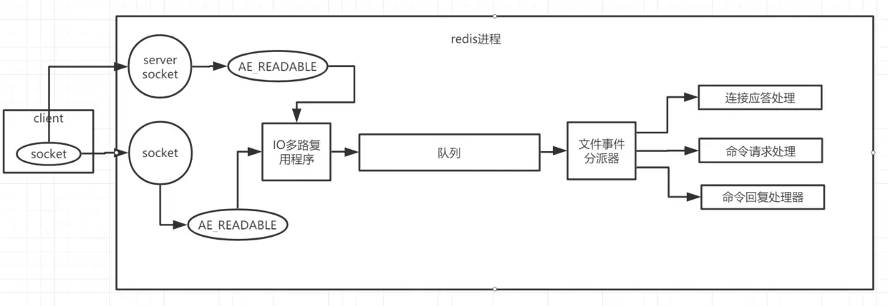
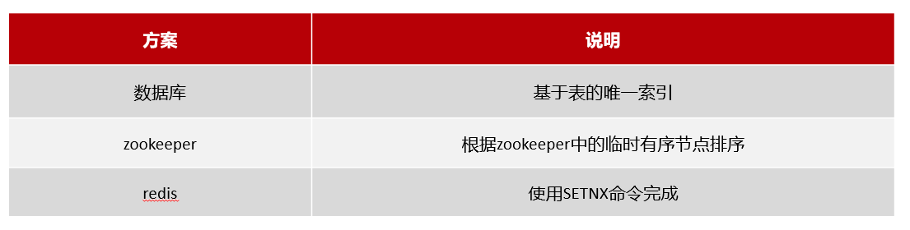
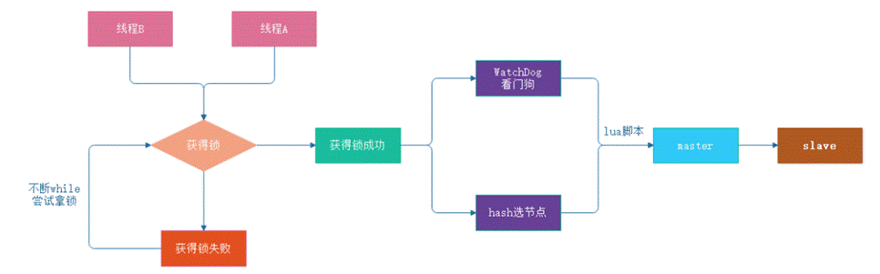
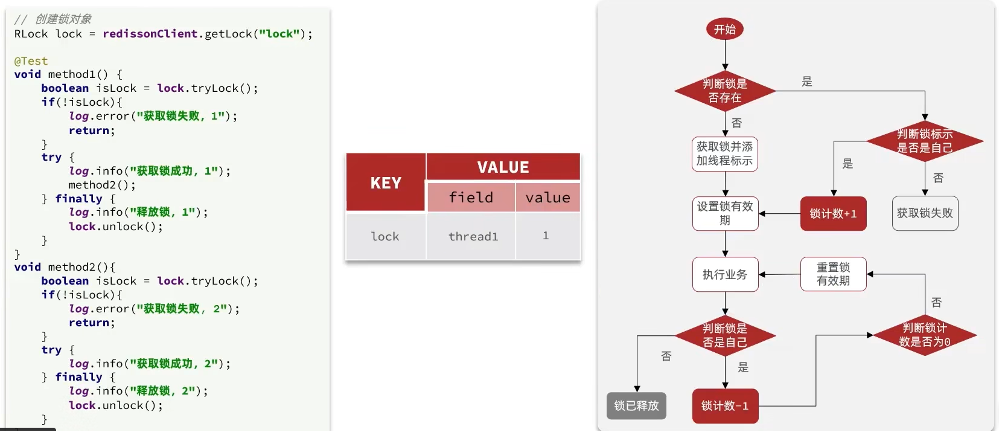
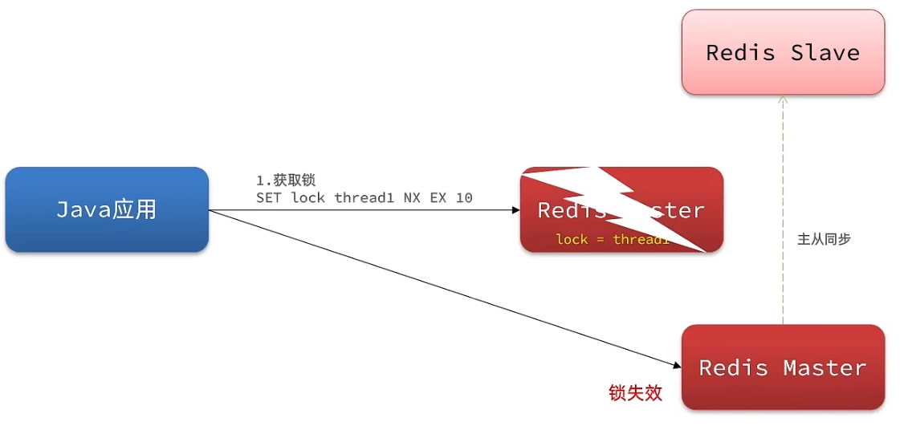
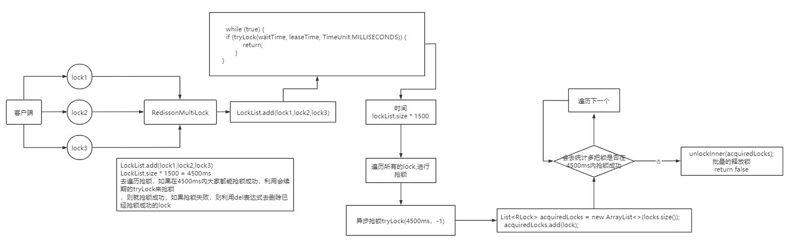
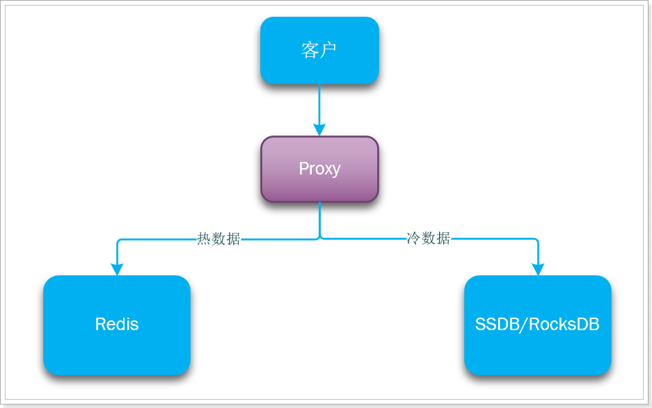

# Redis

## 概述

### Redis是什么？优缺点？

Redis本质上是一个Key-Value类型的内存数据库，很像Memcached，整个数据库加载在内存当中操作，定期通过异步操作把数据库中的数据flush到硬盘上进行保存。

因为是纯内存操作，Redis的性能非常出色，每秒可以处理超过 10万次读写操作，是已知性能最快的Key-Value 数据库。

**优点**：

* 读写性能极高， Redis能读的速度是110000次/s，写的速度是81000次/s。
* 支持数据持久化，支持AOF和RDB两种持久化方式。
* 支持事务， Redis的所有操作都是原子性的，意思就是要么成功执行要么失败完全不执行。单个操作是原子性的。多个操作也支持事务，即原子性，通过MULTI和EXEC指令包起来。
* 数据结构丰富，除了支持string类型的value外，还支持hash、set、zset、list等数据结构。
* 支持主从复制，主机会自动将数据同步到从机，可以进行读写分离。
* 丰富的特性 – Redis还支持 publish/subscribe， 通知， key 过期等特性。

**缺点**：

* 数据库容量受到物理内存的限制，不能用作海量数据的高性能读写，因此Redis适合的场景主要局限在较小数据量的高性能操作和运算上。
* 主机宕机，宕机前有部分数据未能及时同步到从机，切换IP后还会引入数据不一致的问题，降低了系统的可用性。

### Redis为什么快

- **内存存储**：Redis是使用内存(in-memeroy)存储，没有磁盘IO上的开销。数据存在内存中，类似于 HashMap，HashMap 的优势就是查找和操作的时间复杂度都是O(1)。

- **单线程实现**（ Redis **6.0以前**）：Redis使用单个线程处理请求，避免了多个线程之间线程切换和锁资源争用的开销。注意：单线程是指的是在核心网络模型中，网络请求模块使用一个线程来处理，即一个线程处理所有网络请求。

- **非阻塞IO**：Redis使用多路复用IO技术，将epoll作为I/O多路复用技术的实现，再加上Redis自身的事件处理模型将epoll中的连接、读写、关闭都转换为事件，不在网络I/O上浪费过多的时间。

- **优化的数据结构**：Redis有诸多可以直接应用的优化数据结构的实现，**应用层可以直接使用原生的数据结构提升性能**。

- **使用底层模型不同**：Redis直接**自己构建了 VM (虚拟内存)机制 ，因为一般的系统调用系统函数的话，会浪费一定的时间去移动和请求。**

  > Redis的VM(虚拟内存)机制就是**暂时把不经常访问的数据(冷数据)从内存交换到磁盘中**，从而腾出宝贵的内存空间用于其它需要访问的数据(热数据)。**通过VM功能可以实现冷热数据分离，使热数据仍在内存中、冷数据保存到磁盘。**这样就可以避免因为内存不足而造成访问速度下降的问题。
  >
  > Redis提高数据库容量的办法有两种：一种是可以将数据分割到多个RedisServer上；另一种是使用虚拟内存把那些不经常访问的数据交换到磁盘上。**需要特别注意的是Redis并没有使用OS提供的Swap，而是自己实现。**

### Redis与Memcache区别

* **数据类型**：**Memcached**所有的值均是**简单的字符串**和**二进制（新版增加）**，Redis支持更为丰富的数据类型，支持string(字符串)，list(列表)，Set(集合)、Sorted Set(有序集合)、Hash(哈希)等。

* **value值大小不同**：Redis 最大可以达到 **1gb**；memcache 只有 **1mb**。

* **持久化**：Redis支持数据落地持久化存储，可以将内存中的数据保持在磁盘中，重启的时候可以再次加载进行使用。 **memcache不支持**数据持久存储 。

* **集群模式**：Redis提供主从同步机制，以及 Cluster集群部署能力，能够提供高可用服务。Memcached没有原生的集群模式，需要依靠客户端来实现往集群中分片写入数据

* **性能快**：Redis的速度比Memcached快很多。

* **网络IO模型**：Redis使用单线程的多路 IO 复用模型，Memcached使用多线程的非阻塞IO模式。

* **Redis支持服务器端的数据操作**：Redis相比Memcached来说，拥有更多的数据结构和并支持更丰富的数据操作，通常在Memcached里，你需要将数据拿到客户端来进行类似的修改再set回去。

  这大大增加了网络IO的次数和数据体积。在Redis中，这些复杂的操作通常和一般的GET/SET一样高效。所以，如果需要缓存能够支持更复杂的结构和操作，那么Redis会是不错的选择。

  

### 为什么用Redis做缓存？

**从高并发上来说：**

- **直接操作缓存能够承受的请求是远远大于直接访问数据库的**。

**从高性能上来说：**

- 用户第一次访问数据库中的某些数据。 因为是从硬盘上读取的所以这个过程会比较慢。将该用户访问的数据存在缓存中，下一次再访问这些数据的时候就可以直接从缓存中获取了。**操作缓存就是直接操作内存，所以速度相当快**。

### 而不用map/guava做缓存?

缓存分为本地缓存和分布式缓存。以java为例，使用自带的map或者guava实现的是本地缓存，最主要的特点是轻量以及快速，生命周期随着jvm的销毁而结束，并且在多实例的情况下，每个实例都需要各自保存一份缓存，缓存不具有一致性。

使用Redis或memcached之类的称为分布式缓存，在多实例的情况下，各实例共用一份缓存数据，缓存具有一致性。缺点是需要保持Redis或memcached服务的高可用，整个程序架构上较为复杂。

* Redis 可以用几十 G 内存来做缓存，Map 不行，一般 JVM 也就分几个 G 数据就够大了；
* Redis 的缓存可以持久化，Map 是内存对象，程序一重启数据就没了；
* Redis 可以实现分布式的缓存，Map 只能存在创建它的程序里；
* Redis 可以处理每秒百万级的并发，是专业的缓存服务，Map 只是一个普通的对象；
* Redis 缓存有过期机制，Map 本身无此功能；Redis 有丰富的 API，Map 就简单太多了；
* Redis可单独部署，多个项目之间可以共享，本地内存无法共享；
* Redis有专门的管理工具可以查看缓存数据。

### Redis常用场景

**1.缓存**

缓存现在几乎是所有中大型网站都在用的必杀技，合理的利用缓存不仅能够提升网站访问速度，还能大大降低数据库的压力。Redis提供了键过期功能，也提供了灵活的键淘汰策略，所以，现在Redis用在缓存的场合非常多。

**2.排行榜**

很多网站都有排行榜应用的，如京东的月度销量榜单、商品按时间的上新排行榜等。Redis提供的有序集合数据类构能实现各种复杂的排行榜应用。

**3.计数器**

什么是计数器，如电商网站商品的浏览量、视频网站视频的播放数等。为了保证数据实时效，每次浏览都得给+1，并发量高时如果每次都请求数据库操作无疑是种挑战和压力。Redis提供的incr命令来实现计数器功能，内存操作，性能非常好，非常适用于这些计数场景。

**4.分布式session**

在分布式系统下，服务会部署在不同的tomcat，因此**多个tomcat的session无法共享**，以前存储在session中的数据无法实现共享，可以用redis代替session，解决**分布式系统间数据共享**问题。

**5.分布式锁**

在很多互联网公司中都使用了分布式技术，分布式技术带来的技术挑战是对同一个资源的并发访问，如全局ID、减库存、秒杀等场景，并发量不大的场景可以使用数据库的悲观锁、乐观锁来实现，但在并发量高的场合中，利用数据库锁来控制资源的并发访问是不太理想的，大大影响了数据库的性能。可以利用Redis的setnx功能来编写分布式的锁，如果设置返回1说明获取锁成功，否则获取锁失败，实际应用中要考虑的细节要更多。

Redis中的**乐观锁**机制，可以帮助我们实现分布式锁的效果，用于解决**分布式系统下**的**多线程安全**问题

**6.社交网络**

点赞、踩、关注/被关注、共同好友等是社交网站的基本功能，社交网站的访问量通常来说比较大，而且传统的关系数据库类型不适合存储这种类型的数据，Redis提供的哈希、集合等数据结构能很方便的的实现这些功能。如在微博中的共同好友，通过Redis的set能够很方便得出。

**7.最新列表**

Redis列表结构，LPUSH可以在列表头部插入一个内容ID作为关键字，LTRIM可用来限制列表的数量，这样列表永远为N个ID，无需查询最新的列表，直接根据ID去到对应的内容页即可。

**8.消息系统**

消息队列是大型网站必用中间件，如ActiveMQ、RabbitMQ、Kafka等流行的消息队列中间件，主要用于业务解耦、流量削峰及异步处理实时性低的业务。Redis提供了发布/订阅及阻塞队列功能，能实现一个简单的消息队列系统。另外，这个不能和专业的消息中间件相比。

## 数据类型和场景

### 5+4数据类型场景

* **String** 类型是最基本的 key-value 结构，key 是唯一标识，value 是具体的值，value不仅可以是字符串， 也可以是数字（整数或浮点数），二进制安全的字符串，最大512M。。

  * 底层的数据结构主要是由 **int** 和 **SDS**（简单动态字符串）实现。
  * 应用场景：**缓存对象、常规计数（访问次数、点赞量、转发量、库存数量）、分布式锁（setnx+Lua）、共享session信息**等。
  
* **List** 类型是简单的字符串列表，**按照插入顺序排序**，可以从头部或尾部向 List 列表添加元素。列表的最大长度为 `2^32 - 1`。

  * 底层数据结构是由**双向链表**或**压缩列表**实现。3.2版本之后，只由**quicklist**实现。
  
    如果列表的元素个数小于 **512**个（默认值，可由 `list-max-ziplist-entries` 配置），列表每个元素的值都小于 **64字节**（默认值，可由 `list-max-ziplist-value` 配置），Redis 会使用**压缩列表**作为 List 类型的底层数据结构；否则就使用**双向链表**实现
  
  * 应用场景：**消息队列**（有两个问题：1. 生产者需要自行实现全局唯一 ID；2. 不能以消费组形式消费数据）等。
  
* **Hash** 类型是一个 string 类型的 field 和 value 键值对的映射表，适合存储对象。

  * 底层数据结构是由**压缩列表**或**哈希表**实现的。Redis 7.0 中，压缩列表数据结构已经废弃了，交由**​ ​listpack** ​来实现了。
  * 应用场景：**缓存属性频繁变化的对象**、**购物车**以用户 id 为 key，商品 id 为 field，商品数量为 value，恰好构成了购物车的3个要素。当前仅仅是将商品ID存储到了Redis 中，在回显商品具体信息的时候，还需要拿着商品 id 查询一次数据库，获取完整的商品的信息。
  
* **Set** 类型是一个**无序**并**唯一**的键值集合，它的存储顺序不会按照插入的先后顺序进行存储。

  * 底层数据结构是由**哈希表**或**整数集合**实现的。如果集合中的元素**都是整数**且**元素个数小于 512** （默认值，`set-maxintset-entries`配置），使用**整数集合**作为 Set 类型的底层数据结构；否则使用**哈希表**。
  * 应用场景：聚合计算场景，求**并集、交集、差集**等。比如**点赞、共同关注、抽奖活动(去重，从key中随机选出n个元素)**。
  
* **Zset** 类型（**有序集合类型**）相比于 Set 类型多了一个**排序属性 score**（分值），每个存储元素相当于由有序集合的元素值和分数值组成，元素值不能重复，分数值可以重复。

  * 底层数据结构是由**压缩列表**或**跳表**实现的。Redis 7.0 中，压缩列表数据结构已经废弃了，交由**listpack ​**来实现了。
  * 应用场景：**排序场景**，比如**排行榜、电话和姓名排序**等。使用有序集合的 `ZRANGEBYLEX` 或 `ZREVRANGEBYLEX` 可以帮助我们实现**电话号码或姓名**的排序。
  
* **BitMap**，位图（2.2 版新增）是一串连续的二进制数组（0和1），可以通过偏移量（offset）定位元素。BitMap通过最小的单位bit来进行**0|1**的设置，表示某个元素的值或者状态。

  * 底层数据结构是用 **String** 类型实现的。
  * 应用场景：二值状态统计的场景，比如**签到、判断用户登陆状态、连续签到用户总数**等；
  
* **HyperLog**（2.8 版新增）是一种用于「**统计基数**」的数据集合类型，就是**统计一个集合中不重复的元素个数**。它的统计是**基于概率完成的，不是非常准确**。标准误算率是 0.81%。

  * 优点是，**输入元素数量大，计算所需的空间小，比hash节省空间**
  * 应用场景：**海量数据**基数统计的场景，比如**百万级网页访问量计数**：在统计 UV 时，你可以用 **PFADD 命令**（用于向 HyperLogLog 中添加新元素）把访问页面的每个用户都添加到 HyperLogLog 中。然后用 **PFCOUNT 命令直接获得 page1 的 UV 值**了，这个命令的作用就是返回 HyperLogLog 的统计结果。
  
* **GEO**（3.2 版新增）主要用于**存储地理位置信息**，并对存储的信息进行操作。

  * 底层数据结构是用 **Zset** 实现的。
  * 应用场景：**滴滴叫车**：使用 GeoHash 编码方法实现了经纬度到 Sorted Set 中元素权重分数的转换，就可以把经纬度保存到 Sorted Set 中，利用 Sorted Set 提供的“按权重进行有序范围查找”的特性，实现 **LBS 服务中频繁使用**的“**搜索附近**”的需求。
  
* **Stream**（5.0 版新增）是**专门为消息队列设计**的数据类型。

  * 消息保序：XADD/XREAD
  * 阻塞读取：XREAD block
  * 重复消息处理：Stream 在使用 XADD 命令，会自动生成全局唯一 ID；
  * 消息可靠性：内部使用 PENDING List 自动保存消息，使用 XPENDING 命令查看消费组已经读取但是未被确认的消息，消费者使用 XACK 确认消息；
  * 支持消费组形式消费数据（**同一个消费组里的消费者不能消费同一条消息**。）
  * 应用场景：消息队列，相比于基于 List 类型实现的消息队列，有这两个特有的特性：**自动生成全局唯一消息ID**，**支持以消费组形式消费**数据。

  **缺陷**

  ​	**1.消息可能丢失**

  ​	Redis 在以下 2 个场景下，都会导致数据丢失：

  - **AOF 持久化配置为每秒写盘**，但这个写盘过程是**异步的**，Redis 宕机时会存在数据丢失的可能。（**数据存储在内存中**）
  - **主从复制也是异步的**，主从切换时，也存在丢失数据的可能。

  ​	**2.消息不可堆积**

  Redis 的数据都存储在**内存中**，这就意味着一旦发生**消息积压**，则会导致 Redis 的内存持续增长，如果**超过机器内存上限**，就会面临被 **OOM** 的风险。

  所以 Redis 的 Stream 提供了可以指定**队列最大长度**的功能，就是为了避免这种情况发生。当指定队列最大长度时，**队列长度超过上限后，旧消息会被删除，只保留固定长度的新消息**。这么来看，Stream 在消息积压时，如果指定了最大长度，还是**有可能丢失消息**的。

#### Redis发布订阅机制

发布订阅机制存在以下缺点，都是跟**丢失数据**有关：

1. 发布/订阅机制没有基于任何数据类型实现，所以**不具备「数据持久化」的能力**，也就是发布/订阅机制的相关操作，**不会写入到 RDB 和 AOF 中**，当 **Redis 宕机或重启**，发布/订阅机制的数据也会**全部丢失**。
2. 发布订阅模式是“**发后既忘**”的工作模式，如果有订阅者**离线重连后不能消费**之前的**历史消息**。（消息的**可靠性**无法保证）
3. 当消费端**有一定的消息积压**时，也就是生产者发送的消息，消费者**消费不过来**时，如果超过 32M 或者是 60s 内持续保持在 8M 以上，**消费端会被强行断开**，这个参数是在配置文件中设置的，默认值是 `client-output-buffer-limit pubsub 32mb 8mb 60`。

Redis **是否适合做消息队列**，关键看你的业务场景：

- 如果你的业务场景足够简单，对于**数据丢失不敏感**，而且**消息积压概率比较小**的情况下，把 Redis 当作队列是完全可以的。
- 如果你的业务**有海量消息**，**消息积压的概率比较大**，并且**不能接受数据丢失**，那么还是用**专业的消息队列**中间件吧。

### 底层数据结构

**SDS简单动态字符串**

* **`len`**​ 属性记录了字符串长度，可以**O(1)复杂度获取字符串长度**。
* **`alloc`​**​**属性记录了分配给字符数组的空间长度，**这样在修改字符串的时候，可以通过 `alloc - len`​ 计算出剩余的空间大小，可以用来判断空间是否满足修改需求，如果不满足的话，就会自动将 SDS 的空间扩展至执行修改所需的大小（**小于 1MB 翻倍扩容，大于 1MB 按 1MB 扩容**），然后才执行实际的修改操作，所以使用 SDS 既不需要手动修改 SDS 的空间大小，也不会出现前面所说的缓冲区溢出的问题。
* **`flags`​**​**属性用来表示不同类型的 SDS**。一共设计了 5 种类型，不同类型的**数据结构中的 len 和 alloc 成员变量的数据类型不同**。能灵活保存不同大小的字符串，**从而节省内存空间**。
* **​ 不仅可以保存文本数据，还可以保存二进制数据**。因为 `SDS`​ 使用 `len`​ 属性的值而不是空字符（'\0'）来判断字符串是否结束，并且 SDS 的所有 API 都会以处理二进制的方式来处理 SDS 存放在 `buf[]`​ 数组里的数据。所以 SDS 不光能存放文本数据，而且能保存图片、音频、视频、压缩文件这样的二进制数据。

**双向链表**

链表实现优点如下：

* listNode 链表节点的结构里带有 prev 和 next 指针，**获取某个节点的前置节点或后置节点的时间复杂度只需O(1)，而且这两个指针都可以指向 NULL，所以链表是无环链表**；
* list 结构因为提供了表头指针 head 和表尾节点 tail，所以**获取链表的表头节点和表尾节点的时间复杂度只需O(1)**；
* list 结构因为提供了链表节点数量 len，所以**获取链表中的节点数量的时间复杂度只需O(1)**；
* listNode 链表节点使用 void* 指针保存节点值，并且可以通过 list 结构的 dup、free、match 函数指针为节点设置该节点类型特定的函数，因此**链表节点可以保存各种不同类型的值**；

链表的缺陷也是有的：

* 链表每个节点之间的内存都是不连续的，不像数组，**无法很好利用 CPU 缓存来加速访问**。
* 就算只保存一个链表节点的值都需要一个链表节点结构头的分配，**内存开销较大**。

**压缩列表**

压缩列表被设计成一种内存紧凑型的数据结构，占用一块连续的内存空间，不仅可以利用 CPU 缓存，而且会针对不同长度的数据，进行相应编码，可以有效地节省内存开销。

但是，压缩列表的缺陷也是有的：

* 不能保存过多的元素，否则查询效率就会降低；
* 新增或修改某个元素时，压缩列表占用的内存空间需要重新分配，甚至可能引发**连锁更新**的问题。就是由于**`prevlen`**​属性记录了「前一个节点」的长度，可能发生上一个节点的空间拓展导致下一个节点的`prevlen`​占用空间发生变化，从而也需要空间拓展的情况，引起连锁反应，造成性能下降。

因此，Redis 对象（List 对象、Hash 对象、Zset 对象）包含的**元素数量较少（<256）**，或者元**素值不大(<64字节)**的情况才会使用压缩列表作为底层数据结构。

**哈希表**

哈希表**能以 O(1) 的复杂度快速查询数据**。将 key 通过 Hash 函数的计算，再对哈希表大小取模，就能得到数据在表中的索引，因为哈希表实际上是数组，所以可以通过索引值快速查询到数据。但是在哈希表大小固定的情况下，随着数据不断增多，那么**哈希冲突**的可能性也会变高。

**Redis 采用「链式哈希」来解决哈希冲突**。每个哈希表节点都有一个 next 指针，用于指向下一个哈希表节点，**多个节点被分配到同一个位置时用next指针连接起来，构成链表**，这样就解决了哈希冲突。但是随着链表长度的增加，在查询这一位置上的数据的耗时就会增加，就需要扩大哈希表，也就是**rehash**。

**rehash：**

Redis定义了两个哈希表，在正常服务请求阶段，插入的数据，都会写入到「哈希表 1」，此时的「哈希表 2 」 并没有被分配空间。随着数据逐步增多，触发了 rehash 操作，分为三步：

* 给「哈希表 2」 分配空间，一般会比「哈希表 1」 大 2 倍；
* 将「哈希表 1 」的数据迁移到「哈希表 2」 中；
* 迁移完成后，「哈希表 1 」的空间会被释放，并把「哈希表 2」 设置为「哈希表 1」，然后在「哈希表 2」 新创建一个空白的哈希表，为下次 rehash 做准备。

**渐进式rehash：**

为了避免 rehash 在数据迁移过程中，因拷贝数据的耗时，影响 Redis 性能的情况，所以 Redis 采用了**渐进式 rehash**，也就是数据的迁移工作不再是一次性完成，而是分多次迁移。具体步骤是：

* 给「哈希表 2」 分配空间；
* 在 rehash 进行期间，每次哈希表元素进行新增（只在表2上新增）、删除、查找（先在1中找，再在2中找）或者更新操作时，Redis 除了会执行对应的操作之外，还会顺序将「哈希表 1 」中索引位置上的所有 key-value 迁移到「哈希表 2」 上；
* 随着处理客户端发起的哈希表操作请求数量越多，最终在某个时间点会把「哈希表 1 」的所有 key-value 迁移到「哈希表 2」，从而完成 rehash 操作。

**rehash触发条件：**

定义负载因子的概念，就是已保存的节点数量除以哈希表的大小。

* 当负载因子大于等于 1 ，并且 Redis 没有在执行 RDB 快照或没有进行 AOF 重写的时候，就会进行 rehash 操作。
* 当负载因子大于等于 5 时，哈希冲突就非常严重了，此时不管有没有有在执行 RDB 快照或 AOF 重写，都会强制进行 rehash 操作。

**整数集合**

当一个Set 对象只包含整数值元素，并且元素数量不大时，就会使用整数集合作为底层实现。

整数集合会有一个升级规则，如果一直向整数集合添加 int16_t 类型的元素，那么整数集合的底层实现就一直是用 int16_t 类型的数组，当我们将一个新元素加入到整数集合里面，如果新元素的类型（int32_t）比整数集合现有所有元素的类型（int16_t）都要长时，整数集合需要先进行升级，也就是按新元素的类型（int32_t）扩展数组的空间大小，然后才能将新元素加入到整数集合里，好处是**节省内存资源**。

**跳表**

Redis 只有 Zset 对象的底层实现用到了跳表，跳表的优势是能支持平均 O(logN) 复杂度的节点查找。

跳表的相邻两层的节点数量最理想的比例是 **2:1**，查找复杂度可以降低到 **O(logN)**。为了尽量维持这个比例，跳表在创建节点时候，会生成范围为[0-1]的一个随机数，如果这个随机数小于 0.25（相当于概率 25%），那么层数就增加 1 层，然后继续生成下一个随机数，直到随机数的结果大于 0.25 结束，最终确定该节点的层数。

**查询过程：**查找一个跳表节点的过程时，跳表会从头节点的**最高层**开始，逐一遍历每一层。在遍历某一层的跳表节点时，会用跳表节点中的 SDS 类型的元素和元素的权重来进行判断，共有两个判断条件：

* 如果当前节点的权重「小于」要查找的权重时，跳表就会访问该层上的下一个节点。
* 如果当前节点的权重「等于」要查找的权重时，并且当前节点的 SDS 类型数据「小于」要查找的数据时，跳表就会访问该层上的下一个节点。

如果上面两个条件都不满足，或者下一个节点为空时，跳表就会使用目前遍历到的节点的 level 数组里的下一层指针，然后沿着下一层指针继续查找，这就相当于跳到了下一层接着查找。

**quicklist**

quicklist 就是「双向链表 + 压缩列表」组合。在向 quicklist 添加一个元素的时候，不会像普通的链表那样，直接新建一个链表节点。而是会检查插入位置的压缩列表是否能容纳该元素，如果能容纳就直接保存到 quicklistNode 结构里的压缩列表，如果不能容纳，才会新建一个新的 quicklistNode 结构。

quicklist 会控制 quicklistNode 结构里的压缩列表的大小或者元素个数，来规避潜在的连锁更新的风险，但是这并没有完全解决连锁更新的问题。

**listpack**

listpack 头包含两个属性，分别记录了 listpack **总字节数**和**元素数量**，然后 listpack 末尾也有个结尾标识。

* encoding，定义该元素的编码类型，会对不同长度的整数和字符串进行编码；
* data，实际存放的数据；
* len，encoding+data的总长度；

listpack 只记录当前节点的长度，当我们向 listpack 加入一个新元素的时候，**不会影响其他节点的长度字段的变化，从而避免了压缩列表的连锁更新问题。**


## 持久化

把数据存储到磁盘，这样 **Redis 重启**就能够**从磁盘中恢复**原有的数据。Redis 共有**三种数据持久化**的方式：

* **AOF 日志**：**每执行一条写操作命令**，就把该命令以**追加**的方式写入到AOF文件里；
* **RDB 快照**：将**某一时刻**的内存数据，以**二进制**的方式写入磁盘；
* **混合持久化方式**：Redis **4.0** 新增，集成了 AOF 和 RBD 的优点；

### AOF 刷盘策略


* **Always**：每次写命令执行完后，同步将 AOF 日志数据写回硬盘；（**高可靠，但是性能开销大**）
* **Everysec**：每次写命令执行完后，先将命令写入到 AOF 文件的**系统内核缓冲区**然后直接返回，**由后台线程每隔一秒**将缓冲区里的内容写回到硬盘；（服务器（操作系统）宕机**最多丢失一秒的数据**）
* **No**：同样是将命令写入到**系统内核缓冲区**，之后由**操作系统决定何时将缓冲区内容写回硬盘**（Linux 一般为 **30 秒一次**）。（**高性能**，**宕机**可能**丢失更多的数据**）

**先执行命令，再写AOF文件**（保存的是**指令**）的**好处：**

* 执行的时候会**检查语法**，避免把**错误语法**的指令写进文件。
* **不会阻塞当前的命令**。**但可能阻塞其他操作：** 因为 AOF 日志也是在主线程中执行，所以当 Redis 把AOF文件写入磁盘的时候，还是会阻塞后续的操作无法执行。

* **数据可能会丢失：** 执行完写操作命令，还没来得及将AOF文件写入到磁盘时，服务器宕机，这个数据就会有丢失的风险。

### AOF 重写机制


为了避免AOF日志过大，当 AOF 文件**大小超过所设定的阈值后**，Redis 就会**启用 AOF 重写机制**，来压缩 AOF 文件。读取当前数据库中的**所有键值对**，然后将**每一个键值对用一条命令**记录到「新的 AOF 文件」，等到全部记录完后，就将新的 AOF 文件替换掉现有的 AOF 文件。这样一个键值对只需要**一条命令，**删除掉了历史命令。

重写是由**后台子进程** bgrewriteaof 来**异步完成**的。好处是：

* 子进程进行 AOF 重写期间，**避免阻塞主进程**；
* 这里使用**子进程而不是多线程**，因为如果是使用多线程，**多线程之间会共享内存**，那么在修改共享内存数据的时候，需要通过**加锁来保证数据的安全**，而这样就会**降低性能**。而使用子进程，父子进程虽然是共享内存数据的，不过**这个共享的内存只能以只读的方式**，而当父子进程任意一方**修改了该共享内存**，就会发生「**写时复制**」，于是父子进程就有了**独立的数据副本，就不用加锁来保证数据安全**。

为了解决主进程修改了已经存在的 key-value 导致的**主进程和子进程数据不一致**的问题，Redis 设置了一个 **AOF 重写缓冲区**，这个缓冲区在创建子进程之后开始使用。在重写 AOF 期间，当 Redis 执行完一个写命令之后，它会**同时将这个写命令写入到 「AOF 缓冲区」和 「AOF 重写缓冲区」**。当子进程完成 AOF 重写工作后，将 AOF 重写缓冲区中的所有内容**追加**到新的 AOF 的文件中，使得新旧两个 AOF 文件所保存的数据库状态一致。

通过下面两个配置项，控制 Redis **重写 AOF 文件的频率：**

- `auto-aof-rewrite-min-size 64mb`
- `auto-aof-rewrite-percentage 100`

上面两个配置的作用：当 AOF 文件的体积**大于 64MB**，并且 **体积比上一次重写之后的体积大了至少一倍**，就会执行 AOF 重写。

**AOF的优点：持久化频率高**，数据**可靠性高**，**没有额外的内存或CPU消耗**

**AOF的缺点：**文件**体积大**，数据**恢复时效率较低**

### RDB 快照

RDB 快照记录的是**实际数据**，而 AOF 文件记录的是**命令操作**的日志。

因此在 Redis 恢复数据时， **RDB 恢复数据的效率会比 AOF 高些**，直接将 RDB 文件读入内存就可以，不需要像 AOF 那样还需要额外执行操作命令的步骤才能恢复数据。

**RDB默认是服务停止时执行**，**save 60 1000**代表60秒内至少执行1000次修改则触发RDB。

Redis **提供了两个命令来生成 RDB 文件**，他们的区别就在于是否在「**主线程**」里执行：

* 执行了 **save** 命令，就会在**主线程生成 RDB 文件**，由于和执行操作命令在同一个线程，所以如果写入 RDB 文件的时间太长，**会阻塞主线程**；
* 执行了 **bgsave** 命令，会fork一个**子进程来生成 RDB 文件**，这样可以**避免主线程的阻塞**；

？？执行 bgsave 也是通过**写时复制**写RDB文件，和AOF一样。所以一旦在写RDB的过程中，主进程修改了数据，那么RDB中的数据就不再是最新的数据。？？

fork采用的是**copy-on-write**技术：

- 当主进程执行读操作时，访问共享内存；
- 当主进程执行写操作时，则会拷贝一份数据，执行写操作。


RDB的**优点**：

- RDB持久化文件小，Redis**数据恢复速度快**
- **子进程不影响父进程**，父进程可以持续处理客户端命令
- 子进程fork时采用**copy-on-write**方式，大多数情况下，**没有太多的内存消耗，效率比较好**。

 RDB 的**缺点**：

- 子进程fork时采用copy-on-write方式，如果Redis此时**写操作较多**，可能导致**额外的内存占用**，甚至**内存溢出**
- RDB**文件压缩**会减小文件体积，但通过时会**对CPU有额外的消耗**
- 如果业务场景很看重**数据的持久性** (durability)，那么不应该采用 RDB 持久化。譬如说，如果 Redis 每 **5** 分钟执行一次 RDB 持久化，要是 Redis 意外奔溃了，那么最多会**丢失 5 分钟的数据**。

和 RDB 持久化**相关的配置**：

- `save 60 10000`：如果在 **60 秒内有 10000 个 key** 发生改变，那就执行 RDB 持久化。
- `stop-writes-on-bgsave-error yes`：如果 Redis 执行 RDB **持久化失败**（常见于操作系统内存不足），那么 Redis 将**不再接受 client 写入数据**的请求。实践中，通常会将`stop-writes-on-bgsave-error`设置为`false`，同时让监控系统在 Redis 执行 RDB **持久化失败时发送告警**，以便**人工介入解决**，而不是粗暴地拒绝 client 的写入请求。
- `rdbcompression yes`：当生成 RDB 文件时，同时进行**压缩**。
- `dbfilename dump.rdb`：将 RDB 文件命名为 dump.rdb。
- `dir /var/lib/redis`：将 RDB 文件保存在`/var/lib/redis`目录下。

### 混合持久化

**默认**情况下，Redis 使用的是 **RDB** 持久化。

**RDB**持久化文件**体积较小**，但是保存数据的**频率一般较低**，**可靠性差**，**容易丢失数据**。另外RDB写数据时会采用**Fork函数拷贝主进程**，可能**有额外的内存消耗**，**文件压缩也会有额外的CPU消耗**。

**AOF**持久化可以做到每秒钟持久化一次，**可靠性高**。但是持久化文件**体积较大**，导致**数据恢复时读取文件时间较长，效率略低**


在 **AOF 重写日志**时，`fork`​ 出来的**重写子进程**会先将**与主线程共享的内存数据以 RDB 方式**写入到 AOF 文件，然后主线程处理的操作命令会被**记录在重写缓冲区**里，重写缓冲区里的增量命令会**以 AOF 方式**写入到 AOF 文件，写入完成后**通知主进程**将新的含有 RDB 格式和 AOF 格式的 AOF 文件替换旧的的 AOF 文件。也就是AOF 文件的**前半部分是 RDB 格式的全量数据，后半部分是 AOF 格式的增量数据**。

**优点：**

* 重启时候，由于**前半部分是 RDB 内容**，这样**加载的时候速度会很快**。
* **后半部分的 AOF 内容**是 Redis 后台**子进程重写 AOF 期间**，**主线程处理的操作命令**，可以使得**数据更少的丢失**。

**缺点：**

* AOF 文件中添加了 **RDB 压缩二进制格式**的内容，使得 AOF 文件的**可读性变得很差**；
* **兼容性差**，如果开启混合持久化，那么此混合持久化 AOF 文件，就**不能用在 Redis 4.0 之前版本**了

### Redis持久化数据和缓存怎么扩容

* 如果Redis被**当做缓存使用**，使用**一致性哈希实现动态扩容缩容**。

* 如果Redis被**当做一个持久化存储使用**，必须使用固定的**keys-to-nodes映射**关系，**节点数量一旦确定不能变化**。**否则**就只能用**Redis集群**在**运行时进行数据再平衡**。

## 内存回收

主要分为**过期删除策略**和**内存淘汰策略**。

## 过期删除策略

### 过期删除策略

将已过期的键值对删除。Redis 选择「**惰性删除+定期删除**」配和使用。

1. **定时删除**：在设置 key 的过期时间时，同时创建一个**定时事件**，当时间到达时，由事件处理器自动执行 key 的删除操作。（**对内存友好**、**对CPU不友好**，会影响Redis的**吞吐量**和**响应时间**。）
2. **惰性删除**：不主动删除过期键，**每次访问 key 时，才判断 key 是否过期**，如果过期则删除该 key。（**对CPU友好、对内存不友好**）
3. **定期删除**：**默认每隔100ms「随机」**从数据库中取出**一定数量的 key** 进行检查，并删除其中的过期key。如果「过期 key 」占比**大于 25%**，则再取一次。

那 Redis 为了**保证**定期删除**不会出现循环过度**，导致**线程卡死**现象，为此增加了定期删除循环**流程的时间上限**，默认不会超过 25ms。

### 持久化时过期键

对于 **RDB** 文件：

* **RDB 文件生成阶段**：**过期的键「不会」被保存到新的 RDB 文件中**。
* **RDB 加载阶段**：要看服务器是主服务器还是从服务器：
* **「主服务器」在载入 RDB 文件时，程序会对文件中保存的键进行检查，过期键「不会」被载入到数据库中**。
  * **「从服务器」在载入 RDB 文件时，不论键是否过期都会被载入到数据库中**。但由于**主从数据同步**时，**从服务器的数据会被清空**。所以一般来说，过期键对载入 RDB 文件的从服务器也不会造成影响。

对于 **AOF** 文件：

* **AOF 写入阶段**：**如果数据库某个过期键还没被删除，那么 AOF 文件会保留此过期键，当此过期键被删除后，Redis 会向 AOF 文件追加一条 DEL 命令来显式地删除该键值**。
* **AOF 重写阶段**：**已过期的键不会被保存到重写后的 AOF 文件中**，因此不会对 AOF 重写造成任何影响。

### 主从中过期键

**从库不会进行过期扫描，从库对过期的处理是被动的**。也就是即使从库中的 key 过期了，如果有客户端访问从库时，依然可以得到 key 对应的值，像未过期的键值对一样返回。

从库的过期键处理依靠主服务器控制，**主库在 key 到期时，会在 AOF 文件里增加一条删除指令，同步到所有的从库**，从库通过执行这条删除指令来删除过期的 key。

## 内存淘汰策略

在Redis会**在每一次处理命令的时候**（processCommand函数调用**freeMemoryIfNeeded**）判断运行内存达到了设置的**最大运行内存**，就会触发**内存淘汰机制**。通过参数 **maxmemory**可以设置。Redis 会把带有TTL的 key 存储到**过期字典**中。

**Redisv4.0前提供 6 种数据淘汰策略**：

- **volatile-lru**：从过期字典中，LRU算法移除**最近最少使用**的key
- **allkeys-lru**：从所有key中，移除**最近最少使用**的key（**最常用**）
- **volatile-ttl**：从过期字典中，淘汰**将要过期**的key
- **volatile-random**：从过期字典中，**随机**淘汰key
- **allkeys-random**：从所有key中，**随机**淘汰key
- **no-eviction**（**默认**）：**直接写入报错**

**Redisv4.0后增加以下 2 种**：

- **volatile-lfu**：从过期字典中，淘汰**最不经常使用的**
- **allkeys-lfu**：从所有key中，淘汰**最不经常使用**的key。

内存淘汰策略可以通过修改**Redis.conf**里的**maxmemory-policy** ，**默认是no-eviction**。

### LRU和LFU

**默认LRU算法**，淘汰**最近最少使用**的数据。

Redis 实现方式是对象结构体添加一个**额外的lru字段**，用于记录**最后一次访问时间**。**随机取几个值(默认3个)**，然后**淘汰最近最少使用的**。

**LFU算法**，是根据**数据访问次数**来淘汰数据的。

Redis 也是添加了一个额外字段，**字段被分成两部分**，**高 16bit 记录 key 的访问时间戳**；**低 8bit 记录 key 的访问频次**。访问频次越小表示使用频率越低，越容易淘汰。

## 缓存穿透

当访问的数据，**既不在缓存中，也不在数据库中**，数据库的压力骤增。

发生的**两种情况**：

* **业务误操作**，缓存中的数据和数据库中的数据**都被误删除**了，所以导致缓存和数据库中**都没有数据**；
* **黑客恶意攻击**，故意大量访问某些读取**不存在数据**的业务；

常见**解决方案**有三种：

* **做一个参数校验，判断请求是否合法**。直接返回错误。
* **key重复**时：**设置一个空值null或者默认值 **+ **短暂的过期时间**（避免缓存**大量无效的 key**），这样后续请求就可以从缓存中直接读取到空值或者默认值，返回给应用，而不会继续查询数据库。**设置null值**可能**被恶意针对**，攻击者使用大量不存在的不重复key ，那么就会**缓存大量不存在key数据**。此时我们还可以**对Key规定格式模板**，然后**对不存在的key**做**正则规范**匹配，如果完全不符合就**不用存null值到redis**，而是**直接返回错误**。
* **key随机不重复**时：使用**布隆过滤器（位图）**快速判断数据是否存在，查询到数据不存在，就直接返回。**布隆过滤器如下：**

1. 对给定元素再次进行**相同的哈希计算**；
2. 得到值之后**判断位数组中的每个元素是否都为 1**，如果值**都为 1**，说明这个值**在布隆过滤器中**，否则，说明该元素不在布隆过滤器中。

然后，**不同的字符串可能哈希出来的位置相同。** （可以**适当增加位数组大小**或者**调整哈希函数来降低概率**。

**场景题：5TB的硬盘上放满了数据，请写一个算法将这些数据进行排重。如果这些数据是一些32bit大小的数据该如何解决？64bit的呢？**
对于空间的利用到达了一种极致，那就是**Bitmap**和**布隆过滤器**(Bloom Filter)。
**Bitmap**： 典型的就是**哈希表**
缺点是，Bitmap对于每个元素只能记录1bit信息，如果还想完成额外的功能，恐怕只能靠牺牲更多的空间、时间来完成了。
**布隆过滤器**（推荐）：**引入了k(k>1)k(k>1)个相互独立的哈希函数，保证在给定的空间、误判率下，完成元素判重的过程。**
它的优点是空间效率和查询时间都远远超过一般的算法，缺点是有一定的误识别率和删除困难。
Bloom-Filter算法的核心思想就是利用多个不同的Hash函数来解决“冲突”。
Hash存在一个冲突（碰撞）的问题，用同一个Hash得到的两个URL的值有可能相同。为了减少冲突，
我们可以多引入几个Hash，如果通过其中的一个Hash值我们得出某元素不在集合中，那么该元素肯定
不在集合中。只有在所有的Hash函数告诉我们该元素在集合中时，才能确定该元素存在于集合中。这便是Bloom-Filter的基本思想。**Bloom-Filter一般用于在大数据量的集合中判定某元素是否存在。**

## 缓存雪崩

**大量数据同时过期：**

* **设置随机过期时间**，保证数据不会在同一时间过期。不同分类数据，缓存**不同周期**，相同分类数据采用**固定时长加随机数**
* **互斥锁 + 超时时间兜底**：当业务线程在处理用户请求时，**如果发现访问的数据不在 Redis 里，就加个互斥锁SETNX，保证同一时间内只有一个请求来构建缓存**，当缓存构建完成后，再释放锁。未能获取互斥锁的请求，要么等待锁释放后重新读取缓存，要么就直接返回空值或者默认值。实现互斥锁的时候，最好设置**超时时间，避免死锁**。
* **设置二级缓存，双key**：第一级缓存失效的基础上，访问二级缓存，每一级缓存的失效时间都不同。然后在更新缓存的时候，**同时更新「主 key 」和「备 key 」的数据。**

**Redis宕机：**

* **服务熔断**：启动**服务熔断**机制，**暂停业务应用对缓存服务的访问，直接返回错误**，不用再继续访问数据库，从而降低对数据库的访问压力，保证数据库系统的正常运行，然后等到 Redis 恢复正常后，再允许业务应用访问缓存服务。
* **请求限流**：**对接口限流，减少对db的访问**，等到 Redis 恢复正常并把缓存预热完后，再解除请求限流的机制。
* **开启持久化**：尽快恢复缓存数据
* **构建集群**：通过**主从集群及哨兵监控的方式构建 Redis 缓存高可用集群**。如果 Redis 缓存的主节点故障宕机，从节点可以切换成为主节点，继续提供缓存服务。

## 缓存击穿-热key

**某个热点数据过期了，是缓存雪崩的一种**。

- 针对热点数据**提前预热**，将其存入缓存中**并设置合理的过期时间/永不过期**，比如秒杀场景下的数据在秒杀结束之前不过期。

* **互斥锁 + 超时时间兜底**，**保证同一时间只有一个业务线程更新缓存**，使用Redis的**SETNX**去set一个互斥key，当操作返回成功时，再进行load db的操作并回设缓存；否则要么等待锁释放后重新读取缓存，要么就返回空值或者默认值。**Redisson更好**
* **软过期**：**不给热点数据设置过期时间**，由**后台异步（看门狗）更新缓存**，或者在热点数据准备要**过期前，提前通知后台线程更新缓存以及重新设置过期时间**；软过期会有**业务逻辑侵入**和**额外的判断**。

推荐**Redisson互斥锁**，因为**软过期**会有**业务逻辑侵入**和**额外的判断**。

## 缓存更新策略

### 1.旁路缓存

应用程序直接与「数据库、缓存」交互，并负责对缓存的维护。**适合读多写少的场景，不适合写多的场景**，因为当写入比较频繁时，缓存中的数据会被频繁地清理，这样会对**缓存的命中率**有一些影响。

**读策略：**


**写策略：先更新数据库；再删除缓存**。

**1.先删除 cache ，后更新 db ：肯定不行**

**1).延时双删**

```java
Redis.delKey(key);
db.updateData(data);
// 读请求逻辑耗时/主从同步时间差 + 100ms,确保读请求结束
Thread.sleep(1000);
Redis.delKey(key);
```

**2).更新与读取操作进行异步串行化**

**异步串行化**：我在系统内部维护n个内存队列，更新数据的时候，根据数据的唯一标识，将该操作路由之后，发送到其中一个jvm内部的内存队列中（对同一数据的请求发送到同一个队列）。读取数据的时候，如果发现数据不在缓存中，并且此时队列里有更新库存的操作，那么将重新读取数据+更新缓存的操作，根据唯一标识路由之后，也将发送到同一个jvm内部的内存队列中。然后每个队列对应一个工作线程，每个工作线程串行地拿到对应的操作，然后一条一条的执行。

这样的话，一个数据变更的操作，先执行删除缓存，然后再去更新数据库，但是还没完成更新的时候，如果此时一个读请求过来，读到了空的缓存，那么可以先将缓存更新的请求发送到队列中，此时会在队列中积压，排在刚才更新库的操作之后，然后同步等待缓存更新完成，再读库。

**读操作去重**：多个读库更新缓存的请求串在同一个队列中是没意义的，因此可以做过滤，如果发现队列中已经有了该数据的更新缓存的请求了，那么就不用再放进去了，直接等待前面的更新操作请求完成即可，待那个队列对应的工作线程完成了上一个操作（数据库的修改）之后，才会去执行下一个操作（读库更新缓存），此时会从数据库中读取最新的值，然后写入缓存中。

如果请求还在等待时间范围内，不断轮询发现可以取到值了，那么就直接返回；如果请求等待的时间超过一定时长，那么这一次直接从数据库中读取当前的旧值。（返回旧值不是又导致缓存和数据库不一致了么？那至少可以减少这个情况发生，因为等待超时也不是每次都是，几率很小吧。这里我想的是，如果超时了就直接读旧值，这时候仅仅是读库后返回而不放缓存）

**2.先更新 db，后删除 cache： **理论上来说还是可能会出现数据不一致性的问题，不过**概率非常小**，因为**缓存的写入速度是比数据库的写入速度快很多**。解决：**延时双删**

**如果更新db成功，而删除cache失败：**

1. **缓存失效时间变短（不推荐，治标不治本）** ：我们让缓存数据的过期时间变短，这样的话缓存就会从数据库中加载数据。另外，这种解决办法对于先操作缓存后操作数据库的场景不适用。

2. **消息队列进行删除的补偿，增加 cache 删除重试机制/失败策略**：**大量代码侵入**，耦合太大，**可用Canal解耦**

   

**缺陷 1：首次读请求数据不在 cache 的问题。**解决办法：**热点数据缓存预热**

**缺陷 2：写操作频繁的话导致 cache 中的数据会被频繁被删除，会影响缓存命中率 。**解决办法：

- **数据强一致场景** ：**更新 db 的时候同样更新 cache**，不过我们**需要加一个锁/分布式锁**来保证更新 cache 的时候不存在**线程安全问题**。
- **短暂地允许数据不一致场景** ：**更新 db 的时候同样更新 cache**，但是给缓存**加一个比较短的过期时间**，这样的话就可以保证即使数据不一致的话**影响也比较小**。

### 2.读写穿透

应用程序只和缓存交互，不再和数据库交互，而是由缓存和数据库交互，相当于更新数据库的操作由缓存自己代理。这个策略**比较少见**，因为经常使用的**分布式缓存 Redis 并没有提供 cache 将数据写入 db 的功能**。

**写穿 (Write Through)：**当有数据更新的时候，先查询要写入的数据在缓存中是否已经存在。


* 如果缓存中数据不存在，直接更新数据库，然后返回；
* 如果缓存中数据已经存在，则更新缓存中的数据，并且**由缓存组件同步更新到数据库中**，然后缓存组件告知应用程序更新完成。

**读穿 (Read Through)：**​**先查询缓存中数据是否存在，如果存在则直接返回，如果不存在，则**​**由缓存组件负责从数据库查询数据**，并将结果写入到缓存组件，最后缓存组件将数据返回给应用。


和**旁路缓存**一样， **读写穿透**也有**首次请求数据一定不再 cache 的问题，对于热点数据可以提前放入缓存中。**

### 3.异步缓存写入

**读写穿透**(Read/Write Through) 是**同步更新 cache 和 db**，而**异步缓存写入**(Write Behind) 则是**只更新缓存**，不直接更新 db，而是改为**异步批量**的方式来更新 db。

**异步缓存写入**策略**特别适合写多**的场景，因为发生写操作的时候， **只需要更新缓存**，就立马返回了。**写性能非常高**，非常适合一些**数据经常变化**又对数据**一致性要求没那么高**的场景，比如**浏览量、点赞量**。

**但是带来的问题是，数据不是强一致性的，而且会有数据丢失的风险**，因为缓存一般使用内存，所以一旦**缓存机器掉电**，就会造成原本缓存中的脏数据丢失。

该策略也不能应用到我们常用的数据库和缓存的场景中，因为 **Redis 并没有异步更新数据库的功能**。

### 策略选择

使用**旁路缓存**。写策略的步骤中为了防止第二步删除缓存失败，可以引入**消息队列**，将要操作的数据加入到消息队列，由消费者来操作数据。

* 如果**删除缓存失败**，可以从消息队列中重新读取数据，然后再次删除缓存，这个就是**重试机制**。如果重试超过一定次数，还是没有成功，就需要向业务层发送报错信息。
* 如果**删除缓存成功**，就要把数据从消息队列中移除，避免重复操作。

**旁路缓存**在**写比较多**的情况下会**影响缓存命中率**。如果对**缓存命中率有很高**的要求，我们可以采用**「更新数据库 + 更新缓存」**的方案，因为更新缓存并不会出现缓存未命中的情况。为了解决并发导致的数据不一致的问题，可以：

* 数据库和缓存数据**强一致场景** ：在更新缓存前先加个**分布式锁**，保证同一时间只运行一个请求更新缓存，就不会产生并发问题了，但是引入锁后，影响写入性能。
* **允许短暂不一致场景** ：在更新完缓存时，给缓存加上较短的**过期时间**，这样**即使缓存不一致**的情况，缓存的数据也会**很快过期**。

‍面试话术：实现方案有下面几种：

- **设置有效期**：给缓存设置有效期，**到期后自动删除**。再次**查询时更新**

- **本地缓存同步/同步双写**：当前微服务的数据库数据与缓存数据同步，可以直接在数据库修改时同时修改缓存
- **跨服务缓存同步**：服务A调用了服务B，并对查询结果缓存。服务B数据库修改，可以通过**MQ**通知服务A，服务A修改Redis缓存数据
- **通用方案**：使用**Canal**框架，伪装成MySQL的**salve节点**，监听MySQL的**binLog**变化，然后修改Redis缓存数据

‍

## 线程模型

### Redis为何选择单线程？

**Redis真正的性能瓶颈在于网络 I/O，不在CPU**，因此 Redis选择了**单线程的 I/O 多路复用来实现它的核心网络模型。**

**选择单线程的原因和好处：**

* **避免过多的上下文切换开销**：如果是单线程则**可以规避进程内频繁的线程切换开销**，因为程序始终运行在进程中单个线程内，没有多线程切换的场景。
* **避免同步机制的开销**：如果 Redis选择多线程模型，又因为 Redis是一个数据库，那么势必涉及到底层数据同步的问题，则必然会引入某些同步机制，比如锁， **Redis提供了丰富的数据结构**，而**不同的数据结构对同步访问的加锁粒度又不尽相同，可能会导致在操作数据过程中带来很多加锁解锁的开销，增加程序复杂度的同时还会降低性能。**
* **简单可维护**：**如果使用多线程模式，那么所有的底层数据结构都必须实现成线程安全的**，这使得 Redis的实现变得更加复杂。

总而言之，**在保证足够的性能表现之下**，**使用单线程保持代码的简单和可维护性。**

### Redis真的是单线程？

讨论 这个问题前，先看下 Redis的版本中两个重要的节点：

1. Redis **4.0**（引入**多线程处理异步任务**）
2. Redis **6.0**（在**网络模型中实现多线程 I/O** ）

所以，网络上说的Redis是单线程，通常是指在Redis 6.0之前，其核心网络模型使用的是单线程。

且Redis6.0引入**多线程I/O**，只是用来**异步处理非常耗时的命令：网络数据的读写和协议的解析**，而**执行命令依旧是单线程**。

> 在 Redisv4.0 之后增加了一些的非阻塞命令如 `UNLINK`、`FLUSHALL ASYNC`、`FLUSHDB ASYNC`。

### Redis6.0为何引入多线程？

Redis的网络 I/O 瓶颈已经越来越明显了。**Redis的单线程模式会导致系统消耗很多 CPU 时间在网络 I/O 上从而降低吞吐量**，要提升 Redis的性能有两个方向：

- **提高机器内存读写的速度**：依赖于硬件的发展，暂时无解。
- **优化网络 I/O** 又可以分为两个方向：

- 零拷贝技术或者 DPDK 技术
- 利用多核优势

**零拷贝技术**有其局限性，无法完全适配 Redis这一类复杂的网络 I/O 场景，更多网络 I/O 对 CPU 时间的消耗和 Linux 零拷贝技术。而**DPDK技术**通过旁路网卡 I/O 绕过内核协议栈的方式又太过于复杂以及需要内核甚至是硬件的支持。

**总结起来，Redis支持多线程主要就是两个原因：**

* 可以**充分利用服务器 CPU 资源**

* **多线程任务可以分摊 Redis 同步 IO 读写负荷**

Redis 作者 antirez 在 RedisConf 2019 分享时曾提到：**Redis 6 引入的多线程 IO 特性对性能提升至少是一倍以上。**

国内也有大牛曾使用 unstable 版本在阿里云 esc 进行过测试，**GET/SET 命令在 4 线程 IO 时性能相比单线程是几乎是翻倍了。**

### 多线程是否存在线程并发安全问题

从实现机制可以看出，**Redis 的多线程部分只是用来处理网络数据的读写和协议解析，执行命令仍然是单线程顺序执行。**

所以我们**不需要去考虑控制 Key、Lua、事务，LPUSH/LPOP 等等的并发及线程安全问题**。

### Redis的线程模型

Redis的线程模型包括Redis 6.0之前和Redis 6.0。

下面介绍的是Redis 6.0之前。

Redis 是基于 reactor 模式开发了网络事件处理器，这个处理器叫做文件事件处理器（file event handler）。由于这个文件事件处理器是单线程的，所以 Redis 才叫做单线程的模型。采用 IO 多路复用机制同时监听多个 Socket，根据 socket 上的事件来选择对应的事件处理器来处理这个事件。

> IO多路复用是 IO 模型的一种，有时也称为异步阻塞 IO，是基于经典的 Reactor 设计模式设计的。多路指的是多个 Socket 连接，复用指的是复用一个线程。多路复用主要有三种技术：Select，Poll，Epoll。
>
> Epoll 是最新的也是目前最好的多路复用技术。

模型如下图：



文件事件处理器的结构包含了四个部分：

- 多个 Socket。Socket 会产生 AE_READABLE 和 AE_WRITABLE 事件：
  - 当 socket 变得可读时或者有新的可以应答的 socket 出现时，socket 就会产生一个 AE_READABLE 事件
  - 当 socket 变得可写时，socket 就会产生一个 AE_WRITABLE 事件。
- IO 多路复用程序
- 文件事件分派器
- 事件处理器。事件处理器包括：连接应答处理器、命令请求处理器、命令回复处理器，每个处理器对应不同的 socket 事件：
  - 如果是客户端要连接 Redis，那么会为 socket 关联连接应答处理器
  - 如果是客户端要写数据到 Redis（读、写请求命令），那么会为 socket 关联命令请求处理器
  - 如果是客户端要从 Redis 读数据，那么会为 socket 关联命令回复处理器

多个 socket 会产生不同的事件，不同的事件对应着不同的操作，IO 多路复用程序监听着这些 Socket，当这些 Socket 产生了事件，IO 多路复用程序会将这些事件放到一个队列中，通过这个队列，以有序、同步、每次一个事件的方式向文件时间分派器中传送。当事件处理器处理完一个事件后，IO 多路复用程序才会继续向文件分派器传送下一个事件。

下图是客户端与 Redis 通信的一次完整的流程：


1. Redis 启动初始化的时候，Redis 会将连接应答处理器与 AE_READABLE 事件关联起来。
2. 如果一个客户端跟 Redis 发起连接，此时 Redis 会产生一个 AE_READABLE 事件，由于开始之初 AE_READABLE 是与连接应答处理器关联，所以由连接应答处理器来处理该事件，这时连接应答处理器会与客户端建立连接，创建客户端响应的 socket，同时将这个 socket 的 AE_READABLE 事件与命令请求处理器关联起来。
3. 如果这个时间客户端向 Redis 发送一个命令（set k1 v1），这时 socket 会产生一个 AE_READABLE 事件，IO 多路复用程序会将该事件压入队列中，此时事件分派器从队列中取得该事件，由于该 socket 的 AE_READABLE 事件已经和命令请求处理器关联了，因此事件分派器会将该事件交给命令请求处理器处理，命令请求处理器读取事件中的命令并完成。操作完成后，Redis 会将该 socket 的 AE_WRITABLE 事件与命令回复处理器关联。
4. 如果客户端已经准备好接受数据后，Redis 中的该 socket 会产生一个 AE_WRITABLE 事件，同样会压入队列然后被事件派发器取出交给相对应的命令回复处理器，由该命令回复处理器将准备好的响应数据写入 socket 中，供客户端读取。
5. 命令回复处理器写完后，就会删除该 socket 的 AE_WRITABLE 事件与命令回复处理器的关联关系。

### Redis6.0多线程的实现机制？

**流程简述如下**：

- 主线程负责接收建立连接请求，获取 Socket 放入全局等待读处理队列。
- 主线程处理完读事件之后，通过 RR（Round Robin）将这些连接分配给这些 IO 线程。
- 主线程阻塞等待 IO 线程读取 Socket 完毕。
- 主线程通过单线程的方式执行请求命令，请求数据读取并解析完成，但并不执行。
- 主线程阻塞等待 IO 线程将数据回写 Socket 完毕。


**该设计有如下特点**：

- IO 线程要么同时在读 Socket，要么同时在写，不会同时读或写。
- IO 线程只负责读写 Socket 解析命令，不负责命令处理。

### Redis6.0与Memcached多线程模型的对比

- **相同点：**都采用了 Master 线程 -Worker 线程的模型。

- **不同点**：Memcached 执行主逻辑也是在 Worker 线程里，模型更加简单，实现了真正的线程隔离，符合我们对线程隔离的常规理解。

  而 Redis 把处理逻辑交还给 Master 线程，虽然一定程度上增加了模型复杂度，但也解决了线程并发安全等问题。

## 事务

### 事务的概念

Redis事务功能是通过**MULTI、EXEC、DISCARD和WATCH** 四个原语实现的。Redis会将一个事务中的所有**命令序列化**，然后**按顺序执行**。但是**Redis事务不支持回滚操作，命令运行出错后，正确的命令会继续执行。**

使用事务时可能会遇上以下两种错误：

- **执行 EXEC 之前，入队的命令可能会出错**。比如说，命令可能会产生**语法错误**（参数数量错误，参数名错误，等等），或者其他更严重的错误，比如**内存不足**（如果服务器使用 `maxmemory` 设置了最大内存限制的话）。
  - Redis 2.6.5 开始，服务器会对命令入队失败的情况进行记录，并在客户端调用 EXEC 命令时，**拒绝执行并自动放弃这个事务**。
- 命令可能**在 EXEC 调用之后失败**。举个例子，事务中的命令可能**处理了错误类型的键**，比如**将列表命令用在了字符串键上面**，诸如此类。
  - 即使事务中有某个/某些命令在执行时产生了错误， **事务中的其他命令仍然会继续执行，不会回滚**。

==**面试话术：**==

Redis事务其实是把一系列Redis命令放入队列，然后批量执行，执行过程中不会有其它事务来打断。不过与关系型数据库的事务不同，**Redis事务不支持回滚操作，事务中某个命令执行失败，其它命令依然会执行。**

为了弥补不能回滚的问题，Redis会在**事务入队时就检查命令，如果命令异常则会放弃整个事务。**

因此，只要程序员编程正确，理论上说Redis会正确执行所有事务，无需回滚。

面试官：如果**事务执行一半**的时候**Redis宕机**怎么办？

Redis有持久化机制，因为可靠性问题，我们一般使用**AOF持久化**。事务的所有命令也会写入AOF文件，但是如果在**执行EXEC命令之前，Redis已经宕机**，则**AOF文件中事务不完整**。使用 **redis-check-aof** 程序可以**移除 AOF 文件中不完整事务的信息**，确保服务器可以顺利启动。

### Redis事务相关命令

* **MULTI**: 用于开启一个事务，它总是返回OK。 MULTI执行之后，客户端可以继续向服务器发送任意多条命令，这些命令不会立即被执行，而是被放到一个**待执行命令队列**中
* **EXEC**：按顺序执行命令队列内的所有命令。返回所有命令的返回值。**事务执行过程中，Redis不会执行其它事务的命令**。
* **DISCARD**：清空命令队列，并**放弃执行事务**， 并且客户端会从事务状态中退出
* **WATCH**：Redis的**乐观锁**机制，利用**compare-and-set**（**CAS**）原理，可以监控一个或多个键，**一旦其中有一个键被修改，之后的事务就不会执行**
* **UNWATCH**命令可以**取消watch对所有key的监控**。

### Redis为什么不支持事务回滚？

* Redis 命令**只会因为错误的语法而失败**，或是命令用在了错误类型的键上面，这些问题不能在入队时发现，这也就是说，从实用性的角度来说，**失败的命令是由编程错误造成的**，而这些错误应该在开发的过程中被发现，而不应该出现在生产环境中.
* 因为**不需要对回滚进行支持**，所以 Redis 内部可以**保持简单且快速**。

### Redis事务支持隔离性吗?

Redis 是单进程程序，保证**在执行事务时，不会对事务进行中断，事务可以运行直到执行完所有事务队列中的命令为止**。因此，**Redis 的事务是总是带有隔离性的**。

### Redis事务其他实现

* **基于Lua脚本**，Redis可以**保证脚本内的命令一次性、按顺序地执行**，其**同时也不提供事务运行错误的回滚**，执行过程中如果部分命令运行错误，剩下的命令还是会继续运行完。
* **基于中间标记变量**，通过另外的标记变量来**标识事务是否执行完成**，**读取数据时先读取该标记变量判断是否事务执行完成**。但这样会**需要额外写代码实现，比较繁琐。**


## 主从哨兵集群

### 主从

即**一主多从**的模式，且主从服务器之间采用的是「**读写分离**」的方式。**结合哨兵，主库宕机时重新选主，目的是保证Redis的高可用**。主服务器可以进行读写操作，自动将写操作同步给从服务器，而从服务器一般是只读，并接受主服务器同步过来写操作命令。

主从服务器之间的命令同步是**异步发送**的，可能会导致**数据不一致**，2种解决方法：

1. 通过**scan命令扫库**：当Redis中的key被scan的时候，相当于访问了该key，**充分发挥Redis惰性删除的策略**。这个方法能**大大降低了脏数据读取的概率**，但会**造成一定的数据库压力，影响线上业务的效率**。
2. ==Redis加入了一个新特性来解决主从不一致导致读取到过期数据问题，增加了key是否过期以及对主从库的判断，如果key已过期，当前访问的master则返回null；当前访问的是从库，且执行的是只读命令也返回null。==

#### 全量同步

主从**第一次建立连接时**或**repl_baklog**中slave节点的**offset已经被覆盖时**，会执行**全量同步**


- **Replication Id**：**每一个master都有唯一的replid**，slave则会继承master节点的replid，**id一致则说明是同一数据集**。
- **offset**：偏移量，随着记录在repl_baklog中的数据增多而逐渐增大。**slave完成同步时也会记录当前同步的offset**。如果slave的offset**小于**master的offset，说明slave数据**落后**于master，**需要更新**。

#### 增量同步

slave节点断开又恢复，并且在repl_baklog中能找到offset时做**增量同步**。


repl_baklog中会**记录Redis处理过的命令日志及offset**，包括master当前的offset，和slave已经拷贝到的offset：


是一个**固定大小的环形数组**，也就是说**角标到达数组末尾后，会再次从0开始读写**，这样数组头部的数据就会被覆盖。

如果slave的offset**被覆盖**：就**无法增量同步**。**只能做全量同步**。

#### 主从同步优化

可以从以下几个方面来优化Redis主从就集群：

- 在master中配置repl-diskless-sync yes**启用无磁盘复制**，在**内存中直接创建rdb**发送给slave，不会本地落地本地磁盘
- Redis单节点上的**内存占用不要太大**，**减少RDB导致的过多磁盘IO**
- **适当提高repl_baklog的大小**，发现slave**宕机时尽快实现故障恢复**，**尽可能避免全量同步**
- **限制一个master上的slave节点数量**，如果实在是太多slave，则可以采用**主-从-从链式结构**，减少master压力

**主从优点：**

*  高可靠性：一方面，采用双机主备架构，能够在主库出现故障时自动进行主备切换，从库提升为主库提供服务，保证服务平稳运行；另一方面，开启数据持久化功能和配置合理的备份策略，能有效的解决数据误操作和数据异常丢失的问题；
*  读写分离策略：从节点可以扩展主库节点的读能力，有效应对大并发量的读操作。

**主从缺点：**

* 故障恢复复杂，如果没有RedisHA系统（需要开发），当主库节点出现故障时，需要手动将一个从节点晋升为主节点，同时需要通知业务方变更配置，并且需要让其它从库节点去复制新主库节点，整个过程需要人为干预，比较繁琐；
* 主库的写能力受到单机的限制，可以考虑分片；
* 主库的存储能力受到单机的限制，可以考虑Pika；

* 原生复制的弊端在早期的版本中也会比较突出，如：Redis复制中断后，Slave会发起psync，此时如果同步不成功，则会进行全量同步，主库执行全量备份的同时可能会造成毫秒或秒级的卡顿；又由于COW机制，导致极端情况下的主库内存溢出，程序异常退出或宕机；主库节点生成备份文件导致服务器磁盘IO和CPU（压缩）资源消耗；发送数GB大小的备份文件导致服务器出口带宽暴增，阻塞请求，建议升级到最新版本。

### 哨兵

其中Redis Sentinel集群是由若干Sentinel节点组成的分布式集群，可以实现故障发现、故障自动转移、配置中心和客户端通知。Redis Sentinel的节点数量要满足2n+1（n>=1）的奇数个。

哨兵的作用如下：

- **监控**：不断检查master和slave是否正常工作
- **自动故障恢复**：如果master故障，Sentinel会将一个slave提升为master。当故障节点恢复后变为slave节点
- **通知**：Sentinel充当Redis客户端的服务发现来源，当集群发生故障转移时，会将最新信息推送给Redis的客户端

**哨兵如何判断redis实例是否健康？**

- 哨兵数量要满足2n+1（n>=1）**奇数个**。

- 每隔1秒发送一次**ping**命令，如果超过一定时间没有相向则认为是**主观下线**
- 如果**大多数（超过指定，数量一半）**sentinel都认为实例主观下线，则**判定服务下线**

**选master依据**：

- 首先会**判断slave节点与master节点断开时间长短**，如果超过指定值（down-after-milliseconds * 10）则会排除该slave节点
- 然后**判断slave节点的slave-priority值**，越小优先级越高，如果是0则永不参与选举
- 如果slave-prority一样，则**判断slave节点的offset值，越大说明数据越新**，优先级越高
- 最后是判断slave节点的**运行id大小**，越小优先级越高。

**选master步骤**：

- 首先选定一个slave作为新的master，执行slaveof no one
- 然后让所有节点都执行slaveof 新master
- 修改故障节点配置文件，添加slaveof 新master

**同步配置时其他哨兵根据什么更新自己的配置？**

执行切换的那个哨兵，会从要切换到的新master（salve->master）那里得到一个**configuration epoch**，这就是一个version号，**每次切换的version号都必须是唯一的。**

如果第一个选举出的哨兵切换失败了，那么其他哨兵，会等待failover-timeout时间，然后接替继续执行切换，此时会重新获取一个新的configuration epoch 作为新的version号。

这个version号就很重要了，因为各种消息都是通过一个channel去发布和监听的，所以**一个哨兵完成一次新的切换之后，新的master配置是跟着新的version号的，其他的哨兵都是根据版本号的大小来更新自己的master配置的。**

**哨兵优点：**

* 哨兵集群**部署简单**；
* 能够**解决Redis主从模式下的高可用切换问题**；
* 很方便实现Redis数据节点的**线形扩展**，轻松突破Redis自身单线程瓶颈，**可极大满足Redis大容量或高性能的业务需求**；
* 可以实现一套Sentinel**监控一组或多组数据节点**。

**哨兵缺点：**

* 资源浪费，Redis数据节点中slave节点作为备份节点不提供服务；
* Redis Sentinel主要是针对Redis数据节点中的主节点的高可用切换，对Redis的数据节点做失败判定分为主观下线和客观下线两种，对于Redis的从节点有对节点做主观下线操作，并不执行故障转移。
* 不能解决读写分离问题，实现起来相对复杂。

### 分片集群

**主从和哨兵**可以解决**高可用**、**高并发读**的问题。但是依然有两个问题没有解决：

- **海量数据存储**问题

- **高并发写**的问题

分片集群**特征**：

- 集群中有多个master，每个master保存不同数据

- 每个master都可以有多个slave节点

- master之间通过ping监测彼此健康状态

- 客户端请求可以访问集群任意节点，最终都会被转发到正确节点

Redis会把每一个master节点映射到**16384个插槽**（hash slot）上，计算方式是利用**CRC16算法**得到一个hash值，然后**对16384取余**，得到的结果就是slot值。


数据**key不是与节点绑定**，而是与**插槽**绑定。redis会**根据key的有效部分计算插槽值**，分两种情况：

- key中包含"{}"，且“{}”中至少包含1个字符，“{}”中的部分是有效部分
- key中不包含“{}”，整个key都是有效部分

如果**将同一类数据固定保存在同一个Redis实例？**

- 这一类数据**使用相同的有效部分**，例如**key都以{typeId}为前缀**

**集群节点间通信是什么机制？**

集群节点间采取**gossip协议**进行通信，**所有节点都持有一份元数据**，不同的节点如果出现了元数据的变更之后不断将元数据发送给其他节点让其他节点进行数据变更。**主要交换故障信息、节点的增加和移除、hash slot信息等。**

这种机制的好处在于，元数据的更新比较分散，不是集中在一个地方，更新请求会陆陆续续，打到所有节点上去更新，有一定的延时，降低了压力。缺点就是元数据更新有延时，可能导致集群的一些操作会有一些滞后。

**集群优点：**

* 无中心架构；
* 数据按照slot存储分布在多个节点，节点间数据共享，可动态调整数据分布；
* 可扩展性：可线性扩展到1000多个节点，节点可动态添加或删除；
* 高可用性：部分节点不可用时，集群仍可用。通过增加Slave做standby数据副本，能够实现故障自动failover，节点之间通过gossip协议交换状态信息，用投票机制完成Slave到Master的角色提升；
* 降低运维成本，提高系统的扩展性和可用性。

**集群缺点：**

* Client实现复杂，驱动要求实现Smart Client，缓存slots mapping信息并及时更新，提高了开发难度，客户端的不成熟影响业务的稳定性。目前仅JedisCluster相对成熟，异常处理部分还不完善，比如常见的“max redirect exception”。
* 节点会因为某些原因发生阻塞（阻塞时间大于clutser-node-timeout），被判断下线，这种failover是没有必要的。
* 数据通过异步复制，不保证数据的强一致性。
* 多个业务使用同一套集群时，无法根据统计区分冷热数据，资源隔离性较差，容易出现相互影响的情况。
* Slave在集群中充当“冷备”，不能缓解读压力，当然可以通过SDK的合理设计来提高Slave资源的利用率。
* Key批量操作限制，如使用mset、mget目前只支持具有相同slot值的Key执行批量操作。对于映射为不同slot值的Key由于Keys不支持跨slot查询，所以执行mset、mget、sunion等操作支持不友好。
* Key事务操作支持有限，只支持多key在同一节点上的事务操作，当多个Key分布于不同的节点上时无法使用事务功能。
* Key作为数据分区的最小粒度，不能将一个很大的键值对象如hash、list等映射到不同的节点。
* 不支持多数据库空间，单机下的Redis可以支持到16个数据库，集群模式下只能使用1个数据库空间，即db 0。
* 复制结构只支持一层，从节点只能复制主节点，不支持嵌套树状复制结构。
* 避免产生hot-key，导致主库节点成为系统的短板。
* 避免产生big-key，导致网卡撑爆、慢查询等。
* 重试时间应该大于cluster-node-time时间。
* Redis Cluster不建议使用pipeline和multi-keys操作，减少max redirect产生的场景。

### 数据丢失/一致性问题

#### 1.主从同步时丢失

如果**主节点还没来得及将写操作同步给从节点时发生了断电**，那么主节点内存中的数据会丢失。**2种方案：**

- **在Redis的配置文件里设置参数，减小`min-slaves-max-lag`参数的值，一旦发现延迟超过该值就不往master中写数据。尽量减少数据丢失**

```java
min-slaves-to-write 1  //默认情况下是0
min-slaves-max-lag 10  //默认情况下是10s
// 意思是要求至少有1个slave，数据复制和同步的延迟不能超过10秒
// 一旦所有的slave，数据复制和同步的延迟都超过了10秒钟，那么master就不会再接收任何请求了。
```

* 对于**client**，可以**采取降级措施**，**将数据暂时写入本地缓存和磁盘中**，在一段时间后重新写入master来保证数据不丢失；也可以将数据**写入消息队列，隔一段时间去消费消息队列中的数据**，将数据重新写入主节点。

#### 2.集群脑裂导致丢失

由于**网络问题，集群节点之间失去联系**。主从数据不同步；**重新平衡选举，产生两个主节点**。等**网络恢复，旧主节点会降级为从节点**，再与新主节点进行同步复制的时候，**由于从节点会清空自己的缓冲区，导致之前客户端写入的数据丢失**。

**解决方案：**当主节点发现**从节点下线或者通信超时的总数量小于阈值时**，判断网络出现了问题，就**禁止主节点进行写数据**，直接把**错误返回**给客户端。


## 分布式锁

分布式锁：**控制分布式系统有序的去对共享资源进行操作，通过互斥来保证数据的一致性**。分布式锁要满足的条件：

- **多进程互斥**：同一时刻，只有一个进程可以获取锁
- **高可用性**：在分布式场景下，一小部分服务器宕机不影响正常使用，就需要提供分布式锁的服务以集群的方式部署；
- 保证锁可以**释放**：任务结束或出现异常，锁一定要释放，**避免死锁**
- **独占性**：**加锁解锁必须由同一台服务器进行**。
- **阻塞锁**（可选）：获取锁失败时可否重试
- **重入锁**（可选）：获取锁的代码递归调用时，依然可以获取锁



**1.基于数据库实现分布锁**

利用数据库**主键唯一**或**索引唯一**的特点，多个线程同时去插入相同的记录，谁插入成功谁就抢到锁。

缺点：

* 这把锁强依赖数据库的可用性，数据库是一个单点，一旦数据库挂掉，会导致业务系统不可用。
* 这把锁没有失效时间，一旦解锁操作失败，就会导致锁记录一直在数据库中，其他线程无法再获得到锁。
* 这把锁只能是非阻塞的，因为数据的insert操作，一旦插入失败就会直接报错。没有获得锁的线程并不会进入排队队列，要想再次获得锁就要再次触发获得锁操作。
* 这把锁是非重入的，同一个线程在没有释放锁之前无法再次获得该锁。因为数据中数据已经存在了。

**2.使用zookeeper实现**

zookeeper是一个分布式协调服务，主要解决分布式程序之间的同步的问题。zookeeper的结构类似的文件目录，多线程向zookeeper创建一个子目录(节点)只会有一个创建成功，利用此特点可以实现分布式锁，谁创建该结点成功谁就获得锁。

**优点**：**zookeeper 天生设计定位就是分布式协调，强一致性，锁很健壮**。如果获取不到锁，只需要添加一个监听器就可以了，不用一直轮询，性能消耗较小。

**缺点**：**在高请求高并发下，系统疯狂的加锁释放锁**，最后 zk 承受不住这么大的压力可能会存在**宕机**的风险。

**3.基于redis实现锁**

redis提供了分布式锁的实现方案，比如：**SETNX**、**redisson**等。

**优点**：Redis 锁实现简单，理解逻辑简单，性能好，可以支撑高并发的获取、释放锁操作。

* **缺点：**Redis 容易单点故障，集群部署，并不是强一致性的，锁的不够健壮；
* key 的过期时间设置多少不明确，只能根据实际情况调整；
* 需要自己不断去尝试获取锁，比较消耗性能。

### Redis分布式锁

#### 1.SETNX 

SET if Not eXists 思路是，如果 key 不存在则为 key 设置 value，如果 key 已存在则 SETNX 命令不做任何操作

释放锁分为两种情况：key到期自动释放，手动删除。**setNX缺点就是锁的过期时间不好把握**

1）**key到期自动释放**的方法

因为锁设置了过期时间，key到期会自动释放，但是会存在一个问题就是 **查询数据库等操作还没有执行完时key到期了，此时其它线程就抢到锁了，最终重复查询数据库执行了重复的业务操作**。

怎么解决：可以**将key的到期时间设置的长一些**，足以执行完成查询数据库并设置缓存等相关操作。这样效率会低一些，这个**时间值也不好把控。**

2）**手动删除锁**

如果是采用手动删除锁可能和key到期自动删除有所冲突，造成删除了别人的锁。

比如：当查询数据库等业务还没有执行完时key过期了，此时其它线程占用了锁，当上一个线程执行查询数据库等业务操作完成后手动删除锁就把其它线程的锁给删除了。

解决办法就是：**删除锁之前判断是不是自己设置的锁**，伪代码如下：

```java
if(缓存中有){
  返回缓存中的数据
 }else{
  获取分布式锁: set lock thread1 NX
  if(获取锁成功）{
    try{
     查询数据库
    }finally{    // 下面这2行操作也要是原子性的（lua实现），不然也会删别人的锁
     if(redis.call("get","lock")=="thread1"){
       释放锁: redis.call("del","lock")
     }
```

基于**setnx**实现的分布式锁存在下面的问题：

**重入问题**：重入问题是指 获得锁的线程可以再次进入到相同的锁的代码块中，可重入锁的意义在于防止死锁，比如HashTable这样的代码中，他的方法都是使用synchronized修饰的，假如他在一个方法内，调用另一个方法，那么此时如果是不可重入的，不就死锁了吗？所以可重入锁他的主要意义是防止死锁，我们的synchronized和Lock锁都是可重入的。

**不可重试**：是指目前的分布式只能尝试一次，我们认为合理的情况是：当线程在获得锁失败后，他应该能再次尝试获得锁。

**超时释放：**我们在加锁时增加了过期时间，这样的我们可以防止死锁，但是如果卡顿的时间超长，虽然我们采用了lua表达式防止删锁的时候，误删别人的锁，但是毕竟没有锁住，有安全隐患

**主从一致性：** 如果Redis提供了主从集群，当我们向集群写数据时，主机需要异步的将数据同步给从机，而万一在同步过去之前，主机宕机了，就会出现死锁问题。

#### 2.Redisson



•     **加锁机制**

线程去获取锁，获取成功: 执行lua脚本，保存数据到redis数据库。

获取失败: **一直通过while循环尝试获取锁（自旋）**，获取成功后，执行lua脚本，保存数据到redis

•     **WatchDog自动延期看门狗机制**

第一种情况：在一个分布式环境下，假如一个线程获得锁后，突然服务器宕机了，那么这个时候在一定时间后这个锁会自动释放，你也可以设置锁的有效时间(**当不设置默认30秒**），这样的目的主要是**防止死锁**的发生

第二种情况：线程A业务**还没有执行完，时间就过了**，线程A 还想持有锁的话，就会**启动一个watch dog后台线程，不断的延长锁key的生存时间**。

•     **lua脚本保证原子性操作**

主要是如果你的业务逻辑复杂的话，通过封装在lua脚本中发送给redis，而且redis是单线程的，这样就保证这段复杂业务逻辑执行的原子性

具体使用RLock操作分布锁，RLock继承JDK的Lock接口，所以他有Lock接口的所有特性，比如lock、unlock、trylock等特性,同时它还有很多新特性：强制锁释放，带有效期的锁,。

```java
//Redisson分布式锁避免 查询课程信息 出现 缓存击穿
 public CoursePublish getCoursePublishCache(Long courseId){
     //查询缓存
     String jsonString = (String) redisTemplate.opsForValue().get("course:" + courseId);
     if(StringUtils.isNotEmpty(jsonString)){
       if(jsonString.equals("null")){
         return null;
       }
       CoursePublish coursePublish = JSON.parseObject(jsonString, CoursePublish.class);
       return coursePublish;
     }else{
       //每门课程设置一个锁
       RLock lock = redissonClient.getLock("coursequerylock:"+courseId);
       //获取锁
       lock.lock();
       try {
         jsonString = (String) redisTemplate.opsForValue().get("course:" + courseId);
         if(StringUtils.isNotEmpty(jsonString)){
           CoursePublish coursePublish = JSON.parseObject(jsonString, CoursePublish.class);
           return coursePublish;
         }
         System.*out*.println("=========从数据库查询==========");
         //从数据库查询
         CoursePublish coursePublish = getCoursePublish(courseId);
         redisTemplate.opsForValue().set("course:"+courseId, JSON.toJSONString(coursePublish),1,TimeUnit.DAYS);
         return coursePublish;
       }finally {
         //释放锁
         lock.unlock();
       }
     }
```

### RedLock

Redlock是一种算法，Redlock也就是 Redis Distributed Lock，可用实现**多节点Redis的分布式锁**。

RedLock官方推荐，Redisson完成了对Redlock算法封装。

此种方式具有以下特性：

* **互斥访问**：即永远只有一个 client 能拿到锁
* **避免死锁**：最终 client 都可能拿到锁，不会出现死锁的情况，即使锁定资源的服务崩溃或者分区，仍然能释放锁。
* **容错性**：只要大部分 Redis 节点存活（一半以上），就可以正常提供服务

### RedLock原理

假设有5个完全独立的Redis主服务器

1. 获取当前时间戳

2. client尝试按照顺序使用相同的key,value获取所有Redis服务的锁，在获取锁的过程中的获取时间比锁过期时间短很多，这是为了不要过长时间等待已经关闭的Redis服务。并且试着获取下一个Redis实例。

  比如：TTL为5s,设置获取锁最多用1s，所以如果一秒内无法获取锁，就放弃获取这个锁，从而尝试获取下个锁

3. client通过获取所有能获取的锁后的时间减去第一步的时间，这个时间差要小于TTL时间并且至少有3个Redis实例成功获取锁，才算真正的获取锁成功

4. 如果成功获取锁，则锁的真正有效时间是 TTL减去第三步的时间差 的时间；比如：TTL 是5s,获取所有锁用了2s,则真正锁有效时间为3s(其实应该再减去时钟漂移);

5. 如果客户端由于某些原因获取锁失败，便会开始解锁所有Redis实例；因为可能已经获取了小于3个锁，必须释放，否则影响其他client获取锁

算法示意图如下：


### Redission

基于setnx实现的分布式锁存在下面的问题：

**重入问题**：重入问题是指 获得锁的线程可以再次进入到相同的锁的代码块中，可重入锁的意义在于防止死锁，比如HashTable这样的代码中，他的方法都是使用synchronized修饰的，假如他在一个方法内，调用另一个方法，那么此时如果是不可重入的，不就死锁了吗？所以可重入锁他的主要意义是防止死锁，我们的synchronized和Lock锁都是可重入的。

**不可重试**：是指目前的分布式只能尝试一次，我们认为合理的情况是：当线程在获得锁失败后，他应该能再次尝试获得锁。

**超时释放：**我们在加锁时增加了过期时间，这样的我们可以防止死锁，但是如果卡顿的时间超长，虽然我们采用了lua表达式防止删锁的时候，误删别人的锁，但是毕竟没有锁住，有安全隐患

**主从一致性：** 如果Redis提供了主从集群，当我们向集群写数据时，主机需要异步的将数据同步给从机，而万一在同步过去之前，主机宕机了，就会出现死锁问题。


那么什么是Redission呢

Redisson是一个在Redis的基础上实现的Java驻内存数据网格（In-Memory Data Grid）。它不仅提供了一系列的分布式的Java常用对象，还提供了许多分布式服务，其中就包含了各种分布式锁的实现。


Redission提供了分布式锁的多种多样的功能


#### Redission快速入门

引入依赖：

```java
<dependency>
	<groupId>org.redisson</groupId>
	<artifactId>redisson</artifactId>
	<version>3.13.6</version>
</dependency>
```

配置Redisson客户端：

```java
@Configuration
public class RedissonConfig {

    @Bean
    public RedissonClient redissonClient(){
        // 配置
        Config config = new Config();
        config.useSingleServer().setAddress("redis://192.168.150.101:6379")
            .setPassword("123321");
        // 创建RedissonClient对象
        return Redisson.create(config);
    }
}
```

如何使用Redission的分布式锁

```java
@Resource
private RedissionClient redissonClient;

@Test
void testRedisson() throws Exception{
    //获取锁(可重入)，指定锁的名称
    RLock lock = redissonClient.getLock("anyLock");
    //尝试获取锁，参数分别是：获取锁的最大等待时间(期间会重试)，锁自动释放时间，时间单位
    boolean isLock = lock.tryLock(1,10,TimeUnit.SECONDS);
    //判断获取锁成功
    if(isLock){
        try{
            System.out.println("执行业务");          
        }finally{
            //释放锁
            lock.unlock();
        }
    }
}
```

在 VoucherOrderServiceImpl

注入RedissonClient

```java
@Resource
private RedissonClient redissonClient;

@Override
public Result seckillVoucher(Long voucherId) {
        // 1.查询优惠券
        SeckillVoucher voucher = seckillVoucherService.getById(voucherId);
        // 2.判断秒杀是否开始
        if (voucher.getBeginTime().isAfter(LocalDateTime.now())) {
            // 尚未开始
            return Result.fail("秒杀尚未开始！");
        }
        // 3.判断秒杀是否已经结束
        if (voucher.getEndTime().isBefore(LocalDateTime.now())) {
            // 尚未开始
            return Result.fail("秒杀已经结束！");
        }
        // 4.判断库存是否充足
        if (voucher.getStock() < 1) {
            // 库存不足
            return Result.fail("库存不足！");
        }
        Long userId = UserHolder.getUser().getId();
        //创建锁对象 这个代码不用了，因为我们现在要使用分布式锁
        //SimpleRedisLock lock = new SimpleRedisLock("order:" + userId, stringRedisTemplate);
        RLock lock = redissonClient.getLock("lock:order:" + userId);
        //获取锁对象
        boolean isLock = lock.tryLock();
       
		//加锁失败
        if (!isLock) {
            return Result.fail("不允许重复下单");
        }
        try {
            //获取代理对象(事务)
            IVoucherOrderService proxy = (IVoucherOrderService) AopContext.currentProxy();
            return proxy.createVoucherOrder(voucherId);
        } finally {
            //释放锁
            lock.unlock();
        }
 }
```

#### Redission可重入锁原理

在Lock锁中，他是借助于底层的一个voaltile的一个state变量来记录重入的状态的，比如当前没有人持有这把锁，那么state=0，假如有人持有这把锁，那么state=1，如果持有这把锁的人再次持有这把锁，那么state就会+1 ，如果是对于synchronized而言，他在c语言代码中会有一个count，原理和state类似，也是重入一次就加一，释放一次就-1 ，直到减少成0 时，表示当前这把锁没有被人持有。  

在redission中，我们的也支持支持可重入锁

在分布式锁中，他采用hash结构用来存储锁，其中大key表示表示这把锁是否存在，用小key表示当前这把锁被哪个线程持有，所以接下来我们一起分析一下当前的这个lua表达式

这个地方一共有3个参数

**KEYS[1] ： 锁名称**

**ARGV[1]：  锁失效时间**

**ARGV[2]：  id + ":" + threadId; 锁的小key**

exists: 判断数据是否存在  name：是lock是否存在,如果==0，就表示当前这把锁不存在

redis.call('hset', KEYS[1], ARGV[2], 1);此时他就开始往redis里边去写数据 ，写成一个hash结构

Lock{

​    id + **":"** + threadId :  1

}

如果当前这把锁存在，则第一个条件不满足，再判断

redis.call('hexists', KEYS[1], ARGV[2]) == 1

此时需要通过大key+小key判断当前这把锁是否是属于自己的，如果是自己的，则进行

redis.call('hincrby', KEYS[1], ARGV[2], 1)

将当前这个锁的value进行+1 ，redis.call('pexpire', KEYS[1], ARGV[1]); 然后再对其设置过期时间，如果以上两个条件都不满足，则表示当前这把锁抢锁失败，最后返回pttl，即为当前这把锁的失效时间

如果小伙帮们看了前边的源码， 你会发现他会去判断当前这个方法的返回值是否为null，如果是null，则对应则前两个if对应的条件，退出抢锁逻辑，如果返回的不是null，即走了第三个分支，在源码处会进行while(true)的自旋抢锁。

```lua
"if (redis.call('exists', KEYS[1]) == 0) then " +
                  "redis.call('hset', KEYS[1], ARGV[2], 1); " +
                  "redis.call('pexpire', KEYS[1], ARGV[1]); " +
                  "return nil; " +
              "end; " +
              "if (redis.call('hexists', KEYS[1], ARGV[2]) == 1) then " +
                  "redis.call('hincrby', KEYS[1], ARGV[2], 1); " +
                  "redis.call('pexpire', KEYS[1], ARGV[1]); " +
                  "return nil; " +
              "end; " +
              "return redis.call('pttl', KEYS[1]);"
```



#### Redission锁重试和WatchDog

**说明**：由于课程中已经说明了有关tryLock的源码解析以及其看门狗原理，所以笔者在这里给大家分析lock()方法的源码解析，希望大家在学习过程中，能够掌握更多的知识

抢锁过程中，获得当前线程，通过tryAcquire进行抢锁，该抢锁逻辑和之前逻辑相同

1、先判断当前这把锁是否存在，如果不存在，插入一把锁，返回null

2、判断当前这把锁是否是属于当前线程，如果是，则返回null

所以如果返回是null，则代表着当前这哥们已经抢锁完毕，或者可重入完毕，但是如果以上两个条件都不满足，则进入到第三个条件，返回的是锁的失效时间，同学们可以自行往下翻一点点，你能发现有个while( true) 再次进行tryAcquire进行抢锁

```java
long threadId = Thread.currentThread().getId();
Long ttl = tryAcquire(-1, leaseTime, unit, threadId);
// lock acquired
if (ttl == null) {
    return;
}
```

接下来会有一个条件分支，因为lock方法有重载方法，一个是带参数，一个是不带参数，如果带带参数传入的值是-1，如果传入参数，则leaseTime是他本身，所以如果传入了参数，此时leaseTime != -1 则会进去抢锁，抢锁的逻辑就是之前说的那三个逻辑

```java
if (leaseTime != -1) {
    return tryLockInnerAsync(waitTime, leaseTime, unit, threadId, RedisCommands.EVAL_LONG);
}
```

如果是没有传入时间，则此时也会进行抢锁， 而且抢锁时间是默认看门狗时间 commandExecutor.getConnectionManager().getCfg().getLockWatchdogTimeout()

ttlRemainingFuture.onComplete((ttlRemaining, e) 这句话相当于对以上抢锁进行了监听，也就是说当上边抢锁完毕后，此方法会被调用，具体调用的逻辑就是去后台开启一个线程，进行续约逻辑，也就是看门狗线程

```java
RFuture<Long> ttlRemainingFuture = tryLockInnerAsync(waitTime,
                                        commandExecutor.getConnectionManager().getCfg().getLockWatchdogTimeout(),
                                        TimeUnit.MILLISECONDS, threadId, RedisCommands.EVAL_LONG);
ttlRemainingFuture.onComplete((ttlRemaining, e) -> {
    if (e != null) {
        return;
    }

    // lock acquired
    if (ttlRemaining == null) {
        scheduleExpirationRenewal(threadId);
    }
});
return ttlRemainingFuture;
```

此逻辑就是续约逻辑，注意看commandExecutor.getConnectionManager().newTimeout（） 此方法

Method(  **new** TimerTask() {},参数2 ，参数3  )

指的是：通过参数2，参数3 去描述什么时候去做参数1的事情，现在的情况是：10s之后去做参数一的事情

因为锁的失效时间是30s，当10s之后，此时这个timeTask 就触发了，他就去进行续约，把当前这把锁续约成30s，如果操作成功，那么此时就会递归调用自己，再重新设置一个timeTask()，于是再过10s后又再设置一个timerTask，完成不停的续约

那么大家可以想一想，假设我们的线程出现了宕机他还会续约吗？当然不会，因为没有人再去调用renewExpiration这个方法，所以等到时间之后自然就释放了。

```java
private void renewExpiration() {
    ExpirationEntry ee = EXPIRATION_RENEWAL_MAP.get(getEntryName());
    if (ee == null) {
        return;
    }
    
    Timeout task = commandExecutor.getConnectionManager().newTimeout(new TimerTask() {
        @Override
        public void run(Timeout timeout) throws Exception {
            ExpirationEntry ent = EXPIRATION_RENEWAL_MAP.get(getEntryName());
            if (ent == null) {
                return;
            }
            Long threadId = ent.getFirstThreadId();
            if (threadId == null) {
                return;
            }
            
            RFuture<Boolean> future = renewExpirationAsync(threadId);
            future.onComplete((res, e) -> {
                if (e != null) {
                    log.error("Can't update lock " + getName() + " expiration", e);
                    return;
                }
                
                if (res) {
                    // reschedule itself
                    renewExpiration();
                }
            });
        }
    }, internalLockLeaseTime / 3, TimeUnit.MILLISECONDS);
    
    ee.setTimeout(task);
}
```

#### Redission锁的MutiLock原理

为了提高redis的可用性，我们会搭建集群或者主从，现在以主从为例

此时我们去写命令，写在主机上， 主机会将数据同步给从机，但是假设在主机还没有来得及把数据写入到从机去的时候，此时主机宕机，哨兵会发现主机宕机，并且选举一个slave变成master，而此时新的master中实际上并没有锁信息，此时锁信息就已经丢掉了。



为了解决这个问题，redission提出来了MutiLock锁，使用这把锁咱们就不使用主从了，每个节点的地位都是一样的， 这把锁加锁的逻辑需要写入到每一个主丛节点上，只有所有的服务器都写入成功，此时才是加锁成功，假设现在某个节点挂了，那么他去获得锁的时候，只要有一个节点拿不到，都不能算是加锁成功，就保证了加锁的可靠性。


那么MutiLock 加锁原理是什么呢？笔者画了一幅图来说明

当我们去设置了多个锁时，redission会将多个锁添加到一个集合中，然后用while循环去不停去尝试拿锁，但是会有一个总共的加锁时间，这个时间是用需要加锁的个数 * 1500ms ，假设有3个锁，那么时间就是4500ms，假设在这4500ms内，所有的锁都加锁成功， 那么此时才算是加锁成功，如果在4500ms有线程加锁失败，则会再次去进行重试.





# 其他

## Redis内存不足

- 修改配置文件 **redis.conf** 的 **maxmemory** 参数，增加 Redis 可用内存；

- 设置**缓存淘汰策略**，提高内存的使用效率；

- 使用 Redis **集群**模式，提高**存储量**。

## Redis内存优化

*  **控制key的数量**。当使用Redis存储大量数据时，通常会存在大量键，过多的键同样会消耗大量内存。Redis本质是一个数据结构服务器，它为我们提供多种数据结构，如hash，list，set，zset 等结构。使用Redis时不要进入一个误区，大量使用get/set这样的API，把Redis当成Memcached使用。对于存储相同的数据内容利用Redis的数据结构降低外层键的数量，也可以节省大量内存。
*  **缩减键值对象**，降低Redis内存使用最直接的方式就是缩减键（key）和值（value）的长度。

   - key长度：如在设计键时，在完整描述业务情况下，键值越短越好。
   - value长度：值对象缩减比较复杂，常见需求是把业务对象序列化成二进制数组放入Redis。首先应该在业务上精简业务对象，去掉不必要的属性避免存储无效数据。其次在序列化工具选择上，应该选择更高效的序列化工具来降低字节数组大小。
*  **编码优化**。Redis对外提供了string,list,hash,set,zet等类型，但是Redis内部针对不同类型存在编码的概念，所谓编码就是具体使用哪种底层数据结构来实现。编码不同将直接影响数据的内存占用和读写效率。可参考文章：https://cloud.tencent.com/developer/article/1162213

## Redis性能优化

-  **Master 最好不要做任何持久化**工作，如 RDB 内存快照和 AOF 日志文件
- 如果**数据比较重要**，某个 **Slave 开启 AOF** 备份数据，策略设置为**每秒同步一次**
- 为了主从复制的速度和连接的稳定性， **Master 和 Slave 最好在同一个局域网内**
- 尽量避免在压力很大的主库上增加从库
- **主从复制不要用图状结构，用单向链表结构更为稳定**，即： Master <- Slave1 <- Slave2 <-Slave3…

## 1亿个key里找出10w个以某个固定的已知前缀开头的

**keys 命令：**keys的模糊匹配功能很方便也很强大，但是在生产环境需要慎用！keys 命令是遍历查询的，分页功能，会一次性查询出所有符合条件的 key 值，查询的时间复杂度为 O(n)，数据量越大查询时间越长。开发中使用keys的模糊匹配却发现redis的**CPU使用率极高**，所以公司的redis生产环境将keys命令**禁用**了！**redis是单线程，会被堵塞**

**scan 命令：**scan 是**通过游标方式匹配查询**的，**不会阻塞线程**，并且查找的数据可能存在重复，需要客户端操作去重。Redis 查询过程中会把游标返回给客户端，单次返回空值且游标不为 0，则说明遍历还没结束，客户端继续遍历查询。scan 在检索的过程中，被删除的元素是不会被查询出来的，但是如果在迭代过程中有元素被修改，scan 不能保证查询出对应元素。相对来说，scan 指令查找花费的时间会比 keys 指令长。

## 如果现在有个要用Redis来抗住读超高并发的系统，你会怎么设计？

因为**Redis单机的读QPS在万级**，如果**读并发的数量级每秒几万就用单机**，如果**每秒10W+就使用一主多从+哨兵集群，主从复制，读写分离**。提高缓存架构的可用性，解决单点故障问题。主库负责写，多个从库负责读，支持水平扩容，根据读请求的QPS来决定加多少个Redis从实例。

如果**有海量数据/高并发写**，选择**集群模式**，每个主节点存一部分数据。


## 缓存冷热数据分离

**背景资料**：

Redis使用的是内存存储，当需要海量数据存储时，成本非常高。

经过调研发现，当前主流DDR3内存和主流SATA SSD的单位成本价格差距大概在20倍左右，为了优化redis机器综合成本，我们考虑实现基于**热度统计 的数据分级存储**及数据在RAM/FLASH之间的动态交换，从而大幅度降低成本，达到性能与成本的高平衡。

基本思路：**==基于key访问次数(LFU)==的热度统计算法识别出热点数据，并将热点数据保留在redis中，对于无访问/访问次数少的数据则转存到SSD上，如果SSD上的key再次变热，则重新将其加载到redis内存中。**

目前流行的高性能磁盘存储，并且遵循Redis协议的方案包括：

- SSDB：http://ssdb.io/zh_cn/
- RocksDB：https://rocksdb.org.cn/

因此，我们就需要在应用程序与缓存服务之间引入代理，实现Redis和SSD之间的切换，如图：



这样的代理方案阿里云提供的就有。当然也有一些开源方案，例如：https://github.com/JingchengLi/swapdb


## Redis分布式锁

分布式锁要满足的条件：

- **多进程互斥**：同一时刻，只有一个进程可以获取锁
- 保证锁可以**释放**：任务结束或出现异常，锁一定要释放，避免死锁
- **阻塞锁**（可选）：获取锁失败时可否重试
- **重入锁**（可选）：获取锁的代码递归调用时，依然可以获取锁

### 1）最基本的分布式锁

利用Redis的**setnx**命令，这个命令的特征时如果多次执行，只有第一次执行会成功，可以实现`互斥`的效果。但是为了保证服务宕机时也可以释放锁，需要利用expire命令给锁设置一个有效期

```
setnx lock thread-01 # 尝试获取锁
expire lock 10 # 设置有效期
```

**面试官问题1**：如果expire之前服务宕机怎么办？

要保证setnx和expire命令的原子性。redis的set命令可以满足：

```
set key value [NX] [EX time] 
```

需要添加nx和ex的选项：

- NX：与setnx一致，第一次执行成功
- EX：设置过期时间

**面试官问题2**：释放锁的时候，如果自己的锁已经过期了，此时会出现安全漏洞，如何解决？

在锁中存储当前进程和线程标识，释放锁时对锁的标识判断，如果是自己的则删除，不是则放弃操作。

但是这两步操作要**保证原子性，需要通过Lua脚本来实现。**

```
if redis.call("get",KEYS[1]) == ARGV[1] then
    redis.call("del",KEYS[1])
end
```

**Redisson**相比SETNX 实现分布式锁要简单的多，工作原理如下：


•     **加锁机制**

线程去获取锁，获取成功: 执行lua脚本，保存数据到redis数据库。

获取失败: **一直通过while循环尝试获取锁（自旋）**，获取成功后，执行lua脚本，保存数据到redis

•     **WatchDog自动延期看门狗机制**

第一种情况：在一个分布式环境下，假如一个线程获得锁后，突然服务器宕机了，那么这个时候在一定时间后这个锁会自动释放，你也可以设置锁的有效时间(**当不设置默认30秒**），这样的目的主要是**防止死锁**的发生

第二种情况：线程A业务**还没有执行完，时间就过了**，线程A 还想持有锁的话，就会**启动一个watch dog后台线程，不断的延长锁key的生存时间**。

•     **lua脚本保证原子性操作**

主要是如果你的业务逻辑复杂的话，通过封装在lua脚本中发送给redis，而且redis是单线程的，这样就保证这段复杂业务逻辑执行的原子性

具体使用RLock操作分布锁，RLock继承JDK的Lock接口，所以他有Lock接口的所有特性，比如lock、unlock、trylock等特性,同时它还有很多新特性：强制锁释放，带有效期的锁,。

### 2）可重入分布式锁

如果有重入的需求，则除了在锁中记录进程标识，还要记录重试次数，流程如下：

 

下面我们假设锁的key为“`lock`”，hashKey是当前线程的id：“`threadId`”，锁自动释放时间假设为20

获取锁的步骤：

- 1、判断lock是否存在 `EXISTS lock`
  - 存在，说明有人获取锁了，下面判断是不是自己的锁
    - 判断当前线程id作为hashKey是否存在：`HEXISTS lock threadId`
      - 不存在，说明锁已经有了，且不是自己获取的，锁获取失败，end
      - 存在，说明是自己获取的锁，重入次数+1：`HINCRBY lock threadId 1`，去到步骤3
  - 2、不存在，说明可以获取锁，`HSET key threadId 1`
  - 3、设置锁自动释放时间，`EXPIRE lock 20`

释放锁的步骤：

- 1、判断当前线程id作为hashKey是否存在：`HEXISTS lock threadId`
  - 不存在，说明锁已经失效，不用管了
  - 存在，说明锁还在，重入次数减1：`HINCRBY lock threadId -1`，获取新的重入次数
- 2、判断重入次数是否为0：
  - 为0，说明锁全部释放，删除key：`DEL lock`
  - 大于0，说明锁还在使用，重置有效时间：`EXPIRE lock 20`

对应的Lua脚本如下：

首先是获取锁：

```lua
local key = KEYS[1]; -- 锁的key
local threadId = ARGV[1]; -- 线程唯一标识
local releaseTime = ARGV[2]; -- 锁的自动释放时间

if(redis.call('exists', key) == 0) then -- 判断是否存在
	redis.call('hset', key, threadId, '1'); -- 不存在, 获取锁
	redis.call('expire', key, releaseTime); -- 设置有效期
	return 1; -- 返回结果
end;

if(redis.call('hexists', key, threadId) == 1) then -- 锁已经存在，判断threadId是否是自己	
	redis.call('hincrby', key, threadId, '1'); -- 不存在, 获取锁，重入次数+1
	redis.call('expire', key, releaseTime); -- 设置有效期
	return 1; -- 返回结果
end;
return 0; -- 代码走到这里,说明获取锁的不是自己，获取锁失败
```

然后是释放锁：

```lua
local key = KEYS[1]; -- 锁的key
local threadId = ARGV[1]; -- 线程唯一标识
local releaseTime = ARGV[2]; -- 锁的自动释放时间

if (redis.call('HEXISTS', key, threadId) == 0) then -- 判断当前锁是否还是被自己持有
    return nil; -- 如果已经不是自己，则直接返回
end;
local count = redis.call('HINCRBY', key, threadId, -1); -- 是自己的锁，则重入次数-1

if (count > 0) then -- 判断是否重入次数是否已经为0
    redis.call('EXPIRE', key, releaseTime); -- 大于0说明不能释放锁，重置有效期然后返回
    return nil;
else
    redis.call('DEL', key); -- 等于0说明可以释放锁，直接删除
    return nil;
end;
```

### 3）高可用的锁

`面试官问题`：redis分布式锁依赖与redis，如果**redis宕机则锁失效**。如何解决？

此时大多数同学会回答说：**搭建主从集群，做数据备份。**

这样就进入了陷阱，因为面试官的下一个问题就来了：

`面试官问题`：如果搭建主从集群做数据备份时，进程A获取锁，**master还没有把数据备份到slave，master宕机**，slave升级为master，此时原来锁失效，其它进程也可以获取锁，出现安全问题。如何解决？

关于这个问题，Redis官网给出了解决方案，使用RedLock思路可以解决：

> 在Redis的分布式环境中，我们假设有N个Redis master。这些节点完全互相独立，不存在主从复制或者其他集群协调机制。之前我们已经描述了在Redis单实例下怎么安全地获取和释放锁。我们确保将在每（N)个实例上使用此方法获取和释放锁。在这个样例中，我们假设有5个Redis master节点，这是一个比较合理的设置，所以我们需要在5台机器上面或者5台虚拟机上面运行这些实例，这样保证他们不会同时都宕掉。
>
> 为了取到锁，客户端应该执行以下操作:
>
> 1. 获取当前Unix时间，以毫秒为单位。
> 2. 依次尝试从N个实例，使用相同的key和随机值获取锁。在步骤2，当向Redis设置锁时,客户端应该设置一个网络连接和响应超时时间，这个超时时间应该小于锁的失效时间。例如你的锁自动失效时间为10秒，则超时时间应该在5-50毫秒之间。这样可以避免服务器端Redis已经挂掉的情况下，客户端还在死死地等待响应结果。如果服务器端没有在规定时间内响应，客户端应该尽快尝试另外一个Redis实例。
> 3. 客户端使用当前时间减去开始获取锁时间（步骤1记录的时间）就得到获取锁使用的时间。当且仅当从大多数（这里是3个节点）的Redis节点都取到锁，并且使用的时间小于锁失效时间时，锁才算获取成功。
> 4. 如果取到了锁，key的真正有效时间等于有效时间减去获取锁所使用的时间（步骤3计算的结果）。
> 5. 如果因为某些原因，获取锁失败（*没有*在至少N/2+1个Redis实例取到锁或者取锁时间已经超过了有效时间），客户端应该在所有的Redis实例上进行解锁（即便某些Redis实例根本就没有加锁成功）。


## 秒杀优化

### 异步秒杀思路

我们来回顾一下下单流程

当用户发起请求，此时会请求nginx，nginx会访问到tomcat，而tomcat中的程序，会进行串行操作，分成如下几个步骤

1、查询优惠卷

2、判断秒杀库存是否足够

3、查询订单

4、校验是否是一人一单

5、扣减库存

6、创建订单

在这六步操作中，又有很多操作是要去操作数据库的，而且还是一个线程串行执行， 这样就会导致我们的程序执行的很慢，所以我们需要异步程序执行，那么如何加速呢？

在这里笔者想给大家分享一下课程内没有的思路，看看有没有小伙伴这么想，比如，我们可以不可以使用异步编排来做，或者说我开启N多线程，N多个线程，一个线程执行查询优惠卷，一个执行判断扣减库存，一个去创建订单等等，然后再统一做返回，这种做法和课程中有哪种好呢？答案是课程中的好，因为如果你采用我刚说的方式，如果访问的人很多，那么线程池中的线程可能一下子就被消耗完了，而且你使用上述方案，最大的特点在于，你觉得时效性会非常重要，但是你想想是吗？并不是，比如我只要确定他能做这件事，然后我后边慢慢做就可以了，我并不需要他一口气做完这件事，所以我们应当采用的是课程中，类似消息队列的方式来完成我们的需求，而不是使用线程池或者是异步编排的方式来完成这个需求


优化方案：我们将耗时比较短的逻辑判断放入到redis中，比如是否库存足够，比如是否一人一单，这样的操作，只要这种逻辑可以完成，就意味着我们是一定可以下单完成的，我们只需要进行快速的逻辑判断，根本就不用等下单逻辑走完，我们直接给用户返回成功， 再在后台开一个线程，后台线程慢慢的去执行queue里边的消息，这样程序不就超级快了吗？而且也不用担心线程池消耗殆尽的问题，因为这里我们的程序中并没有手动使用任何线程池，当然这里边有两个难点

第一个难点是我们怎么在redis中去快速校验一人一单，还有库存判断

第二个难点是由于我们校验和tomct下单是两个线程，那么我们如何知道到底哪个单他最后是否成功，或者是下单完成，为了完成这件事我们在redis操作完之后，我们会将一些信息返回给前端，同时也会把这些信息丢到异步queue中去，后续操作中，可以通过这个id来查询我们tomcat中的下单逻辑是否完成了。


我们现在来看看整体思路：当用户下单之后，判断库存是否充足只需要导redis中去根据key找对应的value是否大于0即可，如果不充足，则直接结束，如果充足，继续在redis中判断用户是否可以下单，如果set集合中没有这条数据，说明他可以下单，如果set集合中没有这条记录，则将userId和优惠卷存入到redis中，并且返回0，整个过程需要保证是原子性的，我们可以使用lua来操作

当以上判断逻辑走完之后，我们可以判断当前redis中返回的结果是否是0 ，如果是0，则表示可以下单，则将之前说的信息存入到到queue中去，然后返回，然后再来个线程异步的下单，前端可以通过返回的订单id来判断是否下单成功。


### Redis完成秒杀资格判断

需求：

* 新增秒杀优惠券的同时，将优惠券信息保存到Redis中

* 基于Lua脚本，判断秒杀库存、一人一单，决定用户是否抢购成功

* 如果抢购成功，将优惠券id和用户id封装后存入阻塞队列

* 开启线程任务，不断从阻塞队列中获取信息，实现异步下单功能

  

VoucherServiceImpl

```java
@Override
@Transactional
public void addSeckillVoucher(Voucher voucher) {
    // 保存优惠券
    save(voucher);
    // 保存秒杀信息
    SeckillVoucher seckillVoucher = new SeckillVoucher();
    seckillVoucher.setVoucherId(voucher.getId());
    seckillVoucher.setStock(voucher.getStock());
    seckillVoucher.setBeginTime(voucher.getBeginTime());
    seckillVoucher.setEndTime(voucher.getEndTime());
    seckillVoucherService.save(seckillVoucher);
    // 保存秒杀库存到Redis中
    //SECKILL_STOCK_KEY 这个变量定义在RedisConstans中
    //private static final String SECKILL_STOCK_KEY ="seckill:stock:"
    stringRedisTemplate.opsForValue().set(SECKILL_STOCK_KEY + voucher.getId(), voucher.getStock().toString());
}
```

完整lua表达式

```lua
-- 1.参数列表
-- 1.1.优惠券id
local voucherId = ARGV[1]
-- 1.2.用户id
local userId = ARGV[2]
-- 1.3.订单id
local orderId = ARGV[3]

-- 2.数据key
-- 2.1.库存key
local stockKey = 'seckill:stock:' .. voucherId
-- 2.2.订单key
local orderKey = 'seckill:order:' .. voucherId

-- 3.脚本业务
-- 3.1.判断库存是否充足 get stockKey
if(tonumber(redis.call('get', stockKey)) <= 0) then
    -- 3.2.库存不足，返回1
    return 1
end
-- 3.2.判断用户是否下单 SISMEMBER orderKey userId
if(redis.call('sismember', orderKey, userId) == 1) then
    -- 3.3.存在，说明是重复下单，返回2
    return 2
end
-- 3.4.扣库存 incrby stockKey -1
redis.call('incrby', stockKey, -1)
-- 3.5.下单（保存用户）sadd orderKey userId
redis.call('sadd', orderKey, userId)
-- 3.6.发送消息到队列中， XADD stream.orders * k1 v1 k2 v2 ...
redis.call('xadd', 'stream.orders', '*', 'userId', userId, 'voucherId', voucherId, 'id', orderId)
return 0
```

当以上lua表达式执行完毕后，剩下的就是根据步骤3,4来执行我们接下来的任务了

VoucherOrderServiceImpl

```java
@Override
public Result seckillVoucher(Long voucherId) {
    //获取用户
    Long userId = UserHolder.getUser().getId();
    long orderId = redisIdWorker.nextId("order");
    // 1.执行lua脚本
    Long result = stringRedisTemplate.execute(
            SECKILL_SCRIPT,
            Collections.emptyList(),
            voucherId.toString(), userId.toString(), String.valueOf(orderId)
    );
    int r = result.intValue();
    // 2.判断结果是否为0
    if (r != 0) {
        // 2.1.不为0 ，代表没有购买资格
        return Result.fail(r == 1 ? "库存不足" : "不能重复下单");
    }
    //TODO 保存阻塞队列
    // 3.返回订单id
    return Result.ok(orderId);
}
```

### 阻塞队列实现异步下单

VoucherOrderServiceImpl

修改下单动作，现在我们去下单时，是通过lua表达式去原子执行判断逻辑，如果判断我出来不为0 ，则要么是库存不足，要么是重复下单，返回错误信息，如果是0，则把下单的逻辑保存到队列中去，然后异步执行

```java
//异步处理线程池
private static final ExecutorService SECKILL_ORDER_EXECUTOR = Executors.newSingleThreadExecutor();

//在类初始化之后执行，因为当这个类初始化好了之后，随时都是有可能要执行的
@PostConstruct
private void init() {
   SECKILL_ORDER_EXECUTOR.submit(new VoucherOrderHandler());
}
// 用于线程池处理的任务
// 当初始化完毕后，就会去从对列中去拿信息
 private class VoucherOrderHandler implements Runnable{

        @Override
        public void run() {
            while (true){
                try {
                    // 1.获取队列中的订单信息
                    VoucherOrder voucherOrder = orderTasks.take();
                    // 2.创建订单
                    handleVoucherOrder(voucherOrder);
                } catch (Exception e) {
                    log.error("处理订单异常", e);
                }
          	 }
        }
     
       private void handleVoucherOrder(VoucherOrder voucherOrder) {
            //1.获取用户
            Long userId = voucherOrder.getUserId();
            // 2.创建锁对象
            RLock redisLock = redissonClient.getLock("lock:order:" + userId);
            // 3.尝试获取锁
            boolean isLock = redisLock.lock();
            // 4.判断是否获得锁成功
            if (!isLock) {
                // 获取锁失败，直接返回失败或者重试
                log.error("不允许重复下单！");
                return;
            }
            try {
				//注意：由于是spring的事务是放在threadLocal中，此时的是多线程，事务会失效
                proxy.createVoucherOrder(voucherOrder);
            } finally {
                // 释放锁
                redisLock.unlock();
            }
    }
     //a
	private BlockingQueue<VoucherOrder> orderTasks =new  ArrayBlockingQueue<>(1024 * 1024);

    @Override
    public Result seckillVoucher(Long voucherId) {
        Long userId = UserHolder.getUser().getId();
        long orderId = redisIdWorker.nextId("order");
        // 1.执行lua脚本
        Long result = stringRedisTemplate.execute(
                SECKILL_SCRIPT,
                Collections.emptyList(),
                voucherId.toString(), userId.toString(), String.valueOf(orderId)
        );
        int r = result.intValue();
        // 2.判断结果是否为0
        if (r != 0) {
            // 2.1.不为0 ，代表没有购买资格
            return Result.fail(r == 1 ? "库存不足" : "不能重复下单");
        }
        VoucherOrder voucherOrder = new VoucherOrder();
        // 2.3.订单id
        long orderId = redisIdWorker.nextId("order");
        voucherOrder.setId(orderId);
        // 2.4.用户id
        voucherOrder.setUserId(userId);
        // 2.5.代金券id
        voucherOrder.setVoucherId(voucherId);
        // 2.6.放入阻塞队列
        orderTasks.add(voucherOrder);
        //3.获取代理对象
         proxy = (IVoucherOrderService)AopContext.currentProxy();
        //4.返回订单id
        return Result.ok(orderId);
    }
     
      @Transactional
    public  void createVoucherOrder(VoucherOrder voucherOrder) {
        Long userId = voucherOrder.getUserId();
        // 5.1.查询订单
        int count = query().eq("user_id", userId).eq("voucher_id", voucherOrder.getVoucherId()).count();
        // 5.2.判断是否存在
        if (count > 0) {
            // 用户已经购买过了
           log.error("用户已经购买过了");
           return ;
        }

        // 6.扣减库存
        boolean success = seckillVoucherService.update()
                .setSql("stock = stock - 1") // set stock = stock - 1
                .eq("voucher_id", voucherOrder.getVoucherId()).gt("stock", 0) // where id = ? and stock > 0
                .update();
        if (!success) {
            // 扣减失败
            log.error("库存不足");
            return ;
        }
        save(voucherOrder);
 
    }

```

**小总结：**

秒杀业务的优化思路是什么？

* 先利用Redis完成库存余量、一人一单判断，完成抢单业务
* 再将下单业务放入阻塞队列，利用独立线程异步下单
* 基于阻塞队列的异步秒杀存在哪些问题？
  * 内存限制问题
  * 数据安全问题


