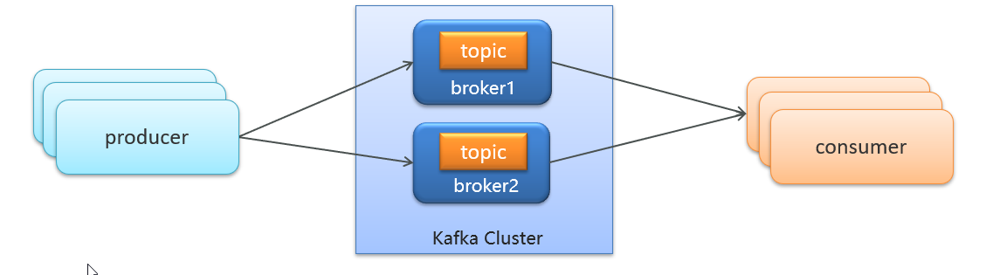
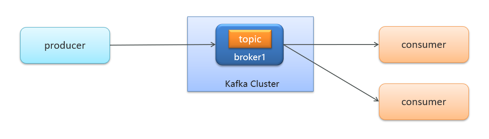
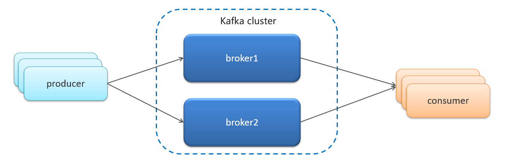
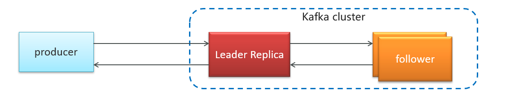
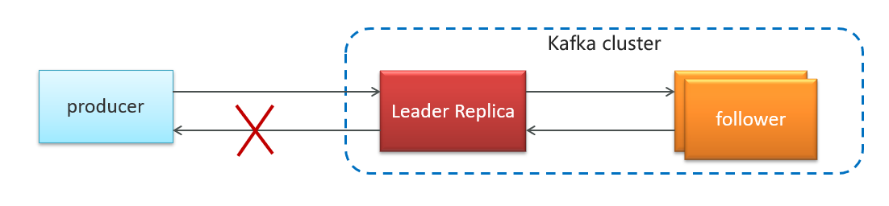
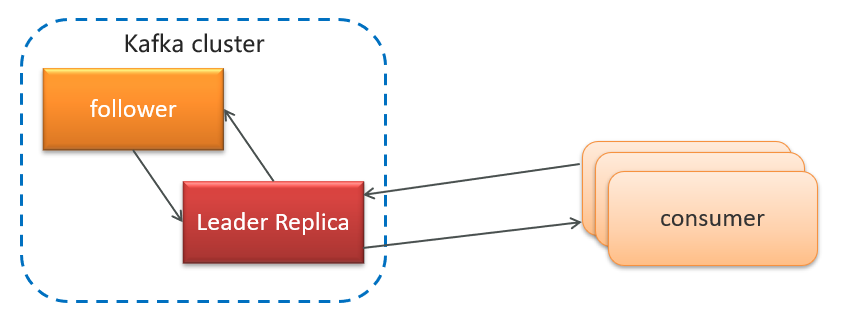
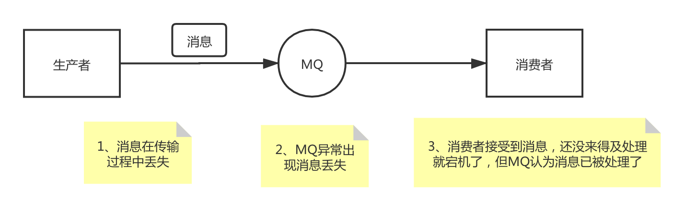

# MQ

## 同步与异步

我们之前学习的Feign调用就属于同步方式，虽然调用可以实时得到结果，但存在下面的问题：


总结：

同步调用的优点：

- 时效性较强，可以立即得到结果

同步调用的问题：

- 耦合度高
- 性能和吞吐能力下降
- 有额外的资源消耗
- 有级联失败问题

异步好处：

- 吞吐量提升：无需等待订阅者处理完成，响应更快速

- 故障隔离：服务没有直接调用，不存在级联失败问题
- 调用间没有阻塞，不会造成无效的资源占用
- 耦合度极低，每个服务都可以灵活插拔，可替换
- 流量削峰：不管发布事件的流量波动多大，都由Broker接收，订阅者可以按照自己的速度去处理事件

异步缺点：

- 架构复杂了，业务没有明显的流程线，不好管理
- 需要依赖于Broker的可靠、安全、性能

## MQ对比                         

| 特性       | ActiveMQ                               | RabbitMQ                   | RocketMQ                 | Kafka                                    |
| ---------- | -------------------------------------- | -------------------------- | ------------------------ | ---------------------------------------- |
| 开发语言   | java                                   | erlang                     | java                     | scala                                    |
| 单机吞吐量 | 万级                                   | 万级                       | 10万级                   | 100万级                                  |
| 时效性     | ms                                     | us                         | ms                       | ms级以内                                 |
| 可用性     | 高（主从）                             | 高（主从）                 | 非常高（分布式）         | 非常高（分布式）                         |
| 功能特性   | 成熟的产品、较全的文档、各种协议支持好 | 并发能力强、性能好、延迟低 | MQ功能比较完善，扩展性佳 | 只支持主要的MQ功能，主要应用于大数据领域 |

| **消息中间件** | **建议**                                                     |
| -------------- | ------------------------------------------------------------ |
| Kafka          | 追求高吞吐量，适合产生大量数据的互联网服务的数据收集业务     |
| RocketMQ       | 可靠性要求很高的金融互联网领域,稳定性高，经历了多次阿里双11考验 |
| RabbitMQ       | 性能较好，社区活跃度高，数据量没有那么大，优先选择功能比较完备的RabbitMQ |

# ==RabbitMQ==

## RabbitMQ 特点

RabbitMQ是实现了**高级消息队列协议（AMQP）**的开源消息代理软件（亦称面向消息的中间件）。RabbitMQ服务器是用Erlang语言编写的，而群集和故障转移是构建在开放电信平台框架上的。所有主要的编程语言均有与代理接口通讯的客户端库。

具体特点可以概括为以下几点：

- **可靠性：** RabbitMQ 使用一些机制来保证消息的可靠性，如持久化、传输确认及发布确认等。
- **灵活的路由：** 在消息进入队列之前，通过交换器来路由消息。对于典型的路由功能，RabbitMQ 己经提供了一些内置的交换器来实现。针对更复杂的路由功能，可以将多个交换器绑定在一起，也可以通过插件机制来实现自己的交换器。这个后面会在我们讲 RabbitMQ 核心概念的时候详细介绍到。
- **扩展性：** 多个 RabbitMQ 节点可以组成一个集群，也可以根据实际业务情况动态地扩展集群中节点。
- **高可用性：** 队列可以在集群中的机器上设置镜像，使得在部分节点出现问题的情况下队列仍然可用。
- **支持多种协议：** RabbitMQ 除了原生支持 AMQP 协议，还支持 STOMP、MQTT 等多种消息中间件协议。
- **多语言客户端：** RabbitMQ 几乎支持所有常用语言，比如 Java、Python、Ruby、PHP、C#、JavaScript 等。
- **易用的管理界面：** RabbitMQ 提供了一个易用的用户界面，使得用户可以监控和管理消息、集群中的节点等。浏览器访问：http://你的ip地址:15672/    默认用户名和密码：guest/guest
- **插件机制：** RabbitMQ 提供了许多插件，以实现从多方面进行扩展，也可以编写自己的插件。

## AMQP 是什么?

RabbitMQ 就是 AMQP 协议的 `Erlang` 的实现(当然 RabbitMQ 还支持 `STOMP2`、 `MQTT3` 等协议 ) AMQP 的模型架构 和 RabbitMQ 的模型架构是一样的，生产者将消息发送给交换器，交换器和队列绑定 。

**RabbitMQ 中的交换器、交换器类型、队列、绑定、路由键等都是遵循的 AMQP 协议中相 应的概念**。目前 RabbitMQ 最新版本默认支持的是 AMQP 0-9-1。

**AMQP 协议的三层** ：

- **Module Layer**:协议最高层，主要定义了一些客户端调用的命令，客户端可以用这些命令实现自己的业务逻辑。
- **Session Layer**:中间层，主要负责客户端命令发送给服务器，再将服务端应答返回客户端，提供可靠性同步机制和错误处理。
- **TransportLayer**:最底层，主要传输二进制数据流，提供帧的处理、信道服用、错误检测和数据表示等。

**AMQP 模型的三大组件** ：

- **交换器 (Exchange)** ：消息代理服务器中用于把消息路由到队列的组件。
- **队列 (Queue)** ：用来存储消息的数据结构，位于硬盘或内存中。
- **绑定 (Binding)** ：一套规则，告知交换器消息应该将消息投递给哪个队列。

## SpringAMQP三个功能

- 自动声明队列、交换机及其绑定关系
- 基于注解的监听器模式，异步接收消息
- 封装了RabbitTemplate工具，用于发送消息 


## RabbitMQ消息模型

RabbitMQ官方提供了5个不同的Demo示例，对应了不同的消息模型：


**BasicQueue 简单队列**

首先配置MQ地址，在publisher服务的application.yml中添加配置：

```yaml
spring:
  rabbitmq:
    host: 192.168.150.101 # 主机名
    port: 5672 # 端口
    virtual-host: / # 虚拟主机
    username: itcast # 用户名
    password: 123321 # 密码
```

**WorkQueue 工作队列**


- 就是**让多个消费者绑定到一个队列，共同消费队列中的消息**。**同一条消息只会被一个消费者处理**

- 通过设置**prefetch**来控制消费者**预取的消息数量**：

```yaml
spring:
  rabbitmq:
    listener:
      simple:
        prefetch: 1 #每次只能获取一条消息，处理完成才能获取下一个消息
```

当消息处理比较耗时的时候，可能生产消息的速度会远远大于消息的消费速度。长此以往，消息就会堆积越来越多，无法及时处理。

此时就可以使用work 模型，多个消费者共同处理消息处理，速度就能大大提高了。

**发布/订阅**


Exchange：交换机，一方面，接收生产者发送的消息。另一方面，知道如何处理消息，例如递交给某个特别队列、递交给所有队列、或是将消息丢弃。到底如何操作，取决于Exchange的类型。Exchange有以下3种类型：
- **Fanout**：**广播**，将消息交给**所有**绑定到交换机的队列
- **Direct**：**定向路由**，把消息交给符合**指定routing key** 的队列
- **Topic**：**主题通配符**，把消息交给**符合routing pattern**（路由模式） 的队列

**Exchange（交换机）只负责转发消息，不具备存储消息的能力**，因此如果**没有任何队列与Exchange绑定**，或者**没有符合路由规则的队列**，那么消息会**丢失**！

**Fanout 广播**


在广播模式下，消息发送流程是这样的：

- 1）  可以有多个队列
- 2）  每个队列都要绑定到Exchange（交换机）
- 3）  生产者发送的消息，只能发送到交换机，交换机来决定要发给哪个队列，生产者无法决定
- 4）  交换机把消息发送给绑定过的所有队列
- 5）  订阅队列的消费者都能拿到消息

交换机的作用是什么？

- 接收publisher发送的消息
- 将消息按照规则路由到与之绑定的队列
- 不能缓存消息，路由失败，消息丢失
- FanoutExchange的会将消息路由到每个绑定的队列

声明队列、交换机、绑定关系的Bean是什么？

- Queue
- FanoutExchange
- Binding

**Direct 路由**

在Fanout模式中，一条消息，会被所有订阅的队列都消费。但是，在某些场景下，我们希望不同的消息被不同的队列消费。这时就要用到Direct类型的Exchange。


 在Direct模型下：

- 队列与交换机的绑定要指定一个`RoutingKey`（路由key）
- 消息的发送方在 向 Exchange发送消息时，也必须指定消息的 `RoutingKey`。
- Exchange根据消息的`Routing Key`发送消息到指定`RoutingKey`（路由key）的队列

Direct交换机与Fanout交换机的差异？

- Fanout交换机将消息路由给每一个与之绑定的队列
- Direct交换机根据RoutingKey判断路由给哪个队列
- 如果多个队列具有相同的RoutingKey，则与Fanout功能类似

基于@RabbitListener注解声明队列和交换机有哪些常见注解？

- @Queue
- @Exchange

**Topic 主题**

`Topic`类型`Exchange`可以让队列在绑定`Routing key` 的时候使用**通配符**！

`Routingkey` 一般都是有一个或多个单词组成，多个单词之间以”.”分割，例如： `item.insert`

 通配符规则：

`#`：匹配一个或多个词   `item.#`：能够匹配`item.spu.insert` 或者 `item.spu`

`*`：匹配不多不少恰好1个词   `item.*`：只能匹配`item.spu`


Direct交换机与Topic交换机的差异？

- Topic交换机接收的消息RoutingKey必须是多个单词，以 `**.**` 分割
- Topic交换机与队列绑定时的bindingKey可以指定通配符
- `#`：代表0个或多个词
- `*`：代表1个词

## 配置JSON转换器

**默认情况下Spring**采用的序列化方式是**JDK序列化**。众所周知，JDK序列化存在下列问题：

- **数据体积过大**
- **有安全漏洞**
- **可读性差**

发送消息后**默认转换器**查看控制台：


希望消息体的**体积更小**、**可读性更高**，因此可以使用**JSON方式**来做**序列化和反序列化**。

在publisher和consumer两个服务中都引入依赖：

```xml
<dependency>
    <groupId>com.fasterxml.jackson.dataformat</groupId>
    <artifactId>jackson-dataformat-xml</artifactId>
    <version>2.9.10</version>
</dependency>
```

配置消息转换器。

在启动类中添加一个Bean即可：

```java
@Bean
public MessageConverter jsonMessageConverter(){
    return new Jackson2JsonMessageConverter();
}
```

## 消息可靠性

常见的丢失原因包括：

- **发送时丢失**：
  - 生产者发送的消息未送达exchange
  - 消息到达exchange后未到达queue
- **MQ宕机**，queue将消息丢失
- consumer接收到消息后**未消费就宕机**或**消费失败**；

针对这些问题，RabbitMQ分别给出了解决方案：

- 开启**生产者确认机制**，确保生产者的消息能到达队列
- 开启**mq持久化**功能，，**集群的主从备份**功能，确保消息未消费前在队列中不会丢失
- 开启**消费者确认机制为auto**，由spring确认消息处理成功后完成ack
- 开启**消费者失败重试机制**，并设置MessageRecoverer，多次重试失败后将消息**投递到异常交换机/死信队列**，交由**人工处理**

## 生产者消息确认

这种机制必须给每个消息指定一个**唯一ID(UUID)**，封装到**CorrelationData**中：

```java
// 消息ID，需要封装到CorrelationData中
CorrelationData correlationData = new CorrelationData(UUID.randomUUID().toString());
// 发送消息
rabbitTemplate.convertAndSend("ttl.direct", "ttl", message, correlationData);
```
消息发送到MQ以后，会返回一个结果给发送者，表示消息是否处理成功。

返回结果有两种方式：

- publisher-confirm，发送者确认
  - 消息成功投递到交换机，返回ack
  - 消息未投递到交换机，返回nack
- publisher-return，发送者回执
  - 消息投递到交换机了，但是没有路由到队列。返回ACK，及路由失败原因。


注意：


### 修改配置

首先，修改publisher服务中的application.yml文件，添加下面的内容：

```yaml
spring:
  rabbitmq:
    publisher-confirm-type: correlated
    publisher-returns: true
    template:
      mandatory: true
```

说明：

- `publish-confirm-type`：开启publisher-confirm，这里支持两种类型：
  - `simple`：同步等待confirm结果，直到超时
  - `correlated`：异步回调，定义ConfirmCallback，MQ返回结果时会回调这个ConfirmCallback
- `publish-returns`：开启publish-return功能，同样是基于callback机制，不过是定义ReturnCallback
- `template.mandatory`：定义消息路由失败时的策略。true，则调用ReturnCallback；false：则直接丢弃消息

### 定义Return回调

每个RabbitTemplate只能配置一个ReturnCallback，因此需要在项目加载时配置：

修改publisher服务，添加一个：

```java
package cn.itcast.mq.config;

import lombok.extern.slf4j.Slf4j;
import org.springframework.amqp.rabbit.core.RabbitTemplate;
import org.springframework.beans.BeansException;
import org.springframework.context.ApplicationContext;
import org.springframework.context.ApplicationContextAware;
import org.springframework.context.annotation.Configuration;

@Slf4j
@Configuration
public class CommonConfig implements ApplicationContextAware {
    @Override
    public void setApplicationContext(ApplicationContext applicationContext) throws BeansException {
        // 获取RabbitTemplate
        RabbitTemplate rabbitTemplate = applicationContext.getBean(RabbitTemplate.class);
        // 设置ReturnCallback
        rabbitTemplate.setReturnCallback((message, replyCode, replyText, exchange, routingKey) -> {
            // 投递失败，记录日志
            log.info("消息发送失败，应答码{}，原因{}，交换机{}，路由键{},消息{}",
                     replyCode, replyText, exchange, routingKey, message.toString());
            // 如果有业务需要，可以重发消息
        });
    }
}
```

### 定义ConfirmCallback

ConfirmCallback可以在发送消息时指定，因为每个业务处理confirm成功或失败的逻辑不一定相同。

在publisher服务的cn.itcast.mq.spring.SpringAmqpTest类中，定义一个单元测试方法：

```java
public void testSendMessage2SimpleQueue() throws InterruptedException {
    // 1.消息体
    String message = "hello, spring amqp!";
    // 2.全局唯一的消息ID，需要封装到CorrelationData中
    CorrelationData correlationData = new CorrelationData(UUID.randomUUID().toString());
    // 3.添加callback
    correlationData.getFuture().addCallback(
        result -> {
            if(result.isAck()){
                // 3.1.ack，消息成功
                log.debug("消息发送成功, ID:{}", correlationData.getId());
            }else{
                // 3.2.nack，消息失败
                log.error("消息发送失败, ID:{}, 原因{}",correlationData.getId(), result.getReason());
            }
        },
        ex -> log.error("消息发送异常, ID:{}, 原因{}",correlationData.getId(),ex.getMessage())
    );
    // 4.发送消息
    rabbitTemplate.convertAndSend("task.direct", "task", message, correlationData);
    // 休眠一会儿，等待ack回执
    Thread.sleep(2000);
}
```

## 持久化

- 交换机持久化
- 队列持久化
- 消息持久化

### 交换机持久化

RabbitMQ中交换机默认是非持久化的，mq重启后就丢失。

SpringAMQP中可以通过代码new DirectExchange("simple.direct", **true**, false)指定交换机持久化：

```java
@Bean
public DirectExchange simpleExchange(){
    // 三个参数：交换机名称、是否持久化、当没有queue与其绑定时是否自动删除
    return new DirectExchange("simple.direct", true, false);
}
```

事实上，默认情况下，由SpringAMQP声明的交换机都是持久化的。

### 队列持久化

RabbitMQ中队列默认是非持久化的，mq重启后就丢失。

SpringAMQP中可以通过代码**.durable()**指定交队列持久化：

```java
@Bean
public Queue simpleQueue(){
    // 使用QueueBuilder构建队列，durable就是持久化的
    return QueueBuilder.durable("simple.queue").build();
}
```

事实上，默认情况下，由SpringAMQP声明的队列都是持久化的。

### 消息持久化

利用SpringAMQP发送消息时，可以设置消息的属性（MessageProperties），指定**delivery-mode**：

- 1：非持久化
- 2：持久化


默认情况下，SpringAMQP发出的任何消息都是持久化的，不用特意指定。

## 消费者消息确认

RabbitMQ是**阅后即焚**机制，RabbitMQ确认消息被消费者消费后会立刻删除。

而RabbitMQ是通过消费者回执来确认消费者是否成功处理消息的：消费者获取消息后，应该向RabbitMQ发送ACK回执，表明自己已经处理消息。

设想这样的场景：

- 1）消费者获取消息后，返回ACK给RabbitMQ
- 2）RabbitMQ删除消息
- 3）**消费者宕机**或者**处理过程中有异常**导致**消息处理失败**

这样，消息就丢失了。因此消费者返回ACK的时机非常重要。

而SpringAMQP则允许配置三种确认模式：

- **manual**：**手动ack**，需要在**业务代码结束**后，**调用api发送ack**。
- **auto**：**自动ack**，由spring监测listener代码是否出现异常，**没有异常则返回ack，消息正常删除**；**抛出异常则返回nack，消息重新进队列**
- **none**：**关闭ack**，MQ假定消费者获取消息后会成功处理，因此消息投递后立即被删除

演示none模式：修改consumer服务的application.yml文件：

```yaml
spring:
  rabbitmq:
    listener:
      simple:
        acknowledge-mode: none # 关闭ack
```

## 消费失败重试机制

**针对的场景**是：当消费者出现异常后，消息会不断requeue（重入队）到队列，再重新发送给消费者，然后再次异常，再次requeue，**无限循**环，导致mq的**消息处理飙升**，**带来不必要的压力**：


### 本地重试

我们可以**利用Spring的retry机制**，在消费者出现异常时进行**本地重试**，而不是无限制的requeue到mq队列。

修改consumer服务的application.yml文件，添加内容：

```yaml
spring:
  rabbitmq:
    listener:
      simple:
        retry:   # 失败重试等待 1s 3s 9s 27s
          enabled: true # 开启消费者失败重试
          initial-interval: 1000 # 初次失败等待时长为1秒
          multiplier: 3 # 失败的等待时长倍数，下次等待时长 = multiplier * last-interval
          max-attempts: 4 # 最大重试次数    失败重试 1s 3s 9s 27s
          stateless: true # true无状态；false有状态。如果业务中包含事务，这里改为false
```

**重试达到最大次数后，Spring默认会返回ack，消息会被丢弃**

### 失败策略

在之前的测试中，达到最大重试次数后，消息会被丢弃，这是由Spring内部机制决定的。

在开启重试模式后，重试次数耗尽，如果消息依然失败，则需要有MessageRecovery接口来处理，它包含三种不同的实现：

- RejectAndDontRequeueRecoverer：重试耗尽后，**默认直接丢弃**消息。

- ImmediateRequeueMessageRecoverer：重试耗尽后，返回**nack**，**消息重新入队**

- RepublishMessageRecoverer：重试耗尽后，将失败消息**投递到指定的交换机**

比较优雅的一种处理方案是RepublishMessageRecoverer，失败后将消息投递到一个指定的，专门存放异常消息的队列，后续由人工集中处理。

## 死信交换机

可以利用死信交换机收集所有消费者处理失败的消息（死信），**交由人工处理**，进一步**提高消息队列的可靠性**。

当一个队列中的消息满足下列情况之一时，可以成为死信（dead letter）：

- 消费者使用basic.**reject**或 basic.**nack**声明**消费失败**，并且消息的**requeue**参数设置为**false**
- **消息超时**过期未消费：**MessageBuilder.setExpiration**("5000")
- 消息**所在队列超时**：**QueueBuilder.ttl**(10000) // 设置队列的超时时间，10秒
- 要投递的**队列消息满**了

必须知道两个信息才能确保投递的消息能到达死信交换机，并且正确的路由到死信队列：

- 死信交换机**名称**： **QueueBuilder.deadLetterExchange**("dl.ttl.direct") // 队列绑定指定死信交换机
- 死信交换机与死信队列绑定的**RoutingKey**


**如何实现发送一个消息20秒后消费者才收到消息？**

- 给消息的目标队列指定死信交换机
- 将消费者监听的队列绑定到死信交换机
- 发送消息时给消息设置超时时间为20秒

## 延迟队列

利用**TTL结合死信交换机**，我们实现了消息发出后，消费者延迟收到消息的效果。这种消息模式就称为延迟队列（Delay Queue）模式。

延迟队列的**使用场景**包括：

- **延迟发送短信**
- **超时自动取消订单**
- 预约工作会议，**20分钟后自动通知所有参会人员**

因为延迟队列的需求非常多，所以RabbitMQ的官方也推出了一个插件，原生支持延迟队列效果。

### DelayExchange原理

DelayExchange需要将一个交换机声明为**delayed**类型。当我们发送消息到delayExchange时，流程如下：

- 接收消息，**判断消息是否具备x-delay属性**
- 如果**有x-delay属性**，说明是**延迟消息**，**持久化到硬盘**，读取x-delay值，作为延迟时间
- **返回routing not found**结果给消息发送者
- **x-delay时间到期后，重新投递消息到指定队列**

**声明一个交换机，添加delayed属性为true**，2种方式：

**基于注解方式**（推荐）：


**基于@Bean**的方式：


**发送延迟消息**：发送消息时，一定要携带**x-delay**属性，指定延迟的时间：


## 惰性队列

RabbitMQ3.6.0版本开始，就增加了**Lazy Queues**，惰性队列的特征如下：

- 接收到消息后**直接存入磁盘**而非内存
- 消费者**要消费消息时才会从磁盘中读取并加载到内存**
- 支持**数百万条**的**消息存储**

优点：

- 基于**磁盘存储**，**消息上限高**
- 没有间歇性的**page-out**，**性能比较稳定**

缺点：

- 基于磁盘存储，**消息时效性**会降低
- **性能受限于磁盘的IO**

**基于@Bean声明**


**基于@RabbitListener声明**


## 集群分类

RabbitMQ的是基于Erlang语言编写，而Erlang又是一个面向并发的语言，天然支持集群模式。RabbitMQ的集群有两种模式：

**普通集群**：是一种**分布式集群**，将**队列分散到集群的各个节点**，从而提高整个集群的**并发能力**。

- 会在集群的**各个节点间共享部分数据**，包括：**交换机、队列元信息**。**不包含队列中的消息**。
- 当访问集群某节点时，如**果队列不在该节点，会从数据所在节点传递到当前节点并返回**
- 队列所在**节点宕机**，队列中的**消息就会丢失**

**镜像集群**：是一种**主从集群**，普通集群的基础上，**添加了主从备份功能**，提高集群的数据**可用性**。

- **交换机、队列、队列中的消息**会在各个mq的镜像节点之间**同步备份**。
- 创建队列的节点被称为该队列的**主节点，**备份到的其它节点叫做该队列的**镜像**节点。
- 一个队列的主节点可能是另一个队列的镜像节点
- **所有操作都是主节点完成**，然后**同步给镜像节点**
- **主宕机**后，**镜像节点会替代成新的主节点**


**仲裁队列**：**镜像集群主从同步并不是强一致的**，某些情况下**可能有数据丢失**的风险。因此在RabbitMQ的3.8版本以后，推出了新的功能：**仲裁队列**来**代替镜像集群**，底层采用**Raft协议**确保主从的**数据一致性**。

```java
@Bean
public Queue quorumQueue() {
    return QueueBuilder
        .durable("quorum.queue") // 持久化
        .quorum() // 仲裁队列
        .build();
}
```


## MQ有什么作用

- **异步处理提高系统性能（减少响应所需时间）**：将用户的请求数据存储到消息队列之后就立即返回结果，缩短主流程的响应时间，提升用户体验。随后，系统再对消息进行消费。

- **解耦合**：将几个**业务关联的微服务调用**修改为基于MQ的异步通知，可以**解除微服务之间的业务耦合**。提高系统灵活性，扩展性。同时还**提高了业务性能**。
- **流量削峰**：将突发的业务请求放入MQ中，作为缓冲区。后端的业务根据自己的处理能力从MQ中获取消息，逐个处理任务。流量曲线变的平滑很多
- **延迟队列**：基于RabbitMQ的**死信队列**或者**DelayExchange**插件，可以实现消息发送后，延迟接收的效果。

## MQ会带来哪些问题

- **系统可用性降低：** 系统可用性在某种程度上降低，**需要考虑消息丢失**或者说 **MQ 挂掉**等等的情况！
- **系统复杂性提高：** 加入 MQ 之后，你需要保证消息**没有被重复消费**、**处理消息丢失**的情况、**保证消息传递的顺序性**等等问题！
- **一致性问题：** 我上面讲了消息队列可以实现异步，消息队列带来的异步确实可以提高系统响应速度。但是，**万一消息的真正消费者并没有正确消费消息，就会导致数据不一致的情况**!

## MQ区别


| 特性                     | ActiveMQ                              | RabbitMQ                                           |                           RocketMQ                           |                            Kafka                             |
| ------------------------ | ------------------------------------- | -------------------------------------------------- | :----------------------------------------------------------: | :----------------------------------------------------------: |
| 开发语言                 | java                                  | erlang                                             |                             java                             |                            scala                             |
| 单机吞吐量               | 万级，比 RocketMQ、Kafka 低一个数量级 | 同 ActiveMQ                                        |                     10 万级，支撑高吞吐                      | 10 万级，高吞吐，一般配合大数据类的系统来进行实时数据计算、日志采集等场景 |
| topic 数量对吞吐量的影响 |                                       |                                                    | topic 可以达到几百/几千的级别，吞吐量会有较小幅度的下降，这是 RocketMQ 的一大优势，在同等机器下，可以支撑大量的 topic | topic 从几十到几百个时候，吞吐量会大幅度下降，在同等机器下，Kafka 尽量保证 topic 数量不要过多，如果要支撑大规模的 topic，需要增加更多的机器资源 |
| 时效性                   | ms 级                                 | 微秒级，这是 RabbitMQ 的一大特点，延迟最低         |                            ms 级                             |                       延迟在 ms 级以内                       |
| 可用性                   | 高，基于主从架构实现高可用            | 同 ActiveMQ                                        |                      非常高，分布式架构                      | 非常高，分布式，一个数据多个副本，少数机器宕机，不会丢失数据，不会导致不可用 |
| 消息可靠性               | 有较低的概率丢失数据                  | 基本不丢                                           |              经过参数优化配置，可以做到 0 丢失               |                         同 RocketMQ                          |
| 功能支持                 | MQ 领域的功能极其完备                 | 基于 erlang 开发，并发能力很强，性能极好，延时很低 |           MQ 功能较为完善，还是分布式的，扩展性好            | 功能较为简单，主要支持简单的 MQ 功能，在大数据领域的实时计算以及日志采集被大规模使用 |
| 社区活跃度               | 低                                    | 很高                                               |                             一般                             |                             很高                             |

kafka是以**吞吐量高**而闻名，不过其数**据稳定性一般**，而且**无法保证消息有序性**。我们公司的日志收集也有使用，业务模块中则使用的RabbitMQ。

阿里巴巴的**RocketMQ基于Kafka的原理**，弥补了Kafka的缺点，继承了其高吞吐的优势，其客户端目前以Java为主。但是我们担心阿里巴巴开源产品的稳定性，所以就没有使用。

RabbitMQ基于面向并发的语言Erlang开发，吞吐量不如Kafka，但是对我们公司来讲**够用**了。而且**消息可靠性较好**，并且**消息延迟极低**，**集群搭建比较方便**。**支持多种协议**，并且有各种语言的客户端，比较灵活。**Spring对RabbitMQ的支持**也比较好，使用起来比较**方便**，比较符合我们公司的需求。

综合考虑我们公司的**并发需求**以及**稳定性需求**，我们选择了RabbitMQ。

## RabbitMQ如何确保不丢失

RabbitMQ针对消息传递过程中可能发生问题的各个地方，给出了针对性的解决方案：

- 生产者发送消息时可能因为**网络问题导致消息没有到达交换机**：
  - RabbitMQ提供了**publisher confirm**机制
    - 生产者发送消息后，可以编写**ConfirmCallback**函数
    - 消息**成功到达交换机**后，RabbitMQ会调用ConfirmCallback通知消息的发送者，返回**ACK**
    - 消息如果**未到达交换机**，RabbitMQ也会调用ConfirmCallback通知消息的发送者，返回**NACK**
    - 消息**超时未发送成功也会抛出异常**
- 消息到达交换机后，如果**未能到达队列**，也会导致消息丢失：
  - RabbitMQ提供了**publisher return**机制
    - 生产者可以定义**ReturnCallback**函数
    - 消息到达交换机，未到达队列，RabbitMQ会调用ReturnCallback通知发送者，告知失败原因
- 消息**到达队列后MQ宕机**也可能导致丢失消息：
  - RabbitMQ提供了**持久化**功能，**集群的主从备份**功能
    - 消息持久化，RabbitMQ会将交换机、队列、消息持久化到磁盘，宕机重启可以恢复消息
    - 镜像集群，仲裁队列，都可以提供主从备份功能，主节点宕机，从节点会自动切换为主，数据依然在
- 消息投递给消费者后，如果**消费者处理不当**，也可能导致消息丢失
  - **SpringAMQP**基于RabbitMQ提供了**消费者确认机制**、**消费者重试机制**，**消费者失败处理**策略：
    - 消费者的**确认机制**：**auto模式**
      - 消费者处理消息成功，未出现异常时，Spring返回**ACK**给RabbitMQ，消息才被移除
      - 消费者处理消息失败，抛出异常，宕机，Spring返回**NACK**或者不返回结果，消息不会被移除
    - 消费者**重试机制**：
      - **默认**情况下，消费者处理失败时，消息会再次**回到MQ队列**，然后投递给其它消费者。Spring提供的**消费者重试机制**，则是在处理失败后**不返回NACK**，而是直接在**消费者本地重试**。多次重试都失败后，则按照消费者失败处理策略来处理消息。**避免了消息频繁入队带来的额外压力**。
    - 消费者**失败策略**：
      - 当消费者多次本地重试失败时，消息**默认会丢弃**。
      - Spring提供了**Republish**策略，在多次重试都失败，耗尽重试次数后，将消息重新**投递给指定的异常交换机**，并且会**携带上异常栈信息，帮助定位问题。**


## RabbitMQ避免消息堆积

消息堆积问题产生的原因往往是因为**消息发送速度超过了消费者消息处理速度**。因此解决方案无外乎以下三点：

- **提高消费者处理速度**
- **增加更多消费者**
- **增加队列消息存储上限**

1）**提高消费者处理速度**

消费者处理速度是由业务代码决定的，所以我们能做的事情包括：

- 尽可能优化业务代码，提高业务性能
- 接收到消息后，**开启线程池，并发处理多个消息**

优点：成本低，改改代码即可

缺点：开启线程池会带来额外的性能开销，**对于高频、低时延的任务不合适**。推荐任务执行**周期较长**的业务。

2）**增加更多消费者**

用**workqueue**队列，**一个队列绑定多个消费者，共同争抢任务**，能者多劳，通过设置**prefetch**来控制消费者**预取的消息数量**。

优点：能用**钱**解决的问题都不是问题。实现**简单粗暴**

缺点：问题是没有钱。**成本太高**

3）**增加队列消息存储上限**

在RabbitMQ的1.8版本后，加入了新的队列模式：**Lazy Queue**

这种队列不会将消息保存在内存中，而是在收到消息后**直接写入磁盘**中，**理论上没有存储上限**。

优点：磁盘存储**更安全**；存储**无上限**；避免内存存储带来的Page Out问题，**性能更稳定**；

缺点：磁盘存储**受到IO性能的限制**，消息**时效性**不如内存模式，但**影响不大**。

## RabbitMQ保证消息有序性

其实RabbitMQ是**队列存储**，天然具备**先进先出**的特点，只要消息的发送是有序的，那么理论上接收也是有序的。不过当一个队列绑定了多个消费者时，可能出现**消息轮询投递给消费者**的情况，而消费者的处理顺序就无法保证了。

因此，要保证消息的有序性，需要做的下面几点：

- 保证消息**发送的有序性**
- 保证**一组有序的消息**都发送到**同一个队列**
- 保证**一个队列只包含一个消费者**

## 重复消费/幂等性

消息重复消费的原因多种多样，不可避免。所以只能从**消费者端入手**，只要能**保证消息处理的幂等性**就可以确保消息不被重复消费。

而**幂等性的保证**又有很多方案：

- 给每一条消息都添加一个**唯一id**，在本地记录消息表及消息状态，处理消息时基于数据库表的id唯一性做判断
- 同样是**记录消息表**，**利用消息状态字段实现基于乐观锁的判断，保证幂等**
- **基于业务本身的幂等性**。比如根据id的删除、查询业务天生幂等；新增、修改等业务可以考虑基于数据库id唯一性、或者乐观锁机制确保幂等。本质与消息表方案类似。

## RabbitMQ高可用

要实现RabbitMQ的高可用无外乎下面两点：

- 做好**交换机、队列、消息**的**持久化**
- 搭建RabbitMQ的**镜像集群**，做好**主从备份**。当然也可以使用**仲裁队列代替镜像集群**。

## RabbtiMQ消息怎么传输？

由于 TCP 链接的创建和销毁开销较大，且并发数受系统资源限制，会造成性能瓶颈，所以 RabbitMQ 使用**信道**的方式来传输数据。信道（Channel）是生产者、消费者与 RabbitMQ 通信的渠道，**信道是建立在 TCP 链接上的虚拟链接，且每条 TCP 链接上的信道数量没有限制。**就是说 RabbitMQ 在**一条 TCP 链接上建立成百上千个信道**来达到多个线程处理，这个 TCP 被多个线程共享，每个信道在 RabbitMQ 都有唯一的 ID，保证了信道私有性，每个信道对应一个线程使用。

## 如何解决消息队列的延时以及过期失效问题？

RabbtiMQ 是可以设置过期时间的，也就是 TTL。如果消息在 queue 中积压超过一定的时间就会被 RabbitMQ 给清理掉，这个数据就没了。那这就是第二个坑了。这就不是说数据会大量积压在 mq 里，而是大量的数据会直接搞丢。我们可以采取一个方案，就是批量重导，这个我们之前线上也有类似的场景干过。就是大量积压的时候，我们当时就直接丢弃数据了，然后等过了高峰期以后，比如大家一起喝咖啡**熬夜到晚上 12 点以后，用户都睡觉了。这个时候我们就开始写程序，将丢失的那批数据，写个临时程序，一点一点的查出来，然后重新灌入 mq 里面去，把白天丢的数据给他补回来。**也只能是这样了。假设 1 万个订单积压在 mq 里面，没有处理，其中 1000 个订单都丢了，你只能手动写程序把那 1000 个订单给查出来，手动发到 mq 里去再补一次。


# ==kafka==



- **producer**：发布消息的对象称之为主题生产者（Kafka topic producer）

- **topic**：Kafka将消息分门别类，每一类的消息称之为一个主题（Topic）

- **consumer**：订阅消息并处理发布的消息的对象称之为主题消费者（consumers）

- **broker**：已发布的消息保存在一组服务器中，称之为Kafka集群。集群中的每一个服务器都是一个代理（Broker）。 消费者可以订阅一个或多个主题（topic），并从Broker拉数据，从而消费这些已发布的消息。

Kafka**对于zookeeper是强依赖**，**保存kafka相关的节点数据**，所以安装Kafka之前必须先安装zookeeper



- 生产者发送消息，**订阅该topic的不同组都可以接收到消息**
- 生产者发送消息，**同组的**多个消费者**只能有一个消费者**接收到消息

## kafka高可用

### 集群



- Kafka 的服务器端由被称为 Broker 的服务进程构成，即一个 Kafka 集群由多个 Broker 组成

- 这样如果集群中某一台机器宕机，其他机器上的 Broker 也依然能够对外提供服务。这其实就是 Kafka 提供高可用的手段之一

### 备份机制Replication


Kafka 定义了两类副本：

- **领导者副本**（Leader Replica）

- **追随者副本**（Follower Replica）AR=ISR+OSR。

**备份同步方式**


**ISR（in-sync replica）需要同步复制保存的follower**

如果**leader失效**后，需要选出新的leader，选举的原则如下：

**选举时优先从ISR中选定**，因为这个列表中follower的数据是与leader同步的；如果ISR列表中的follower都不行了，就只能从其他follower中选取

**极端情况，就是所有副本都失效了**，这时有两种方案：

**1.数据一致性方案**：等待**ISR**中的一个活过来，选为Leader，**数据可靠，但活过来的时间不确定**

**2.可用性方案**：选择**第一个活过来**的Replication，不一定是ISR中的，选为leader，**以最快速度恢复可用性，但数据不一定完整**

## kafka生产者

### 同/异步发送

- **同步发送**

  使用**send()方法**发送，它会**返回一个Future对象**，**调用get()方法**进行等待，就可以知道消息是否发送成功

```java
//同步消息发送
RecordMetadata recordMetadata = producer.send(kvProducerRecord).get();
System.out.println(recordMetadata.offset());
```

- **异步发送**

  **调用send()方法，并指定一个回调函数**，服务器在返回响应时调用函数

```java
//异步消息发送
producer.send(kvProducerRecord, new Callback() {
    @Override
    public void onCompletion(RecordMetadata recordMetadata, Exception e) {
        if(e != null){
            System.out.println("记录异常信息到日志表中");
        }
        System.out.println(recordMetadata.offset());
    }
});
```

### ack确认机制



| **确认机制** | **说明**                                                     |
| :----------: | :----------------------------------------------------------- |
|    acks=0    | 生产者在成功写入消息之前不会等待任何来自服务器的响应,消息有丢失的风险，但是速度最快 |
|  acks=1默认  | 只要集群首领节点收到消息，生产者就会收到一个来自服务器的成功响应 |
| acks=all/-1  | 只有当所有参与赋值的节点全部收到消息时，生产者才会收到一个来自服务器的成功响应 |

```java
//ack配置  消息确认机制
prop.put(ProducerConfig.ACKS_CONFIG,"all");
```

### retries重试



生产者从服务器收到的错误有可能是临时性错误，在这种情况下，**retries参数的值决定了生产者可以重发消息的次数，如果达到这个次数，生产者会放弃重试返回错误，默认情况下，生产者会在每次重试之间等待100ms**

```java
//重试次数
prop.put(ProducerConfig.RETRIES_CONFIG,10);
```

### 消息压缩

**默认**情况下， **消息发送时不会被压缩**。

```java
//数据压缩
prop.put(ProducerConfig.COMPRESSION_TYPE_CONFIG,"lz4")
```

| **压缩算法** | **说明**                                                     |
| :----------- | ------------------------------------------------------------ |
| snappy       | 占用**较少的  CPU**，  却能提供较好的性能和相当可观的压缩比， 如果看重性能和网络带宽，建议采用 |
| lz4          | 占用**较少的 CPU**， 压缩和解压缩速度较快，压缩比也很客观    |
| gzip         | 占用**较多的CPU**，但会**提供更高的压缩比**，网络带宽有限，可以使用这种算法 |

**使用压缩可以降低网络传输开销和存储开销，而这往往是向 Kafka 发送消息的瓶颈所在。**

## kafka消费者

### 消费者组



- 消费者组（Consumer Group） ：指的就是由一个或多个消费者组成的群体

- 一个发布在Topic上消息被分发给此消费者组中的一个消费者

  - 所有的消费者**都在一个组中**，那么这就变成了**queue**模型

  - 所有的消费者都在不同的组中，那么就完全变成了**发布-订阅**模型

### 消息有序性

应用场景：

- 即时消息中的单对单聊天和群聊，保证发送方消息发送顺序与接收方的顺序一致

- 充值转账两个渠道在同一个时间进行余额变更，短信通知必须要有顺序


**topic分区中消息只能由消费者组中的唯一一个消费者处理，所以消息肯定是按照先后顺序进行处理的。**但是它也仅仅是保证Topic的一个分区顺序处理，不能保证跨分区的消息先后处理顺序。 **所以，如果你想要顺序的处理Topic的所有消息，那就只提供一个分区。**

### 提交偏移量

kafka不会像其他JMS队列那样需要得到消费者的确认，消费者可以使用kafka来**追踪消息在分区的位置（偏移量）**，**主要用来解决重复消费和消息丢失问题。**

消费者会往一个叫做**_consumer_offset**的特殊主题发送消息，消息里包含了每个分区的偏移量。**如果消费者发生崩溃或有新的消费者加入群组，就会触发再均衡**。


如果消费者2挂掉以后，会发生再均衡，消费者2负责的分区会被其他消费者进行消费

再均衡后不可避免会出现一些问题

问题一：


如果提交偏移量小于客户端处理的最后一个消息的偏移量，那么处于两个偏移量之间的消息就会被重复处理。

问题二：


如果提交的偏移量大于客户端的最后一个消息的偏移量，那么处于两个偏移量之间的消息将会丢失。

如果想要解决这些问题，还要知道目前kafka提交偏移量的方式：

提交偏移量的方式有两种，分别是自动提交偏移量和手动提交

#### 自动提交偏移量

当**enable.auto.commit被设置为true**，提交方式就是让消费者自动提交偏移量，**每隔5秒消费者会自动把从poll()方法接收的最大偏移量提交上去**

#### 手动提交

当**enable.auto.commit被设置为false**可以有以下三种提交方式

- **提交当前偏移量（同步提交）**

- **异步提交**

- **同步和异步组合提交**

**1.提交当前偏移量（同步提交）**

把`enable.auto.commit`设置为false,让应用程序决定何时提交偏移量。**使用commitSync()提交偏移量，commitSync()将会提交poll返回的最新的偏移量，所以在处理完所有记录后要确保调用了commitSync()方法。否则还是会有消息丢失的风险。**

只要没有发生不可恢复的错误，commitSync()方法会一直尝试直至提交成功，如果提交失败也可以记录到错误日志里。

```java
while (true){
    ConsumerRecords<String, String> records = consumer.poll(Duration.ofMillis(1000));
    for (ConsumerRecord<String, String> record : records) {
        System.out.println(record.value());
        System.out.println(record.key());
        try {
            consumer.commitSync();//同步提交当前最新的偏移量
        }catch (CommitFailedException e){
            System.out.println("记录提交失败的异常："+e);
```

**2.异步提交**

**手动提交缺点就是当发起提交调用时应用会阻塞。**当然我们可以减少手动提交的频率，但这个会增加消息重复的概率（和自动提交一样）。另外一个解决办法是，**使用commitAsync方法异步提交**的API

```java
while (true){
    ConsumerRecords<String, String> records = consumer.poll(Duration.ofMillis(1000));
    for (ConsumerRecord<String, String> record : records) {
        System.out.println(record.value());
        System.out.println(record.key());
    }
    consumer.commitAsync(new OffsetCommitCallback() {
        @Override
        public void onComplete(Map<TopicPartition, OffsetAndMetadata> map, Exception e) {
            if(e!=null){
                System.out.println("记录错误的提交偏移量："+ map+",异常信息"+e);
```

**3.同步和异步组合提交**

**异步提交也有个缺点，那就是如果服务器返回提交失败，异步提交不会进行重试。相比较起来，同步提交会进行重试直到成功或者最后抛出异常给应用。异步提交没有实现重试是因为，如果同时存在多个异步提交，进行重试可能会导致位移覆盖，导致消息重复消费。**

**举个例子**，假如我们发起了一个异步提交commitA，此时的提交位移为2000，随后又发起了一个异步提交commitB且位移为3000；commitA提交失败但commitB提交成功，此时commitA进行重试并成功的话，会将实际上将已经提交的位移从3000回滚到2000，**导致消息重复消费**。

```java
try {
    while (true){
        ConsumerRecords<String, String> records = consumer.poll(Duration.ofMillis(1000));
        for (ConsumerRecord<String, String> record : records) {
            System.out.println(record.value());
            System.out.println(record.key());
        }
        consumer.commitAsync();//先异步提交
    }
}catch (Exception e){+
    e.printStackTrace();
    System.out.println("记录错误信息："+e);
}finally {
    try {
        consumer.commitSync();//再同步提交
    }finally {
        consumer.close();
    }
}
```

## Pull 还是 Push

**生产者使用push**模式将消息发布到Broker，**消费者使用pull**模式从Broker订阅消息。

push模式很难适应消费速率不同的消费者，如果push的速度太快，容易造成消费者拒绝服务或网络拥塞；如果push的速度太慢，容易造成消费者性能浪费。但是采用pull的方式也有一个缺点，就是当Broker没有消息时，消费者会陷入不断地轮询中，为了避免这点，kafka有个参数可以让消费者阻塞知道是否有新消息到达。

## 如何保证 消息不丢失

首先需要弄明白消息为什么会丢失，对于一个消息队列，会有 `生产者`、`MQ`、`消费者` 这三个角色，在这三个角色数据处理和传输过程中，都有可能会出现消息丢失。



消息丢失的原因以及解决办法：

### 生产者数据传输 消息丢失

对于生产者数据传输导致的数据丢失主常见情况是生产者发送消息给 `Kafka`，由于网络等原因导致消息丢失，对于这种情况也是通过在 **producer** 端设置 **acks=all/-1** 来处理，这个参数是要求 `leader` 接收到消息后，需要等到所有的 `follower` 都同步到了消息之后，才认为本次写成功了。如果没满足这个条件，生产者会自动不断的重试。

### MQ 消息丢失

`Kafka` 导致的数据丢失一个常见的场景就是 `Kafka` 某个 `broker` 宕机，，而这个节点正好是某个 `partition` 的 `leader` 节点，这时需要重新重新选举该 `partition` 的 `leader`。如果该 `partition` 的 `leader` 在宕机时刚好还有些数据没有同步到 `follower`，此时 `leader` 挂了，在选举某个 `follower` 成 `leader` 之后，就会丢失一部分数据。

对于这个问题，`Kafka` 可以设置如下 4 个参数，来尽量避免消息丢失：

- 给 `topic` 设置 `replication.factor` 参数：这个值必须大于 `1`，要求每个 `partition` 必须有至少 `2` 个副本；
- 在 `Kafka` 服务端设置 `min.insync.replicas` 参数：这个值必须大于 `1`，这个参数的含义是一个 `leader` 至少感知到有至少一个 `follower` 还跟自己保持联系，没掉队，这样才能确保 `leader` 挂了还有一个 `follower` 节点。
- 在 `producer` 端设置 `acks=all`，这个是要求每条数据，必须是写入所有 `replica` 之后，才能认为是写成功了；
- 在 `producer` 端设置 `retries=MAX`（很大很大很大的一个值，无限次重试的意思）：这个参数的含义是一旦写入失败，就无限重试，卡在这里了。

### 消费异常 消息丢失

消费者可能导致数据丢失的情况是：消费者获取到了这条消息后，还未处理，`Kafka` 就自动提交了 `offset`，这时 `Kafka` 就认为消费者已经处理完这条消息，其实消费者才刚准备处理这条消息，这时如果消费者宕机，那这条消息就丢失了。

消费者引起消息丢失的主要原因就是消息还未处理完 `Kafka` 会自动提交了 `offset`，那么只要关闭自动提交 `offset`，消费者在处理完之后手动提交 `offset`，就可以保证消息不会丢失。但是此时需要注意重复消费问题，比如消费者刚处理完，还没提交 `offset`，这时自己宕机了，此时这条消息肯定会被重复消费一次，这就需要消费者根据实际情况保证幂等性。

## 如何保证 消息顺序性

在某些业务场景下，我们需要保证对于有逻辑关联的多条MQ消息被按顺序处理，比如对于某一条数据，正常处理顺序是`新增-更新-删除`，最终结果是数据被删除；如果消息没有按序消费，处理顺序可能是`删除-新增-更新`，最终数据没有被删掉，可能会产生一些逻辑错误。对于如何保证消息的顺序性，主要需要考虑如下两点：

- 如何保证消息在 `Kafka` 中顺序性；
- 如何保证消费者处理消费的顺序性。

### 保证在 Kafka 中顺序性

**通过制定 `key` 的方式首先可以保证在 `kafka` 内部消息是有序的。**

对于 `Kafka`，如果我们创建了一个 `topic`，默认有三个 `partition`。生产者在写数据的时候，可以指定一个 `key`，比如在订单 `topic` 中我们可以指定订单 `id` 作为 `key`，那么相同订单 `id` 的数据，一定会被分发到同一个 `partition` 中去，而且这个 `partition` 中的数据一定是有顺序的。消费者从 `partition` 中取出来数据的时候，也一定是有顺序的。

### 保证 消费的顺序性

对于某个 `topic` 的一个 `partition`，只能被同组内部的一个 `consumer` 消费，如果这个 `consumer` 内部还是

- **单线程消费**：那么其实只要保证消息在 `MQ` 内部是有顺序的就可以保证消费也是有顺序的。
- **多线程消费**：可以预先设置 `N` 个内存 `Queue`，具有相同 `key` 的数据都放到同一个内存 `Queue` 中；然后开启 `N` 个线程，每个线程分别消费一个内存 `Queue` 的数据即可，这样就能保证顺序性。

## Kafka 与传统消息系统的区别

* Kafka **持久化日志**，这些日志可以被重复读取和无限期保留

* Kafka 是一个分布式系统：它**以集群的方式运行**，**可以灵活伸缩，在内部通过复制数据提升容错能力和高可用性**

* Kafka **支持实时的流式处理**

## ZooKeeper的作用

目前，Kafka**使用ZooKeeper存放集群元数据、成员管理、Controller选举，以及其他一些管理类任务**。之后，等**KIP-500提案完成后，Kafka将完全不再依赖于ZooKeeper**。

- “存放元数据”是指主题分区的所有数据都保存在 ZooKeeper 中，且以它保存的数据为权威，其他 “人” 都要与它保持对齐。
- “成员管理” 是指 Broker 节点的注册、注销以及属性变更，等等。
- “Controller 选举” 是指选举集群 Controller，而其他管理类任务包括但不限于主题删除、参数配置等。

**KIP-500 思想**：是使用社区自研的**基于Raft的共识算法**，替代ZooKeeper，实现Controller自选举。

## kafka 为什么快

- Cache Filesystem Cache PageCache缓存
- **顺序写**：由于现代的操作系统提供了预读和写技术，磁盘的顺序写大多数情况下比随机写内存还要快。
- **Zero-copy**：**零拷技术减少拷贝次数**
- **批量处理**：合并小的请求，然后以流的方式进行交互，直顶网络上限。
- **Pull 拉模式**：使用拉模式进行消息的获取消费，与消费端处理能力相符。

## ISR、AR，ISR伸缩是什么

- `ISR`：In-Sync Replicas 副本同步队列
- `AR`：Assigned Replicas 所有副本 AR=ISR+OSR。

ISR是由leader维护，follower从leader同步数据有一些延迟（包括`延迟时间replica.lag.time.max.ms`和`延迟条数replica.lag.max.messages`两个维度，**当前最新的版本0.10.x中只支持延迟时间这个维度**），任意一个超过阈值都会把follower剔除出ISR，存入OSR（Outof-Sync Replicas）列表，新加入的follower也会先存放在OSR中。

## 领导者副本，追随者副本

Kafka副本当前分为领导者副本和追随者副本。**只有Leader副本才能对外提供读写服务，响应Clients端的请求**。Follower副本只是采用拉（PULL）的方式，被动地同步Leader副本中的数据，并且在Leader副本所在的Broker宕机后，随时准备填补Leader副本。

加分点：

- **但是自Kafka 2.4版本开始**，社区通过**引入新的Broker端参数，允许Follower副本有限度地提供读服务**。
- **Leader和Follower的消息序列在实际场景中不一致**。通常情况下，很多因素可能造成Leader和Follower之间的不同步，比如程序问题，网络问题，broker问题等，短暂的不同步我们可以关注（秒级别），但长时间的不同步可能就需要深入排查了，因为一旦Leader所在节点异常，可能直接影响可用性。

注意：之前确保一致性的主要手段是高水位机制（HW），但高水位值无法保证Leader连续变更场景下的数据一致性，因此，社区引入了Leader Epoch机制，来修复高水位值的弊端。

## 分区Leader选举策略

分区的Leader副本选举对用户是完全透明的，它是由Controller独立完成的。你需要回答的是，在哪些场景下，需要执行分区Leader选举。每一种场景对应于一种选举策略。

- **OfflinePartition Leader选举**：每当有分区上线时，就需要执行Leader选举。所谓的分区上线，可能是创建了新分区，也可能是之前的下线分区重新上线。这是最常见的分区Leader选举场景。
- **ReassignPartition Leader选举**：当你手动运行kafka-reassign-partitions命令，或者是调用Admin的alterPartitionReassignments方法执行分区副本重分配时，可能触发此类选举。假设原来的AR是[1，2，3]，Leader是1，当执行副本重分配后，副本集合AR被设置成[4，5，6]，显然，Leader必须要变更，此时会发生Reassign Partition Leader选举。
- **PreferredReplicaPartition Leader选举**：当你手动运行kafka-preferred-replica-election命令，或自动触发了Preferred Leader选举时，该类策略被激活。所谓的Preferred Leader，指的是AR中的第一个副本。比如AR是[3，2，1]，那么，Preferred Leader就是3。
- **ControlledShutdownPartition Leader选举**：当Broker正常关闭时，该Broker上的所有Leader副本都会下线，因此，需要为受影响的分区执行相应的Leader选举。


这4类选举策略的大致思想是类似的，即**从AR中挑选首个在ISR中的副本作为新Leader**。

## Kafka 零拷贝场景

**1.基于mmap的索引**：

索引都是基于MappedByteBuffer的，也就是让用户态和内核态共享内核态的数据缓冲区，此时，数据不需要复制到用户态空间。不过，mmap虽然避免了不必要的拷贝，但不一定就能保证很高的性能。**在不同的操作系统下，mmap的创建和销毁成本可能是不一样的。很高的创建和销毁开销会抵消Zero Copy带来的性能优势**。由于**这种不确定性**，在Kafka中，**只有索引应用了mmap，最核心的日志并未使用mmap机制**。

**2.日志文件读写所用的TransportLayer**：

**TransportLayer是Kafka传输层的接口**。它的**某个实现类使用了FileChannel的transferTo方法**。该方法**底层使用sendfile实现了Zero Copy**。对Kafka而言，**如果I/O通道使用普通的PLAINTEXT**，那么，Kafka就可以**利用Zero Copy特性**，**直接将页缓存中的数据发送到网卡的Buffer中，避免中间的多次拷贝**。相反，如果I/O通道**启用了SSL**，那么，Kafka便**无法Zero Copy**。

## 为什么Kafka不支持读写分离

在 Kafka 中，**消息写入、读取**操作**都是与 leader 副本进行交互的**，从 而实现的是一种**主写主读**的生产消费模型。

Kafka 并**不支持主写从读**，2 个很明显的缺点:

- **延时问题**。类似 Redis 这种组件，数据从写入主节点到同步至从节点中的过程需要经历`网络→主节点内存→网络→从节点内存`这几个阶段，整个过程会耗费一定的时间。而在 **Kafka 中，主从同步会比 Redis 更加耗时**，它需要经历`网络→主节点内存→主节点磁盘→网络→从节点内存→从节点磁盘`这几个阶段。对延时敏感的应用而言，主写从读的功能并不太适用。
- **数据一致性问题**。数据从主节点转到从节点必然会有一个延时的时间窗口，这个时间 窗口会导致主从节点之间的数据不一致。


# ==RocketMQ==

## RocketMQ是什么

RocketMQ 是阿里巴巴开源的分布式消息中间件。支持事务消息、顺序消息、批量消息、定时消息、消息回溯等。它里面有几个区别于标准消息中件间的概念，如Group、Topic、Queue等。系统组成则由Producer、Consumer、Broker、NameServer等。

**RocketMQ 特点**：

- 是一个队列模型的消息中间件，具有**高性能、高可靠、高实时、分布式**等特点
- Producer、Consumer、队列都可以分布式
- Producer 向一些队列轮流发送消息，队列集合称为 Topic，Consumer 如果做广播消费，则一个 Consumer 实例消费这个 Topic 对应的所有队列，如果做集群消费，则多个 Consumer 实例平均消费这个 Topic 对应的队列集合
- 能够**保证严格的消息顺序**
- 支持**拉pull**和**推push**两种消息模式
- 高效的订阅者水平扩展能力
- 实时的消息订阅机制
- 亿级消息堆积能力
- 支持多种消息协议，如 JMS、OpenMessaging 等
- 较少的依赖

## 哪些角色组成

| 角色       | 作用                                                         |
| ---------- | ------------------------------------------------------------ |
| Nameserver | **无状态**，动态列表；这也是和zookeeper的重要区别之一。**zookeeper是有状态的**。 |
| Producer   | 消息生产者，负责发消息到Broker。                             |
| Broker     | 就是MQ本身，负责收发消息、持久化消息等。                     |
| Consumer   | 消息消费者，负责从Broker上拉取消息进行消费，消费完进行ack。  |

## RocketMQ消费模式

消费模型由Consumer决定，消费维度为Topic。

1、**集群消费**

* 一条消息**只会被同Group中的一个Consumer消费**

* 多个Group同时消费一个Topic时，**每个Group都会有一个Consumer消费到数据**

2、**广播消费**

消息将对**一 个Consumer Group 下的每个 Consumer 实例都消费一遍**。

## 消费消息是push还是pull

RocketMQ没有真正意义的push，都是**pull**，虽然有push类，但实际底层实现采用的是**长轮询机制**，即**拉取**方式；

broker端属性 **longPollingEnable** 标记**是否开启长轮询**。默认开启

**为什么要主动拉取消息而不使用实时推送方式？**

事件驱动方式是建立好长连接，由事件（发送数据）的方式来实时推送。

如果broker主动推送消息的话**有可能push速度快，消费速度慢**的情况，那么就会造成在consumer端**消息堆积过多，同时又不能被其他consumer消费**的情况。而pull的方式可以根据当前自身情况来pull，不会造成过多的压力而造成瓶颈。所以采取了pull的方式。

## broker如何 拉取请求

Consumer首次请求Broker

- Broker中是否有符合条件的消息

- 有 

- - 响应Consumer
  - 等待下次Consumer的请求

- 没有-->**连接挂起**：

- - DefaultMessageStore#ReputMessageService#run方法
  - PullRequestHoldService 来Hold连接，每个5s执行一次检查pullRequestTable有没有消息，有的话立即推送
  - 每隔1ms检查commitLog中是否有新消息，有的话写入到pullRequestTable
  - 当有新消息的时候返回请求
  - 挂起consumer的请求，即不断开连接，也不返回数据
  - 使用consumer的offset，

## 如何保证 顺序消费

首先**多个queue只能保证单个queue里的顺序**，queue是典型的FIFO，天然顺序。多个queue同时消费是无法绝对保证消息的有序性的。所以总结如下：

**同一topic，同一个QUEUE**，发消息的时候**一个线程去发送消息**，消费的时候 **一个线程去消费**一个queue里的消息。

## 如何保证 消息不丢失

1 、**Producer端如何保证消息不丢失**：

- 采取**send()同步发消息**，发送结果是同步感知的。
- 发送**失败后可以重试**，设置重试次数。**默认3次**。

- **集群部署**，比如发送失败了的原因可能是当前Broker宕机了，重试的时候会发送到其他Broker上。

2、**Broker端如何保证消息不丢失**：

- **修改为同步刷盘**。**默认是异步刷盘**。

- **集群部署，主从模式**，高可用。

3、**Consumer端如何保证消息不丢失**：

- **完全消费正常后**在进行**手动ack确认**。

## 如何处理 消息堆积

首先要找到是什么原因导致的消息堆积，是**Producer太多**了，**Consumer太少**了导致的还是说其他情况，总之**先定位问题**。

然后看下**消息消费速度是否正常**，正常的话，可以通过**上线更多consumer**临时解决消息堆积问题

### 多台consumer也消费不完

- 准备一个临时topic，queue数量是堆积的几倍，且分布到多Broker中
- 上线一台Consumer做消息的搬运工，把原来Topic中的消息挪到新的Topic里，不做业务逻辑处理，只是挪过去
- 上线N台Consumer同时消费临时Topic中的数据
- 改bug
- 恢复原来的Consumer，继续消费之前的Topic

### 堆积中消息超时了

**RocketMQ中的消息只会在commitLog被删除的时候才会消失，不会超时**。

消费失败后会**进入重试队列**（%RETRY%+ConsumerGroup），18次（**默认18次**，网上所有文章都说是16次，无一例外。但是我没搞懂为啥是16次，这不是18个时间吗 ？）**才会进入死信队列**（%DLQ%+ConsumerGroup）。

## 自研nameserver而不用zk？

1. RocketMQ**只需要一个轻量级的维护元数据信息的组件**，为此**引入zk增加维护成本**还**强依赖另一个中间件**了。
2. **RocketMQ追求的是AP高可用，而不是CP**。
   * **zk是CP**：因为**zk节点间通过zap协议有数据共享**，每个节点数据会一致，但是**zk集群当挂了一半以上的节点就没法使用**了。
   * **nameserver是AP**：节点间不通信，这样会导致**节点间数据信息会发生短暂的不一致**，但每个broker都会定时向所有nameserver上报路由信息和心跳。当某个broker下线了，nameserver也会延时30s才知道，而且不会通知客户端（生产和消费者），只能靠客户端自己来拉，rocketMQ是**靠消息重试机制解决这个问题**的，所以**是最终一致性**。**但nameserver集群只要有一个节点就可用**。https://juejin.cn/post/6844904068771479559


