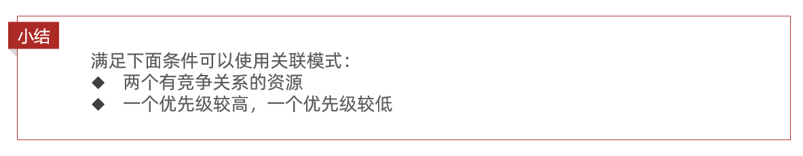
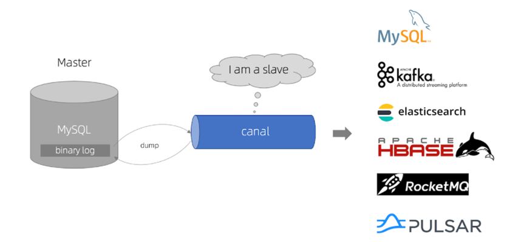
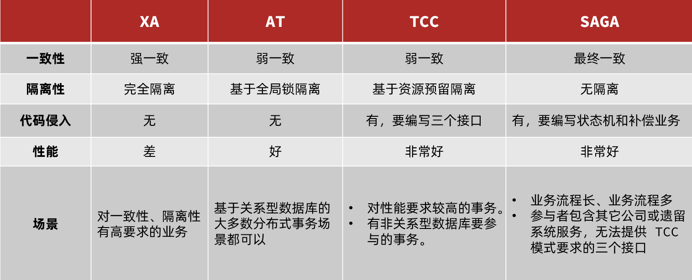

# ==Spring 框架==

# ==Spring==

Spring 是一个轻量级的**IoC**和**AOP**容器框架。是为 Java 应用程序提供基础性服务的一套框架，目的是用于简化企业应用程序的开发，它使得开发者只需要关心业务需求。常见的配置方式有三种： **XML**，**Java 注解**或 **Java 代码**。

主要由以下几个模块组成：

**Spring Core**：核心类库，提供 IOC 服务；

**Spring AOP**：AOP 服务；

**Spring DAO**：对 JDBC 的抽象，简化了数据访问异常的处理；

**Spring Web**：提供了基本的面向 Web 的综合特性，例如多方文件上传；

**Spring MVC**：提供面向 Web 应用的 Model-View-Controller 实现。

## Spring 好处

- **轻量：**Spring 是轻量的，基本的版本大约 2MB
- **控制反转：**Spring 通过控制反转实现了**松散耦合**，对象们给出它们的依赖，而不是创建或查找依赖的对象们
- **面向切面的编程(AOP)：**Spring 支持面向切面的编程，并且把应用业务逻辑和系统服务分开
- **容器：**Spring 包含并管理应用中对象的生命周期和配置
- **MVC 框架：**Spring 的 WEB 框架是个精心设计的框架，是 Web 框架的一个很好的替代品
- **事务管理：**Spring 提供一个持续的事务管理接口，可以扩展到上至本地事务下至全局事务（JTA）
- **异常处理：**Spring 提供方便的 API 把具体技术相关的异常（比如由 JDBC，Hibernate or JDO 抛出的）转化为一致的**unchecked 异常**。

## IOC

IOC 就是**控制反转**，是指创建对象的控制权的转移。创建对象的主动权和时机转移到 Spring 容器中，Spring 框架的核心是 Spring 容器。**容器创建对象**，将它们装配在一起，**配置它们并管理它们的完整生命周期**。IOC 是 Spring 针对**解决程序耦合**而存在的。

Spring 容器使用**DI 依赖注入**来管理组成应用程序的组件。容器通过**读取提供的配置元数据来接收对象进行实例化，配置和组装的指令**。该元数据可以通过 **XML**，**Java 注解**或 **Java 代码**提供。


使用 java 的**反射机制**，根据配置文件在**运行时**动态的去创建对象以及管理对象，并调用对象的方法。

### 依赖注入 DI

**依赖注入，和控制反转是同一概念的不同角度的描述**，即 应用程序在运行时**依赖 IoC 容器来动态注入对象需要的外部资源**。

依赖注入的目的并非为软件系统带来更多功能，而是**为了提升组件重用的频率**，并为系统搭建一个**灵活、可扩展的**平台。

在依赖注入中，您不必创建对象，但必须描述如何创建它们。您不是直接在代码中将组件和服务连接在一起，而是描述配置文件中哪些组件需要哪些服务。由 IoC 容器将它们装配在一起。

**DI 依赖注入的方式**

- **构造器注入**：将被依赖对象通过构造函数的参数注入给依赖对象，并且在初始化对象的时候注入。

- **set 方法注入**： IoC Service Provider 通过调用成员变量提供的 setter 函数将被依赖对象注入给依赖类。

- **Bean 工厂注入**。**接口注入**

在 **Spring Framework** 中，**仅**使用**构造函数**和 **setter 注入**。

### 构造函数 和 setter 注入

| 构造函数注入               | setter 注入                |
| -------------------------- | -------------------------- |
| 没有部分注入               | 有部分注入                 |
| 不会覆盖 setter 属性       | 会覆盖 setter 属性         |
| 任意修改都会创建一个新实例 | 任意修改不会创建一个新实例 |
| 适用于设置很多属性         | 适用于设置少量属性         |

### spring 配置方式

- **基于 xml 配置**

bean 所需的依赖项和服务在 XML 格式的配置文件中指定。这些配置文件通常包含许多 bean 定义和特定于应用程序的配置选项。它们通常以 bean 标签开头。例如：

```xml
<bean id="studentbean" class="org.edureka.firstSpring.StudentBean">
 <property name="name" value="Edureka"></property>
</bean>
```

- **基于注解配置**

您可以通过在相关的类，方法或字段声明上使用注解，将 bean 配置为组件类本身，而不是使用 XML 来描述 bean 装配。默认情况下，Spring 容器中未打开注解装配。因此，您需要在使用它之前在 Spring 配置文件中启用它。例如：

```xml
<beans>
<context:annotation-config/>
<!-- bean definitions go here -->
</beans>
```

- **基于 Java API 配置**

Spring 的 Java 配置是通过使用 **@Bean** 和 **@Configuration** 来实现。

1. @Bean 注解扮演与 `<bean />` 元素相同的角色。
2. @Configuration 类允许通过简单地调用同一个类中的其他 @Bean 方法来定义 bean 间依赖关系。

```java
@Configuration
public class StudentConfig {
    @Bean
    public StudentBean myStudent() {
        return new StudentBean();
    }
}
```

### 声明 bean 的注解

我们一般使用 **@Autowired 注解自动装配 bean**，自动装配的 bean 的类：

- **@Component** ：**通用的注解**，可标注任意类为 Spring 组件。如果一个 Bean 不知道属于哪个层，可以使用@Component 注解标注。
- **@Repository** : 对应持久层即 Dao 层，主要用于数据库相关操作。
- **@Service** : 对应服务层，主要涉及一些复杂的逻辑，需要用到 Dao 层。
- **@Controller** : 对应 Spring MVC 控制层，主要用户接受用户请求并调用 Service 层返回数据给前端页面。

### bean 作用域@Scope

- **singleton** : 唯一 bean 实例，Spring 中的 bean 默认都是单例的。
- **prototype** : 每次请求都会创建一个新的 bean 实例。

以下仅当使用**支持 Web 的 ApplicationContext 时才可用**：

- **request** : 每一次 HTTP 请求都会产生一个新的 bean，该 bean 仅在当前 HTTP request 内有效。
- **session** : ：在一个 HTTP Session 中，一个 Bean 定义对应一个实例。该作用域仅在基于 web 的 Spring ApplicationContext 情形下有效。
- **global-session**： 全局 session 作用域，仅仅在基于 portlet 的 web 应用中才有意义，Spring5 已经没有了。Portlet 是能够生成语义代码(例如：HTML)片段的小型 Java Web 插件。它们基于 portlet 容器，可以像 servlet 一样处理 HTTP 请求。但是，与 servlet 不同，每个 portlet 都有不同的会话

```xml
<bean id="myPrototypeBean" class="com.example.MyPrototypeBean" scope="prototype"/>
```

```java
@Bean
@Scope("prototype")
public MyPrototypeBean myPrototypeBean() {
    return new MyPrototypeBean();
}
```

### bean 生命周期

Bean 的生命周期是**由容器管理**的。主要在**创建**和**销毁**两个时期。


**创建过程**：

1，实例化 bean 对象，以及设置 bean 属性；
2，如果通过 Aware 接口声明了依赖关系，则会注入 Bean 对容器基础设施层面的依赖，Aware 接口是为了感知到自身的一些属性。容器管理的 Bean 一般不需要知道容器的状态和直接使用容器。但是在某些情况下是需要在 Bean 中对 IOC 容器进行操作的。这时候需要在 bean 中设置对容器的感知。SpringIOC 容器也提供了该功能，它是通过特定的 Aware 接口来完成的。
比如 BeanNameAware 接口，可以知道自己在容器中的名字。
如果这个 Bean 已经实现了 BeanFactoryAware 接口，可以用这个方式来获取其它 Bean。
（如果 Bean 实现了 BeanNameAware 接口，调用 setBeanName()方法，传入 Bean 的名字。
如果 Bean 实现了 BeanClassLoaderAware 接口，调用 setBeanClassLoader()方法，传入 ClassLoader 对象的实例。
如果 Bean 实现了 BeanFactoryAware 接口，调用 setBeanFactory()方法，传入 BeanFactory 对象的实例。）
3，紧接着会调用 BeanPostProcess 的前置初始化方法 postProcessBeforeInitialization，主要作用是在 Spring 完成实例化之后，初始化之前，对 Spring 容器实例化的 Bean 添加自定义的处理逻辑。有点类似于 AOP。
4，如果实现了 BeanFactoryPostProcessor 接口的 afterPropertiesSet 方法，做一些属性被设定后的自定义的事情。
5，调用 Bean 自身定义的 init 方法，去做一些初始化相关的工作。
6，调用 BeanPostProcess 的后置初始化方法，postProcessAfterInitialization 去做一些 bean 初始化之后的自定义工作。
7，完成以上创建之后就可以在应用里使用这个 Bean 了。

**销毁过程**：

当 Bean 不再用到，便要销毁
1，若实现了 DisposableBean 接口，则会调用 destroy 方法；
2，若配置了 destry-method 属性，则会调用其配置的销毁方法；

**总结**

主要把握创建过程和销毁过程这两个大的方面；
创建过程：首先实例化 Bean，并设置 Bean 的属性，根据其实现的 Aware 接口（主要是 BeanFactoryAware 接口，BeanFactoryAware，ApplicationContextAware）设置依赖信息，
接下来调用 BeanPostProcess 的 postProcessBeforeInitialization 方法，完成 initial 前的自定义逻辑；afterPropertiesSet 方法做一些属性被设定后的自定义的事情;调用 Bean 自身定义的 init 方法，去做一些初始化相关的工作;然后再调用 postProcessAfterInitialization 去做一些 bean 初始化之后的自定义工作。这四个方法的调用有点类似 AOP。
此时，Bean 初始化完成，可以使用这个 Bean 了。
销毁过程：如果实现了 DisposableBean 的 destroy 方法，则调用它，如果实现了自定义的销毁方法，则调用之。

### 内部 bean

**只有将 bean 用作另一个 bean 的属性时**，才能将 bean 声明为内部 bean。为了定义 bean，Spring 的基于 XML 的配置元数据在 `<property>` 或 `<constructor-arg>` 中提供了 `<bean>` 元素的使用。内部 bean 总是匿名的，它们总是作为原型。

例如，假设我们有一个 Student 类，其中引用了 Person 类。这里我们将只创建一个 Person 类实例并在 Student 中使用它。

```java
// Student.java
public class Student {
    private Person person;
    //Setters and Getters
}
public class Person {
    private String name;
    private String address;
    //Setters and Getters
}
```

bean.xml

```xml
<bean id=“StudentBean" class="com.edureka.Student">
    <property name="person">
        <!--This is inner bean -->
        <bean class="com.edureka.Person">
            <property name="name" value=“Scott"></property>
            <property name="address" value=“Bangalore"></property>
        </bean>
    </property>
</bean>
```

### 自动装配

当 bean 在 Spring 容器中组合在一起时，它被称为装配或 bean 装配。 Spring 容器需要知道需要什么 bean 以及容器应该如何使用依赖注入来将 bean 绑定在一起，同时装配 bean。

Spring 容器能够自动装配 bean。也就是说，可以**通过检查 BeanFactory 的内容让 Spring 自动解析 bean 的协作者**。

自动装配的不同**模式**：

- **no** - 这是**默认**设置，表示没有自动装配。应使用显式 bean 引用进行装配。
- **byName** - 它根据 bean 的名称注入对象依赖项。它匹配并装配其属性与 XML 文件中由相同名称定义的 bean。
- **byType** - 它根据类型注入对象依赖项。如果属性的类型与 XML 文件中的一个 bean 名称匹配，则匹配并装配属性。
- **构造函数** - 它通过调用类的构造函数来注入依赖项。它有大量的参数。
- **autodetect** - 首先容器尝试**通过构造函数**使用 **autowire 装配**，如果**不能**，则尝试通过 **byType 自动装配**。

**自动装配的局限**：

- **覆盖的可能性** - 您始终可以使用 `<constructor-arg>` 和 `<property>` 设置指定依赖项，这将覆盖自动装配。
- **基本元数据类型 - 简单属性**（如原数据类型，字符串和类）**无法自动装配**。
- 令人困惑的性质 - 总是喜欢使用明确的装配，因为**自动装配不太精确**。

### 同名 bean

- **同一个配置文件内同名的**Bean，以**最上面**定义的为准
- **不同配置文件**中存在同名 Bean，**后解析的**配置文件会**覆盖先解析的**配置文件
- **同文件**中**@Bean**会覆盖**@ComponentScan**。@ComponentScan 扫描进来的 Bean 定义是**最先被注册的**~

### 解决循环依赖

spring 对循环依赖的处理有三种情况：
①**构造器的循环依赖**：处理不了的，直接抛出 BeanCurrentlylnCreationException 异常。
②**单例模式下的 setter 循环依赖**：通过“**三级缓存”**处理循环依赖。
③**非单例循环依赖**：无法处理。

下面分析单例模式下的 setter 循环依赖如何解决

Spring 的单例对象的初始化主要分为三步：

（1）**createBeanInstance 实例化**：其实也就是调用对象的构造方法实例化对象---->会发生**构造器循环依赖**

（2）**populateBean 填充属性**：这一步主要是多 bean 的依赖属性进行填充---->会发生**field/setter 循环依赖**

（3）**initializeBean 初始化**：调用 spring xml 中的 init 方法。


**举例 setter 循环依赖**：A 的某个 field 或者 setter 依赖了 B 的实例对象，同时 B 的某个 field 或者 setter 依赖了 A 的实例对象。

**A 首先完成了初始化的第一步实例化，并且将自己提前曝光到 singletonFactories 中**。

此时进行初始化的第二步，发现自己依赖对象 B，此时就尝试去 get(B)，发现 B 还没有被 create，所以走 create 流程，B 在初始化第一步的时候发现自己依赖了对象 A，于是尝试 get(A)，尝试一级缓存 singletonObjects(肯定没有，因为 A 还没初始化完全)，尝试二级缓存 earlySingletonObjects（也没有），**尝试三级缓存 singletonFactories，由于 A 通过 ObjectFactory 将自己提前曝光了，所以 B 能够通过**

ObjectFactory.getObject 拿到 A 对象(虽然 A 还没有初始化完全，但是总比没有好呀)，B 拿到 A 对象后顺利完成了初始化阶段 1、2、3，完全初始化之后将自己放入到一级缓存 singletonObjects 中。

此时返回 A 中，A 此时能拿到 B 的对象顺利完成自己的初始化阶段 2、3，最终 A 也完成了初始化，进去了一级缓存 singletonObjects 中，而且更加幸运的是，由于 B 拿到了 A 的对象引用，所以 B 现在 hold 住的 A 对象完成了初始化。

**三级缓存+提前曝光**

```java
一级缓存：
/** 保存实例化、注入、初始化完成的bean实例 */
private final Map<String, Object> singletonObjects = new ConcurrentHashMap<String, Object>(64);

二级缓存：
/** 用于保存实例化完成的bean实例 */
private final Map<String, Object> earlySingletonObjects = new HashMap<String, Object>(16);
三级缓存：
/** 用于保存bean创建工厂，以便于后面扩展有机会创建代理对象。*/
private final Map<String, ObjectFactory<?>> singletonFactories = new HashMap<String, ObjectFactory<?>>(16);
```


如果没有二级缓存，多次从三级缓存获取的对象可能不一样。所以 factory 对象的目的在于，如果发生了循环依赖，则需要创建被增强的对象（所以需要生成一个代理对象），放入到二级缓存中。否则在程序运行中是代理对象 A，而 B 拿到的对象却是普通对象 A。如果不放入二级缓存中，那只能还是从三级缓存中获取，那么会再次触发 aop 增强。

**因为加入 singletonFactories 三级缓存的前提是执行了构造器来创建半成品的对象，所以构造器的循环依赖没法解决。**（同样对于循环依赖的场景，构造器注入和 prototype 类型的属性注入都会初始化 Bean 失败。因为@Service 默认是单例的，所以单例的属性注入是可以成功的。）

（构造器循环依赖发生在**实例化阶段**、field 循环依赖发生在**属性赋值阶段**）

### 单例 bean 的线程安全问题

多个线程会并发对单例 bean 状态/成员属性的修改则必须考虑线程安全问题。
**线程安全问题都是由全局变量及静态变量引起的。**

**无状态 bean 和有状态 bean**：

- **无状态就是一次操作，不能保存数据**。是**线程安全**的。

  - 无状态的 Bean**适合用单例模式**，这样可以**共享实例提高性能**。

- **有状态 bean 就是有数据存储功能的**。有状态对象(Stateful Bean)，就是有实例变量的对象，可以保存数据，是**非线程安全**的。在不同方法调用间不保留任何状态。
  - 有状态的 Bean 在多线程环境下不安全，**适合用 Prototype 原型模式**。 作用域由 Singleton 变换为 Protptype
  - Spring 使用**ThreadLocal 解决线程安全问题**。如果你的 Bean 有**多种状态**的话（比如 View Model 对象），就**需要自行保证线程安全** 。

## AOP

AOP(Aspect-Oriented Programming), 即 **面向切面编程**, 它**与 OOP**( Object-Oriented Programming, 面向对象编程) **相辅相成**, 提供了与 OOP 不同的抽象软件结构的视角.
OOP 中,以类(class)为基本单元，而 AOP 中基本单元是 **Aspect(切面)**

AOP（面向切面编程）能够将那些与业务无关，却为业务模块所共同调用的逻辑或责任（例如事务处理、日志管理、权限控制等）封装起来，便于**减少系统的重复代码**，**降低模块间的耦合度**，并有利于未来的**可扩展性和可维护性**。

**局限性**：

Spring AOP 是**基于代理的**，这意味着它**只能对外部方法调用进行拦截**，如果一个方法内部调用另一个方法，这个**内部调用是不会被拦截的**。其次，Spring AOP**默认使用 Java 的动态代理**，这意味着它**只能为接口创建代理**。如果需要**为类创建代理**，就需要**启用 CGLIB**，但这可能会**引入额外的复杂性**。最后，AOP 虽然可以改善代码的模块化，但如果过度使用，也可能使代码变得难以理解和维护。

### AOP 实现方式

- **静态代理/编译时增强**：指使用 **AOP 框架提供的命令进行编译**，从而在编译阶段就可生成 AOP 代理类；
  - 编译时编织（特殊编译器实现）
  - 类加载时编织（特殊的类加载器实现）。
- **动态代理/运行时增强**：在运行时在内存中“临时”生成 AOP 动态代理类。
  - 如果要**代理对象实现了某个接口**，**默认**用**JDK 动态代理**：通过**反射**来接收被代理的类。核心是 **InvocationHandler 接口**和 **Proxy 类** 。
  - **没有实现接口，CGLIB 动态代理**： Code Generation Library **是一个代码生成的类库**，可以**在运行时通过继承的方式动态的生成被代理对象的子类**，因此如果某个类被标记为 **final**，是无法使用 `CGLIB` 做动态代理的。

**Spring AOP 和 AspectJ AOP 有什么区别**：

- Spring AOP 是属于**运行时增强**，**基于代理**（Proxying）

- AspectJ AOP 是**编译时增强**。**基于字节码操作**（Bytecode Manipulation）。

### AOP 使用方式

- 在**XML 配置**中，我们需要**定义一个或多个 Aspect**，并为每个 Aspect 定义**Pointcut**和**Advice**。

- 在**注解**中，我们可以使用**@Aspect**注解来标注一个类为 Aspect，然后使用**@Pointcut**和**@Advice**注解来定义**Pointcut**和**Advice**。Spring 会自动扫描这些注解，并将相应的 Aspect 应用到目标对象上。

**关注点**是应用中一个模块的行为，一个关注点可能会被定义成一个我们想实现的一个功能。

**横切关注点**是一个关注点，此关注点是整个应用都会使用的功能，并影响整个应用，比如日志，安全和数 据传输，几乎应用的每个模块都需要的功能。

**连接点**：连接点代表一个应用程序的某个位置，在这个位置我们可以插入一个 AOP 切面，它实际上是个应用程序执行 Spring AOP 的位置。

**切入点**：切入点是一个或一组连接点，通知将在这些位置执行。可以通过表达式或匹配的方式指明切入点。

**通知**是个在方法执行前或执行后要做的动作，实际上是程序执行时要通过 SpringAOP 框架触发的代码段。

Spring 切面可以应用五种类型的通知：

before：前置通知，在一个方法执行前被调用。

after: 在方法执行之后调用的通知，无论方法执行是否成功。

after-returning: 仅当方法成功完成后执行的通知。

after-throwing: 在方法抛出异常退出时执行的通知。

around: 在方法执行之前和之后调用的通知。

## 事务 ACID

- **原子性（Atomicity）：** 一个事务（transaction）中的所有操作，或者全部完成，或者全部不完成，不会结束在中间某个环节。事务在执行过程中发生错误，会被回滚（Rollback）到事务开始前的状态，就像这个事务从来没有执行过一样。即，事务不可分割、不可约简。
- **一致性（Consistency）：** 在事务开始之前和事务结束以后，数据库的完整性没有被破坏。这表示写入的资料必须完全符合所有的预设约束、触发器、级联回滚等。
- **隔离性（Isolation）：** 数据库允许多个并发事务同时对其数据进行读写和修改的能力，隔离性可以防止多个事务并发执行时由于交叉执行而导致数据的不一致。事务隔离分为不同级别，包括未提交读（Read uncommitted）、提交读（read committed）、可重复读（repeatable read）和串行化（Serializable）。
- **持久性（Durability）:** 事务处理结束后，对数据的修改就是永久的，即便系统故障也不会丢失。

再提醒一次：你的程序**是否支持事务首先取决于数据库** ，比如使用 MySQL 的话，如果你选择的是 **innodb 引擎**，是支持事务的。但是**myisam 引擎**从根上就是不支持事务的。

### Spring 两种事务管理

**编程式事务管理**：通过 `TransactionTemplate`或者`TransactionManager`手动编程管理事务，实际应用中很少使用

**声明式事务管理**：通过**注解**或者**XML 配置**，比如基于`@Transactional` 的全注解方式，实际是通过 AOP 实现，**代码侵入性最小**，推荐

### Spring 的事务管理优点

- 它提供了跨不同事务 api（如 JTA、JDBC、Hibernate、JPA 和 JDO）的一致编程模型。

- 它为编程事务管理提供了比 JTA 等许多复杂事务 API 更简单的 API。

- 它支持声明式事务管理。

- 它很好地集成了 Spring 的各种数据访问抽象。

### 事务@Transactional

在要开启事务的方法上使用`@Transactional`注解即可!

```java
@Transactional(rollbackFor = Exception.class)
public void save() {
  ......
}
```

我们知道 Exception 分为运行时异常 RuntimeException 和非运行时异常。在`@Transactional`注解中如果不配置`rollbackFor`属性,那么事务只会回滚`RuntimeException`,加上`rollbackFor=Exception.class`,可以都回滚。

`@Transactional` 注解一般可以作用在`类`或者`方法`上。

- **作用于类**：当把`@Transactional` 注解放在类上时，表示所有该类的 public 方法都配置相同的事务属性信息。
- **作用于方法**：当类配置了`@Transactional`，方法也配置了`@Transactional`，方法的事务会覆盖类的事务配置信息。

### @Transactional 注意事项

- `@Transactional` 注解只有作用到 **public** 方法上事务才生效，**不推荐在接口上使用**；
- 避免同一个类中调用 `@Transactional` 注解的方法，这样会导致事务失效；
- 正确的设置 `@Transactional` 的 `rollbackFor` 和 `propagation` 属性，否则事务可能会回滚失败;
- 被 `@Transactional` 注解的方法所在的类必须被 Spring 管理，否则不生效；
- 底层使用的数据库必须支持事务机制，否则不生效；
- ......

### 事务传播机制

Spring 事务定义了 7 种传播机制：

- **PROPAGATION_REQUIRED**: 支持当前事务，如果当前没有事务，就新建一个事务。**最常见**，`@Transactional`**默认**使用。
- **PROPAGATION_SUPPORTS**: 支持当前事务，如果当前没有事务，就以非事务方式执行。
- **PROPAGATION_MANDATORY**: 支持当前事务，如果当前没有事务，就抛出异常。
- **PROPAGATION_REQUIRES_NEW**: 新建事务，如果当前存在事务，把当前事务挂起。
- **PROPAGATION_NOT_SUPPORTED**: 以非事务方式执行操作，如果当前存在事务，就把当前事务挂起。
- **PROPAGATION_NEVER**: 以非事务方式执行，如果当前存在事务，则抛出异常。
- **PROPAGATION_NESTED**:如果当前存在事务，则在嵌套事务内执行。如果当前没有事务，则进行与 PROPAGATION_REQUIRED 类似的操作。

## 拦截器

Spring 的处理程序映射机制包括处理程序拦截器，当你希望将特定功能应用于某些请求时，例如，检查用户主题时，这些拦截器非常有用。拦截器必须实现 org.springframework.web.servlet 包的 HandlerInterceptor。此接口定义了三种方法：

- preHandle：在执行实际处理程序之前调用。
- postHandle：在执行完实际程序之后调用。
- afterCompletion：在完成请求后调用。

# ==SpringMVC==

将业务逻辑、数据、显示分离来组织代码的一种设计模式。

M-Model 模型（完成业务逻辑：有由 avaBean 构成，service+dao+entity）

V-View 视图（做界面的展示 jsp，html……）

C-Controller 控制器（接收请求—>调用模型—>根据结果派发页面）

**原理如下图所示：**


上图的一个笔误的小问题：Spring MVC 的入口函数也就是前端控制器 `DispatcherServlet` 的作用是接收请求，响应结果。

**流程说明（重要）：**

1. 客户端（浏览器）发送请求，直接请求到 `DispatcherServlet`。
2. `DispatcherServlet` 根据请求信息调用 `HandlerMapping`，解析请求对应的 `Handler`。也就是 `Controller` 控制器，开始由 `HandlerAdapter` 适配器处理。
3. `HandlerAdapter` 会根据 `Handler`来调用真正的处理器开始处理请求，并处理相应的业务逻辑。
4. 处理器处理完业务后，会返回一个 `ModelAndView` 对象，`Model` 是返回的数据对象，`View` 是个逻辑上的 `View`。
5. `ViewResolver` 会根据逻辑 `View` 查找实际的 `View`，根据 `Model` 进行视图渲染。把结果`View` 返回给`DispaterServlet` 。
6. `DispaterServlet` 返回给请求者（浏览器）。

**简单介绍 Spring MVC 的核心组件**：

| 组件                         | 说明                                                                                                                                                                                                                                                                                                                                                      |
| :--------------------------- | :-------------------------------------------------------------------------------------------------------------------------------------------------------------------------------------------------------------------------------------------------------------------------------------------------------------------------------------------------------- |
| DispatcherServlet            | Spring MVC 的核心组件，是请求的入口，负责协调各个组件工作                                                                                                                                                                                                                                                                                                 |
| MultipartResolver            | 内容类型( `Content-Type` )为 `multipart/*` 的请求的解析器，例如解析处理文件上传的请求，便于获取参数信息以及上传的文件                                                                                                                                                                                                                                     |
| HandlerMapping               | 请求的处理器匹配器，负责为请求找到合适的 `HandlerExecutionChain` 处理器执行链，包含处理器（`handler`）和拦截器们（`interceptors`）                                                                                                                                                                                                                        |
| HandlerAdapter               | 处理器的适配器。因为处理器 `handler` 的类型是 Object 类型，需要有一个调用者来实现 `handler` 是怎么被执行。Spring 中的处理器的实现多变，比如用户处理器可以实现 Controller 接口、HttpRequestHandler 接口，也可以用 `@RequestMapping` 注解将方法作为一个处理器等，这就导致 Spring MVC 无法直接执行这个处理器。所以这里需要一个处理器适配器，由它去执行处理器 |
| Handler-ExceptionResolver    | 处理器异常解析器，将处理器（ `handler` ）执行时发生的异常，解析( 转换 )成对应的 ModelAndView 结果                                                                                                                                                                                                                                                         |
| RequestToView-NameTranslator | 视图名称转换器，用于解析出请求的默认视图名                                                                                                                                                                                                                                                                                                                |
| LocaleResolver               | 本地化（国际化）解析器，提供国际化支持                                                                                                                                                                                                                                                                                                                    |
| ThemeResolver                | 主题解析器，提供可设置应用整体样式风格的支持                                                                                                                                                                                                                                                                                                              |
| ViewResolver                 | 视图解析器，根据视图名和国际化，获得最终的视图 View 对象                                                                                                                                                                                                                                                                                                  |
| FlashMapManager              | FlashMap 管理器，负责重定向时，保存参数至临时存储（默认 Session）                                                                                                                                                                                                                                                                                         |

## Spring MVC 和 Struts2

**入口**不同

- Spring MVC 的入门是一个 Servlet **控制器**。
- Struts2 入门是一个 Filter **过滤器**。

**配置映射**不同，

- Spring MVC 是基于**方法**开发，传递参数是通过**方法形参**，一般设置为**单例**。
- Struts2 是基于**类**开发，传递参数是通过**类的属性**，只能设计为**多例**。

**视图**不同

- Spring MVC 通过参数解析器是将 Request 对象内容进行解析成方法形参，将响应数据和页面封装成 **ModelAndView** 对象，最后又将模型数据通过 **Request** 对象传输到页面。其中，如果视图使用 JSP 时，默认使用 **JSTL** 。
- Struts2 采用**值栈**存储请求和响应的数据，通过 **OGNL** 存取数据。

## REST

REST 代表着抽象状态转移，它是根据 HTTP 协议从客户端发送数据到服务端，例如：服务端的一本书可以 XML 或 JSON 格式传递到客户端

可以看看 [REST API design and development](http://bit.ly/2zIGzWK) ，知乎上的 [《怎样用通俗的语言解释 REST，以及 RESTful？》](https://www.zhihu.com/question/28557115)了解。

### 安全的 REST 操作

是否安全的界限，在于**是否修改**服务端的资源

- **GET 和 HEAD 是安全的**，它不能在服务端修改资源
- PUT、POST 和 DELETE 是不安全的，因为他们能修改服务端的资源

### REST API 是无状态的吗

**是的**，REST API 应该是无状态的，因为它是基于 HTTP 的，它也是无状态的

REST API 中的请求应该包含处理它所需的所有细节。它**不应该**依赖于以前或下一个请求或服务器端维护的一些数据，例如会话

**REST 规范为使其无状态设置了一个约束，在设计 REST API 时，你应该记住这一点**

### REST 安全吗

安全可能意味着**消息的安全性**，REST 通常是**不安全的**，需要开发人员**自己实现安全机制**，比如**认证和授权提供的加密或访问限制**。

# ==MyBatis==

- Mybatis 是一个**半自动 ORM（对象关系映射）框架**，它内部封装了 JDBC，加载驱动、创建连接、创建 statement 等繁杂的过程，开发者开发时**只需要关注如何编写 SQL 语句**，可以严格控制 sql 执行性能，灵活度高。
- 作为一个半 ORM 框架，MyBatis 可以使用 XML 或注解来配置和映射原生信息，将 POJO 映射成数据库中的记录，避免了几乎所有的 JDBC 代码和手动设置参数以及获取结果集。
- 通过 xml 文件或注解的方式将要执行的各种 statement 配置起来，并通过 java 对象和 statement 中 sql 的动态参数进行映射生成最终执行的 sql 语句，最后由 mybatis 框架执行 sql 并将结果映射为 java 对象并返回。（从执行 sql 到返回 result 的过程）。
- 由于 MyBatis**专注于 SQL 本身**，**灵活度高**，所以比较适合对性能的要求很高，或者需求变化较多的项目，如互联网项目。

## 优缺点

优点：

- 基于 SQL 语句编程，相当灵活，不会对应用程序或者数据库的现有设计造成任何影响，SQL 写在 XML 里，解除 sql 与程序代码的耦合，便于统一管理；提供 XML 标签，支持编写动态 SQL 语句，并可重用。
- 与 JDBC 相比，减少了 50%以上的代码量，消除了 JDBC 大量冗余的代码，不需要手动开关连接；
- 很好的与各种数据库兼容（因为 MyBatis 使用 JDBC 来连接数据库，所以只要 JDBC 支持的数据库 MyBatis 都支持）。
- 能够与 Spring 很好的集成；
- 提供映射标签，支持对象与数据库的 ORM 字段关系映射；提供对象关系映射标签，支持对象关系组件维护。

缺点：

- SQL 语句的编写工作量较大，尤其当字段多、关联表多时，对开发人员编写 SQL 语句的功底有一定要求。
- SQL 语句依赖于数据库，导致数据库移植性差，不能随意更换数据库。

## 半自动 ORM 映射工具

**Hibernate 属于全自动 ORM 映射工具**，使用 Hibernate 查询关联对象或者关联集合对象时，**可以根据对象关系模型直接获取**，所以它是全自动的。

而 Mybatis 在**查询关联对象或关联集合对象时**，需要**手动编写 sql 来完成**，所以，称之为半自动 ORM 映射工具。

## Hibernate 和 MyBatis

**相同点**：都是对 jdbc 的封装，都是持久层的框架，都用于 dao 层的开发。

**不同点**：

**1.映射关系**

MyBatis 是一个**半自动映射**的框架，配置 Java 对象与 sql 语句执行结果的对应关系，**多表关联关系配置简单**。

Hibernate 是一个**全表映射**的框架，配置 Java 对象与数据库表的对应关系，**多表关联关系配置复杂**。

**2.SQL 优化和移植性**

Hibernate 对**SQL 语句封装**，提供了日志、缓存、级联（级联比 MyBatis 强大）等特性，此外还提供 HQL（Hibernate Query Language）操作数据库，数据库无关性支持好，但会多消耗性能。如果项目需要支持多种数据库，代码开发量少，但 SQL 语句优化困难。
MyBatis 需要**手动编写 SQL**，支持动态 SQL、处理列表、动态生成表名、支持存储过程。开发工作量相对大些。直接使用 SQL 语句操作数据库，不支持数据库无关性，但 sql 语句优化容易。

**3.开发难易程度和学习成本**

Hibernate 是**重量级框架**，学习使用门槛高，适合于**需求相对稳定，中小型的项目**，比如：办公自动化系统

MyBatis 是**轻量级框架**，学习使用门槛低，适合于**需求变化频繁，大型的项目**，比如：互联网电子商务系统

**总结**：

MyBatis 是一个小巧、方便、高效、简单、直接、半自动化的持久层框架，

Hibernate 是一个强大、方便、高效、复杂、间接、全自动化的持久层框架。

## 如何解决 JDBC 编程不足的

1、**数据库链接创建、释放频繁**造成系统资源浪费从而影响系统性能。

解决：在 SqlMapConfig.xml 中**配置数据链接池**，使用连接池管理数据库链接。

2、**Sql 语句写在代码中造成代码不易维护**，实际应用 sql 变化的可能较大，sql 变动需要改变 java 代码。

解决：将 Sql 语句配置在**XXXXmapper.xml 文件中**与 java 代码分离。

3、 **向 sql 语句传参数麻烦**，因为 sql 语句的 where 条件不一定，可能多也可能少，占位符需要和参数一一对应。

解决： Mybatis**自动将 java 对象映射至 sql 语句**。

4、 **对结果集解析麻烦**，sql 变化导致解析代码变化，且解析前需要遍历。

解决：Mybatis**自动将 sql 执行结果映射至 java 对象**。

## MyBatis 编程步骤

1、创建 SqlSessionFactory
2、通过 SqlSessionFactory 创建 SqlSession
3、 通过 sqlsession 执行数据库操作
4、 调用 session.commit()提交事务
5、 调用 session.close()关闭会话

## Dao 接口与 Xml 映射文件

Dao 接口即 Mapper 接口。接口的全限名就是映射文件中的 namespace 的值；接口的方法名，就是映射文件中 Mapper 的 Statement 的 id 值；接口方法内的参数，就是传递给 sql 的参数。Mapper 接口是没有实现类的，当调用接口方法时，**接口全限名+方法名**的拼接字符串作为 key 值，可唯一定位一个 MapperStatement。

Dao 接口里的**方法不能重载**，因为是**全限名+方法名的保存和寻找策略**。

Dao 接口的工作原理是**JDK 动态代理**，Mybatis 运行时会使用 JDK 动态代理为 Dao 接口生成代理 proxy 对象，**代理对象 proxy 会拦截接口方法，转而执行 MappedStatement 所代表的 sql**，然后将 sql 执行结果返回。

## Mapper 中如何传递多个参数

1、若 Dao 层函数有多个参数，那么其对应的 xml 中，#{0}代表接收的是 Dao 层中的第一个参数，#{1}代表 Dao 中的第二个参数，以此类推。

2、使用@Param 注解：在 Dao 层的参数中前加@Param 注解,注解内的参数名为传递到 Mapper 中的参数名。

3、多个参数封装成 Map，以 HashMap 的形式传递到 Mapper 中。

## 动态 sql

Mybatis 动态 sql 可以在 xml 映射文件内，**以标签的形式编写动态 sql**，执行原理是**根据表达式的值完成逻辑判断，并动态拼接 sql**。

Mybatis 提供了 9 种动态 sql 标签：trim、**where**、**set**、**foreach**、**if**、choose、**when**、otherwise、bind

## 不同 xml 文件 id 是否可以重复

不同的 xml 映射文件，如果**配置了 namespace，那么 id 可以重复**；如果**没有配置 namespace，那么 id 不能重复**；

原因是**namespace+id**是作为 Map<String,MapperStatement>的**key**使用的。

## 一对一//一对多有几种方式

有**联合查询**和**嵌套查询**两种方式。

**联合查询**是几个表联合查询，通过在**resultMap**里面配置**association**/**collection**节点配置**一对一**/**多**的类就可以完成；

**嵌套查询**是先查一个表，根据这个表里面的结果的外键 id，再去另外一个表里面查询数据，也是通过**association**/**collection**配置，但另外一个表的查询是通过 select 配置的。

## Mybatis 的一级/二级缓存

都是**基于 PerpetualCache 的 HashMap 本地缓存**

1、 **一级缓存**：其**存储作用域为 Session**，当 Session flush 或 close 之后，该 Session 中的所有 Cache 就将清空，**默认打开一级缓存**。
2、 **二级缓存**：其**存储作用域为 Mapper（namespace）**，并且可自定义存储源，如 Ehcache。**默认不打开二级缓存**，要开启二级缓存，使用二级缓存属性类需要实现**Serializable 序列化接口**（可用来保存对象的状态），**可在它的映射文件中配置**。

对于**缓存数据更新机制**：当某一个**作用域**（一级缓存 Session/二级缓存 Namespace）进行了**增/删/改**操作后，默认该作用域下所有 select 中的缓存将**被 clear**。

## Mapper 接口调用有哪些要求

1、Mapper 接口**方法名**和 mapper.xml 中定义的每个 sql 的**id**相同；
2、Mapper 接口方法的**输入输出参数类型**和 mapper.xml 中定义的每个 sql 的**parameterType 类型相同**；
3、Mapper.xml 文件中的**namespace 即是 mapper 接口的类路径**。

## \#{}和${}

- #{}是占位符，预编译处理；${}是拼接符，字符串替换，没有预编译处理。
- Mybatis 在处理#{}时，#{}传入参数是以字符串传入，会将 SQL 中的#{}替换为?号，调用 PreparedStatement 的 set 方法来赋值。
- Mybatis 在处理时 ， 是 原 值 传 入 ， 就 是 把 {}时，是原值传入，就是把时，是原值传入，就是把{}替换成变量的值，相当于 JDBC 中的 Statement 编译
- 变量替换后，#{} 对应的变量自动加上单引号 ‘’；变量替换后，${} 对应的变量不会加上单引号 ‘’
- #{} 可以有效的**防止 SQL 注入**，提高系统安全性；${} 不能防止 SQL 注入
- #{} 的变量替换是在 DBMS 中；${} 的变量替换是在 DBMS 外

# ==SpringBoot==

**简化了 Spring 的配置**

**启动流程**：

1.首先从 main 找到 run()方法，在执行 run()方法之前 new 一个 SpringApplication 对象 2.进入 run()方法，创建应用监听器 SpringApplicationRunListeners 开始监听 3.然后加载 SpringBoot 配置环境(ConfigurableEnvironment)，然后把配置环境(Environment)加入监听对象中 4.然后加载应用上下文(ConfigurableApplicationContext)，当做 run 方法的返回对象 5.最后创建 Spring 容器，refreshContext(context)，实现 starter 自动化配置和 bean 的实例化等工作。

## 模块

**1、spring-boot**

这是 Spring Boot 的**主模块**，也是支持其他模块的核心模块，主要包含以下几点：

1. 提供了一个启动 Spring 应用的主类，并提供了一个相当方便的静态方法，它的主要作用是负责创建和刷新 Spring 容器的上下文；

2. 内嵌式的并可自由选择搭配的 WEB 应用容器，如：`Tomcat`, `Jetty`, `Undertow`等；

3. 对配置外部化的支持；

4. 提供一个很方便的 Spring 容器上下文初始化器，包括合理记录日志默认参数的支持。

**2、spring-boot-autoconfigure**

Spring Boot 能根据类路径下的内容自动一些公共大型应用，提供的 `@EnableAutoConfiguration` 注解就能启用 Spring 功能的自动配置。

**3、spring-boot-starters**

Starters，我们叫它启动器好了，它是包括一系列依赖的描述符。简单的说就是，它可以一站式的帮你打包 Spring 及相关技术应用，而不需要你到处找依赖和示例配置代码，它都帮你做好了。

## Starters

Starters**可以理解为启动器**，它包含了一系列可以集成到应用里面的**依赖包**，可以**一站式集成 Spring 及其他技术**，而不需要到处找示例代码和依赖包。

如何装配：

利用 starter 实现自动化配置只需要两个条件——maven 依赖、配置文件，这里简单介绍下 starter 实现自动化配置的流程。
引入 maven 实质上就是导入 jar 包，spring-boot 启动的时候会找到 starter jar 包中的 resources/META-INF/spring.factories 文件，根据 spring.factories 文件中的配置，找到需要自动配置的类。

## SpringBoot Starter 工作原理

Spring Boot 在启动的时候会干这几件事情：

- Spring Boot 在启动时会去依赖的 Starter 包中寻找 resources/META-INF/spring.factories 文件，然后根据文件中配置的 Jar 包去扫描项目所依赖的 Jar 包。
- 根据 spring.factories 配置加载 AutoConfigure 类
- 根据 @Conditional 注解的条件，进行自动配置并将 Bean 注入 Spring Context

总结一下，其实就是 Spring Boot 在启动的时候，按照约定去读取 Spring Boot Starter 的配置信息，再根据配置信息对资源进行初始化，并注入到 Spring 容器中。这样 Spring Boot 启动完毕后，就已经准备好了一切资源，使用过程中直接注入对应 Bean 资源即可

## SpringBoot 核心注解

**@SpringBootApplication** ：包含以下

- **@EnableAutoConfiguration**：打开自动配置的功能，也可以关闭某个自动配置的选项，如关闭数据源自动配置功能： @SpringBootApplication(exclude = { DataSourceAutoConfiguration.class })。

- **@ComponentScan**：扫描被@Component ( @Service , @Controller )注解的 bean,注解默认会扫描该类所在的包下所有的类。

- **@Configuration**：允许在上下文中注册额外的 bean 或导入其他配置类

**@EnableAutoConfiguration 自动配置过程：**

通过 Spring 提供的@Import 注解导入 AutoConfigurartionImportSelector 类，该类中的 getCandidateConfiguration 方法会加载所有 META-INF 下有 spring.factories 文件的 jar 包，并根据 spring.factories 文件中的配置，去加载相应的类。

## Web 相关注解

**Bean 相关:**

**@Autowired** :自动导入对象到类中，被注入进的类同样要被 Spring 容器管理。

**@RestController** : 是@Controller 和@ ResponseBody 的合集，表示这是个控制器 bean,并且是将函数的返回值直接填入 HTTP 响应体中,是 REST 风格的控制器。

**@Component** : 通用的注解，可标注任意类为 Spring 组件。如果一个 Bean 不知道属于哪个层,可以使用@Component 注解标注。`@Component` 注解作用于类，而`@Bean`注解作用于方法。

**@Repository** :对应持久层即 Dao 层，主要用于数据库相关操作。

**@Service** :对应服务层,主要涉及-些复杂的逻辑，需要用到 Dao 层。

**@Controller** : 对应 Spring MVC 控制层，主要用于接受用户请求并调用 Service 层返回数据给前端页面。

**前后端传值:**

**@RequestParam** 以及**@Pathvairable** : @PathVariable 用于获取路径参数，@RequestParam 用于获取查询参数。

**@RequestBody** : 将**请求的 body 中的 json 字符串转换为 java 对象**。

**@ResponseBody**：在前后端不分离的情况下如果不加 ResponseBody 则请求的是页面，加了才能获取对象。和**`@RestController`** 一样**返回 JSON 格式**

### @Controller 注解

`@Controller` 注解标记一个类为 Spring Web MVC **控制器** Controller。Spring MVC 会将扫描到该注解的类，然后扫描这个类下面带有 `@RequestMapping` 注解的方法，根据注解信息，为这个方法生成一个对应的**处理器**对象，在上面的 HandlerMapping 和 HandlerAdapter 组件中讲到过。

当然，除了添加 `@Controller` 注解这种方式以外，你还可以实现 Spring MVC 提供的 `Controller` 或者 `HttpRequestHandler` 接口，对应的实现类也会被作为一个**处理器**对象

### @RequestMapping

配置**处理器**的 HTTP 请求方法，URI 等信息，这样才能将请求和方法进行映射。这个注解可以作用于类上面，也可以作用于方法上面，在类上面一般是配置这个**控制器**的 URI 前缀

### @RequestMapping 和@GetMapping

1. `@RequestMapping`：可注解在**类和方法上**；`@GetMapping` **仅可在方法上**
2. `@GetMapping` 是 `@RequestMapping` 的 GET 请求方法的特例，**目的是为了提高清晰度**。

### @Autowired 和@Resource

Spring 内置的 `@Autowired` 以及 JDK 内置的 `@Resource` 和 `@Inject` 都可以用于注入 Bean。

- `@Autowired` 是 **Spring** 提供的，默认的注入方式为`byType`
- `@Resource` 是 **JDK** 提供的，默认注入方式为 `byName`
- **当一个接口存在多个实现类**时，**都需要显式指定名称才能正确匹配**。
  - `Autowired` 可以通过 `@Qualifier` 注解来显式指定名称，
  - `@Resource`可以通过 `name` 属性来显式指定名称。

## 为什么要用 SpringBoot

在使用 Spring 框架进行开发的过程中，需要配置很多 Spring 框架包的依赖，如 spring-core、spring-bean、spring-context 等，而这些配置通常都是重复添加的，而且需要做很多框架使用及环境参数的重复配置，如开启注解、配置日志等。Spring Boot 致力于弱化这些不必要的操作，提供默认配置，当然这些默认配置是可以按需修改的，快速搭建、开发和运行 Spring 应用。

以下是使用 SpringBoot 的一些好处：

- 自动配置，使用基于类路径和应用程序上下文的智能默认值，当然也可以根据需要重写它们以满足开发人员的需求。
- 创建 Spring Boot Starter 项目时，可以选择选择需要的功能，Spring Boot 将为你管理依赖关系。
- SpringBoot 项目可以打包成 jar 文件。可以使用 Java-jar 命令从命令行将应用程序作为独立的 Java 应用程序运行。
- 在开发 web 应用程序时，springboot 会配置一个嵌入式 Tomcat 服务器，以便它可以作为独立的应用程序运行。（Tomcat 是默认的，当然你也可以配置 Jetty 或 Undertow）
- SpringBoot 包括许多有用的非功能特性（例如安全和健康检查）。

## 不同环境的属性配置文件

Spring Boot 支持不同环境的属性配置文件切换，通过创建 application-{profile}.properties 文件，其中{profile}是具体的**环境标识名称**，application.properties 文件中添加**spring.profiles.active=dev**。

## 保护 Spring Boot 应用

- 使用 Snyk 检查你的依赖关系
- 升级到最新版本
- **认证和授权**：使用 **Spring Security** 框架来实现用户认证和授权。Spring Security 提供了一系列的安全特性，如用户认证、权限管理、密码加密等，可以有效地保护应用程序的安全性。
- **输入参数验证**：对于用户输入的数据进行严格的验证，防止恶意攻击。可以使用 Spring MVC 框架中的 **@Validator 注解/JSR303 参数校验**。
- **防止 SQL 注入攻击**：使用参数化查询或预编译语句来防止 SQL 注入攻击。
- **防止跨站脚本攻击（XSS）**：对于用户输入的数据进行编码，避免 XSS 攻击。可以使用 Spring MV 框架中的 HTML 转义器来实现。
- **防止文件上传漏洞**：限制上传文件的类型和大小，避免上传恶意文件。
- **启用 CSRF 保护，防止 CSRF 攻击**：使用 CSRF Token 来防止 CSRF 攻击。可以在表单中添加一个隐藏字段，并将 Token 值存储在服务器端，每次提交表单时，将 Token 值与表单一起提交，服务器端验证 Token 值是否正确。
- **使用 HTTPS 防止会话劫持**
- **日志记录和监控**：记录应用程序的访问日志和错误日志，及时发现和修复安全漏洞。可以使用 **Spring Boot Actuator** 来监控应用程序的**运行状态和性能指标**。

## SpringFramework 和 SpringBoot

- **便利性**：Spring Framework 是一个非常强大的工具，但它需要你手动进行配置和引导。相比之下，**Spring Boot 提供了自动配置**，可以极大地减轻开发者的工作负担。你不再需要手动配置所有的细节，Spring Boot 会为你处理。

- **快速开发**：Spring Boot 提供了许多**起步依赖（starters）**，你只需要添加相关的依赖，就可以快速集成各种主流的技术框架，如 JPA, Thymeleaf, Security 等。

- **集成的嵌入式服务器**：Spring Boot 提供了**嵌入式的 Tomcat、Jetty 和 Undertow**，你可以创建**独立的、可运行的 Spring 应用**，这大大提高了开发和部署的效率。

## Spring/SpringBoot/SpringCloud 关系

Spring 最初最核心的**两大核心功能 Spring Ioc 和 Spring Aop** 成就了 Spring，Spring 在这两大核心的功能上不断的发展，才有了 Spring 事务、Spring Mvc 等一系列伟大的产品，最终成就了 Spring 帝国，到了后期 Spring 几乎可以解决企业开发中的所有问题。

**Spring Boot 是在强大的 Spring 生态基础上面发展而来**，发明 Spring Boot 不是为了取代 Spring ,是**为了让人们更容易的使用 Spring** 。

**Spring Cloud 是一系列框架的有序集合**。它利用 Spring Boot 的开发便利性巧妙地**简化了分布式系统基础设施的开发**，如**服务发现注册、配置中心、消息总线、负载均衡、断路器、数据监控**等，都可以用 Spring Boot 的开发风格做到一键启动和部署。

**Spring Cloud 是为了解决微服务架构中服务治理而提供的一系列功能的开发框架**，并且 Spring Cloud 是**完全基于 Spring Boot 开发**，Spring Cloud 利用 Spring Boot 特性整合了开源行业中优秀的组件，整体对外提供了一套在微服务架构中服务治理的解决方案。

用一组**不太合理的包含关系**来表达它们之间的关系。

**Spring ioc/aop > Spring > Spring Boot > Spring Cloud**

## JSR303 参数校验

**JSR(Java Specification Requests）** 是一套 JavaBean 参数校验的标准


**验证请求体用@Valid**

>     getPerson(@RequestBody @Validated Person person) {

**验证请求参数(Path Variables 和 Request Parameters)还要在 controller 方法中加上 `@Validated` 注解了，这个参数可以告诉 Spring 去校验方法参数。**

当参数不合法时会抛**MethodArgumentNotValidException**，需要做**全局异常捕获返回前端**

## 全局异常处理

1. `@ControllerAdvice` :注解**定义**全局异常处理类
2. `@ExceptionHandler` :注解**声明**异常处理方法

```java
 @ResponseBody
 @ExceptionHandler(MethodArgumentNotValidException.class)
 @ResponseStatus(HttpStatus.INTERNAL_SERVER_ERROR)
 public RestErrorResponse methodArgumentNotValidException(MethodArgumentNotValidException e) {
   BindingResult bindingResult = e.getBindingResult();
   List<String> msgList = new ArrayList<>();
   //将错误信息放在msgList
   bindingResult.getFieldErrors().stream().forEach(item->msgList.add(item.getDefaultMessage()));
   //拼接错误信息
   String msg = StringUtils.join(msgList, ",");
   log.error("【系统异常】{}",msg);
   return new RestErrorResponse(msg);
 }
```

# 设计模式

- **工厂设计模式** : Spring 使用工厂模式通过 `BeanFactory`、`ApplicationContext` 创建 bean 对象。

  **两者对比：**

  - `BeanFactory` ：延迟注入(使用到某个 bean 的时候才会注入),相比于`ApplicationContext` 来说会占用更少的内存，程序启动速度更快。
  - `ApplicationContext` ：容器启动的时候，不管你用没用到，一次性创建所有 bean 。`BeanFactory` 仅提供了最基本的依赖注入支持，` ApplicationContext` 扩展了 `BeanFactory` ,除了有`BeanFactory`的功能还有额外更多功能，所以一般开发人员使用` ApplicationContext`会更多。

- **简单工厂模式**：定义一个创建对象的接口，让其子类自己决定实例化哪一个工厂类，工厂模式使其创建过程延迟到子类进行。

​ 定义一个产品的接口，和若干的实现类，然后通过一个**工厂类**来获取具体产品的实例。（通过一些逻辑判断）

- **工厂方法模式**：工厂方法模式里不再只由一个工厂类决定那一个产品类应当被实例化,这个决定被交给**抽象工厂的子类**去做。

​ 定义一个产品的接口，和若干的实现类，然后定义一个**抽象工厂类父类或者是接口**，最后通过**抽象工厂类的子类**来获取具体产品的实例。 （通过一些逻辑判断）

- **抽象工厂模式**：抽象产品 (AbstractProduct) 可能是一个或多个，从而构成一个或多个产品族(Product Family)。

​ 定义多个产品的接口，和若干实现类，然后定义一个**抽象工厂类父类或者是接口**，最后通过**抽象工厂类的子类**来获取具体产品的实例。 （通过一些逻辑判断）

- **代理设计模式** : Spring AOP 功能的实现。（基于动态代理）

- **单例设计模式** : Spring 中的 Bean 默认都是单例的。（懒汉式、饿汉式、双重校验）

- **模板方法模式** : Spring 中 `jdbcTemplate`、`hibernateTemplate` 等以 Template 结尾的对数据库操作的类，它们就使用到了模板模式。（AQS 也是）

- **适配器模式** :Spring AOP 的增强或通知(Advice)使用到了适配器模式、spring MVC 中也是用到了适配器模式适配`Controller`。

​ `DispatcherServlet` 根据请求信息调用 `HandlerMapping`，解析请求对应的 `Handler`。解析到对应的 `Handler`（也就是我们平常说的 `Controller` 控制器）后，开始由`HandlerAdapter` 适配器处理。

## Spring 中设计模式

**工厂设计模式** : Spring 使用工厂模式通过 `BeanFactory`、`ApplicationContext` 创建 bean 对象。

**代理设计模式** : Spring AOP 功能的实现。

**单例设计模式** : Spring 中的 Bean 默认都是单例的。

**模板方法模式** : Spring 中 `jdbcTemplate`、`hibernateTemplate` 等以 Template 结尾的对数据库操作的类，它们就使用到了模板模式。

**包装器设计模式** : 我们的项目需要连接多个数据库，而且不同的客户在每次访问中根据需要会去访问不同的数据库。这种模式让我们可以根据客户的需求能够动态切换不同的数据源。

**观察者模式:** Spring 事件驱动模型就是观察者模式很经典的一个应用。

**适配器模式** :Spring AOP 的增强或通知(Advice)使用到了适配器模式、spring MVC 中也是用到了适配器模式适配`Controller`。

# ==Spring Security==

Spring Security 的执行流程如下：


1.用户提交用户名、密码被 SecurityFilterChain 中的 UsernamePasswordAuthenticationFilter 过滤器获取到，封装为请求 Authentication，通常情况下是 UsernamePasswordAuthenticationToken 这个实现类。

2.然后过滤器将 Authentication 提交至认证管理器（AuthenticationManager）进行认证

3.认证成功后，AuthenticationManager 身份管理器返回一个被填充满了信息的（包括上面提到的权限信息，身份信息，细节信息，但密码通常会被移除）Authentication 实例。

4.SecurityContextHolder 安全上下文容器将第 3 步填充了信息的 Authentication，通过 SecurityContextHolder.getContext().setAuthentication(…)方法，设置到其中。

5.可以看出 AuthenticationManager 接口（认证管理器）是认证相关的核心接口，也是发起认证的出发点，它的实现类为 ProviderManager。而 Spring Security 支持多种认证方式，因此 ProviderManager 维护着一个 List<AuthenticationProvider>列表，存放多种认证方式，最终实际的认证工作是由 AuthenticationProvider 完成的。咱们知道 web 表单的对应的 AuthenticationProvider 实现类为 DaoAuthenticationProvider，它的内部又维护着一个 UserDetailsService 负责 UserDetails 的获取。最终 AuthenticationProvider 将 UserDetails 填充至 Authentication。

用户提交账号和密码由**DaoAuthenticationProvider**调用**UserDetailsService**的**loadUserByUsername**()方法获取**UserDetails**用户信息。

**认证：**

Spring Security 在执行认证时，会根据用户提交的用户名，自动调用**userDetailService 类**中的**loadUserByUsername**() 方法，当得到返回的**UserDetails**后，会**默认自动校验密码**是否正确)

**自定义认证方法**：

- 继承**WebSecurityConfigurerAdapter 类**：重写**configure**方法 **自定义 DaoAuthenticationProvider**

- 需要**重写 loadUserByUsername**() 方法，**自己写验证逻辑**（比如**密码，短信，授权码，图形验证码**或者**微信第三方登录**等）
- Spring Security 会自动应用**密码编码器**（在 Security 配置类中使用`@Bean`方法配置的**PasswordEncoder**），数据库中的密码值必须是**BCrypt 编码**结果！
- 添加 http.cors()允许跨域

**授权**：

​ 核心是过滤器链，配置好三个类，其中的**获取用户信息的方式**，**密码校验的加密方式**以及**接口权限的配置**。

业界通常基于 RBAC 实现授权。RBAC 分为两种方式：

基于**角色**的访问控制：按角色进行授权

基于**资源**的访问控制：按**资源（或权限**）进行授权，好处是修改资源和角色关系时**不需要修改授权代码，系统可扩展性强**

本项目在资源服务内部进行授权，基于资源的授权模式，因为接口在资源服务，通过在接口处添加授权注解**@PreAuthorize**("hasAuthority('权限标识符')")实现授权。没权限会抛**AccessDeniedException**异常，这里需要**添加到全局自定义异常返回给前端**


user 表，角色表，权限表和 2 张关系表，根据 userId 查角色，根据角色查对应的权限 在认证通过后需要根据 userId 查对应权限，把一些要传的**user 信息**（Id，头像，账号，**密码要置空**）转**json**放在**username**里，查到的**权限**放在**authentication**里，封装成**UserDetails**，最后由此生成**JWT 令牌**，每次携带 JWT 请求接口时就解析 JWT 中**authorities**判断是否有这个接口的权限。

## JWT


JWT 本质上就是一组字串`xxxxx.yyyyy.zzzzz`，通过（`.`）切分成三个为 Base64 编码的部分：

- **Header** : 描述 JWT 的元数据，定义了生成签名的算法以及 `Token` 的类型。
- **Payload** : 用来存放实际需要传递的数据
- **Signature（签名）** ：服务器通过 Payload、Header 和**一个对称或非对称密钥(Secret)**使用 Header 里面指定的签名算法（默认是 HMAC SHA256）生成。作用是**防止 JWT（主要是 payload） 被篡改**

  **如何基于 JWT 进行身份验证？**

在基于 JWT 进行身份验证的的应用程序中，服务器通过 Payload、Header 和 Secret(密钥)创建 JWT 并将 JWT 发送给客户端。客户端接收到 JWT 之后，会将其保存在 **Cookie** 或者 **localStorage** 里面，以后客户端发出的所有请求都会携带这个令牌

两点建议：

1. 建议将 **JWT 存放**在 **客服端本地存储** 中，放在 **Cookie 中会有 CSRF** 风险。
2. 请求服务端并携带 JWT 的常见做法是将其放在 HTTP **Header** 的 **Authorization**字段中

**如何加强 JWT 的安全性？**

1. 使用安全系数高的**加密算法**。
2. 使用成熟的开源库，没必要造轮子。
3. JWT **存放在 localStorage 中而不是 Cookie** 中，避免 CSRF**跨站请求伪造** 风险。
4. 一定**不要将隐私信息存放在 Payload** 当中。
5. **密钥一定不要泄露**出去。JWT 安全的核心在于签名，签名安全的核心在密钥。
6. **Payload 要加入 JWT 的过期时间**，永久有效的 JWT 不合理。并且，JWT 的过期时间不易过长。
7. .....

## Cookie 和 Session

**`Session` 的主要作用就是通过服务端记录用户的状态。** 典型的场景是购物车，当你要添加商品到购物车的时候，系统不知道是哪个用户操作的，因为 HTTP 协议是无状态的。服务端给特定的用户创建特定的 `Session` 之后就可以标识这个用户并且跟踪这个用户了。

**Cookie**数据保存在**客户端(浏览器端)**，`Session` 数据保存在**服务器端**。相对来说 `Session` **安全性更高**。如果使用 `Cookie` 的一些敏感信息不要写入 `Cookie` 中，最好能将 `Cookie` 信息加密然后使用到的时候再去服务器端解密。

## 实现会话的方式

**单体**：cookie---session 方式，将**sessionId 写入 cookie** 每次访问带过来，session 但是要注意**session 过期时间**，以及**一定要开启 cookie**。

**多服务器节点**：

- 可以通过**特定的哈希策略**分配给**同一个服务器处理**，缺点是一台服务器**宕机**则**session**信息**全部丢失**
- 每个服务器保存的 session 信息**互相同步**，但是占用**网络资源成本太大**
- 使用**redis 缓存**存放 session 信息，同时 redis 服务器也要**集群部署**保证**高可用**

**session 是基于 cookie 的**，但是**没有 cookie**也可以将**sessionId**放到请求的**url**中，**安全性降低**，当然也可以**加密后传输**

# ==SpringCloud==

SpringCloud 包含的组件很多，有很多功能是重复的。其中最常用组件包括：

- 注册中心组件：Eureka、**Nacos**等

- 负载均衡组件：**Ribbon**

- 远程调用组件：**OpenFeign**

- 网关组件：Zuul、**Gateway**

- 服务保护组件：Hystrix、**Sentinel**

- 服务配置管理组件：SpringCloudConfig、**Nacos**

## Nacos 的服务注册表结构

Nacos 采用了数据的分级存储模型，最外层是 Namespace，用来隔离环境。然后是 Group，用来对服务分组。接下来就是服务（Service）了，一个服务包含多个实例，但是可能处于不同机房，因此 Service 下有多个集群（Cluster），Cluster 下是不同的实例（Instance）。

对应到 Java 代码中，Nacos 采用了一个多层的 Map 来表示。结构为 Map<String, Map<String, Service>>，其中最外层 Map 的 key 就是 namespaceId，值是一个 Map。内层 Map 的 key 是 group 拼接 serviceName，值是 Service 对象。Service 对象内部又是一个 Map，key 是集群名称，值是 Cluster 对象。而 Cluster 对象内部维护了 Instance 的集合。


## Nacos 如何抗压

Nacos 内部接收到注册的请求时，不会立即写数据，而是将服务注册的任务放入一个阻塞队列就立即响应给客户端。然后利用线程池读取阻塞队列中的任务，异步来完成实例更新，从而提高并发写能力。

## Nacos 避免并发读写冲突

Nacos 在**更新实例列表时**，会采用**CopyOnWrite**技术，首先将旧的实例列表拷贝一份，然后更新拷贝的实例列表，再用更新后的实例列表来**覆盖**旧的实例列表。

这样在更新的过程中，就**不会对读实例列表的请求产生影响**，也**不会出现脏读**问题了。

## Nacos 与 Eureka 区别

- **接口方式**：Nacos 与 Eureka**都对外暴露了 Rest 风格的 API 接口**，用来实现**服务注册、发现**等功能
- **实例类型**：Nacos 的实例有**永久和临时**实例之分；而**Eureka 只支持临时**实例
- **健康检测**：Nacos 对**临时**实例采用**心跳**模式检测，对**永久**实例采用**主动请求**来检测；**Eureka 只支持心跳模式**
- **服务发现**：Nacos 支持**定时拉取**和**订阅推送**两种模式；**Eureka 只支持定时拉取模式**

## Sentinel 与 Hystix 线程隔离

**Hystix 默认**是基于**线程池**实现的线程隔离，每一个被隔离的业务都要创建一个**独立的线程池**，线程过多会带来额外的**CPU 开销**，**性能一般**，但是**隔离性更强**。

Sentinel 是基于**信号量（计数器）**实现的线程隔离，**不用创建线程池**，**性能较好**，但是**隔离性一般**。


## Sentinel 与 Gateway 限流

限流算法常见的有三种实现：**滑动时间窗口**、**令牌桶算法**、**漏桶算法**。而**Sentinel**内部却比较复杂：

- **默认**限流模式是基于**滑动时间窗口**算法
- **热点参数**限流则是基于**令牌桶**算法
- **排队等待**的限流模式则基于**漏桶**算法

**Gateway**则采用了基于**Redis**实现的**令牌桶**算法。

1.计数器算法，又包括**固定窗口计数器**算法、**滑动窗口计数器**算法

2.**令牌桶**算法（Token Bucket）

3.**漏桶**算法(Leaky Bucket)


# ==Sentinel==

## 服务保护技术对比

在 SpringCloud 当中支持多种服务保护技术：

- [Netfix Hystrix](https://github.com/Netflix/Hystrix)
- [Sentinel](https://github.com/alibaba/Sentinel)
- [Resilience4J](https://github.com/resilience4j/resilience4j)

早期比较流行的是 Hystrix 框架，但目前国内实用最广泛的还是阿里巴巴的 Sentinel 框架，这里我们做下对比：

|                | **Sentinel**                                   | **Hystrix**                   |
| -------------- | ---------------------------------------------- | ----------------------------- |
| 隔离策略       | 信号量隔离                                     | 线程池隔离/信号量隔离         |
| 熔断降级策略   | 基于慢调用比例或异常比例                       | 基于失败比率                  |
| 实时指标实现   | 滑动窗口                                       | 滑动窗口（基于 RxJava）       |
| 规则配置       | 支持多种数据源                                 | 支持多种数据源                |
| 扩展性         | 多个扩展点                                     | 插件的形式                    |
| 基于注解的支持 | 支持                                           | 支持                          |
| 限流           | 基于 QPS，支持基于调用关系的限流               | 有限的支持                    |
| 流量整形       | 支持慢启动、匀速排队模式                       | 不支持                        |
| 系统自适应保护 | 支持                                           | 不支持                        |
| 控制台         | 开箱即用，可配置规则、查看秒级监控、机器发现等 | 不完善                        |
| 常见框架的适配 | Servlet、Spring Cloud、Dubbo、gRPC 等          | Servlet、Spring Cloud Netflix |

Sentinel 是阿里巴巴开源的一款微服务流量控制组件。官网地址：https://sentinelguard.io/zh-cn/index.html

Sentinel 具有以下特征:

•**丰富的应用场景**：Sentinel 承接了阿里巴巴近 10 年的双十一大促流量的核心场景，例如秒杀（即突发流量控制在系统容量可以承受的范围）、消息削峰填谷、集群流量控制、实时熔断下游不可用应用等。

•**完备的实时监控**：Sentinel 同时提供实时的监控功能。您可以在控制台中看到接入应用的单台机器秒级数据，甚至 500 台以下规模的集群的汇总运行情况。

•**广泛的开源生态**：Sentinel 提供开箱即用的与其它开源框架/库的整合模块，例如与 Spring Cloud、Dubbo、gRPC 的整合。您只需要引入相应的依赖并进行简单的配置即可快速地接入 Sentinel。

•**完善的** **SPI** **扩展点**：Sentinel 提供简单易用、完善的 SPI 扩展接口。您可以通过实现扩展接口来快速地定制逻辑。例如定制规则管理、适配动态数据源等。

## 簇点链路

当请求进入微服务时，首先会访问 DispatcherServlet，然后进入 Controller、Service、Mapper，这样的一个调用链就叫做**簇点链路**。簇点链路中被监控的每一个接口就是一个**资源**。

默认情况下 sentinel 会监控 SpringMVC 的每一个端点（Endpoint，也就是 controller 中的方法），因此 SpringMVC 的每一个端点（Endpoint）就是调用链路中的一个资源。

例如，我们刚才访问的 order-service 中的 OrderController 中的端点：/order/{orderId}


流控、熔断等都是针对簇点链路中的资源来设置的，因此我们可以点击对应资源后面的按钮来设置规则：

- 流控：流量控制
- 降级：降级熔断
- 热点：热点参数限流，是限流的一种
- 授权：请求的权限控制

## 雪崩问题

- 微服务之间**相互调用**，因为**调用链**中的**一个服务故障**，形成**级联失败**，引起**整个链路都无法访问**的情况。

解决雪崩问题的常见方式有四种：

**限流**是**对服务的保护**，限制业务访问的**QPS**，避免因**瞬间高并发流量**而导致服务故障，进而避免雪崩。是一种**预防**措施。

**超时处理、线程隔离、降级熔断**是在部分**服务故障时**，**将故障控制在一定范围**，避免雪崩。是一种**补救**措施。

**超时处理**：设定超时时间，请求超过一定时间没有响应就返回错误信息，不会无休止等待

**线程隔离**：可以限定每个业务能使用的线程数，避免耗尽整个 tomcat 的资源，因此也叫线程隔离。


**降级熔断**：由**断路器**统计业务执行的请求数量，异常比例，如果超出阈值则会**熔断**该业务，拦截访问该业务的一切请求。


# 限流

## 流控模式

在添加限流规则时，点击高级选项，可以选择三种**流控模式**：

- 直接：统计当前资源的请求，触发阈值时**对当前资源直接限流**，也是**默认**的模式
- 关联：统计与当前资源**相关**的**另一个资源**，触发阈值时，**对当前资源限流**
- 链路：统计从**指定链路**访问到本资源的请求，触发阈值时，**对指定链路限流**


### 关联模式

**关联模式**：统计与当前资源相关的另一个资源，触发阈值时，对当前资源限流

**配置规则**：


**语法说明**：当/write 资源访问量触发阈值时，就会对/read 资源限流，避免影响/write 资源。

**使用场景**：比如用户支付时需要**修改订单**状态，同时用户要**查询订单**。查询和修改操作会**争抢数据库锁**，产生竞争。业务需求是**优先支付和更新订单**的业务，因此当**修改订单业务触发阈值**时，需要对**查询订单业务限流**。



### 链路模式

**链路模式**：只针对从指定链路访问到本资源的请求做统计，判断是否超过阈值。

**配置示例**：

例如有两条请求链路：

- /test1 --> /common

- /test2 --> /common

如果只希望统计从/test2 进入到/common 的请求，则可以这样配置：


默认情况下，OrderService 中的方法是不被 Sentinel 监控的，需要我们自己通过注解来标记要监控的方法。

给 OrderService 的 queryGoods 方法添加@SentinelResource 注解：

```java
@SentinelResource("goods")
public void queryGoods(){
    System.err.println("查询商品");
}
```

链路模式中，是对不同来源的两个链路做监控。但是 sentinel 默认会给进入 SpringMVC 的所有请求设置同一个 root 资源，会导致链路模式失效。

我们需要关闭这种对 SpringMVC 的资源聚合，修改 order-service 服务的 application.yml 文件：

```yaml
spring:
  cloud:
    sentinel:
      web-context-unify: false # 关闭context整合
```

## 流控效果

在流控的高级选项中，还有一个流控效果选项：


流控效果是指请求达到流控阈值时应该采取的措施，包括三种：

- **快速失败**(默认)：达到阈值后，新的请求会被**立即拒绝并抛出 FlowException 异常**。

- **warm up**：预热模式，对超出阈值的请求同样是拒绝并抛出异常。但这种模式**阈值会动态变化**，从一个较小值逐渐增加到最大阈值。可以避免冷启动时高并发导致服务宕机。

- **排队等待**：让所有的请求按照**先后次序排队执行**(**漏桶算法**)，如果请求**预期等待时长大于超时时间**，直接**拒绝**

### warm up

阈值一般是一个微服务能承担的最大 QPS，但是一个服务刚刚启动时，一切资源尚未初始化（**冷启动**），如果直接将 QPS 跑到最大值，可能导致服务瞬间宕机。

warm up 也叫**预热模式**，是**应对服务冷启动**的一种方案。请求阈值初始值是 maxThreshold / coldFactor，持续指定时长后，逐渐提高到 maxThreshold 值。而 coldFactor 的**默认值是 3.**

例如，我设置 QPS 的 maxThreshold 为 10，预热时间为 5 秒，那么初始阈值就是 10 / 3 ，也就是 3，然后在 5 秒后逐渐增长到 10.


### 排队等待

当请求超过 QPS 阈值时，快速失败和 warm up 会拒绝新的请求并抛出异常。

而排队等待则是让所有请求进入一个**队列**中，然后按照阈值允许的时间间隔依次执行。后来的请求必须等待前面执行完成，如果**请求预期的等待时间超出最大时长，则会被拒绝。**

工作原理

例如：QPS = 5，意味着每 200ms 处理一个队列中的请求；timeout = 2000，意味着**预期等待时长**超过 2000ms 的请求会被拒绝并抛出异常。

那什么叫做预期等待时长呢？

比如现在一下子来了 12 个请求，因为每 200ms 执行一个请求，那么：

- 第 6 个请求的**预期等待时长** = 200 \* （6 - 1） = 1000ms
- 第 12 个请求的预期等待时长 = 200 \* （12-1） = 2200ms

## 热点参数限流

之前的限流是统计访问某个资源的所有请求，判断是否超过 QPS 阈值。而热点参数限流是**分别统计参数值相同的请求**，判断是否超过 QPS 阈值。

### 全局参数限流

例如，一个根据 id 查询商品的接口：


访问/goods/{id}的请求中，id 参数值会有变化，热点参数限流会根据参数值分别统计 QPS，统计结果：


当 id=1 的请求触发阈值被限流时，id 值不为 1 的请求不受影响。

配置示例：


代表的含义是：对 hot 这个资源的 0 号参数（第一个参数）做统计，每 1 秒**相同参数值**的请求数不能超过 5

### 热点参数限流

刚才的配置中，对查询商品这个接口的所有商品一视同仁，QPS 都限定为 5.

而在实际开发中，可能部分商品是热点商品，例如**秒杀商品**，我们希望这部分商品的 QPS 限制与其它商品**不一样**，高一些。那就需要配置热点参数限流的**参数例外选项**了：


结合上一个配置，这里的含义是对 0 号的 long 类型参数限流，每 1 秒相同参数的 QPS 不能超过 5，有两个例外：

•如果参数值是 100，则每 1 秒允许的 QPS 为 10

•如果参数值是 101，则每 1 秒允许的 QPS 为 15

# 隔离和降级

**限流**是一种**预防**措施，可以尽量**避免因高并发而引起的服务故障**，但**服务还会因为其它原因而故障**。

而要将这些故障控制在一定范围，**避免雪崩**，就要靠**线程隔离**（舱壁模式）和**熔断降级**手段了。

**线程隔离**：调用者在调用服务提供者时，给每个调用的请求分配独立线程池，出现故障时，最多消耗这个线程池内资源，避免把调用者的所有资源耗尽。

**熔断降级**：是在调用方这边加入断路器，统计对服务提供者的调用，如果调用的失败比例过高，则熔断该业务，不允许访问该服务的提供者了。

不管是线程隔离还是熔断降级，都是对**客户端**（调用方）的保护。需要在**调用方发起远程调用时 **做线程隔离、或者服务熔断。

而我们的微服务**远程调用都是基于 Feign**来完成的，因此我们需要将**Feign 与 Sentinel 整合**，在**Feign**里面实现**线程隔离**和**熔断降级**。

## 失败降级逻辑

业务**失败**后，**不能直接报错**，而应该返回用户一个**友好提示**或者**默认结果**，这个就是**失败降级逻辑**。

① 方式一：**FallbackClass**，无法对远程调用的异常做处理

② 方式二：**FallbackFactory**，可以**对远程调用的异常做处理**，我们选择这种

这里我们演示方式二的失败降级处理。

- 在 application.yml 中配置：**feign.sentienl.enable=true**
- 给 FeignClient 编写**FallbackFactory**并注册为**Bean**
- 将**FallbackFactory**配置到**FeignClient**

**步骤一**：在 feing-api 项目中定义类，实现 FallbackFactory：


```java
package cn.itcast.feign.clients.fallback;

import cn.itcast.feign.clients.UserClient;
import cn.itcast.feign.pojo.User;
import feign.hystrix.FallbackFactory;
import lombok.extern.slf4j.Slf4j;
@Slf4j
public class UserClientFallbackFactory implements FallbackFactory<UserClient> {
    @Override
    public UserClient create(Throwable throwable) {
        return new UserClient() {
            @Override
            public User findById(Long id) {
                log.error("查询用户异常", throwable);
                return new User();
            }
        };
    }
}
```

**步骤二**：在 feing-api 项目中的 DefaultFeignConfiguration 类中将 UserClientFallbackFactory 注册为一个 Bean：

```java
@Bean
public UserClientFallbackFactory userClientFallbackFactory(){
    return new UserClientFallbackFactory();
}
```

**步骤三**：在 feing-api 项目中的 UserClient 接口中使用 UserClientFallbackFactory：

```java
import cn.itcast.feign.clients.fallback.UserClientFallbackFactory;
import cn.itcast.feign.pojo.User;
import org.springframework.cloud.openfeign.FeignClient;
import org.springframework.web.bind.annotation.GetMapping;
import org.springframework.web.bind.annotation.PathVariable;

@FeignClient(value = "userservice", fallbackFactory = UserClientFallbackFactory.class)
public interface UserClient {

    @GetMapping("/user/{id}")
    User findById(@PathVariable("id") Long id);
}
```

## 线程隔离（舱壁模式）

### 线程隔离的实现方式

线程隔离有两种方式实现：


**线程池隔离**：给每个服务调用业务分配一个线程池，利用**线程池本身实现隔离**效果

- 基于线程池模式，有**额外开销**，但**隔离控制更强**

**信号量隔离**（Sentinel**默认**采用）：不创建线程池，而是**计数器模式**，记录**业务使用的线程数量**，达到信号量上限时，禁止新的请求。

- 基于计数器模式，**简单，开销小**


## 熔断降级

熔断降级是解决雪崩问题的重要手段。其思路是由**断路器**统计服务调用的**慢调用**、**异常比例**、**异常数**，如果超出阈值则会**熔断**该服务。即拦截访问该服务的一切请求；而当服务恢复时，断路器会放行访问该服务的请求。

断路器控制熔断和放行是通过**状态机**来完成的：


- **closed**：关闭状态，断路器**放行所有请求**，并开始**统计异常比例**、**慢请求比例**。**超过阈值则切换到 open 状态**
- **open**：打开状态，访问被熔断服务的请求会**被拒绝**，**直接走降级逻辑**。**Open**状态在**熔断时长**后会进入**half-open**状态
- **half-open**：半开状态，**放行一次请求**，根据执行结果来判断接下来的操作。
  - 请求**成功**：则切换到**closed**状态
  - 请求**失败**：则切换到**open**状态

断路器熔断策略有三种：**慢调用**、**异常比例**、**异常数**

### 慢调用

**慢调用**：业务的**响应时长（RT）大于指定时长**的请求认定为**慢调用**请求。在指定时间内，如果**请求数量超过设定的最小数量**，**慢调用比例大于设定的阈值**，则**触发熔断**。


解读：RT 超过 500ms 的调用是慢调用，统计最近 10000ms 内的请求，如果请求量超过 10 次，并且慢调用比例不低于 0.5，则触发熔断，熔断时长为 5 秒。然后进入 half-open 状态，放行一次请求做测试。

### 异常比例、异常数

**异常比例或异常数**：在指定时间内，如果**异常请求数量超过设定的最小数量**，**异常比例**大于设定的阈值或超过指定**异常数**，则**触发熔断**。


解读：统计最近 1000ms 内的请求，如果请求量超过 10 次，并且异常比例不低于 0.4，则触发熔断。

# 授权规则

授权规则可以**对调用请求方来源做判断和控制**，有**白名单**和**黑名单**两种方式。

- 白名单：来源（origin）在白名单内的调用者允许访问

- 黑名单：来源（origin）在黑名单内的调用者不允许访问

点击左侧菜单的授权，可以看到授权规则：


- 资源名：就是受保护的资源，例如/order/{orderId}

- 流控应用：是来源者的名单，
  - 如果是勾选白名单，则名单中的来源被许可访问。
  - 如果是勾选黑名单，则名单中的来源被禁止访问。

我们允许请求从 gateway 到 order-service，不允许浏览器访问 order-service，那么白名单中就要填写**网关的来源名称（origin）**。

### 如何获取 origin

Sentinel 是通过 RequestOriginParser 这个接口的 parseOrigin 来获取请求的来源的。

```java
public interface RequestOriginParser {
    /**
     * 从请求request对象中获取origin，获取方式自定义
     */
    String parseOrigin(HttpServletRequest request);
}
```

这个方法的作用就是从 request 对象中，获取请求者的 origin 值并返回。

默认情况下，sentinel 不管请求者从哪里来，返回值永远是 default，也就是说一切请求的来源都被认为是一样的值 default。

因此，我们需要自定义这个接口的实现，让**不同的请求，返回不同的 origin**。

例如 order-service 服务中，我们定义一个 RequestOriginParser 的实现类：

```java
package cn.itcast.order.sentinel;

import com.alibaba.csp.sentinel.adapter.spring.webmvc.callback.RequestOriginParser;
import org.springframework.stereotype.Component;
import org.springframework.util.StringUtils;

import javax.servlet.http.HttpServletRequest;

@Component
public class HeaderOriginParser implements RequestOriginParser {
    @Override
    public String parseOrigin(HttpServletRequest request) {
        // 1.获取请求头
        String origin = request.getHeader("origin");
        // 2.非空判断
        if (StringUtils.isEmpty(origin)) {
            origin = "blank";
        }
        return origin;
    }
}
```

我们会尝试从 request-header 中获取 origin 值。

### 给网关添加请求头

既然获取请求 origin 的方式是从 reques-header 中获取 origin 值，我们必须让**所有从 gateway 路由到微服务的请求都带上 origin 头**。

这个需要利用之前学习的一个 GatewayFilter 来实现，AddRequestHeaderGatewayFilter。

修改 gateway 服务中的 application.yml，添加一个 defaultFilter：

```yaml
spring:
  cloud:
    gateway:
      default-filters:
        - AddRequestHeader=origin,gateway
      routes:
       # ...略
```

这样，从 gateway 路由的所有请求都会带上 origin 头，值为 gateway。而从其它地方到达微服务的请求则没有这个头。

## 自定义异常结果

默认情况下，发生限流、降级、授权拦截时，都会抛出异常到调用方。异常结果都是 flow limmiting（限流）。这样不够友好，无法得知是限流还是降级还是授权拦截。

### 异常类型

而如果要自定义异常时的返回结果，需要**实现 BlockExceptionHandler 接口**：

```java
public interface BlockExceptionHandler {
    /**
     * 处理请求被限流、降级、授权拦截时抛出的异常：BlockException
     */
    void handle(HttpServletRequest request, HttpServletResponse response, BlockException e) throws Exception;
}
```

这个方法有三个参数：

- **HttpServletRequest** request：request 对象
- **HttpServletResponse** response：response 对象
- **BlockException** e：被**sentinel 拦截时抛出的异常**

这里的**BlockException**包含多个不同的子类：

| **异常**             | **说明**           |
| :------------------- | ------------------ |
| FlowException        | 限流异常           |
| ParamFlowException   | 热点参数限流的异常 |
| DegradeException     | 降级异常           |
| AuthorityException   | 授权规则异常       |
| SystemBlockException | 系统规则异常       |

### 自定义异常处理

下面，我们就在 order-service 定义一个自定义异常处理类：

```java
package cn.itcast.order.sentinel;

import com.alibaba.csp.sentinel.adapter.spring.webmvc.callback.BlockExceptionHandler;
import com.alibaba.csp.sentinel.slots.block.BlockException;
import com.alibaba.csp.sentinel.slots.block.authority.AuthorityException;
import com.alibaba.csp.sentinel.slots.block.degrade.DegradeException;
import com.alibaba.csp.sentinel.slots.block.flow.FlowException;
import com.alibaba.csp.sentinel.slots.block.flow.param.ParamFlowException;
import org.springframework.stereotype.Component;

import javax.servlet.http.HttpServletRequest;
import javax.servlet.http.HttpServletResponse;

@Component
public class SentinelExceptionHandler implements BlockExceptionHandler {
    @Override
    public void handle(HttpServletRequest request, HttpServletResponse response, BlockException e) throws Exception {
        String msg = "未知异常";
        int status = 429;

        if (e instanceof FlowException) {
            msg = "请求被限流了";
        } else if (e instanceof ParamFlowException) {
            msg = "请求被热点参数限流";
        } else if (e instanceof DegradeException) {
            msg = "请求被降级了";
        } else if (e instanceof AuthorityException) {
            msg = "没有权限访问";
            status = 401;
        }

        response.setContentType("application/json;charset=utf-8");
        response.setStatus(status);
        response.getWriter().println("{\"msg\": " + msg + ", \"status\": " + status + "}");
    }
}
```

# Sentinel 规则持久化

现在，sentinel 的所有规则都是**内存存储**，**重启**后所有规则都会**丢失**。在生产环境下，我们必须确保这些规则的持久化，避免丢失。sentinel 支持三种规则管理模式：

- 原始模式：Sentinel 的**默认**模式，将规则保存在内存，重启服务会丢失。

- **pull**模式：控制台将配置的规则推送到 Sentinel 客户端，而客户端会将配置规则保存在**本地文件**或**数据库**中。以后会**定时**去本地文件或数据库中查询，更新本地规则。


- **push**模式：控制台将配置规则推送到**远程配置中心**，例如**Nacos**。**Sentinel 客户端监听 Nacos，获取配置变更的推送消息，完成本地配置更新。**


# 多级缓存

缓存分为两类：

- **分布式缓存**，例如**Redis**：
  - 优点：存储**容量更大**、**可靠性更好**、可以在**集群间共享**
  - 缺点：访问缓存**有网络开销**
  - 场景：缓存数据量较大、可靠性要求较高、需要在集群间共享
- **进程本地缓存**，例如**HashMap**、GuavaCache：
  - 优点：读取本地内存，**没有网络开销**，**速度更快**
  - 缺点：存储**容量有限**、**可靠性较低**、**无法共享**
  - 场景：**性能要求较高**，缓存**数据量较小**


可见，多级缓存的关键有两个：

- 在**nginx 中编写业务**，实现**nginx 本地缓存**、**Redis**、**Tomcat**的查询，用到**OpenResty 框架结合 Lua**这样的语言。

- 在 Tomcat 中实现 JVM 进程缓存，用**Caffeine**框架来实现 JVM 进程缓存。

# Caffeine

**Caffeine**是一个基于 Java8 开发的，提供了近乎最佳命中率的高性能的本地缓存库。目前 Spring 内部的缓存使用的就是 Caffeine。GitHub 地址：https://github.com/ben-manes/caffeine

Caffeine 的性能非常好，下图是官方给出的性能对比：


可以看到 Caffeine 的性能遥遥领先！

缓存使用的基本 API：

```java
@Test
void testBasicOps() {
    // 构建cache对象
    Cache<String, String> cache = Caffeine.newBuilder().build();

    // 存数据
    cache.put("gf", "迪丽热巴");

    // 取数据
    String gf = cache.getIfPresent("gf");
    System.out.println("gf = " + gf);

    // 取数据，包含两个参数：
    // 参数一：缓存的key
    // 参数二：Lambda表达式，表达式参数就是缓存的key，方法体是查询数据库的逻辑
    // 优先根据key查询JVM缓存，如果未命中，则执行参数二的Lambda表达式
    String defaultGF = cache.get("defaultGF", key -> {
        // 根据key去数据库查询数据
        return "柳岩";
    });
    System.out.println("defaultGF = " + defaultGF);
}
```

Caffeine 既然是缓存的一种，肯定需要有缓存的清除策略，不然的话内存总会有耗尽的时候。

Caffeine 提供了三种**缓存清除策略**：

- **基于容量**：设置缓存的数量上限

  ```java
  // 创建缓存对象
  Cache<String, String> cache = Caffeine.newBuilder()
      .maximumSize(1) // 设置缓存大小上限为 1
      .build();
  ```

- **基于有效时间**：设置缓存的有效时间

  ```java
  // 创建缓存对象
  Cache<String, String> cache = Caffeine.newBuilder()
      // 设置缓存有效期为 10 秒，从最后一次写入开始计时
      .expireAfterWrite(Duration.ofSeconds(10))
      .build();
  ```

- **基于引用**：设置缓存为**软引用**或**弱引用**，利用**GC**来回收缓存数据。**性能较差**，不建议使用。

> **注意**：在默认情况下，当一个缓存元素过期的时候，Caffeine 不会自动立即将其清理和驱逐。而是在一次**读**或**写**操作后，或者在**空闲时间**完成对失效数据的回收。

# 缓存同步

缓存数据同步的常见方式有三种：

**设置有效期**：给缓存设置有效期，到期后自动删除。再次查询时更新

- 优势：简单、方便
- 缺点：**时效性差**，缓存过期之前可能不一致
- 场景：**更新频率较低**，时效性要求低的业务

**同步双写**：在修改数据库的同时，直接修改缓存

- 优势：时效性强，缓存与数据库强一致
- 缺点：有**代码侵入**，**耦合度高**；
- 场景：对**一致性、时效性要求较高**的缓存数据

**异步通知：**修改数据库时**发送事件通知**，相关服务监听到通知后修改缓存数据

- 优势：**低耦合**，可以**同时通知多个缓存服务**
- 缺点：**时效性一般，可能存在中间不一致状态**
- 场景：时效性要求一般，有**多个缓存服务需要同步**

而**异步实现**又可以基于**MQ**或者**Canal**来实现：

1）基于**MQ**的异步通知：


依然有**少量代码侵入**。

2）基于**Canal**的通知


**代码零侵入**

## Canal

**Canal [kə'næl]**，译意为水道/管道/沟渠，canal 是阿里巴巴旗下的一款开源项目，基于 Java 开发。基于数据库增量日志解析，提供增量数据订阅&消费。GitHub 的地址：https://github.com/alibaba/canal

Canal 是**基于 mysql 的主从同步**来实现的，Canal 就是把自己**伪装成 MySQL 的一个 slave 节点**，从而监听 master 的**binary log 变化**。再把得到的变化信息通知给 Canal 的客户端，进而完成对其它数据库的同步。



不过这里我们会使用 GitHub 上的**第三方开源的 canal-starter 客户端**。地址：https://github.com/NormanGyllenhaal/canal-client，与SpringBoot完美整合，自动装配，比官方客户端要简单好用很多。

**引入依赖**：

```xml
<dependency>
    <groupId>top.javatool</groupId>
    <artifactId>canal-spring-boot-starter</artifactId>
    <version>1.2.1-RELEASE</version>
</dependency>
```

**编写配置**：

```yaml
canal:
  destination: heima # canal的集群名字，要与安装canal时设置的名称一致
  server: 192.168.150.101:11111 # canal服务地址
```

**修改 Item 实体类**：

通过@Id、@Column、等注解完成 Item 与数据库表字段的映射：

```java
package com.heima.item.pojo;

import com.baomidou.mybatisplus.annotation.IdType;
import com.baomidou.mybatisplus.annotation.TableField;
import com.baomidou.mybatisplus.annotation.TableId;
import com.baomidou.mybatisplus.annotation.TableName;
import lombok.Data;
import org.springframework.data.annotation.Id;
import org.springframework.data.annotation.Transient;

import javax.persistence.Column;
import java.util.Date;

@Data
@TableName("tb_item")
public class Item {
    @TableId(type = IdType.AUTO)
    @Id
    private Long id;//商品id
    @Column(name = "name")
    private String name;//商品名称
    private String title;//商品标题
    private Long price;//价格（分）
    private String image;//商品图片
    private String category;//分类名称
    private String brand;//品牌名称
    private String spec;//规格
    private Integer status;//商品状态 1-正常，2-下架
    private Date createTime;//创建时间
    private Date updateTime;//更新时间
    @TableField(exist = false)
    @Transient
    private Integer stock;
    @TableField(exist = false)
    @Transient
    private Integer sold;
}
```

编写监听器：

通过实现**EntryHandler<T>**接口编写监听器，监听 Canal 消息。注意两点：

- 实现类通过`@CanalTable("tb_item")`指定监听的表信息
- EntryHandler 的泛型是与表对应的实体类

```java
package com.heima.item.canal;

import com.github.benmanes.caffeine.cache.Cache;
import com.heima.item.config.RedisHandler;
import com.heima.item.pojo.Item;
import org.springframework.beans.factory.annotation.Autowired;
import org.springframework.stereotype.Component;
import top.javatool.canal.client.annotation.CanalTable;
import top.javatool.canal.client.handler.EntryHandler;

@CanalTable("tb_item")
@Component
public class ItemHandler implements EntryHandler<Item> {

    @Autowired
    private RedisHandler redisHandler;
    @Autowired
    private Cache<Long, Item> itemCache;

    @Override
    public void insert(Item item) {
        // 写数据到JVM进程缓存
        itemCache.put(item.getId(), item);
        // 写数据到redis
        redisHandler.saveItem(item);
    }

    @Override
    public void update(Item before, Item after) {
        // 写数据到JVM进程缓存
        itemCache.put(after.getId(), after);
        // 写数据到redis
        redisHandler.saveItem(after);
    }

    @Override
    public void delete(Item item) {
        // 删除数据到JVM进程缓存
        itemCache.invalidate(item.getId());
        // 删除数据到redis
        redisHandler.deleteItemById(item.getId());
    }
}
```

对 Redis 的操作都封装到了**RedisHandler**这个对象中，是我们之前做**缓存预热**时编写的一个类：

```java
package com.heima.item.config;

import com.fasterxml.jackson.core.JsonProcessingException;
import com.fasterxml.jackson.databind.ObjectMapper;
import com.heima.item.pojo.Item;
import com.heima.item.pojo.ItemStock;
import com.heima.item.service.IItemService;
import com.heima.item.service.IItemStockService;
import org.springframework.beans.factory.InitializingBean;
import org.springframework.beans.factory.annotation.Autowired;
import org.springframework.data.redis.core.StringRedisTemplate;
import org.springframework.stereotype.Component;

import java.util.List;

@Component
public class RedisHandler implements InitializingBean {

    @Autowired
    private StringRedisTemplate redisTemplate;

    @Autowired
    private IItemService itemService;
    @Autowired
    private IItemStockService stockService;

    private static final ObjectMapper MAPPER = new ObjectMapper();

    @Override
    public void afterPropertiesSet() throws Exception {
        // 初始化缓存
        // 1.查询商品信息
        List<Item> itemList = itemService.list();
        // 2.放入缓存
        for (Item item : itemList) {
            // 2.1.item序列化为JSON
            String json = MAPPER.writeValueAsString(item);
            // 2.2.存入redis
            redisTemplate.opsForValue().set("item:id:" + item.getId(), json);
        }

        // 3.查询商品库存信息
        List<ItemStock> stockList = stockService.list();
        // 4.放入缓存
        for (ItemStock stock : stockList) {
            // 2.1.item序列化为JSON
            String json = MAPPER.writeValueAsString(stock);
            // 2.2.存入redis
            redisTemplate.opsForValue().set("item:stock:id:" + stock.getId(), json);
        }
    }

    public void saveItem(Item item) {
        try {
            String json = MAPPER.writeValueAsString(item);
            redisTemplate.opsForValue().set("item:id:" + item.getId(), json);
        } catch (JsonProcessingException e) {
            throw new RuntimeException(e);
        }
    }

    public void deleteItemById(Long id) {
        redisTemplate.delete("item:id:" + id);
    }
}
```

# 分布式事务解决思路

分布式事务最大的问题是各个子事务的一致性问题，因此可以借鉴 CAP 定理和 BASE 理论，有两种解决思路：

- AP 模式：各子事务分别执行和提交，允许出现结果不一致，然后采用弥补措施恢复数据即可，实现最终一致。

- CP 模式：各个子事务执行后互相等待，同时提交，同时回滚，达成强一致。但事务等待过程中，处于弱可用状态。

# CAP 定理

分布式系统有三个指标：

- **Consistency**（一致性）：用户访问分布式系统中的任意节点，得到的数据必须一致。
- **Availability**（可用性）：用户访问集群中的任意健康节点，必须能得到响应，而不是超时或拒绝。
- **Partition tolerance** （分区容错性）：因为网络故障或其它原因导致分布式系统中的部分节点与其它节点失去连接，形成独立分区。在集群出现分区时，整个系统也要持续对外提供服务

# BASE 理论

BASE 理论是对 CAP 的一种解决思路，包含三个思想：

- **Basically Available** **（基本可用）**：分布式系统在出现故障时，允许损失部分可用性，即保证核心可用。
- **Soft State（软状态）：**在一定时间内，允许出现中间状态，比如临时的不一致状态。
- **Eventually Consistent（最终一致性）**：虽然无法保证强一致性，但是在软状态结束后，最终达到数据一致。

# ==Seata==

Seata 事务管理中有三个重要的角色：

- **TC (Transaction Coordinator) -** **事务协调者：**维护全局和分支事务的状态，协调全局事务提交或回滚。

- **TM (Transaction Manager) -** **事务管理器：**定义全局事务的范围、开始全局事务、提交或回滚全局事务。

- **RM (Resource Manager) -** **资源管理器：**管理分支事务处理的资源，与 TC 交谈以注册分支事务和报告分支事务的状态，并驱动分支事务提交或回滚。


Seata 基于上述架构提供了四种不同的分布式事务解决方案：

- **XA**模式：强一致性分阶段事务模式，牺牲了一定的可用性，无业务侵入
- **TCC**模式：最终一致的分阶段事务模式，有业务侵入
- **AT**模式：最终一致的分阶段事务模式，无业务侵入，也是 Seata 的**默认**模式
- **SAGA**模式：长事务模式，有业务侵入

无论哪种方案，都离不开**TC**，**事务的协调者**。

## XA 模式

Seata 对原始的 XA 模式做了简单的封装和改造，以适应自己的事务模型，基本架构如图：


RM 一阶段的工作：

​ ① 注册分支事务到 TC

​ ② 执行分支业务 sql 但不提交

​ ③ 报告执行状态到 TC

TC 二阶段的工作：

- TC 检测各分支事务执行状态

  a.如果都成功，通知所有 RM 提交事务

  b.如果有失败，通知所有 RM 回滚事务

RM 二阶段的工作：

- 接收 TC 指令，提交或回滚事务

XA 模式的优点是什么？

- 事务的强一致性，满足 ACID 原则。
- 常用数据库都支持，实现简单，并且没有代码侵入

XA 模式的缺点是什么？

- 因为一阶段需要锁定数据库资源，等待二阶段结束才释放，性能较差
- 依赖关系型数据库实现事务

## AT 模式

AT 模式同样是**分阶段提交**的事务模型，不过缺**弥补了 XA**模型中**资源锁定周期过长**的缺陷。


阶段一 RM 的工作：

- 注册分支事务
- 记录 undo-log（数据快照）
- 执行业务 sql 并提交
- 报告事务状态

阶段二提交时 RM 的工作：

- 删除 undo-log 即可

阶段二回滚时 RM 的工作：

- 根据 undo-log 恢复数据到更新前

AT 模式的优点：

- 一阶段完成直接提交事务，释放数据库资源，性能比较好
- 利用全局锁实现读写隔离
- 没有代码侵入，框架自动完成回滚和提交

AT 模式的缺点：

- 两阶段之间属于软状态，属于最终一致
- 框架的快照功能会影响性能，但比 XA 模式要好很多

### 脏写问题

在多线程并发访问 AT 模式的分布式事务时，有可能出现脏写问题，如图：


解决思路就是引入了全局锁的概念。在释放 DB 锁之前，先拿到全局锁。避免同一时刻有另外一个事务来操作当前数据。


### AT 与 XA 的区别

简述 AT 模式与 XA 模式最大的区别是什么？

- XA 模式一阶段**不提交事务**，**锁定资源**；AT 模式一阶段**直接提交**，**不锁定资源**。
- **XA**模式依赖**数据库机制实现回滚**；**AT**模式利用**数据快照**实现数据回滚。
- XA 模式**强一致**；AT 模式**最终一致**

## TCC 模式

TCC 模式与 AT 模式非常相似，每阶段都是独立事务，不同的是 TCC 通过人工编码来实现数据恢复。需要实现三个方法：

- Try：资源的检测和预留；

- Confirm：完成资源操作业务；要求 Try 成功 Confirm 一定要能成功。

- Cancel：预留资源释放，可以理解为 try 的反向操作。


TCC 模式的每个阶段是做什么的？

- Try：资源检查和预留
- Confirm：业务执行和提交
- Cancel：预留资源的释放

TCC 的优点是什么？

- 一阶段完成直接提交事务，释放数据库资源，性能好
- 相比 AT 模型，无需生成快照，无需使用全局锁，性能最强
- 不依赖数据库事务，而是依赖补偿操作，可以用于非事务型数据库

TCC 的缺点是什么？

- 有代码侵入，需要人为编写 try、Confirm 和 Cancel 接口，太麻烦
- 软状态，事务是最终一致
- 需要考虑 Confirm 和 Cancel 的失败情况，做好幂等处理

### 事务悬挂和空回滚

**1）空回滚**

当某分支事务的 try 阶段**阻塞**时，可能导致全局事务超时而触发二阶段的 cancel 操作。在未执行 try 操作时先执行了 cancel 操作，这时 cancel 不能做回滚，就是**空回滚**。


执行 cancel 操作时，应当判断 try 是否已经执行，如果尚未执行，则应该空回滚。

**2）业务悬挂**

对于已经空回滚的业务，之前被阻塞的 try 操作恢复，继续执行 try，就永远不可能 confirm 或 cancel ，事务一直处于中间状态，这就是**业务悬挂**。

执行 try 操作时，应当判断 cancel 是否已经执行过了，如果已经执行，应当阻止空回滚后的 try 操作，避免悬挂

## SAGA 模式

Saga 模式是 Seata 即将开源的长事务解决方案，将由蚂蚁金服主要贡献。

其理论基础是 Hector & Kenneth 在 1987 年发表的论文[Sagas](https://microservices.io/patterns/data/saga.html)。

Seata 官网对于 Saga 的指南：https://seata.io/zh-cn/docs/user/saga.html

在 Saga 模式下，分布式事务内有多个参与者，每一个参与者都是一个冲正补偿服务，需要用户根据业务场景实现其正向操作和逆向回滚操作。

分布式事务执行过程中，依次执行各参与者的正向操作，如果所有正向操作均执行成功，那么分布式事务提交。如果任何一个正向操作执行失败，那么分布式事务会去退回去执行前面各参与者的逆向回滚操作，回滚已提交的参与者，使分布式事务回到初始状态。


Saga 也分为两个阶段：

- 一阶段：直接提交本地事务
- 二阶段：成功则什么都不做；失败则通过编写补偿业务来回滚

优点：

- 事务参与者可以基于事件驱动实现异步调用，吞吐高
- 一阶段直接提交事务，无锁，性能好
- 不用编写 TCC 中的三个阶段，实现简单

缺点：

- 软状态持续时间不确定，时效性差
- 没有锁，没有事务隔离，会有脏写

## 四种模式对比

我们从以下几个方面来对比四种实现：

- 一致性：能否保证事务的一致性？强一致还是最终一致？
- 隔离性：事务之间的隔离性如何？
- 代码侵入：是否需要对业务代码改造？
- 性能：有无性能损耗？
- 场景：常见的业务场景



## Seata 高可用

Seata 的 TC 服务作为分布式事务核心，一定要保证集群的高可用性。

搭建 TC 服务集群非常简单，启动多个 TC 服务，注册到 nacos 即可。

但集群并不能确保 100%安全，万一集群所在机房故障怎么办？所以如果要求较高，一般都会做异地多机房容灾。

比如一个 TC 集群在上海，另一个 TC 集群在杭州：


微服务基于事务组（tx-service-group)与 TC 集群的映射关系，来查找当前应该使用哪个 TC 集群。当 SH 集群故障时，只需要将 vgroup-mapping 中的映射关系改成 HZ。则所有微服务就会切换到 HZ 的 TC 集群了。

# ==Dubbo==

Dubbo 是阿里巴巴开源的基于 Java 的高性能 RPC 分布式服务框架，现已成为 Apache 基金会孵化项目。

其核心部分包含：

- 集群容错：提供基于接口方法的透明远程过程调用，包括多协议支持，以及软负载均衡，失败容错，地址路由，动态配置等集群支持。
- 远程通讯：提供对多种基于长连接的 NIO 框架抽象封装，包括多种线程模型，序列化，以及“请求-响应”模式的信息交换方式。
- 自动发现：基于注册中心目录服务，使服务消费方能动态的查找服务提供方，使地址透明，使服务提供方可以平滑增加或减少机器。

## Dubbo 和 SpringCloud

**最大的区别**：

- Dubbo**底层是使用 Netty 的 NIO 框架**，是基于**TCP 协议传输**的，配合**以 Hession 序列化完成 RPC 通信**;
- 而 SpringCloud 是基于**Http 协议+rest 接口远程调用**，相对来说，**Http 请求会有更大的报文，占的带宽也会更多**。但是**REST 相比 RPC 更为灵活**，服务提供方和调用方的依赖只依靠一纸契约，不存在代码级别的强依赖，这在强调快速演化的微服务环境下，显得更为合适，至于注重**通信速度**还是**方便灵活性**，具体情况具体考虑。

**模块区别**：

- Dubbo 主要分为**服务注册中心，服务提供者，服务消费者，还有管控中心**；

- 相比起 Dubbo 简单的四个模块，SpringCloud 则是一个**完整的分布式一站式框架**，他有着一样的**服务注册中心，服务提供者，服务消费者，管控台，断路器，分布式配置服务，消息总线，以及服务追踪**等；

## Dubbo 核心组件


- **Provider**：暴露服务的服务提供方
- **Consumer**：调用远程服务消费方
- **Registry**：服务注册与发现注册中心
- **Monitor**：监控中心和访问调用统计
- **Container**：服务运行容器

## Dubbo 都支持什么协议

**1、 Dubbo 协议**：**默认**

- 适合大并发小数据量的服务调用，以及服务消费者远大于提供者的情况
- Hessian 二进制序列化。
- 缺点是不适合传送大数据包的服务。

**2、rmi 协议**：采用 JDK 标准的 rmi 协议实现，传输参数和返回参数对象需要实现 Serializable 接口。使用 java 标准序列化机制，使用阻塞式短连接，传输数据包不限，消费者和提供者个数相当。

- 多个短连接，TCP 协议传输，同步传输，适用常规的远程服务调用和 rmi 互操作
- 缺点：在依赖低版本的 Common-Collections 包，java 反序列化存在安全漏洞，需升级 commons-collections3 到 3.2.2 版本或 commons-collections4 到 4.1 版本。

**3、 webservice 协议**：基于 WebService 的远程调用协议(Apache CXF 的 frontend-simple 和 transports-http)实现，提供和原生 WebService 的互操作多个短连接，基于 HTTP 传输，同步传输，适用系统集成和跨语言调用。

**4、http 协议**：基于 Http 表单提交的远程调用协议，使用 Spring 的 HttpInvoke 实现。对传输数据包不限，传入参数大小混合，提供者个数多于消费者

- 缺点是不支持传文件，只适用于同时给应用程序和浏览器 JS 调用

**5、hessian**：集成 Hessian 服务，基于底层 Http 通讯，采用 Servlet 暴露服务，Dubbo 内嵌 Jetty 作为服务器实现,可与 Hession 服务互操作
通讯效率高于 WebService 和 Java 自带的序列化

- 适用于传输大数据包(可传文件)，提供者比消费者个数多，提供者压力较大

- 缺点是参数及返回值需实现 Serializable 接口，自定义实现 List、Map、Number、Date、Calendar 等接口

**6、thrift 协议**：对 thrift 原生协议的扩展添加了额外的头信息。使用较少，不支持传 null 值

**7、memcache**：基于 memcached 实现的 RPC 协议

**8、redis**：基于 redis 实现的 RPC 协议

## Dubbo 注册发现流程

- 服务容器 Container 负责启动，加载，运行服务提供者。
- 服务提供者 Provider 在启动时，向注册中心注册自己提供的服务。
- 服务消费者 Consumer 在启动时，向注册中心订阅自己所需的服务。
- 注册中心 Registry 返回服务提供者地址列表给消费者，如果有变更，注册中心将基于长连接推送变更数据给消费者。
- 服务消费者 Consumer，从提供者地址列表中，基于软负载均衡算法，选一台提供者进行调用，如果调用失败，再选另一台调用。
- 服务消费者 Consumer 和提供者 Provider，在内存中累计调用次数和调用时间，定时每分钟发送一次统计数据到监控中心 Monitor。

## Dubbo 内置了哪几种服务容器

三种服务容器：

- **Spring Container**
- **Jetty Container**
- **Log4j Container**

Dubbo 的服务容器只是一个简单的 Main 方法，并加载一个简单的 Spring 容器，用于暴露服务。

## Dubbo 负载均衡策略

1. **RandomLoadBalance 默认**:随机负载均衡。是 Dubbo 的默认负载均衡策略。
2. **RoundRobinLoadBalance**:轮询负载均衡。轮询选择一个。
3. **LeastActiveLoadBalance**:最少活跃调用数，相同活跃数的随机。活跃数指调用前后计数差。使慢的 Provider 收到更少请求，因为越慢的 Provider 的调用前后计数差会越大。
4. **ConsistentHashLoadBalance**:一致性哈希负载均衡。相同参数的请求总是落在同一台机器上。

## Dubbo 负载均衡的作用

将负载均衡功能**实现**在**rpc 客户端**，以便**能够随时适应外部的环境变化，更好地发挥硬件作用**。而且客户端的负载均衡天然地就避免了单点问题。定制化的自有定制化的优势和劣势。

它可以从配置文件中指定，也可以在管理后台进行配置修改。

事实上，它支持 服务端服务/方法级别、客户端服务/方法级别 的负载均衡配置。

## Dubbo 服务调用是阻塞的吗

**默认**是**同步等待结果阻塞**的，**支持异步调用**。

Dubbo 是**基于 NIO 的非阻塞实现并行调用**，客户端不需要启动多线程即可完成并行调用多个远程服务，**相对多线程开销较小**，**异步调用会返回一个 Future 对象**。

## DubboMonitor 实现原理

Consumer 端在发起调用之前会先走 filter 链；provider 端在接收到请求时也是先走 filter 链，然后才进行真正的业务逻辑处理。默认情况下，在 consumer 和 provider 的 filter 链中都会有 Monitorfilter。

1. MonitorFilter 向 DubboMonitor 发送数据
2. DubboMonitor 将数据进行聚合后（默认聚合 1min 中的统计数据）暂存到 ConcurrentMap<Statistics, AtomicReference> statisticsMap，然后使用一个含有 3 个线程（线程名字：DubboMonitorSendTimer）的线程池每隔 1min 钟，调用 SimpleMonitorService 遍历发送 statisticsMap 中的统计数据，每发送完毕一个，就重置当前的 Statistics 的 AtomicReference
3. SimpleMonitorService 将这些聚合数据塞入 BlockingQueue queue 中（队列大写为 100000）
4. SimpleMonitorService 使用一个后台线程（线程名为：DubboMonitorAsyncWriteLogThread）将 queue 中的数据写入文件（该线程以死循环的形式来写）
5. SimpleMonitorService 还会使用一个含有 1 个线程（线程名字：DubboMonitorTimer）的线程池每隔 5min 钟，将文件中的统计数据画成图表

## Dubbo 有哪些注册中心

- Multicast 注册中心：Multicast 注册中心不需要任何中心节点，只要广播地址，就能进行服务注册和发现,基于网络中组播传输实现。
- Zookeeper 注册中心：基于分布式协调系统 Zookeeper 实现，采用 Zookeeper 的 watch 机制实现数据变更。
- Redis 注册中心：基于 Redis 实现，采用 key/map 存储，key 存储服务名和类型，map 中 key 存储服务 url，value 服务过期时间。基于 Redis 的发布/订阅模式通知数据变更。
- Simple 注册中心。
- 推荐使用 Zookeeper 作为注册中心

## Dubbo 集群容错方案有哪些

- **Failover** Cluster：**失败自动切换**，当出现失败，重试其它服务器。通常用于读操作，但重试会带来更长延迟。
- **Failfast** Cluster：**快速失败**，只发起**一次调用，失败立即报错**。通常用于非幂等性的写操作，比如新增记录。
- **Failsafe** Cluster：失败安全，出现异常时，直接忽略。通常用于写入审计日志等操作。
- **Failback** Cluster：**失败自动恢复**，后台记录失败请求，**定时重发**。通常用于消息通知操作。
- **Forking** Cluster：**并行调用多个服务器，只要一个成功即返回**。通常用于实时性要求较高的读操作，但需要浪费更多服务资源。可通过 forks=”2″ 来设置最大并行数。
- **Broadcast** Cluster：**广播调用所有提供者，逐个调用，任意一台报错则报错** 。通常用于通知所有提供者更新缓存或日志等本地资源信息。

## Dubbo 超时设置

Dubbo 超时设置有两种方式：

- 服务提供者端设置超时时间，在 Dubbo 的用户文档中，推荐如果能在服务端多配置就尽量多配置，因为服务提供者比消费者更清楚自己提供的服务特性。
- 服务消费者端设置超时时间，如果在消费者端设置了超时时间，以消费者端为主，即优先级更高。因为服务调用方设置超时时间控制性更灵活。如果消费方超时，服务端线程不会定制，会产生警告。

## Dubbo 用到哪些设计模式

1、**工厂模式**

Provider 在 export 服务时，会调用 ServiceConfig 的 export 方法。ServiceConfig 中有个字段：

```
private static final Protocol protocol =
ExtensionLoader.getExtensionLoader(Protocol.class).getAdaptiveExtensi
on();
复制代码
```

Dubbo 里有很多这种代码。这也是一种工厂模式，只是实现类的获取采用了 JDKSPI 的机制。这么实现的优点是可扩展性强，想要扩展实现，只需要在 classpath 下增加个文件就可以了，代码零侵入。另外，像上面的 Adaptive 实现，可以做到调用时动态决定调用哪个实现，但是由于这种实现采用了动态代理，会造成代码调试比较麻烦，需要分析出实际调用的实现类。

2、**装饰器模式**

Dubbo 在启动和调用阶段都大量使用了装饰器模式。以 Provider 提供的调用链为例，具体的调用链代码是在 ProtocolFilterWrapper 的 buildInvokerChain 完成的，具体是将注解中含有 group=provider 的 Filter 实现，按照 order 排序，最后的调用顺序是：

```
EchoFilter -> ClassLoaderFilter -> GenericFilter -> ContextFilter ->
ExecuteLimitFilter -> TraceFilter -> TimeoutFilter -> MonitorFilter ->
ExceptionFilter
复制代码
```

更确切地说，这里是装饰器和责任链模式的混合使用。例如，EchoFilter 的作用是判断是否是回声测试请求，是的话直接返回内容，这是一种责任链的体现。而像 ClassLoaderFilter 则只是在主功能上添加了功能，更改当前线程的 ClassLoader，这是典型的装饰器模式。

3、**观察者模式**

Dubbo 的 Provider 启动时，需要与注册中心交互，先注册自己的服务，再订阅自己的服务，订阅时，采用了观察者模式，开启一个 listener。注册中心会每 5 秒定时检查是否有服务更新，如果有更新，向该服务的提供者发送一个 notify 消息，provider 接受到 notify 消息后，运行 NotifyListener 的 notify 方法，执行监听器方法。

4、**动态代理模式**

Dubbo 扩展 JDK SPI 的类 ExtensionLoader 的 Adaptive 实现是典型的动态代理实现。Dubbo 需要灵活地控制实现类，即在调用阶段动态地根据参数决定调用哪个实现类，所以采用先生成代理类的方法，能够做到灵活的调用。生成代理类的代码是 ExtensionLoader 的 createAdaptiveExtensionClassCode 方法。代理类主要逻辑是，获取 URL 参数中指定参数的值作为获取实现类的 key。

# ==Netty==

Netty 是 一个异步事件驱动的网络应用程序框架，用于快速开发可维护的高性能协议服务器和客户端。Netty 是基于 nio 的，它封装了 jdk 的 nio，让我们使用起来更加方法灵活。

## Netty 特点

**高并发**：Netty 是一款基于 NIO（Nonblocking IO，非阻塞 IO）开发的网络通信框架，对比于 BIO（Blocking I/O，阻塞 IO），他的并发性能得到了很大提高。

**传输快**：Netty 的传输依赖于零拷贝特性，尽量减少不必要的内存拷贝，实现了更高效率的传输。

**封装好**：Netty 封装了 NIO 操作的很多细节，提供了易于使用调用接口。

## Netty 的优势

**使用简单**：封装了 NIO 的很多细节，使用更简单。

**功能强大**：预置了多种编解码功能，支持多种主流协议。

**定制能力强**：可以通过 ChannelHandler 对通信框架进行灵活地扩展。

**性能高**：通过与其他业界主流的 NIO 框架对比，Netty 的综合性能最优。

**稳定**：Netty 修复了已经发现的所有 NIO 的 bug，让开发人员可以专注于业务本身。

**社区活跃**：Netty 是活跃的开源项目，版本迭代周期短，bug 修复速度快。

## Netty 高性能表现在哪些方面

心跳，对服务端：会定时清除闲置会话 inactive(netty5)，对客户端:用来检测会话是否断开，是否重来，检测网络延迟，其中 idleStateHandler 类 用来检测会话状态

串行无锁化设计，即消息的处理尽可能在同一个线程内完成，期间不进行线程切换，这样就避免了多线程竞争和同步锁。表面上看，串行化设计似乎 CPU 利用率不高，并发程度不够。但是，通过调整 NIO 线程池的线程参数，可以同时启动多个串行化的线程并行运行，这种局部无锁化的串行线程设计相比一个队列-多个工作线程模型性能更优。

可靠性，链路有效性检测：链路空闲检测机制，读/写空闲超时机制；内存保护机制：通过内存池重用 ByteBuf;ByteBuf 的解码保护；优雅停机：不再接收新消息、退出前的预处理操作、资源的释放操作。

Netty 安全性：支持的安全协议：SSL V2 和 V3，TLS，SSL 单向认证、双向认证和第三方 CA 证。

高效并发编程的体现：volatile 的大量、正确使用；CAS 和原子类的广泛使用；线程安全容器的使用；通过读写锁提升并发性能。IO 通信性能三原则：传输（AIO）、协议（Http）、线程（主从多线程）

流量整型的作用（变压器）：防止由于上下游网元性能不均衡导致下游网元被压垮，业务流中断；防止由于通信模块接受消息过快，后端业务线程处理不及时导致撑死问题。

TCP 参数配置：SO_RCVBUF 和 SO_SNDBUF：通常建议值为 128K 或者 256K；

SO_TCPNODELAY：NAGLE 算法通过将缓冲区内的小封包自动相连，组成较大的封包，阻止大量小封包的发送阻塞网络，从而提高网络应用效率。但是对于时延敏感的应用场景需要关闭该优化算法；
