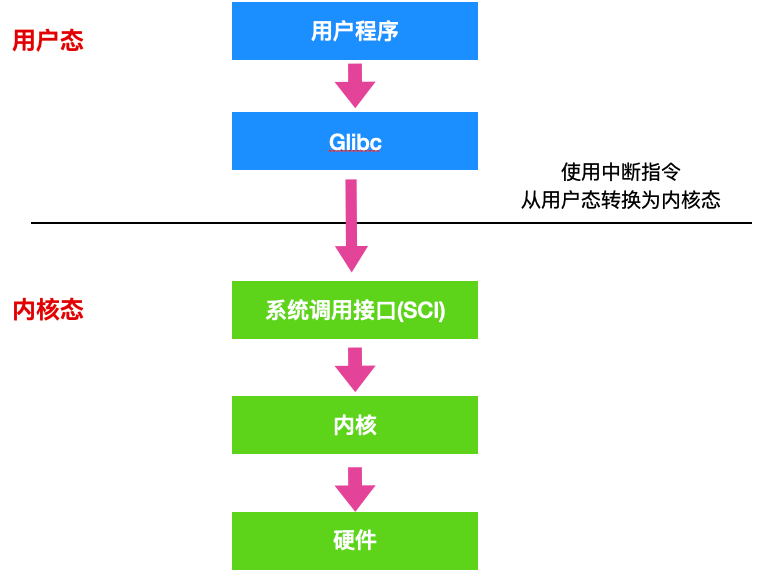

# 操作系统

## 进程、线程

* 调度：**进程**是**资源管理**的基本单位，**线程**是**程序执行**的基本单位。
* 切换：线程**上下文切换**比进程要**快得多**。
* 拥有资源： 进程是**拥有资源的一个独立单位**，线程**不拥有**系统资源，但是**可以访问隶属于进程的资源**。
* 系统开销： 创建或撤销进程时，系统都要为之分配或回收系统资源，如内存空间，I/O设备等，OS所付出的开销显著大于在创建或撤销线程时的开销，**进程切换的开销也远大于线程**切换的开销。

## 协程、线程

* **线程和进程都是同步机制**，而**协程是异步机制**。
* **线程是抢占式**，而**协程是非抢占式**的。需要用户释放使用权切换到其他协程，因此同一时间其实只有一个协程拥有运行权，相当于单线程的能力。
* **一个进程和线程可以有多个协程**。
* 协程**不被操作系统内核管理**，而**完全是由程序控制**。线程是被分割的CPU资源，协程是组织好的代码流程，线程是协程的资源。但协程**不会直接使用线程，协程直接利用的是执行器关联任意线程或线程池**。
* **协程能保留上一次调用时的状态**。

## 并发、并行

并发就是在一段时间内，多个任务都会被处理；但在某一时刻，只有一个任务在执行。单核处理器可以做到并发。比如有两个进程`A`和`B`，`A`运行一个时间片之后，切换到`B`，`B`运行一个时间片之后又切换到`A`。因为切换速度足够快，所以宏观上表现为在一段时间内能同时运行多个程序。

并行就是在同一时刻，有多个任务在执行。这个需要多核处理器才能完成，在微观上就能同时执行多条指令，不同的程序被放到不同的处理器上运行，这个是物理上的多个进程同时进行。

## 进程与线程的切换流程

**进程切换**分两步：

1、切换**页表**以使用**新的地址空间**，一旦去切换上下文，处理器中所有**已经缓存的内存地址一瞬间都作废**了。

2、切换**内核栈**和**硬件上下文**。

**线程只**切换**内核栈**和**硬件上下文**。

对于linux来说，**线程和进程的最大区别就在于地址空间**。

因为每个进程都有自己的虚拟地址空间，而线程是共享所在进程的虚拟地址空间的，因此同一个进程中的线程进行线程切换时不涉及虚拟地址空间的转换。

## 为什么虚拟地址空间切换会比较耗时

进程都有自己的虚拟地址空间，把**虚拟地址转换为物理地址需要查找页表**，页表查找是一个**很慢的过程**，因此**通常使用Cache来缓存常用的地址映射**，这样可以**加速页表查找**，这个Cache就是TLB（translation Lookaside Buffer，TLB本质上就是一个Cache，是用来加速页表查找的）。

由于每个进程都有自己的虚拟地址空间，那么显然**每个进程都有自己的页表**，那么**当进程切换后页表也要进行切换，页表切换后TLB就失效了**，Cache失效**导致命中率降低**，那么**虚拟地址转换为物理地址就会变慢**，表现出来的就是程序运行会变慢，而**线程切换则不会导致TLB失效**，因为**线程无需切换地址空间**，因此我们通常说**线程切换要比较进程切换块**，原因就在这里。

## 进程通信

- **管道**：**半双工通信**，数据只能**单向流动**；**只能在**亲缘关系的**父子进程间使用**。

  - **匿名管道**是单向的，只能在有亲缘关系的进程间通信；

  - **命名管道**以**磁盘文件**的方式存在，可以实现**本机任意两个进程通信**。
  - **优缺点**：速度慢，容量有限；

- **信号** ： 信号是一种**比较复杂**的通信方式，信号**可以在任何时候发给某一进程**，而无需知道该进程的状态。

  >  **Linux系统中常用信号**：
  >  （1）**SIGHUP**：用户从终端注销，所有已启动进程都将收到该进程。系统缺省状态下对该信号的处理是终止进程。
  >
  >  （2）**SIGINT**：程序终止信号。程序运行过程中，按`Ctrl+C`键将产生该信号。
  >
  >  （3）**SIGQUIT**：程序退出信号。程序运行过程中，按`Ctrl+\\`键将产生该信号。
  >
  >  （4）**SIGBUS和SIGSEGV**：进程访问非法地址。
  >
  >  （5）**SIGFPE**：运算中出现致命错误，如除零操作、数据溢出等。
  >
  >  （6）**SIGKILL**：用户终止进程执行信号。shell下执行`kill -9`发送该信号。
  >
  >  （7）**SIGTERM**：结束进程信号。shell下执行`kill 进程pid`发送该信号。
  >
  >  （8）**SIGALRM**：定时器信号。
  >
  >  （9）**SIGCLD**：子进程退出信号。如果其父进程没有忽略该信号也没有处理该信号，则子进程退出后将形成僵尸进程。

  优缺点：任何进程间都能通讯，但速度慢；

- **信号量**：信号量是一个**计数器**，常作为一种**锁机制**，**防止某进程正在访问共享资源时，其他进程也访问该资源**。

  优缺点：不能传递复杂消息，只能用来同步；

- **消息队列**：消息队列是消息的链接表，包括**Posix消息队列**和**System V消息队列**。有足够权限的进程可以向队列中添加消息，被赋予读权限的进程则可以读走队列中的消息。消息队列**克服了信号承载信息量少**，**管道只能承载无格式字节流以及缓冲区大小受限**等缺点。

  优缺点：容量受到系统限制，且要注意**第一次读**的时候，**要考虑上一次没有读完数据的问题**；

- **共享内存**：共享内存就是**映射一段能被其他进程所访问的内存**，这段共享内存由一个进程创建，但多个进程都可以访问。**共享内存是最快的 IPC 方式**，它是针对其他进程间通信方式运行效率低而专门设计的。它**往往与其他通信机制**，如**信号量**，**配合使用**，来实现进程间的同步和通信。

  优缺点：能够**很容易控制容量，速度快**，但要保持同步，比如一个进程在写的时候，另一个进程要**注意读写的问题，相当于线程中的线程安全**。

- **Socket**：可用于**不同机器间**的进程通信。

## 进程同步

**1、临界区**：通过**对多线程的串行化来访问公共资源或一段代码，速度快**，适合控制数据访问。

**优点**：保证在某一时刻只有一个线程能访问数据的**简便**办法。

**缺点**：虽然临界区同步速度很快，但却**只能同步本进程内的线程**，而不可用来同步多个进程中的线程。

**2、互斥量**：为协调共同对一个共享资源的单独访问而设计的。互斥量跟临界区很相似，比临界区复杂，**互斥对象只有一个，只有拥有互斥对象的线程才具有访问资源的权限**。

**优点**：**可以在不同应用程序的线程之间**实现对资源的安全共享。**有点类似分布式锁**

**缺点**：

* 互斥量是可以命名的，也就是说它可以跨越进程使用，所以**创建互斥量需要的资源更多**，所以**如果只为了在进程内部用的话**使用**临界区会带来速度上的优势并能够减少资源占用量**。

* 通过互斥量可以指定资源被独占的方式使用，但如果有下面一种情况通过互斥量就无法处理，比如现在一位用户购买了一份三个并发访问许可的数据库系统，可以根据用户购买的访问许可数量来决定有多少个线程/进程能同时进行数据库操作，这时候如果利用互斥量就没有办法完成这个要求，信号量对象可以说是一种资源计数器。

**3、信号量**：为控制一个具有有限数量用户资源而设计。它**允许多个线程在同一时刻访问同一资源**，但是**需要限制在同一时刻访问此资源的最大线程数目**。**互斥量是信号量的一种特殊情况**，当**信号量的最大资源数=1就是互斥量**了。

优点：适用于对**Socket（套接字）程序中线程的同步**。

缺点:

* 信号量机制**必须有公共内存，不能用于分布式操作系统**，这是它**最大的弱点**；

* 信号量机制功能强大，但**使用时对信号量的操作分散， 而且难以控制，读写和维护都很困难**，加重了程序员的**编码负担**；

* **核心操作P-V分散在各用户程序的代码中，不易控制和管理**，一旦错误，后果严重，且不易发现和纠正。

**4、事件**： 用来**通知线程有一些事件已发生**，从而**启动后继任务的开始**。

优点：**事件对象**通过**通知操作**的方式来保持线程的同步，并且**可以实现不同进程中的线程同步操作**。

## 线程同步

**1、临界区**：类似于**加锁，串行化访问**。当多个线程访问一个独占性共享资源时，可以使用临界区对象。拥有临界区的线程可以访问被保护起来的资源或代码段，其他线程若想访问，则被挂起，直到拥有临界区的线程放弃临界区为止，以此达到用原子方式操作共享资源的目的。临界区限制**只能同一进程的各个线程之间使用**，但是更**节省资源，更有效率**。

**2、事件**：**事件机制**，则允许一个线程在处理完一个任务后，**主动唤醒另外一个线程执行任务**。**允许在进程间使用**

**3、互斥量**：互斥对象和临界区对象非常相似，但**允许在进程间使用**

**4、信号量**：当需要一个**计数器来限制可以使用某共享资源的线程数目**时，可以使用“信号量”对象。**允许在进程间使用**

## 线程分类

**从线程的运行空间来说**，分为用户级线程（user-level thread, ULT）和内核级线程（kernel-level, KLT）

**内核级线程**：这类线程**依赖于内核**，又称为**内核支持的线程或轻量级进程**。无论是在用户程序中的线程还是系统进程中的线程，它们的**创建、撤销和切换都由内核实现**。比如**R7-7840是8核16线程**，这里的线程就是**内核级线程**

**用户级线程**：它仅存在于用户级中，这种线程是**不依赖于操作系统核心**的。应用进程利用**线程库来完成其创建和管理**，速度比较快，**操作系统内核无法感知用户级线程的存在**。

##  临界区，如何解决冲突

每个进程中访问临界资源的那段程序称为临界区，**一次仅允许一个进程使用的资源称为临界资源。**类似于**加锁，串行化访问**。

解决冲突的办法：

- 如果有若干进程要求进入空闲的临界区，**一次仅允许一个进程进入**；
- 进入临界区的进程要在**有限时间内退出**。
- 如果进程**不能进入自己的临界区**，则应**让出CPU**，避免进程出现“忙等”现象。

## 死锁

**什么是死锁**：

在两个或者**多个并发进程**中，如果**每个进程持有某种资源而又等待其它进程释放它或它们现在保持着的资源**，在未改变这种状态之前都不能向前推进，称这一组进程产生了死锁。通俗的讲就是**两个或多个进程无限期的阻塞、相互等待**的一种状态。

**死锁产生的四个必要条件**：（有一个条件不成立，则不会产生死锁）

- 互斥条件：一个资源一次只能被一个进程使用
- 请求与保持条件：一个进程因请求资源而阻塞时，对已获得资源保持不放
- 不剥夺条件：进程获得的资源，在未完全使用完之前，不能强行剥夺
- 循环等待条件：若干进程之间形成一种头尾相接的环形等待资源关系

### **如何处理死锁问题**

常用的处理死锁的方法有：死锁预防、死锁避免、死锁检测、死锁解除、鸵鸟策略。

**（1）死锁的预防：**基本思想就是确保死锁发生的四个必要条件中至少有一个不成立：

- ① 破除资源互斥条件
- ② 破除“请求与保持”条件：实行资源预分配策略，进程在运行之前，必须一次性获取所有的资源。缺点：在很多情况下，无法预知进程执行前所需的全部资源，因为进程是动态执行的，同时也会降低资源利用率，导致降低了进程的并发性。
- ③ 破除“不可剥夺”条件：允许进程强行从占有者那里夺取某些资源。当一个已经保持了某些不可被抢占资源的进程，提出新的资源请求而不能得到满足时，它必须释放已经保持的所有资源，待以后需要时再重新申请。这意味着进程已经占有的资源会被暂时被释放，或者说被抢占了。
- ④ 破除“循环等待”条件：实行资源有序分配策略，对所有资源排序编号，按照顺序获取资源，将紧缺的，稀少的采用较大的编号，在申请资源时必须按照编号的顺序进行，一个进程只有获得较小编号的进程才能申请较大编号的进程。

**（2）死锁避免：**

死锁预防通过约束资源请求，防止4个必要条件中至少一个的发生，可以通过直接或间接预防方法，但是都会导致低效的资源使用和低效的进程执行。而死锁避免则允许前三个必要条件，但是通过动态地检测资源分配状态，以确保循环等待条件不成立，从而确保系统处于安全状态。所谓安全状态是指：如果系统能**按某个顺序为每个进程分配资源**（不超过其最大值），那么系统状态是安全的，换句话说就是，如果**存在一个安全序列**，那么系统处于安全状态。**银行家算法**是经典的死锁避免的算法。

**（3）死锁检测：**

死锁预防策略是非常保守的，他们通过限制访问资源和在进程上强加约束来解决死锁的问题。死锁检测则是完全相反，它不限制资源访问或约束进程行为，只要有可能，被请求的资源就被授权给进程。但是操作系统会周期性地执行一个算法检测前面的循环等待的条件。**死锁检测算法是通过资源分配图来检测是否存在环来实现，从一个节点出发进行深度优先搜索，对访问过的节点进行标记，如果访问了已经标记的节点，就表示有存在环**，也就是检测到死锁的发生。

- 如果进程-资源分配图中**无环路**，此时系统**没有死锁**。 
- 如果**有环路**，且每个资源类中**只有一个资源**，则系统**发生死锁**。 
- 如果**有环路**，且所涉及的资源类**有多个资源**，则**不一定**会发生死锁。

**（4）死锁解除：**

死锁解除的常用方法就是**终止进程**和**资源抢占**，回滚。

- **进程终止**就是简单地**终止一个或多个进程以打破循环等待**，包括两种方式：终止所有死锁进程和一次只终止一个进程直到取消死锁循环为止；

- **资源抢占**就是从一个或者多个死锁进程那里抢占一个或多个资源。

**（5）鸵鸟策略：**

**把头埋在沙子里，假装根本没发生问题**。因为解决死锁问题的代价很高，因此鸵鸟策略这种不采取任何措施的方案会获得更高的性能。当发生死锁时不会对用户造成多大影响，或发生死锁的概率很低，可以采用鸵鸟策略。大多数操作系统，包括 **Unix，Linux** 和 **Windows**，处理死锁问题的办法仅仅是**忽略**它。

## 进程调度策略

* **先来先服务**：非抢占式的调度算法，按照请求的顺序进行调度。有利于长作业，但不利于短作业，因为短作业必须一直等待前面的长作业执行完毕才能执行，而长作业又需要执行很长时间，造成了短作业等待时间过长。另外，对`I/O`密集型进程也不利，因为这种进程每次进行`I/O`操作之后又得重新排队。

* **短作业优先**：非抢占式的调度算法，按估计运行时间最短的顺序进行调度。长作业有可能会饿死，处于一直等待短作业执行完毕的状态。因为如果一直有短作业到来，那么长作业永远得不到调度。

* **最短剩余时间优先**：最短作业优先的抢占式版本，按剩余运行时间的顺序进行调度。 当一个新的作业到达时，其整个运行时间与当前进程的剩余时间作比较。如果新的进程需要的时间更少，则挂起当前进程，运行新的进程。否则新的进程等待。

* **时间片轮转**：将所有就绪进程按 `FCFS` 的原则排成一个队列，每次调度时，把 `CPU` 时间分配给队首进程，该进程可以执行一个时间片。当时间片用完时，由计时器发出时钟中断，调度程序便停止该进程的执行，并将它送往就绪队列的末尾，同时继续把 `CPU` 时间分配给队首的进程。

  时间片轮转算法的效率和时间片的大小有很大关系：因为进程切换都要保存进程的信息并且载入新进程的信息，如果时间片太小，会导致进程切换得太频繁，在进程切换上就会花过多时间。 而如果时间片过长，那么实时性就不能得到保证。 

* **优先级调度**：为每个进程分配一个优先级，按优先级进行调度。为了防止低优先级的进程永远等不到调度，可以随着时间的推移增加等待进程的优先级。

## 进程状态

进程一共有`5`种状态，分别是创建、就绪、运行（执行）、终止、阻塞。 

- **运行状态**就是进程正在`CPU`上运行。在单处理机环境下，每一时刻最多只有一个进程处于运行状态。 
- **就绪状态**就是说进程已处于准备运行的状态，即进程获得了除`CPU`之外的一切所需资源，一旦得到`CPU`即可运行。 
- **阻塞状态**就是进程正在等待某一事件而暂停运行，比如等待某资源为可用或等待`I/O`完成。即使`CPU`空闲，该进程也不能运行。 

**运行态→阻塞态**：往往是由于等待外设，等待主存等资源分配或等待人工干预而引起的。
**阻塞态→就绪态**：则是等待的条件已满足，只需分配到处理器后就能运行。
**运行态→就绪态**：由外界原因使运行状态的进程让出处理器，例如**时间片用完**，或有**更高优先级的进程来抢占处理器**等。
**就绪态→运行态**：系统按某种策略选中就绪队列中的一个进程占用处理器，此时就变成了运行态。

## 分页

把内存空间划分为**大小相等且固定的块**，作为主存的基本单位。因为程序数据存储在不同的页面中，而页面又离散的分布在内存中，**因此需要一个页表来记录映射关系，以实现从页号到物理块号的映射。**

访问分页系统中内存数据需要**两次的内存访问** (一次是从内存中访问页表，从中找到指定的物理块号，加上页内偏移得到实际物理地址；第二次就是根据第一次得到的物理地址访问内存取出数据)。

## 分段

**分页是为了提高内存利用率，而分段是为了满足程序员在编写代码的时候的一些逻辑需求(比如数据共享，数据保护，动态链接等)。**

分段内存管理当中，**地址是二维的，一维是段号，二维是段内地址；其中每个段的长度是不一样的，而且每个段内部都是从0开始编址的**。由于分段管理中，每个段内部是连续内存分配，但是段和段之间是离散分配的，因此也存在一个**逻辑地址到物理地址的映射关系**，相应的就是**段表机制**。

## 分页和分段

- **分页对程序员是透明的**，但是**分段需要程序员显式划分**每个段。 
- 分页的地址空间是**一维地址空间**，分段是**二维的**。 
- 页的**大小不可变**，段的大小可以**动态改变**。 
- **分页主要用于实现虚拟内存**，从而获得更大的地址空间；分段主要是为了使程序和数据可以被划分为逻辑上独立的地址空间并且**有助于共享和保护**。

## 虚拟内存/交换空间

操作系统把物理内存(physical RAM)分成一块一块的小内存，每一块内存被称为**页(page)**。当内存资源不足时，**Linux把某些页的内容转移至硬盘上的一块空间上，以释放内存空间**。硬盘上的那块空间叫做**交换空间**(swap space),而这一过程被称为交换(swapping)。**物理内存和交换空间的总容量就是虚拟内存的可用容量。**

- 物理内存不足时一些不常用的页可以被交换出去，腾给系统。
- 程序启动时很多内存页被用来初始化，之后便不再需要，可以交换出去。

## 物理地址、逻辑地址、有效地址、线性地址、虚拟地址

**物理地址**就是内存中**真正的地址**，它就相当于是你家的门牌号，你家就肯定有这个门牌号，具有唯一性。**不管哪种地址，最终都会映射为物理地址**。

在`实模式`下，段基址 + 段内偏移经过地址加法器的处理，经过地址总线传输，最终也会转换为**物理地址**。

但是在`保护模式`下，段基址 + 段内偏移被称为**线性地址**，不过此时的段基址不能称为真正的地址，而是会被称作为一个`选择子`的东西，选择子就是个索引，相当于数组的下标，通过这个索引能够在 GDT 中找到相应的段描述符，段描述符记录了**段的起始、段的大小**等信息，这样便得到了基地址。如果此时没有开启内存分页功能，那么这个线性地址可以直接当做物理地址来使用，直接访问内存。如果开启了分页功能，那么这个线性地址又多了一个名字，这个名字就是**虚拟地址**。

不论在实模式还是保护模式下，段内偏移地址都叫做**有效地址**。有效抵制也是逻辑地址。

线性地址可以看作是**虚拟地址**，虚拟地址不是真正的物理地址，但是虚拟地址会最终被映射为物理地址。下面是虚拟地址 -> 物理地址的映射。

## 页面替换算法

在程序运行过程中，如果要访问的页面**不在内存中**，就发生**缺页中断从而将该页调入内存中**。此时如果内存**已无空闲空间**，系统必须从内存中**调出一个页面到磁盘对换区**中来腾出空间。

- `最优算法`在当前页面中置换最后要访问的页面。不幸的是，没有办法来判定哪个页面是最后一个要访问的，`因此实际上该算法不能使用`。然而，它可以作为衡量其他算法的标准。
- `NRU` 算法根据 R 位和 M 位的状态将页面分为四类。从编号最小的类别中随机选择一个页面。NRU 算法易于实现，但是性能不是很好。存在更好的算法。
- `FIFO` 会跟踪页面加载进入内存中的顺序，并把页面放入一个链表中。有可能删除存在时间最长但是还在使用的页面，因此这个算法也不是一个很好的选择。
- `第二次机会`算法是对 FIFO 的一个修改，它会在删除页面之前检查这个页面是否仍在使用。如果页面正在使用，就会进行保留。这个改进大大提高了性能。
- `时钟` 算法是第二次机会算法的另外一种实现形式，时钟算法和第二次算法的性能差不多，但是会花费更少的时间来执行算法。
- `LRU` 算法是一个非常优秀的算法，但是没有`特殊的硬件(TLB)`很难实现。如果没有硬件，就不能使用 LRU 算法。
- `NFU` 算法是一种近似于 LRU 的算法，它的性能不是非常好。
- `老化` 算法是一种更接近 LRU 算法的实现，并且可以更好的实现，因此是一个很好的选择
- 最后两种算法都使用了工作集算法。工作集算法提供了合理的性能开销，但是它的实现比较复杂。`WSClock` 是另外一种变体，它不仅能够提供良好的性能，而且可以高效地实现。

**最好的算法是老化算法和WSClock算法**。他们分别是基于 LRU 和工作集算法。他们都具有良好的性能并且能够被有效的实现。还存在其他一些好的算法，但实际上这两个可能是最重要的。

## 缓冲区溢出？危害？

是指当计算机**向缓冲区填充数据时超出了缓冲区本身的容量，溢出的数据覆盖在合法数据上**。

危害有以下两点：

- 程序崩溃，导致拒绝服务
- 跳转并且执行一段恶意代码

造成的**主要原因**是**程序中没有仔细检查用户输入**。

## 虚拟内存

虚拟内存就是说，让物理内存扩充成更大的逻辑内存，从而让程序获得更多的可用内存。虚拟内存使用部分加载的技术，让一个进程或者资源的某些页面加载进内存，从而能够加载更多的进程，甚至能加载比内存大的进程，这样看起来好像内存变大了，这部分内存其实包含了磁盘或者硬盘，并且就叫做虚拟内存。

## 虚拟内存的实现方式

虚拟内存中，允许将一个作业分多次调入内存。釆用连续分配方式时，会使相当一部分内存空间都处于暂时或`永久`的空闲状态，造成内存资源的严重浪费，而且也无法从逻辑上扩大内存容量。因此，**虚拟内存需要建立在离散分配的内存管理方式的基础上**。虚拟内存的实现有以下三种方式：

- **请求分页**存储管理。
- **请求分段**存储管理。
- **请求段页式**存储管理。

## IO多路复用

**IO多路复用是指内核一旦发现进程指定的一个或者多个IO条件准备读取，它就通知该进程。IO多路复用适用如下场合**：

- 当客户处理多个描述字时（一般是交互式输入和网络套接口），必须使用I/O复用。
- 当一个客户同时处理多个套接口时，而这种情况是可能的，但很少出现。
- 如果一个TCP服务器既要处理监听套接口，又要处理已连接套接口，一般也要用到I/O复用。
- 如果一个服务器即要处理TCP，又要处理UDP，一般要使用I/O复用。
- 如果一个服务器要处理多个服务或多个协议，一般要使用I/O复用。
- 与多进程和多线程技术相比，I/O多路复用技术的最大优势是系统开销小，系统不必创建进程/线程，也不必维护这些进程/线程，从而大大减小了系统的开销。

## 硬链接和软链接

- **硬链接**就是在**目录下创建一个条目，记录着文件名与 `inode` 编号**，这个 `inode` 就是源文件的 `inode`。删除任意一个条目，文件还是存在，只要引用数量不为 `0`。但是硬链接有限制，它**不能跨越文件系统**，也**不能对目录进行链接**。
- **符号链接文件**保存着**源文件所在的绝对路径**，在读取时会定位到源文件上，可以理解为 `Windows` 的**快捷方式**。当源文件被删除了，链接文件就打不开了。因为记录的是路径，所以可以为目录建立符号链接。

## 中断的处理过程

1. 保护现场：将当前执行程序的相关数据保存在寄存器中，然后入栈。
2. 开中断：以便执行中断时能响应较高级别的中断请求。
3. 中断处理
4. 关中断：保证恢复现场时不被新中断打扰
5. 恢复现场：从堆栈中按序取出程序数据，恢复中断前的执行状态。

## 中断和轮询

* 轮询：CPU对**特定设备**轮流询问。中断：通过**特定事件**提醒CPU。
* 轮询：**效率低等待时间长**，CPU利用率**不高**。中断：**容易遗漏问题**，CPU利用率**不高**。

## 用户态和内核态

用户态和系统态是操作系统的两种运行状态：

- **内核态**：内核态运行的程序可以访问计算机的**任何数据和资源**，不受限制，包括外围设备，比如网卡、硬盘等。**处于内核态的 CPU 可以从一个程序切换到另外一个程序，并且占用 CPU 不会发生抢占情况**。
- **用户态**：用户态运行的程序**只能受限地访问内存**，只能直接读取用户程序的数据，并且**不允许访问外围设备**，用户态下的 CPU **不允许独占**，也就是说 CPU 能够被其他程序获取。

将操作系统的运行状态分为用户态和内核态，主要是为了对访问能力进行限制，防止随意进行一些比较危险的操作导致系统的崩溃，比如**设置时钟、内存清理**，这些都需要在**内核态下完成** 。

**用户态和内核态如何切换的**：

所有的用户进程都是运行在用户态的，但是我们上面也说了，用户程序的访问能力有限，一些比较重要的比如从硬盘读取数据，从键盘获取数据的操作则是内核态才能做的事情，而这些数据却又对用户程序来说非常重要。所以就涉及到两种模式下的转换，即**用户态 -> 内核态 -> 用户态**，而唯一能够做这些操作的只有 `系统调用`，而能够执行系统调用的就只有 `操作系统`。

一般用户态 -> 内核态的转换我们都称之为 trap 进内核，也被称之为 `陷阱指令(trap instruction)`。

他们的工作流程如下：

- 首先用户程序会调用 `glibc` 库，glibc 是一个标准库，同时也是一套核心库，库中定义了很多关键 API。
- glibc 库知道针对不同体系结构调用`系统调用`的正确方法，它会根据体系结构应用程序的二进制接口设置用户进程传递的参数，来准备系统调用。
- 然后，glibc 库调用`软件中断指令(SWI)` ，这个指令通过更新 `CPSR` 寄存器将模式改为超级用户模式，然后跳转到地址 `0x08` 处。
- 到目前为止，整个过程仍处于用户态下，在执行 SWI 指令后，允许进程执行内核代码，MMU 现在允许内核虚拟内存访问
- 从地址 0x08 开始，进程执行加载并跳转到中断处理程序，这个程序就是 ARM 中的 `vector_swi()`。
- 在 vector_swi() 处，从 SWI 指令中提取系统调用号 SCNO，然后使用 SCNO 作为系统调用表 `sys_call_table` 的索引，调转到系统调用函数。
- 执行系统调用完成后，将还原用户模式寄存器，然后再以用户模式执行。

## Unix 常见的IO模型：

对于一次IO访问（以read举例），数据会先被拷贝到操作系统内核的缓冲区中，然后才会从操作系统内核的缓冲区拷贝到应用程序的地址空间。所以说，当一个read操作发生时，它会经历两个阶段：

> - 等待数据准备就绪 (Waiting for the data to be ready)
> - 将数据从内核拷贝到进程中 (Copying the data from the kernel to the process)

正式因为这两个阶段，linux系统产生了下面五种网络模式的方案：

> - 阻塞式IO模型(blocking IO model)
> - 非阻塞式IO模型(noblocking IO model)
> - IO复用式IO模型(IO multiplexing model)
> - 信号驱动式IO模型(signal-driven IO model)
> - 异步IO式IO模型(asynchronous IO model)

对于这几种 IO 模型的详细说明，可以参考这篇文章：https://juejin.cn/post/6942686874301857800#heading-13

其中，IO多路复用模型指的是：使用单个进程同时处理多个网络连接IO，他的原理就是select、poll、epoll 不断轮询所负责的所有 socket，当某个socket有数据到达了，就通知用户进程。该模型的优势并不是对于单个连接能处理得更快，而是在于能处理更多的连接。

## select、poll 和 epoll

（1）**select**：时间复杂度 O(n)

select 仅仅知道有 I/O 事件发生，但并不知道是哪几个流，所以只能无差别轮询所有流，找出能读出数据或者写入数据的流，并对其进行操作。所以 select 具有 O(n) 的无差别轮询复杂度，同时处理的流越多，无差别轮询时间就越长。

（2）**poll**：时间复杂度 O(n)

poll 本质上和 select 没有区别，它将用户传入的数组拷贝到内核空间，然后查询每个 fd 对应的设备状态， 但是它没有最大连接数的限制，原因是它是基于链表来存储的。

（3）**epoll**：时间复杂度 O(1)

epoll 可以理解为 event poll，不同于忙轮询和无差别轮询，epoll 会把哪个流发生了怎样的 I/O 事件通知我们。所以说 epoll 实际上是事件驱动（每个事件关联上 fd）的。

select，poll，epoll **都是 IO 多路复用**的机制。I/O 多路复用就是通过一种机制监视多个描述符，一旦某个描述符就绪（一般是读就绪或者写就绪），就通知程序进行相应的读写操作。但 select，poll，epoll 本质上都是同步 I/O，因为他们都需要在读写事件就绪后自己负责进行读写，也就是说这个读写过程是阻塞的，而异步 I/O 则无需自己负责进行读写，异步 I/O 的实现会负责把数据从内核拷贝到用户空间。

# ==---------------==

## ==硬件结构==

### CPU内存结构

其中L3Cashe是多个CPU**共用**的，L1（包括**数据缓存**和**指令缓存**、64字节），L2是**独有**的。（CPU 并不会直接和每一种存储器设备直接打交道，而是**每一种存储器设备只和它相邻的存储器设备打交道**。）

**CPU Cache数据结构**

CPU Cache 的数据是从内存中读取过来的，它是以一小块一小块读取数据的，称为 **Cache Line（缓存块）**。CPU 访问内存数据时，是一块一块读取的。这一块的数据称为**内存块（Block）**。

对于 CPU Cache 里的数据结构，则是由**索引 + 有效位 + 组标记 + 数据块**组成。

如果内存中的数据已经在 CPU Cache 中了，那 CPU 访问一个内存地址的时候，会经历这 4 个步骤：

1. 根据内存地址中索引信息，计算在 CPU Cache 中的索引，也就是找出对应的 CPU Line 的地址；（**直接映射**方式：通过取模运算）
2. 找到对应 CPU Line 后，判断 CPU Line 中的有效位，确认 CPU Line 中数据是否是有效的，如果是无效的，CPU 就会直接访问内存，并重新加载数据，如果数据有效，则往下执行；
3. 对比内存地址中组标记和 CPU Line 中的组标记，确认 CPU Line 中的数据是我们要访问的内存数据，如果不是的话，CPU 就会直接访问内存，并重新加载数据，如果是的话，则往下执行；
4. 根据内存地址中偏移量信息，从 CPU Line 的数据块中，读取对应的字。

**提升数据缓存的命中率**：

​	遇到这种遍历数组的情况时，**按照内存布局顺序访问**（加载数据到Cache Line次数会变少），将可以有效的利用 CPU Cache 带来的好处。（按行遍历速度高于按列遍历、因为数组是按行存储）

**提升指令缓存的命中率**：

​	**分支预测器**：如果分支预测可以预测到接下来要执行 if 里的指令，还是 else 指令的话，就可以「提前」把这些指令放在指令缓存中，这样 CPU 可以直接从 Cache 读取到指令，于是执行速度就会很快。当数组中的元素是随机的，分支预测就无法有效工作，而当数组元素都是是顺序的，分支预测器会动态地根据历史命中数据对未来进行预测，这样命中率就会很高。

### CPU缓存一致性

两种写入数据方法：

**写直达**

保持内存与 Cache 一致性最简单的方式是，**把数据同时写入内存和 Cache 中**，这种方法称为**写直达（\*Write Through\*）**。

**写回**

在写回机制中，**当发生写操作时，新的数据仅仅被写入 Cache Block 里（标记为脏页），只有当修改过的 Cache Block（脏页）「被替换」时才需要写到内存中**，减少了数据写回内存的频率，这样便可以提高系统的性能。

**MESI协议**（基于总线嗅探机制）

**总线嗅探**：写传播的原则就是当某个 CPU 核心更新了 Cache 中的数据，要把通过总线将该事件广播通知到其他核心。如果其他CPU核心也有该数据则会更新。

MESI协议通过四个不同的状态来标记Cache Line

- *Modified*，已修改
- *Exclusive*，独占
- *Shared*，共享
- *Invalidated*，已失效

「已修改」状态就是我们前面提到的脏标记，代表该 Cache Block 上的数据已经被更新过，但是还没有写到内存里（如果其他核心读取，则把脏页写进内存，并更新状态为「共享」）。而「已失效」状态，表示的是这个 Cache Block 里的数据已经失效了，不可以读取该状态的数据。

「独占」和「共享」状态都代表 Cache Block 里的数据是干净的，也就是说，这个时候 Cache Block 里的数据和内存里面的数据是一致性的。

「独占」和「共享」的差别在于，独占状态的时候，数据只存储在一个 CPU 核心的 Cache 里，而其他 CPU 核心的 Cache 没有该数据。这个时候，如果要向独占的 Cache 写数据，就可以直接自由地写入，而不需要通知其他 CPU 核心，因为只有你这有这个数据，就不存在缓存一致性的问题了，于是就可以随便操作该数据。

另外，在「独占」状态下的数据，如果有其他核心从内存读取了相同的数据到各自的 Cache ，那么这个时候，独占状态下的数据就会变成共享状态。

那么，「共享」状态代表着相同的数据在多个 CPU 核心的 Cache 里都有，所以当我们要更新 Cache 里面的数据的时候，不能直接修改，而是要先向所有的其他 CPU 核心广播一个请求，要求先把其他核心的 Cache 中对应的 Cache Line 标记为「无效」状态，然后再更新当前 Cache 里面的数据。

**伪共享**：多个线程同时读写同一个 Cache Line 的不同变量时，而导致 CPU Cache 失效的现象称为**伪共享（False Sharing）**。对于多个线程共享的热点数据，即经常会修改的数据，应该避免这些数据刚好在同一个 Cache Line 中。（空间换时间）

**中断**

为了避免由于中断处理程序执行时间过长，而影响正常进程的调度，Linux 将中断处理程序分为上半部和下半部：

- 上半部，对应硬中断，由硬件触发中断，用来快速处理中断；
- 下半部，对应软中断，由内核触发中断，用来异步处理上半部未完成的工作；

Linux 中的软中断包括网络收发、定时、调度、RCU 锁等各种类型。

## 操作系统

**操作系统（Operating System，简称 OS）是管理计算机硬件与软件资源的程序**。

**内核**是操作系统的核心部分，**是应用连接硬件设备的桥梁**。

现代操作系统，内核一般会提供 4 个基本能力：

- 管理进程、线程，决定哪个进程、线程使用 CPU，也就是进程调度的能力；
- 管理内存，决定内存的分配和回收，也就是内存管理的能力；
- 管理硬件设备，为进程与硬件设备之间提供通信能力，也就是硬件通信能力；
- 提供系统调用，如果应用程序要运行更高权限运行的服务，那么就需要有系统调用，它是用户程序与操作系统之间的接口。

操作系统，把内存分成了两个区域：

- **内核空间**，这个内存空间只有内核程序可以访问；
- **用户空间**，这个内存空间专门给应用程序使用；

用户空间的代码只能访问一个局部的内存空间，而内核空间的代码可以访问所有内存空间。因此，当程序使用用户空间时，我们常说该程序在**用户态**执行，而当程序使内核空间时，程序则在**内核态**执行。用户程序中，凡是与**系统态级别的资源**有关的操作（如文件管理、进程控制、内存管理等)，都必须通过**系统调用**（通过**中断**）方式向操作系统提出服务请求，并由操作系统代为完成。

## 内存管理

### 虚拟地址

- 我们程序所使用的内存地址叫做**虚拟内存地址**（*Virtual Memory Address*）（分为用户空间和内核空间（**每个虚拟内存中的内核地址，其实关联的都是相同的物理内存**））

- 实际存在硬件里面的空间地址叫**物理内存地址**（*Physical Memory Address*）

进程持有的虚拟地址会通过 CPU 芯片中的**内存管理单元**（MMU）的映射关系，来转换变成物理地址，然后再通过物理地址访问内存。

使用虚拟地址的好处：

1.虚拟内存让**每个进程有独立的地址空间**：不同的进程无法访问别的进程的地址。
2.VA到PA的映射会给分配和释放内存带来方便：**物理内存不连续的地址，可映射到连续的虚拟内存地址**。

### 内存管理机制

**内存分段**

程序是由若干个逻辑分段组成的，如可由代码分段、数据分段、栈段、堆段组成。**不同的段是有不同的属性的，所以就用分段（Segmentation）的形式把这些段分离出来。**

分段机制下的虚拟地址由两部分组成，**段选择因子**和**段内偏移量**。

- **段选择子**就保存在段寄存器里面。段选择因子里面最重要的是**段号**，用作段表的索引。**段表**里面保存的是这个**段的基地址、段的界限和特权等级**等。
- 虚拟地址中的**段内偏移量**应该位于 0 和段界限之间，如果段内偏移量是合法的，就将段基地址加上段内偏移量得到物理内存地址。

**内存分段的问题：**

- 第一个就是**内存碎片**的问题。（应用程序在物理内存中是连续存储的）
- 第二个就是**内存交换的效率低**的问题。（每一次内存交换（为了置换出连续的物理空间），我们都需要把一大段连续的内存数据写到硬盘上。）

**内存分页**

**分页是把整个虚拟和物理内存空间切成一段段固定尺寸的大小**。这样一个连续并且尺寸固定的内存空间，我们叫**页**（*Page*）。虚拟地址与物理地址之间通过**页表**来映射。

页表是存储在内存里的，**内存管理单元** （*MMU*）就做将虚拟内存地址转换成物理地址的工作。

而当进程访问的虚拟地址在页表中查不到时，系统会产生一个**缺页中断**，进入系统内核空间分配物理内存、更新进程页表，最后再返回用户空间，恢复进程的运行。（**只有在程序运行中，需要用到对应虚拟内存页里面的指令和数据时，再加载到物理内存里面去。**并不需要把所有程序加载到物理内存中）

虚拟地址分为两部分，**页号**和**页内偏移**。页号作为页表的索引，**页表**包含物理页每页所在**物理内存的基地址**。

**内存分页的问题**：

页表需要的存储空间太大。

解决方案：

**多级页表**

如果使用了二级分页，一级页表就可以覆盖整个 4GB 虚拟地址空间，但**如果某个一级页表的页表项没有被用到，也就不需要创建这个页表项对应的二级页表了，即可以在需要时才创建二级页表**。

**TLB**（快表）

把最常访问的几个页表项存储到访问速度更快的硬件。有了 TLB 后，那么 CPU 在寻址时，会先查 TLB，如果没找到，才会继续查常规的页表。

**段页式内存管理**（Linux采用的方式）

段页式内存管理实现的方式：

- 先将程序划分为多个有逻辑意义的段，也就是前面提到的分段机制；
- 接着再把每个段划分为多个页，也就是对分段划分出来的连续空间，再划分固定大小的页；

这样，地址结构就由**段号、段内页号和页内位移**三部分组成。

**段页式地址变换**中要得到物理地址须经过三次内存访问：

- 第一次访问段表，得到页表起始地址；
- 第二次访问页表，得到物理页号；
- 第三次将物理页号与页内位移组合，得到物理地址。

### 内存页面置换算法

- **OPT 页面置换算法（最佳页面置换算法）** ：最佳(Optimal, OPT)置换算法所选择的被淘汰页面将是以后永不使用的，或者是在最长时间内不再被访问的页面,这样可以保证获得最低的缺页率。（一般作为衡量其他置换算法的方法。）
- **FIFO（First In First Out） 页面置换算法（先进先出页面置换算法）** : 总是淘汰最先进入内存的页面，即选择在内存中驻留时间最久的页面进行淘汰。
- **LRU （Least Recently Used）页面置换算法（最近最久未使用页面置换算法）** ：LRU 算法赋予每个页面一个访问字段，用来记录一个页面自上次被访问以来所经历的时间 T，当须淘汰一个页面时，选择现有页面中其 T 值最大的，即最近最久未使用的页面予以淘汰。
- **LFU （Least Frequently Used）页面置换算法（最少使用页面置换算法）** : 该置换算法选择在之前时期使用最少的页面作为淘汰页。

## 网络系统

### I/O多路复用

三种I/O多路复用的API：

**select/poll**

select 实现多路复用的方式是，将已连接的 Socket 都放到一个**文件描述符集合**，然后调用 select 函数将文件描述符集合**拷贝**到内核里，让内核来检查是否有网络事件产生，检查的方式很粗暴，就是通过**遍历**文件描述符集合的方式，当检查到有事件产生后，将此 Socket 标记为可读或可写， 接着再把整个文件描述符集合**拷贝**回用户态里，然后用户态还需要再通过**遍历**的方法找到可读或可写的 Socket，然后再对其处理。

select 使用固定长度的 BitsMap，表示文件描述符集合，而且所支持的文件描述符的个数是有限制的， 默认最大值为 `1024`，只能监听 0~1023 的文件描述符。

poll 不再用 BitsMap 来存储所关注的文件描述符，取而代之用动态数组，以链表形式来组织。

但是 poll 和 select 并没有太大的本质区别，**都是使用「线性结构」存储进程关注的 Socket 集合，因此都需要遍历文件描述符集合来找到可读或可写的 Socket，时间复杂度为 O(n)，而且也需要在用户态与内核态之间拷贝文件描述符集合**。

**epoll**

*第一点*，epoll 在内核里使用**红黑树来跟踪进程所有待检测的文件描述字**，把需要监控的 socket 通过 `epoll_ctl()` 函数加入内核中的红黑树里，所以只需要传入一个待检测的 socket，减少了内核和用户空间大量的数据拷贝和内存分配。

*第二点*， epoll 使用**事件驱动**的机制，内核里**维护了一个链表来记录就绪事件**，当某个 socket 有事件发生时，通过**回调函数**内核会将其加入到这个就绪事件列表中，当用户调用 `epoll_wait()` 函数时，只会返回有事件发生的文件描述符的个数，不需要像 select/poll 那样轮询扫描整个 socket 集合，大大提高了检测的效率。

epoll 支持两种事件触发模式，分别是**边缘触发（edge-triggered，ET）和水平触发（level-triggered，LT）**。

这两个术语还挺抽象的，其实它们的区别还是很好理解的。

- 使用边缘触发模式时，当被监控的 Socket 描述符上有可读事件发生时，**服务器端只会从 epoll_wait 中苏醒一次**，即使进程没有调用 read 函数从内核读取数据，也依然只苏醒一次，因此我们程序要保证一次性将内核缓冲区的数据读取完；
- 使用水平触发模式时，当被监控的 Socket 上有可读事件发生时，**服务器端不断地从 epoll_wait 中苏醒，直到内核缓冲区数据被 read 函数读完才结束**，目的是告诉我们有数据需要读取；

### 对I/O多路复用的封装

#### Reactor

**单Reactor单进程/线程：**（java实现的就是单Reactor单线程、Redis6.0之前使用的是单Reactor单进程）

对象里的 select、accept、read、send 是系统调用函数，dispatch 和 「业务处理」是需要完成的操作，其中 dispatch 是分发事件操作。

- Reactor 对象通过 select （IO 多路复用接口） **监听事件**，收到事件后通过 dispatch 进行分发，具体分发给 Acceptor 对象还是 Handler 对象，还要看收到的事件类型；
- 如果是连接建立的事件，则交由 Acceptor 对象进行处理，Acceptor 对象会通过 accept 方法 获取连接，并创建一个 Handler 对象来处理后续的响应事件；
- 如果不是连接建立事件， 则交由当前连接对应的 Handler 对象来进行响应；
- Handler 对象通过 read -> 业务处理 -> send 的流程来完成完整的业务流程。

**单Reactor多线程、多进程**：

- Reactor 对象通过 select （IO 多路复用接口） 监听事件，收到事件后通过 dispatch 进行分发，具体分发给 Acceptor 对象还是 Handler 对象，还要看收到的事件类型；
- 如果是连接建立的事件，则交由 Acceptor 对象进行处理，Acceptor 对象会通过 accept 方法 获取连接，并创建一个 Handler 对象来处理后续的响应事件；
- 如果不是连接建立事件， 则交由当前连接对应的 Handler 对象来进行响应；

上面的三个步骤和单 Reactor 单线程方案是一样的，接下来的步骤就开始不一样了：

- Handler 对象不再负责业务处理，只负责数据的接收和发送，Handler 对象通过 read 读取到数据后，会将数据发给子线程里的 Processor 对象进行业务处理；
- 子线程里的 Processor 对象就进行业务处理，处理完后，将结果发给主线程中的 Handler 对象，接着由 Handler 通过 send 方法将响应结果发送给 client；

**多Reactor多进程/多线程：**（Netty采用多Reactor多线程）

- 主线程中的 MainReactor 对象通过 select 监控连接建立事件，收到事件后通过 Acceptor 对象中的 accept 获取连接，将新的连接分配给**某个子线程**；
- 子线程中的 SubReactor 对象将 MainReactor 对象分配的连接加入 select 继续进行监听，并创建一个 Handler 用于处理连接的响应事件。
- 如果有新的事件发生时，SubReactor 对象会调用当前连接对应的 Handler 对象来进行响应。
- Handler 对象通过 read -> 业务处理 -> send 的流程来完成完整的业务流程。

多 Reactor 多线程的方案虽然看起来复杂的，但是实际实现时比单 Reactor 多线程的方案要简单的多，原因如下：

- 主线程和子线程分工明确，主线程只负责接收新连接，子线程负责完成后续的业务处理。
- 主线程和子线程的交互很简单，**主线程只需要把新连接传给子线程，子线程无须返回数据，直接就可以在子线程将处理结果发送给客户端。**

#### Proactor：异步网络模式

- Proactor Initiator 负责创建 Proactor 和 Handler 对象，并将 Proactor 和 Handler 都通过 Asynchronous Operation Processor 注册到内核；
- Asynchronous Operation Processor 负责处理注册请求，并处理 I/O 操作；
- Asynchronous Operation Processor 完成 I/O 操作后通知 Proactor；
- Proactor 根据不同的事件类型回调不同的 Handler 进行业务处理；
- Handler 完成业务处理；

### 一致性哈希算法

解决负载均衡问题。

一致性哈希要进行两步哈希：

- 第一步：对存储节点进行哈希计算，也就是对存储节点做哈希映射，比如根据节点的 IP 地址进行哈希；
- 第二步：当对数据进行存储或访问时，对数据进行哈希映射；

**一致性哈希是指将「存储节点」和「数据」都映射到一个首尾相连的哈希环上**。数据映射的结果值往**顺时针的方向的找到第一个节点**，就是存储该数据的节点。

**解决节点分布不均匀的问题：**

为了解决一致性哈希算法不能够均匀的分布节点的问题，就需要引入虚拟节点，对一个真实节点做多个副本。不再将真实节点映射到哈希环上，而是将虚拟节点映射到哈希环上，并将虚拟节点映射到实际节点，

## Linux常见命令

**目录切换命令**

- **`cd usr`：** 切换到该目录下 usr 目录
- **`cd ..（或cd../）`：** 切换到上一层目录
- **`cd /`：** 切换到系统根目录
- **`cd ~`：** 切换到用户主目录
- **`cd -`：** 切换到上一个操作所在目录

**目录的操作命令**

- **`mkdir 目录名称`：** 增加目录。

- **`ls/ll`**（）：查看目录信息。
- **`mv 目录名称 目录的新位置`：** 移动目录的位置---剪切（改）。
- **`cp -r 目录名称 目录拷贝的目标位置`：** 拷贝目录（改）。
- **`rm [-rf] 目录` :** 删除目录（删）。

**文件的操作命令**

- **`touch 文件名称`:** 文件的创建（增）。
- **`cat/more/less/tail 文件名称`** ：文件的查看（查） 。
- **`vim 文件`：** 修改文件的内容（改）。
- **`rm -rf 文件`：** 删除文件（删）。
- tar -zcvf 打包压缩后的文件名 要打包压缩的文件：压缩文件。
- tar [-xvf] 压缩文件：解压缩文件。

**其他**

`sudo + 其他命令`：以系统管理者的身份执行指令。

**`ps -ef`/`ps -aux`：** 这两个命令都是查看当前系统正在运行进程。

**`kill -9 进程的pid`：** 杀死进程（-9 表示强制终止。）

- 查看当前系统的网卡信息：ifconfig
- 查看与某台机器的连接情况：ping
- 查看当前系统的端口使用：netstat -an

**top**  查看进程的资源占用。
